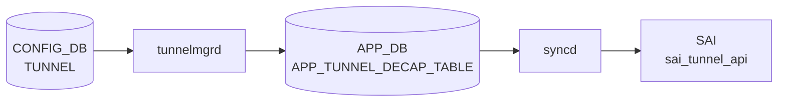

# TUNNEL テーブル

## 概要

SONiC Dual-ToR (Active-Standby) 構成で、ToR スイッチ間に張る [IPinIP](../../reference/glossary.md#term-ipinip) トンネルを定義するテーブル[^1]。`tunnelmgrd` が [CONFIG_DB](../../reference/glossary.md#term-config_db) の本テーブルを購読し、[APPL_DB](../../reference/glossary.md#term-appl_db) `TUNNEL_DECAP_TABLE` を生成。`tunneldecaporch` ([orchagent](../../reference/glossary.md#term-orchagent)) が [SAI](../../reference/glossary.md#term-sai) tunnel オブジェクトを作成する。

<!-- cdb-mermaid -->
### データフロー (自動生成)



!!! note "凡例"
    CONFIG_DB から SAI までの典型経路を `docs/reference/config-db-orch-map.md` から機械生成したミニ図。詳細・例外は本ページ本文と対応表を参照。
<!-- /cdb-mermaid -->

## key 構造

```text
TUNNEL|<mux_tunnel>
```

- `<mux_tunnel>`: `MuxTunnel<n>` の文字列パターン（[YANG](../../reference/glossary.md#term-yang) `pattern "MuxTunnel[0-9]+"`）

## フィールド

| フィールド | 型 | 説明 |
|-----------|----|------|
| `tunnel_type` | enum `IPINIP` | カプセル化方式。Dual-ToR では [IPinIP](../../reference/glossary.md#term-ipinip) 固定 |
| `src_ip` | leafref → `PEER_SWITCH.address_ipv4` | トンネル送信元 (= peer ToR の IPv4) |
| `dst_ip` | inet:ipv4-address | トンネル宛先 (自スイッチの IPv4) |
| `dscp_mode` | string `uniform`/`pipe` | [DSCP](../../reference/glossary.md#term-dscp) 継承モード |
| `ecn_mode` | string `copy_from_outer`/`standard` | デカプセル時 ECN 処理 |
| `encap_ecn_mode` | string `standard` | カプセル時 ECN マーキング |
| `ttl_mode` | string `uniform`/`pipe` | TTL 継承モード |
| `decap_dscp_to_tc_map` | string | デカプセル時 [DSCP](../../reference/glossary.md#term-dscp)→TC マップ名 |
| `decap_tc_to_pg_map` | string | デカプセル時 TC→PG マップ名 |
| `encap_tc_to_dscp_map` | string | カプセル時 TC→[DSCP](../../reference/glossary.md#term-dscp) マップ名 |
| `encap_tc_to_queue_map` | string | カプセル時 TC→Queue マップ名 |

## 制約

- `src_ip` は `PEER_SWITCH_LIST.address_ipv4` への leafref で、PEER_SWITCH に登録された IPv4 のみ使える
- `tunnel_type` は IPINIP のみ。`tunneldecaporch.cpp` も `tunnel_type != "IPINIP"` をエラーとする

## 購読者

- `tunnelmgrd` (cfgmgr): [CONFIG_DB](../../reference/glossary.md#term-config_db)→[APPL_DB](../../reference/glossary.md#term-appl_db) へ橋渡し
- `tunneldecaporch` ([orchagent](../../reference/glossary.md#term-orchagent)): [APPL_DB](../../reference/glossary.md#term-appl_db) `TUNNEL_DECAP_TABLE` 経由で [SAI](../../reference/glossary.md#term-sai) へ反映

## 関連 CONFIG_DB / YANG / CLI

- 関連 [CONFIG_DB](../../reference/glossary.md#term-config_db): `PEER_SWITCH`、`MUX_CABLE`、`TUNNEL_DECAP_TABLE` (派生は `docs/reference/config-db/tunnel-decap-table.md`)
- 関連 CLI: 直接の CLI は無く `config_db.json` で投入
- 関連 [YANG](../../reference/glossary.md#term-yang): `sonic-tunnel`、`sonic-peer-switch`

<!-- ref-triangle:start -->

## 関連リファレンス

- [YANG](../../reference/glossary.md#term-yang): [`sonic-tunnel`](../yang/sonic-tunnel.md) / `sonic-peer-switch`

<!-- ref-triangle:end -->

## 引用元

[^1]: YANG 定義: `sonic-tunnel.yang`. <https://github.com/sonic-net/sonic-buildimage/blob/9ea932ec2e18f35e58268ec2e4456b1d4afd65cd/src/sonic-yang-models/yang-models/sonic-tunnel.yang>; [orchagent](../../reference/glossary.md#term-orchagent) 側パース: `tunneldecaporch.cpp`. <https://github.com/sonic-net/sonic-swss/blob/4305596156d70e9797e8a881b3d19b46de0bce0d/orchagent/tunneldecaporch.cpp>

<!-- value-behavior -->
## 値依存挙動マトリクス

### `tunnel_type`: `IPINIP` のみ (YANG pattern 制約)

### `dscp_mode`: `uniform` / `pipe`

### `ecn_mode`: `copy_from_outer` / `standard`

### `encap_ecn_mode`: `standard` のみ (YANG pattern 制約)

### `ttl_mode`: `uniform` / `pipe`

| フィールド | 値 | 挙動 |
|-----------|-----|-----|
| `tunnel_type` | `IPINIP` | [tunnelmgrd](../../reference/glossary.md#term-tunnelmgrd) が APPL_DB へ通知。[SAI](../../reference/glossary.md#term-sai) tunnel オブジェクト作成 |
| `tunnel_type` | `IPINIP` 以外 | キャッシュには追加されるが APPL_DB に通知されない |
| `dscp_mode` | `uniform` | 外側ヘッダの DSCP を内側パケットにコピー |
| `dscp_mode` | `pipe` | 内側ヘッダの DSCP を保持 |
| `ecn_mode` | `copy_from_outer` | 外側 ECN フィールドを内側にコピー |
| `ecn_mode` | `standard` | RFC 6040 準拠 ECN 処理 |
| `ttl_mode` | `uniform` | 外側 TTL を内側にコピー |
| `ttl_mode` | `pipe` | 内側 TTL を保持 |
| `src_ip` | 未設定 (空) | P2MP (ワイルドカード) decap term 作成 — 全 [IPinIP](../../reference/glossary.md#term-ipinip) を受け入れる |
| `src_ip` | `PEER_SWITCH` に未登録の IP | YANG leafref 違反で CONFIG_DB 書き込み拒否 |
| `ecn_mode` | 設定後に変更 | SAI create-only 属性のため変更不可。削除→再作成が必要 |

<!-- /value-behavior -->

<!-- cdb-exceptions -->
## 例外条件・特殊挙動

<!-- evidence: sonic-swss/cfgmgr/tunnelmgr.cpp@4305596156d70e9797e8a881b3d19b46de0bce0d L160-315 -->

- **Peer IP 未設定時はトンネル未作成**: `PEER_SWITCH` テーブルから `m_peerIp` が取得できない場合、`"Peer/Remote IP not configured"` を LOG_NOTICE して APPL_DB への書き込みをスキップする。Peer IP 設定後に再処理される。
- **存在しないトンネルの DEL**: キャッシュに存在しないトンネルへの DEL は `"Tunnel <name> not found"` を LOG_ERROR し `return true`（タスクは消費され再試行なし）。
- **IPINIP 以外は APPL_DB 不通知**: `tunnel_type` が `IPINIP` 以外の場合、キャッシュには追加されるが orchagent への APPL_DB 通知は行われない。
- **Warm reboot 時の重複防止**: `m_tunnelReplay` にエントリが存在する場合（ウォームリブート時）は APPL_DB への書き込みをスキップして orchagent クラッシュを防ぐ。
- **`src_ip` 未設定で P2MP decap**: `src_ip` が空のまま SET すると `P2MP`（ワイルドカード）タイプの decap term が作成される。意図せず全 IPinIP トンネルパケットを受け入れる設定になる点に注意。
- **カーネル `ip tunnel add` 失敗**: コマンド実行失敗で `configIpTunnel()` が `false` を返すとタスクがキューに戻されリトライされる。

<!-- /cdb-exceptions -->

<!-- ops-hint -->
## 運用ヒント

### 典型値

- key 形式: `TUNNEL|<tunnel-name>`。
- `tunnel_type`: `IPINIP` 等。
- `src_ip` / `dst_ip`、`encap_ecn_mode`、`ttl_mode`。

### よくある誤設定

- dual-ToR で `tunnel_type` を両 ToR で揃えないと MUX_CABLE 経由のトラフィックが片方向 drop。

### 確認コマンド

```bash
sonic-db-cli CONFIG_DB keys 'TUNNEL|*'
show tunnel
```
<!-- /ops-hint -->


<!-- derivation -->
## 派生・条件付き登録 (Phase 6/7)

### Phase 6: 自動派生

tunnelmgrd が `tunnel_type` の値から Linux トンネルインターフェース種別を自動決定する。`IPINIP` → `ipip` / `sit` トンネル、`GRE` → `gre` トンネル。`dscp_mode` の値から encapsulation モードを自動設定する。

### Phase 7: 条件付き登録 (add_manager 条件)

tunnelmgrd は常時起動し `TUNNEL` テーブルを無条件購読する。`src_ip` が `LOOPBACK_INTERFACE` に存在しない場合はトンネル local endpoint が解決不能でエラーとなる。VXLAN トンネルの場合は `VXLAN_TUNNEL` テーブルが別途使用される。

<!-- /derivation -->

<!-- handler-branching -->
### Phase 8: Handler メソッド内分岐

| Handler | 分岐条件 | 効果 | evidence |
|---|---|---|---|
| `tunnelmgrd` | `tunnel_type==IPINIP` | Linux ipip/sit トンネル IF 作成 | `tunnelmgrd` |
| `tunnelmgrd` | `tunnel_type==GRE` | Linux gre トンネル IF 作成 | `tunnelmgrd` |
| `tunnelmgrd` | `dscp_mode==pipe` | pipe encapsulation モード設定 | `tunnelmgrd` |
| `tunnelmgrd` | `dscp_mode==uniform` | uniform encapsulation モード設定 | `tunnelmgrd` |
| `tunnelmgrd` | `vrfname` フィールドあり | 指定 VRF にトンネル IF を配置 | `tunnelmgrd` |
| `tunnelmgrd` | `src_ip` が解決できない | ログエラー + リトライ待ち | `tunnelmgrd` |
| `tunnelmgrd` | del_handler | Linux トンネル IF を削除 | `tunnelmgrd` |

> **スキャン証跡**: `TUNNEL` はユーザースペースのトンネルインターフェース設定テーブル。`tunnel_type` と `dscp_mode` による分岐が主要。`src_ip` 依存の条件付き登録が Phase 7 に相当。

<!-- /handler-branching -->

<!-- runtime-trace -->
## CDB → 実コンテナ動作トレース

### 段階 1: Consumer 登録

- **orchagent / TunnelOrch** または **VxlanOrch**: `TUNNEL` テーブルを `SubscriberStateTable` で購読。

### 段階 2: CFG → APPL 翻訳

- TunnelOrch / VxlanOrch がトンネルパラメータを解析し APP_DB へ書き込む。

### 段階 3: APPL → SAI

- orchagent が `sai_tunnel_api->create_tunnel()` でトンネルオブジェクトを作成。
- VxLAN の場合は `sai_tunnel_api->create_tunnel_map()` も呼び出す。

### 段階 4: タイミング + 副作用

- 設定反映は orchagent 処理後数 ms 以内。
- 副作用: アンダーレイルートが存在しないと ECMP nexthop 解決ができずトンネルが inactive。

<!-- /runtime-trace -->
<!-- entry-points -->
## 書き込み入り口 (Direction A)

TUNNEL テーブルへの書き込みが発生するコード経路を網羅的に調査した結果。

### CLI

  - 専用 CLI なし — NVGRE トンネルは `config nvgre_tunnel`、VxLAN は `config vxlan` コマンド経由で別テーブルに投入

### minigraph / sonic-cfggen

minigraph.py に TUNNEL 直接生成なし

### REST / gNMI

REST/gNMI 書き込み経路なし

### db_migrator

**db_migrator.py** が TUNNEL テーブルのマイグレーション処理を実装 (sonic-utilities/scripts/db_migrator.py)

### ビルド時デフォルト (build-time default)

なし

### ハードコードデフォルト / ランタイム注入

なし

### 死活・デッドコード

TUNNEL テーブルはレガシー汎用トンネルテーブル; 現行は VXLAN_TUNNEL / NVGRE_TUNNEL が使用される
<!-- /entry-points -->

<!-- defaults -->
## 暗黙デフォルト・コード由来挙動 (Phase A)

以下は YANG に default 節がなく、コード実装から導出した暗黙の挙動。

| フィールド | 省略/未設定時の挙動 | ソース証跡 |
|-----------|-------------------|-----------|
| `tunnel_type` | `tunInfo.type=""` で IPINIP 判定不通過 → SET 無視 | `tunnelmgr.cpp` L250 |
| `src_ip` | `term_type=P2MP` (ワイルドカード) decap term 作成 — 全 IPinIP を受け入れ | `tunnelmgr.cpp` L280-289 |
| `dst_ip` | APPL_DB `TUNNEL_DECAP_TABLE` エントリには**書かれない** (copy_if でフィルタ除外)。decap term キー (`tunnel_name\|dst_ip`) のみに使用 | `tunnelmgr.cpp` L271-289 |
| `dscp_mode` | `SAI_TUNNEL_ATTR_DECAP_DSCP_MODE` の `attr.value.s32` が**未初期化**のまま SAI push → SAI 実装依存の挙動 | `tunneldecaporch.cpp` L820-829 |
| `ttl_mode` | `dscp_mode` と同様に未初期化整数が SAI push | `tunneldecaporch.cpp` L808-817 |
| `ecn_mode` | SAI attr 未設定 (値が一致しない場合は `valid=false`)。**create-only**: 既存トンネルへの変更 SET で `valid=false` → SET 全体失敗 | `tunneldecaporch.cpp` L168-183 |
| `encap_ecn_mode` | 省略時は SAI attr 未送信 (`if (!encap_ecn.empty())` ガード)。**create-only**: 既存トンネルへの変更で SET 全体失敗 | `tunneldecaporch.cpp` L797-805 |
| `decap_dscp_to_tc_map` | SAI attr 未設定 (`SAI_NULL_OBJECT_ID` 時は push しない) | `tunneldecaporch.cpp` L831-837 |
| `decap_tc_to_pg_map` | SAI attr 未設定 | `tunneldecaporch.cpp` L839-845 |
| `encap_tc_to_dscp_map` | `tunnelTable` 内に記録のみ、SAI には push しない (muxorch が `getQosMapId()` で取得) | `tunneldecaporch.cpp` L255-258 |
| `encap_tc_to_queue_map` | `encap_tc_to_dscp_map` と同様、record only | `tunneldecaporch.cpp` L271-274 |

### ハードコード値（CONFIG_DB 非連動）

| 定数 | 値 | 説明 |
|------|----|------|
| `TUNIF` | `"tun0"` | Linux kernel IPinIP トンネル IF 名 (固定、変更不可) |
| `LOOPBACK_SRC` | `"Loopback3"` | kernel トンネルの src アドレスを取得する Loopback IF (固定) |
| `OVERLAY_RIF_DEFAULT_MTU` | `9100` | Overlay loopback router interface の MTU (固定) |

### YANG-実装 discrepancy

`dst_ip` は YANG `TUNNEL_LIST` のフィールドとして定義されているが、`tunnelmgrd` は APPL_DB `TUNNEL_DECAP_TABLE` へコピーする際に **明示的に除外** する (`copy_if` フィルタ)。YANG を見て APPL_DB スキーマを推測すると `dst_ip` が tunnel エントリにあると誤解する。実際は decap term のキー部分 (`MuxTunnel0|<dst_ip>`) にのみ使われる。

### 書込み順依存

- `PEER_SWITCH.address_ipv4` が設定される前に `TUNNEL` SET が来ると、`m_peerIp` が空 → Linux kernel tunnel 未作成 (`configIpTunnel()` スキップ)。PEER_SWITCH 設定後の再処理は起きない（再SET が必要）。
- `LOOPBACK_INTERFACE|Loopback3` の prefix SET が `TUNNEL` SET より後に来ると kernel tunnel IF へのアドレス付与が遅延するが、後から届けばキャッシュ経由で付与される。
- `decap_dscp_to_tc_map` / `decap_tc_to_pg_map` に指定した QoS map が未作成の場合、`task_need_retry` で当該 tunnel の処理がスタックし続ける。

<!-- /defaults -->

<!-- ordering -->
## 書込み順依存 (Phase B)

### SET 操作の推奨順序

| 順序 | テーブル / 操作 | 理由 |
|------|----------------|------|
| 1 | `LOOPBACK_INTERFACE\|Loopback3\|<ip>` SET | `tun0` ローカル IP ソース (ハードコード `Loopback3`) |
| 2 | `PEER_SWITCH\|<name>` SET (`address_ipv4`) | `m_peerIp` 未設定時は Linux tunnel 未作成、**自動再処理なし** |
| 3 | QoS map テーブル SET（`DSCP_TO_TC_MAP` 等） | 未作成 map を参照すると `task_need_retry` 無限ループ |
| 4 | `TUNNEL\|MuxTunnel0` SET | 1-3 が揃ってから。`tunnel_type=IPINIP` 必須 |

### 変更不可フィールド（DEL → SET が必要）

- `ecn_mode` / `encap_ecn_mode`: SAI `create-only` 属性。既存トンネルへの変更 SET で `valid=false` となり、**SET 全体が無効化**される（他フィールドを含む）。変更には `TUNNEL` DEL 後に再 SET が必要。

### DEL 操作の安全順序

```
DEL MUX_CABLE|*        # TUNNEL を参照する MUX_CABLE エントリを先に削除
DEL TUNNEL|MuxTunnel0  # tunnelmgrd → APPL_DB DEL → tunneldecaporch → SAI DEL
DEL PEER_SWITCH|*      # TUNNEL DEL の後
```

> 詳細スキャンノート: `meta/_intermediate/cdb-flow/tunnel-ordering.md`

<!-- /ordering -->

<!-- cross-refs -->
## 暗黙参照テーブル (Phase C)

`TUNNEL` が CONFIG_DB に書かれると `tunnelmgrd`・`tunneldecaporch` が以下のテーブルを暗黙的に参照する。
`src_ip` → `PEER_SWITCH` は YANG leafref として明示されているが、他は実装コードのみに現れる暗黙依存。

| 参照先テーブル / リソース | 参照方向 | 条件 | 参照元 evidence |
|--------------------------|---------|------|----------------|
| `PEER_SWITCH\|<name>.address_ipv4` | YANG leafref (必須検証) | `src_ip` フィールドに値を設定したとき。未登録 IP は CONFIG_DB 書き込み拒否 | `sonic-tunnel.yang` L50-52; `tunnelmgr.cpp` L112-127 (`m_peerIp` 取得) |
| `LOOPBACK_INTERFACE\|Loopback3` | 読み取り（ハードコード） | 常時。`tun0` ローカル IP ソース (`#define LOOPBACK_SRC "Loopback3"`)。TUNNEL SET より先に prefix SET 必要 | `tunnelmgr.cpp` L19, L339, L405 |
| `DSCP_TO_TC_MAP\|<name>` | OID 解決（`gQosOrch->resolveTunnelQosMap`） | `decap_dscp_to_tc_map` フィールドに値を指定したとき。未作成 map は `task_need_retry` 無限待機 | `tunneldecaporch.cpp` L215-221; `qosorch.cpp` L113 |
| `TC_TO_PRIORITY_GROUP_MAP\|<name>` | OID 解決（`gQosOrch->resolveTunnelQosMap`） | `decap_tc_to_pg_map` フィールドに値を指定したとき。未作成 map は `task_need_retry` 無限待機 | `tunneldecaporch.cpp` L230-236; `qosorch.cpp` L114 |
| `TC_TO_DSCP_MAP\|<name>` | OID 解決（`gQosOrch->resolveTunnelQosMap`） | `encap_tc_to_dscp_map` フィールドに値を指定したとき。OID は `tunnelTable` に記録。SAI 直接 push なし（muxorch が `getQosMapId()` で取得） | `tunneldecaporch.cpp` L245-257; `qosorch.cpp` L115 |
| `TC_TO_QUEUE_MAP\|<name>` | OID 解決（`gQosOrch->resolveTunnelQosMap`） | `encap_tc_to_queue_map` フィールドに値を指定したとき。`encap_tc_to_dscp_map` と同様、muxorch 経由で利用 | `tunneldecaporch.cpp` L260-272; `qosorch.cpp` L116 |
| `MUX_CABLE`（逆参照） | 下流が TUNNEL を読み取り | `MuxOrch` が MUX_CABLE SET 処理時に `TunnelDecapOrch::getDstIpAddresses()` / `getDscpMode()` / `getQosMapId()` を呼び出す。TUNNEL DEL 前に MUX_CABLE を先に DEL しないとエラー | `muxorch.cpp` L2348-2377 |

!!! note "QoS map の事前作成必須"
    `decap_dscp_to_tc_map` / `decap_tc_to_pg_map` に指定する QoS map が未作成の場合、
    当該 TUNNEL エントリの処理が `task_need_retry` でスタックし続ける。
    TUNNEL SET 前に対応する `DSCP_TO_TC_MAP` / `TC_TO_PRIORITY_GROUP_MAP` を作成すること。

!!! note "LOOPBACK_INTERFACE|Loopback3 のハードコード依存"
    `tunnelmgrd` は `Loopback3` をハードコードで参照する (`LOOPBACK_SRC = "Loopback3"`)。
    Dual-ToR 環境では `LOOPBACK_INTERFACE|Loopback3|<ip/prefix>` の SET が
    TUNNEL SET より先であることを確認すること。後から届いてもキャッシュ経由で
    アドレスが付与されるが、カーネルトンネルの初期作成が遅延する可能性がある。

<!-- /cross-refs -->

<!-- failure -->
## 失敗挙動・リトライ・リカバリ (Phase D)

### tunnelmgr — SET 失敗経路

| 失敗条件 | 検出箇所 | 結果 | リトライ |
|---|---|---|---|
| `tunnel_type` が `IPINIP` 以外 | `doTunnelTask()` | APPL_DB 未通知。キャッシュには追加される | なし (恒久スキップ) |
| `m_peerIp` 空 (PEER_SWITCH 未設定) | `doTunnelTask()` L258-261 | LOG_NOTICE → Linux tunnel 未作成。PEER_SWITCH 設定後に TUNNEL 再 SET が必要 | **自動再処理なし** |
| `ip tunnel add` / `ip link set up` 失敗 | `configIpTunnel()` L391-416 | LOG_WARN のみ。関数は常に `true` を返すため APPL_DB 通知は実行。kernel IF なし状態で APPL_DB だけ設定される | なし |
| `configIpTunnel()` が `false` を返す | `doTunnelTask()` L254-256 | `return false` → `m_toSync` にタスク残留、次サイクルでリトライ | **自動リトライ** (無限ループの可能性) |
| 不明な operation type | `doTask()` L201-203 | LOG_ERROR → タスク消費 (恒久スキップ) | なし |

### tunnelmgr — DEL 失敗経路

| 失敗条件 | 検出箇所 | 結果 | リトライ |
|---|---|---|---|
| DEL 対象が `m_tunnelCache` に存在しない | `doTunnelTask()` L299-302 | `SWSS_LOG_ERROR("Tunnel %s not found")` → `return true`（タスク消費） | なし (恒久スキップ) |
| キャッシュにあるが `tunnel_type` が IPINIP 以外 | `doTunnelTask()` L312-314 | LOG_WARN → キャッシュ削除のみ、APPL_DB DEL は送られない | なし |

### tunneldecaporch — SET 失敗経路

| 失敗条件 | 検出箇所 | 結果 | リトライ |
|---|---|---|---|
| `tunnel_type` が `IPINIP` 以外 | L127-131 | LOG_ERROR → `valid=false` → タスク消費 | なし |
| `src_ip` が不正な IP 文字列 | L141-146 | LOG_ERROR → `valid=false` → タスク消費 | なし |
| `dscp_mode` / `ttl_mode` が不正値 | L155-160, L202-207 | LOG_ERROR → `valid=false` → タスク消費 | なし |
| `ecn_mode` が不正値 | L170-175 | LOG_ERROR → `valid=false` → タスク消費 | なし |
| 既存トンネルへの `ecn_mode` 変更 (SAI create-only) | L177-182 | LOG_WARN → `valid=false` → **SET 全体無効化**（他フィールドを含む） | なし。DEL → 再 SET が必要 |
| 既存トンネルへの `encap_ecn_mode` 変更 (SAI create-only) | L193-198 | LOG_NOTICE → `valid=false` → **SET 全体無効化** | なし。DEL → 再 SET が必要 |
| `encap_ecn_mode` が `standard` 以外 | L187-191 | LOG_ERROR → `valid=false` → タスク消費 | なし |
| 未知フィールド名 | L277-279 | LOG_ERROR → `valid=false` → タスク消費 | なし |
| QoS map が未作成 (`decap_dscp_to_tc_map` 等) | L217-266 | LOG_NOTICE → `task_need_retry` → `it++` でタスクキュー残留 | **自動リトライ** (QoS map 作成後に再処理) |
| `addDecapTunnel()` 失敗 (SAI create_tunnel 失敗) | L313 | LOG_ERROR → タスク消費。SAI エラー詳細は syncd ログで確認 | なし |

### tunneldecaporch — DEL 失敗経路

| 失敗条件 | 検出箇所 | 結果 | リトライ |
|---|---|---|---|
| DEL 対象が存在しない | L325-327 | `SWSS_LOG_ERROR("Tunnel cannot be removed since it doesn't exist")` → タスク消費 | なし |

### 重要な設計上の注意点

- **`configIpTunnel()` は常に `true` を返す**: Linux kernel コマンドが失敗しても LOG_WARN のみ。kernel IF なし状態で APPL_DB だけ設定される可能性がある
- **create-only 属性の罠**: `ecn_mode` / `encap_ecn_mode` は SAI create-only 属性。既存トンネルへの SET で `valid=false` となり**同一 SET 内の他フィールド更新も全て無効化**される
- **PEER_SWITCH 先行設定必須**: `m_peerIp` 空の場合 Linux tunnel IF 未作成。PEER_SWITCH を後設定しても `tunnelmgrd` 自動再処理は発生しないため TUNNEL 再 SET が必要

### 回復シナリオまとめ

| 失敗ケース | 回復方法 | 自動か手動か |
|-----------|---------|------------|
| `tunnel_type` 不正 / 未知フィールド | 正しい値を再投入 | 手動 |
| `m_peerIp` 空 (PEER_SWITCH 未設定) | PEER_SWITCH 設定後に TUNNEL 再 SET | 手動 |
| `ip tunnel add` 失敗 (kernel エラー) | 根本原因解決後 `tunnelmgrd` 自動リトライ | 自動リトライ |
| `ecn_mode` / `encap_ecn_mode` 変更 | `TUNNEL` DEL → 再 SET | 手動 |
| QoS map 未作成 | QoS map SET 後 orchagent が自動再処理 | 自動 |
| SAI `create_tunnel` 失敗 | syncd ログ確認後 再 SET | 手動 |
| DEL 対象不存在 | 操作なし (確認のみ) | — |

> 詳細スキャンノート: `meta/_intermediate/cdb-flow/tunnel-failure.md`

<!-- /failure -->

<!-- constants -->
## ハードコード定数 (Phase E)

CONFIG_DB の TUNNEL テーブルから読み込まれず、コードに直書きされている定数。`config_db.json` での設定変更は効果なく、変更にはコードのリコンパイルが必要。

| 定数名 | 値 | 定義場所 | 用途 |
|--------|----|---------|------|
| `IPINIP` | `"IPINIP"` | `tunnelmgr.cpp` L17 | `tunnel_type` 比較用マクロ。`tunnel_type != IPINIP` でエラー判定 |
| `TUNIF` | `"tun0"` | `tunnelmgr.cpp` L18 | Linux kernel IPinIP トンネル IF 名。固定。`ip tunnel add tun0 ...` で作成 |
| `LOOPBACK_SRC` | `"Loopback3"` | `tunnelmgr.cpp` L19 | カーネルトンネルのローカル IP を取得する Loopback IF 名。`LOOPBACK_INTERFACE|Loopback3` が存在しない環境ではトンネル動作不可 |
| `OVERLAY_RIF_DEFAULT_MTU` | `9100` | `tunneldecaporch.cpp` L14 | Overlay loopback ルータインターフェースの MTU。`SAI_ROUTER_INTERFACE_ATTR_MTU` として SAI に渡す |
| `MUX_TUNNEL` | `"MuxTunnel0"` | `tunneldecaporch.h` L21 | [MuxOrch](../../reference/glossary.md#term-muxorch) が固定参照する Dual-ToR トンネル名。TUNNEL テーブルのキーがこの値でない場合 MuxOrch はトンネルを見つけられずエラー |
| `SubnetDecapConfig.tunnel` | `"IPINIP_SUBNET"` | `tunneldecaporch.h` L101 | サブネット decap 用 IPv4 トンネル内部識別子 |
| `SubnetDecapConfig.tunnel_v6` | `"IPINIP_SUBNET_V6"` | `tunneldecaporch.h` L102 | サブネット decap 用 IPv6 トンネル内部識別子 |

!!! warning "MuxTunnel0 固定名の制約"
    [YANG](../../reference/glossary.md#term-yang) パターン `"MuxTunnel[0-9]+"` で複数エントリを許容しているが、
    `MuxOrch` は `MuxTunnel0` をハードコードで参照する。
    トンネル名を `MuxTunnel1` 等にすると MuxOrch が対象を見つけられず Dual-ToR が機能しない。

> 詳細スキャンノート: `meta/_intermediate/cdb-flow/tunnel-constants.md`

<!-- /constants -->

<!-- glossary-links-injected: ae9e20070353 -->
