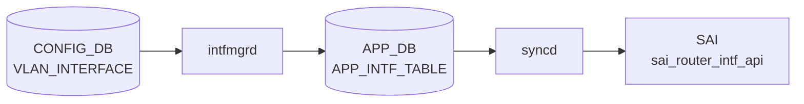

# VLAN_INTERFACE テーブル

## 概要

VLAN を L3 IF (SVI) として扱う設定を保持する。VRF / VNET binding、IP アサイン、NAT zone、MPLS、IPv6 link-local、grat ARP / proxy ARP、loopback action、MAC を持つ[^1]。

<!-- cdb-mermaid -->
### データフロー (自動生成)



!!! note "凡例"
    CONFIG_DB から SAI までの典型経路を `docs/reference/config-db-orch-map.md` から機械生成したミニ図。詳細・例外は本ページ本文と対応表を参照。
<!-- /cdb-mermaid -->

## key 構造

```
VLAN_INTERFACE|<name>                       # 属性ロウ
VLAN_INTERFACE|<name>|<ip_prefix>           # IP プレフィクス
```

`<name>` は `VLAN.name` への leafref（例: `Vlan100`）。

## 属性ロウのフィールド一覧

| フィールド | 型 | 必須 | デフォルト | 説明 |
|-----------|----|------|-----------|------|
| `name` (key) | leafref `VLAN.name` | ✅ | - | VLAN 名 |
| `vrf_name` | leafref `VRF.name` | - | - | バインドする VRF |
| `vnet_name` | leafref `VNET.name` | - | - | バインドする VNET |
| `nat_zone` | uint8 (0..3) | - | `0` | NAT zone |
| `mpls` | enum `enable`/`disable` | - | - | MPLS routing |
| `grat_arp` | string `enabled`/`disabled` | - | - | gratuitous ARP |
| `proxy_arp` | string `enabled`/`disabled` | - | - | proxy ARP |
| `ipv6_use_link_local_only` | `mode-status` | - | `disable` | IPv6 link-local のみ |
| `mac_addr` | mac-address | - | - | 管理者指定 MAC |
| `loopback_action` | `loopback_action` | - | - | ingress→same-IF routing 動作 |

## IP プレフィクスロウ

| フィールド | 型 | 必須 | 説明 |
|-----------|----|------|------|
| `name` (key) | leafref `VLAN.name` | ✅ | VLAN 名（`VLAN_INTERFACE_LIST` に存在することを `must` で要求） |
| `ip-prefix` (key) | union (v4/v6 prefix) | ✅ | IP/プレフィクス |
| `scope` | enum `global`/`local` | - | アドレススコープ |
| `family` | `ip-family` | - | family。`ip-prefix` と整合する `must` |
| `secondary` | boolean | - | secondary subnet フラグ |

## 購読者

- `intfmgrd`: VRF / MAC / MPLS / IPv6 LL / proxy_arp / grat_arp を Linux に反映
- `orchagent` `IntfsOrch`: SAI ルータインタフェースを生成
- `arpresponder` 等: proxy ARP / grat ARP を扱う

## 関連 CONFIG_DB / YANG / CLI

- 関連 CONFIG_DB: `VLAN`、`VLAN_MEMBER`、`VRF`、`VNET`
- 関連 CLI: `config interface ip add/remove Vlan<id>`、`config vlan proxy_arp`
- 関連 YANG: `sonic-vlan`

<!-- ref-triangle:start -->

## 関連リファレンス

- YANG: [`sonic-vlan`](../yang/sonic-vlan.md)
- CLI: [`config interface`](../cli/config-interface.md)

<!-- ref-triangle:end -->

## 引用元

[^1]: YANG 定義: `sonic-vlan.yang` 内 `VLAN_INTERFACE`。<https://github.com/sonic-net/sonic-buildimage/blob/9ea932ec2e18f35e58268ec2e4456b1d4afd65cd/src/sonic-yang-models/yang-models/sonic-vlan.yang#L71>

<!-- topics-back-ref -->
## 関連 Topics

- [Topics: L2 / VLAN / LAG / MC-LAG](../../topics/06-l2-vlan-lag/index.md)

<!-- /topics-back-ref -->
