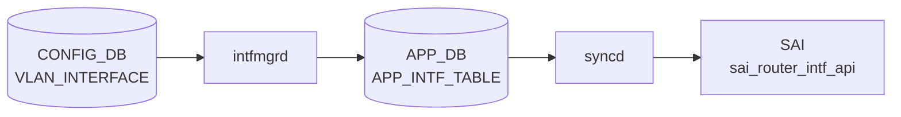

# VLAN_INTERFACE テーブル

## 概要

[VLAN](../../reference/glossary.md#term-vlan) を L3 IF (SVI) として扱う設定を保持する。[VRF](../../reference/glossary.md#term-vrf) / [VNET](../../reference/glossary.md#term-vnet) binding、IP アサイン、[NAT](../../reference/glossary.md#term-nat) zone、[MPLS](../../reference/glossary.md#term-mpls)、IPv6 link-local、grat [ARP](../../reference/glossary.md#term-arp) / proxy [ARP](../../reference/glossary.md#term-arp)、loopback action、MAC を持つ[^1]。

<!-- cdb-mermaid -->
### データフロー (自動生成)



!!! note "凡例"
    CONFIG_DB から SAI までの典型経路を `docs/reference/config-db-orch-map.md` から機械生成したミニ図。詳細・例外は本ページ本文と対応表を参照。
<!-- /cdb-mermaid -->

## key 構造

```text
VLAN_INTERFACE|<name>                       # 属性ロウ
VLAN_INTERFACE|<name>|<ip_prefix>           # IP プレフィクス
```

`<name>` は `VLAN.name` への leafref（例: `Vlan100`）。

## 属性ロウのフィールド一覧

| フィールド | 型 | 必須 | デフォルト | 説明 |
|-----------|----|------|-----------|------|
| `name` (key) | leafref `VLAN.name` | ✅ | - | [VLAN](../../reference/glossary.md#term-vlan) 名 |
| `vrf_name` | leafref `VRF.name` | - | - | バインドする [VRF](../../reference/glossary.md#term-vrf) |
| `vnet_name` | leafref `VNET.name` | - | - | バインドする [VNET](../../reference/glossary.md#term-vnet) |
| `nat_zone` | uint8 (0..3) | - | `0` | [NAT](../../reference/glossary.md#term-nat) zone |
| `mpls` | enum `enable`/`disable` | - | - | [MPLS](../../reference/glossary.md#term-mpls) routing |
| `grat_arp` | string `enabled`/`disabled` | - | - | gratuitous [ARP](../../reference/glossary.md#term-arp) |
| `proxy_arp` | string `enabled`/`disabled` | - | - | proxy ARP |
| `ipv6_use_link_local_only` | `mode-status` | - | `disable` | IPv6 link-local のみ |
| `mac_addr` | mac-address | - | - | 管理者指定 MAC |
| `loopback_action` | `loopback_action` | - | - | ingress→same-IF routing 動作 |

## IP プレフィクスロウ

| フィールド | 型 | 必須 | 説明 |
|-----------|----|------|------|
| `name` (key) | leafref `VLAN.name` | ✅ | [VLAN](../../reference/glossary.md#term-vlan) 名（`VLAN_INTERFACE_LIST` に存在することを `must` で要求） |
| `ip-prefix` (key) | union (v4/v6 prefix) | ✅ | IP/プレフィクス |
| `scope` | enum `global`/`local` | - | アドレススコープ |
| `family` | `ip-family` | - | family。`ip-prefix` と整合する `must` |
| `secondary` | boolean | - | secondary subnet フラグ |

## 購読者

- `intfmgrd`: [VRF](../../reference/glossary.md#term-vrf) / MAC / [MPLS](../../reference/glossary.md#term-mpls) / IPv6 LL / proxy_arp / grat_arp を Linux に反映
- `orchagent` `IntfsOrch`: [SAI](../../reference/glossary.md#term-sai) ルータインタフェースを生成
- `arpresponder` 等: proxy ARP / grat ARP を扱う

## 関連 CONFIG_DB / YANG / CLI

- 関連 [CONFIG_DB](../../reference/glossary.md#term-config_db): `VLAN`、`VLAN_MEMBER`、`VRF`、`VNET`
- 関連 CLI: `config interface ip add/remove Vlan<id>`、`config vlan proxy_arp`
- 関連 [YANG](../../reference/glossary.md#term-yang): `sonic-vlan`

<!-- defaults -->
## コード由来の暗黙デフォルト

> 以下はコード精読により導出した暗黙デフォルト・dead field・乖離の一覧。YANG 定義にない挙動を含む[^d1][^d2]。

| フィールド | 省略・空時の実挙動 | 導出元 |
|-----------|-----------------|--------|
| `nat_zone` | YANG `default "0"`。[orchagent](../../reference/glossary.md#term-orchagent) 変数も `0` 初期化。NAT 非対応プラットフォームでは [SAI](../../reference/glossary.md#term-sai) に送信されず `SWSS_LOG_NOTICE` のみ | YANG L111; [intfsorch](../../reference/glossary.md#term-intfsorch).cpp:713,984 |
| `mpls` | `empty()` を `"disable"` と等価に扱う (`sysctl input=0`)。sysctl 失敗は省略時 silent。[SAI](../../reference/glossary.md#term-sai) `ADMIN_MPLS_STATE` はデフォルト disabled のため [RIF](../../reference/glossary.md#term-rif) create attrs に含まれない | intfmgr.cpp:178-189; [intfsorch](../../reference/glossary.md#term-intfsorch).cpp:1276-1284 |
| `proxy_arp` | カーネル/SAI 操作なし。[orchagent](../../reference/glossary.md#term-orchagent) 内部フラグ `proxy_arp=false` 固定 | [intfsorch](../../reference/glossary.md#term-intfsorch).cpp:501,845 |
| `grat_arp` | カーネル操作なし | intfmgr.cpp:1038-1051 |
| `ipv6_use_link_local_only` | YANG `default disable`。省略時は `m_ipv6LinkLocalModeList` への追加なし（通常 IPv6 割当） | YANG L138; intfmgr.cpp:913 |
| `mac_addr` | intfmgr が `00:00:00:00:00:00` を APP_DB へ書く。[orchagent](../../reference/glossary.md#term-orchagent) はゼロ MAC を受け取ると `gMacAddress`（スイッチ全体 MAC）を SAI に適用 | intfmgr.cpp:1019; intfsorch.cpp:1199-1207 |
| `loopback_action` | intfmgr も orchagent も省略時は SAI attrs に含めない。SAI 実装依存デフォルト（多くは `forward`） | intfsorch.cpp:1187-1195,999 |
| `vrf_name` | orchagent が `gVirtualRouterId`（デフォルト VRF）を使用 | intfsorch.cpp:823 |
| `vnet_name` | 省略時は通常 VRF 経路。`vnet_name` と `vrf_name` を同時指定した場合 `vnet_name` が優先される | intfsorch.cpp:933-957 |
| `scope` (IP prefix) | **dead field**: [CONFIG_DB](../../reference/glossary.md#term-config_db) 値は読まれず、intfmgr が常に `"global"` を APP_DB へ書く | intfmgr.cpp:1134 |
| `family` (IP prefix) | **dead field**: [CONFIG_DB](../../reference/glossary.md#term-config_db) 値は読まれず、intfmgr が ip-prefix の型から自動判定して APP_DB へ書く | intfmgr.cpp:1129 |
| `secondary` (IP prefix) | **dead consumer**: intfmgr・orchagent のどちらもこのフィールドを参照しない | intfmgr.cpp:784-829; intfsorch.cpp:720-814 |

[^d1]: `sonic-swss/cfgmgr/intfmgr.cpp` <https://github.com/sonic-net/sonic-swss/blob/master/cfgmgr/intfmgr.cpp>
[^d2]: `sonic-swss/orchagent/intfsorch.cpp` <https://github.com/sonic-net/sonic-swss/blob/master/orchagent/intfsorch.cpp>

<!-- /defaults -->

<!-- constants -->
## ハードコード定数

> コード精読（`intfmgr.cpp` / `intfsorch.cpp` / `portsorch.cpp`）から抽出した数値・文字列定数。YANG 定義には現れないが実挙動を決定する[^c1][^c2][^c3]。

| 定数 / マジック値 | 値 | 定義箇所 | 用途 |
|-----------------|-----|---------|------|
| `DEFAULT_MTU_STR` | `9100` | `intfmgr.cpp:29` | VLAN IF の省略時 MTU。`ip link` コマンドに渡す |
| `LOOPBACK_DEFAULT_MTU_STR` | `"65536"` | `intfmgr.cpp:28` | Loopback ダミー IF 専用。VLAN IF には非適用 |
| `grat_arp=enabled` → `arp_accept` | `"2"` | `intfmgr.cpp:582` | `/proc/sys/net/ipv4/conf/<IF>/arp_accept` に書く値（値 `1` とは意味が異なる） |
| `grat_arp=disabled` → `arp_accept` | `"0"` | `intfmgr.cpp:586` | 同ファイルへの無効化値 |
| `accept_untracked_na` (IPv6) | `"2"` / `"0"` | `intfmgr.cpp:608` | IPv6 NA 用カーネルパラメータ。カーネル非対応時はスキップ |
| `proxy_arp=enabled` → `/proxy_arp` | `"1"` | `intfmgr.cpp:624,642` | `/proc/sys/net/ipv4/conf/<IF>/proxy_arp` と `proxy_arp_pvlan` に書く値 |
| `proxy_arp=disabled` → `/proxy_arp` | `"0"` | `intfmgr.cpp:628,642` | 同ファイルへの無効化値 |
| `sysctl mpls input` (enabled) | `1` | `intfmgr.cpp:176` | `net.mpls.conf.<IF>.input=1` で MPLS 有効化 |
| `sysctl mpls input` (disabled) | `0` | `intfmgr.cpp:180` | `net.mpls.conf.<IF>.input=0` で MPLS 無効化 |
| `mac_addr` 省略時 APP_DB 値 | `"00:00:00:00:00:00"` | `intfmgr.cpp:1019` | ゼロ MAC を APP_DB へ書く。orchagent はゼロ MAC 受信時にスイッチ全体 MAC (`gMacAddress`) を SAI に適用 |
| `scope` 固定値 | `"global"` | `intfmgr.cpp:1134` | IP prefix ロウの `scope` は常に `"global"` を APP_DB へ書く（CONFIG_DB 値無視） |
| `family` 自動判定値 | `IPV4_NAME` / `IPV6_NAME` | `intfmgr.cpp:1129` | IP prefix の型 (`isV4()`) から自動判定（CONFIG_DB 値無視） |
| `admin_status` フォールバック | `"up"` | `intfmgr.cpp:863,868` | 省略・不正値時に `"up"` へ強制補完（`SWSS_LOG_WARN` あり） |
| `nat_zone_id` 初期値 | `0` (uint32) | `intfsorch.cpp:713` | `nat_zone` 省略時の orchagent 内部変数。NAT 非対応プラットフォームでは SAI へ送信しない |
| `loopback_action` 変換テーブル | `"drop"` → `SAI_PACKET_ACTION_DROP` | `intfsorch.cpp:1150` | `getSaiLoopbackAction()` による文字列→SAI 定数マッピング |
| `loopback_action` 変換テーブル | `"forward"` → `SAI_PACKET_ACTION_FORWARD` | `intfsorch.cpp:1151` | 同上。省略時は attrs に含めず SAI 実装依存デフォルト（多くは `forward`） |
| `SAI_ROUTER_INTERFACE_ATTR_ADMIN_MPLS_STATE` | 省略（SAI 側デフォルト disabled） | `intfsorch.cpp:1278` | `mpls` 省略 / `disable` 時は [RIF](../../reference/glossary.md#term-rif) create attrs に含めない |
| `VLAN_PREFIX` | `"Vlan"` | `intfmgr.cpp:19` | VLAN インタフェース名判定用プレフィックス。`alias.compare(0, strlen(VLAN_PREFIX), VLAN_PREFIX)` で VLAN IF か否かを識別する |

[^c1]: `sonic-swss/cfgmgr/intfmgr.cpp` <https://github.com/sonic-net/sonic-swss/blob/master/cfgmgr/intfmgr.cpp>
[^c2]: `sonic-swss/orchagent/intfsorch.cpp` <https://github.com/sonic-net/sonic-swss/blob/master/orchagent/intfsorch.cpp>
[^c3]: `sonic-swss/orchagent/portsorch.cpp` <https://github.com/sonic-net/sonic-swss/blob/master/orchagent/portsorch.cpp>

<!-- /constants -->

<!-- value-behavior -->
## 値依存挙動マトリクス

| フィールド | 値 | 実挙動 |
|-----------|-----|--------|
| `mpls` | `enable` | `sysctl -w net.mpls.conf.<IF>.input=1` (intfmgr.cpp) |
| `mpls` | `disable` または空 | `sysctl -w net.mpls.conf.<IF>.input=0` |
| `proxy_arp` | `enabled` | `/proc/sys/net/ipv4/conf/<IF>/proxy_arp` / `proxy_arp_pvlan` に `1` |
| `proxy_arp` | `disabled` | 同ファイルに `0` |
| `proxy_arp` | その他 | `SWSS_LOG_ERROR("Proxy ARP state is invalid")` で処理中断 |
| `grat_arp` | `enabled` | `/proc/sys/net/ipv4/conf/<IF>/arp_accept` に `2`（accept_untracked_na も同値、カーネル対応時のみ） |
| `grat_arp` | `disabled` | 同ファイルに `0` |
| `grat_arp` | その他 | `SWSS_LOG_ERROR("GARP state is invalid")` で処理中断 |
| `ipv6_use_link_local_only` | `enable` | IPv6 link-local アドレスのみ付与。グローバル IPv6 アドレス付与不可 |
| `ipv6_use_link_local_only` | `disable` | 通常の IPv6 アドレス割当（デフォルト） |
| `loopback_action` | `drop` | 同一 IF に ingress/egress するパケットをドロップ |
| `loopback_action` | `forward` | 同一 IF に ingress/egress するパケットを転送 |
| `nat_zone` | `0` | [NAT](../../reference/glossary.md#term-nat) zone なし（デフォルト） |
| `nat_zone` | `1`〜`3` | 該当 NAT zone へのバインド |
| `vrf_name` | 変更 (既存 IF) | `isIntfChangeVrf()` で検出しエラー。削除後再 add が必要 |

<!-- /value-behavior -->

## 例外条件・特殊挙動 <!-- cdb-exceptions -->

<!-- evidence: sonic-swss/cfgmgr/intfmgr.cpp; sonic-buildimage/src/sonic-yang-models/yang-models/sonic-vlan.yang -->

- **VRF 変更禁止**: `intfmgrd` は既存 IF の VRF 変更を `isIntfChangeVrf()` で検出し `SWSS_LOG_ERROR("%s can not change to %s directly, skipping")` を記録してエントリを破棄する[^exc1]。
- **インタフェース未 ready**: `isIntfStateOk()` が false の場合リトライ待ち（"Interface is not ready, skipping"）[^exc1]。
- **VRF 未 ready**: VRF が [STATE_DB](../../reference/glossary.md#term-state_db) に未登録の場合もリトライ待ち[^exc1]。
- **`proxy_arp` / `grat_arp` / `mpls` 不正値**: 不正値の場合 `SWSS_LOG_ERROR("... state is invalid")` を記録して処理を中断[^exc1]。
- **デフォルト補完**: `admin_status` 省略時は `"up"` が補完される[^exc1]。YANG では `nat_zone` のデフォルト `0`、`ipv6_use_link_local_only` のデフォルト `disable`[^exc2]。

[^exc1]: `sonic-swss/cfgmgr/intfmgr.cpp` <https://github.com/sonic-net/sonic-swss/blob/master/cfgmgr/intfmgr.cpp>
[^exc2]: `sonic-buildimage/src/sonic-yang-models/yang-models/sonic-vlan.yang` <https://github.com/sonic-net/sonic-buildimage/blob/master/src/sonic-yang-models/yang-models/sonic-vlan.yang>

<!-- ordering -->
## 書込み順依存

> コード精読（`intfmgr.cpp` / `intfsorch.cpp`）から導出した書込み順序制約。順序違反は silent retry になるため注意。

### SET 時の必須前提条件

| 前提テーブル | 確認場所 | 理由 |
|------------|---------|------|
| `VLAN|Vlan<N>` + [vlanmgrd](../../reference/glossary.md#term-vlanmgrd) STATE_VLAN_TABLE ready | `intfmgr.cpp:653-660` | `isIntfStateOk()` が STATE_VLAN_TABLE を参照。未登録なら retry |
| `VRF|<name>` + [vrfmgrd](../../reference/glossary.md#term-vrfmgrd) STATE_VRF_TABLE ready | `intfmgr.cpp:839-842` | `vrf_name` 指定時のみ。未登録なら `return false` で retry |
| VNetOrch が `VNET|<name>` 処理済み | `intfsorch.cpp:933-939` | `vnet_name` 指定時のみ。orchagent 側チェック |
| PortsOrch が VLAN ポートオブジェクト生成済み | `intfsorch.cpp:905` | APP_DB → SAI 経路のチェック。CONFIG_DB 書込みとは独立 |

### 属性ロウ → IP プレフィクスロウ の順序

1. `VLAN_INTERFACE|Vlan<N>` を SET → [intfmgrd](../../reference/glossary.md#term-intfmgrd) が STATE_INTERFACE_TABLE に `vrf` を書く
2. STATE_INTERFACE_TABLE に alias エントリが存在する状態で `VLAN_INTERFACE|Vlan<N>|<ip_prefix>` を SET

```
CONFIG_DB: VLAN_INTERFACE|Vlan100  → (intfmgrd doIntfGeneralTask) → STATE_INTF_TABLE|Vlan100
CONFIG_DB: VLAN_INTERFACE|Vlan100|10.0.0.1/24  → (intfmgrd doIntfAddrTask, isIntfCreated check OK)
```

逆順で書いた場合は `isIntfCreated()` が false を返して retry キューに積まれる。最終的には収束するが遅れる。

### DEL 時の必須順序

1. `VLAN_INTERFACE|Vlan<N>|<ip_prefix>` をすべて DEL
2. `VLAN_INTERFACE|Vlan<N>` を DEL

属性ロウの DEL 時に `getIntfIpCount(alias) > 0` であれば `return false`（retry）。IP プレフィクスが残ったまま属性ロウを削除しようとしても適用されない（`intfmgr.cpp:1060-1063`）。

### VRF 変更は 2 ステップ必須

既存 VRF から別 VRF への直接変更は `isIntfChangeVrf()` が検出してエラーログを出し SAI には反映しない。

```
手順:
  1. VLAN_INTERFACE|Vlan<N>  vrf_name=""   (unbind)
  2. VLAN_INTERFACE|Vlan<N>  vrf_name=<new-VRF>  (rebind)
```

### warm-reboot 時の挙動

#### `buildIntfReplayList()` に VLAN_INTERFACE が含まれる

warm-start 時、[intfmgrd](../../reference/glossary.md#term-intfmgrd) は `buildIntfReplayList()` で `m_cfgVlanIntfTable.getKeys()` の結果を `m_pendingReplayIntfList` に追加する（`intfmgr.cpp:277-278`）。

```cpp
// intfmgr.cpp:277-278
m_cfgVlanIntfTable.getKeys(intfList);
std::copy(intfList.begin(), intfList.end(), std::inserter(m_pendingReplayIntfList, ...));
```

リストが空になった時点で `setWarmReplayDoneState()` を呼び `REPLAYED` → `RECONCILED` と遷移する。reconciliation ロジックはなく、カーネルへの再 replay で完了とみなされる。**VLAN が [STATE_DB](../../reference/glossary.md#term-state_db) で ready になってから VLAN_INTERFACE が replay 収束する** 順序は通常時と同じ。

#### `ipv6_use_link_local_only` は in-memory 状態がリセットされる

`m_ipv6LinkLocalModeList` は `std::set`（in-memory）。warm-reboot 後は空に戻るため、CONFIG_DB に `ipv6_use_link_local_only: enable` エントリが残っていても replay が再 SET を処理するまでの間は link-local モードが失われる。replay で CONFIG_DB 内容が再処理されれば収束する（`intfmgr.cpp:913`）。

### 書込み順依存まとめ

| 依存カテゴリ | 必須順序 | ソース |
|------------|---------|-------|
| VLAN → VLAN_INTERFACE | `VLAN` エントリ + [vlanmgrd](../../reference/glossary.md#term-vlanmgrd) の STATE_VLAN_TABLE ready が先 | `intfmgr.cpp:653-660` |
| VRF → VLAN_INTERFACE | `VRF` エントリ + [vrfmgrd](../../reference/glossary.md#term-vrfmgrd) の STATE_VRF_TABLE ready が先 | `intfmgr.cpp:839-842` |
| [VNET](../../reference/glossary.md#term-vnet) → VLAN_INTERFACE | VNetOrch が VNET 処理済みであること | `intfsorch.cpp:933-939` |
| 属性ロウ → IP prefix | `VLAN_INTERFACE\|Vlan<N>` SET → STATE_INTF 反映後に `VLAN_INTERFACE\|Vlan<N>\|<ip>` SET | `intfmgr.cpp:1115` |
| IP prefix DEL → 属性ロウ DEL | すべての IP prefix を DEL してから属性ロウを DEL | `intfmgr.cpp:1060-1063` |
| VRF 変更 2 ステップ | unbind (`vrf_name=""`) → rebind (`vrf_name=<新VRF>`) | `intfmgr.cpp:846-849` |
| warm-reboot replay | VLAN [STATE_DB](../../reference/glossary.md#term-state_db) ready 後に VLAN_INTERFACE replay 収束 | `intfmgr.cpp:277-278, 286-292` |

<!-- /ordering -->

<!-- ref-triangle:start -->

## 関連リファレンス

- [YANG](../../reference/glossary.md#term-yang): [`sonic-vlan`](../yang/sonic-vlan.md)
- CLI: [`config interface`](../cli/config-interface.md)

<!-- ref-triangle:end -->

## 引用元

[^1]: [YANG](../../reference/glossary.md#term-yang) 定義: `sonic-vlan.yang` 内 `VLAN_INTERFACE`。<https://github.com/sonic-net/sonic-buildimage/blob/9ea932ec2e18f35e58268ec2e4456b1d4afd65cd/src/sonic-yang-models/yang-models/sonic-vlan.yang#L71>

<!-- topics-back-ref -->
## 関連 Topics

- [Topics: L2 / VLAN / LAG / MC-LAG](../../topics/06-l2-vlan-lag/index.md)

<!-- /topics-back-ref -->

<!-- ops-hint -->
## 運用ヒント

### 典型値

- key 形式: `VLAN_INTERFACE|Vlan100` (L3 enable 行) と `VLAN_INTERFACE|Vlan100|10.0.0.1/24` (IP 行) の 2 段。
- `vrf_name`: `Vrfdefault` または `Vrf<name>`。

### よくある誤設定

- L3 enable 行を作らずに IP 行だけ投入すると IntfMgr が IP を作らない。
- `vrf_name` を後から変更しても既存 IP は古い VRF に残る。一旦 del してから再 add。

### 確認コマンド

```bash
sonic-db-cli CONFIG_DB keys 'VLAN_INTERFACE|*'
show ip interfaces
```
<!-- /ops-hint -->

<!-- pubsub -->
## 通信メカニズム (Redis Pub/Sub)

VLAN_INTERFACE テーブルは **2 系統の異なる購読方式** で伝搬する。

### CONFIG_DB → intfmgrd (SubscriberStateTable / keyspace notification)

`intfmgrd` は起動時に `Orch(cfgDb, tableNames)` を経由して `CFG_VLAN_INTF_TABLE_NAME`（`"VLAN_INTERFACE"`）を登録する。`Orch::addConsumer()` は CONFIG_DB (db_id=4) を検出すると `SubscriberStateTable` を選択し、以下の `PSUBSCRIBE` を発行する[^ps1][^ps2]。

```
PSUBSCRIBE __keyspace@4__:VLAN_INTERFACE|*
```

- CONFIG_DB の `notify-keyspace-events = "KEA"` が有効なため、CLI / minigraph 等が `HSET VLAN_INTERFACE|Vlan100 …` を書き込むと [Redis](../../reference/glossary.md#term-redis) が自動で `PUBLISH __keyspace@4__:VLAN_INTERFACE|Vlan100 hset` を発行する
- `SubscriberStateTable::pops()` がイベントチャンネルからキーを取り出し、`HGETALL VLAN_INTERFACE|Vlan100` で現在値を取得して `KeyOpFieldsValuesTuple` に変換する
- `op = "hset"` → `SET_COMMAND`、`op = "del"` → `DEL_COMMAND`

### intfmgrd → APPL_DB (ProducerStateTable / channel PUBLISH)

`IntfMgr` は `ProducerStateTable m_appIntfTableProducer(appDb, APP_INTF_TABLE_NAME)` を保持する[^ps1]。書き込み時は Lua スクリプトをアトミック実行する：

```
EVALSHA <luaSet>
  SADD INTF_TABLE_KEY_SET "Vlan100"
  HSET _INTF_TABLE|Vlan100 field1 val1 …
  PUBLISH INTF_TABLE_CHANNEL@0 "G"
```

PUBLISH ペイロードは固定文字列 `"G"`。

### APPL_DB → orchagent (ConsumerStateTable / channel SUBSCRIBE)

`orchagent` の `IntfsOrch` は [APPL_DB](../../reference/glossary.md#term-appl_db) (db_id=0) に対して `ConsumerStateTable` を使用し `INTF_TABLE_CHANNEL@0` を `SUBSCRIBE` する[^ps2][^ps3]。`consumer_state_table_pops.lua` が `SPOP INTF_TABLE_KEY_SET` → `HGETALL _INTF_TABLE|key` → 本体ハッシュへコピーをアトミック実行する。

### STATE_DB への書き戻し

`intfmgrd` は処理完了後に STATE_DB `STATE_INTERFACE_TABLE` へ TTL なしで書き込む：

| タイミング | 操作 |
|-----------|------|
| L3 IF 設定完了 | `hset(alias, "vrf", vrf_name)` |
| IP アドレス追加完了 | `hset(alias+"\|"+pfx, "state", "ok")` |
| IP / IF 削除 | `del(...)` |

**hSetWithTTL は使用されない。**

### 特性まとめ

| 特性 | 内容 |
|------|------|
| CONFIG_DB → [intfmgrd](../../reference/glossary.md#term-intfmgrd) | [Redis](../../reference/glossary.md#term-redis) PSUBSCRIBE (keyspace notification) |
| keyspace pattern | `__keyspace@4__:VLAN_INTERFACE\|*` |
| intfmgrd → [APPL_DB](../../reference/glossary.md#term-appl_db) | [Redis](../../reference/glossary.md#term-redis) PUBLISH/SUBSCRIBE (channel ベース) |
| Publish チャンネル | `INTF_TABLE_CHANNEL@0`、ペイロード固定 `"G"` |
| [APPL_DB](../../reference/glossary.md#term-appl_db) → orchagent | [ConsumerStateTable](../../reference/glossary.md#term-consumerstatetable) + `SUBSCRIBE` |
| NotificationConsumer | **不使用** |
| TTL / keyevent expire | **不使用** |
| Select タイムアウト | 1000ms → `intfmgr.doTask()` で未処理タスクを再試行 |
| warm-restart | `buildIntfReplayList()` で起動時に既存 STATE_DB をスキャン |
| chassis ([VOQ](../../reference/glossary.md#term-voq)) | `SubscriberStateTable(chassisAppDb, CHASSIS_APP_SYSTEM_INTERFACE_TABLE_NAME)` で追加購読 |

[^ps1]: `sonic-swss/cfgmgr/intfmgr.cpp` / `intfmgr.h` <https://github.com/sonic-net/sonic-swss/blob/master/cfgmgr/intfmgr.cpp>
[^ps2]: `sonic-swss/orchagent/orch.cpp` L1186-1195 (`Orch::addConsumer`) <https://github.com/sonic-net/sonic-swss/blob/master/orchagent/orch.cpp>
[^ps3]: `sonic-swss/orchagent/orchdaemon.cpp` L296 / `intfsorch.cpp` <https://github.com/sonic-net/sonic-swss/blob/master/orchagent/orchdaemon.cpp>

<!-- /pubsub -->

<!-- phase-g:start -->
## SAI RIF 生成経路の詳細

> ソース: `sonic-swss/orchagent/intfsorch.cpp` (L1180–1318)[^pg1]

### CONFIG_DB Subscribe — intfmgrd 登録経路

`IntfMgr` コンストラクタは `Orch(cfgDb, tableNames)` を呼び出す (`intfmgr.cpp:32`)。`tableNames` には `CFG_VLAN_INTF_TABLE_NAME`（= `"VLAN_INTERFACE"`）が含まれる。`Orch::addConsumer()` は cfgDb の db_id=4 を検出して **`SubscriberStateTable`** を生成し、Redis に対して以下の PSUBSCRIBE を発行する：

```
PSUBSCRIBE __keyspace@4__:VLAN_INTERFACE|*
```

| 項目 | 値 |
|------|-----|
| 購読クラス | `SubscriberStateTable` |
| keyspace db_id | 4 (CONFIG_DB) |
| keyspace パターン | `__keyspace@4__:VLAN_INTERFACE\|*` |
| pop 実装 | `SubscriberStateTable::pops()` — keyspace イベント受信後 `HGETALL` で最新値取得 |
| Select timeout | 1000 ms → `IntfMgr::doTask()` で `m_toSync` 未処理タスクをリトライ |

### orchagent — IntfsOrch の ConsumerStateTable

`IntfsOrch` は APP_DB (db_id=0) の `APP_INTF_TABLE_NAME`（`"INTF_TABLE"`）を `ConsumerStateTable` で購読する。`INTF_TABLE_CHANNEL@0` を `SUBSCRIBE` し、Lua スクリプト `consumer_state_table_pops.lua` で `SPOP` + `HGETALL` をアトミック実行する。

### SAI RIF 生成属性（VLAN IF 専用）

`IntfsOrch::addRouterIntfs()` (intfsorch.cpp:1180–1319) が VLAN ポートに対して `create_router_interface()` を呼ぶ際に設定する SAI 属性：

| SAI 属性 | 値（VLAN IF の場合） | 証拠 |
|---------|---------------------|------|
| `SAI_ROUTER_INTERFACE_ATTR_VIRTUAL_ROUTER_ID` | `vrf_id`（省略時 `gVirtualRouterId`） | intfsorch.cpp:1183 |
| `SAI_ROUTER_INTERFACE_ATTR_SRC_MAC_ADDRESS` | `port.m_mac` または `gMacAddress`（ゼロ MAC 時） | intfsorch.cpp:1196–1208 |
| `SAI_ROUTER_INTERFACE_ATTR_TYPE` | `SAI_ROUTER_INTERFACE_TYPE_VLAN` | intfsorch.cpp:1219–1221 |
| `SAI_ROUTER_INTERFACE_ATTR_VLAN_ID` | `port.m_vlan_info.vlan_oid` | intfsorch.cpp:1246–1248 |
| `SAI_ROUTER_INTERFACE_ATTR_MTU` | `port.m_mtu`（省略時 9100） | intfsorch.cpp:1272–1274 |
| `SAI_ROUTER_INTERFACE_ATTR_ADMIN_MPLS_STATE` | `true`（`mpls=enable` 時のみ。省略時は attrs に含めない） | intfsorch.cpp:1276–1285 |
| `SAI_ROUTER_INTERFACE_ATTR_NAT_ZONE_ID` | `port.m_nat_zone_id`（`gIsNatSupported` 時のみ） | intfsorch.cpp:1287–1294 |

PHY/[LAG](../../reference/glossary.md#term-lag) と異なり `SAI_ROUTER_INTERFACE_ATTR_PORT_ID` は使用せず、`SAI_ROUTER_INTERFACE_ATTR_VLAN_ID` に VLAN OID を直接設定する点が VLAN SVI の特徴。

### CONFIG_DB → SAI 完全経路サマリ

```
CLI / minigraph
  → HSET CONFIG_DB VLAN_INTERFACE|Vlan100 ...
  → Redis keyspace 通知 (PSUBSCRIBE __keyspace@4__:VLAN_INTERFACE|*)
  → IntfMgr::doTask() [intfmgr.cpp:1173]
      isIntfStateOk() / isIntfChangeVrf() チェック
  → ProducerStateTable EVALSHA
      SADD INTF_TABLE_KEY_SET "Vlan100"
      HSET _INTF_TABLE|Vlan100 ...
      PUBLISH INTF_TABLE_CHANNEL@0 "G"
  → IntfsOrch::doTask() [intfsorch.cpp:884]
      gPortsOrch->getPort() で VLAN OID 取得
      addRouterIntfs() [intfsorch.cpp:1180]
  → sai_router_intfs_api->create_router_interface(
        TYPE=SAI_ROUTER_INTERFACE_TYPE_VLAN,
        VLAN_ID=vlan_oid, MTU=9100, ...)
  → COUNTER_DB COUNTERS_RIF_NAME_MAP に alias → rif_id を登録
```

[^pg1]: `sonic-swss/orchagent/intfsorch.cpp` <https://github.com/sonic-net/sonic-swss/blob/master/orchagent/intfsorch.cpp>

<!-- phase-g:end -->

<!-- runtime-trace -->
## CDB → 実コンテナ動作トレース

### 段階 1: Consumer 登録

- **orchagent / IntfsOrch**: `VLAN_INTERFACE` テーブルを `SubscriberStateTable` で購読。

### 段階 2: CFG → APPL 翻訳

- IntfsOrch が VLAN L3 インタフェースの IP プレフィックスを APP_DB `INTF_TABLE` に書き込む。

### 段階 3: APPL → SAI

- IntfsOrch が `sai_router_interface_api->create_router_interface()` で VLAN に対する SAI RIF を作成。
- IP プレフィックスに対して `sai_route_api` でコネクテッドルートを作成。

### 段階 4: タイミング + 副作用

- VLAN テーブルが先に処理されている必要あり。未解決の場合は `task_need_retry`。
- 副作用: IP 削除時は関連 ARP エントリ・ルートが自動削除される。

<!-- /runtime-trace -->
<!-- entry-points -->
## 書き込み入り口

VLAN_INTERFACE テーブルへの書き込みが発生するコード経路を網羅的に調査した結果。

### CLI

  - `config interface ip add/remove <Vlan...> ...` — `config/main.py` が `set_entry('VLAN_INTERFACE', ...)` を呼ぶ ([sonic-utilities](../../reference/glossary.md#term-sonic-utilities)/config/main.py)

### minigraph / sonic-cfggen

**minigraph.py** が VLAN_INTERFACE に IP アドレスを投入 ([sonic-buildimage](../../reference/glossary.md#term-sonic-buildimage)/src/sonic-config-engine/minigraph.py)

### REST / gNMI

REST/[gNMI](../../reference/glossary.md#term-gnmi) 書き込み経路なし

### db_migrator

db_migrator.py での VLAN_INTERFACE マイグレーションなし

### ビルド時デフォルト (build-time default)

なし

### ハードコードデフォルト / ランタイム注入

なし

### 死活・デッドコード

なし
<!-- /entry-points -->

<!-- cross-refs -->
## 暗黙参照テーブル

> **Evidence**: `intfmgr.cpp`、`sonic-vlan.yang`、`dhcp4relay.cpp`、`config_interface.cpp`、`dhcp_cfggen.py`、`natconfig`、`neighbor_advertiser`、`filter_fdb_entries.py`、`xfmr_intf.go` 全行精読 (2026-05-15)

`VLAN_INTERFACE` は YANG leafref で `VLAN`・`VRF`・`VNET` を公式参照するほか、
実行時に以下のテーブルを**暗黙的に参照または被参照**する。

### 参照先 (VLAN_INTERFACE → 他テーブル)

| 参照先テーブル | YANG leafref | 参照フィールド | 実装上の必須度 | 証拠 |
|---|---|---|---|---|
| `VLAN\|<name>` | ✅ あり | `name` (key) | 必須 — 未処理なら `task_need_retry` | `intfmgr.cpp`; `sonic-vlan.yang` |
| `VRF\|<name>` | ✅ あり | `vrf_name` | 条件付き — STATE_DB 未登録ならリトライ | `intfmgr.cpp`; `sonic-vlan.yang` |
| `VNET\|<name>` | ✅ あり | `vnet_name` | 条件付き | `sonic-vlan.yang`; `orchagent` |

#### VLAN — task_need_retry による依存

`IntfsOrch` は VLAN_INTERFACE を処理する前に対応 VLAN テーブルが orchagent で完了済みである必要がある。
VLAN が未解決の場合は `task_need_retry` を返し保留する (`orchagent/intfsorch.cpp`)。

#### VRF — STATE_DB 経由の存在確認

`vrf_name` が設定された場合、`intfmgrd` は STATE_DB `VRF_TABLE|<name>` の存在を確認してから処理する。
VRF が未登録のままだと `m_toSync` に積まれ VRF 登録後にリトライされる (`intfmgr.cpp`)。

### 被参照 (他テーブル → VLAN_INTERFACE)

| 参照元コンポーネント | 参照方法 | YANG leafref | 実装上の意味 | 証拠 |
|---|---|---|---|---|
| `DHCP_SERVER_IPV4` (dhcpservd) | `get_config_db_table('VLAN_INTERFACE')` 全量読み取り | なし | サブネット・GW を VLAN_INTERFACE から取得。IP がないと kea-dhcp4 設定生成不可 | `dhcp_cfggen.py:69` |
| `DHCP_RELAY` (dhcp4relay) | `VLAN_INTERFACE\|<vlan>` から `vrf_name` 読み取り | なし | VRF 対応ソケット生成に使用。VLAN_INTERFACE.vrf_name がリレー VRF を決定 | `dhcp4relay.cpp:885` |
| `DHCP_RELAY` (dhcp6relay) | `VLAN_INTERFACE\|<vlan>\|*` パターン検索 | なし | IPv6 プレフィックスが未登録なら `LOG_WARNING` でスキップ | `config_interface.cpp:130,135` |
| NAT (`natconfig`) | VLAN_INTERFACE の `nat_zone` フィールドを走査 | なし | `nat_zone≥1` のとき natmgr がゾーンバインドを生成 | `natconfig:205`; `show/main.py:1609` |
| `neighbor_advertiser` | `get_table('VLAN_INTERFACE')` で IP リスト取得 | なし | gratuitous ARP / ND 送出対象 IP を VLAN_INTERFACE から収集 | `neighbor_advertiser:101,172,212,289` |
| [FDB](../../reference/glossary.md#term-fdb) フィルタ (fdbutil) | `config_db_entries["VLAN_INTERFACE"]` 存在チェック | なし | VLAN が L3 有効化済みかを判定し [FDB](../../reference/glossary.md#term-fdb) フィルタ動作を変える | `filter_fdb_entries.py:30-31` |
| [GCU](../../reference/glossary.md#term-gcu) サービス検証 | 変更差分を `old/upd_vlan_intf` として比較 | なし | VLAN_INTERFACE 変更時のサービス再起動要否判定 | `services_validator.py:163-164` |
| OpenConfig REST/[gNMI](../../reference/glossary.md#term-gnmi) | `intfTN: "VLAN_INTERFACE"` にマッピング | なし | OpenConfig `interfaces/interface[type=vlan]` が VLAN_INTERFACE に対応 | `xfmr_intf.go:152,416-418` |

### 解決タイミングまとめ

1. **VLAN** が先に orchagent で確定している必要がある（`task_need_retry`）。
2. **VRF** が STATE_DB に登録されるまで VLAN_INTERFACE の VRF バインドは保留される。
3. DHCP relay/server コンテナは起動時・CONFIG_DB 変更通知時に VLAN_INTERFACE を再読み取りするため、**VLAN_INTERFACE への IP 追加は DHCP に即座に反映される**。
4. neighbor_advertiser はデーモン常駐型で CONFIG_DB を購読。IP 変更は次の gratuitous ARP サイクルで反映される。

<!-- /cross-refs -->

<!-- failure -->
## 失敗挙動・エラー処理

### intfmgrd 側の失敗シナリオ

#### 前提チェック失敗 → サイレントリトライ

| 失敗条件 | ログ | 自動リトライ | コード根拠 |
|---------|------|------------|-----------|
| VLAN が STATE_VLAN_TABLE に未登録（`isIntfStateOk()` false） | `SWSS_LOG_DEBUG("Interface is not ready, skipping %s")` | あり（VLAN ready 後） | `intfmgr.cpp:833-836` |
| `vrf_name` 指定時に STATE_VRF_TABLE に VRF 未登録 | `SWSS_LOG_DEBUG("VRF is not ready, skipping %s")` | あり（VRF ready 後） | `intfmgr.cpp:839-842` |
| VRF 直接変更（既バインド VRF から別 VRF への変更） | `SWSS_LOG_ERROR("%s can not change to %s directly, skipping")` | **なし**（イベント消費・拒否） | `intfmgr.cpp:846-849` |
| 属性ロウ未処理で IP プレフィクスロウを投入 | `SWSS_LOG_DEBUG` | あり（`isIntfCreated()` が true になった後） | `intfmgr.cpp:1115-1118` |

#### フィールド値不正 → ERROR ログ（リトライなし）

| フィールド | 不正値 | ログ | 備考 |
|-----------|--------|------|------|
| `mpls` | `"enable"` / `"disable"` 以外 | `SWSS_LOG_ERROR("MPLS state is invalid: \"%s\"")` | sysctl 未設定のまま。次サイクルでも同エラーが繰り返される |
| `grat_arp` | `"enabled"` / `"disabled"` 以外 | `SWSS_LOG_ERROR("GARP state is invalid: \"%s\"")` | `/proc/sys/.../arp_accept` 未変更 |
| `proxy_arp` | `"enabled"` / `"disabled"` 以外 | `SWSS_LOG_ERROR("Proxy ARP state is invalid: \"%s\"")` | `/proc/sys/.../proxy_arp` 未変更 |

#### カーネルコマンド失敗

`setIntfGratArp()` / `setIntfProxyArp()` 内部の `/proc/sys/net/ipv4/conf/<IF>/` への書込みが失敗した場合、`EXEC_WITH_ERROR_THROW` が例外を throw し ERROR ログが出る（`intfmgr.cpp:130`）。

#### IP アドレス追加失敗

`setIntfIp(alias, "add", ip_prefix)` 内の `ip address add` コマンド失敗は `SWSS_LOG_ERROR` 後 `return false`。次の Select タイムアウト（1000 ms）で再試行される。

### orchagent IntfsOrch 側の失敗シナリオ

#### SAI RIF 作成失敗

```cpp
// intfsorch.cpp:1297-1304
if (status != SAI_STATUS_SUCCESS)
{
    SWSS_LOG_ERROR("Failed to create router interface %s, rv:%d", ...);
    if (handleSaiCreateStatus(SAI_API_ROUTER_INTERFACE, status) != task_success)
        throw runtime_error("Failed to create router interface.");
}
```

`throw runtime_error` はフレームワークが catch してタスクをリトライキューに戻す（リトライあり）。

#### SAI RIF 削除失敗（参照カウント非 0）

`removeRouterIntfs()` で `m_syncdIntfses[alias].ref_count > 0`（ネクストホップ等が RIF 参照中）の場合は `return false` → リトライ保留。ログは `SWSS_LOG_NOTICE` のみでエラーではない（`intfsorch.cpp:1327-1330`）。

#### SAI 属性 SET 失敗

`setIntfMtu()` / `setIntfMac()` / `setIntfNatZoneId()` / `setIntfLoopbackAction()` 等で SAI SET が失敗した場合、`SWSS_LOG_ERROR` + `handleSaiSetStatus()` を呼ぶ。`task_need_retry` 判定されるとタスクがキューに残り再試行される。

### 失敗シナリオ全体まとめ

| 障害シナリオ | コンポーネント | ログレベル | 自動リトライ | 主な副作用 |
|------------|--------------|-----------|------------|-----------|
| VLAN 未 ready | intfmgrd | DEBUG | あり | サイレントキュー保留。VLAN 処理後に自動再試行 |
| VRF 未 ready | intfmgrd | DEBUG | あり | サイレントキュー保留 |
| VRF 直接変更 | intfmgrd | ERROR | **なし** | イベント消費・拒否。CONFIG_DB 値は変わるが実態は旧 VRF のまま |
| `mpls` / `grat_arp` / `proxy_arp` 不正値 | intfmgrd | ERROR | **なし** | 設定適用されず繰り返しエラー |
| `ip address add` 失敗 | intfmgrd | ERROR | あり | STATE_DB 未書込み。orchagent への通知なし |
| 属性ロウ未処理で IP ロウ投入 | intfmgrd | DEBUG | あり | `isIntfCreated()` false → キュー保留 |
| SAI `create_router_interface` 失敗 | orchagent IntfsOrch | ERROR | あり（framework） | `throw runtime_error` → フレームワークリトライ |
| SAI RIF 削除時 ref_count > 0 | orchagent IntfsOrch | NOTICE | あり | 参照解放まで DEL 保留 |
| SAI `remove_router_interface` 失敗 | orchagent IntfsOrch | ERROR | あり（framework） | `throw runtime_error` → フレームワークリトライ |
| SAI SET 失敗 (MTU/MAC/NAT zone 等) | orchagent IntfsOrch | ERROR | 条件付き | `handleSaiSetStatus()` 判定による |

!!! warning "VRF 直接変更の罠"
    `config interface vrf bind <Vlan...> <new-VRF>` を既存バインド IF に直接実行すると ERROR ログが出るだけで実態は変わらない。**`vrf unbind` → `vrf bind` の 2 ステップが必須**（`intfmgr.cpp:846-849`）。

!!! note "DEL 保留はサイレント"
    VLAN_INTERFACE 属性ロウの DEL 時に IP アドレスが残っている場合、`getIntfIpCount(alias) > 0` で `return false` されるがログは出ない。IP プレフィクスロウをすべて DEL してから属性ロウを DEL する必要がある。

<!-- /failure -->

<!-- side-effects -->
## 副次 DB 書込み・SAI 呼出し

### SET — 属性ロウ (`VLAN_INTERFACE|Vlan<N>`)

| 操作 | 対象 DB / テーブル | キー / フィールド | 条件 |
|------|------------------|-----------------|------|
| `INTF_TABLE.set(Vlan<N>, data)` | APPL_DB / `INTF_TABLE` | `Vlan<N>` | 常時 (`intfmgrd`, `intfmgr.cpp:1053`) |
| `STATE_INTERFACE_TABLE.hset(Vlan<N>, "vrf", vrf_name)` | STATE_DB / `STATE_INTERFACE_TABLE` | `Vlan<N>` | 常時 (`intfmgrd`, `intfmgr.cpp:1054`) |
| `sai_router_intfs_api->create_router_interface(...)` | [ASIC_DB](../../reference/glossary.md#term-asic_db) (SAI) | RIF OID | 常時 (`IntfsOrch`, `intfsorch.cpp:1296`) |
| `COUNTERS_RIF_NAME_MAP.hset("", {alias: oid})` | [COUNTERS_DB](../../reference/glossary.md#term-counters_db) / `COUNTERS_RIF_NAME_MAP` | `""` | RIF 作成後タイマーで (`addRifToFlexCounter()`) |
| `COUNTERS_RIF_TYPE_MAP.hset("", {oid: type})` | [COUNTERS_DB](../../reference/glossary.md#term-counters_db) / `COUNTERS_RIF_TYPE_MAP` | `""` | 同上 (type=`SAI_ROUTER_INTERFACE_TYPE_VLAN`) |
| [FlexCounter](../../reference/glossary.md#term-flexcounter) エントリ登録 | [FLEX_COUNTER_DB](../../reference/glossary.md#term-flex_counter_db) / `RIF_STAT_COUNTER_FLEX_COUNTER_GROUP:<oid>` | `<oid>` | RIF 作成時 (`startFlexCounterPolling()`) |
| `SYSTEM_INTERFACE_TABLE.set(<sys_alias>, {oper_status})` | CHASSIS_APP_DB / `SYSTEM_INTERFACE_TABLE` | `<alias>` | [VOQ](../../reference/glossary.md#term-voq) chassis かつ Local IF (`intfsorch.cpp:1314-1317`) |

### SET — IP プレフィクスロウ (`VLAN_INTERFACE|Vlan<N>|<ip_prefix>`)

| 操作 | 対象 DB / テーブル | キー / フィールド | 条件 |
|------|------------------|-----------------|------|
| `INTF_TABLE.set(Vlan<N>:<ip_prefix>, {scope,family})` | APPL_DB / `INTF_TABLE` | `Vlan<N>:<ip_prefix>` | IPv4 link-local 以外 (`intfmgr.cpp:1137`) |
| `STATE_INTERFACE_TABLE.hset("Vlan<N>\|<ip_prefix>", "state", "ok")` | STATE_DB / `STATE_INTERFACE_TABLE` | `Vlan<N>\|<ip_prefix>` | IPv4 link-local 以外 (`intfmgr.cpp:1138`) |
| `sai_route_api->create_route_entry(...)` (IP2me) | [ASIC_DB](../../reference/glossary.md#term-asic_db) (SAI) | — | 常時 (`addIp2MeRoute()`) |
| `sai_neighbor_api->create_neighbor_entry(broadcast)` | [ASIC_DB](../../reference/glossary.md#term-asic_db) (SAI) | — | VLAN IF への IPv4 prefix 付与時 (`addDirectedBroadcast()`, `intfsorch.cpp:595-597`) |
| [CRM](../../reference/glossary.md#term-crm) カウンタ increment | [COUNTERS_DB](../../reference/glossary.md#term-counters_db) / [CRM](../../reference/glossary.md#term-crm) | — | 常時 |
| `gNeighOrch->addInbandNeighbor(alias, ip)` | 他 [ASIC](../../reference/glossary.md#term-asic) へのネイバー伝播 | — | [VOQ](../../reference/glossary.md#term-voq) chassis かつ inband port (`intfsorch.cpp:586-592`) |

### DEL — 属性ロウ (`VLAN_INTERFACE|Vlan<N>`)

| 操作 | 対象 DB / テーブル | キー | 条件 |
|------|------------------|------|------|
| `INTF_TABLE.del(Vlan<N>)` | APPL_DB / `INTF_TABLE` | `Vlan<N>` | IP prefix ロウ全削除後 (`intfmgr.cpp:1088`) |
| `STATE_INTERFACE_TABLE.del(Vlan<N>)` | STATE_DB / `STATE_INTERFACE_TABLE` | `Vlan<N>` | 同上 (`intfmgr.cpp:1089`) |
| `sai_router_intfs_api->remove_router_interface(...)` | ASIC_DB (SAI) | RIF OID | `ref_count == 0` 時 (`IntfsOrch`) |
| `COUNTERS_RIF_NAME_MAP.hdel("", alias)` | COUNTERS_DB / `COUNTERS_RIF_NAME_MAP` | — | RIF 削除時 (`removeRifFromFlexCounter()`) |
| `COUNTERS_RIF_TYPE_MAP.hdel("", oid)` | COUNTERS_DB / `COUNTERS_RIF_TYPE_MAP` | — | 同上 |
| [FlexCounter](../../reference/glossary.md#term-flexcounter) エントリ削除 | [FLEX_COUNTER_DB](../../reference/glossary.md#term-flex_counter_db) | `<oid>` | RIF 削除時 (`stopFlexCounterPolling()`, `intfsorch.cpp:1346`) |
| `SYSTEM_INTERFACE_TABLE.del(<sys_alias>)` | CHASSIS_APP_DB / `SYSTEM_INTERFACE_TABLE` | `<alias>` | VOQ chassis かつ Local IF (`intfsorch.cpp:1367-1370`) |

### DEL — IP プレフィクスロウ (`VLAN_INTERFACE|Vlan<N>|<ip_prefix>`)

| 操作 | 対象 DB / テーブル | キー | 条件 |
|------|------------------|------|------|
| `INTF_TABLE.del(Vlan<N>:<ip_prefix>)` | APPL_DB / `INTF_TABLE` | `Vlan<N>:<ip_prefix>` | IPv4 link-local 以外 (`intfmgr.cpp:1163`) |
| `STATE_INTERFACE_TABLE.del("Vlan<N>\|<ip_prefix>")` | STATE_DB / `STATE_INTERFACE_TABLE` | `Vlan<N>\|<ip_prefix>` | 同上 (`intfmgr.cpp:1162`) |
| `sai_route_api->remove_route_entry(...)` (IP2me) | ASIC_DB (SAI) | — | 常時 (`removeIp2MeRoute()`) |
| `sai_neighbor_api->remove_neighbor_entry(broadcast)` | ASIC_DB (SAI) | — | VLAN IF の IPv4 Directed Broadcast エントリ削除 (`intfsorch.cpp:626-628`) |
| [CRM](../../reference/glossary.md#term-crm) カウンタ decrement | COUNTERS_DB / CRM | — | 常時 |

<!-- /side-effects -->

<!-- secondary-db-writes -->
## 副次 DB 書込み

intfmgr が CONFIG_DB エントリを処理した結果として書き込む APPL_DB・STATE_DB のキー・フィールドを網羅的に記録する（ソース: `sonic-swss/cfgmgr/intfmgr.cpp` 全行精読 2026-05-16）。

### APPL_DB — `INTF_TABLE`

`intfmgrd` は `ProducerStateTable m_appIntfTableProducer(appDb, APP_INTF_TABLE_NAME)` を使用して書き込む。

#### 属性ロウ (`INTF_TABLE|Vlan<N>`)

| フィールド | 値の由来 | 条件 |
|-----------|---------|------|
| `vrf_name` | CONFIG_DB 値そのまま | 常時 |
| `mac_addr` | CONFIG_DB 値 または省略時 `"00:00:00:00:00:00"` | 常時 |
| `admin_status` | CONFIG_DB 値 または省略時 `"up"` にフォールバック | 常時 |
| `proxy_arp` | CONFIG_DB 値 (`"enabled"` / `"disabled"`) | VLAN_PREFIX 一致時かつ `proxy_arp` 非空 |
| `grat_arp` | CONFIG_DB 値 (`"enabled"` / `"disabled"`) | VLAN_PREFIX 一致時かつ `grat_arp` 非空 |
| `mtu` | `DEFAULT_MTU_STR = 9100`（subintf 伝搬時） | サブインタフェース継承時のみ |

書き込みタイミング: `doIntfGeneralTask()` が SET コマンドを処理した末尾で `m_appIntfTableProducer.set(alias, data)` を 1 回呼ぶ（`intfmgr.cpp:1053`）。

DEL 時: `m_appIntfTableProducer.del(alias)` を呼ぶ。IP プレフィクスが残っている場合は `return false`（retry）。

#### IP プレフィクスロウ (`INTF_TABLE|Vlan<N>|<ip_prefix>`)

| フィールド | 固定値 | 備考 |
|-----------|-------|------|
| `scope` | `"global"` | CONFIG_DB 値を無視して常時固定 (`intfmgr.cpp:1134`) |
| `family` | `"IPv4"` / `"IPv6"` | `ip_prefix.isV4()` から自動判定。CONFIG_DB 値を無視 (`intfmgr.cpp:1129`) |

制約: IPv4 リンクローカルアドレスは APPL_DB に送信しない（`intfmgr.cpp:1131`）。

書き込みタイミング: `doIntfAddrTask()` → SET 末尾で `m_appIntfTableProducer.set(appKey, fvVector)` を呼ぶ（`intfmgr.cpp:1137`）。

DEL 時: `m_appIntfTableProducer.del(appKey)` を呼ぶ（IPv4 リンクローカルを除く）。

### STATE_DB — `STATE_INTERFACE_TABLE`

`intfmgrd` は `Table m_stateIntfTable(stateDb, STATE_INTERFACE_TABLE_NAME)` を使用して書き込む。

#### 属性ロウ (`STATE_INTERFACE_TABLE|Vlan<N>`)

| フィールド | 値 | タイミング |
|-----------|-----|----------|
| `vrf` | `vrf_name`（空文字列を含む） | SET 処理完了後 (`intfmgr.cpp:1054`) |

DEL 時: `m_stateIntfTable.del(alias)` で行ごと削除 (`intfmgr.cpp:1089`)。  
VRF unbind 時: `m_stateIntfTable.hset(alias, "vrf", "")` で空文字列に更新 (`intfmgr.cpp:1200`)。

#### IP プレフィクスロウ (`STATE_INTERFACE_TABLE|Vlan<N>|<ip_prefix>`)

| フィールド | 値 | タイミング |
|-----------|-----|----------|
| `state` | `"ok"` | IP 追加処理完了後 (`intfmgr.cpp:1138`) |

DEL 時: `m_stateIntfTable.del(keys[0] + "|" + keys[1])` で行ごと削除 (`intfmgr.cpp:1162`)。

**TTL なし** — STATE_DB エントリは明示的な DEL まで残存する。

### 書込みフロー全体図

```
CONFIG_DB: VLAN_INTERFACE|Vlan100
    └─ intfmgrd.doIntfGeneralTask() (SET)
           ├─ APPL_DB:  INTF_TABLE|Vlan100  {vrf_name, mac_addr, admin_status, proxy_arp, grat_arp}
           └─ STATE_DB: STATE_INTERFACE_TABLE|Vlan100  {vrf: <vrf_name>}

CONFIG_DB: VLAN_INTERFACE|Vlan100|10.0.0.1/24
    └─ intfmgrd.doIntfAddrTask() (SET)
           ├─ APPL_DB:  INTF_TABLE|Vlan100|10.0.0.1/24  {scope: "global", family: "IPv4"}
           └─ STATE_DB: STATE_INTERFACE_TABLE|Vlan100|10.0.0.1/24  {state: "ok"}
```

<!-- /secondary-db-writes -->

<!-- platform -->
## プラットフォーム差

### VOQ Chassis — システムインタフェース同期差

`DEVICE_METADATA|localhost.switch_type=voq` のシャーシ構成では、`VLAN_INTERFACE` テーブルへの SET/DEL に伴う RIF 作成・削除が追加の CHASSIS_APP_DB 同期を引き起こす[^ph1][^ph2]。

```cpp
// intfsorch.cpp:1314-1317
// RIF 作成直後に自動実行
if(isChassisDbInUse())
    voqSyncAddIntf(port.m_alias);  // CHASSIS_APP_DB::SYSTEM_INTERFACE_TABLE に書き込み

// intfsorch.cpp:1367-1370
// RIF 削除直後に自動実行
if(isChassisDbInUse())
    voqSyncDelIntf(port.m_alias);  // CHASSIS_APP_DB::SYSTEM_INTERFACE_TABLE から削除
```

`voqSyncAddIntf` はローカルポート（`SAI_SYSTEM_PORT_TYPE_REMOTE` でないもの）のみを同期する。リモートポートの IF は `CHASSIS_APP_DB::SYSTEM_INTERFACE_TABLE` を購読して受信し、`gNeighOrch->ifChangeInformRemoteNextHop` でネクストホップ状態を更新する。

VLAN IF へ IPv6 アドレスを付与する場合、VOQ 構成では `ip -6 address add ... metric 256` を付与する（通常構成は metric 指定なし）。VOQ システムでは eBGP / iBGP 経路の [ECMP](../../reference/glossary.md#term-ecmp) グループ一致のために metric=256 を明示する必要があるためである（`intfmgr.cpp:98-106`）。

| 構成 | 追加動作 |
|------|---------|
| VOQ chassis (local port/[LAG](../../reference/glossary.md#term-lag)) | RIF 作成・削除時に `CHASSIS_APP_DB::SYSTEM_INTERFACE_TABLE` へ `oper_status` を SET / DEL |
| VOQ chassis (inband port) | IP 追加/削除時に `addInbandNeighbor` / `delInbandNeighbor` を呼び出しリモート [ASIC](../../reference/glossary.md#term-asic) にネイバー伝播（`intfsorch.cpp:586-593`） |
| VOQ chassis (remote port) | `CHASSIS_APP_SYSTEM_INTERFACE_TABLE_NAME` からの通知でリモートネクストホップを更新（`intfsorch.cpp:881-892`） |
| VOQ chassis (IPv6 アドレス追加) | `ip -6 address add ... metric 256` を付与。通常構成は metric 指定なし（`intfmgr.cpp:103-106`） |
| 通常シングルスイッチ | CHASSIS_APP_DB 操作は一切なし |

> **注意**: `VLAN_INTERFACE` は VLAN SVI であり物理ポートではないため、`voqSyncAddIntf` 内の system port alias 解決は VLAN ポートに対して適用される。VLAN ポートの `m_system_port_info.type` が `SAI_SYSTEM_PORT_TYPE_REMOTE` となる場合、同期はスキップされる。

### SmartSwitch DPU — 現時点でのコード差なし

`sonic-swss/orchagent/intfsorch.cpp` および `cfgmgr/intfmgr.cpp` には [SmartSwitch](../../reference/glossary.md#term-smartswitch) / [DPU](../../reference/glossary.md#term-dpu) 固有の条件分岐は存在しない（2026-05-16 時点）。[DPU](../../reference/glossary.md#term-dpu) 上の `VLAN_INTERFACE` テーブル処理は通常の物理スイッチと同一経路をたどる。[SmartSwitch](../../reference/glossary.md#term-smartswitch) 固有のインタフェース管理は `dpuorch` / `midplaneorch` に委譲されており、本テーブルには影響しない。

[^ph1]: `sonic-swss/orchagent/intfsorch.cpp` <https://github.com/sonic-net/sonic-swss/blob/master/orchagent/intfsorch.cpp>
[^ph2]: `sonic-swss/cfgmgr/intfmgr.cpp` <https://github.com/sonic-net/sonic-swss/blob/master/cfgmgr/intfmgr.cpp>

<!-- /platform -->

<!-- glossary-links-injected: 9d36d7b4722f -->
