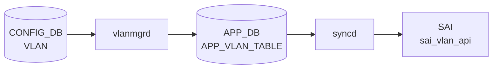

# VLAN_MEMBER テーブル

## 概要

[VLAN](../../reference/glossary.md#term-vlan) とポート (PORT または PORTCHANNEL) のメンバ関係、および各メンバが tagged / untagged のいずれで参加するかを保持する。VLAN_MEMBER のエントリ追加で `vlanmgrd` が Linux bridge にメンバを add し、`orchagent` が [SAI](../../reference/glossary.md#term-sai) [VLAN](../../reference/glossary.md#term-vlan) member を生成する[^1]。

<!-- cdb-mermaid -->
### データフロー (自動生成)



!!! note "凡例"
    CONFIG_DB から SAI までの典型経路を `docs/reference/config-db-orch-map.md` から機械生成したミニ図。詳細・例外は本ページ本文と対応表を参照。
<!-- /cdb-mermaid -->

## key 構造

```text
VLAN_MEMBER|<vlan_name>|<port>
```

`<vlan_name>` は `VLAN` テーブルへの leafref、`<port>` は PORT または PORTCHANNEL への leafref（union）。

## フィールド一覧

| フィールド | 型 | 必須 | デフォルト | 説明 |
|-----------|----|------|-----------|------|
| `name` (key) | leafref `VLAN.name` | ✅ | - | 親 [VLAN](../../reference/glossary.md#term-vlan) |
| `port` (key) | leafref `PORT.name` \| `PORTCHANNEL.name` | ✅ | - | メンバポート / [LAG](../../reference/glossary.md#term-lag) |
| `tagging_mode` | `vlan_tagging_mode` (`tagged`/`untagged`/`priority_tagged`) | ✅ | - | タグ付与モード |

## 制約 (must)

- メンバ port が他の mirror session の `dst_port` であってはならない
- メンバ port が `PORTCHANNEL_MEMBER` のメンバ port になっていてはならない（同一物理ポートの二重所属防止）
- メンバ port が `INTERFACE` (L3) として登録されていてはならない
- 同一 port を `untagged` で登録できる VLAN は最大 1 つ

## 購読者

- `vlanmgrd`: Linux bridge へのメンバ操作
- `orchagent` の `VlanMgr`: [SAI](../../reference/glossary.md#term-sai) VLAN member を生成

## 関連 CONFIG_DB / YANG / CLI

- 関連 [CONFIG_DB](../../reference/glossary.md#term-config_db): `VLAN`、`PORT`、`PORTCHANNEL`、`PORTCHANNEL_MEMBER`、`INTERFACE`、`MIRROR_SESSION`
- 関連 CLI: `config vlan member add/del`
- 関連 [YANG](../../reference/glossary.md#term-yang): `sonic-vlan`

<!-- failure -->
## 書込失敗・retry 分岐

`vlanmgrd` (`vlanmgr.cpp`) が VLAN_MEMBER エントリを処理する際の失敗挙動は「即時破棄」「遅延リトライ」「例外スロー」の 3 パターンに分類される[^fail]。

### 1. 即時破棄 (no retry)

| 失敗条件 | 検出箇所 | ログ出力 |
|---------|---------|---------|
| キーに `Vlan` プレフィクスなし | `doVlanMemberTask` L605-609 | `SWSS_LOG_ERROR("Invalid key format. No 'Vlan' prefix: %s")` |
| キーにメンバーポート部分がない | `doVlanMemberTask` L621-625 | `SWSS_LOG_ERROR("Invalid key format. No member port is presented: %s")` |
| `tagging_mode` が `untagged`/`tagged`/`priority_tagged` 以外 | `doVlanMemberTask` L658-665 | `SWSS_LOG_ERROR("Wrong tagging_mode '%s' for key: %s")` |
| 不明な `operation type` | `doVlanMemberTask` L709 | `SWSS_LOG_ERROR("Unknown operation type %s")` |
| consumer pipe 内の重複キー | `processUntaggedVlanMembers` L584 | `SWSS_LOG_WARN("Duplicate key %s found in table:%s")` |

破棄後は [CONFIG_DB](../../reference/glossary.md#term-config_db) 側に誤エントリが残留するが `vlanmgrd` は再通知しない（silent drop）。

### 2. 遅延リトライ (iterator increment のみ)

| 失敗条件 | 検出箇所 | ログ出力 |
|---------|---------|---------|
| PORT/[LAG](../../reference/glossary.md#term-lag) が `STATE_DB` に未登録 (`isMemberStateOk()` が false) | `doVlanMemberTask` L642-645 | `SWSS_LOG_DEBUG("%s not ready, delaying")` |
| VLAN が `STATE_VLAN_TABLE` に未登録 (`isVlanStateOk()` が false) | `doVlanMemberTask` L642-645 | `SWSS_LOG_DEBUG("%s not ready, delaying")` |
| [PortChannel](../../reference/glossary.md#term-portchannel) の `addHostVlanMember()` が `false` を返す (LAG 削除レース) | `doVlanMemberTask` L683-686 | `SWSS_LOG_INFO("Netdevice for %s not ready, delaying")` |
| PAC 経路でポート/VLAN が未 ready | `doVlanPacVlanMemberTask` L866-870 | `SWSS_LOG_DEBUG("%s not ready, delaying")` |

条件が解消され次第（ポート初期化完了・VLAN 作成完了）自動的に再試行される。

### 3. kernel bridge コマンド失敗と SAI 失敗

| 失敗ケース | コード | 挙動 |
|---------|------|------|
| [PortChannel](../../reference/glossary.md#term-portchannel) の `bridge vlan add` 失敗 | `addHostVlanMember` L258-265 | `return false` → 呼び出し元で `it++` retry（LAG 削除レース想定） |
| Ethernet の `bridge vlan add` 失敗（2 回目） | `addHostVlanMember` L267-269 | 例外再スロー → `vlanmgrd` クラッシュ → supervisor 再起動 |
| `sai_vlan_api->create_vlan_member()` 失敗 ([orchagent](../../reference/glossary.md#term-orchagent)) | `portsorch.cpp` `handleSaiCreateStatus` | retryable なら `it++`、非 retryable なら `erase(it)` |
| [orchagent](../../reference/glossary.md#term-orchagent) 側の PORT/VLAN 未解決 | `portsorch.cpp` `getPort()` 失敗 | `it++; continue;` で保留 |

PortChannel は bridge コマンド失敗を `return false` で吸収しリトライするが、Ethernet はハードエラー扱いで `vlanmgrd` 再起動となる非対称設計。

詳細は `meta/_intermediate/cdb-flow/vlan-member-failure.md` を参照。

[^fail]: `sonic-swss/cfgmgr/vlanmgr.cpp` <https://github.com/sonic-net/sonic-swss/blob/master/cfgmgr/vlanmgr.cpp>

<!-- /failure -->

<!-- constants -->
## ハードコード定数

### vlanmgr.cpp — #define 定数

| 定数名 | 値 | 用途 |
|--------|-----|------|
| `DOT1Q_BRIDGE_NAME` | `"Bridge"` | Linux dot1q ブリッジデバイス名（固定） |
| `VLAN_PREFIX` | `"Vlan"` | VLAN インタフェース名プレフィクス |
| `LAG_PREFIX` | `"PortChannel"` | LAG インタフェース名プレフィクス |

出典: `sonic-swss/cfgmgr/vlanmgr.cpp` lines 15–17

### tagging_mode 受理値 (vlanmgr.cpp)

`tagging_mode` フィールドが受理する値は以下 3 値のみ。それ以外は `SWSS_LOG_ERROR("Wrong tagging_mode")` で破棄される (vlanmgr.cpp:659–662)。

| 値 | Linux bridge コマンド |
|----|--------------------|
| `"untagged"` | `bridge vlan add ... pvid untagged` (vlanmgr.cpp:238) |
| `"tagged"` | `bridge vlan add`（pvid/untagged なし） |
| `"priority_tagged"` | `bridge vlan add ... pvid untagged`（`untagged` と同一コマンド） |

### SAI VLAN_MEMBER 属性 (portsorch.cpp)

`sai_vlan_api->create_vlan_member()` 呼び出し時に設定される [SAI](../../reference/glossary.md#term-sai) 属性。

| SAI 属性 | 値 / 用途 |
|---------|---------|
| `SAI_VLAN_MEMBER_ATTR_VLAN_ID` | 所属 VLAN の OID ([portsorch](../../reference/glossary.md#term-portsorch).cpp:7531) |
| `SAI_VLAN_MEMBER_ATTR_BRIDGE_PORT_ID` | メンバポートのブリッジポート OID ([portsorch](../../reference/glossary.md#term-portsorch).cpp:7535) |
| `SAI_VLAN_MEMBER_ATTR_VLAN_TAGGING_MODE` | タグモードの SAI 列挙値 ([portsorch](../../reference/glossary.md#term-portsorch).cpp:7541) |

### tagging_mode → SAI 列挙値マッピング (portsorch.cpp:7540–7547)

| [CONFIG_DB](../../reference/glossary.md#term-config_db) 値 | SAI 定数 |
|------------|---------|
| `"untagged"` | `SAI_VLAN_TAGGING_MODE_UNTAGGED` |
| `"tagged"` | `SAI_VLAN_TAGGING_MODE_TAGGED` |
| `"priority_tagged"` | `SAI_VLAN_TAGGING_MODE_PRIORITY_TAGGED` |

SAI 側の初期値は `SAI_VLAN_TAGGING_MODE_TAGGED` (portsorch.cpp:7540)。マッピング外は `assert(false)`。

<!-- /constants -->

<!-- defaults -->
## コード由来の暗黙デフォルト

| フィールド | 暗黙デフォルト | 根拠 | 検出種別 |
|-----------|--------------|------|---------|
| `tagging_mode` | `"untagged"` | vlanmgr.cpp:648 `string tagging_mode = "untagged"`、portsorch.cpp:5916 同じ初期化 | YANG `mandatory true` だが実装側は両 consumer が独立に fallback。cvl バイパス経路（warm-restart・直接注入）で乖離 |
| `tagging_mode` (members@ 経路) | `"untagged"` ハードコード | vlanmgr.cpp:573 `processUntaggedVlanMembers()` | `VLAN` エントリの `members@` フィールド経由の minigraph 互換経路では常に `"untagged"` が注入されユーザー制御不可 |
| `tagging_mode` (PAC 経路) | `"untagged"` ハードコード | vlanmgr.cpp:873 `doVlanPacVlanMemberTask()` | PAC 制御による VLAN_MEMBER は `tagging_mode = "untagged"` 固定 |

### priority_tagged の dead CLI 経路と bridge/SAI 乖離

`priority_tagged` は YANG typedef (`sonic-types.yang`) に列挙されておりコードでも受理されるが、CLI (`config/vlan.py:407`) は `"untagged"` / `"tagged"` のみを書き込み、`priority_tagged` を設定する CLI 経路は存在しない。

加えて、`priority_tagged` と `untagged` は Linux bridge レベルでは同一コマンド (`bridge vlan add ... pvid untagged`) が使われる (vlanmgr.cpp:238) が、[orchagent](../../reference/glossary.md#term-orchagent) は SAI では `SAI_VLAN_TAGGING_MODE_PRIORITY_TAGGED` として区別する。Linux ホスト転送と [ASIC](../../reference/glossary.md#term-asic) 転送で動作が乖離する。

### APP_DB フィールド欠落伝播

vlanmgr.cpp:672 は CONFIG_DB の raw フィールド列をそのまま APP_DB に転送する (`kfvFieldsValues(t)`)。`tagging_mode` が CONFIG_DB に存在しない場合 APP_DB にも書かれないが、orchagent 側が再度 `"untagged"` で fallback するため二重の暗黙補完が発生する。

### PAC 経路の非公式フィールド注入

`doVlanPacVlanMemberTask()` (vlanmgr.cpp:887) は PAC 経由の VLAN_MEMBER に `{"dynamic": "yes"}` を APP_DB のみに注入する。このフィールドは YANG 定義なく CONFIG_DB には書かれない隠しフィールド。

<!-- /defaults -->

<!-- ordering -->
## 書込み順依存 (Phase B)

`vlanmgrd` (`sonic-swss/cfgmgr/vlanmgr.cpp`) および `orchagent/PortsOrch` (`sonic-swss/orchagent/portsorch.cpp`) が強制する順序制約。

### 検出された順序依存

| # | 依存関係 | 方向 | 違反時挙動 |
|---|----------|------|-----------|
| 1 | `VLAN` SET 完了 → `VLAN_MEMBER` SET (STATE_VLAN_TABLE ready 待ち) | **強制先行** | 自動リトライ待機（エラーなし） |
| 2 | `PORT` [STATE_DB](../../reference/glossary.md#term-state_db) ready → `VLAN_MEMBER` SET（物理ポート） | **強制先行** | 自動リトライ待機（エラーなし） |
| 3 | `PORTCHANNEL` [STATE_DB](../../reference/glossary.md#term-state_db) ready → `VLAN_MEMBER` SET（LAG） | **強制先行** | 自動リトライ待機（エラーなし） |
| 4 | `VLAN_MEMBER` DEL 完了 → `VLAN` DEL | **必須（逆順 NG）** | VLAN_MEMBER が孤立・保留永続 |
| 5 | `INTERFACE` (L3) と `VLAN_MEMBER` は同一 port で排他 | 双方向排他 | `addBridgePort` 拒否、追加不可 |

### 主要な制約詳細

**VLAN 先行必須 (依存 #1)**: `VLAN_MEMBER|Vlan<N>|<port>` の SET 前に `VLAN|Vlan<N>` が [vlanmgrd](../../reference/glossary.md#term-vlanmgrd) に処理され STATE_DB `VLAN_TABLE|Vlan<N>` に `state=ok` が立っていること。`isVlanStateOk()` (vlanmgr.cpp:517-531) が false の間、該当 VLAN_MEMBER タスクは `it++` で保留される（`SWSS_LOG_DEBUG("%s not ready, delaying")`）。[APPL_DB](../../reference/glossary.md#term-appl_db) には書かれず外部から無反応に見える（evidence: vlanmgr.cpp:517-531, 641-647）。

**PORT/PORTCHANNEL 先行必須 (依存 #2/3)**: `isMemberStateOk()` (vlanmgr.cpp:491-514) が確認する内容: 物理ポートは `STATE_PORT_TABLE|<port>` エントリの存在かつ `state` フィールドが存在すること、PortChannel は `STATE_LAG_TABLE|<lag>` エントリの存在。[portmgrd](../../reference/glossary.md#term-portmgrd) / lagmgrd が ready を書くまで VLAN_MEMBER は保留（evidence: vlanmgr.cpp:491-514, 641-647）。

**SAI vlan_member 生成順序 (portsorch)**: `portsorch::doVlanMemberTask()` は [APPL_DB](../../reference/glossary.md#term-appl_db) `VLAN_MEMBER_TABLE` を受けて `addBridgePort(port) && addVlanMember(vlan, port, tagging_mode)` の短絡評価で処理する。bridge port 作成成功後に `sai_vlan_api->create_vlan_member()` が呼ばれる（SAI 属性順: `SAI_VLAN_MEMBER_ATTR_VLAN_ID` → `SAI_VLAN_MEMBER_ATTR_BRIDGE_PORT_ID` → `SAI_VLAN_MEMBER_ATTR_VLAN_TAGGING_MODE`）。その前に `getPort(vlan_alias)` と `getPort(port_alias)` で VLAN・PORT が `m_portList` に存在することを確認しており、未登録なら `it++` 保留（evidence: portsorch.cpp:5895-5940, 7531-7553）。

**DEL 逆順必須 (依存 #4)**: `doVlanTask()` DEL (vlanmgr.cpp:456-471) は VLAN_MEMBER の残存チェックを行わずに `m_stateVlanTable.del()` を即実行する。VLAN を先に DEL すると STATE_DB から `Vlan<N>` が消え、残存 VLAN_MEMBER は `isVlanStateOk()` が永遠に false になり孤立保留状態となる。削除は `VLAN_MEMBER` → `VLAN` の順が必須。portsorch 側の DEL は VLAN_MEMBER 削除後に `bridge port ref_count == 0` であれば `removeBridgePort()` を実行する（VLAN_MEMBER 先・bridge port 後の逆順、evidence: portsorch.cpp:5949-5958）。

### 推奨書込み順序（cold boot）

```
# 1. DEVICE_METADATA.localhost.mac  （gMacAddress 確定 — vlanmgr.cpp:318-322）
# 2. PORT|EthernetN                 （portmgrd → STATE_DB.PORT_TABLE state=ok）
# 3. PORTCHANNEL + PORTCHANNEL_MEMBER（任意）（lagmgrd → STATE_DB.LAG_TABLE）
# 4. VLAN|VlanN                     （vlanmgrd → STATE_DB.VLAN_TABLE state=ok）
# 5. VLAN_MEMBER|VlanN|EthernetN   （vlanmgrd → APPL_DB → portsorch → SAI create_vlan_member）
```

削除は逆順: `VLAN_MEMBER` → `VLAN` → `PORT`。

<!-- /ordering -->

<!-- value-behavior -->
## 値依存挙動マトリクス

| フィールド | 値 | 実挙動 |
|-----------|-----|--------|
| `tagging_mode` | `untagged` | `bridge vlan add ... pvid untagged`。ポートの PVID として扱われる (vlanmgr.cpp:238) |
| `tagging_mode` | `priority_tagged` | `bridge vlan add ... pvid untagged`（untagged と同一の bridge コマンド） (vlanmgr.cpp:238) |
| `tagging_mode` | `tagged` | `bridge vlan add`（タグあり、pvid/untagged オプションなし） |
| `tagging_mode` | 省略 | `"untagged"` が自動補完される (vlanmgr.cpp:873) |
| `tagging_mode` | その他 | `SWSS_LOG_ERROR("Wrong tagging_mode")` で破棄 (vlanmgr.cpp:659) |

<!-- /value-behavior -->

## 例外条件・特殊挙動 <!-- cdb-exceptions -->

<!-- evidence: sonic-swss/cfgmgr/vlanmgr.cpp; sonic-buildimage/src/sonic-yang-models/yang-models/sonic-vlan.yang -->

- **キー形式検証**: `Vlan<id>|<port>` 形式必須。`Vlan` プレフィクスがない、またはポート名が含まれない場合 `vlanmgrd` はエントリを破棄する[^exc1]。
- **`tagging_mode` 検証**: `untagged` / `tagged` / `priority_tagged` 以外の値は `SWSS_LOG_ERROR("Wrong tagging_mode")` で破棄される[^exc1]。
- **VLAN / ポート未 ready**: `isVlanStateOk()` または `isMemberStateOk()` が false の場合リトライ待ち（"not ready, delaying"）[^exc1]。
- **重複エントリ**: [STATE_DB](../../reference/glossary.md#term-state_db) に既存の場合は `m_vlanMemberReplay` から削除のみ（"already set"）[^exc1]。
- **重複キー**: consumer pipe 内の重複キーは `SWSS_LOG_WARN("Duplicate key found")` でスキップ[^exc1]。
- **デフォルト補完**: `tagging_mode` 省略時は `"untagged"` が補完される[^exc1]。

[^exc1]: `sonic-swss/cfgmgr/vlanmgr.cpp` <https://github.com/sonic-net/sonic-swss/blob/master/cfgmgr/vlanmgr.cpp>

<!-- cross-refs -->
## 暗黙テーブル参照 (vlanmgrd)

vlanmgr は VLAN_MEMBER エントリを処理する前に以下のテーブルを参照し、ready 状態を確認する。
YANG leafref による宣言的参照（CVL 検証時）と実装上の暗黙参照の両方を示す。

| 参照先テーブル | DB | 参照種別 | 目的 | 根拠 |
|---|---|---|---|---|
| `VLAN` (key[0]) | CONFIG_DB (YANG leafref) | CVL バリデーション | VLAN 名の存在確認 | sonic-vlan.yang L283 |
| `PORT` (key[1] union 1st) | CONFIG_DB (YANG leafref) | CVL バリデーション | 物理ポート名の存在確認 | sonic-vlan.yang L291–292 |
| `PORTCHANNEL` (key[1] union 2nd) | CONFIG_DB (YANG leafref) | CVL バリデーション | LAG 名の存在確認 | sonic-vlan.yang L294–295 |
| `STATE_VLAN_TABLE` | STATE_DB | 暗黙参照・ブロッキング | VLAN が ready か確認。false → delaying リトライ | vlanmgr.cpp:517–531, L642 |
| `STATE_PORT_TABLE` | STATE_DB | 暗黙参照・ブロッキング | 物理ポートが ready か確認。`state` フィールド必須 | vlanmgr.cpp:503–512, L642 |
| `STATE_LAG_TABLE` | STATE_DB | 暗黙参照・ブロッキング | PortChannel が ready か確認 | vlanmgr.cpp:495–501, L642 |
| `STATE_VLAN_MEMBER_TABLE` | STATE_DB | 暗黙参照・重複防止 | 既存エントリ確認（warm-restart 二重処理防止） | vlanmgr.cpp:533–542, L633 |
| `CFG_VLAN_TABLE` | CONFIG_DB | 暗黙参照・初期化 | 起動時リプレイマップ構築のためのバルク読み取り | vlanmgr.cpp:46–47 |

### 注記

- `STATE_VLAN_TABLE` / `STATE_PORT_TABLE` / `STATE_LAG_TABLE` のいずれかが not ready の場合、
  VLAN_MEMBER エントリは `"not ready, delaying"` としてリトライキューに残り自動再処理される。
- CVL をバイパスする経路（warm-restart・minigraph 直接注入・PAC 経路）では YANG leafref チェックが行われず、
  実装側の STATE_DB チェックのみが有効となる。

<!-- /cross-refs -->

<!-- ref-triangle:start -->

## 関連リファレンス

- [YANG](../../reference/glossary.md#term-yang): [`sonic-vlan`](../yang/sonic-vlan.md)
- CLI: [`config vlan member`](../cli/config-vlan.md)

<!-- ref-triangle:end -->

## 引用元

[^1]: [YANG](../../reference/glossary.md#term-yang) 定義: `sonic-vlan.yang` 内 `VLAN_MEMBER` コンテナ。<https://github.com/sonic-net/sonic-buildimage/blob/9ea932ec2e18f35e58268ec2e4456b1d4afd65cd/src/sonic-yang-models/yang-models/sonic-vlan.yang#L273>

## 関連ページ
- [HLD: Switchport モードと VLAN CLI 拡張](../../switching/switch-port-modes-and-vlan-cli-enhancement.md)
- [CLI: config vlan](../cli/config-vlan.md)
- [CONFIG_DB: VLAN](vlan.md)
- [YANG: sonic-vlan](../yang/sonic-vlan.md)

<!-- topics-back-ref -->
## 関連 Topics

- [Topics: L2 / VLAN / LAG / MC-LAG](../../topics/06-l2-vlan-lag/index.md)

<!-- /topics-back-ref -->

<!-- ops-hint -->
## 運用ヒント

### 典型値

- key 形式: `VLAN_MEMBER|Vlan100|Ethernet0`。
- `tagging_mode`: `tagged` / `untagged` / `priority_tagged`。

### よくある誤設定

- `tagging_mode: untagged` を 1 ポート上の複数 VLAN に重複指定すると先勝ちで残りが silently 反映されない。
- [PortChannel](../../reference/glossary.md#term-portchannel) メンバを VLAN_MEMBER に直付けすると L2 が壊れる。[LAG](../../reference/glossary.md#term-lag) 親 (`PortChannelN`) を入れる。

### 確認コマンド

```bash
sonic-db-cli CONFIG_DB hgetall 'VLAN_MEMBER|Vlan100|Ethernet0'
show vlan brief
```
<!-- /ops-hint -->

<!-- runtime-trace -->
## CDB → 実コンテナ動作トレース

### 段階 1: Consumer 登録

- **orchagent / VlanOrch** (`sonic-swss/orchagent/vlanorch.cpp`): `VLAN_MEMBER` テーブルを `SubscriberStateTable` で購読。

### 段階 2: CFG → APPL 翻訳

- VlanOrch がポートの VLAN 帰属 (`tagging_mode`) を解析。APP_DB への書き込みなし。

### 段階 3: APPL → SAI

- VlanOrch が `sai_vlan_api->create_vlan_member()` でポートを VLAN に追加。
- `tagging_mode=tagged`: `SAI_VLAN_TAGGING_MODE_TAGGED`、`untagged`: `SAI_VLAN_TAGGING_MODE_UNTAGGED`。

### 段階 4: タイミング + 副作用

- VLAN テーブルと PORT テーブルが両方処理済みであることが前提。
- 副作用: ポートを VLAN から削除すると、そのポートの MAC エントリが [FDB](../../reference/glossary.md#term-fdb) から自動削除される。

<!-- /runtime-trace -->
<!-- pubsub -->
## 通信メカニズム — Redis Pub/Sub

`VLAN_MEMBER` テーブルは **[ConsumerStateTable](../../reference/glossary.md#term-consumerstatetable)** ([Redis](../../reference/glossary.md#term-redis) PUBLISH/SUBSCRIBE チャンネルベース) を用いて購読される。`SubscriberStateTable` (keyspace PSUBSCRIBE) は使用しない。

### 購読経路

| 購読者 | 購読テーブル | [Redis](../../reference/glossary.md#term-redis) チャンネル | 処理ハンドラ |
|--------|------------|-----------------|-------------|
| `vlanmgrd` | CONFIG_DB `VLAN_MEMBER` | `VLAN_MEMBER_CHANNEL@<cfgDbId>` | `doVlanMemberTask()` |
| `orchagent` (VlanOrch) | [APPL_DB](../../reference/glossary.md#term-appl_db) `APP_VLAN_MEMBER_TABLE` | `APP_VLAN_MEMBER_TABLE_CHANNEL@<appDbId>` | VlanOrch::doTask() |

### CONFIG_DB → vlanmgrd → APPL_DB → orchagent → SAI の全体フロー

```
CLI: config vlan member add Vlan100 Ethernet0 --tagging tagged
  └─ ConfigDBConnector.set_entry("VLAN_MEMBER", ("Vlan100","Ethernet0"), {"tagging_mode":"tagged"})
       └─ ProducerStateTable (EVALSHA アトミック)
            SADD VLAN_MEMBER_KEY_SET "Vlan100|Ethernet0"
            HSET _VLAN_MEMBER|Vlan100|Ethernet0 tagging_mode tagged
            PUBLISH VLAN_MEMBER_CHANNEL@<cfgDbId> "G"

vlanmgrd (swss::Select ループ、タイムアウト 1000ms)
  └─ ConsumerStateTable::pops()  ← EVALSHA (SPOP + HGETALL + DEL)
  └─ doVlanMemberTask(consumer)
       ├─ isVlanStateOk() && isMemberStateOk() → false なら retry (1000ms 後)
       ├─ addHostVlanMember(100, "Ethernet0", "tagged")
       │    └─ ip link set Ethernet0 master Bridge
       │    └─ bridge vlan del vid 1 dev Ethernet0
       │    └─ bridge vlan add vid 100 dev Ethernet0        ← kernel bridge (tagged)
       ├─ m_appVlanMemberTableProducer.set("Vlan100|Ethernet0", fv)
       │    └─ PUBLISH APP_VLAN_MEMBER_TABLE_CHANNEL@<appDbId> "G"
       └─ m_stateVlanMemberTable.set("Vlan100|Ethernet0", [("state","ok")])

orchagent (ConsumerStateTable で APP_VLAN_MEMBER_TABLE を購読)
  └─ VlanOrch::doTask()
       └─ sai_vlan_api->create_vlan_member(
              SAI_VLAN_MEMBER_ATTR_VLAN_ID,
              SAI_VLAN_MEMBER_ATTR_BRIDGE_PORT_ID,
              SAI_VLAN_MEMBER_ATTR_VLAN_TAGGING_MODE = SAI_VLAN_TAGGING_MODE_TAGGED)
```

### PAC 経路 (STATE_DB ← STATE_OPER_VLAN_MEMBER_TABLE)

PAC (Port Authentication Controller) は STATE_DB `STATE_OPER_VLAN_MEMBER_TABLE` に書き込む。
`vlanmgrd` は同テーブルを `ConsumerStateTable` で購読し `doVlanPacVlanMemberTask()` で処理する。
PAC 経路では `tagging_mode = "untagged"` が固定で注入され、APP_DB に `dynamic: yes` が追加される
（この `dynamic` フィールドは YANG 定義なく CONFIG_DB には書かれない）。

### 主要特性

| 特性 | 値 |
|------|----|
| 通知プリミティブ | [Redis](../../reference/glossary.md#term-redis) PUBLISH/SUBSCRIBE (`ConsumerStateTable`) |
| PUBLISH ペイロード | 固定文字列 `"G"` |
| keyspace notification | 不使用 |
| バッチサイズ | `gBatchSize` (デフォルト 128) |
| Select タイムアウト | 1000ms ([vlanmgrd](../../reference/glossary.md#term-vlanmgrd).cpp:22) |
| タイムアウト時動作 | `vlanmgr.doTask()` で retry (ポート/VLAN 未準備待ち) |
| warm-restart 対応 | `m_vlanMemberReplay` で STATE_DB 既存エントリをスキップ |
| Linux bridge 操作 | `bridge vlan add/del` + `ip link set master/nomaster` |
| SAI API | `sai_vlan_api->create_vlan_member()` / `remove_vlan_member()` |

<!-- /pubsub -->

<!-- failure-behavior -->
## 失敗挙動（Phase D）

### VLAN 未解決（isVlanStateOk = false）

VLAN_MEMBER エントリの処理時に対応する VLAN が STATE_DB に未登録の場合、`vlanmgrd` はエントリを **リトライキューに残して次のループまで延期**する（vlanmgr.cpp:644 `SWSS_LOG_DEBUG("%s not ready, delaying")`）。エントリは破棄されない。VLAN が後から作成されると自動的に再試行される。

```
[vlanmgrd] DEBUG: Vlan100|Ethernet0 not ready, delaying
```

### ポート未解決（isMemberStateOk = false）

ポート（PORT または PORTCHANNEL）が STATE_DB に未登録の場合も同様に延期される（vlanmgr.cpp:641-644）。LAG 削除レース条件（PORTCHANNEL がまだ STATE_DB に残っているが実体が消えている）では、`addHostVlanMember` が `false` を返し `SWSS_LOG_INFO("Netdevice for %s not ready, delaying")` でリトライされる（vlanmgr.cpp:684）。

```
[vlanmgrd] INFO: Netdevice for Vlan100|PortChannel0001 not ready, delaying
```

### bridge コマンド失敗

`addHostVlanMember` 内で `ip link set <port> master Bridge` または `bridge vlan add` が失敗した場合の挙動はポート種別で分岐する（vlanmgr.cpp:258-270）:

| ポート種別 | 失敗時の挙動 |
|-----------|------------|
| LAG (PortChannel) | `false` を返してリトライ（race condition 対策） |
| 物理ポート (Ethernet) | 例外を再スロー（`EXEC_WITH_ERROR_THROW` で強制終了相当） |

LAG の場合は `catch(runtime_error)` でキャッチし `return false` → 呼び出し元でリトライ延期となる。物理ポートの場合は例外が上位に伝播し `vlanmgrd` プロセスが異常終了する可能性がある。

### SAI 失敗（orchagent 側）

orchagent の `VlanOrch` が `sai_vlan_api->create_vlan_member()` を呼び出す際に SAI エラーが返った場合、orchagent は `SWSS_LOG_ERROR` を出力してそのエントリをドロップする（retry なし）。STATE_DB の `VLAN_MEMBER` エントリは `state=ok` にならず、[vlanmgrd](../../reference/glossary.md#term-vlanmgrd) が次回の consumer loop で未完了エントリを再処理しようとするが、SAI 側がエラーを返し続ける場合は永続的に未設定となる。

### tagging_mode 不正値

`tagging_mode` が `untagged` / `tagged` / `priority_tagged` 以外の場合、`SWSS_LOG_ERROR("Wrong tagging_mode")` を出力してエントリを即時破棄する（vlanmgr.cpp:662）。リトライなし。

### 不正キー形式

キーが `Vlan` プレフィクスで始まらない、またはポート名を含まない場合は即時破棄（vlanmgr.cpp:603-625）。

<!-- /failure-behavior -->

<!-- side-effects -->
## SET/DEL 副次 DB 書込み

`CONFIG_DB VLAN_MEMBER` エントリの SET / DEL が引き起こす他 DB への書込み一覧。

### vlanmgrd による書込み (cfgmgr/vlanmgr.cpp)

| 操作 | 対象 DB / テーブル | キー | 条件 |
|------|-----------------|------|------|
| SET: `m_appVlanMemberTableProducer.set(key, kfvFieldsValues(t))` | APPL_DB / `VLAN_MEMBER_TABLE` | `Vlan<id>\|<port>` | addHostVlanMember() 成功後[^se1] |
| SET: `m_stateVlanMemberTable.set(kfvKey(t), [{state, ok}])` | STATE_DB / `VLAN_MEMBER_TABLE` | `Vlan<id>\|<port>` | 同上[^se1] |
| DEL: `m_appVlanMemberTableProducer.del(key)` | APPL_DB / `VLAN_MEMBER_TABLE` | `Vlan<id>\|<port>` | isVlanMemberStateOk() == true[^se1] |
| DEL: `m_stateVlanMemberTable.del(kfvKey(t))` | STATE_DB / `VLAN_MEMBER_TABLE` | `Vlan<id>\|<port>` | 同上[^se1] |

APPL_DB に書き込まれるフィールド: CONFIG_DB の raw フィールドをそのまま転送 (`kfvFieldsValues(t)`)。`tagging_mode` が CONFIG_DB に存在しない場合 APPL_DB にも書かれず、orchagent 側で `"untagged"` にフォールバックする（二重の暗黙補完）。

### PortsOrch::addVlanMember / removeVlanMember による書込み (orchagent/portsorch.cpp)

APPL_DB `VLAN_MEMBER_TABLE` を PortsOrch が購読し SAI 呼び出しを行い、[syncd](../../reference/glossary.md#term-syncd) 経由で [ASIC_DB](../../reference/glossary.md#term-asic_db) へ書き込まれる。

| 操作 | 対象 DB / テーブル | キー / フィールド | 条件 |
|------|-----------------|-----------------|------|
| SET: `sai_vlan_api->create_vlan_member(...)` | [ASIC_DB](../../reference/glossary.md#term-asic_db) / `ASIC_STATE:SAI_OBJECT_TYPE_VLAN_MEMBER:<oid>` | `SAI_VLAN_MEMBER_ATTR_VLAN_ID`, `SAI_VLAN_MEMBER_ATTR_BRIDGE_PORT_ID`, `SAI_VLAN_MEMBER_ATTR_VLAN_TAGGING_MODE` | 常時[^se2] |
| SET: `setPortPvid(port, vlan_id)` (SAI_PORT_ATTR_PORT_VLAN_ID) | [ASIC_DB](../../reference/glossary.md#term-asic_db) (SAI 経由) | ポート OID | `tagging_mode == "untagged"` かつ非 TUNNEL の場合[^se2] |
| DEL: `sai_vlan_api->remove_vlan_member(vlan_member_id)` | ASIC_DB / `ASIC_STATE:SAI_OBJECT_TYPE_VLAN_MEMBER:<oid>` 削除 | `<oid>` | 常時[^se2] |
| DEL ([FDB](../../reference/glossary.md#term-fdb) 連鎖): [FDB](../../reference/glossary.md#term-fdb) エントリ自動削除 | ASIC_DB / FDB エントリ | — | ポートが VLAN から除去された際 fdborch が `SUBJECT_TYPE_VLAN_MEMBER_CHANGE` を受信して削除[^se3] |

### カーネル操作 (DB 外)

- SET: `ip link set <port> master Bridge` — ポートをブリッジに参加
- SET: `bridge vlan del vid 1 dev <port>` — デフォルト VLAN 1 を除去
- SET: `bridge vlan add vid <vlan_id> dev <port> [pvid untagged]` — `untagged` / `priority_tagged` 時は `pvid untagged` オプション付与[^se1]
- DEL: `bridge vlan del vid <vlan_id> dev <port>` — VLAN からポートを除去
- DEL: `ip link set <port> nomaster` — ポートが他 VLAN のメンバーでなくなった場合にブリッジから切り離し

### COUNTERS_DB

VLAN_MEMBER SET/DEL 単体では **[COUNTERS_DB](../../reference/glossary.md#term-counters_db) への書込みはない**。

### 副作用サマリ

| DB | テーブル | キー形式 | SET | DEL |
|-----|---------|---------|-----|-----|
| APPL_DB | `VLAN_MEMBER_TABLE` | `Vlan<id>\|<port>` | 書込 (vlanmgrd) | 削除 (vlanmgrd) |
| STATE_DB | `VLAN_MEMBER_TABLE` | `Vlan<id>\|<port>` | `{state: ok}` 書込 (vlanmgrd) | 削除 (vlanmgrd) |
| ASIC_DB | `ASIC_STATE:SAI_OBJECT_TYPE_VLAN_MEMBER:<oid>` | OID | [syncd](../../reference/glossary.md#term-syncd) 経由で作成 | [syncd](../../reference/glossary.md#term-syncd) 経由で削除 |
| ASIC_DB | ポート属性 `SAI_PORT_ATTR_PORT_VLAN_ID` | ポート OID | `untagged` 時に PVID 書込 | — |
| ASIC_DB | FDB エントリ | — | — | ポート削除時に自動削除 (fdborch) |
| [COUNTERS_DB](../../reference/glossary.md#term-counters_db) | — | — | 書込なし | 書込なし |

[^se1]: `sonic-swss/cfgmgr/vlanmgr.cpp` <https://github.com/sonic-net/sonic-swss/blob/master/cfgmgr/vlanmgr.cpp>
[^se2]: `sonic-swss/orchagent/portsorch.cpp` <https://github.com/sonic-net/sonic-swss/blob/master/orchagent/portsorch.cpp>
[^se3]: `sonic-swss/orchagent/fdborch.cpp` <https://github.com/sonic-net/sonic-swss/blob/master/orchagent/fdborch.cpp>
<!-- /side-effects -->

<!-- entry-points -->
## 書き込み入り口 (Direction A)

VLAN_MEMBER テーブルへの書き込みが発生するコード経路を網羅的に調査した結果。

### CLI

  - `config vlan member add/del ...` — `config/vlan.py` が `set_entry('VLAN_MEMBER', (vlan, port), {'tagging_mode': ...})` を呼ぶ ([sonic-utilities](../../reference/glossary.md#term-sonic-utilities)/config/vlan.py:407, 451)

### minigraph / sonic-cfggen

**minigraph.py** が VLAN_MEMBER を生成し投入 ([sonic-buildimage](../../reference/glossary.md#term-sonic-buildimage)/src/sonic-config-engine/minigraph.py)

### REST / gNMI

REST/[gNMI](../../reference/glossary.md#term-gnmi) 書き込み経路なし

### db_migrator

db_migrator.py での VLAN_MEMBER マイグレーションなし

### ビルド時デフォルト (build-time default)

なし

### ハードコードデフォルト / ランタイム注入

なし

### 死活・デッドコード

なし
<!-- /entry-points -->

<!-- platform -->
## プラットフォーム差

### EVPN `end_point_ip` — `SAI_VLAN_FLOOD_CONTROL_TYPE_COMBINED` 非対応 ASIC でメンバ追加失敗

APP_DB `VLAN_MEMBER_TABLE` エントリに `end_point_ip` が付与される [EVPN](../../reference/glossary.md#term-evpn) [VXLAN](../../reference/glossary.md#term-vxlan) BUM flooding 構成では、`addVlanMember()` (portsorch.cpp:7517-7521) が起動時照会した flood control capability に `SAI_VLAN_FLOOD_CONTROL_TYPE_COMBINED` が含まれない場合 `"Flood group with end point ip is not supported"` を返して即時失敗する。VS SAI は `ALL` / `NONE` / `L2MC_GROUP` の 3 種のみ返すため、**VS 環境では `end_point_ip` を持つ VLAN_MEMBER は常に設定不可**。Broadcom TD3/TH 系は多くの場合 `COMBINED` をサポートする。CONFIG_DB の VLAN_MEMBER テーブル自体は `end_point_ip` フィールドを持たない（YANG 外・VxlanOrch が APP_DB に動的注入）。

### TUNNEL ポートへの PVID 設定スキップ

`tagging_mode=untagged` で VLAN_MEMBER に追加されるポートが `Port::TUNNEL` 型（[VXLAN](../../reference/glossary.md#term-vxlan) トンネルポート）の場合、`setPortPvid()` による SAI PVID 設定を**スキップ**する (portsorch.cpp:7568-7575)。`removeVlanMember()` 時も同条件でスキップ (portsorch.cpp:7905-7912)。TUNNEL ポートに PVID の概念が適用されないための処置。[VXLAN](../../reference/glossary.md#term-vxlan) [EVPN](../../reference/glossary.md#term-evpn) 構成では `tagging_mode=untagged` を設定しても SAI 側で PVID は変更されない。

### Storage Backend T0 — minigraph 経由で全メンバを強制 `tagged`

`BackEndToRRouter` / `BackEndLeafRouter` デバイスタイプ（Storage Backend T0）では、`minigraph.py` が設定生成時に VLAN_MEMBER の `tagging_mode` をすべて `"tagged"` に上書きする (minigraph.py:2565, 2593)。CONFIG_DB に書き込まれる段階ですでに `tagged` が入るため、CLI で `untagged` を指定しても minigraph 再生成により上書きされる。通常の T0 / T1 / T2 ではこの強制上書きは発生しない。

### SmartSwitch DPU — SAI 1Q Bridge 初期化省略

`gMySwitchType == "dpu"` 時、orchagent は SAI デフォルト 1Q Bridge/VLAN の取得・デフォルトメンバ削除・FDB event notify 設定をすべてスキップする (portsorch.cpp:987-1066)。一方 vlanmgrd は `gMySwitchType` を参照せず [DPU](../../reference/glossary.md#term-dpu) 上でも Linux kernel bridge を通常通り作成する。結果として [DPU](../../reference/glossary.md#term-dpu) では kernel bridge は存在するが SAI VLAN 初期状態が通常と異なり、VLAN_MEMBER を CONFIG_DB に書いても SAI 側の VLAN member 作成が不完全になる可能性がある。[SmartSwitch](../../reference/glossary.md#term-smartswitch) [NPU](../../reference/glossary.md#term-npu) 側の VLAN_MEMBER 操作は通常通り動作する。

### VOQ Chassis — VLAN_MEMBER への直接影響なし

[VOQ](../../reference/glossary.md#term-voq) Chassis の Inband インタフェースに `Vlan` タイプが定義されているが "not used, adding to be future proof" の状態 (minigraph.py:906)。vlanmgr.cpp / portsorch.cpp の `addVlanMember()` / `removeVlanMember()` に [VOQ](../../reference/glossary.md#term-voq) 固有分岐はなく、通常の物理 T0 と同一の処理経路を通る。

### Multi-ASIC — CLI で `--namespace` 必須

[Multi-ASIC](../../reference/glossary.md#term-multi-asic) 環境では `config vlan member add/del` に `--namespace` が必須で、指定なしはエラー終了する (config/vlan.py:23)。VLAN_MEMBER は特定 [ASIC](../../reference/glossary.md#term-asic) の namespace DB に書き込まれる。Single [ASIC](../../reference/glossary.md#term-asic) 環境では `DEFAULT_NAMESPACE` が自動設定されるため不要。

<!-- /platform -->

<!-- glossary-links-injected: d654b1dcf7c9 -->
