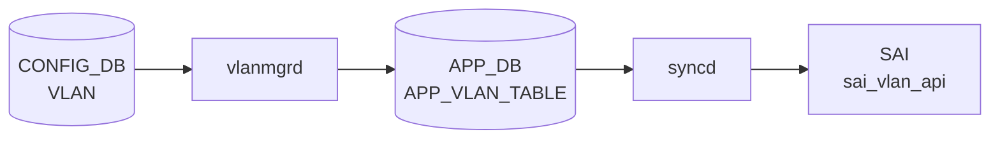

# VLAN_MEMBER テーブル

## 概要

[VLAN](../../reference/glossary.md#term-vlan) とポート (PORT または PORTCHANNEL) のメンバ関係、および各メンバが tagged / untagged のいずれで参加するかを保持する。VLAN_MEMBER のエントリ追加で `vlanmgrd` が Linux bridge にメンバを add し、`orchagent` が [SAI](../../reference/glossary.md#term-sai) [VLAN](../../reference/glossary.md#term-vlan) member を生成する[^1]。

<!-- cdb-mermaid -->
### データフロー (自動生成)



!!! note "凡例"
    CONFIG_DB から SAI までの典型経路を `docs/reference/config-db-orch-map.md` から機械生成したミニ図。詳細・例外は本ページ本文と対応表を参照。
<!-- /cdb-mermaid -->

## key 構造

```text
VLAN_MEMBER|<vlan_name>|<port>
```

`<vlan_name>` は `VLAN` テーブルへの leafref、`<port>` は PORT または PORTCHANNEL への leafref（union）。

## フィールド一覧

| フィールド | 型 | 必須 | デフォルト | 説明 |
|-----------|----|------|-----------|------|
| `name` (key) | leafref `VLAN.name` | ✅ | - | 親 [VLAN](../../reference/glossary.md#term-vlan) |
| `port` (key) | leafref `PORT.name` \| `PORTCHANNEL.name` | ✅ | - | メンバポート / [LAG](../../reference/glossary.md#term-lag) |
| `tagging_mode` | `vlan_tagging_mode` (`tagged`/`untagged`/`priority_tagged`) | ✅ | - | タグ付与モード |

## 制約 (must)

- メンバ port が他の mirror session の `dst_port` であってはならない
- メンバ port が `PORTCHANNEL_MEMBER` のメンバ port になっていてはならない（同一物理ポートの二重所属防止）
- メンバ port が `INTERFACE` (L3) として登録されていてはならない
- 同一 port を `untagged` で登録できる VLAN は最大 1 つ

## 購読者

- `vlanmgrd`: Linux bridge へのメンバ操作
- `orchagent` の `VlanMgr`: [SAI](../../reference/glossary.md#term-sai) VLAN member を生成

## 関連 CONFIG_DB / YANG / CLI

- 関連 [CONFIG_DB](../../reference/glossary.md#term-config_db): `VLAN`、`PORT`、`PORTCHANNEL`、`PORTCHANNEL_MEMBER`、`INTERFACE`、`MIRROR_SESSION`
- 関連 CLI: `config vlan member add/del`
- 関連 [YANG](../../reference/glossary.md#term-yang): `sonic-vlan`

<!-- value-behavior -->
## 値依存挙動マトリクス

| フィールド | 値 | 実挙動 |
|-----------|-----|--------|
| `tagging_mode` | `untagged` | `bridge vlan add ... pvid untagged`。ポートの PVID として扱われる (vlanmgr.cpp:238) |
| `tagging_mode` | `priority_tagged` | `bridge vlan add ... pvid untagged`（untagged と同一の bridge コマンド） (vlanmgr.cpp:238) |
| `tagging_mode` | `tagged` | `bridge vlan add`（タグあり、pvid/untagged オプションなし） |
| `tagging_mode` | 省略 | `"untagged"` が自動補完される (vlanmgr.cpp:873) |
| `tagging_mode` | その他 | `SWSS_LOG_ERROR("Wrong tagging_mode")` で破棄 (vlanmgr.cpp:659) |

<!-- /value-behavior -->

## 例外条件・特殊挙動 <!-- cdb-exceptions -->

<!-- evidence: sonic-swss/cfgmgr/vlanmgr.cpp; sonic-buildimage/src/sonic-yang-models/yang-models/sonic-vlan.yang -->

- **キー形式検証**: `Vlan<id>|<port>` 形式必須。`Vlan` プレフィクスがない、またはポート名が含まれない場合 `vlanmgrd` はエントリを破棄する[^exc1]。
- **`tagging_mode` 検証**: `untagged` / `tagged` / `priority_tagged` 以外の値は `SWSS_LOG_ERROR("Wrong tagging_mode")` で破棄される[^exc1]。
- **VLAN / ポート未 ready**: `isVlanStateOk()` または `isMemberStateOk()` が false の場合リトライ待ち（"not ready, delaying"）[^exc1]。
- **重複エントリ**: [STATE_DB](../../reference/glossary.md#term-state_db) に既存の場合は `m_vlanMemberReplay` から削除のみ（"already set"）[^exc1]。
- **重複キー**: consumer pipe 内の重複キーは `SWSS_LOG_WARN("Duplicate key found")` でスキップ[^exc1]。
- **デフォルト補完**: `tagging_mode` 省略時は `"untagged"` が補完される[^exc1]。

[^exc1]: `sonic-swss/cfgmgr/vlanmgr.cpp` <https://github.com/sonic-net/sonic-swss/blob/master/cfgmgr/vlanmgr.cpp>

<!-- ref-triangle:start -->

## 関連リファレンス

- [YANG](../../reference/glossary.md#term-yang): [`sonic-vlan`](../yang/sonic-vlan.md)
- CLI: [`config vlan member`](../cli/config-vlan.md)

<!-- ref-triangle:end -->

## 引用元

[^1]: [YANG](../../reference/glossary.md#term-yang) 定義: `sonic-vlan.yang` 内 `VLAN_MEMBER` コンテナ。<https://github.com/sonic-net/sonic-buildimage/blob/9ea932ec2e18f35e58268ec2e4456b1d4afd65cd/src/sonic-yang-models/yang-models/sonic-vlan.yang#L273>

## 関連ページ
- [HLD: Switchport モードと VLAN CLI 拡張](../../switching/switch-port-modes-and-vlan-cli-enhancement.md)
- [CLI: config vlan](../cli/config-vlan.md)
- [CONFIG_DB: VLAN](vlan.md)
- [YANG: sonic-vlan](../yang/sonic-vlan.md)

<!-- topics-back-ref -->
## 関連 Topics

- [Topics: L2 / VLAN / LAG / MC-LAG](../../topics/06-l2-vlan-lag/index.md)

<!-- /topics-back-ref -->

<!-- ops-hint -->
## 運用ヒント

### 典型値

- key 形式: `VLAN_MEMBER|Vlan100|Ethernet0`。
- `tagging_mode`: `tagged` / `untagged` / `priority_tagged`。

### よくある誤設定

- `tagging_mode: untagged` を 1 ポート上の複数 VLAN に重複指定すると先勝ちで残りが silently 反映されない。
- [PortChannel](../../reference/glossary.md#term-portchannel) メンバを VLAN_MEMBER に直付けすると L2 が壊れる。[LAG](../../reference/glossary.md#term-lag) 親 (`PortChannelN`) を入れる。

### 確認コマンド

```bash
sonic-db-cli CONFIG_DB hgetall 'VLAN_MEMBER|Vlan100|Ethernet0'
show vlan brief
```
<!-- /ops-hint -->

<!-- glossary-links-injected: 6981be1a469d -->
