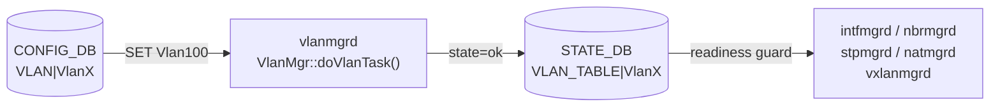

# STATE\_DB VLAN\_TABLE（VLAN 状態テーブル）

## 概要

`STATE_DB` の `VLAN_TABLE` は、[VLAN](../../reference/glossary.md#term-vlan) の作成完了を示す **読み取り専用シグナルテーブル**。[vlanmgrd](../../reference/glossary.md#term-vlanmgrd) が Linux bridge + APP_DB への書き込みを完了した後に 1 エントリを書き込む。複数の cfgmgr デーモンが VLAN インタフェース・ネイバー・NAT・STP・VXLAN 設定を行う前に、このテーブルの存在を readiness ガードとして参照する。

CONFIG_DB の [`VLAN`](vlan.md) テーブル（設定フィールド）とは **別 DB・別テーブル** であることに注意。

書き込み主体:

| プロセス | 書き込みトリガー | ファイル |
|---------|----------------|---------|
| `vlanmgrd` | CONFIG_DB `VLAN` テーブルへの SET 操作が処理完了したとき | `cfgmgr/vlanmgr.cpp` |

<!-- cdb-mermaid -->
### データフロー



<!-- /cdb-mermaid -->

## key 構造

```text
VLAN_TABLE|<VlanName>
```

`<VlanName>` は `Vlan<N>` (N は VLAN ID、2..4094)。CONFIG_DB `VLAN|VlanN` のキーと同一形式。

## フィールド一覧

| フィールド | 書込み主体 | 型 | コード由来デフォルト | 説明 |
|-----------|---------|-----|---------------------|------|
| `state` | `vlanmgrd` | string | `"ok"` 固定 | VLAN 作成完了シグナル。`"ok"` 以外の値は書かれない |

<!-- defaults -->
## コード由来の暗黙デフォルト

| フィールド | YANG default | コード実装デフォルト | 出典 |
|-----------|-------------|---------------------|------|
| `state` | なし（STATE_DB にはYANG 定義なし） | `"ok"` — VLAN SET 処理完了時に vlanmgr.cpp:441 で固定リテラルとして書き込まれる | `vlanmgr.cpp:441` |

### 注記

- **フィールドは `state` の 1 本のみ**: 他のフィールドは存在しない。テーブルにエントリが存在すること自体が VLAN 作成完了を意味する（値を読まず存在チェックのみで判定）。
- **`state` の値は常に `"ok"`**: `"ok"` 以外のステータス（`"error"` 等）は書かれない。失敗時はエントリ自体が存在しない。
- **書き込み順序**: `addHostVlan()` → `m_appVlanTableProducer.set()` → `m_stateVlanTable.set()` の順。STATE_DB への書き込みは Linux bridge 作成と APP_DB 通知の後に行われる (vlanmgr.cpp:383-443)。
- **DEL 時の削除**: CONFIG_DB `VLAN` に DEL 操作が来ると `m_stateVlanTable.del(key)` が呼ばれ、エントリが削除される (vlanmgr.cpp:463)。
<!-- /defaults -->

<!-- ordering -->
## 書込み順序依存 (Phase B)

### SET 時の書込み順序

`doVlanTask()` 内での書込み順序は固定であり、STATE_DB `VLAN_TABLE` への書込みは必ず以下の後に行われる:

1. `addHostVlan(vlan_id)` — Linux bridge (`Vlan<N>`) をカーネルに作成
2. `m_appVlanTableProducer.set()` — APP_DB `VLAN_TABLE` にエントリ書込み
3. `m_stateVlanTable.set(key, [("state","ok")])` — **STATE_DB `VLAN_TABLE` 書込み**（最後）

STATE_DB を読んで ready を確認した時点で、Linux bridge と APP_DB エントリの両方が存在することが保証される (vlanmgr.cpp:383-443)。

### 上流依存: gMacAddress 確定待ち

`gMacAddress` が未確定（syncd/SAI がスイッチ MAC を確定する前）の間、`doVlanTask()` は全タスクを即 return してキューに留める。STATE_DB 書込みは MAC 確定後まで発生しない。

```cpp
// vlanmgr.cpp:318-322
if (!isVlanMacOk())
{
    SWSS_LOG_DEBUG("VLAN mac not ready, delaying VLAN task");
    return;
}
```

**影響**: 起動直後（syncd 未完了）に CONFIG_DB へ `VLAN` SET を書いても、STATE_DB `VLAN_TABLE` は MAC 確定まで空のまま。downstream consumers は ready を検出できず全て自動リトライ待機に入る。

### 下流依存: downstream consumers の処理開始条件

以下の consumers は `isVlanStateOk()` で STATE_DB にエントリが存在するかを確認し、存在しない場合は処理をスキップして自動リトライ待機する:

| consumer | 確認箇所 | 待機対象 |
|---------|---------|---------|
| `vlanmgrd`（VLAN_MEMBER 処理） | `vlanmgr.cpp:642` | VLAN_MEMBER の追加 |
| `intfmgrd` | `intfmgr.cpp:655` | VLAN インタフェース（IP アドレス等）の設定 |
| `nbrmgrd` | `nbrmgr.cpp` | ネイバーエントリの登録 |
| `stpmgrd` | `stpmgr.cpp:1282` | STP ポート/VLAN 設定 |
| `natmgrd` | `natmgr.cpp:102` | NAT エントリの設定 |
| `vxlanmgrd` | `vxlanmgr.cpp:774` | VXLAN tunnel member の設定 |

**影響**: VLAN が STATE_DB に未登録の間、上記の全設定操作は Consumer キュー内に保留される。VLAN の STATE_DB 書込み後、次回 `doTask()` ループで自動的に処理が再開される。

### DEL 時の逆順依存（危険）

```cpp
// vlanmgr.cpp:456-463
removeHostVlan(vlan_id);
m_appVlanTableProducer.del(key);
m_stateVlanTable.del(key);  // STATE_DB エントリを即削除
```

VLAN の DEL 処理で STATE_DB エントリが即削除されるため、残存する VLAN_MEMBER タスクが `isVlanStateOk()` チェックで永遠に false を返し、孤立・滞留する。

**推奨 DEL 順序**: `VLAN_MEMBER` を全て DEL してから `VLAN` を DEL。逆順（VLAN 先 DEL）は VLAN_MEMBER タスクを孤立させる (vlanmgr.cpp:456-471, L642)。

### warm-restart: STATE_DB を根拠とした冪等スキップ

warm-restart 時、STATE_DB `VLAN_TABLE` に既存エントリがあり in-memory セット `m_vlans` に未登録の場合、Linux bridge 再作成をスキップして replay エントリを消化する (vlanmgr.cpp:371-378)。

**cold reboot との差異**: コールドリブートでは STATE_DB がクリアされるため全 VLAN の再処理が走る。warm-reboot では Linux bridge がカーネルに残存するため、STATE_DB エントリ存在確認 → 再作成スキップが機能し、トラフィック断を最小化する。
<!-- /ordering -->

<!-- cross-refs -->
## テーブル間クロスリファレンス (Phase C)

> 根拠: `vlanmgr.cpp` L27-33, L318-322, L371-378, L437-443, L517-530, L642; `intfmgr.cpp` L649-659; `stpmgr.cpp` L210, L1276-1282; `natmgr.cpp` L100-108; `vxlanmgr.cpp` L537, L767-774; `nbrmgr.cpp` L48; `schema.h` L423。
> evidence: `meta/_intermediate/cdb-flow/vlan-state-cross-refs.md`

| 参照元 | 参照先 | 種別 | 必須条件 |
|--------|--------|------|----------|
| `VLAN_TABLE\|VlanN` キー | `CONFIG_DB VLAN\|VlanN` のキー | キー転写（1:1） | CONFIG_DB に VLAN SET が存在すること |
| `vlanmgrd` の書込みトリガー | `CONFIG_DB VLAN\|VlanN` の SET/DEL | イベントトリガー | 常時 |
| `vlanmgrd` の書込み前提 | `gMacAddress`（グローバル変数） | 起動前提チェック | syncd が Switch MAC を確定済みであること。未確定時は全書込みを保留 |
| `intfmgrd` (`isIntfStateOk`) | `STATE_DB VLAN_TABLE\|VlanN` の存在 | readiness ガード（GET） | VLAN インタフェース (SVI) 設定前 |
| `stpmgrd` (`isVlanStateOk`) | `STATE_DB VLAN_TABLE\|VlanN` の存在 | readiness ガード（GET） | STP VLAN/ポート設定前 |
| `natmgrd` (`isPortStateOk`) | `STATE_DB VLAN_TABLE\|VlanN` の存在 | readiness ガード（GET） | NAT エントリ設定前 |
| `vxlanmgrd` (`isVlanStateOk`) | `STATE_DB VLAN_TABLE\|VlanN` の存在 | readiness ガード（GET） | VXLAN tunnel member 設定前 |
| `nbrmgrd` | `STATE_DB VLAN_TABLE\|VlanN` の存在 | readiness ガード（GET） | ネイバーエントリ設定前 |

### キー転写パターン

`VLAN_TABLE` のキーは CONFIG_DB `VLAN` テーブルのキーと同一形式 `VlanN` で、変換なしに転写される:

```
CONFIG_DB VLAN|VlanN  →  vlanmgrd doVlanTask()  →  STATE_DB VLAN_TABLE|VlanN
```

### gMacAddress 依存の影響範囲

`isVlanMacOk()` が false を返す間（起動直後、syncd が Switch MAC を応答するまで）、`doVlanTask()` は全 VLAN タスクを **キューに残したまま即リターン**する。この間は `VLAN_TABLE` への書き込みが完全に停止するため、下流の全 consumers（intfmgrd / stpmgrd / natmgrd / vxlanmgrd / nbrmgrd）は VLAN readiness を得られず、それぞれの処理も保留状態となる。

### consumers の依存パターン（共通）

6 つの consumers は全て同一パターンで `VLAN_TABLE` を参照する:

1. `m_stateVlanTable.get(alias, temp)` で `STATE_DB VLAN_TABLE|VlanN` の存在を確認
2. 存在すれば処理を進める / 存在しなければ `m_toSync` に残してスキップ（自動リトライ）

値（`state=ok`）は参照されず、**エントリの存在のみが判定基準**。

!!! note "nbrmgrd の参照は定義のみ"
    `nbrmgrd` は `m_stateVlanTable` をコンストラクタで保持するが、コード中での直接 `get()` 呼び出しは確認されていない（`nbrmgr.cpp:48`）。ネイバー設定前の VLAN readiness 確認は `intfmgrd` が先行して処理する構造のため、間接的に依存している可能性がある。

<!-- /cross-refs -->

## 読み取り主体

| プロセス | ファイル | 用途 |
|---------|---------|------|
| `vlanmgrd` 自身 | `vlanmgr.cpp:523` (`isVlanStateOk`) | warm-restart 重複スキップ。VLAN member 追加前 readiness ガード |
| `intfmgrd` | `intfmgr.cpp:655` | VLAN インタフェース設定前に VLAN readiness 確認 |
| `nbrmgrd` | `nbrmgr.cpp` | ネイバーエントリ設定前 VLAN readiness ガード |
| `stpmgrd` | `stpmgr.cpp:1282` | STP ポート/VLAN 設定前 readiness ガード |
| `natmgrd` | `natmgr.cpp:102` | NAT エントリ設定前 VLAN readiness ガード |
| `vxlanmgrd` | `vxlanmgr.cpp:774` | VXLAN tunnel member 設定前 VLAN readiness ガード |

すべての読み取りは「エントリが存在するか (bool)」の確認であり、`state` の値そのものを参照するコードは存在しない。

## 例外条件・特殊挙動

- **warm-restart 重複スキップ**: `isVlanStateOk(key)` が true かつ `m_vlans` セットにキーが未登録の場合、vlanmgrd は Linux bridge 再作成をスキップして CONFIG_DB replay エントリを削除する (vlanmgr.cpp:371-378)。STATE_DB エントリ存在が冪等動作の根拠。
- **MAC 未確定時の全保留**: `gMacAddress` が未初期化の間、vlanmgrd は全 VLAN タスクを保留するため STATE_DB への書き込みも遅延する (vlanmgr.cpp:318-321)。

## 確認コマンド

```bash
# 全 VLAN の state エントリ確認
sonic-db-cli STATE_DB keys 'VLAN_TABLE|*'

# 特定 VLAN の確認
sonic-db-cli STATE_DB hgetall 'VLAN_TABLE|Vlan100'
```

## 関連リファレンス

- CONFIG_DB: [`VLAN`](vlan.md)
- CONFIG_DB: [`VLAN_MEMBER`](vlan-member.md)
- CONFIG_DB: [`VLAN_INTERFACE`](vlan-interface.md)
- CLI: [`show vlan brief`](../cli/show-vlan.md)
- YANG: [`sonic-vlan`](../yang/sonic-vlan.md)

<!-- topics-back-ref -->
## 関連 Topics

- [Topics: L2 / VLAN / LAG / MC-LAG](../../topics/06-l2-vlan-lag/index.md)

<!-- /topics-back-ref -->
