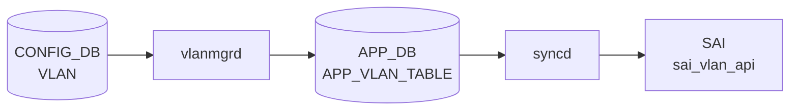

# STATE\_DB VLAN\_TABLE（VLAN 状態テーブル）

## 概要

`STATE_DB` の `VLAN_TABLE` は、[VLAN](../../reference/glossary.md#term-vlan) の作成完了を示す **読み取り専用シグナルテーブル**。[vlanmgrd](../../reference/glossary.md#term-vlanmgrd) が Linux bridge + APP_DB への書き込みを完了した後に 1 エントリを書き込む。複数の cfgmgr デーモンが [VLAN](../../reference/glossary.md#term-vlan) インタフェース・ネイバー・[NAT](../../reference/glossary.md#term-nat)・STP・[VXLAN](../../reference/glossary.md#term-vxlan) 設定を行う前に、このテーブルの存在を readiness ガードとして参照する。

[CONFIG_DB](../../reference/glossary.md#term-config_db) の [`VLAN`](vlan.md) テーブル（設定フィールド）とは **別 DB・別テーブル** であることに注意。

書き込み主体:

| プロセス | 書き込みトリガー | ファイル |
|---------|----------------|---------|
| `vlanmgrd` | [CONFIG_DB](../../reference/glossary.md#term-config_db) `VLAN` テーブルへの SET 操作が処理完了したとき | `cfgmgr/vlanmgr.cpp` |

<!-- cdb-mermaid -->
### データフロー (自動生成)



!!! note "凡例"
    CONFIG_DB から SAI までの典型経路を `docs/reference/config-db-orch-map.md` から機械生成したミニ図。詳細・例外は本ページ本文と対応表を参照。
<!-- /cdb-mermaid -->

## key 構造

```text
VLAN_TABLE|<VlanName>
```

`<VlanName>` は `Vlan<N>` (N は [VLAN](../../reference/glossary.md#term-vlan) ID、2..4094)。[CONFIG_DB](../../reference/glossary.md#term-config_db) `VLAN|VlanN` のキーと同一形式。

## フィールド一覧

| フィールド | 書込み主体 | 型 | コード由来デフォルト | 説明 |
|-----------|---------|-----|---------------------|------|
| `state` | `vlanmgrd` | string | `"ok"` 固定 | VLAN 作成完了シグナル。`"ok"` 以外の値は書かれない |

<!-- defaults -->
## コード由来の暗黙デフォルト

| フィールド | [YANG](../../reference/glossary.md#term-yang) default | コード実装デフォルト | 出典 |
|-----------|-------------|---------------------|------|
| `state` | なし（[STATE_DB](../../reference/glossary.md#term-state_db) にはYANG 定義なし） | `"ok"` — VLAN SET 処理完了時に vlanmgr.cpp:441 で固定リテラルとして書き込まれる | `vlanmgr.cpp:441` |

### 注記

- **フィールドは `state` の 1 本のみ**: 他のフィールドは存在しない。テーブルにエントリが存在すること自体が VLAN 作成完了を意味する（値を読まず存在チェックのみで判定）。
- **`state` の値は常に `"ok"`**: `"ok"` 以外のステータス（`"error"` 等）は書かれない。失敗時はエントリ自体が存在しない。
- **書き込み順序**: `addHostVlan()` → `m_appVlanTableProducer.set()` → `m_stateVlanTable.set()` の順。[STATE_DB](../../reference/glossary.md#term-state_db) への書き込みは Linux bridge 作成と APP_DB 通知の後に行われる (vlanmgr.cpp:383-443)。
- **DEL 時の削除**: CONFIG_DB `VLAN` に DEL 操作が来ると `m_stateVlanTable.del(key)` が呼ばれ、エントリが削除される (vlanmgr.cpp:463)。
<!-- /defaults -->

<!-- ordering -->
## 書込み順序依存 (Phase B)

### SET 時の書込み順序

`doVlanTask()` 内での書込み順序は固定であり、[STATE_DB](../../reference/glossary.md#term-state_db) `VLAN_TABLE` への書込みは必ず以下の後に行われる:

1. `addHostVlan(vlan_id)` — Linux bridge (`Vlan<N>`) をカーネルに作成
2. `m_appVlanTableProducer.set()` — APP_DB `VLAN_TABLE` にエントリ書込み
3. `m_stateVlanTable.set(key, [("state","ok")])` — **STATE_DB `VLAN_TABLE` 書込み**（最後）

STATE_DB を読んで ready を確認した時点で、Linux bridge と APP_DB エントリの両方が存在することが保証される (vlanmgr.cpp:383-443)。

### 上流依存: gMacAddress 確定待ち

`gMacAddress` が未確定（[syncd](../../reference/glossary.md#term-syncd)/[SAI](../../reference/glossary.md#term-sai) がスイッチ MAC を確定する前）の間、`doVlanTask()` は全タスクを即 return してキューに留める。STATE_DB 書込みは MAC 確定後まで発生しない。

```cpp
// vlanmgr.cpp:318-322
if (!isVlanMacOk())
{
    SWSS_LOG_DEBUG("VLAN mac not ready, delaying VLAN task");
    return;
}
```

**影響**: 起動直後（[syncd](../../reference/glossary.md#term-syncd) 未完了）に CONFIG_DB へ `VLAN` SET を書いても、STATE_DB `VLAN_TABLE` は MAC 確定まで空のまま。downstream consumers は ready を検出できず全て自動リトライ待機に入る。

### 下流依存: downstream consumers の処理開始条件

以下の consumers は `isVlanStateOk()` で STATE_DB にエントリが存在するかを確認し、存在しない場合は処理をスキップして自動リトライ待機する:

| consumer | 確認箇所 | 待機対象 |
|---------|---------|---------|
| `vlanmgrd`（VLAN_MEMBER 処理） | `vlanmgr.cpp:642` | VLAN_MEMBER の追加 |
| `intfmgrd` | `intfmgr.cpp:655` | VLAN インタフェース（IP アドレス等）の設定 |
| `nbrmgrd` | `nbrmgr.cpp` | ネイバーエントリの登録 |
| `stpmgrd` | `stpmgr.cpp:1282` | STP ポート/VLAN 設定 |
| `natmgrd` | `natmgr.cpp:102` | [NAT](../../reference/glossary.md#term-nat) エントリの設定 |
| `vxlanmgrd` | `vxlanmgr.cpp:774` | [VXLAN](../../reference/glossary.md#term-vxlan) tunnel member の設定 |

**影響**: VLAN が STATE_DB に未登録の間、上記の全設定操作は Consumer キュー内に保留される。VLAN の STATE_DB 書込み後、次回 `doTask()` ループで自動的に処理が再開される。

### DEL 時の逆順依存（危険）

```cpp
// vlanmgr.cpp:456-463
removeHostVlan(vlan_id);
m_appVlanTableProducer.del(key);
m_stateVlanTable.del(key);  // STATE_DB エントリを即削除
```

VLAN の DEL 処理で STATE_DB エントリが即削除されるため、残存する VLAN_MEMBER タスクが `isVlanStateOk()` チェックで永遠に false を返し、孤立・滞留する。

**推奨 DEL 順序**: `VLAN_MEMBER` を全て DEL してから `VLAN` を DEL。逆順（VLAN 先 DEL）は VLAN_MEMBER タスクを孤立させる (vlanmgr.cpp:456-471, L642)。

### warm-restart: STATE_DB を根拠とした冪等スキップ

warm-restart 時、STATE_DB `VLAN_TABLE` に既存エントリがあり in-memory セット `m_vlans` に未登録の場合、Linux bridge 再作成をスキップして replay エントリを消化する (vlanmgr.cpp:371-378)。

**cold reboot との差異**: コールドリブートでは STATE_DB がクリアされるため全 VLAN の再処理が走る。warm-reboot では Linux bridge がカーネルに残存するため、STATE_DB エントリ存在確認 → 再作成スキップが機能し、トラフィック断を最小化する。
<!-- /ordering -->

<!-- cross-refs -->
## テーブル間クロスリファレンス (Phase C)

> 根拠: `vlanmgr.cpp` L27-33, L318-322, L371-378, L437-443, L517-530, L642; `intfmgr.cpp` L649-659; `stpmgr.cpp` L210, L1276-1282; `natmgr.cpp` L100-108; `vxlanmgr.cpp` L537, L767-774; `nbrmgr.cpp` L48; `schema.h` L423。
> evidence: `meta/_intermediate/cdb-flow/vlan-state-cross-refs.md`

| 参照元 | 参照先 | 種別 | 必須条件 |
|--------|--------|------|----------|
| `VLAN_TABLE\|VlanN` キー | `CONFIG_DB VLAN\|VlanN` のキー | キー転写（1:1） | CONFIG_DB に VLAN SET が存在すること |
| `vlanmgrd` の書込みトリガー | `CONFIG_DB VLAN\|VlanN` の SET/DEL | イベントトリガー | 常時 |
| `vlanmgrd` の書込み前提 | `gMacAddress`（グローバル変数） | 起動前提チェック | [syncd](../../reference/glossary.md#term-syncd) が Switch MAC を確定済みであること。未確定時は全書込みを保留 |
| `intfmgrd` (`isIntfStateOk`) | `STATE_DB VLAN_TABLE\|VlanN` の存在 | readiness ガード（GET） | VLAN インタフェース (SVI) 設定前 |
| `stpmgrd` (`isVlanStateOk`) | `STATE_DB VLAN_TABLE\|VlanN` の存在 | readiness ガード（GET） | STP VLAN/ポート設定前 |
| `natmgrd` (`isPortStateOk`) | `STATE_DB VLAN_TABLE\|VlanN` の存在 | readiness ガード（GET） | [NAT](../../reference/glossary.md#term-nat) エントリ設定前 |
| `vxlanmgrd` (`isVlanStateOk`) | `STATE_DB VLAN_TABLE\|VlanN` の存在 | readiness ガード（GET） | [VXLAN](../../reference/glossary.md#term-vxlan) tunnel member 設定前 |
| `nbrmgrd` | `STATE_DB VLAN_TABLE\|VlanN` の存在 | readiness ガード（GET） | ネイバーエントリ設定前 |

### キー転写パターン

`VLAN_TABLE` のキーは CONFIG_DB `VLAN` テーブルのキーと同一形式 `VlanN` で、変換なしに転写される:

```
CONFIG_DB VLAN|VlanN  →  vlanmgrd doVlanTask()  →  STATE_DB VLAN_TABLE|VlanN
```

### gMacAddress 依存の影響範囲

`isVlanMacOk()` が false を返す間（起動直後、syncd が Switch MAC を応答するまで）、`doVlanTask()` は全 VLAN タスクを **キューに残したまま即リターン**する。この間は `VLAN_TABLE` への書き込みが完全に停止するため、下流の全 consumers（[intfmgrd](../../reference/glossary.md#term-intfmgrd) / stpmgrd / [natmgrd](../../reference/glossary.md#term-natmgrd-natsyncd) / [vxlanmgrd](../../reference/glossary.md#term-vxlanmgrd) / nbrmgrd）は VLAN readiness を得られず、それぞれの処理も保留状態となる。

### consumers の依存パターン（共通）

6 つの consumers は全て同一パターンで `VLAN_TABLE` を参照する:

1. `m_stateVlanTable.get(alias, temp)` で `STATE_DB VLAN_TABLE|VlanN` の存在を確認
2. 存在すれば処理を進める / 存在しなければ `m_toSync` に残してスキップ（自動リトライ）

値（`state=ok`）は参照されず、**エントリの存在のみが判定基準**。

!!! note "nbrmgrd の参照は定義のみ"
    `nbrmgrd` は `m_stateVlanTable` をコンストラクタで保持するが、コード中での直接 `get()` 呼び出しは確認されていない（`nbrmgr.cpp:48`）。ネイバー設定前の VLAN readiness 確認は `intfmgrd` が先行して処理する構造のため、間接的に依存している可能性がある。

<!-- /cross-refs -->

<!-- failure -->
## 失敗挙動 (Phase D)

<!-- evidence: meta/_intermediate/cdb-flow/vlan-state-failure.md -->
<!-- source: sonic-swss/cfgmgr/vlanmgr.cpp (ref: 4305596156d70e9797e8a881b3d19b46de0bce0d) -->

`VLAN_TABLE` への書き込みは `doVlanTask()` の最終ステップであるため、それ以前の失敗は STATE_DB に痕跡を残さない。失敗時は `"error"` 値を書き込む実装は存在せず、エントリ未存在が失敗を間接的に示す。

### 失敗パス一覧

| # | 失敗トリガー | STATE_DB 書込み | リトライ | プロセス影響 |
|---|------------|----------------|---------|------------|
| 1 | キー形式不正（`Vlan` プレフィックス欠如） | なし | なし（即廃棄） | なし |
| 2 | VLAN ID が数値でない | なし | なし（即廃棄） | なし |
| 3 | `addHostVlan()` で Linux bridge 作成コマンドが例外 | なし | なし（[vlanmgrd](../../reference/glossary.md#term-vlanmgrd) 再起動後に再処理） | [vlanmgrd](../../reference/glossary.md#term-vlanmgrd) 再起動 |
| 4 | `gMacAddress` 未確定（syncd 未完了） | なし | 自動（次回 doTask() ループ） | なし |
| 5 | DEL: VLAN が内部セット `m_vlans` に未登録 | 削除なし（既存なし） | なし | なし |
| 6 | VLAN DEL 後に VLAN_MEMBER タスクが残留 | なし（読み取り側が永久 false） | なし（永久滞留） | VLAN_MEMBER 設定停止 |

### 詳細

#### 1 & 2. キー形式不正 → 即廃棄

`doVlanTask()` L334, L346 が `SWSS_LOG_ERROR` を出力して `m_toSync.erase(it)` で消化する。STATE_DB への書き込みはなく、リトライも行われない。

#### 3. `addHostVlan()` — Linux bridge 作成失敗

`addHostVlan()` は `EXEC_WITH_ERROR_THROW` マクロ (L136) を使用する。`/sbin/bridge vlan add` または `/sbin/ip link add` が失敗した場合、`std::runtime_error` が throw される。`doVlanTask()` の呼び出し側でこの例外を catch するコードは存在しないため、プロセスが終了し systemd によって再起動される。STATE_DB `VLAN_TABLE` への書き込みは最終ステップのため発生しない。再起動後に CONFIG_DB の replay で再処理される。

#### 4. `gMacAddress` 未確定 — 全タスク保留

```cpp
// vlanmgr.cpp:318-322
if (!isVlanMacOk())
{
    SWSS_LOG_DEBUG("VLAN mac not ready, delaying VLAN task");
    return;
}
```

syncd が Switch MAC を確定するまで `doVlanTask()` は全タスクを保留する。STATE_DB 書き込みが発生しないため、下流の consumers（[intfmgrd](../../reference/glossary.md#term-intfmgrd) / stpmgrd / [natmgrd](../../reference/glossary.md#term-natmgrd-natsyncd) / [vxlanmgrd](../../reference/glossary.md#term-vxlanmgrd)）は VLAN readiness を得られず、それぞれの処理も保留状態となる。

#### 5 & 6. DEL 関連の注意点

- **DEL: VLAN 未登録**: `m_vlans` に未登録のキーへの DEL は `SWSS_LOG_ERROR` のみで実害なし (vlanmgr.cpp:467)。
- **VLAN_MEMBER 孤立**: VLAN DEL 時に `m_stateVlanTable.del(key)` が即実行される (vlanmgr.cpp:463)。その後に VLAN_MEMBER の SET タスクが処理されると `isVlanStateOk()` が永遠に false を返し、タスクがキューに永久滞留する。VLAN を先に DEL する場合は VLAN_MEMBER を全て先に削除すること。

!!! warning "VLAN_MEMBER の孤立滞留"
    VLAN を先に DEL すると、未処理の VLAN_MEMBER SET タスクが `isVlanStateOk()` チェックで永久に false となり、タスクキューに残留し続ける。`m_toSync` の滞留は `show system-health detail` 等では可視化されず、サイレントに機能停止する。VLAN_MEMBER を全て削除してから VLAN を削除すること。

<!-- /failure -->

<!-- constants -->
## ハードコード定数 (Phase E)

<!-- evidence: meta/_intermediate/cdb-flow/vlan-state-constants.md -->
<!-- source: sonic-swss/cfgmgr/vlanmgr.cpp (ref: 4305596156d70e9797e8a881b3d19b46de0bce0d) -->

`vlanmgrd` が VLAN_TABLE を書き込む際に利用するハードコード定数。いずれも CONFIG_DB / [YANG](../../reference/glossary.md#term-yang) では設定不可。

| 定数 | 値 | 定義箇所 | 用途 |
|------|----|---------|------|
| `DOT1Q_BRIDGE_NAME` | `"Bridge"` | `vlanmgr.cpp:15` | Linux dot1q ブリッジデバイス名。全 VLAN が所属する単一ブリッジ。変更不可 |
| `VLAN_PREFIX` | `"Vlan"` | `vlanmgr.cpp:16` | Linux VLAN インタフェース名のプレフィックス（例: `Vlan100`）。STATE_DB キーと同一形式 |
| `DEFAULT_VLAN_ID` | `"1"` | `vlanmgr.cpp:18` | ブリッジ作成直後に除去する PVID。`bridge vlan del vid 1 dev Bridge self` を実行し VLAN 1 へのフォールスルーを防止 |
| `DEFAULT_MTU_STR` | `"9100"` | `vlanmgr.cpp:19` | ブリッジ作成時の初期 MTU (bytes)。`ip link set Bridge mtu 9100` にハードコード |
| `VLAN_HLEN` | `4` | `vlanmgr.cpp:20` | VLAN ヘッダ長 (bytes)。定義のみで STATE_DB 書き込みに直接は関与しない |

### STATE_DB 書き込みリテラル

`m_stateVlanTable.set(key, {{"state","ok"}})` (vlanmgr.cpp:443) — フィールド名 `"state"` と値 `"ok"` の両方が C++ コードのリテラル。[YANG](../../reference/glossary.md#term-yang) 定義は存在せず、フィールド名・値ともに YANG スキーマによる検証外。

### DEFAULT_MTU_STR = 9100 の影響範囲

`addHostVlan()` 内でブリッジ自体に MTU 9100 を設定するが、個々の `Vlan<N>` インタフェースの MTU は CONFIG_DB `PORT.mtu` → [orchagent](../../reference/glossary.md#term-orchagent) → [SAI](../../reference/glossary.md#term-sai) → カーネルの別経路で設定される。STATE_DB `VLAN_TABLE` の書き込み内容には影響しない。

### VLAN ID 範囲の暗黙制約

`doVlanTask()` は `stoi(key.substr(4))` で VLAN ID を抽出するが、2–4094 の範囲検証はコードに存在しない。範囲外の VLAN ID（0, 1, 4095 等）は Linux カーネルの dot1q が拒否するため `addHostVlan()` が例外を throw し vlanmgrd が再起動する。結果として **STATE_DB `VLAN_TABLE` には VLAN ID 2–4094 のキーのみ現れる**。

<!-- /constants -->

<!-- side-effects -->
## 副次 DB 書込 (Phase F)

<!-- evidence: meta/_intermediate/cdb-flow/vlan-state-side-effects.md -->
<!-- source: sonic-swss/cfgmgr/vlanmgr.cpp (ref: 4305596156d70e9797e8a881b3d19b46de0bce0d) -->

`VLAN_TABLE` への SET/DEL 処理に伴い `vlanmgrd` が書き込む副次 DB エントリ。`vlanmgrd` は cfgmgr 層のデーモンであり [SAI](../../reference/glossary.md#term-sai) を直接呼ばないため、[ASIC_DB](../../reference/glossary.md#term-asic_db) / [COUNTERS_DB](../../reference/glossary.md#term-counters_db) / [FLEX_COUNTER_DB](../../reference/glossary.md#term-flex_counter_db) への書き込みは発生しない。

| 副次 DB | テーブル/キー | 書込内容 | 根拠 |
|---|---|---|---|
| [APPL_DB](../../reference/glossary.md#term-appl_db) | `VLAN_TABLE\|<VlanN>` | SET 時: `admin_status`, `mtu`, `mac`, `host_ifname` を書き込む。DEL 時: エントリ削除 | `vlanmgr.cpp:437` `m_appVlanTableProducer.set(key, fvVector)` — STATE_DB 書込みの直前に同一タスク内で実行される |
| STATE_DB | `VLAN_TABLE\|<VlanN>` | 主作用（本ページ対象） | `vlanmgr.cpp:443` |

その他 (STATE_DB VLAN_MEMBER_TABLE, [APPL_DB](../../reference/glossary.md#term-appl_db) VLAN_MEMBER_TABLE) は VLAN_MEMBER 処理の主作用であり、VLAN_TABLE の副次 DB 書込みではない。

### APP_DB VLAN_TABLE の書込み順序と意味

`m_appVlanTableProducer.set()` は `m_stateVlanTable.set()` の直前に実行される (vlanmgr.cpp:437-443)。[orchagent](../../reference/glossary.md#term-orchagent) の `portsorch` が APP_DB `VLAN_TABLE` を購読しており、SAI VLAN オブジェクトの作成・更新を担う。STATE_DB `VLAN_TABLE` (本ページ) は APP_DB 通知後に書かれ、[orchagent](../../reference/glossary.md#term-orchagent) の SAI 処理とは**非同期**に進む。したがって STATE_DB にエントリが現れた時点では orchagent が SAI VLAN を作成済みとは限らない点に注意。

```
vlanmgrd doVlanTask()
  ├─ addHostVlan()           → Linux kernel bridge 作成
  ├─ m_appVlanTableProducer.set()  → APPL_DB VLAN_TABLE (orchagent へ通知)
  └─ m_stateVlanTable.set()        → STATE_DB VLAN_TABLE (readiness guard 公開)
```

DEL 時も同順:
```
vlanmgrd doVlanTask()
  ├─ removeHostVlan()
  ├─ m_appVlanTableProducer.del()  → APPL_DB VLAN_TABLE 削除
  └─ m_stateVlanTable.del()        → STATE_DB VLAN_TABLE 削除 (readiness guard 消去)
```
<!-- /side-effects -->

<!-- pubsub -->
## PUBSUB / Keyspace 通知メカニズム (Phase G)

<!-- evidence: meta/_intermediate/cdb-flow/vlan-state-pubsub.md -->
<!-- source: sonic-swss/cfgmgr/vlanmgr.h; sonic-swss/cfgmgr/vlanmgr.cpp (ref: 4305596156d70e9797e8a881b3d19b46de0bce0d); sonic-swss/cfgmgr/intfmgr.cpp -->

### 書き込みメカニズム: swss::Table（直接書き込み）

`STATE_DB VLAN_TABLE` への書き込みは `swss::Table` を通じた直接 [Redis](../../reference/glossary.md#term-redis) HSET であり、`ProducerStateTable` は使用しない (vlanmgr.h:26)。

```cpp
// vlanmgr.h:26
Table m_stateVlanTable, m_stateVlanMemberTable;
```

| 操作 | [Redis](../../reference/glossary.md#term-redis) コマンド | チャンネル通知 |
|------|-------------|--------------|
| SET (VLAN 作成完了) | `HSET STATE_DB VLAN_TABLE\|VlanN state ok` | なし（PUBLISH 発生しない） |
| DEL (VLAN 削除) | `DEL STATE_DB VLAN_TABLE\|VlanN` | なし |

`ProducerStateTable` 方式（EVALSHA + PUBLISH）を使わないため、`VLAN_TABLE_CHANNEL@6` のような swss チャンネルは存在しない。[Redis](../../reference/glossary.md#term-redis) の keyspace notification (`__keyspace@6__:VLAN_TABLE|*`) は生成されうるが、swss の標準デーモンはこれを購読していない。

### 読み取りメカニズム: Table::get() によるポーリング

各 consumer は `swss::Table m_stateVlanTable(stateDb, STATE_VLAN_TABLE_NAME)` をコンストラクタで保持し、タスク処理ループ (`doTask()`) 内で `Table::get()` を呼んで readiness を確認する。`SubscriberStateTable` や `ConsumerStateTable` は使用しない。

| consumer | 確認メソッド | 呼び出し箇所 |
|---------|------------|------------|
| `vlanmgrd`（VLAN_MEMBER 処理） | `isVlanStateOk()` → `m_stateVlanTable.get()` | `vlanmgr.cpp:523, 642` |
| `intfmgrd` | `isIntfStateOk()` → `m_stateVlanTable.get()` | `intfmgr.cpp:655` |
| `stpmgrd` | `isVlanStateOk()` → `m_stateVlanTable.get()` | `stpmgr.cpp:1282` |
| `natmgrd` | `isPortStateOk()` → `m_stateVlanTable.get()` | `natmgr.cpp:102` |
| `vxlanmgrd` | `isVlanStateOk()` → `m_stateVlanTable.get()` | `vxlanmgr.cpp:774` |

poll のタイミングは、各 consumer が自身の（CONFIG_DB 等の）イベントを受信して `doTask()` を実行した際に限られる。`VLAN_TABLE` の変化を外部から通知するメカニズムは存在しないため、VLAN 作成完了後に consumer の次回タスク処理が走るまで readiness ガードは更新されない。

### intfmgrd の SubscriberStateTable は PORT / LAG のみ

`intfmgr.cpp:45-55` で `SubscriberStateTable` を登録しているのは `STATE_PORT_TABLE_NAME` および `STATE_LAG_TABLE_NAME` のみ。`STATE_VLAN_TABLE_NAME` の `SubscriberStateTable` は存在せず、VLAN readiness は `doVlanIntfTask()` 内で直接ポーリングされる。

### 使用していない方式

`NotificationConsumer` / TTL / keyspace expire 通知はいずれも使用しない。

<!-- /pubsub -->

---

<!-- platform -->
## プラットフォーム差 (Phase H)

`STATE_DB VLAN_TABLE` の書込スキーマ・格納先・通信方式は**全プラットフォームで共通**。`vlanmgr.cpp` 全 1008 行を `platform`・`mellanox`・`broadcom`・`voq`・`getenv`・`SAI` で grep してもヒット 0 件。Linux kernel bridge 操作のみで SAI を呼ばない純 cfgmgr ロジックのため、ASIC ベンダー依存がない。

詳細調査ログ: `meta/_intermediate/cdb-flow/vlan-state-platform.md`

### 1. fabric ASIC カード — vlanmgrd 不起動

[VOQ](../../reference/glossary.md#term-voq) chassis のファブリック ASIC カードでは `switch_type = "fabric"` となり、`supervisord.conf.j2` の Jinja2 テンプレートが vlanmgrd を起動しない:

```jinja2
{# supervisord.conf.j2:33-38 #}




...

[program:vlanmgrd]   {# fabric ASIC では block ごと除外 #}
```

`switch_type = "fabric"` の ASIC では `STATE_DB VLAN_TABLE` へのエントリが**一切書かれない**。`switch_type = "voq"`（line card）や `switch_type = "switch"`（fixed T0/T1）では `is_fabric_asic=0` となり vlanmgrd は通常起動する（`supervisord.conf.j2:164-177`）。

| switch_type | is_fabric_asic | vlanmgrd 起動 | VLAN_TABLE 書込 |
|------------|--------------|-------------|---------------|
| `"switch"` (fixed) | 0 | あり | 通常通り |
| `"voq"` (line card) | 0 | あり | 通常通り |
| `"fabric"` (fabric card) | 1 | **なし** | **なし** |

### 2. Pensando arm64-elba — ヘルスチェック対象外

```json
// device/pensando/arm64-elba-asic-flash128-r0/system_health_monitoring_config.json
"services_to_ignore": ["vlanmgrd", "vxlanmgrd"]
```

Elba ASIC を搭載した Pensando [DPU](../../reference/glossary.md#term-dpu) プラットフォームでは vlanmgrd は起動するが、`system_health_monitor` のプロセス死活監視から除外されている。vlanmgrd のクラッシュが health check アラームを発報しない点で他プラットフォームと異なる。

### 3. DEFAULT_MTU_STR — 全プラットフォーム共通 9100 バイト

`vlanmgr.cpp:18` の `#define DEFAULT_MTU_STR "9100"` はプラットフォーム env・hwsku に依存しない。VLAN インタフェースのデフォルト MTU は全 SKU で 9100 バイト固定である。

### 4. multi-asic 環境 — namespace ごとに独立した VLAN_TABLE

`vlanmgrd.cpp` は `DBConnector("CONFIG_DB", 0)` 固定で namespace を参照しない。multi-asic ([NPU](../../reference/glossary.md#term-npu) 複数) 環境では各 ASIC namespace で独立した swss コンテナが起動し、それぞれの vlanmgrd が各 namespace の `STATE_DB` に `VLAN_TABLE` エントリを書き込む。chassis 全体を集中管理する VLAN_TABLE は存在しない。

!!! note "fabric カードの readiness ガードへの影響"
    `intfmgrd`・`nbrmgrd`・`stpmgrd` は `isVlanStateOk()` で VLAN_TABLE の存在を確認してから処理を進める。fabric カードでは vlanmgrd が起動しないため VLAN_TABLE が書かれず、これらのデーモンも事実上 VLAN 依存の処理を行わない。fabric ASIC でそれらのデーモンが必要になるユースケースは想定されていない。

> **スキャン証跡**: `vlanmgr.cpp` 全 1008 行 grep（platform/SAI 分岐なし）、`supervisord.conf.j2:33-38,164-177`（is_fabric_asic 定義・vlanmgrd block）、`device/pensando/arm64-elba-asic-flash128-r0/system_health_monitoring_config.json`（services_to_ignore）。
<!-- /platform -->

---

## 読み取り主体

| プロセス | ファイル | 用途 |
|---------|---------|------|
| `vlanmgrd` 自身 | `vlanmgr.cpp:523` (`isVlanStateOk`) | warm-restart 重複スキップ。VLAN member 追加前 readiness ガード |
| `intfmgrd` | `intfmgr.cpp:655` | VLAN インタフェース設定前に VLAN readiness 確認 |
| `nbrmgrd` | `nbrmgr.cpp` | ネイバーエントリ設定前 VLAN readiness ガード |
| `stpmgrd` | `stpmgr.cpp:1282` | STP ポート/VLAN 設定前 readiness ガード |
| `natmgrd` | `natmgr.cpp:102` | NAT エントリ設定前 VLAN readiness ガード |
| `vxlanmgrd` | `vxlanmgr.cpp:774` | VXLAN tunnel member 設定前 VLAN readiness ガード |

すべての読み取りは「エントリが存在するか (bool)」の確認であり、`state` の値そのものを参照するコードは存在しない。

## 例外条件・特殊挙動

- **warm-restart 重複スキップ**: `isVlanStateOk(key)` が true かつ `m_vlans` セットにキーが未登録の場合、vlanmgrd は Linux bridge 再作成をスキップして CONFIG_DB replay エントリを削除する (vlanmgr.cpp:371-378)。STATE_DB エントリ存在が冪等動作の根拠。
- **MAC 未確定時の全保留**: `gMacAddress` が未初期化の間、vlanmgrd は全 VLAN タスクを保留するため STATE_DB への書き込みも遅延する (vlanmgr.cpp:318-321)。

## 確認コマンド

```bash
# 全 VLAN の state エントリ確認
sonic-db-cli STATE_DB keys 'VLAN_TABLE|*'

# 特定 VLAN の確認
sonic-db-cli STATE_DB hgetall 'VLAN_TABLE|Vlan100'
```

## 関連リファレンス

- CONFIG_DB: [`VLAN`](vlan.md)
- CONFIG_DB: [`VLAN_MEMBER`](vlan-member.md)
- CONFIG_DB: [`VLAN_INTERFACE`](vlan-interface.md)
- CLI: [`show vlan brief`](../cli/show-vlan.md)
- YANG: [`sonic-vlan`](../yang/sonic-vlan.md)

<!-- topics-back-ref -->
## 関連 Topics

- [Topics: L2 / VLAN / LAG / MC-LAG](../../topics/06-l2-vlan-lag/index.md)

<!-- /topics-back-ref -->

<!-- glossary-links-injected: 52272bfad047 -->
