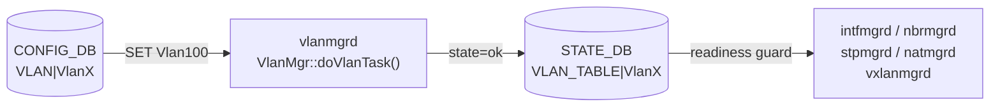

# STATE\_DB VLAN\_TABLE（VLAN 状態テーブル）

## 概要

`STATE_DB` の `VLAN_TABLE` は、[VLAN](../../reference/glossary.md#term-vlan) の作成完了を示す **読み取り専用シグナルテーブル**。[vlanmgrd](../../reference/glossary.md#term-vlanmgrd) が Linux bridge + APP_DB への書き込みを完了した後に 1 エントリを書き込む。複数の cfgmgr デーモンが VLAN インタフェース・ネイバー・NAT・STP・VXLAN 設定を行う前に、このテーブルの存在を readiness ガードとして参照する。

CONFIG_DB の [`VLAN`](vlan.md) テーブル（設定フィールド）とは **別 DB・別テーブル** であることに注意。

書き込み主体:

| プロセス | 書き込みトリガー | ファイル |
|---------|----------------|---------|
| `vlanmgrd` | CONFIG_DB `VLAN` テーブルへの SET 操作が処理完了したとき | `cfgmgr/vlanmgr.cpp` |

<!-- cdb-mermaid -->
### データフロー



<!-- /cdb-mermaid -->

## key 構造

```text
VLAN_TABLE|<VlanName>
```

`<VlanName>` は `Vlan<N>` (N は VLAN ID、2..4094)。CONFIG_DB `VLAN|VlanN` のキーと同一形式。

## フィールド一覧

| フィールド | 書込み主体 | 型 | コード由来デフォルト | 説明 |
|-----------|---------|-----|---------------------|------|
| `state` | `vlanmgrd` | string | `"ok"` 固定 | VLAN 作成完了シグナル。`"ok"` 以外の値は書かれない |

<!-- defaults -->
## コード由来の暗黙デフォルト

| フィールド | YANG default | コード実装デフォルト | 出典 |
|-----------|-------------|---------------------|------|
| `state` | なし（STATE_DB にはYANG 定義なし） | `"ok"` — VLAN SET 処理完了時に vlanmgr.cpp:441 で固定リテラルとして書き込まれる | `vlanmgr.cpp:441` |

### 注記

- **フィールドは `state` の 1 本のみ**: 他のフィールドは存在しない。テーブルにエントリが存在すること自体が VLAN 作成完了を意味する（値を読まず存在チェックのみで判定）。
- **`state` の値は常に `"ok"`**: `"ok"` 以外のステータス（`"error"` 等）は書かれない。失敗時はエントリ自体が存在しない。
- **書き込み順序**: `addHostVlan()` → `m_appVlanTableProducer.set()` → `m_stateVlanTable.set()` の順。STATE_DB への書き込みは Linux bridge 作成と APP_DB 通知の後に行われる (vlanmgr.cpp:383-443)。
- **DEL 時の削除**: CONFIG_DB `VLAN` に DEL 操作が来ると `m_stateVlanTable.del(key)` が呼ばれ、エントリが削除される (vlanmgr.cpp:463)。
<!-- /defaults -->

## 読み取り主体

| プロセス | ファイル | 用途 |
|---------|---------|------|
| `vlanmgrd` 自身 | `vlanmgr.cpp:523` (`isVlanStateOk`) | warm-restart 重複スキップ。VLAN member 追加前 readiness ガード |
| `intfmgrd` | `intfmgr.cpp:655` | VLAN インタフェース設定前に VLAN readiness 確認 |
| `nbrmgrd` | `nbrmgr.cpp` | ネイバーエントリ設定前 VLAN readiness ガード |
| `stpmgrd` | `stpmgr.cpp:1282` | STP ポート/VLAN 設定前 readiness ガード |
| `natmgrd` | `natmgr.cpp:102` | NAT エントリ設定前 VLAN readiness ガード |
| `vxlanmgrd` | `vxlanmgr.cpp:774` | VXLAN tunnel member 設定前 VLAN readiness ガード |

すべての読み取りは「エントリが存在するか (bool)」の確認であり、`state` の値そのものを参照するコードは存在しない。

## 例外条件・特殊挙動

- **warm-restart 重複スキップ**: `isVlanStateOk(key)` が true かつ `m_vlans` セットにキーが未登録の場合、vlanmgrd は Linux bridge 再作成をスキップして CONFIG_DB replay エントリを削除する (vlanmgr.cpp:371-378)。STATE_DB エントリ存在が冪等動作の根拠。
- **MAC 未確定時の全保留**: `gMacAddress` が未初期化の間、vlanmgrd は全 VLAN タスクを保留するため STATE_DB への書き込みも遅延する (vlanmgr.cpp:318-321)。

## 確認コマンド

```bash
# 全 VLAN の state エントリ確認
sonic-db-cli STATE_DB keys 'VLAN_TABLE|*'

# 特定 VLAN の確認
sonic-db-cli STATE_DB hgetall 'VLAN_TABLE|Vlan100'
```

## 関連リファレンス

- CONFIG_DB: [`VLAN`](vlan.md)
- CONFIG_DB: [`VLAN_MEMBER`](vlan-member.md)
- CONFIG_DB: [`VLAN_INTERFACE`](vlan-interface.md)
- CLI: [`show vlan brief`](../cli/show-vlan.md)
- YANG: [`sonic-vlan`](../yang/sonic-vlan.md)

<!-- topics-back-ref -->
## 関連 Topics

- [Topics: L2 / VLAN / LAG / MC-LAG](../../topics/06-l2-vlan-lag/index.md)

<!-- /topics-back-ref -->
