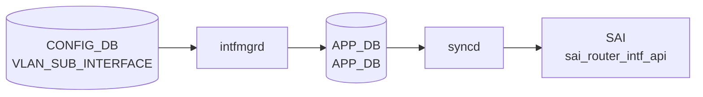

# VLAN_SUB_INTERFACE テーブル

## 概要

`VLAN_SUB_INTERFACE` は物理 port または [PortChannel](../../reference/glossary.md#term-portchannel) 上の 802.1Q sub-interface を定義する [CONFIG_DB](../../reference/glossary.md#term-config_db) テーブル。`Ethernet0.100` や `PortChannel10.100` のような親 interface + [VLAN](../../reference/glossary.md#term-vlan) ID 形式をキーに、admin state、[VRF](../../reference/glossary.md#term-vrf) / [VNET](../../reference/glossary.md#term-vnet) binding、loopback action、encapsulation [VLAN](../../reference/glossary.md#term-vlan)、IP prefix を持つ[^1]。`schema.h` では [CONFIG_DB](../../reference/glossary.md#term-config_db) テーブル名として `CFG_VLAN_SUB_INTF_TABLE_NAME` が定義されている[^2]。

<!-- cdb-mermaid -->
### データフロー (自動生成)



!!! note "凡例"
    CONFIG_DB から SAI までの典型経路を `docs/reference/config-db-orch-map.md` から機械生成したミニ図。詳細・例外は本ページ本文と対応表を参照。
<!-- /cdb-mermaid -->

<!-- defaults -->
## コード由来デフォルト

### field: `mtu`

`intfmgr.cpp:24` で `#define MTU_INHERITANCE "0"` と定義され、CONFIG_DB の `mtu` フィールドが省略された場合に APP_DB へ `mtu = "0"` を書き込むことで「親 IF の MTU を継承」を表現する。

```cpp
// sonic-swss/cfgmgr/intfmgr.cpp:973-978
if (!mtu.empty())
{
    string parentMtu = getIntfMtu(subIf.parentIntf());
    subintf_mtu = setHostSubIntfMtu(alias, mtu, parentMtu);
    // ...
}
else
{
    FieldValueTuple fvTuple("mtu", MTU_INHERITANCE);
    data.push_back(fvTuple);
    m_subIntfList[alias].mtu = MTU_INHERITANCE;
}
```

親 IF の MTU が取得できない場合は `updateSubIntfMtu()` で `DEFAULT_MTU_STR = 9100` (intfmgr.cpp:29) にフォールバック。

### field: `admin_status`

`intfmgr.cpp:980-985` で `adminStatus.empty()` の場合に `"up"` を補完し APP_DB へ書き戻す。実効値は親 IF の admin_status との合成 (`setHostSubIntfAdminStatus`, intfmgr.cpp:512-525): 親が `down` のときは sub-IF も `down` に従う。

```cpp
// sonic-swss/cfgmgr/intfmgr.cpp:980-985
if (adminStatus.empty())
{
    adminStatus = "up";
    FieldValueTuple fvTuple("admin_status", adminStatus);
    data.push_back(fvTuple);
}
```

### field: `vlan` (encapsulation VLAN ID)

short-name 形式 (`Po1.10` / `Eth0.100`) では `vlan` フィールドは必須。`intfmgr.cpp:936-940` で `vlanId == "0"` または空のときは `addHostSubIntf` を呼ばずに `return false` でリトライ待ちになる。

long-name 形式 (`Ethernet0.100` / `PortChannel10.100`) では `subIntf::subIntfIdx()` が名前のドット後 ID を自動採用する (intfmgr.cpp:763-767)。

### parent / sub-IF 関係

`<parent>.<vlanId>` 形式の alias から `subIntf::parentIntf()` で親 IF を導出。`parentAlias.empty()` でない経路でのみ上記の MTU / admin_status 既定処理が動く (intfmgr.cpp:931 以降)。親 IF が `isIntfStateOk()` を満たさない場合は `return false` でリトライ待ち。親 MTU を `setHostSubIntfMtu` 内で上限としてクランプする。

### 関連: vlanmgr.cpp の VLAN tag 既定 (参考)

`vlanmgr.cpp:18` で `#define DEFAULT_VLAN_ID "1"` (bridge default VLAN)、`VLAN_MEMBER.tagging_mode` の暗黙既定は `"untagged"` (vlanmgr.cpp:648)。VLAN_SUB_INTERFACE は kernel 上で `type vlan id` の sub-IF として作られ、bridge default VLAN とは独立な経路。

### デフォルト要約

| フィールド | コード由来デフォルト | 出典 |
|-----------|---------------------|------|
| `mtu` | `"0"` (MTU_INHERITANCE、親継承) | intfmgr.cpp:24, 975-977 |
| `admin_status` | `"up"` (親が `down` なら親に従う) | intfmgr.cpp:982-983, 512-525 |
| `vlan` (short-name) | なし (必須、未設定はリトライ待ち) | intfmgr.cpp:936-940 |
| `vlan` (long-name) | 名前のドット後 ID を自動採用 | intfmgr.cpp:763-767 |
| `loopback_action` / `vrf_name` / `vnet_name` | なし (省略時 APP_DB に書かない) | intfmgr.cpp:789-828 |

詳細な調査メモは `meta/_intermediate/cdb-flow/vlan-sub-interface-defaults.md` 参照。

<!-- /defaults -->

<!-- constants -->
## ハードコード定数（Phase E）

`intfmgr.cpp` および `intfsorch.cpp` に直接埋め込まれた定数・SAI 属性をまとめる。

### VLAN tag 範囲

| 定数 | 値 | 出典 |
|------|----|------|
| VLAN ID 下限 | `1` | YANG: `sonic-vlan-sub-interface.yang` `range "1..4094"` / intfmgr.cpp:936 で `"0"` はリトライ待ち |
| VLAN ID 上限 | `4094` | YANG: `sonic-vlan-sub-interface.yang` `range "1..4094"` |
| `VLAN_SUB_INTERFACE_SEPARATOR` | `"."` | `sonic-swss/tests/test_sub_port_intf.py:54`; intfmgr.cpp:750 で `alias.find(VLAN_SUB_INTERFACE_SEPARATOR)` |

```cpp
// sonic-swss/cfgmgr/intfmgr.cpp:936-940 (抜粋)
if (vlanId == "0" || vlanId.empty())
{
    SWSS_LOG_INFO("Vlan ID not configured for %s", alias.c_str());
    return false;
}
// 有効範囲 1..4094 は YANG で強制。カーネル側は "ip link add ... type vlan id <vlanId>"
```

### SAI sub_port_attr（`SAI_ROUTER_INTERFACE_TYPE_SUB_PORT`）

sub-port RIF 作成時に `intfsorch.cpp:1224` で `Port::SUBPORT` ブランチが実行し、以下の SAI 属性を順番に push する。

| SAI 属性 | 値の型 | 内容 |
|----------|--------|------|
| `SAI_ROUTER_INTERFACE_ATTR_VIRTUAL_ROUTER_ID` | `sai_object_id_t` | VRF OID（全 RIF タイプ共通、先頭に push） |
| `SAI_ROUTER_INTERFACE_ATTR_TYPE` | `SAI_ROUTER_INTERFACE_TYPE_SUB_PORT` | RIF タイプを sub-port に指定 |
| `SAI_ROUTER_INTERFACE_ATTR_PORT_ID` | `sai_object_id_t` | 親ポート OID（`port.m_parent_port_id`） |
| `SAI_ROUTER_INTERFACE_ATTR_OUTER_VLAN_ID` | `uint16_t` | encapsulation VLAN ID（`port.m_vlan_info.vlan_id`） |
| `SAI_ROUTER_INTERFACE_ATTR_ADMIN_V4_STATE` | `bool` | IPv4 転送の有効/無効 |
| `SAI_ROUTER_INTERFACE_ATTR_ADMIN_V6_STATE` | `bool` | IPv6 転送の有効/無効 |
| `SAI_ROUTER_INTERFACE_ATTR_SRC_MAC_ADDRESS` | MAC | システム MAC（全 RIF タイプ共通） |
| `SAI_ROUTER_INTERFACE_ATTR_MTU` | `uint32_t` | MTU 値（全 RIF タイプ共通） |

```cpp
// sonic-swss/orchagent/intfsorch.cpp:1251-1265 (抜粋)
case Port::SUBPORT:
    attr.id = SAI_ROUTER_INTERFACE_ATTR_PORT_ID;
    attr.value.oid = port.m_parent_port_id;
    attrs.push_back(attr);

    attr.id = SAI_ROUTER_INTERFACE_ATTR_OUTER_VLAN_ID;
    attr.value.u16 = port.m_vlan_info.vlan_id;
    attrs.push_back(attr);

    attr.id = SAI_ROUTER_INTERFACE_ATTR_ADMIN_V4_STATE;
    attr.value.booldata = port.m_admin_state_up;
    attrs.push_back(attr);

    attr.id = SAI_ROUTER_INTERFACE_ATTR_ADMIN_V6_STATE;
    attr.value.booldata = port.m_admin_state_up;
    attrs.push_back(attr);
    break;
```

**出典**: `sonic-swss/orchagent/intfsorch.cpp` <https://github.com/sonic-net/sonic-swss/blob/master/orchagent/intfsorch.cpp>

<!-- /constants -->

## key 構造

```text
VLAN_SUB_INTERFACE|<name>
VLAN_SUB_INTERFACE|<name>|<ip-prefix>
```

`<name>` は `ParentInterface.VlanID` 形式。IP prefix 行は同じテーブル名で `<name>` と `<ip-prefix>` を複合キーにする。

## 主要フィールド

### VLAN_SUB_INTERFACE_LIST

| フィールド | 型 | 説明 |
|-----------|----|------|
| `admin_status` | `admin_status` | sub-interface の管理状態 |
| `vrf_name` | leafref `VRF.name` | binding する [VRF](../../reference/glossary.md#term-vrf) |
| `vnet_name` | leafref `VNET.name` | binding する [VNET](../../reference/glossary.md#term-vnet) |
| `loopback_action` | `loopback_action` | ingress packet が同じ L3 interface へ routed される場合の action |
| `vlan` | uint16 1..4094 | short-name 形式で明示する encapsulation [VLAN](../../reference/glossary.md#term-vlan) |

### VLAN_SUB_INTERFACE_IPPREFIX_LIST

| フィールド | 型 | 説明 |
|-----------|----|------|
| `ip-prefix` | `sonic-ip-prefix` | sub-interface に割り当てる IPv4 / IPv6 prefix |

## 制約

- `name` は最大 15 文字で、`<port>.<vlan_id>` / `Eth<n>.<vlan_id>` / `<PortChannel>.<vlan_id>` / `Po<n>.<vlan_id>` の形式。
- parent は `PORT` または `PORTCHANNEL` に存在する必要がある。
- short-name 形式では `vlan` leaf が必要。
- `vrf_name` と `vnet_name` はそれぞれ既存 `VRF` / `VNET` への leafref。
- IP prefix 行の `name` は親 `VLAN_SUB_INTERFACE_LIST.name` への leafref。

## 購読者

- `intfmgrd`: [CONFIG_DB](../../reference/glossary.md#term-config_db) の sub-interface と IP prefix を [APPL_DB](../../reference/glossary.md#term-appl_db) 側の interface 設定へ展開する。
- `orchagent` / `intfsorch`: [APPL_DB](../../reference/glossary.md#term-appl_db) 経由で router interface、IP address、[VRF](../../reference/glossary.md#term-vrf) / [VNET](../../reference/glossary.md#term-vnet) binding を [SAI](../../reference/glossary.md#term-sai) / kernel へ反映する。

## 関連 CONFIG_DB / YANG / CLI

- 関連 CONFIG_DB: `PORT`、`PORTCHANNEL`、`VRF`、`VNET`
- 関連 CLI: `config interface`
- 関連 [YANG](../../reference/glossary.md#term-yang): `sonic-vlan-sub-interface`、`sonic-port`、`sonic-portchannel`、`sonic-vrf`、`sonic-vnet`

<!-- value-behavior -->
## 値依存挙動マトリクス

| フィールド | 値 | 実挙動 |
|-----------|-----|--------|
| `admin_status` | `up` | `ip link set <sub-if> up` |
| `admin_status` | `down` | `ip link set <sub-if> down` |
| `admin_status` | 省略 | `"up"` が自動補完（ただし親 IF の admin_status で実効値が決定）|
| `vlan` | `1`〜`4094` | encapsulation VLAN ID として設定 |
| `vlan` | `0` または空 | `SWSS_LOG_INFO("Vlan ID not configured")` でリトライ待ち (intfmgr.cpp) |
| `loopback_action` | `drop` | 同一 IF に戻るパケットをドロップ |
| `loopback_action` | `forward` | 同一 IF に戻るパケットを転送 |
| `mtu` | 省略 | `MTU_INHERITANCE`（親 IF の MTU を継承）|
| `mtu` | 明示指定 | `ip link set <sub-if> mtu <val>` |

<!-- /value-behavior -->

## 例外条件・特殊挙動 <!-- cdb-exceptions -->

<!-- evidence: sonic-swss/cfgmgr/intfmgr.cpp; sonic-buildimage/src/sonic-yang-models/yang-models/sonic-vlan-sub-interface.yang -->

- **名前長制限 (YANG)**: 15 文字超の場合 YANG `must` 制約で `"please follow vlan sub interface naming convention"` エラー[^exc2]。
- **親インタフェース存在 (YANG)**: ドット前部分が `PORT_LIST` または `PORTCHANNEL_LIST` に存在しない場合 YANG が reject[^exc2]。
- **VLAN ID 範囲 (YANG)**: ドット後 ID は 1〜4094 の範囲が必要[^exc2]。short-name 形式では `vlan` フィールドも必須。
- **`isValid()` チェック**: `intfmgrd` が `subIntf::isValid()` で不正と判定した場合 `SWSS_LOG_ERROR("Invalid subnitf")` を記録してスキップ[^exc1]。
- **VLAN ID 未設定スキップ**: short-name 形式で `vlan` が `"0"` または空の場合リトライ待ち[^exc1]。
- **netdev コマンド失敗**: ip link add / MTU / admin_status 設定で `runtime_error` 発生時は `SWSS_LOG_NOTICE` を記録してリトライ待ち[^exc1]。
- **デフォルト補完**: `mtu` 省略時は `MTU_INHERITANCE`（親継承）、`admin_status` 省略時は `"up"`（親の admin status で実効値が決定）[^exc1]。

[^exc1]: `sonic-swss/cfgmgr/intfmgr.cpp` <https://github.com/sonic-net/sonic-swss/blob/master/cfgmgr/intfmgr.cpp>
[^exc2]: `sonic-buildimage/src/sonic-yang-models/yang-models/sonic-vlan-sub-interface.yang` <https://github.com/sonic-net/sonic-buildimage/blob/master/src/sonic-yang-models/yang-models/sonic-vlan-sub-interface.yang>

<!-- ref-triangle:start -->

## 関連リファレンス

- [YANG](../../reference/glossary.md#term-yang): [`sonic-vlan-sub-interface`](../yang/sonic-vlan-sub-interface.md)
- CLI: [`config interface`](../cli/config-interface.md)

<!-- ref-triangle:end -->

## 引用元

[^1]: [YANG](../../reference/glossary.md#term-yang) 定義: `sonic-vlan-sub-interface.yang`. <https://github.com/sonic-net/sonic-buildimage/blob/9ea932ec2e18f35e58268ec2e4456b1d4afd65cd/src/sonic-yang-models/yang-models/sonic-vlan-sub-interface.yang>
[^2]: テーブル名定数: `schema.h`. <https://github.com/sonic-net/sonic-swss-common/blob/158de8d3463ff4b841653f6d57190bb142b80d9c/common/schema.h>

<!-- topics-back-ref -->
## 関連 Topics

- [Topics: L2 / VLAN / LAG / MC-LAG](../../topics/06-l2-vlan-lag/index.md)

<!-- /topics-back-ref -->

<!-- ops-hint -->
## 運用ヒント

### 典型値

- key 形式: `VLAN_SUB_INTERFACE|<Ethernet|PortChannel>.<vid>`。
- `admin_status`: `up`、`vlan`: `<vid>`。物理 IF の sub-interface として L3 を運ぶ。

### よくある誤設定

- 親 IF を `switchport` 設定にしたまま sub-interface を生やすと L3 が立ち上がらない。

### 確認コマンド

```bash
sonic-db-cli CONFIG_DB keys 'VLAN_SUB_INTERFACE|*'
show subinterface status
```
<!-- /ops-hint -->


<!-- runtime-trace -->
## CDB → 実コンテナ動作トレース

### 段階 1: Consumer 登録

- **orchagent / IntfsOrch**: `VLAN_SUB_INTERFACE` テーブルを `SubscriberStateTable` で購読。

### 段階 2: CFG → APPL 翻訳

- IntfsOrch がサブインタフェース (例: `Ethernet0.100`) の VLAN ID と IP を解析。
- APP_DB `INTF_TABLE` に書き込み。

### 段階 3: APPL → SAI

- IntfsOrch が `sai_router_interface_api->create_router_interface()` で `SAI_ROUTER_INTERFACE_TYPE_SUB_PORT` タイプの RIF を作成。

### 段階 4: タイミング + 副作用

- 親ポート (PORT) が存在しない場合は `task_need_retry`。
- 副作用: サブインタフェース削除時は IP アドレス・ルートが自動削除される。

<!-- /runtime-trace -->
<!-- entry-points -->
## 書き込み入り口 (Direction A)

VLAN_SUB_INTERFACE テーブルへの書き込みが発生するコード経路を網羅的に調査した結果。

### CLI

  - `config interface ip add/remove <Eth....<vlan>> ...` — `config/main.py` が `set_entry('VLAN_SUB_INTERFACE', ...)` を呼ぶ (sonic-utilities/config/main.py)

### minigraph / sonic-cfggen

**minigraph.py** が VLAN_SUB_INTERFACE を生成し投入 (sonic-buildimage/src/sonic-config-engine/minigraph.py)

### REST / gNMI

REST/gNMI 書き込み経路なし

### db_migrator

db_migrator.py での VLAN_SUB_INTERFACE マイグレーションなし

### ビルド時デフォルト (build-time default)

なし

### ハードコードデフォルト / ランタイム注入

なし

### 死活・デッドコード

なし
<!-- /entry-points -->

<!-- ordering -->
## 書込み順依存 (Phase B)

`intfmgrd` (`intfmgr.cpp`) と `orchagent` (`intfsorch.cpp`) は複数の先行条件を順番にチェックし、未充足の場合はリトライ待ちとなる。

### 検出された順序依存

| # | 依存関係 | 方向 | 緩和策 |
|---|----------|------|--------|
| 1 | 親 PORT / PORTCHANNEL が `STATE_DB` に登録済みであること | **先行必須** | 未充足時は `isIntfStateOk()` が `false` → リトライ待ち |
| 2 | short-name 形式では `vlan` フィールドが設定済みであること | **先行必須** | `vlanId == "0"` または空の場合 `return false` → リトライ待ち |
| 3 | `vrf_name` 指定時は `VRF` テーブル + vrfmgrd/VRFOrch 処理完了 | **先行必須** | intfmgrd・intfsorch どちらもリトライ待ち |
| 4 | SAI sub-port RIF 生成: PORT_ID (親 OID) → OUTER_VLAN_ID の順に push | 固定順序 | どちらか欠如でも RIF 生成関数に渡らない（addSubPort 内で保証） |
| 5 | 親 `admin_status` との合成（親 down → sub-IF も down） | 親優先 | 親状態変化時は `STATE_PORT_TABLE` 変更で再トリガー |

### 主要な制約詳細

**PORT 先行必須 (依存 #1)**: `intfmgr.cpp:833` で `isIntfStateOk(parentAlias)` を呼び、`STATE_PORT_TABLE` (Ethernet 系) または `STATE_LAG_TABLE` (PortChannel 系) に親エントリが存在しない場合は `return false` でリトライ待ちとなる。`portmgrd` / `teammgrd` による親ポート状態書き込みが完了している必要がある。

**VLAN tag 順序 (依存 #2)**: short-name 形式で `vlan` フィールドが省略または `"0"` のまま VLAN_SUB_INTERFACE が書き込まれると、`ip link add ... type vlan id` コマンドが実行されずリトライ待ちになる。long-name 形式（`Ethernet0.100` 等）ではキー名からドット後 ID を自動採用するため `vlan` フィールド省略可能。

**SAI sub-port 属性順序 (依存 #4)**: `intfsorch.cpp:1250-1258` で sub-port RIF 生成時に `SAI_ROUTER_INTERFACE_ATTR_PORT_ID`（親ポート OID）と `SAI_ROUTER_INTERFACE_ATTR_OUTER_VLAN_ID`（VLAN tag）を対で push する。`SAI_ROUTER_INTERFACE_ATTR_VIRTUAL_ROUTER_ID`（VRF OID）は全 RIF タイプで先頭に push される固定順序（`intfsorch.cpp:1183`）。

詳細調査ノートは `meta/_intermediate/cdb-flow/vlan-sub-interface-ordering.md` 参照。

<!-- /ordering -->

<!-- cross-refs -->
## 暗黙参照（テーブル間依存・kernel 連携）

### PORT / PORTCHANNEL への暗黙依存

`intfmgr.cpp:833` — `isIntfStateOk(parentAlias)` で STATE_DB の `STATE_PORT_TABLE` または `STATE_LAG_TABLE` を参照し、親 IF が Ready でない場合は `return false` でリトライ待ち。

```cpp
// sonic-swss/cfgmgr/intfmgr.cpp:833
if (!isIntfStateOk(parentAlias.empty() ? alias : parentAlias))
{
    SWSS_LOG_DEBUG("Interface is not ready, skipping %s", alias.c_str());
    return false;
}
```

orchagent 側 (`intfsorch.cpp:905-914`) でも `gPortsOrch->getPort(alias, port)` が失敗した場合に `gPortsOrch->addSubPort(port, alias, vlan, adminUp, mtu)` を呼び、これが PORT / PORTCHANNEL オブジェクトの存在を前提とする。

### VRF への暗黙依存

`intfmgr.cpp:839` — `vrf_name` が設定されている場合、STATE_DB の `STATE_VRF_TABLE` を `isIntfStateOk(vrf_name)` で確認。VRF が Ready でない場合はリトライ待ち。

`intfsorch.cpp:826` — `m_vrfOrch->isVRFexists(vrf_name)` で VRF オブジェクトの存在を確認し、存在しない場合は `task_need_retry`。VRF バインドには `m_vrfOrch->getVRFid()` で SAI VRF OID を取得し、`SAI_ROUTER_INTERFACE_ATTR_VIRTUAL_ROUTER_ID` に設定する。

### PORT / PORTCHANNEL — STATE イベント再トリガー

`intfmgr.cpp:1183` — `doTask()` の consumer ループで `table_name == STATE_PORT_TABLE_NAME` または `STATE_LAG_TABLE_NAME` の場合は `doPortTableTask()` を呼ぶ。これにより親ポートの状態変化（リンクアップ / リンクダウン / 削除）が発生した時点でリトライ待ちの sub-interface 設定が再評価される。

```cpp
// sonic-swss/cfgmgr/intfmgr.cpp:1183-1188
if ((table_name == STATE_PORT_TABLE_NAME) || (table_name == STATE_LAG_TABLE_NAME))
{
    doPortTableTask(kfvKey(t), kfvFieldsValues(t), kfvOp(t));
}
```

### VRF — バインド変更制限

`intfmgr.cpp:846-850` — `isIntfChangeVrf(alias, vrf_name)` が `true`（既に別 VRF にバインド済み）の場合、`SWSS_LOG_ERROR("%s can not change to %s directly, skipping")` を記録して **リトライなし (`return true`)** でスキップする。VRF バインドを変更するには interface を一度削除して再投入する必要がある。

```cpp
// sonic-swss/cfgmgr/intfmgr.cpp:846-850
if (isIntfChangeVrf(alias, vrf_name))
{
    SWSS_LOG_ERROR("%s can not change to %s directly, skipping", alias.c_str(), vrf_name.c_str());
    return true;
}
```

### `isIntfStateOk` の PREFIX 分岐（PORT / PORTCHANNEL / VRF 補完）

`intfmgr.cpp:649-686` の `isIntfStateOk()` は alias プレフィックスを見て参照する STATE_DB テーブルを切り替える:

| プレフィックス | 参照テーブル | 備考 |
|--------------|-------------|------|
| `Vlan` | `STATE_VLAN_TABLE` | bridge VLAN インタフェース |
| `PortChannel` | `STATE_LAG_TABLE` | LAG/LACP バンドル |
| `Vnet` / `Vrf` / `mgmt` | `STATE_VRF_TABLE` | VRF・VNET・管理 VRF |
| その他 (Ethernet 等) | `STATE_PORT_TABLE` | 物理ポート (`state` フィールドで可否判定) |

sub-interface (`Ethernet0.100`) の `parentAlias` (`Ethernet0`) は物理ポートとして `STATE_PORT_TABLE` で判定される。`PortChannel10.100` の場合は `parentAlias` (`PortChannel10`) が `STATE_LAG_TABLE` で判定される。

### VLAN との関係（独立経路）

VLAN_SUB_INTERFACE は `ip link add <alias> link <parent> type vlan id <vid>` で kernel sub-IF を作成する経路（`intfmgr.cpp:944-948`）を通り、VLAN テーブルの bridge VLAN とは独立。ただし `isIntfStateOk()` (intfmgr.cpp:649-686) は `Vlan` プレフィックスを持つ alias に対して `m_stateVlanTable` を参照するため、名前衝突に注意が必要。

### kernel sub-interface 連携

`intfmgrd` は以下の順序で kernel netdev を操作する:

1. `addHostSubIntf(alias, parentAlias, vlanId)` — `ip link add <alias> link <parent> type vlan id <vid>` (intfmgr.cpp:344-378)
2. `setHostSubIntfMtu(alias, mtu, parentMtu)` — `ip link set <alias> mtu <val>`、親 MTU を上限にクランプ (intfmgr.cpp:430-465)
3. `setHostSubIntfAdminStatus(alias, adminStatus)` — `ip link set <alias> up/down`、親 admin_status との合成 (intfmgr.cpp:468-505)
4. SAI 側: `SAI_ROUTER_INTERFACE_TYPE_SUB_PORT` タイプで RIF 作成、`SAI_ROUTER_INTERFACE_ATTR_PORT_ID` に親ポートの OID、`SAI_ROUTER_INTERFACE_ATTR_OUTER_VLAN_ID` に VLAN ID を設定 (intfsorch.cpp:1223-1259)

**出典**:
- `sonic-swss/cfgmgr/intfmgr.cpp` <https://github.com/sonic-net/sonic-swss/blob/master/cfgmgr/intfmgr.cpp>
- `sonic-swss/orchagent/intfsorch.cpp` <https://github.com/sonic-net/sonic-swss/blob/master/orchagent/intfsorch.cpp>

<!-- /cross-refs -->

<!-- failure -->
## 失敗挙動（Phase D）

`intfmgrd`（`intfmgr.cpp`）が sub-interface を設定する際に発生しうる 3 種類の失敗パターンを整理する。

### 1. VLAN tag 不正による設定スキップ

short-name 形式（`Po1.10` / `Eth0.100`）で CONFIG_DB の `vlan` フィールドが `"0"` または空のとき、`intfmgr.cpp:936-939` で以下の分岐が実行される。

```cpp
// sonic-swss/cfgmgr/intfmgr.cpp:936-939
if (vlanId == "0" || vlanId.empty())
{
    SWSS_LOG_INFO("Vlan ID not configured for sub interface %s", alias.c_str());
    return false;
}
```

`return false` はリトライ待ち（`task_need_retry` 相当）を意味し、`SWSS_LOG_INFO` レベルで記録される。`ip link add ... type vlan id` コマンドは実行されない。long-name 形式（`Ethernet0.100`）では `subIntfIdx()` がドット後 ID を自動採用するため、この分岐には到達しない。

### 2. kernel netlink 操作失敗

`addHostSubIntf`（ip link add）、`setHostSubIntfMtu`（ip link set mtu）、`setHostSubIntfAdminStatus`（ip link set up/down）のいずれかで `swss::exec()` が非ゼロを返した場合、各関数は `runtime_error` を `throw` する。呼び出し元の `doTask()` がこれを `catch` して `SWSS_LOG_NOTICE` を記録し、`return false` でリトライ待ちになる。

| 操作 | `SWSS_LOG_NOTICE` メッセージ | コード位置 |
|------|------------------------------|-----------|
| `ip link add` 失敗 | `"Sub interface ip link add failure. Runtime error: %s"` | intfmgr.cpp:947 |
| `ip link set mtu` 失敗 | `"Sub interface ip link set mtu failure. Runtime error: %s"` | intfmgr.cpp:968 |
| `ip link set admin_status` 失敗 | `"Sub interface ip link set admin status %s failure. Runtime error: %s"` | intfmgr.cpp:998 |

なお `setHostSubIntfMtu` 内で `isIntfStateOk(alias)` が `false`（netdev が既に削除済み）のときは `SWSS_LOG_WARN` を記録して `runtime_error` を throw しない（intfmgr.cpp:451-455）。これは portmgrd による親 IF 削除との競合で起こるケース。

### 3. SAI sub-port RIF 生成失敗

`intfsorch.cpp:1296-1304` で `sai_router_intfs_api->create_router_interface()` が `SAI_STATUS_SUCCESS` 以外を返した場合、`SWSS_LOG_ERROR` を記録し `handleSaiCreateStatus` でリトライ可否を判定する。リトライ不可の場合は `runtime_error("Failed to create router interface.")` を throw し、上位の `doTask()` が `task_need_retry` または例外として扱う。

```cpp
// sonic-swss/orchagent/intfsorch.cpp:1296-1304
sai_status_t status = sai_router_intfs_api->create_router_interface(
    &port.m_rif_id, gSwitchId, (uint32_t)attrs.size(), attrs.data());
if (status != SAI_STATUS_SUCCESS)
{
    SWSS_LOG_ERROR("Failed to create router interface %s, rv:%d",
            port.m_alias.c_str(), status);
    if (handleSaiCreateStatus(SAI_API_ROUTER_INTERFACE, status) != task_success)
    {
        throw runtime_error("Failed to create router interface.");
    }
}
```

SAI sub-port の属性として `SAI_ROUTER_INTERFACE_ATTR_PORT_ID`（親ポート OID）と `SAI_ROUTER_INTERFACE_ATTR_OUTER_VLAN_ID`（VLAN tag）が必須。どちらかが欠如した状態では `addSubPort` 内の前段チェックにより `create_router_interface` 呼び出し自体に到達しない（intfsorch.cpp:1223-1260）。また `ref_count > 0`（IP アドレスや VRF binding が残存）の状態で削除しようとすると `removeRouterIntfs` が `return false` を返し RIF 削除はスキップされる（intfsorch.cpp:1327-1331）。

### 失敗パターン要約

| 失敗種別 | トリガー | ログレベル | 挙動 |
|----------|---------|-----------|------|
| VLAN tag 不正（`vlan == "0"` または空） | short-name 形式で `vlan` 未設定 | `SWSS_LOG_INFO` | リトライ待ち（kernel 操作なし）|
| kernel netlink 失敗（ip link add / mtu / admin） | `swss::exec()` 非ゼロ返却 | `SWSS_LOG_NOTICE` | リトライ待ち（`return false`）|
| SAI sub-port RIF 生成失敗 | `create_router_interface()` 非 SUCCESS | `SWSS_LOG_ERROR` | `handleSaiCreateStatus` 判定→ `task_need_retry` or `throw` |

<!-- /failure -->

<!-- side-effects -->
## 副次効果 (Phase F)

> コード精読（`intfmgr.cpp` / `intfsorch.cpp`）から導出した CONFIG_DB 以外への書込みと SAI 副作用。  
> 詳細証跡: `meta/_intermediate/cdb-flow/vlan-sub-interface-side-effects.md`

### SET — 属性ロウ (`VLAN_SUB_INTERFACE|<alias>`)

| 操作 | 対象 DB / テーブル | キー / フィールド | 条件 |
|------|------------------|-----------------|------|
| `INTF_TABLE.set(<alias>, {mtu, admin_status, mac_addr, ...})` | APPL_DB / `INTF_TABLE` | `<alias>` | 常時 (`intfmgrd`) |
| `STATE_INTERFACE_TABLE.hset(<alias>, "vrf", vrf_name)` | STATE_DB / `STATE_INTERFACE_TABLE` | `<alias>` field=`vrf` | 常時 (`intfmgrd`) |
| `STATE_PORT_TABLE.set(<alias>, {state:ok})` | STATE_DB / `STATE_PORT_TABLE` | `<alias>` | Ethernet 系 sub-IF (`intfmgrd:553`) |
| `STATE_LAG_TABLE.set(<alias>, {state:ok})` | STATE_DB / `STATE_LAG_TABLE` | `<alias>` | PortChannel 系 sub-IF (`intfmgrd:548`) |
| `COUNTERS_RIF_NAME_MAP.set("", {<alias>:<oid>})` | COUNTERS_DB / `COUNTERS_RIF_NAME_MAP` | `""` field=`<alias>` | RIF 作成後タイマーで (`IntfsOrch:1537`) |
| `COUNTERS_RIF_TYPE_MAP.set("", {<oid>:SUB_PORT})` | COUNTERS_DB / `COUNTERS_RIF_TYPE_MAP` | `""` field=`<oid>` | RIF 作成後タイマーで (`IntfsOrch:1538`) |
| FlexCounter エントリ登録 | FLEX_COUNTER_DB / `RIF_STAT_COUNTER_FLEX_COUNTER_GROUP:<oid>` | `<oid>` | RIF 作成後 (`IntfsOrch`) |

SAI 呼び出し (`ASIC_DB` に反映):

- `sai_router_intfs_api->create_router_interface(TYPE=SUB_PORT, PORT_ID=<親OID>, OUTER_VLAN_ID=<vid>)` — sub-port RIF OID 生成 (`intfsorch.cpp:1296`)
- `set_router_interface_attribute(LOOPBACK_PACKET_ACTION)` — `loopback_action` 設定時のみ (`intfsorch.cpp:1187-1195`)

### SET — IP プレフィクスロウ (`VLAN_SUB_INTERFACE|<alias>|<ip-prefix>`)

| 操作 | 対象 DB / テーブル | キー / フィールド | 条件 |
|------|------------------|-----------------|------|
| `INTF_TABLE.set(<alias>:<ip-prefix>, {scope, family})` | APPL_DB / `INTF_TABLE` | `<alias>:<ip-prefix>` | IPv4 link-local 以外 (`intfmgr.cpp:1137`) |
| `STATE_INTERFACE_TABLE.hset(<alias>\|<ip-prefix>, "state", "ok")` | STATE_DB / `STATE_INTERFACE_TABLE` | `<alias>\|<ip-prefix>` | IPv4 link-local 以外 (`intfmgr.cpp:1138`) |

SAI 呼び出し:

- `sai_route_api->create_route_entry(...)` — IP2me ルート (CPU trap) 追加
- `sai_neighbor_api->create_neighbor_entry(broadcast)` — IPv4 /30 以上で Directed Broadcast 追加 (サブネットによる条件付き)

### DEL — 属性ロウ (`VLAN_SUB_INTERFACE|<alias>`)

| 操作 | 対象 DB / テーブル | キー | 条件 |
|------|------------------|------|------|
| `INTF_TABLE.del(<alias>)` | APPL_DB / `INTF_TABLE` | `<alias>` | 常時 (`intfmgr.cpp:1088`) |
| `STATE_INTERFACE_TABLE.del(<alias>)` | STATE_DB / `STATE_INTERFACE_TABLE` | `<alias>` | 常時 (`intfmgr.cpp:1089`) |
| `STATE_PORT_TABLE.del(<alias>)` | STATE_DB / `STATE_PORT_TABLE` | `<alias>` | Ethernet 系 sub-IF (`intfmgr.cpp:566`) |
| `STATE_LAG_TABLE.del(<alias>)` | STATE_DB / `STATE_LAG_TABLE` | `<alias>` | PortChannel 系 sub-IF (`intfmgr.cpp:561`) |
| `COUNTERS_RIF_NAME_MAP.hdel("", <alias>)` | COUNTERS_DB / `COUNTERS_RIF_NAME_MAP` | — | RIF 削除時 (`intfsorch.cpp:1560`) |
| `COUNTERS_RIF_TYPE_MAP.hdel("", <oid>)` | COUNTERS_DB / `COUNTERS_RIF_TYPE_MAP` | — | RIF 削除時 (`intfsorch.cpp:1561`) |
| FlexCounter エントリ削除 | FLEX_COUNTER_DB / `RIF_STAT_COUNTER_FLEX_COUNTER_GROUP:<oid>` | `<oid>` | RIF 削除時 (`intfsorch.cpp:1563`) |

SAI 呼び出し:

- `sai_router_intfs_api->remove_router_interface(...)` — sub-port RIF 削除 (`intfsorch.cpp:1346`)

### VOQ 専用副次効果

VOQ システム (`gIsVoqSystemEnabled` = true) かつローカル IF の場合、`voqSyncAddIntf()` / `voqSyncDelIntf()` (intfsorch.cpp:1672-1749) が `CHASSIS_APP_DB` の `CHASSIS_APP_SYSTEM_INTERFACE_TABLE_NAME` に同期する。ただし VLAN_SUB_INTERFACE (`Port::SUBPORT`) を VOQ system_port 上に直接重ねることはサポートされないため、通常の VLAN_SUB_INTERFACE 設定では VOQ 同期パスに到達しない。

<!-- 証跡: sonic-swss/cfgmgr/intfmgr.cpp, sonic-swss/orchagent/intfsorch.cpp -->
<!-- /side-effects -->

<!-- platform-diff -->
## プラットフォーム差異 (Phase H)

VLAN_SUB_INTERFACE の実挙動はプラットフォームタイプによって以下の点で異なる。

### VOQ Chassis / system_port

VOQ (Virtual Output Queue) chassis 構成では `DEVICE_METADATA|localhost` の `switch_type` フィールドが `"voq"` に設定される。この場合 `intfmgrd` は IPv6 アドレス付与コマンドに `metric 256` を追加する[^ph1]。

```cpp
// sonic-swss/cfgmgr/intfmgr.cpp:103-106
if(mySwitchType == "voq")
{
   metric = " metric 256";
}
```

**理由**: VOQ system では eBGP/iBGP 経由で学習されるルートと直接接続ルートの metric を同一にすることで ECMP グループを正しく形成する必要がある。IPv4 は connected/static どちらも metric 0 のため変更不要。IPv6 の connected route は kernel がデフォルト 256 を付与するため明示的に揃える。

`orchagent` 側では、VOQ system_port は `Port::SYSTEM` タイプとして扱われ、RIF タイプは通常の物理ポートと同じ `SAI_ROUTER_INTERFACE_TYPE_PORT` が選択される[^ph2]。VLAN_SUB_INTERFACE（`Port::SUBPORT`）を VOQ system_port 上に直接重ねることはサポートされない。

VOQ inband interface (`CFG_VOQ_INBAND_INTERFACE_TABLE_NAME`) は `intfmgrd` の通常処理をスキップし、APP_DB へ直接リレーされる[^ph1]:

```cpp
// sonic-swss/cfgmgr/intfmgr.cpp:1195-1200
if((table_name == CFG_VOQ_INBAND_INTERFACE_TABLE_NAME) &&
        (op == SET_COMMAND))
{
    //No further processing needed. Just relay to orchagent
    m_appIntfTableProducer.set(keys[0], data);
    m_stateIntfTable.hset(keys[0], "vrf", "");
```

voqSyncAddIntf / voqSyncDelIntf (`intfsorch.cpp:1672-1748`) は `CHASSIS_APP_DB` 上の `SYSTEM_INTERFACE_TABLE` にローカル IF の状態を同期する。リモート system_port（`SAI_SYSTEM_PORT_TYPE_REMOTE`）はスキップされ、ローカル側のみ同期対象となる[^ph2]。

### SmartSwitch DPU

SmartSwitch アーキテクチャでは NPU 側と DPU 側でそれぞれ独立した `orchagent` インスタンスが動作する。VLAN_SUB_INTERFACE は NPU 側の物理ポートまたは PortChannel に対して定義し、DPU 側には直接適用しない。DPU 側は独自のインタフェース管理を持ち、`intfmgr.cpp` に DPU 固有分岐は存在しない。DPU 対向の `switch_type` は `"dpu"` となり、VOQ 分岐（`mySwitchType == "voq"`）には入らないため、IPv6 metric 補正も適用されない。

### Mellanox (Spectrum ASIC)

Mellanox/Spectrum は SAI の `SAI_ROUTER_INTERFACE_TYPE_SUB_PORT` をネイティブサポートする。`intfsorch.cpp` の SUBPORT 分岐（`port.m_parent_port_id` + `SAI_ROUTER_INTERFACE_ATTR_OUTER_VLAN_ID`）はそのまま動作する[^ph2]。`intfmgr.cpp` 側に Mellanox 固有の条件分岐はなく、MTU 継承・admin_status 合成・kernel netdev 操作は共通コードで処理される。

### Broadcom (ASIC)

Broadcom SAI も `SAI_ROUTER_INTERFACE_TYPE_SUB_PORT` をサポートする。動作は Mellanox と同様で `intfmgr.cpp` に Broadcom 固有分岐はない。ただし Broadcom プラットフォームでは SAI 実装（`libsai.so`）が VLAN tag の内部処理を担うため、kernel の vlan netdev が持つ VLAN ID と SAI の `SAI_ROUTER_INTERFACE_ATTR_OUTER_VLAN_ID` が一致している必要がある。`intfsorch.cpp:1255-1256` でこの一致が保証される。

### プラットフォーム差異要約

| 観点 | 標準 (非VOQ) | VOQ Chassis | SmartSwitch DPU |
|------|-------------|-------------|-----------------|
| IPv6 metric 付与 | なし | `metric 256` 追加 | なし |
| system_port 上の VLAN_SUB_INTERFACE | サポート (物理/LAG) | 非サポート (SYSTEM タイプは SUB_PORT 不可) | N/A (DPU 側は別管理) |
| CHASSIS_APP_DB 同期 | なし | voqSyncAddIntf で同期 | なし |
| inband interface 処理 | 通常 doIntfGeneralTask | APP_DB 直リレー (スキップ) | なし |
| SAI RIF タイプ | SUB_PORT | PORT (system_port) | SUB_PORT |

[^ph1]: `sonic-swss/cfgmgr/intfmgr.cpp` <https://github.com/sonic-net/sonic-swss/blob/master/cfgmgr/intfmgr.cpp>
[^ph2]: `sonic-swss/orchagent/intfsorch.cpp` <https://github.com/sonic-net/sonic-swss/blob/master/orchagent/intfsorch.cpp>

<!-- /platform-diff -->
<!-- secondary-db-writes -->
## 副次 DB 書込（Phase F）

`intfmgrd` が VLAN_SUB_INTERFACE エントリを処理する際、CONFIG_DB 以外の複数の DB に書込む。以下はそれぞれの書込経路と証跡。

### 1. APPL_DB — `INTF_TABLE`

`intfmgrd` (`IntfMgr`) は `m_appIntfTableProducer`（`APP_INTF_TABLE_NAME` = `INTF_TABLE`）を介して APPL_DB へ書き込む。

#### 書込タイミングと内容

| 操作 | APPL_DB キー | 書込フィールド | ソース行 |
|------|------------|--------------|---------|
| sub-IF SET (新規/更新) | `<alias>` | `mtu`, `admin_status`, `mac_addr` | `intfmgr.cpp:1053` |
| 親 MTU 変更による伝播 | `<sub-alias>` | `mtu` (子 sub-IF への伝播) | `intfmgr.cpp:426` |
| 親 admin_status 変更による伝播 | `<sub-alias>` | `admin_status` (子 sub-IF への伝播) | `intfmgr.cpp:484` |
| IP prefix SET | `<alias>:<ip-prefix>` | `family`, `scope` | `intfmgr.cpp:1137` |
| sub-IF DEL | `<alias>` | — (del) | `intfmgr.cpp:1088` |
| IP prefix DEL | `<alias>:<ip-prefix>` | — (del) | `intfmgr.cpp:1161` |
| VRF バインド解除時 (warm replay) | `<alias>` | 空フィールド | `intfmgr.cpp:1199` |

**注意**: IPv4 link-local アドレス (`169.254.x.x`) は APPL_DB へ送らない（intfmgr.cpp:1132 の条件分岐）。

```cpp
// sonic-swss/cfgmgr/intfmgr.cpp:1053-1054
m_appIntfTableProducer.set(alias, data);
m_stateIntfTable.hset(alias, "vrf", vrf_name);
```

### 2. STATE_DB — `STATE_INTERFACE_TABLE` / `STATE_PORT_TABLE` / `STATE_LAG_TABLE`

`intfmgrd` は sub-IF の設定完了後に複数の STATE_DB テーブルへ書き込む。

#### STATE_INTERFACE_TABLE（`STATE_INTERFACE_TABLE_NAME`）

| 操作 | キー | フィールド | ソース行 |
|------|-----|----------|---------|
| sub-IF SET 完了時 | `<alias>` | `vrf = <vrf_name>` | `intfmgr.cpp:1054` |
| IP prefix SET 完了時 | `<alias>\|<ip-prefix>` | `state = ok` | `intfmgr.cpp:1138` |
| sub-IF DEL 時 | `<alias>` | — (del) | `intfmgr.cpp:1089` |
| IP prefix DEL 時 | `<alias>\|<ip-prefix>` | — (del) | `intfmgr.cpp:1162` |
| VRF バインド解除時 (warm replay) | `<alias>` | `vrf = ""` | `intfmgr.cpp:1200` |

#### STATE_PORT_TABLE / STATE_LAG_TABLE（sub-IF 状態）

`setSubIntfStateOk()` が sub-IF 作成完了後に呼ばれ、sub-IF の種別に応じてテーブルを分岐する。

```cpp
// sonic-swss/cfgmgr/intfmgr.cpp:542-554
void IntfMgr::setSubIntfStateOk(const string &alias)
{
    vector<FieldValueTuple> fvTuples = {{"state", "ok"}};
    if (!alias.compare(0, strlen(SUBINTF_LAG_PREFIX), SUBINTF_LAG_PREFIX))
        m_stateLagTable.set(alias, fvTuples);   // PortChannel sub-IF
    else
        m_statePortTable.set(alias, fvTuples);  // Ethernet sub-IF
}
```

| sub-IF 種別 | 書込先 STATE_DB テーブル | フィールド | ソース行 |
|------------|----------------------|----------|---------|
| `PortChannel<n>.<vid>` (LAG 系) | `STATE_LAG_TABLE` | `state = ok` | `intfmgr.cpp:548` |
| `Ethernet<n>.<vid>` (PHY 系) | `STATE_PORT_TABLE` | `state = ok` | `intfmgr.cpp:553` |
| DEL 時 (LAG 系) | `STATE_LAG_TABLE` | — (del) | `intfmgr.cpp:561` |
| DEL 時 (PHY 系) | `STATE_PORT_TABLE` | — (del) | `intfmgr.cpp:566` |

### 3. SAI — `SAI_ROUTER_INTERFACE_TYPE_SUB_PORT` RIF 作成

`orchagent` の `IntfsOrch` が APPL_DB `INTF_TABLE` を消費し、syncd 経由で ASIC_DB へ SAI RIF オブジェクトを書き込む。

#### sub-port RIF の SAI 属性

| SAI 属性 | 値 | 説明 |
|---------|---|-----|
| `SAI_ROUTER_INTERFACE_ATTR_VIRTUAL_ROUTER_ID` | VRF OID | 全 RIF タイプ共通・先頭に push (intfsorch.cpp:1183) |
| `SAI_ROUTER_INTERFACE_ATTR_TYPE` | `SAI_ROUTER_INTERFACE_TYPE_SUB_PORT` | sub-port 専用タイプ (intfsorch.cpp:1224) |
| `SAI_ROUTER_INTERFACE_ATTR_PORT_ID` | 親ポート OID (`m_parent_port_id`) | PHY/LAG 親ポートの OID (intfsorch.cpp:1251-1252) |
| `SAI_ROUTER_INTERFACE_ATTR_OUTER_VLAN_ID` | VLAN ID (uint16) | encapsulation VLAN ID (intfsorch.cpp:1255-1256) |
| `SAI_ROUTER_INTERFACE_ATTR_ADMIN_V4_STATE` | `m_admin_state_up` | IPv4 admin 状態 (intfsorch.cpp:1259-1261) |
| `SAI_ROUTER_INTERFACE_ATTR_ADMIN_V6_STATE` | `m_admin_state_up` | IPv6 admin 状態 (intfsorch.cpp:1263-1264) |
| `SAI_ROUTER_INTERFACE_ATTR_SRC_MAC_ADDRESS` | ポート MAC または gMacAddress | (intfsorch.cpp:1198-1208) |
| `SAI_ROUTER_INTERFACE_ATTR_MTU` | `m_mtu` | (intfsorch.cpp:1272-1274) |
| `SAI_ROUTER_INTERFACE_ATTR_LOOPBACK_PACKET_ACTION` | `drop` / `forward` | `loopback_action` 設定時のみ (intfsorch.cpp:1187-1195) |

```cpp
// sonic-swss/orchagent/intfsorch.cpp:1250-1265 (SUBPORT case)
case Port::SUBPORT:
    attr.id = SAI_ROUTER_INTERFACE_ATTR_PORT_ID;
    attr.value.oid = port.m_parent_port_id;
    attrs.push_back(attr);
    attr.id = SAI_ROUTER_INTERFACE_ATTR_OUTER_VLAN_ID;
    attr.value.u16 = port.m_vlan_info.vlan_id;
    attrs.push_back(attr);
    attr.id = SAI_ROUTER_INTERFACE_ATTR_ADMIN_V4_STATE;
    attr.value.booldata = port.m_admin_state_up;
    attrs.push_back(attr);
    attr.id = SAI_ROUTER_INTERFACE_ATTR_ADMIN_V6_STATE;
    attr.value.booldata = port.m_admin_state_up;
    attrs.push_back(attr);
    break;
```

`sai_router_intfs_api->create_router_interface()` でハードウェアへ反映 (intfsorch.cpp:1296)。

### 書込フロー全体

```
VLAN_SUB_INTERFACE SET (CONFIG_DB)
  └─ intfmgrd (IntfMgr::doIntfGeneralTask)
       ├─ addHostSubIntf()           — kernel: ip link add <alias> link <parent> type vlan id <vid>
       ├─ setHostSubIntfMtu()        — kernel: ip link set <alias> mtu <val>
       ├─ setHostSubIntfAdminStatus()— kernel: ip link set <alias> up/down
       ├─ setSubIntfStateOk()        — STATE_DB: STATE_PORT_TABLE / STATE_LAG_TABLE[<alias>].state=ok
       ├─ m_appIntfTableProducer.set(alias, data)
       │     — APPL_DB: INTF_TABLE[<alias>] {mtu, admin_status, mac_addr, ...}
       └─ m_stateIntfTable.hset(alias, "vrf", vrf_name)
             — STATE_DB: STATE_INTERFACE_TABLE[<alias>].vrf = <vrf_name>

VLAN_SUB_INTERFACE|<alias>|<ip-prefix> SET (CONFIG_DB)
  └─ intfmgrd (IntfMgr::doIntfAddrTask)
       ├─ setIntfIp()                — kernel: ip addr add <prefix> dev <alias>
       ├─ m_appIntfTableProducer.set(appKey, fvVector)
       │     — APPL_DB: INTF_TABLE[<alias>:<ip-prefix>] {family, scope}
       └─ m_stateIntfTable.hset(..., "state", "ok")
             — STATE_DB: STATE_INTERFACE_TABLE[<alias>|<ip-prefix>].state = ok

APPL_DB INTF_TABLE[<alias>] 消費
  └─ orchagent (IntfsOrch::addRouterIntfs)
       └─ sai_router_intfs_api->create_router_interface(SAI_ROUTER_INTERFACE_TYPE_SUB_PORT)
             — ASIC_DB (syncd 経由)
```

### 証跡サマリ

| 書込先 DB | テーブル | 操作 | コンポーネント | evidence |
|---------|---------|-----|-------------|---------|
| APPL_DB | `INTF_TABLE[<alias>]` | SET | intfmgrd | `intfmgr.cpp:1053` |
| APPL_DB | `INTF_TABLE[<alias>:<prefix>]` | SET | intfmgrd | `intfmgr.cpp:1137` |
| APPL_DB | `INTF_TABLE[<alias>]` | DEL | intfmgrd | `intfmgr.cpp:1088` |
| APPL_DB | `INTF_TABLE[<sub-alias>]` | SET (MTU伝播) | intfmgrd | `intfmgr.cpp:426` |
| APPL_DB | `INTF_TABLE[<sub-alias>]` | SET (admin伝播) | intfmgrd | `intfmgr.cpp:484` |
| STATE_DB | `STATE_INTERFACE_TABLE[<alias>]` | HSET vrf | intfmgrd | `intfmgr.cpp:1054` |
| STATE_DB | `STATE_INTERFACE_TABLE[<alias>\|<prefix>]` | HSET state=ok | intfmgrd | `intfmgr.cpp:1138` |
| STATE_DB | `STATE_PORT_TABLE[<Eth-sub-alias>]` | SET state=ok | intfmgrd | `intfmgr.cpp:553` |
| STATE_DB | `STATE_LAG_TABLE[<Po-sub-alias>]` | SET state=ok | intfmgrd | `intfmgr.cpp:548` |
| ASIC_DB (SAI) | `SAI_ROUTER_INTERFACE_TYPE_SUB_PORT` | CREATE | orchagent/IntfsOrch | `intfsorch.cpp:1224, 1296` |

<!-- /secondary-db-writes -->

<!-- comm-mechanism -->
## 通信メカニズム (Phase G)

### Producer/Consumer ペア

CONFIG_DB から SAI までの全通信は Redis の **keyspace notification** と **ProducerStateTable/ConsumerStateTable** パターンで構成される。

#### CONFIG_DB → intfmgrd (SubscriberStateTable)

`intfmgrd` は `intfmgrd.cpp:28-35` で `cfg_intf_tables` ベクタに `CFG_VLAN_SUB_INTF_TABLE_NAME` を含め、`Orch(cfgDb, tableNames)` コンストラクタが各テーブルに対して `SubscriberStateTable` を生成する。

```cpp
// sonic-swss/cfgmgr/intfmgrd.cpp:28-35
vector<string> cfg_intf_tables = {
    CFG_INTF_TABLE_NAME,
    CFG_LAG_INTF_TABLE_NAME,
    CFG_VLAN_INTF_TABLE_NAME,
    CFG_LOOPBACK_INTERFACE_TABLE_NAME,
    CFG_VLAN_SUB_INTF_TABLE_NAME,      // ← VLAN_SUB_INTERFACE テーブル
    CFG_VOQ_INBAND_INTERFACE_TABLE_NAME,
};
```

`SubscriberStateTable` は Redis の keyspace notification を用いる。

```
PSUBSCRIBE __keyspace@4__:VLAN_SUB_INTERFACE|*
```

`hset` / `hdel` / `del` イベント受信 → `readData()` がバッファに蓄積 → `pops()` でキーを取り出し `TABLE.get(key)` で現在値取得 → `Consumer::doTask()` → `IntfMgr::doTask()` 呼び出し。

また、親ポートの状態変化を検知するために STATE_DB の `STATE_PORT_TABLE` と `STATE_LAG_TABLE` も別途 `SubscriberStateTable` で購読する (`intfmgr.cpp:45-53`)。親の admin_status・MTU 変化を sub-interface に伝播するために必要。

#### intfmgrd → APPL_DB (ProducerStateTable)

`doIntfGeneralTask` がサブインタフェース属性を確定した後、`m_appIntfTableProducer`（`ProducerStateTable(appDb, APP_INTF_TABLE_NAME)`）で `APP_INTF_TABLE` に書き込む (`intfmgr.cpp:1053`)。

| 項目 | 値 |
|------|----|
| Publish チャンネル | `APP_INTF_TABLE_CHANNEL@0` |
| Key SET | `APP_INTF_TABLE_KEY_SET` |
| Del SET | `APP_INTF_TABLE_DEL_SET` |
| 一時 hash | `_APP_INTF_TABLE:<alias>` |

Lua スクリプト (`EVALSHA`) が `SADD KEY_SET` + `HSET _APP_INTF_TABLE:<alias>` + `PUBLISH APP_INTF_TABLE_CHANNEL@0 G` をアトミックに実行する。IP prefix 行 (`doIntfAddrTask`) も同じ Producer を使い `APP_INTF_TABLE|<alias>|<prefix>` キーで書き込む (`intfmgr.cpp:1137`)。

#### APPL_DB → orchagent/IntfsOrch (ConsumerStateTable → SAI sub_port)

`orchdaemon` が `IntfsOrch` を生成し、`ConsumerStateTable` が `APP_INTF_TABLE_CHANNEL@0` を購読する。

```
WATCH APP_INTF_TABLE_KEY_SET
SUBSCRIBE APP_INTF_TABLE_CHANNEL@0
```

チャンネル通知で `Select::select()` が wake-up → `consumer_state_table_pops.lua` (`SPOP KEY_SET` + `HGETALL _APP_INTF_TABLE:<alias>`) で一括取得 → `IntfsOrch::doTask()` → サブインタフェース処理へ進む (`intfsorch.cpp:905-914`)。

**SAI sub_port RIF 作成経路**:

```cpp
// sonic-swss/orchagent/intfsorch.cpp:1223-1265
case Port::SUBPORT:
    attr.value.s32 = SAI_ROUTER_INTERFACE_TYPE_SUB_PORT;   // RIF タイプ
    attrs.push_back(attr);
    ...
    attr.id = SAI_ROUTER_INTERFACE_ATTR_PORT_ID;
    attr.value.oid = port.m_parent_port_id;                // 親ポート OID
    attrs.push_back(attr);

    attr.id = SAI_ROUTER_INTERFACE_ATTR_OUTER_VLAN_ID;
    attr.value.u16 = port.m_vlan_info.vlan_id;             // VLAN tag
    attrs.push_back(attr);

    attr.id = SAI_ROUTER_INTERFACE_ATTR_ADMIN_V4_STATE;
    attr.value.booldata = port.m_admin_state_up;
    attrs.push_back(attr);
    attr.id = SAI_ROUTER_INTERFACE_ATTR_ADMIN_V6_STATE;
    attr.value.booldata = port.m_admin_state_up;
    attrs.push_back(attr);
```

`sai_router_intf_api->create_router_interface()` に `attrs` を渡して ASIC に sub_port RIF を生成する。`SAI_ROUTER_INTERFACE_ATTR_VIRTUAL_ROUTER_ID`（VRF OID）は全 RIF タイプで先頭に push される固定順序 (`intfsorch.cpp:1183`)。

### STATE_DB への書き込み

`intfmgrd` はサブインタフェース処理完了時に STATE_DB (`STATE_INTERFACE_TABLE`) に書き込む。TTL は使用しない。

| タイミング | 操作 |
|-----------|------|
| sub-IF 属性設定完了 | `m_stateIntfTable.hset(alias, "vrf", vrf_name)` |
| IP アドレス追加完了 | `m_stateIntfTable.hset("<alias>\|<prefix>", "state", "ok")` |
| IP アドレス削除 | `m_stateIntfTable.del("<alias>\|<prefix>")` |
| sub-IF 削除 | `m_stateIntfTable.del(alias)` |

`setSubIntfStateOk(alias)` / `removeSubIntfState(alias)` (`intfmgr.cpp:542-567`) が STATE_DB 操作を担当する。`isIntfCreated(alias)` は `m_stateIntfTable.get(alias, ...)` で STATE_DB エントリの有無を確認し、IP アドレス設定の前提条件チェックに用いる。

### select() ループと retry

`intfmgrd` の main ループはタイムアウト 1000 ms で `Select::select()` を呼ぶ (`intfmgrd.cpp:17,59`)。

```
SELECT_TIMEOUT = 1000 ms
if (TIMEOUT) { intfmgr.doTask(); }  // 未処理タスクを全 consumer で再試行
```

`doIntfGeneralTask` / `doIntfAddrTask` が `false` を返した場合（親 IF / VRF が not ready）、エントリは `m_toSync` に残留し次のループで再試行される。

**出典**:
- `sonic-swss/cfgmgr/intfmgrd.cpp` <https://github.com/sonic-net/sonic-swss/blob/master/cfgmgr/intfmgrd.cpp>
- `sonic-swss/cfgmgr/intfmgr.cpp` <https://github.com/sonic-net/sonic-swss/blob/master/cfgmgr/intfmgr.cpp>
- `sonic-swss/orchagent/intfsorch.cpp` <https://github.com/sonic-net/sonic-swss/blob/master/orchagent/intfsorch.cpp>

<!-- /comm-mechanism -->

<!-- glossary-links-injected: 8acafc795b83 -->
