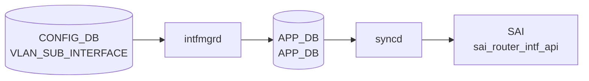

# VLAN_SUB_INTERFACE テーブル

## 概要

`VLAN_SUB_INTERFACE` は物理 port または [PortChannel](../../reference/glossary.md#term-portchannel) 上の 802.1Q sub-interface を定義する [CONFIG_DB](../../reference/glossary.md#term-config_db) テーブル。`Ethernet0.100` や `PortChannel10.100` のような親 interface + [VLAN](../../reference/glossary.md#term-vlan) ID 形式をキーに、admin state、[VRF](../../reference/glossary.md#term-vrf) / [VNET](../../reference/glossary.md#term-vnet) binding、loopback action、encapsulation VLAN、IP prefix を持つ[^1]。`schema.h` では CONFIG_DB テーブル名として `CFG_VLAN_SUB_INTF_TABLE_NAME` が定義されている[^2]。

<!-- cdb-mermaid -->
### データフロー (自動生成)



!!! note "凡例"
    CONFIG_DB から SAI までの典型経路を `docs/reference/config-db-orch-map.md` から機械生成したミニ図。詳細・例外は本ページ本文と対応表を参照。
<!-- /cdb-mermaid -->

## key 構造

```text
VLAN_SUB_INTERFACE|<name>
VLAN_SUB_INTERFACE|<name>|<ip-prefix>
```

`<name>` は `ParentInterface.VlanID` 形式。IP prefix 行は同じテーブル名で `<name>` と `<ip-prefix>` を複合キーにする。

## 主要フィールド

### VLAN_SUB_INTERFACE_LIST

| フィールド | 型 | 説明 |
|-----------|----|------|
| `admin_status` | `admin_status` | sub-interface の管理状態 |
| `vrf_name` | leafref `VRF.name` | binding する VRF |
| `vnet_name` | leafref `VNET.name` | binding する VNET |
| `loopback_action` | `loopback_action` | ingress packet が同じ L3 interface へ routed される場合の action |
| `vlan` | uint16 1..4094 | short-name 形式で明示する encapsulation VLAN |

### VLAN_SUB_INTERFACE_IPPREFIX_LIST

| フィールド | 型 | 説明 |
|-----------|----|------|
| `ip-prefix` | `sonic-ip-prefix` | sub-interface に割り当てる IPv4 / IPv6 prefix |

## 制約

- `name` は最大 15 文字で、`<port>.<vlan_id>` / `Eth<n>.<vlan_id>` / `<PortChannel>.<vlan_id>` / `Po<n>.<vlan_id>` の形式。
- parent は `PORT` または `PORTCHANNEL` に存在する必要がある。
- short-name 形式では `vlan` leaf が必要。
- `vrf_name` と `vnet_name` はそれぞれ既存 `VRF` / `VNET` への leafref。
- IP prefix 行の `name` は親 `VLAN_SUB_INTERFACE_LIST.name` への leafref。

## 購読者

- `intfmgrd`: CONFIG_DB の sub-interface と IP prefix を [APPL_DB](../../reference/glossary.md#term-appl_db) 側の interface 設定へ展開する。
- `orchagent` / `intfsorch`: APPL_DB 経由で router interface、IP address、VRF / VNET binding を [SAI](../../reference/glossary.md#term-sai) / kernel へ反映する。

## 関連 CONFIG_DB / YANG / CLI

- 関連 CONFIG_DB: `PORT`、`PORTCHANNEL`、`VRF`、`VNET`
- 関連 CLI: `config interface`
- 関連 [YANG](../../reference/glossary.md#term-yang): `sonic-vlan-sub-interface`、`sonic-port`、`sonic-portchannel`、`sonic-vrf`、`sonic-vnet`

<!-- ref-triangle:start -->

## 関連リファレンス

- YANG: [`sonic-vlan-sub-interface`](../yang/sonic-vlan-sub-interface.md)
- CLI: [`config interface`](../cli/config-interface.md)

<!-- ref-triangle:end -->

## 引用元

[^1]: YANG 定義: `sonic-vlan-sub-interface.yang`. <https://github.com/sonic-net/sonic-buildimage/blob/9ea932ec2e18f35e58268ec2e4456b1d4afd65cd/src/sonic-yang-models/yang-models/sonic-vlan-sub-interface.yang>
[^2]: テーブル名定数: `schema.h`. <https://github.com/sonic-net/sonic-swss-common/blob/158de8d3463ff4b841653f6d57190bb142b80d9c/common/schema.h>

<!-- topics-back-ref -->
## 関連 Topics

- [Topics: L2 / VLAN / LAG / MC-LAG](../../topics/06-l2-vlan-lag/index.md)

<!-- /topics-back-ref -->

<!-- ops-hint -->
## 運用ヒント

### 典型値

- key 形式: `VLAN_SUB_INTERFACE|<Ethernet|PortChannel>.<vid>`。
- `admin_status`: `up`、`vlan`: `<vid>`。物理 IF の sub-interface として L3 を運ぶ。

### よくある誤設定

- 親 IF を `switchport` 設定にしたまま sub-interface を生やすと L3 が立ち上がらない。

### 確認コマンド

```bash
sonic-db-cli CONFIG_DB keys 'VLAN_SUB_INTERFACE|*'
show subinterface status
```
<!-- /ops-hint -->

<!-- glossary-links-injected: f53f85ca209b -->
