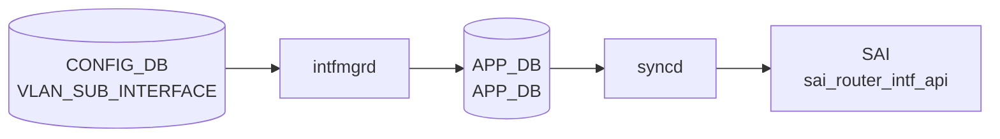

# VLAN_SUB_INTERFACE テーブル

## 概要

`VLAN_SUB_INTERFACE` は物理 port または [PortChannel](../../reference/glossary.md#term-portchannel) 上の 802.1Q sub-interface を定義する [CONFIG_DB](../../reference/glossary.md#term-config_db) テーブル。`Ethernet0.100` や `PortChannel10.100` のような親 interface + [VLAN](../../reference/glossary.md#term-vlan) ID 形式をキーに、admin state、[VRF](../../reference/glossary.md#term-vrf) / [VNET](../../reference/glossary.md#term-vnet) binding、loopback action、encapsulation [VLAN](../../reference/glossary.md#term-vlan)、IP prefix を持つ[^1]。`schema.h` では [CONFIG_DB](../../reference/glossary.md#term-config_db) テーブル名として `CFG_VLAN_SUB_INTF_TABLE_NAME` が定義されている[^2]。

<!-- cdb-mermaid -->
### データフロー (自動生成)



!!! note "凡例"
    CONFIG_DB から SAI までの典型経路を `docs/reference/config-db-orch-map.md` から機械生成したミニ図。詳細・例外は本ページ本文と対応表を参照。
<!-- /cdb-mermaid -->

<!-- defaults -->
## コード由来デフォルト

### field: `mtu`

`intfmgr.cpp:24` で `#define MTU_INHERITANCE "0"` と定義され、CONFIG_DB の `mtu` フィールドが省略された場合に APP_DB へ `mtu = "0"` を書き込むことで「親 IF の MTU を継承」を表現する。

```cpp
// sonic-swss/cfgmgr/intfmgr.cpp:973-978
if (!mtu.empty())
{
    string parentMtu = getIntfMtu(subIf.parentIntf());
    subintf_mtu = setHostSubIntfMtu(alias, mtu, parentMtu);
    // ...
}
else
{
    FieldValueTuple fvTuple("mtu", MTU_INHERITANCE);
    data.push_back(fvTuple);
    m_subIntfList[alias].mtu = MTU_INHERITANCE;
}
```

親 IF の MTU が取得できない場合は `updateSubIntfMtu()` で `DEFAULT_MTU_STR = 9100` (intfmgr.cpp:29) にフォールバック。

### field: `admin_status`

`intfmgr.cpp:980-985` で `adminStatus.empty()` の場合に `"up"` を補完し APP_DB へ書き戻す。実効値は親 IF の admin_status との合成 (`setHostSubIntfAdminStatus`, intfmgr.cpp:512-525): 親が `down` のときは sub-IF も `down` に従う。

```cpp
// sonic-swss/cfgmgr/intfmgr.cpp:980-985
if (adminStatus.empty())
{
    adminStatus = "up";
    FieldValueTuple fvTuple("admin_status", adminStatus);
    data.push_back(fvTuple);
}
```

### field: `vlan` (encapsulation VLAN ID)

short-name 形式 (`Po1.10` / `Eth0.100`) では `vlan` フィールドは必須。`intfmgr.cpp:936-940` で `vlanId == "0"` または空のときは `addHostSubIntf` を呼ばずに `return false` でリトライ待ちになる。

long-name 形式 (`Ethernet0.100` / `PortChannel10.100`) では `subIntf::subIntfIdx()` が名前のドット後 ID を自動採用する (intfmgr.cpp:763-767)。

### parent / sub-IF 関係

`<parent>.<vlanId>` 形式の alias から `subIntf::parentIntf()` で親 IF を導出。`parentAlias.empty()` でない経路でのみ上記の MTU / admin_status 既定処理が動く (intfmgr.cpp:931 以降)。親 IF が `isIntfStateOk()` を満たさない場合は `return false` でリトライ待ち。親 MTU を `setHostSubIntfMtu` 内で上限としてクランプする。

### 関連: vlanmgr.cpp の VLAN tag 既定 (参考)

`vlanmgr.cpp:18` で `#define DEFAULT_VLAN_ID "1"` (bridge default VLAN)、`VLAN_MEMBER.tagging_mode` の暗黙既定は `"untagged"` (vlanmgr.cpp:648)。VLAN_SUB_INTERFACE は kernel 上で `type vlan id` の sub-IF として作られ、bridge default VLAN とは独立な経路。

### デフォルト要約

| フィールド | コード由来デフォルト | 出典 |
|-----------|---------------------|------|
| `mtu` | `"0"` (MTU_INHERITANCE、親継承) | intfmgr.cpp:24, 975-977 |
| `admin_status` | `"up"` (親が `down` なら親に従う) | intfmgr.cpp:982-983, 512-525 |
| `vlan` (short-name) | なし (必須、未設定はリトライ待ち) | intfmgr.cpp:936-940 |
| `vlan` (long-name) | 名前のドット後 ID を自動採用 | intfmgr.cpp:763-767 |
| `loopback_action` / `vrf_name` / `vnet_name` | なし (省略時 APP_DB に書かない) | intfmgr.cpp:789-828 |

詳細な調査メモは `meta/_intermediate/cdb-flow/vlan-sub-interface-defaults.md` 参照。

<!-- /defaults -->

## key 構造

```text
VLAN_SUB_INTERFACE|<name>
VLAN_SUB_INTERFACE|<name>|<ip-prefix>
```

`<name>` は `ParentInterface.VlanID` 形式。IP prefix 行は同じテーブル名で `<name>` と `<ip-prefix>` を複合キーにする。

## 主要フィールド

### VLAN_SUB_INTERFACE_LIST

| フィールド | 型 | 説明 |
|-----------|----|------|
| `admin_status` | `admin_status` | sub-interface の管理状態 |
| `vrf_name` | leafref `VRF.name` | binding する [VRF](../../reference/glossary.md#term-vrf) |
| `vnet_name` | leafref `VNET.name` | binding する [VNET](../../reference/glossary.md#term-vnet) |
| `loopback_action` | `loopback_action` | ingress packet が同じ L3 interface へ routed される場合の action |
| `vlan` | uint16 1..4094 | short-name 形式で明示する encapsulation [VLAN](../../reference/glossary.md#term-vlan) |

### VLAN_SUB_INTERFACE_IPPREFIX_LIST

| フィールド | 型 | 説明 |
|-----------|----|------|
| `ip-prefix` | `sonic-ip-prefix` | sub-interface に割り当てる IPv4 / IPv6 prefix |

## 制約

- `name` は最大 15 文字で、`<port>.<vlan_id>` / `Eth<n>.<vlan_id>` / `<PortChannel>.<vlan_id>` / `Po<n>.<vlan_id>` の形式。
- parent は `PORT` または `PORTCHANNEL` に存在する必要がある。
- short-name 形式では `vlan` leaf が必要。
- `vrf_name` と `vnet_name` はそれぞれ既存 `VRF` / `VNET` への leafref。
- IP prefix 行の `name` は親 `VLAN_SUB_INTERFACE_LIST.name` への leafref。

## 購読者

- `intfmgrd`: [CONFIG_DB](../../reference/glossary.md#term-config_db) の sub-interface と IP prefix を [APPL_DB](../../reference/glossary.md#term-appl_db) 側の interface 設定へ展開する。
- `orchagent` / `intfsorch`: [APPL_DB](../../reference/glossary.md#term-appl_db) 経由で router interface、IP address、[VRF](../../reference/glossary.md#term-vrf) / [VNET](../../reference/glossary.md#term-vnet) binding を [SAI](../../reference/glossary.md#term-sai) / kernel へ反映する。

## 関連 CONFIG_DB / YANG / CLI

- 関連 CONFIG_DB: `PORT`、`PORTCHANNEL`、`VRF`、`VNET`
- 関連 CLI: `config interface`
- 関連 [YANG](../../reference/glossary.md#term-yang): `sonic-vlan-sub-interface`、`sonic-port`、`sonic-portchannel`、`sonic-vrf`、`sonic-vnet`

<!-- value-behavior -->
## 値依存挙動マトリクス

| フィールド | 値 | 実挙動 |
|-----------|-----|--------|
| `admin_status` | `up` | `ip link set <sub-if> up` |
| `admin_status` | `down` | `ip link set <sub-if> down` |
| `admin_status` | 省略 | `"up"` が自動補完（ただし親 IF の admin_status で実効値が決定）|
| `vlan` | `1`〜`4094` | encapsulation VLAN ID として設定 |
| `vlan` | `0` または空 | `SWSS_LOG_INFO("Vlan ID not configured")` でリトライ待ち (intfmgr.cpp) |
| `loopback_action` | `drop` | 同一 IF に戻るパケットをドロップ |
| `loopback_action` | `forward` | 同一 IF に戻るパケットを転送 |
| `mtu` | 省略 | `MTU_INHERITANCE`（親 IF の MTU を継承）|
| `mtu` | 明示指定 | `ip link set <sub-if> mtu <val>` |

<!-- /value-behavior -->

## 例外条件・特殊挙動 <!-- cdb-exceptions -->

<!-- evidence: sonic-swss/cfgmgr/intfmgr.cpp; sonic-buildimage/src/sonic-yang-models/yang-models/sonic-vlan-sub-interface.yang -->

- **名前長制限 (YANG)**: 15 文字超の場合 YANG `must` 制約で `"please follow vlan sub interface naming convention"` エラー[^exc2]。
- **親インタフェース存在 (YANG)**: ドット前部分が `PORT_LIST` または `PORTCHANNEL_LIST` に存在しない場合 YANG が reject[^exc2]。
- **VLAN ID 範囲 (YANG)**: ドット後 ID は 1〜4094 の範囲が必要[^exc2]。short-name 形式では `vlan` フィールドも必須。
- **`isValid()` チェック**: `intfmgrd` が `subIntf::isValid()` で不正と判定した場合 `SWSS_LOG_ERROR("Invalid subnitf")` を記録してスキップ[^exc1]。
- **VLAN ID 未設定スキップ**: short-name 形式で `vlan` が `"0"` または空の場合リトライ待ち[^exc1]。
- **netdev コマンド失敗**: ip link add / MTU / admin_status 設定で `runtime_error` 発生時は `SWSS_LOG_NOTICE` を記録してリトライ待ち[^exc1]。
- **デフォルト補完**: `mtu` 省略時は `MTU_INHERITANCE`（親継承）、`admin_status` 省略時は `"up"`（親の admin status で実効値が決定）[^exc1]。

[^exc1]: `sonic-swss/cfgmgr/intfmgr.cpp` <https://github.com/sonic-net/sonic-swss/blob/master/cfgmgr/intfmgr.cpp>
[^exc2]: `sonic-buildimage/src/sonic-yang-models/yang-models/sonic-vlan-sub-interface.yang` <https://github.com/sonic-net/sonic-buildimage/blob/master/src/sonic-yang-models/yang-models/sonic-vlan-sub-interface.yang>

<!-- ref-triangle:start -->

## 関連リファレンス

- [YANG](../../reference/glossary.md#term-yang): [`sonic-vlan-sub-interface`](../yang/sonic-vlan-sub-interface.md)
- CLI: [`config interface`](../cli/config-interface.md)

<!-- ref-triangle:end -->

## 引用元

[^1]: [YANG](../../reference/glossary.md#term-yang) 定義: `sonic-vlan-sub-interface.yang`. <https://github.com/sonic-net/sonic-buildimage/blob/9ea932ec2e18f35e58268ec2e4456b1d4afd65cd/src/sonic-yang-models/yang-models/sonic-vlan-sub-interface.yang>
[^2]: テーブル名定数: `schema.h`. <https://github.com/sonic-net/sonic-swss-common/blob/158de8d3463ff4b841653f6d57190bb142b80d9c/common/schema.h>

<!-- topics-back-ref -->
## 関連 Topics

- [Topics: L2 / VLAN / LAG / MC-LAG](../../topics/06-l2-vlan-lag/index.md)

<!-- /topics-back-ref -->

<!-- ops-hint -->
## 運用ヒント

### 典型値

- key 形式: `VLAN_SUB_INTERFACE|<Ethernet|PortChannel>.<vid>`。
- `admin_status`: `up`、`vlan`: `<vid>`。物理 IF の sub-interface として L3 を運ぶ。

### よくある誤設定

- 親 IF を `switchport` 設定にしたまま sub-interface を生やすと L3 が立ち上がらない。

### 確認コマンド

```bash
sonic-db-cli CONFIG_DB keys 'VLAN_SUB_INTERFACE|*'
show subinterface status
```
<!-- /ops-hint -->


<!-- runtime-trace -->
## CDB → 実コンテナ動作トレース

### 段階 1: Consumer 登録

- **orchagent / IntfsOrch**: `VLAN_SUB_INTERFACE` テーブルを `SubscriberStateTable` で購読。

### 段階 2: CFG → APPL 翻訳

- IntfsOrch がサブインタフェース (例: `Ethernet0.100`) の VLAN ID と IP を解析。
- APP_DB `INTF_TABLE` に書き込み。

### 段階 3: APPL → SAI

- IntfsOrch が `sai_router_interface_api->create_router_interface()` で `SAI_ROUTER_INTERFACE_TYPE_SUB_PORT` タイプの RIF を作成。

### 段階 4: タイミング + 副作用

- 親ポート (PORT) が存在しない場合は `task_need_retry`。
- 副作用: サブインタフェース削除時は IP アドレス・ルートが自動削除される。

<!-- /runtime-trace -->
<!-- entry-points -->
## 書き込み入り口 (Direction A)

VLAN_SUB_INTERFACE テーブルへの書き込みが発生するコード経路を網羅的に調査した結果。

### CLI

  - `config interface ip add/remove <Eth....<vlan>> ...` — `config/main.py` が `set_entry('VLAN_SUB_INTERFACE', ...)` を呼ぶ (sonic-utilities/config/main.py)

### minigraph / sonic-cfggen

**minigraph.py** が VLAN_SUB_INTERFACE を生成し投入 (sonic-buildimage/src/sonic-config-engine/minigraph.py)

### REST / gNMI

REST/gNMI 書き込み経路なし

### db_migrator

db_migrator.py での VLAN_SUB_INTERFACE マイグレーションなし

### ビルド時デフォルト (build-time default)

なし

### ハードコードデフォルト / ランタイム注入

なし

### 死活・デッドコード

なし
<!-- /entry-points -->

<!-- ordering -->
## 書込み順依存 (Phase B)

`intfmgrd` (`intfmgr.cpp`) と `orchagent` (`intfsorch.cpp`) は複数の先行条件を順番にチェックし、未充足の場合はリトライ待ちとなる。

### 検出された順序依存

| # | 依存関係 | 方向 | 緩和策 |
|---|----------|------|--------|
| 1 | 親 PORT / PORTCHANNEL が `STATE_DB` に登録済みであること | **先行必須** | 未充足時は `isIntfStateOk()` が `false` → リトライ待ち |
| 2 | short-name 形式では `vlan` フィールドが設定済みであること | **先行必須** | `vlanId == "0"` または空の場合 `return false` → リトライ待ち |
| 3 | `vrf_name` 指定時は `VRF` テーブル + vrfmgrd/VRFOrch 処理完了 | **先行必須** | intfmgrd・intfsorch どちらもリトライ待ち |
| 4 | SAI sub-port RIF 生成: PORT_ID (親 OID) → OUTER_VLAN_ID の順に push | 固定順序 | どちらか欠如でも RIF 生成関数に渡らない（addSubPort 内で保証） |
| 5 | 親 `admin_status` との合成（親 down → sub-IF も down） | 親優先 | 親状態変化時は `STATE_PORT_TABLE` 変更で再トリガー |

### 主要な制約詳細

**PORT 先行必須 (依存 #1)**: `intfmgr.cpp:833` で `isIntfStateOk(parentAlias)` を呼び、`STATE_PORT_TABLE` (Ethernet 系) または `STATE_LAG_TABLE` (PortChannel 系) に親エントリが存在しない場合は `return false` でリトライ待ちとなる。`portmgrd` / `teammgrd` による親ポート状態書き込みが完了している必要がある。

**VLAN tag 順序 (依存 #2)**: short-name 形式で `vlan` フィールドが省略または `"0"` のまま VLAN_SUB_INTERFACE が書き込まれると、`ip link add ... type vlan id` コマンドが実行されずリトライ待ちになる。long-name 形式（`Ethernet0.100` 等）ではキー名からドット後 ID を自動採用するため `vlan` フィールド省略可能。

**SAI sub-port 属性順序 (依存 #4)**: `intfsorch.cpp:1250-1258` で sub-port RIF 生成時に `SAI_ROUTER_INTERFACE_ATTR_PORT_ID`（親ポート OID）と `SAI_ROUTER_INTERFACE_ATTR_OUTER_VLAN_ID`（VLAN tag）を対で push する。`SAI_ROUTER_INTERFACE_ATTR_VIRTUAL_ROUTER_ID`（VRF OID）は全 RIF タイプで先頭に push される固定順序（`intfsorch.cpp:1183`）。

詳細調査ノートは `meta/_intermediate/cdb-flow/vlan-sub-interface-ordering.md` 参照。

<!-- /ordering -->

<!-- cross-refs -->
## 暗黙参照（テーブル間依存・kernel 連携）

### PORT / PORTCHANNEL への暗黙依存

`intfmgr.cpp:833` — `isIntfStateOk(parentAlias)` で STATE_DB の `STATE_PORT_TABLE` または `STATE_LAG_TABLE` を参照し、親 IF が Ready でない場合は `return false` でリトライ待ち。

```cpp
// sonic-swss/cfgmgr/intfmgr.cpp:833
if (!isIntfStateOk(parentAlias.empty() ? alias : parentAlias))
{
    SWSS_LOG_DEBUG("Interface is not ready, skipping %s", alias.c_str());
    return false;
}
```

orchagent 側 (`intfsorch.cpp:905-914`) でも `gPortsOrch->getPort(alias, port)` が失敗した場合に `gPortsOrch->addSubPort(port, alias, vlan, adminUp, mtu)` を呼び、これが PORT / PORTCHANNEL オブジェクトの存在を前提とする。

### VRF への暗黙依存

`intfmgr.cpp:839` — `vrf_name` が設定されている場合、STATE_DB の `STATE_VRF_TABLE` を `isIntfStateOk(vrf_name)` で確認。VRF が Ready でない場合はリトライ待ち。

`intfsorch.cpp:826` — `m_vrfOrch->isVRFexists(vrf_name)` で VRF オブジェクトの存在を確認し、存在しない場合は `task_need_retry`。VRF バインドには `m_vrfOrch->getVRFid()` で SAI VRF OID を取得し、`SAI_ROUTER_INTERFACE_ATTR_VIRTUAL_ROUTER_ID` に設定する。

### VLAN との関係（独立経路）

VLAN_SUB_INTERFACE は `ip link add <alias> link <parent> type vlan id <vid>` で kernel sub-IF を作成する経路（`intfmgr.cpp:944-948`）を通り、VLAN テーブルの bridge VLAN とは独立。ただし `isIntfStateOk()` (intfmgr.cpp:649-686) は `Vlan` プレフィックスを持つ alias に対して `m_stateVlanTable` を参照するため、名前衝突に注意が必要。

### kernel sub-interface 連携

`intfmgrd` は以下の順序で kernel netdev を操作する:

1. `addHostSubIntf(alias, parentAlias, vlanId)` — `ip link add <alias> link <parent> type vlan id <vid>` (intfmgr.cpp:344-378)
2. `setHostSubIntfMtu(alias, mtu, parentMtu)` — `ip link set <alias> mtu <val>`、親 MTU を上限にクランプ (intfmgr.cpp:430-465)
3. `setHostSubIntfAdminStatus(alias, adminStatus)` — `ip link set <alias> up/down`、親 admin_status との合成 (intfmgr.cpp:468-505)
4. SAI 側: `SAI_ROUTER_INTERFACE_TYPE_SUB_PORT` タイプで RIF 作成、`SAI_ROUTER_INTERFACE_ATTR_PORT_ID` に親ポートの OID、`SAI_ROUTER_INTERFACE_ATTR_OUTER_VLAN_ID` に VLAN ID を設定 (intfsorch.cpp:1223-1259)

**出典**:
- `sonic-swss/cfgmgr/intfmgr.cpp` <https://github.com/sonic-net/sonic-swss/blob/master/cfgmgr/intfmgr.cpp>
- `sonic-swss/orchagent/intfsorch.cpp` <https://github.com/sonic-net/sonic-swss/blob/master/orchagent/intfsorch.cpp>

<!-- /cross-refs -->

<!-- glossary-links-injected: 8acafc795b83 -->
