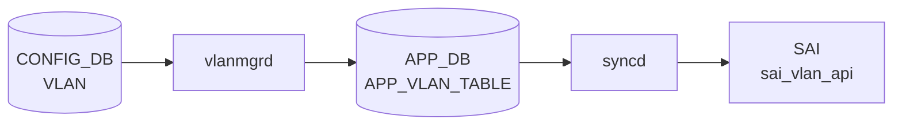

# VLAN テーブル

## 概要

IEEE 802.1Q [VLAN](../../reference/glossary.md#term-vlan) を [CONFIG_DB](../../reference/glossary.md#term-config_db) で定義するテーブル。[VLAN](../../reference/glossary.md#term-vlan) 名 (`Vlan100` 形式) をキーに、[VLAN](../../reference/glossary.md#term-vlan) ID、DHCP リレーサーバ、MTU、admin status、MAC、エイリアスを保持する[^1]。`VLAN_MEMBER` と組合わせてポート割当てを、`VLAN_INTERFACE` と組合わせて L3 IF を構成する。

<!-- cdb-mermaid -->
### データフロー (自動生成)



!!! note "凡例"
    CONFIG_DB から SAI までの典型経路を `docs/reference/config-db-orch-map.md` から機械生成したミニ図。詳細・例外は本ページ本文と対応表を参照。
<!-- /cdb-mermaid -->

## key 構造

```text
VLAN|<name>
```

`<name>` は `Vlan<id>` (id 範囲 2..4094)。

## フィールド一覧

| フィールド | 型 | 必須 | デフォルト | 説明 |
|-----------|----|------|-----------|------|
| `name` (key) | string `Vlan<2..4094>` | ✅ | - | VLAN 名 |
| `vlanid` | uint16 (2..4094) | - | - | VLAN ID。`name` 末尾と一致しなければならない (`must`) |
| `alias` | string | - | - | ユーザ別名 |
| `description` | string (1..255) | - | - | 説明 |
| `dhcp_servers` | leaf-list ip-address | - | - | DHCPv4 リレー先 |
| `dhcpv6_servers` | leaf-list ipv6-address | - | - | DHCPv6 リレー先 |
| `mtu` | uint16 (1..9216) | - | - | MTU |
| `admin_status` | `admin_status` | - | - | 管理状態 |
| `mac` | mac-address | - | - | VLAN 上の MAC |

## 制約

- `vlanid` は `name` の数値部分と一致しなければならない (`substring-after(../name, 'Vlan') = current()`)

## 購読者

- `vlanmgrd`: VLAN 作成・MTU・admin_status をモニタし Linux bridge に反映
- `orchagent` の `VlanMgr` / `VRouterOrch`: [SAI](../../reference/glossary.md#term-sai) bridge / VLAN を構成
- `dhcprelayd` (`sonic-dhcp-relay`): `dhcp_servers` / `dhcpv6_servers` を読み出して relay agent を構成

## 関連 CONFIG_DB / YANG / CLI

- 関連 [CONFIG_DB](../../reference/glossary.md#term-config_db): `VLAN_MEMBER`、`VLAN_INTERFACE`、`DHCP_RELAY`
- 関連 CLI: `config vlan` (add / del / member / dhcp_relay)
- 関連 [YANG](../../reference/glossary.md#term-yang): `sonic-vlan`

<!-- defaults -->
## コード由来の暗黙デフォルト

| フィールド | YANG default | コード実装デフォルト | 出典 |
|-----------|-------------|---------------------|------|
| `admin_status` | なし | `"up"` — フィールド省略時に `fvVector` へ自動補完 (vlanmgr.cpp:424) | vlanmgrd |
| `mtu` | なし | `9100` (`DEFAULT_MTU_STR`) — 省略時に APP_DB へ注入 (vlanmgr.cpp:19,357,428) | vlanmgrd |
| `mac` | なし | `gMacAddress`（スイッチ MAC）— 省略時に APP_DB へ注入 (vlanmgr.cpp:358) | vlanmgrd |
| `vlanid` | なし | コードで未使用（YANG バリデーション専用 dead field） | - |
| `alias` | なし | コードで未使用（dead field） | - |
| `description` | なし | コードで未使用（dead field） | - |
| `dhcp_servers` | なし（leaf-list）| vlanmgrd は無視。dhcprelayd が CONFIG_DB を直接購読 | dhcprelayd |
| `dhcpv6_servers` | なし（leaf-list）| vlanmgrd は無視。dhcprelayd が CONFIG_DB を直接購読 | dhcprelayd |

### 注記

- **`mtu` の silent drop**: `mtu` は APP_DB に書かれるが、ホスト側 netdev (`ip link set Vlan<N> mtu`) への適用は TODO 状態 (vlanmgr.cpp:401-406)。明示指定しても netdev MTU は変わらない。
- **`mac` の書き込み順依存**: `gMacAddress` が未初期化（スイッチ MAC 未確定）の間、vlanmgrd は全 VLAN タスクを保留する (vlanmgr.cpp:318-321)。
- **`dhcp_servers` の経路乖離**: vlanmgrd→APP_DB 経路を通らず、dhcprelayd が CONFIG_DB `VLAN` テーブルを直接購読する。vlanmgrd の処理順序に非依存。
- **SAI デフォルト**: orchagent は `SAI_VLAN_ATTR_VLAN_ID` のみ指定して `sai_vlan_api->create_vlan()` を呼ぶ (portsorch.cpp:7392)。flooding control 等はプラットフォーム SAI デフォルトに委ねられる。
<!-- /defaults -->

<!-- value-behavior -->
## 値依存挙動マトリクス

| フィールド | 値 | 実挙動 |
|-----------|-----|--------|
| `admin_status` | `up` | `ip link set Vlan<id> up` (vlanmgr.cpp:168-170) |
| `admin_status` | `down` | `ip link set Vlan<id> down` |
| `admin_status` | 省略 | `"up"` が自動補完される (vlanmgr.cpp:424) |
| `mtu` | 省略 | `DEFAULT_MTU_STR`（通常 `9100`）が使用される (vlanmgr.cpp:96) |
| `mtu` | 明示指定 | 受け取るが netdev MTU は変更しない。`SWSS_LOG_DEBUG("Host VLAN mtu setting to be supported.")` のみ出力（TODO 状態）|
| `mac` | 省略 | `gMacAddress`（スイッチ MAC）が自動補完 |
| `mac` | 明示指定 | 指定 MAC が VLAN インタフェース MAC として設定される |
| `dhcp_servers` | leaf-list | `dhcprelayd` がリストを読み DHCPv4 relay を構成 |
| `dhcp_servers` | 単一文字列誤入力 | `dhcprelayd` が relay を起動しない（leaf-list 形式で入力必須）|
| `vlanid` | `name` 末尾と不一致 | YANG `must` 違反で reject |

<!-- /value-behavior -->

## 例外条件・特殊挙動 <!-- cdb-exceptions -->

<!-- evidence: sonic-swss/cfgmgr/vlanmgr.cpp; sonic-buildimage/src/sonic-yang-models/yang-models/sonic-vlan.yang -->

- **キー形式検証**: `Vlan<2..4094>` パターン。`Vlan` プレフィクスがない、または数値部が不正な場合 `vlanmgrd` はエントリを破棄する (`SWSS_LOG_ERROR("Invalid key format")`)[^exc1]。
- **`vlanid` 整合性 (YANG)**: `must "substring-after(../name, 'Vlan') = current()"` — `name` 末尾と `vlanid` フィールドが不一致の場合 YANG バリデーションが reject する[^exc2]。
- **MTU 無視**: `mtu` フィールドはホスト VLAN netdev への適用が TODO 扱いで、`vlanmgrd` は受け取っても `SWSS_LOG_DEBUG("Host VLAN mtu setting to be supported.")` のみ出力し実際には変更しない[^exc1]。
- **warm-restart 重複スキップ**: [STATE_DB](../../reference/glossary.md#term-state_db) に既存かつ `m_vlans` に登録済みの場合、再作成をスキップして replay エントリを削除する（"already created" デバッグログ）[^exc1]。
- **デフォルト補完**: `mtu` 省略時は `DEFAULT_MTU_STR`（通常 `9100`）、`mac` 省略時はスイッチ MAC が自動補完される[^exc1]。

[^exc1]: `sonic-swss/cfgmgr/vlanmgr.cpp` <https://github.com/sonic-net/sonic-swss/blob/master/cfgmgr/vlanmgr.cpp>
[^exc2]: `sonic-buildimage/src/sonic-yang-models/yang-models/sonic-vlan.yang` <https://github.com/sonic-net/sonic-buildimage/blob/master/src/sonic-yang-models/yang-models/sonic-vlan.yang>

<!-- ref-triangle:start -->

## 関連リファレンス

- [YANG](../../reference/glossary.md#term-yang): [`sonic-vlan`](../yang/sonic-vlan.md)
- CLI: [`config vlan`](../cli/config-vlan.md)

<!-- ref-triangle:end -->

## 引用元

[^1]: [YANG](../../reference/glossary.md#term-yang) 定義: `sonic-buildimage/src/sonic-yang-models/yang-models/sonic-vlan.yang` (sha `9ea932ec`). <https://github.com/sonic-net/sonic-buildimage/blob/9ea932ec2e18f35e58268ec2e4456b1d4afd65cd/src/sonic-yang-models/yang-models/sonic-vlan.yang>

## 関連ページ
- [HLD: Switchport モードと VLAN CLI 拡張](../../switching/switch-port-modes-and-vlan-cli-enhancement.md)
- [CLI: config vlan](../cli/config-vlan.md)
- [CLI: show vlan](../cli/show-vlan.md)
- [YANG: sonic-vlan](../yang/sonic-vlan.md)

<!-- topics-back-ref -->
## 関連 Topics

- [Topics: L2 / VLAN / LAG / MC-LAG](../../topics/06-l2-vlan-lag/index.md)

<!-- /topics-back-ref -->

<!-- ops-hint -->
## 運用ヒント

### 典型値

- `Vlan100` 等の `Vlan<2..4094>` 形式キー。`vlanid` は名前末尾と一致。
- `mtu`: 9100（ホスト側 jumbo 用途）。
- `admin_status`: `up`。
- `dhcp_servers`: `["10.0.0.1", "10.0.0.2"]` 等の relay 先。

### よくある誤設定

- `vlanid` を `name` 末尾と異なる値で投入すると YANG `must` 違反で reject される。
- `VLAN_MEMBER` を作る前に `VLAN_INTERFACE` を作ると L3 IF が isolated VLAN にぶら下がる。
- `dhcp_servers` をリストで無く単一文字列で入れると dhcprelayd が relay を起動しない。

### 確認コマンド

```bash
sonic-db-cli CONFIG_DB hgetall 'VLAN|Vlan100'
sonic-db-cli CONFIG_DB keys 'VLAN_MEMBER|Vlan100|*'
show vlan brief
```
<!-- /ops-hint -->


<!-- runtime-trace -->
## CDB → 実コンテナ動作トレース

### 段階 1: Consumer 登録

- **orchagent / VlanOrch**: `VLAN` テーブルを `SubscriberStateTable` で購読。
- **vlanmgrd** (`sonic-swss/cfgmgr/vlanmgr.cpp`): `VLAN` テーブルを購読して Linux VLAN ブリッジを管理。

### 段階 2: CFG → APPL 翻訳

- vlanmgrd が `VLAN` エントリを APP_DB `VLAN_TABLE` に書き込み、`ip link add Vlan<N> type bridge vlan_filtering 1` でカーネルブリッジを作成。

### 段階 3: APPL → SAI

- VlanOrch が APP_DB `VLAN_TABLE` を読み `sai_vlan_api->create_vlan()` でハードウェア VLAN を作成。

### 段階 4: タイミング + 副作用

- カーネルブリッジ作成 (vlanmgrd) と SAI VLAN 作成 (VlanOrch) はほぼ同時。数十 ms 以内。
- 副作用: admin_status=down でもカーネルブリッジは作成される (`ip link set Vlan<N> down` が別途発行)。

<!-- /runtime-trace -->
<!-- entry-points -->
## 書き込み入り口 (Direction A)

VLAN テーブルへの書き込みが発生するコード経路を網羅的に調査した結果。

### CLI

  - `config vlan add/del ...` — `config/vlan.py` が `set_entry('VLAN', vlan_name, {'vlanid': str(vid)})` を呼ぶ (sonic-utilities/config/vlan.py:141)

### minigraph / sonic-cfggen

**minigraph.py** が VLAN を生成し投入 (sonic-buildimage/src/sonic-config-engine/minigraph.py)

### REST / gNMI

REST/gNMI 書き込み経路なし

### db_migrator

**db_migrator.py** が VLAN のマイグレーション処理を実装 (sonic-utilities/scripts/db_migrator.py:931)

### ビルド時デフォルト (build-time default)

なし

### ハードコードデフォルト / ランタイム注入

なし

### 死活・デッドコード

なし
<!-- /entry-points -->

<!-- failure -->
## 失敗挙動・リトライ・リカバリ

<!-- evidence: sonic-swss/cfgmgr/vlanmgr.cpp -->

### 即時破棄 (no retry)

不正な入力は `m_toSync` から即座に削除され、リトライされない。

| 条件 | ログ |
|------|------|
| `Vlan` プレフィクスなし | `SWSS_LOG_ERROR("Invalid key format. No 'Vlan' prefix: %s")` |
| `Vlan` 以降が数値でない | `SWSS_LOG_ERROR("Invalid key format. Not a number after 'Vlan' prefix: %s")` |
| `VLAN_MEMBER` にメンバーポート部分なし | `SWSS_LOG_ERROR("Invalid key format. No member port is presented")` |
| `tagging_mode` が不正値 | `SWSS_LOG_ERROR("Wrong tagging_mode '%s' for key: %s")` |
| 不明な operation type | `SWSS_LOG_ERROR("Unknown operation type %s")` |
| `DEL` で対象 VLAN が存在しない | `SWSS_LOG_ERROR("%s doesn't exist")` |

### 遅延リトライ (iterator increment のみ)

以下の条件ではエントリを `m_toSync` に残し、次ポーリングサイクルで自動再試行する。

1. **MAC 未確定** — `gMacAddress` が未初期化の間、`doVlanTask` 全体を早期 return。MAC 確定後に自動再開 (`vlanmgr.cpp:318-321`)。
2. **ポート/VLAN 未 ready** — `VLAN_MEMBER` 追加時、`isMemberStateOk(port_alias)` または `isVlanStateOk(vlan_alias)` が false の場合に遅延 (`vlanmgr.cpp:642-647`)。STATE_DB に対象ポート/VLAN が登録されるまで繰り返す。
3. **PortChannel レースコンディション** — `addHostVlanMember` が PortChannel に対して `false` を返した場合（削除と追加のレース）、`SWSS_LOG_INFO("Netdevice for %s not ready, delaying")` を出力して遅延 (`vlanmgr.cpp:682-687`)。Ethernet は例外再スローで即時失敗。
4. **FDB 静的エントリ: VLAN 未作成** — 対象 VLAN が `m_vlans` に登録されるまで FDB エントリを遅延 (`vlanmgr.cpp:791-795`)。

### 例外スロー (EXEC_WITH_ERROR_THROW)

以下の操作は失敗すると `std::runtime_error` をスローし、`vlanmgrd` プロセスがクラッシュする。supervisor が再起動する。

- Linux bridge 初期化（コンストラクタ内 `ip link add Bridge up type bridge` など）
- `addHostVlan`: `bridge vlan add` / `ip link add link Bridge ... type vlan`
- `removeHostVlan`: `ip link del Vlan<N>`
- `setHostVlanAdminState`: `ip link set Vlan<N> up/down`
- `setHostVlanMac`: Bridge MAC 変更（down→変更→up）
- `removeHostVlanMember`: `bridge vlan del`
- Ethernet ポートへの `addHostVlanMember` 失敗（2 回目の `EXEC_WITH_ERROR_THROW`）

`setHostVlanMtu` のみ例外をスローせず `false` を返す（MTU はホスト側 TODO 扱い）。

### warm-restart リカバリ

- 起動時に `m_vlanReplay` / `m_vlanMemberReplay` へ CONFIG_DB の全キーをキャッシュ。
- 各エントリ処理完了ごとに消化し、両セットが空になった時点で `WarmStart::REPLAYED` → `RECONCILED` へ遷移。
- STATE_DB に既存の VLAN は `m_vlans` に追加するのみで Linux bridge を再作成しない（トラフィック中断防止）。

### 回復シナリオまとめ

| 失敗ケース | 回復方法 | 自動か手動か |
|-----------|---------|------------|
| MAC 未確定 | MAC 確定後に自動再試行 | 自動 |
| ポート未 ready | STATE_DB 更新後に自動再試行 | 自動 |
| PortChannel レースコンディション | 次ポーリングで自動再試行 | 自動 |
| キー形式不正 | CLI で正しいキーを再投入 | 手動 |
| `ip link` 失敗 (bridge 操作) | vlanmgrd 再起動 (supervisor) | 自動（プロセス再起動） |
| YANG `must` 違反 | 正しい値で再投入 | 手動 |

<!-- /failure -->

<!-- glossary-links-injected: 6981be1a469d -->
