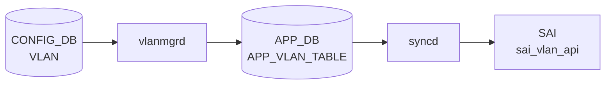

# VLAN テーブル

## 概要

IEEE 802.1Q [VLAN](../../reference/glossary.md#term-vlan) を [CONFIG_DB](../../reference/glossary.md#term-config_db) で定義するテーブル。[VLAN](../../reference/glossary.md#term-vlan) 名 (`Vlan100` 形式) をキーに、[VLAN](../../reference/glossary.md#term-vlan) ID、DHCP リレーサーバ、MTU、admin status、MAC、エイリアスを保持する[^1]。`VLAN_MEMBER` と組合わせてポート割当てを、`VLAN_INTERFACE` と組合わせて L3 IF を構成する。

<!-- cdb-mermaid -->
### データフロー (自動生成)



!!! note "凡例"
    CONFIG_DB から SAI までの典型経路を `docs/reference/config-db-orch-map.md` から機械生成したミニ図。詳細・例外は本ページ本文と対応表を参照。
<!-- /cdb-mermaid -->

## key 構造

```text
VLAN|<name>
```

`<name>` は `Vlan<id>` (id 範囲 2..4094)。

## フィールド一覧

| フィールド | 型 | 必須 | デフォルト | 説明 |
|-----------|----|------|-----------|------|
| `name` (key) | string `Vlan<2..4094>` | ✅ | - | VLAN 名 |
| `vlanid` | uint16 (2..4094) | - | - | VLAN ID。`name` 末尾と一致しなければならない (`must`) |
| `alias` | string | - | - | ユーザ別名 |
| `description` | string (1..255) | - | - | 説明 |
| `dhcp_servers` | leaf-list ip-address | - | - | DHCPv4 リレー先 |
| `dhcpv6_servers` | leaf-list ipv6-address | - | - | DHCPv6 リレー先 |
| `mtu` | uint16 (1..9216) | - | - | MTU |
| `admin_status` | `admin_status` | - | - | 管理状態 |
| `mac` | mac-address | - | - | VLAN 上の MAC |

## 制約

- `vlanid` は `name` の数値部分と一致しなければならない (`substring-after(../name, 'Vlan') = current()`)

## 購読者

- `vlanmgrd`: VLAN 作成・MTU・admin_status をモニタし Linux bridge に反映
- `orchagent` の `VlanMgr` / `VRouterOrch`: [SAI](../../reference/glossary.md#term-sai) bridge / VLAN を構成
- `dhcprelayd` (`sonic-dhcp-relay`): `dhcp_servers` / `dhcpv6_servers` を読み出して relay agent を構成

## 関連 CONFIG_DB / YANG / CLI

- 関連 [CONFIG_DB](../../reference/glossary.md#term-config_db): `VLAN_MEMBER`、`VLAN_INTERFACE`、`DHCP_RELAY`
- 関連 CLI: `config vlan` (add / del / member / dhcp_relay)
- 関連 [YANG](../../reference/glossary.md#term-yang): `sonic-vlan`

## 例外条件・特殊挙動 <!-- cdb-exceptions -->

<!-- evidence: sonic-swss/cfgmgr/vlanmgr.cpp; sonic-buildimage/src/sonic-yang-models/yang-models/sonic-vlan.yang -->

- **キー形式検証**: `Vlan<2..4094>` パターン。`Vlan` プレフィクスがない、または数値部が不正な場合 `vlanmgrd` はエントリを破棄する (`SWSS_LOG_ERROR("Invalid key format")`)[^exc1]。
- **`vlanid` 整合性 (YANG)**: `must "substring-after(../name, 'Vlan') = current()"` — `name` 末尾と `vlanid` フィールドが不一致の場合 YANG バリデーションが reject する[^exc2]。
- **MTU 無視**: `mtu` フィールドはホスト VLAN netdev への適用が TODO 扱いで、`vlanmgrd` は受け取っても `SWSS_LOG_DEBUG("Host VLAN mtu setting to be supported.")` のみ出力し実際には変更しない[^exc1]。
- **warm-restart 重複スキップ**: STATE_DB に既存かつ `m_vlans` に登録済みの場合、再作成をスキップして replay エントリを削除する（"already created" デバッグログ）[^exc1]。
- **デフォルト補完**: `mtu` 省略時は `DEFAULT_MTU_STR`（通常 `9100`）、`mac` 省略時はスイッチ MAC が自動補完される[^exc1]。

[^exc1]: `sonic-swss/cfgmgr/vlanmgr.cpp` <https://github.com/sonic-net/sonic-swss/blob/master/cfgmgr/vlanmgr.cpp>
[^exc2]: `sonic-buildimage/src/sonic-yang-models/yang-models/sonic-vlan.yang` <https://github.com/sonic-net/sonic-buildimage/blob/master/src/sonic-yang-models/yang-models/sonic-vlan.yang>

<!-- ref-triangle:start -->

## 関連リファレンス

- [YANG](../../reference/glossary.md#term-yang): [`sonic-vlan`](../yang/sonic-vlan.md)
- CLI: [`config vlan`](../cli/config-vlan.md)

<!-- ref-triangle:end -->

## 引用元

[^1]: [YANG](../../reference/glossary.md#term-yang) 定義: `sonic-buildimage/src/sonic-yang-models/yang-models/sonic-vlan.yang` (sha `9ea932ec`). <https://github.com/sonic-net/sonic-buildimage/blob/9ea932ec2e18f35e58268ec2e4456b1d4afd65cd/src/sonic-yang-models/yang-models/sonic-vlan.yang>

## 関連ページ
- [HLD: Switchport モードと VLAN CLI 拡張](../../switching/switch-port-modes-and-vlan-cli-enhancement.md)
- [CLI: config vlan](../cli/config-vlan.md)
- [CLI: show vlan](../cli/show-vlan.md)
- [YANG: sonic-vlan](../yang/sonic-vlan.md)

<!-- topics-back-ref -->
## 関連 Topics

- [Topics: L2 / VLAN / LAG / MC-LAG](../../topics/06-l2-vlan-lag/index.md)

<!-- /topics-back-ref -->

<!-- ops-hint -->
## 運用ヒント

### 典型値

- `Vlan100` 等の `Vlan<2..4094>` 形式キー。`vlanid` は名前末尾と一致。
- `mtu`: 9100（ホスト側 jumbo 用途）。
- `admin_status`: `up`。
- `dhcp_servers`: `["10.0.0.1", "10.0.0.2"]` 等の relay 先。

### よくある誤設定

- `vlanid` を `name` 末尾と異なる値で投入すると YANG `must` 違反で reject される。
- `VLAN_MEMBER` を作る前に `VLAN_INTERFACE` を作ると L3 IF が isolated VLAN にぶら下がる。
- `dhcp_servers` をリストで無く単一文字列で入れると dhcprelayd が relay を起動しない。

### 確認コマンド

```bash
sonic-db-cli CONFIG_DB hgetall 'VLAN|Vlan100'
sonic-db-cli CONFIG_DB keys 'VLAN_MEMBER|Vlan100|*'
show vlan brief
```
<!-- /ops-hint -->

<!-- glossary-links-injected: 7185f6aa75ab -->
