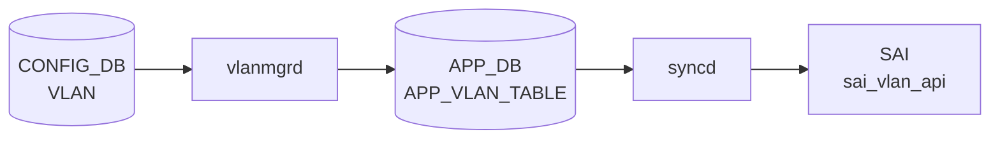

# VLAN テーブル

## 概要

IEEE 802.1Q [VLAN](../../reference/glossary.md#term-vlan) を [CONFIG_DB](../../reference/glossary.md#term-config_db) で定義するテーブル。[VLAN](../../reference/glossary.md#term-vlan) 名 (`Vlan100` 形式) をキーに、[VLAN](../../reference/glossary.md#term-vlan) ID、DHCP リレーサーバ、MTU、admin status、MAC、エイリアスを保持する[^1]。`VLAN_MEMBER` と組合わせてポート割当てを、`VLAN_INTERFACE` と組合わせて L3 IF を構成する。

<!-- cdb-mermaid -->
### データフロー (自動生成)



!!! note "凡例"
    CONFIG_DB から SAI までの典型経路を `docs/reference/config-db-orch-map.md` から機械生成したミニ図。詳細・例外は本ページ本文と対応表を参照。
<!-- /cdb-mermaid -->

## key 構造

```text
VLAN|<name>
```

`<name>` は `Vlan<id>` (id 範囲 2..4094)。

## フィールド一覧

| フィールド | 型 | 必須 | デフォルト | 説明 |
|-----------|----|------|-----------|------|
| `name` (key) | string `Vlan<2..4094>` | ✅ | - | VLAN 名 |
| `vlanid` | uint16 (2..4094) | - | - | VLAN ID。`name` 末尾と一致しなければならない (`must`) |
| `alias` | string | - | - | ユーザ別名 |
| `description` | string (1..255) | - | - | 説明 |
| `dhcp_servers` | leaf-list ip-address | - | - | DHCPv4 リレー先 |
| `dhcpv6_servers` | leaf-list ipv6-address | - | - | DHCPv6 リレー先 |
| `mtu` | uint16 (1..9216) | - | - | MTU |
| `admin_status` | `admin_status` | - | - | 管理状態 |
| `mac` | mac-address | - | - | VLAN 上の MAC |

## 制約

- `vlanid` は `name` の数値部分と一致しなければならない (`substring-after(../name, 'Vlan') = current()`)

## 購読者

- `vlanmgrd`: VLAN 作成・MTU・admin_status をモニタし Linux bridge に反映
- `orchagent` の `VlanMgr` / `VRouterOrch`: [SAI](../../reference/glossary.md#term-sai) bridge / VLAN を構成
- `dhcprelayd` (`sonic-dhcp-relay`): `dhcp_servers` / `dhcpv6_servers` を読み出して relay agent を構成

## 関連 CONFIG_DB / YANG / CLI

- 関連 [CONFIG_DB](../../reference/glossary.md#term-config_db): `VLAN_MEMBER`、`VLAN_INTERFACE`、`DHCP_RELAY`
- 関連 CLI: `config vlan` (add / del / member / dhcp_relay)
- 関連 [YANG](../../reference/glossary.md#term-yang): `sonic-vlan`

<!-- constants -->
## ハードコード定数

| 定数 | 値 | 定義箇所 | 備考 |
|------|-----|----------|------|
| `DEFAULT_MTU_STR` | `"9100"` | vlanmgr.cpp:19 | MTU 省略時に APP_DB へ注入するデフォルト値（バイト）。Bridge 初期化にも適用 |
| `DEFAULT_VLAN_ID` | `"1"` | vlanmgr.cpp:18 | Bridge 初期化時に削除する IEEE 802.1Q デフォルト VLAN（`bridge vlan del vid 1`）|
| `DOT1Q_BRIDGE_NAME` | `"Bridge"` | vlanmgr.cpp:15 | Linux dot1q ブリッジデバイス名（固定文字列）|
| `VLAN_PREFIX` | `"Vlan"` | vlanmgr.cpp:16 | VLAN インタフェース名プレフィクス。キー長チェックに `4` バイトとして使用 |
| `LAG_PREFIX` | `"PortChannel"` | vlanmgr.cpp:17 | [LAG](../../reference/glossary.md#term-lag) インタフェース名プレフィクス。`VLAN_MEMBER` 追加時のレースコンディション判定（[PortChannel](../../reference/glossary.md#term-portchannel) vs Ethernet の挙動分岐）に使用 |
| `VLAN_HLEN` | `4` | vlanmgr.cpp:20 | IEEE 802.1Q ヘッダ長（バイト）— 定義のみ・ファイル内未参照（dead define）|
| `MAX_VALID_VLAN_ID` | `4094` | portsorch.cpp:82 | サブインタフェース VLAN ID 上限。YANG `range 2..4094` と一致 |
| `DEFAULT_SYSTEM_PORT_MTU` | `9100` | portsorch.cpp:79 | portsorch 側の MTU 初期値。vlanmgr.cpp の `DEFAULT_MTU_STR` とは独立定義 |
| UUC/BC flooding デフォルト | `SAI_VLAN_FLOOD_CONTROL_TYPE_ALL` | portsorch.cpp:7409-7410 | `create_vlan()` 時の初期 flooding 制御型。プラットフォーム [SAI](../../reference/glossary.md#term-sai) で上書き可能 |
| YANG `vlanid` range | `2..4094` | sonic-vlan.yang:225 | YANG バリデーション範囲。`pattern` も同範囲を正規表現で表現 |
| YANG `mtu` range | `1..9216` | sonic-vlan.yang:257 | MTU 許容範囲。`DEFAULT_MTU_STR=9100` はこの範囲内 |
| YANG `description` length | `1..255` | sonic-vlan.yang:239 | 説明フィールド最大文字数 |
| YANG `nat_zone` range | `0..3` (default `0`) | sonic-vlan.yang:105 | VLAN_INTERFACE の [NAT](../../reference/glossary.md#term-nat) ゾーン番号範囲 |
| `arp_evict_nocarrier` 設定値 | `0` | vlanmgr.cpp:139 | VLAN IF 作成後に `/proc/sys/net/ipv4/conf/Vlan<N>/arp_evict_nocarrier` へ書き込む値 |

<!-- /constants -->

<!-- defaults -->
## コード由来の暗黙デフォルト

| フィールド | YANG default | コード実装デフォルト | 出典 |
|-----------|-------------|---------------------|------|
| `admin_status` | なし | `"up"` — フィールド省略時に `fvVector` へ自動補完 (vlanmgr.cpp:424) | [vlanmgrd](../../reference/glossary.md#term-vlanmgrd) |
| `mtu` | なし | `9100` (`DEFAULT_MTU_STR`) — 省略時に APP_DB へ注入 (vlanmgr.cpp:19,357,428) | [vlanmgrd](../../reference/glossary.md#term-vlanmgrd) |
| `mac` | なし | `gMacAddress`（スイッチ MAC）— 省略時に APP_DB へ注入 (vlanmgr.cpp:358) | [vlanmgrd](../../reference/glossary.md#term-vlanmgrd) |
| `vlanid` | なし | コードで未使用（YANG バリデーション専用 dead field） | - |
| `alias` | なし | コードで未使用（dead field） | - |
| `description` | なし | コードで未使用（dead field） | - |
| `dhcp_servers` | なし（leaf-list）| vlanmgrd は無視。dhcprelayd が [CONFIG_DB](../../reference/glossary.md#term-config_db) を直接購読 | dhcprelayd |
| `dhcpv6_servers` | なし（leaf-list）| vlanmgrd は無視。dhcprelayd が CONFIG_DB を直接購読 | dhcprelayd |

### 注記

- **`mtu` の silent drop**: `mtu` は APP_DB に書かれるが、ホスト側 netdev (`ip link set Vlan<N> mtu`) への適用は TODO 状態 (vlanmgr.cpp:401-406)。明示指定しても netdev MTU は変わらない。
- **`mac` の書き込み順依存**: `gMacAddress` が未初期化（スイッチ MAC 未確定）の間、vlanmgrd は全 VLAN タスクを保留する (vlanmgr.cpp:318-321)。
- **`dhcp_servers` の経路乖離**: vlanmgrd→APP_DB 経路を通らず、dhcprelayd が CONFIG_DB `VLAN` テーブルを直接購読する。vlanmgrd の処理順序に非依存。
- **[SAI](../../reference/glossary.md#term-sai) デフォルト**: [orchagent](../../reference/glossary.md#term-orchagent) は `SAI_VLAN_ATTR_VLAN_ID` のみ指定して `sai_vlan_api->create_vlan()` を呼ぶ (portsorch.cpp:7392)。flooding control 等はプラットフォーム SAI デフォルトに委ねられる。
<!-- /defaults -->

<!-- value-behavior -->
## 値依存挙動マトリクス

| フィールド | 値 | 実挙動 |
|-----------|-----|--------|
| `admin_status` | `up` | `ip link set Vlan<id> up` (vlanmgr.cpp:168-170) |
| `admin_status` | `down` | `ip link set Vlan<id> down` |
| `admin_status` | 省略 | `"up"` が自動補完される (vlanmgr.cpp:424) |
| `mtu` | 省略 | `DEFAULT_MTU_STR`（通常 `9100`）が使用される (vlanmgr.cpp:96) |
| `mtu` | 明示指定 | 受け取るが netdev MTU は変更しない。`SWSS_LOG_DEBUG("Host VLAN mtu setting to be supported.")` のみ出力（TODO 状態）|
| `mac` | 省略 | `gMacAddress`（スイッチ MAC）が自動補完 |
| `mac` | 明示指定 | 指定 MAC が VLAN インタフェース MAC として設定される |
| `dhcp_servers` | leaf-list | `dhcprelayd` がリストを読み DHCPv4 relay を構成 |
| `dhcp_servers` | 単一文字列誤入力 | `dhcprelayd` が relay を起動しない（leaf-list 形式で入力必須）|
| `vlanid` | `name` 末尾と不一致 | YANG `must` 違反で reject |

<!-- /value-behavior -->

## 例外条件・特殊挙動 <!-- cdb-exceptions -->

<!-- evidence: sonic-swss/cfgmgr/vlanmgr.cpp; sonic-buildimage/src/sonic-yang-models/yang-models/sonic-vlan.yang -->

- **キー形式検証**: `Vlan<2..4094>` パターン。`Vlan` プレフィクスがない、または数値部が不正な場合 `vlanmgrd` はエントリを破棄する (`SWSS_LOG_ERROR("Invalid key format")`)[^exc1]。
- **`vlanid` 整合性 (YANG)**: `must "substring-after(../name, 'Vlan') = current()"` — `name` 末尾と `vlanid` フィールドが不一致の場合 YANG バリデーションが reject する[^exc2]。
- **MTU 無視**: `mtu` フィールドはホスト VLAN netdev への適用が TODO 扱いで、`vlanmgrd` は受け取っても `SWSS_LOG_DEBUG("Host VLAN mtu setting to be supported.")` のみ出力し実際には変更しない[^exc1]。
- **warm-restart 重複スキップ**: [STATE_DB](../../reference/glossary.md#term-state_db) に既存かつ `m_vlans` に登録済みの場合、再作成をスキップして replay エントリを削除する（"already created" デバッグログ）[^exc1]。
- **デフォルト補完**: `mtu` 省略時は `DEFAULT_MTU_STR`（通常 `9100`）、`mac` 省略時はスイッチ MAC が自動補完される[^exc1]。

[^exc1]: `sonic-swss/cfgmgr/vlanmgr.cpp` <https://github.com/sonic-net/sonic-swss/blob/master/cfgmgr/vlanmgr.cpp>
[^exc2]: `sonic-buildimage/src/sonic-yang-models/yang-models/sonic-vlan.yang` <https://github.com/sonic-net/sonic-buildimage/blob/master/src/sonic-yang-models/yang-models/sonic-vlan.yang>

<!-- ref-triangle:start -->

## 関連リファレンス

- [YANG](../../reference/glossary.md#term-yang): [`sonic-vlan`](../yang/sonic-vlan.md)
- CLI: [`config vlan`](../cli/config-vlan.md)

<!-- ref-triangle:end -->

## 引用元

[^1]: [YANG](../../reference/glossary.md#term-yang) 定義: `sonic-buildimage/src/sonic-yang-models/yang-models/sonic-vlan.yang` (sha `9ea932ec`). <https://github.com/sonic-net/sonic-buildimage/blob/9ea932ec2e18f35e58268ec2e4456b1d4afd65cd/src/sonic-yang-models/yang-models/sonic-vlan.yang>

## 関連ページ
- [HLD: Switchport モードと VLAN CLI 拡張](../../switching/switch-port-modes-and-vlan-cli-enhancement.md)
- [CLI: config vlan](../cli/config-vlan.md)
- [CLI: show vlan](../cli/show-vlan.md)
- [YANG: sonic-vlan](../yang/sonic-vlan.md)

<!-- topics-back-ref -->
## 関連 Topics

- [Topics: L2 / VLAN / LAG / MC-LAG](../../topics/06-l2-vlan-lag/index.md)

<!-- /topics-back-ref -->

<!-- ops-hint -->
## 運用ヒント

### 典型値

- `Vlan100` 等の `Vlan<2..4094>` 形式キー。`vlanid` は名前末尾と一致。
- `mtu`: 9100（ホスト側 jumbo 用途）。
- `admin_status`: `up`。
- `dhcp_servers`: `["10.0.0.1", "10.0.0.2"]` 等の relay 先。

### よくある誤設定

- `vlanid` を `name` 末尾と異なる値で投入すると YANG `must` 違反で reject される。
- `VLAN_MEMBER` を作る前に `VLAN_INTERFACE` を作ると L3 IF が isolated VLAN にぶら下がる。
- `dhcp_servers` をリストで無く単一文字列で入れると dhcprelayd が relay を起動しない。

### 確認コマンド

```bash
sonic-db-cli CONFIG_DB hgetall 'VLAN|Vlan100'
sonic-db-cli CONFIG_DB keys 'VLAN_MEMBER|Vlan100|*'
show vlan brief
```
<!-- /ops-hint -->

<!-- runtime-trace -->
## CDB → 実コンテナ動作トレース

### 段階 1: Consumer 登録

- **[orchagent](../../reference/glossary.md#term-orchagent) / VlanOrch**: `VLAN` テーブルを `SubscriberStateTable` で購読。
- **vlanmgrd** (`sonic-swss/cfgmgr/vlanmgr.cpp`): `VLAN` テーブルを購読して Linux VLAN ブリッジを管理。

### 段階 2: CFG → APPL 翻訳

- vlanmgrd が `VLAN` エントリを APP_DB `VLAN_TABLE` に書き込み、`ip link add Vlan<N> type bridge vlan_filtering 1` でカーネルブリッジを作成。

### 段階 3: APPL → SAI

- VlanOrch が APP_DB `VLAN_TABLE` を読み `sai_vlan_api->create_vlan()` でハードウェア VLAN を作成。

### 段階 4: タイミング + 副作用

- カーネルブリッジ作成 (vlanmgrd) と SAI VLAN 作成 (VlanOrch) はほぼ同時。数十 ms 以内。
- 副作用: admin_status=down でもカーネルブリッジは作成される (`ip link set Vlan<N> down` が別途発行)。

<!-- /runtime-trace -->

<!-- side-effects -->
## SET/DEL 副次 DB 書込み

`CONFIG_DB VLAN` エントリの SET / DEL が引き起こす他 DB への書込み一覧。

### vlanmgrd による書込み (cfgmgr/vlanmgr.cpp)

| 操作 | 対象 DB / テーブル | キー | 条件 |
|------|-----------------|------|------|
| SET: `m_appVlanTableProducer.set(key, fvVector)` | [APPL_DB](../../reference/glossary.md#term-appl_db) / `VLAN_TABLE` | `Vlan<id>` | 常時[^se1] |
| SET: `m_stateVlanTable.set(key, [{state, ok}])` | [STATE_DB](../../reference/glossary.md#term-state_db) / `VLAN_TABLE` | `Vlan<id>` | 常時[^se1] |
| DEL: `m_appVlanTableProducer.del(key)` | [APPL_DB](../../reference/glossary.md#term-appl_db) / `VLAN_TABLE` | `Vlan<id>` | `m_vlans` 登録済みの場合[^se1] |
| DEL: `m_stateVlanTable.del(key)` | [STATE_DB](../../reference/glossary.md#term-state_db) / `VLAN_TABLE` | `Vlan<id>` | `m_vlans` 登録済みの場合[^se1] |

[APPL_DB](../../reference/glossary.md#term-appl_db) に書き込まれるフィールド (`fvVector`): `admin_status`（省略時 `"up"`）、`mtu`（省略時 `9100`）、`mac`（省略時スイッチ MAC）、`host_ifname`。

### orchagent (PortsOrch::addVlan/removeVlan) による書込み (orchagent/portsorch.cpp)

APPL_DB `VLAN_TABLE` を受け取った VlanOrch が SAI 呼び出しを行い、[syncd](../../reference/glossary.md#term-syncd) 経由で [ASIC_DB](../../reference/glossary.md#term-asic_db) へ書き込まれる。

| 操作 | 対象 DB / テーブル | キー | 条件 |
|------|-----------------|------|------|
| SET: `sai_vlan_api->create_vlan(&vlan_oid, ...)` | [ASIC_DB](../../reference/glossary.md#term-asic_db) / `ASIC_STATE:SAI_OBJECT_TYPE_VLAN:<oid>` | `SAI_VLAN_ATTR_VLAN_ID=<id>` | 常時[^se2] |
| DEL: `sai_vlan_api->remove_vlan(vlan_oid)` | [ASIC_DB](../../reference/glossary.md#term-asic_db) / `ASIC_STATE:SAI_OBJECT_TYPE_VLAN:<oid>` 削除 | `<oid>` | [FDB](../../reference/glossary.md#term-fdb)/メンバー/VNI が空の場合のみ[^se2] |

DEL の前提条件 (いずれかが満たされないと retry): [FDB](../../reference/glossary.md#term-fdb) カウント 0、ポート参照カウント 0、メンバーポート 0、[VXLAN](../../reference/glossary.md#term-vxlan) VNI マッピングなし。

### COUNTERS_DB

VLAN SET/DEL 単体では **[COUNTERS_DB](../../reference/glossary.md#term-counters_db) への書込みはない**。VLAN に `VLAN_INTERFACE` ([RIF](../../reference/glossary.md#term-rif)) が紐づく場合は `IntfsOrch` が `COUNTERS_RIF_NAME_MAP` / `COUNTERS_RIF_TYPE_MAP` を書き込むが、これは `INTERFACE` テーブルの副作用である。

### カーネル操作 (DB 外)

- SET: `ip link add Vlan<id> type bridge vlan_filtering 1` — Linux カーネルブリッジ作成
- SET: `ip link set Vlan<id> up` / `down` — `admin_status` 反映
- SET: `ip link set Vlan<id> address <mac>` — MAC 設定（`mac` フィールド指定時）
- DEL: `ip link set Vlan<id> down; ip link del Vlan<id>` — ブリッジ削除

[^se1]: `sonic-swss/cfgmgr/vlanmgr.cpp` <https://github.com/sonic-net/sonic-swss/blob/master/cfgmgr/vlanmgr.cpp>
[^se2]: `sonic-swss/orchagent/portsorch.cpp` <https://github.com/sonic-net/sonic-swss/blob/master/orchagent/portsorch.cpp>
<!-- /side-effects -->

<!-- entry-points -->
## 書き込み入り口 (Direction A)

VLAN テーブルへの書き込みが発生するコード経路を網羅的に調査した結果。

### CLI

  - `config vlan add/del ...` — `config/vlan.py` が `set_entry('VLAN', vlan_name, {'vlanid': str(vid)})` を呼ぶ ([sonic-utilities](../../reference/glossary.md#term-sonic-utilities)/config/vlan.py:141)

### minigraph / sonic-cfggen

**minigraph.py** が VLAN を生成し投入 ([sonic-buildimage](../../reference/glossary.md#term-sonic-buildimage)/src/sonic-config-engine/minigraph.py)

### REST / gNMI

REST/[gNMI](../../reference/glossary.md#term-gnmi) 書き込み経路なし

### db_migrator

**db_migrator.py** が VLAN のマイグレーション処理を実装 ([sonic-utilities](../../reference/glossary.md#term-sonic-utilities)/scripts/db_migrator.py:931)

### ビルド時デフォルト (build-time default)

なし

### ハードコードデフォルト / ランタイム注入

なし

### 死活・デッドコード

なし
<!-- /entry-points -->

<!-- ordering -->
## 書込み順依存 (Phase B)

<!-- evidence: sonic-swss/cfgmgr/vlanmgr.cpp; sonic-swss/cfgmgr/intfmgr.cpp -->

### SET 順序（必須）

1. **gMacAddress 確定**: vlanmgrd は起動時に `gMacAddress`（スイッチ MAC）が確定するまで全 VLAN タスクを保留する (`vlanmgr.cpp:318-322`)。[syncd](../../reference/glossary.md#term-syncd)/SAI が起動してスイッチ MAC が解決されるまで `VLAN` への SET は自動的にキューで待機する。
2. **`VLAN` → `VLAN_MEMBER`**: `VLAN_MEMBER` の SET は `STATE_VLAN_TABLE` に対象 VLAN の `state=ok` エントリが存在することを確認してから処理される (`vlanmgr.cpp:642`)。先に `VLAN_MEMBER` を書いた場合は VLAN 処理完了まで自動リトライ待機する。
3. **`VLAN` → `VLAN_INTERFACE`**: `VLAN_INTERFACE` の SET も intfmgr が `STATE_VLAN_TABLE` ready を確認してから処理される (`intfmgr.cpp:649-658, 1112-1117`)。`VLAN` を先に SET しておく必要がある。
4. **PORT/[LAG](../../reference/glossary.md#term-lag) ready → `VLAN_MEMBER`**: `VLAN_MEMBER` の SET はメンバーポートが `STATE_PORT_TABLE`（物理ポート）または `STATE_LAG_TABLE`（[LAG](../../reference/glossary.md#term-lag)）に登録済みであることを確認する (`vlanmgr.cpp:491-514`)。[portmgrd](../../reference/glossary.md#term-portmgrd) / [teamd](../../reference/glossary.md#term-teamd-teamsyncd-teammgrd) の ready 前は自動リトライ待機する。

### DEL 順序（必須）

1. **`VLAN_MEMBER` DEL → `VLAN` DEL**: VLAN を先に DEL すると `STATE_VLAN_TABLE` から対象エントリが即座に削除される。残存する `VLAN_MEMBER` タスクは `isVlanStateOk()` チェックが永遠に false になり孤立する (`vlanmgr.cpp:456-471`)。**必ず VLAN_MEMBER を全削除してから VLAN を削除すること**。

### Linux IF 設定順（addHostVlan / addHostVlanMember 内部）

VLAN SET が受け付けられ `addHostVlan()` が実行される際の **カーネル側コマンド実行順序**（`vlanmgr.cpp:118-143`）:

1. `bridge vlan add vid <N> dev Bridge self` — dot1q ブリッジへの VLAN ID 登録
2. `ip link add link Bridge up name Vlan<N> address <gMacAddress> type vlan id <N>` — VLAN インタフェース作成（Bridge にリンクし、スイッチ MAC を付与）
3. `echo 0 > /proc/sys/net/ipv4/conf/Vlan<N>/arp_evict_nocarrier` — [ARP](../../reference/glossary.md#term-arp) evict on nocarrier を無効化（ベストエフォート、失敗しても vlanmgrd はクラッシュしない）

ステップ 1 が完了してから 2 を実行するため、ブリッジに VLAN ID が存在しない状態でインタフェースが作成されることはない。ステップ 2 失敗（`EXEC_WITH_ERROR_THROW`）は `vlanmgrd` プロセスをクラッシュさせる。

VLAN_MEMBER SET が受け付けられ `addHostVlanMember()` が実行される際のコマンド順序（`vlanmgr.cpp:233-273`）:

1. `ip link set <port_alias> master Bridge` — ポートを dot1q ブリッジに収容
2. `bridge vlan del vid 1 dev <port_alias>` — デフォルト VLAN 1 を削除
3. `bridge vlan add vid <N> dev <port_alias> [pvid untagged]` — 指定 VLAN ID を追加

これら 3 ステップは 1 つの bash -c 呼び出しで &&チェーン実行される。いずれかが失敗すると以降のステップは実行されない。[PortChannel](../../reference/glossary.md#term-portchannel) の場合のみ失敗時に `false` を返してリトライ（Ethernet はクラッシュ）。

### warm-reboot / restart 影響

- **swss docker restart（warm-reboot）**: Linux カーネルのブリッジ・VLAN インタフェースはカーネル空間に残存するため、vlanmgrd は `ip link show Bridge` で存在を確認してブリッジ再作成をスキップする (`vlanmgr.cpp:64-75`)。STATE_DB の既存エントリと照合して重複作成を回避し、`WarmStart::REPLAYED` → `RECONCILED` に自動遷移する (`vlanmgr.cpp:371-378, 479-488`)。
- **コールドリブート（全停止）**: カーネルブリッジが消えるため、CONFIG_DB の全 VLAN / VLAN_MEMBER が再処理される。上記 SET 順序制約が適用される。

### 典型的な設定手順（CLI / sonic-db-cli 双方）

```
# 1. VLAN 作成
SET VLAN|Vlan100  vlanid=100

# 2. VLAN_INTERFACE 設定（任意）
SET VLAN_INTERFACE|Vlan100  {}
SET VLAN_INTERFACE|Vlan100|192.168.100.1/24  {}

# 3. VLAN_MEMBER 追加（ポート ready 後）
SET VLAN_MEMBER|Vlan100|Ethernet0  tagging_mode=untagged

# 削除時は逆順
DEL VLAN_MEMBER|Vlan100|Ethernet0
DEL VLAN_INTERFACE|Vlan100|192.168.100.1/24
DEL VLAN_INTERFACE|Vlan100
DEL VLAN|Vlan100
```

<!-- /ordering -->

<!-- failure -->
## 失敗挙動・リトライ・リカバリ

<!-- evidence: sonic-swss/cfgmgr/vlanmgr.cpp -->

### 即時破棄 (no retry)

不正な入力は `m_toSync` から即座に削除され、リトライされない。

| 条件 | ログ |
|------|------|
| `Vlan` プレフィクスなし | `SWSS_LOG_ERROR("Invalid key format. No 'Vlan' prefix: %s")` |
| `Vlan` 以降が数値でない | `SWSS_LOG_ERROR("Invalid key format. Not a number after 'Vlan' prefix: %s")` |
| `VLAN_MEMBER` にメンバーポート部分なし | `SWSS_LOG_ERROR("Invalid key format. No member port is presented")` |
| `tagging_mode` が不正値 | `SWSS_LOG_ERROR("Wrong tagging_mode '%s' for key: %s")` |
| 不明な operation type | `SWSS_LOG_ERROR("Unknown operation type %s")` |
| `DEL` で対象 VLAN が存在しない | `SWSS_LOG_ERROR("%s doesn't exist")` |

### 遅延リトライ (iterator increment のみ)

以下の条件ではエントリを `m_toSync` に残し、次ポーリングサイクルで自動再試行する。

1. **MAC 未確定** — `gMacAddress` が未初期化の間、`doVlanTask` 全体を早期 return。MAC 確定後に自動再開 (`vlanmgr.cpp:318-321`)。
2. **ポート/VLAN 未 ready** — `VLAN_MEMBER` 追加時、`isMemberStateOk(port_alias)` または `isVlanStateOk(vlan_alias)` が false の場合に遅延 (`vlanmgr.cpp:642-647`)。STATE_DB に対象ポート/VLAN が登録されるまで繰り返す。
3. **[PortChannel](../../reference/glossary.md#term-portchannel) レースコンディション** — `addHostVlanMember` が PortChannel に対して `false` を返した場合（削除と追加のレース）、`SWSS_LOG_INFO("Netdevice for %s not ready, delaying")` を出力して遅延 (`vlanmgr.cpp:682-687`)。Ethernet は例外再スローで即時失敗。
4. **[FDB](../../reference/glossary.md#term-fdb) 静的エントリ: VLAN 未作成** — 対象 VLAN が `m_vlans` に登録されるまで FDB エントリを遅延 (`vlanmgr.cpp:791-795`)。

### 例外スロー (EXEC_WITH_ERROR_THROW)

以下の操作は失敗すると `std::runtime_error` をスローし、`vlanmgrd` プロセスがクラッシュする。supervisor が再起動する。

- Linux bridge 初期化（コンストラクタ内 `ip link add Bridge up type bridge` など）
- `addHostVlan`: `bridge vlan add` / `ip link add link Bridge ... type vlan`
- `removeHostVlan`: `ip link del Vlan<N>`
- `setHostVlanAdminState`: `ip link set Vlan<N> up/down`
- `setHostVlanMac`: Bridge MAC 変更（down→変更→up）
- `removeHostVlanMember`: `bridge vlan del`
- Ethernet ポートへの `addHostVlanMember` 失敗（2 回目の `EXEC_WITH_ERROR_THROW`）

`setHostVlanMtu` のみ例外をスローせず `false` を返す（MTU はホスト側 TODO 扱い）。

### warm-restart リカバリ

- 起動時に `m_vlanReplay` / `m_vlanMemberReplay` へ CONFIG_DB の全キーをキャッシュ。
- 各エントリ処理完了ごとに消化し、両セットが空になった時点で `WarmStart::REPLAYED` → `RECONCILED` へ遷移。
- STATE_DB に既存の VLAN は `m_vlans` に追加するのみで Linux bridge を再作成しない（トラフィック中断防止）。

### 回復シナリオまとめ

| 失敗ケース | 回復方法 | 自動か手動か |
|-----------|---------|------------|
| MAC 未確定 | MAC 確定後に自動再試行 | 自動 |
| ポート未 ready | STATE_DB 更新後に自動再試行 | 自動 |
| PortChannel レースコンディション | 次ポーリングで自動再試行 | 自動 |
| キー形式不正 | CLI で正しいキーを再投入 | 手動 |
| `ip link` 失敗 (bridge 操作) | vlanmgrd 再起動 (supervisor) | 自動（プロセス再起動） |
| YANG `must` 違反 | 正しい値で再投入 | 手動 |

<!-- /failure -->

<!-- platform -->
## プラットフォーム差・SAI capability 分岐

<!-- evidence: sonic-swss/cfgmgr/vlanmgr.cpp; sonic-swss/orchagent/portsorch.cpp -->

### VOQ chassis / DPU モード差 (`gMySwitchType`)

`PortsOrch` 初期化時に `gMySwitchType` を参照し、`"dpu"` の場合は以下をスキップする (portsorch.cpp:987-1066)[^plat1]:

| 処理 | 通常モード | [DPU](../../reference/glossary.md#term-dpu) モード |
|------|-----------|-----------|
| SAI デフォルト 1Q Bridge / VLAN OID 取得 (`SAI_SWITCH_ATTR_DEFAULT_1Q_BRIDGE_ID` 等) | 実行 | スキップ |
| `removeDefaultVlanMembers()` / `removeDefaultBridgePorts()` | 実行 | スキップ |
| FDB event notify 設定 (`SAI_SWITCH_ATTR_FDB_EVENT_NOTIFY`) | 実行 | スキップ |

[DPU](../../reference/glossary.md#term-dpu) はホスト側 Linux bridge を通常通り作成する（vlanmgr.cpp は `gMySwitchType` を参照しない）。**[VOQ](../../reference/glossary.md#term-voq) chassis** (`gMySwitchType == "voq"`) については LAG/SystemPort 系の分岐が存在するが、`addVlan()` / `removeVlan()` に直接影響する分岐はなく VLAN SAI フローは標準と同一[^plat1]。

### SmartSwitch DPU — `host_ifname` フィールドによる SAI HOSTIF バインド

APP_DB `VLAN_TABLE` の `host_ifname` フィールドが設定されている場合に `createVlanHostIntf()` が呼ばれ、SAI `create_hostif()` で VLAN OID に `SAI_HOSTIF_TYPE_NETDEV` ホストインタフェースをバインドする (portsorch.cpp:5820-5828)[^plat1]。

- `host_ifname` は YANG 外かつ CONFIG_DB の `VLAN` テーブルには未定義。vlanmgrd が受け取った場合は APP_DB に透過転送する (vlanmgr.cpp:416-418, 434)[^plat2]。
- [SmartSwitch](../../reference/glossary.md#term-smartswitch) [NPU](../../reference/glossary.md#term-npu)→[DPU](../../reference/glossary.md#term-dpu) の監視用途で使用。エラー時は graceful failure（プロセスクラッシュしない）。
- `removeVlan()` 時に `host_intf_id` が設定されていれば `removeVlanHostIntf()` を先に呼ぶ (portsorch.cpp:7457)[^plat1]。

### カーネル Linux bridge vs SAI VLAN — 二重平面の非対称動作

SONiC の VLAN 制御は 2 平面で並列動作し、互いの完了を待たない:

| 平面 | コンポーネント | 実装 |
|------|--------------|------|
| カーネル側 | vlanmgrd | `ip link add Bridge type bridge`、`bridge vlan add vid <N>` |
| ASIC/SAI 側 | [orchagent](../../reference/glossary.md#term-orchagent) (VlanOrch) | `sai_vlan_api->create_vlan(SAI_VLAN_ATTR_VLAN_ID)` のみ |

- **DPU モードでもカーネル bridge は作成される**。DPU の転送はカーネル bridge を通過しないため、カーネル bridge は制御面・管理面専用となる[^plat2]。
- **MTU 非対称**: vlanmgrd は `DEFAULT_MTU_STR=9100` を APP_DB に書くが、カーネル netdev MTU の設定は TODO 状態 (vlanmgr.cpp:401-406)。ホスト側と SAI 側で MTU が乖離し得る[^plat2]。
- **SAI デフォルト属性依存**: `create_vlan()` は `SAI_VLAN_ATTR_VLAN_ID` のみ指定し flooding control 等はベンダー SAI デフォルトに委ねる (portsorch.cpp:7392)。VS SAI と実 ASIC SAI でデフォルト挙動が異なる[^plat1]。

### SAI Flood control capability — `COMBINED` 非対応 ASIC

orchagent 起動時に `sai_query_attribute_enum_values_capability()` で UUC (Unknown Unicast) / BC (Broadcast) の flood control タイプを問い合わせる (portsorch.cpp:900-931)。`SAI_VLAN_FLOOD_CONTROL_TYPE_COMBINED` をサポートしない ASIC では、[VXLAN](../../reference/glossary.md#term-vxlan) [EVPN](../../reference/glossary.md#term-evpn) エンドポイント (`VLAN_MEMBER.end_point_ip`) を用いた flood group 設定がエラー終了する (portsorch.cpp:7517-7524)。VS (Virtual Switch) SAI は `ALL` / `NONE` / `L2MC_GROUP` の 3 種のみ返し `COMBINED` を返さないため、VS 環境では [EVPN](../../reference/glossary.md#term-evpn) flood group は設定不可[^plat1]。

### create_vlan() — SAI 属性最小化とベンダー SAI デフォルト依存

`addVlan()` は `SAI_VLAN_ATTR_VLAN_ID` 1 属性のみで `create_vlan()` を呼び出す (portsorch.cpp:7392)。flooding control 属性は渡さず SAI プラットフォームデフォルトに委ねるため、VLAN 作成直後の flooding 挙動がベンダー SAI 実装依存となる[^plat1]。

### SAI_HOSTIF_VLAN_TAG — ベンダー間の段階的サポート

コードコメントに「`SAI_HOSTIF_VLAN_TAG_ORIGINAL` は全 ASIC ベンダーの libsai でサポートされる前」と明記 (portsorch.cpp:3043-3045)。現状 orchagent は VLAN メンバ追加時に `STRIP` / `KEEP` を条件で切り替えており、CPU ポートへのパケット受信時の VLAN タグ有無がベンダー実装で異なる可能性がある。

### プラットフォーム識別子 (orch.h)

orchagent は `platform` 環境変数の部分文字列でベンダーを識別する。VLAN 直接分岐ではないが、潜在的なベンダー特殊処理の根拠となる:

| 定数 | 値 |
|------|----|
| `MLNX_PLATFORM_SUBSTRING` | `"mellanox"` |
| `BRCM_PLATFORM_SUBSTRING` | `"broadcom"` |
| `BRCM_DNX_PLATFORM_SUBSTRING` | `"broadcom-dnx"` |
| `BFN_PLATFORM_SUBSTRING` | `"barefoot"` |
| `VS_PLATFORM_SUBSTRING` | `"vs"` |
| `CISCO_8000_PLATFORM_SUBSTRING` | `"cisco-8000"` |
| `MRVL_PRST_PLATFORM_SUBSTRING` | `"marvell-prestera"` |

[^plat1]: `sonic-swss/orchagent/portsorch.cpp` <https://github.com/sonic-net/sonic-swss/blob/master/orchagent/portsorch.cpp>
[^plat2]: `sonic-swss/cfgmgr/vlanmgr.cpp` <https://github.com/sonic-net/sonic-swss/blob/master/cfgmgr/vlanmgr.cpp>

<!-- /platform -->

<!-- pubsub -->
## 通信メカニズム (Redis PUBSUB / ConsumerStateTable)

### 購読方式

`VLAN` テーブルの変更通知は **[Redis](../../reference/glossary.md#term-redis) channel PUBLISH/SUBSCRIBE** を用いた `swss::ConsumerStateTable` で伝達される。`SubscriberStateTable`（keyspace PSUBSCRIBE）・`NotificationConsumer`・TTL/expire 通知はいずれも使用しない。

### ProducerStateTable → ConsumerStateTable フロー

```text
CLI / minigraph.py
  └─ CONFIG_DB HSET VLAN|Vlan100 ...        ← 直接書き込み
       └─ ConsumerStateTable (VLAN_CHANNEL@<dbId>) で vlanmgrd が受信
            └─ SADD VLAN_KEY_SET "Vlan100"
            └─ HSET _VLAN|Vlan100 <fields>   ← 一時ステートハッシュ
            └─ PUBLISH VLAN_CHANNEL@<dbId> "G"   ← ペイロード固定 "G"

vlanmgrd (swss::Select, timeout=1000ms)
  └─ ConsumerStateTable::pops()
       └─ EVALSHA consumer_state_table_pops.lua
            └─ SPOP VLAN_KEY_SET (batch=128)
            └─ HGETALL _VLAN|Vlan100  → HSET VLAN|Vlan100  → DEL _VLAN|Vlan100
  └─ doVlanTask(consumer)
       └─ SET: addHostVlan() → ip link add Vlan<N> type vlan
              m_appVlanTableProducer.set(key, fvVector)
                └─ PUBLISH APP_VLAN_TABLE_CHANNEL@<dbId> "G"
              m_stateVlanTable.set(key, {state=ok})

orchagent VlanOrch
  └─ ConsumerStateTable(APP_VLAN_TABLE)
       └─ SUBSCRIBE APP_VLAN_TABLE_CHANNEL@<dbId>
  └─ sai_vlan_api->create_vlan(SAI_VLAN_ATTR_VLAN_ID, vlan_id)
```

### チャンネル / キー名

| 名前 | 値 |
|------|----|
| vlanmgrd 受信チャンネル | `VLAN_CHANNEL@<cfgDbId>` |
| orchagent 受信チャンネル | `APP_VLAN_TABLE_CHANNEL@<appDbId>` |
| PUBLISH ペイロード | `"G"` (固定) |
| KeySet | `VLAN_KEY_SET` |
| DelKeySet | `VLAN_DEL_SET` |
| 一時ステートハッシュ | `_VLAN|<key>` |

### Select ループと retry

- タイムアウト 1000ms (`SELECT_TIMEOUT`, vlanmgrd.cpp:22)
- TIMEOUT 時は `vlanmgr.doTask()` で保留タスク（ポート未準備等）を再実行
- ポートが STATE_DB に未登録の間は `it++`（スキップ）で retry; 対象が用意され次第 commit

<!-- /pubsub -->

<!-- cross-refs -->
## 暗黙参照テーブル (Phase C)

`VLAN` テーブルエントリが CONFIG_DB に書かれたとき、`vlanmgrd` (`cfgmgr/vlanmgr.cpp`) が
STATE_DB を通じて以下のテーブルを**暗黙的に参照**する。YANG leafref として公式定義されていない
コードレベルの依存を含む。

| 参照元 | 参照先テーブル | 参照先キー形式 | 参照タイミング | 参照箇所 |
|---|---|---|---|---|
| `VLAN_MEMBER\|Vlan<N>\|EthernetM` | `PORT` (STATE_PORT_TABLE) | `STATE_PORT_TABLE\|EthernetM` | VLAN_MEMBER SET 処理時 | `vlanmgr.cpp:503` |
| `VLAN_MEMBER\|Vlan<N>\|PortChannelM` | `PORTCHANNEL` (STATE_LAG_TABLE) | `STATE_LAG_TABLE\|PortChannelM` | VLAN_MEMBER SET 処理時 | `vlanmgr.cpp:495-502` |
| `VLAN\|Vlan<N>` (`members@` フィールド) | `VLAN_MEMBER` | `VLAN_MEMBER\|Vlan<N>\|<port>` | VLAN SET 処理時 (レガシー形式) | `vlanmgr.cpp:552-584` |
| `VLAN_INTERFACE\|Vlan<N>` (被参照) | `VLAN` (STATE_VLAN_TABLE) | `STATE_VLAN_TABLE\|Vlan<N>` | VLAN_INTERFACE SET 処理時 | `intfmgr.cpp:649-658` |

### 解決タイミング

- `VLAN_MEMBER` にポートを追加する際、メンバーポート (`EthernetN` / `PortChannelN`) が
  `STATE_PORT_TABLE` / `STATE_LAG_TABLE` に未登録の場合、vlanmgrd は `m_toSync` に保留し
  次ポーリング (1000ms タイムアウト) で自動再試行する (`vlanmgr.cpp:642-647`)。
- `VLAN` エントリの `members@` フィールド（旧形式）は vlanmgrd が `VLAN_MEMBER` に変換して処理。

### 間接参照

- `VLAN_INTERFACE` は YANG `leafref` で `VLAN.name` を参照する。vlanmgrd が
  `STATE_VLAN_TABLE|Vlan<N>` (`state=ok`) を書き込むことで `intfmgr` の処理がアンブロックされる。
  `VLAN` を先に SET せずに `VLAN_INTERFACE` を SET すると L3 IF が孤立する。
<!-- /cross-refs -->

<!-- glossary-links-injected: 06353fe06907 -->
