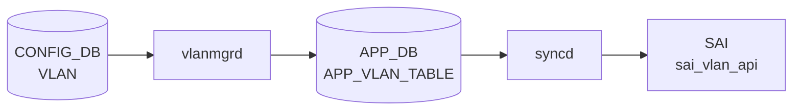

# VLAN テーブル

## 概要

IEEE 802.1Q [VLAN](../../reference/glossary.md#term-vlan) を [CONFIG_DB](../../reference/glossary.md#term-config_db) で定義するテーブル。[VLAN](../../reference/glossary.md#term-vlan) 名 (`Vlan100` 形式) をキーに、[VLAN](../../reference/glossary.md#term-vlan) ID、DHCP リレーサーバ、MTU、admin status、MAC、エイリアスを保持する[^1]。`VLAN_MEMBER` と組合わせてポート割当てを、`VLAN_INTERFACE` と組合わせて L3 IF を構成する。

<!-- cdb-mermaid -->
### データフロー (自動生成)



!!! note "凡例"
    CONFIG_DB から SAI までの典型経路を `docs/reference/config-db-orch-map.md` から機械生成したミニ図。詳細・例外は本ページ本文と対応表を参照。
<!-- /cdb-mermaid -->

## key 構造

```text
VLAN|<name>
```

`<name>` は `Vlan<id>` (id 範囲 2..4094)。

## フィールド一覧

| フィールド | 型 | 必須 | デフォルト | 説明 |
|-----------|----|------|-----------|------|
| `name` (key) | string `Vlan<2..4094>` | ✅ | - | VLAN 名 |
| `vlanid` | uint16 (2..4094) | - | - | VLAN ID。`name` 末尾と一致しなければならない (`must`) |
| `alias` | string | - | - | ユーザ別名 |
| `description` | string (1..255) | - | - | 説明 |
| `dhcp_servers` | leaf-list ip-address | - | - | DHCPv4 リレー先 |
| `dhcpv6_servers` | leaf-list ipv6-address | - | - | DHCPv6 リレー先 |
| `mtu` | uint16 (1..9216) | - | - | MTU |
| `admin_status` | `admin_status` | - | - | 管理状態 |
| `mac` | mac-address | - | - | VLAN 上の MAC |

## 制約

- `vlanid` は `name` の数値部分と一致しなければならない (`substring-after(../name, 'Vlan') = current()`)

## 購読者

- `vlanmgrd`: VLAN 作成・MTU・admin_status をモニタし Linux bridge に反映
- `orchagent` の `VlanMgr` / `VRouterOrch`: [SAI](../../reference/glossary.md#term-sai) bridge / VLAN を構成
- `dhcprelayd` (`sonic-dhcp-relay`): `dhcp_servers` / `dhcpv6_servers` を読み出して relay agent を構成

## 関連 CONFIG_DB / YANG / CLI

- 関連 [CONFIG_DB](../../reference/glossary.md#term-config_db): `VLAN_MEMBER`、`VLAN_INTERFACE`、`DHCP_RELAY`
- 関連 CLI: `config vlan` (add / del / member / dhcp_relay)
- 関連 [YANG](../../reference/glossary.md#term-yang): `sonic-vlan`

<!-- value-behavior -->
## 値依存挙動マトリクス

| フィールド | 値 | 実挙動 |
|-----------|-----|--------|
| `admin_status` | `up` | `ip link set Vlan<id> up` (vlanmgr.cpp:168-170) |
| `admin_status` | `down` | `ip link set Vlan<id> down` |
| `admin_status` | 省略 | `"up"` が自動補完される (vlanmgr.cpp:424) |
| `mtu` | 省略 | `DEFAULT_MTU_STR`（通常 `9100`）が使用される (vlanmgr.cpp:96) |
| `mtu` | 明示指定 | 受け取るが netdev MTU は変更しない。`SWSS_LOG_DEBUG("Host VLAN mtu setting to be supported.")` のみ出力（TODO 状態）|
| `mac` | 省略 | `gMacAddress`（スイッチ MAC）が自動補完 |
| `mac` | 明示指定 | 指定 MAC が VLAN インタフェース MAC として設定される |
| `dhcp_servers` | leaf-list | `dhcprelayd` がリストを読み DHCPv4 relay を構成 |
| `dhcp_servers` | 単一文字列誤入力 | `dhcprelayd` が relay を起動しない（leaf-list 形式で入力必須）|
| `vlanid` | `name` 末尾と不一致 | YANG `must` 違反で reject |

<!-- /value-behavior -->

## 例外条件・特殊挙動 <!-- cdb-exceptions -->

<!-- evidence: sonic-swss/cfgmgr/vlanmgr.cpp; sonic-buildimage/src/sonic-yang-models/yang-models/sonic-vlan.yang -->

- **キー形式検証**: `Vlan<2..4094>` パターン。`Vlan` プレフィクスがない、または数値部が不正な場合 `vlanmgrd` はエントリを破棄する (`SWSS_LOG_ERROR("Invalid key format")`)[^exc1]。
- **`vlanid` 整合性 (YANG)**: `must "substring-after(../name, 'Vlan') = current()"` — `name` 末尾と `vlanid` フィールドが不一致の場合 YANG バリデーションが reject する[^exc2]。
- **MTU 無視**: `mtu` フィールドはホスト VLAN netdev への適用が TODO 扱いで、`vlanmgrd` は受け取っても `SWSS_LOG_DEBUG("Host VLAN mtu setting to be supported.")` のみ出力し実際には変更しない[^exc1]。
- **warm-restart 重複スキップ**: [STATE_DB](../../reference/glossary.md#term-state_db) に既存かつ `m_vlans` に登録済みの場合、再作成をスキップして replay エントリを削除する（"already created" デバッグログ）[^exc1]。
- **デフォルト補完**: `mtu` 省略時は `DEFAULT_MTU_STR`（通常 `9100`）、`mac` 省略時はスイッチ MAC が自動補完される[^exc1]。

[^exc1]: `sonic-swss/cfgmgr/vlanmgr.cpp` <https://github.com/sonic-net/sonic-swss/blob/master/cfgmgr/vlanmgr.cpp>
[^exc2]: `sonic-buildimage/src/sonic-yang-models/yang-models/sonic-vlan.yang` <https://github.com/sonic-net/sonic-buildimage/blob/master/src/sonic-yang-models/yang-models/sonic-vlan.yang>

<!-- platform -->
## プラットフォーム差・SAI capability 分岐

<!-- evidence: sonic-swss/cfgmgr/vlanmgr.cpp; sonic-swss/orchagent/portsorch.cpp -->

### VOQ chassis / DPU モード差 (`gMySwitchType`)

`PortsOrch` 初期化時に `gMySwitchType` を参照し、`"dpu"` の場合は以下をスキップする (portsorch.cpp:987-1066)[^plat1]:

| 処理 | 通常モード | DPU モード |
|------|-----------|-----------|
| SAI デフォルト 1Q Bridge / VLAN OID 取得 | 実行 | スキップ |
| `removeDefaultVlanMembers()` / `removeDefaultBridgePorts()` | 実行 | スキップ |
| FDB event notify 設定 (`SAI_SWITCH_ATTR_FDB_EVENT_NOTIFY`) | 実行 | スキップ |

DPU はホスト側 Linux bridge を通常通り作成する（vlanmgr.cpp は `gMySwitchType` を参照しない）。**VOQ chassis** (`gMySwitchType == "voq"`) については LAG/SystemPort 系の分岐が存在するが、`addVlan` / `removeVlan` に直接影響する分岐はなく VLAN SAI フローは標準と同一[^plat1]。

### SmartSwitch DPU — `host_ifname` フィールドによる SAI HOSTIF バインド

APP_DB `VLAN_TABLE` の `host_ifname` フィールドが設定されている場合に `createVlanHostIntf()` が呼ばれ、SAI `create_hostif()` で VLAN OID に `SAI_HOSTIF_TYPE_NETDEV` ホストインタフェースをバインドする (portsorch.cpp:5820-5828)[^plat1]。このフィールドは YANG 外かつ CONFIG_DB 未定義で、vlanmgrd は受け取った場合 APP_DB に透過転送する (vlanmgr.cpp:416-418, 434)[^plat2]。SmartSwitch NPU→DPU 監視用途で使用。`removeVlan()` 時は `removeVlanHostIntf()` を先に呼ぶ (portsorch.cpp:7457)。

### カーネル Linux bridge vs SAI VLAN — 二重平面の非対称動作

SONiC の VLAN 制御は 2 平面で並列動作し、互いの完了を待たない:

| 平面 | コンポーネント | 実装 |
|------|--------------|------|
| カーネル側 | vlanmgrd | `ip link add Bridge type bridge`、`bridge vlan add vid <N>` |
| ASIC/SAI 側 | orchagent (VlanOrch) | `sai_vlan_api->create_vlan(SAI_VLAN_ATTR_VLAN_ID)` (1 属性のみ) |

- **DPU モードでもカーネル bridge は作成される**。DPU の転送はカーネル bridge を通過しないためカーネル bridge は制御面・管理面専用となる。
- **MTU 非対称**: vlanmgrd は `DEFAULT_MTU_STR=9100` を APP_DB に書くが、カーネル netdev MTU の設定は TODO 状態 (vlanmgr.cpp:401-406)。ホスト側と SAI 側で MTU が乖離し得る。
- **SAI デフォルト属性依存**: `create_vlan()` は `SAI_VLAN_ATTR_VLAN_ID` のみ指定し flooding control 等はベンダー SAI デフォルトに委ねる (portsorch.cpp:7392)。VS SAI と実 ASIC SAI でデフォルト挙動が異なる[^plat1]。

### SAI Flood Control capability — `COMBINED` 非対応 ASIC

orchagent 起動時に `sai_query_attribute_enum_values_capability()` で UUC / BC の flood control タイプを問い合わせる (portsorch.cpp:900-931)。`SAI_VLAN_FLOOD_CONTROL_TYPE_COMBINED` をサポートしない ASIC では VXLAN EVPN の flood group 設定がエラー終了する (portsorch.cpp:7517-7524)。VS SAI は `ALL` / `NONE` / `L2MC_GROUP` の 3 種のみを返し `COMBINED` を返さない[^plat1]。

### `SAI_HOSTIF_VLAN_TAG` — ベンダー間の段階的サポート

コードコメントに「`SAI_HOSTIF_VLAN_TAG_ORIGINAL` は全 ASIC ベンダーの libsai でサポートされる前」と明記 (portsorch.cpp:3043-3045)。orchagent は VLAN メンバ追加時に `STRIP` / `KEEP` を条件で切り替えており、CPU ポートへのパケット受信時の VLAN タグ有無がベンダー実装で異なる可能性がある[^plat1]。

[^plat1]: `sonic-swss/orchagent/portsorch.cpp` <https://github.com/sonic-net/sonic-swss/blob/master/orchagent/portsorch.cpp>
[^plat2]: `sonic-swss/cfgmgr/vlanmgr.cpp` <https://github.com/sonic-net/sonic-swss/blob/master/cfgmgr/vlanmgr.cpp>

<!-- /platform -->

<!-- ref-triangle:start -->

## 関連リファレンス

- [YANG](../../reference/glossary.md#term-yang): [`sonic-vlan`](../yang/sonic-vlan.md)
- CLI: [`config vlan`](../cli/config-vlan.md)

<!-- ref-triangle:end -->

## 引用元

[^1]: [YANG](../../reference/glossary.md#term-yang) 定義: `sonic-buildimage/src/sonic-yang-models/yang-models/sonic-vlan.yang` (sha `9ea932ec`). <https://github.com/sonic-net/sonic-buildimage/blob/9ea932ec2e18f35e58268ec2e4456b1d4afd65cd/src/sonic-yang-models/yang-models/sonic-vlan.yang>

## 関連ページ
- [HLD: Switchport モードと VLAN CLI 拡張](../../switching/switch-port-modes-and-vlan-cli-enhancement.md)
- [CLI: config vlan](../cli/config-vlan.md)
- [CLI: show vlan](../cli/show-vlan.md)
- [YANG: sonic-vlan](../yang/sonic-vlan.md)

<!-- topics-back-ref -->
## 関連 Topics

- [Topics: L2 / VLAN / LAG / MC-LAG](../../topics/06-l2-vlan-lag/index.md)

<!-- /topics-back-ref -->

<!-- ops-hint -->
## 運用ヒント

### 典型値

- `Vlan100` 等の `Vlan<2..4094>` 形式キー。`vlanid` は名前末尾と一致。
- `mtu`: 9100（ホスト側 jumbo 用途）。
- `admin_status`: `up`。
- `dhcp_servers`: `["10.0.0.1", "10.0.0.2"]` 等の relay 先。

### よくある誤設定

- `vlanid` を `name` 末尾と異なる値で投入すると YANG `must` 違反で reject される。
- `VLAN_MEMBER` を作る前に `VLAN_INTERFACE` を作ると L3 IF が isolated VLAN にぶら下がる。
- `dhcp_servers` をリストで無く単一文字列で入れると dhcprelayd が relay を起動しない。

### 確認コマンド

```bash
sonic-db-cli CONFIG_DB hgetall 'VLAN|Vlan100'
sonic-db-cli CONFIG_DB keys 'VLAN_MEMBER|Vlan100|*'
show vlan brief
```
<!-- /ops-hint -->


<!-- runtime-trace -->
## CDB → 実コンテナ動作トレース

### 段階 1: Consumer 登録

- **orchagent / VlanOrch**: `VLAN` テーブルを `SubscriberStateTable` で購読。
- **vlanmgrd** (`sonic-swss/cfgmgr/vlanmgr.cpp`): `VLAN` テーブルを購読して Linux VLAN ブリッジを管理。

### 段階 2: CFG → APPL 翻訳

- vlanmgrd が `VLAN` エントリを APP_DB `VLAN_TABLE` に書き込み、`ip link add Vlan<N> type bridge vlan_filtering 1` でカーネルブリッジを作成。

### 段階 3: APPL → SAI

- VlanOrch が APP_DB `VLAN_TABLE` を読み `sai_vlan_api->create_vlan()` でハードウェア VLAN を作成。

### 段階 4: タイミング + 副作用

- カーネルブリッジ作成 (vlanmgrd) と SAI VLAN 作成 (VlanOrch) はほぼ同時。数十 ms 以内。
- 副作用: admin_status=down でもカーネルブリッジは作成される (`ip link set Vlan<N> down` が別途発行)。

<!-- /runtime-trace -->
<!-- entry-points -->
## 書き込み入り口 (Direction A)

VLAN テーブルへの書き込みが発生するコード経路を網羅的に調査した結果。

### CLI

  - `config vlan add/del ...` — `config/vlan.py` が `set_entry('VLAN', vlan_name, {'vlanid': str(vid)})` を呼ぶ (sonic-utilities/config/vlan.py:141)

### minigraph / sonic-cfggen

**minigraph.py** が VLAN を生成し投入 (sonic-buildimage/src/sonic-config-engine/minigraph.py)

### REST / gNMI

REST/gNMI 書き込み経路なし

### db_migrator

**db_migrator.py** が VLAN のマイグレーション処理を実装 (sonic-utilities/scripts/db_migrator.py:931)

### ビルド時デフォルト (build-time default)

なし

### ハードコードデフォルト / ランタイム注入

なし

### 死活・デッドコード

なし
<!-- /entry-points -->

<!-- glossary-links-injected: 6981be1a469d -->
