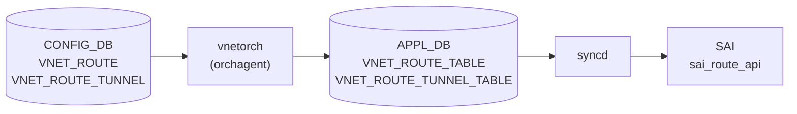

# VNET_ROUTE / VNET_ROUTE_TUNNEL テーブル

## 概要

[VNET](../../reference/glossary.md#term-vnet) スコープの静的経路を [CONFIG_DB](../../reference/glossary.md#term-config_db) に定義するテーブル群[^1]。`VNET_ROUTE` は通常の nexthop + interface による経路、`VNET_ROUTE_TUNNEL` は [VXLAN](../../reference/glossary.md#term-vxlan) トンネル経由の overlay 経路を表す。

[orchagent](../../reference/glossary.md#term-orchagent) の `VNetRouteOrch` が [APPL_DB](../../reference/glossary.md#term-appl_db) の `VNET_ROUTE_TABLE` / `VNET_ROUTE_TUNNEL_TABLE` を購読し、SAI の VRF route として実装する。BFD / カスタムモニタリングと組み合わせることで primary/backup ルーティングや ECMP フェイルオーバーが可能[^2]。

<!-- cdb-mermaid -->
### データフロー (自動生成)



!!! note "凡例"
    CONFIG_DB から SAI までの典型経路。BFD モニタリング経路では追加の STATE_DB 経由フローが発生する。
<!-- /cdb-mermaid -->

## key 構造

```text
VNET_ROUTE|<vnet_name>|<prefix>
VNET_ROUTE_TUNNEL|<vnet_name>|<prefix>
```

- `<vnet_name>`: `VNET` テーブルの name への leafref
- `<prefix>`: IPv4 prefix（CIDR 形式）

## 主要フィールド

### VNET_ROUTE

| フィールド | 型 | 必須 | 説明 |
|-----------|----|------|------|
| `nexthop` | IPv4 address list | yes | nexthop IP 群（カンマ区切り複数 IP で ECMP） |
| `ifname` | string | yes | nexthop に対応する interface 名 |

### VNET_ROUTE_TUNNEL

| フィールド | 型 | 必須 | 説明 |
|-----------|----|------|------|
| `endpoint` | IPv4 address list | yes | tunnel endpoint / nexthop IP 群 |
| `mac_address` | MAC address list | no | encapsulated packet の inner destination MAC（endpoint と 1:1 対応） |
| `vni` | VNI list | no | encapsulated packet に使う VNI（省略時は VNET 本体の VNI） |
| `endpoint_monitor` | IPv4 address list | no | 各 endpoint に対応する BFD/カスタムモニタリング IP |
| `profile` | string | no | ルート適用プロファイル名 |
| `monitoring` | string | no | モニタリング種別（`custom` / `custom_bfd`） |
| `adv_prefix` | IPv4 prefix | no | BGP 広告に使う prefix（省略時はルート prefix と同一） |
| `check_directly_connected` | boolean | no | endpoint が直接接続か確認するフラグ |
| `rx_monitor_timer` | uint32 | no | BFD rx_interval（ms）省略時は BFD デフォルト |
| `tx_monitor_timer` | uint32 | no | BFD tx_interval（ms）省略時は BFD デフォルト |
| `pinned_state` | string list | no | 各 monitor アドレスの固定状態（`up` / `down`） |
| `primary` | IPv4 address list | no | primary endpoint IP 群（primary/backup 構成時） |
| `consistent_hashing_buckets` | uint16 | no | consistent hashing bucket 数（orchagent 未使用） |
| `metric` | uint8 | no | 経路分類用 metric（orchagent 未使用。経路動作に影響しない） |

## 制約

- `VNET_ROUTE` / `VNET_ROUTE_TUNNEL` の `vnet_name` は既存 `VNET` への leafref。
- `VNET_ROUTE.nexthop` / `ifname` および `VNET_ROUTE_TUNNEL.endpoint` は mandatory。
- prefix 型は IPv4 prefix に限定（sonic-vnet.yang 上 `stypes:sonic-ip4-prefix`）。
- `endpoint_monitor` を省略した状態で `primary` を指定すると orchagent がエラーを返す（"Primary/backup behaviour cannot function without endpoint monitoring"）。
- `pinned_state` のリスト長は `endpoint_monitor` のリスト長と一致しなければならない。
- `mac_address` / `endpoint_monitor` のリスト長は `endpoint` のリスト長と一致しなければならない。

## 購読者

- `vnetorch`（orchagent): [APPL_DB](../../reference/glossary.md#term-appl_db) `VNET_ROUTE_TABLE` / `VNET_ROUTE_TUNNEL_TABLE` を `VNetRouteOrch::handleRoutes()` / `handleTunnel()` で処理し、SAI route として実装する。

## 関連 CONFIG_DB / YANG / CLI

- 関連 CONFIG_DB: `VNET`、`VXLAN_TUNNEL`
- 関連 CLI: `config vxlan`、`show vnet routes all`
- 関連 [YANG](../../reference/glossary.md#term-yang): `sonic-vnet`

<!-- value-behavior -->
## 値依存挙動マトリクス

| フィールド | 値 | 実挙動 |
|-----------|-----|--------|
| `mac_address` | 省略 / 空 | 各 endpoint に `00:00:00:00:00:00`（ゼロ MAC）が設定される |
| `vni` | 省略 / `0` | VNET 本体の VNI が VXLAN encapsulation に使われる |
| `endpoint_monitor` | 省略 | BFD/カスタムモニタリングなし。フェイルオーバーが発生しない |
| `monitoring` | `""` | モニタリング無効。endpoint 障害を検知しない |
| `monitoring` | `"custom"` | カスタムモニタリング有効。endpoint_monitor 必須 |
| `monitoring` | `"custom_bfd"` | BFD セッションによるモニタリング有効。endpoint_monitor 必須 |
| `check_directly_connected` | `false` | endpoint が直接接続か確認しない。全 endpoint を overlay 扱い |
| `check_directly_connected` | `true` | 隣接テーブルで直接接続を確認。ローカル endpoint は TUNNEL_TERM_ACL を生成 |
| `rx_monitor_timer` | `-1`（省略） | BFD セッションの rx_interval を明示しない（BFD デフォルト） |
| `primary` | 省略 | primary/backup なし。全 endpoint が ECMP として扱われる |
| `adv_prefix` | 省略 | ルート prefix を自己宣言（`adv_prefix = ip_pfx`） |
| `metric` | 任意 uint8 | 経路選択に影響しない（orchagent が値を使用しない） |
| `consistent_hashing_buckets` | 任意 uint16 | orchagent が完全に無視（dead field） |
| `pinned_state` | `"up"` | 該当 monitor を `PINNED_STATE_UP` として強制 up 扱い |
| `pinned_state` | `"down"` | 該当 monitor を `PINNED_STATE_DOWN` として強制 down 扱い |
| `pinned_state` | その他 / 省略 | `PINNED_STATE_NONE`（pinned なし） |

<!-- /value-behavior -->

## 例外条件・特殊挙動 <!-- cdb-exceptions -->

<!-- evidence: sonic-swss/orchagent/vnetorch.cpp; sonic-buildimage/src/sonic-yang-models/yang-models/sonic-vnet.yang -->

- **`primary` + `endpoint_monitor` の依存**: `primary` を指定して `endpoint_monitor` を省略すると、orchagent が `"Primary/backup behaviour cannot function without endpoint monitoring."` を SWSS_LOG_ERROR で記録して `true` を返す（処理は正常終了扱いだが経路は設定されない）[^exc1]。
- **リスト長不一致エラー**: `mac_address` / `endpoint_monitor` / `pinned_state` のリスト長が `endpoint` と一致しない場合、orchagent が SWSS_LOG_ERROR を記録して `false` を返す[^exc1]。
- **VNI 0 の解釈**: `vni` リストが空または `"0"` の場合、VXLAN orch がベース tunnel の VNI を使用する（`createNextHopTunnel(vni=0)`）[^exc1]。
- **ゼロ MAC の転送挙動**: `mac_address` 省略時のゼロ MAC `00:00:00:00:00:00` は tunnel nexthop に設定される。ASIC の挙動はプラットフォーム依存[^exc1]。

[^exc1]: `sonic-swss/orchagent/vnetorch.cpp` <https://github.com/sonic-net/sonic-swss/blob/4305596156d70e9797e8a881b3d19b46de0bce0d/orchagent/vnetorch.cpp>

<!-- ref-triangle:start -->

## 関連リファレンス

- CONFIG_DB: [`VNET`](./vnet.md)
- YANG: [`sonic-vnet`](../yang/sonic-vnet.md)
- CLI: [`config vxlan`](../cli/config-vxlan.md)

<!-- ref-triangle:end -->

## 引用元

[^1]: YANG 定義: `sonic-vnet.yang`. <https://github.com/sonic-net/sonic-buildimage/blob/9ea932ec2e18f35e58268ec2e4456b1d4afd65cd/src/sonic-yang-models/yang-models/sonic-vnet.yang>
[^2]: orchagent 実装: `vnetorch.cpp`. <https://github.com/sonic-net/sonic-swss/blob/4305596156d70e9797e8a881b3d19b46de0bce0d/orchagent/vnetorch.cpp>

<!-- ops-hint -->
## 運用ヒント

### 典型値

- `VNET_ROUTE` は underlay ネットワーク経由の静的経路（interface + nexthop）。
- `VNET_ROUTE_TUNNEL` は VXLAN overlay 経由の経路。`endpoint` に tunnel 対向 IP を指定。
- 複数 `endpoint` をカンマ区切りで指定すると ECMP。
- フェイルオーバーが必要な場合は `endpoint_monitor` + `monitoring=custom_bfd` を組み合わせる。

### よくある誤設定

- `primary` を指定しても `endpoint_monitor` を省略すると経路が設定されない（エラーログのみ）。
- `mac_address` / `endpoint_monitor` のリスト長が `endpoint` と不一致だと設定が拒否される。
- `consistent_hashing_buckets` を設定しても orchagent が完全に無視するため効果がない。

### 確認コマンド

```bash
sonic-db-cli CONFIG_DB hgetall 'VNET_ROUTE|Vnet_1000|10.1.0.0/24'
sonic-db-cli CONFIG_DB hgetall 'VNET_ROUTE_TUNNEL|Vnet_1000|192.168.1.0/24'
show vnet routes all
show vnet routes tunnel
```
<!-- /ops-hint -->

<!-- runtime-trace -->
## CDB → 実コンテナ動作トレース

### 段階 1: Consumer 登録

- **orchagent / VNetRouteOrch** (`sonic-swss/orchagent/vnetorch.cpp`): `VNET_ROUTE_TABLE` / `VNET_ROUTE_TUNNEL_TABLE` を `SubscriberStateTable` で購読。

### 段階 2: CFG → APPL 翻訳

- `VNetRouteOrch::handleRoutes()` が `VNET_ROUTE` を処理。nexthop / ifname を解析して `nextHop` 構造体を構築。
- `VNetRouteOrch::handleTunnel()` が `VNET_ROUTE_TUNNEL` を処理。endpoint / vni / mac_address 等を解析して `NextHopGroupKey` を構築。

### 段階 3: APPL → SAI

- `doRouteTask<VNetVrfObject>()` が VRF オブジェクトを取得し、`sai_route_api->create_route_entry()` で SAI route を設定。
- BFD モニタリングが有効な場合は `createBfdSession()` / `createCustomBFDMonitoringSession()` で BFD セッションを追加生成。

### 段階 4: タイミング + 副作用

- `VNET` テーブルが先に処理されていない場合、該当 VNET オブジェクトが存在せずエラー。
- BFD セッションの状態変化で endpoint が up/down すると、動的に ECMP グループが更新される。

<!-- /runtime-trace -->

<!-- entry-points -->
## 書き込み入り口 (Direction A)

### CLI

```bash
# CONFIG_DB への直接書き込み（sonic-utilities / config load 経由）
config load vnet_routes.json
```

### REST / gNMI

REST/gNMI 書き込み経路なし（手動 JSON 投入が主経路）

### db_migrator

db_migrator.py での VNET_ROUTE マイグレーションなし

### ビルド時デフォルト (build-time default)

なし

### ハードコードデフォルト / ランタイム注入

なし
<!-- /entry-points -->

<!-- defaults -->
## コード由来の暗黙デフォルト

### VNET_ROUTE

| フィールド | YANG default | コード実装デフォルト | 出典 |
|-----------|-------------|---------------------|------|
| `nexthop` | なし (mandatory) | 省略不可 | sonic-vnet.yang |
| `ifname` | なし (mandatory) | 省略不可 | sonic-vnet.yang |

### VNET_ROUTE_TUNNEL

| フィールド | YANG default | コード実装デフォルト | 出典 |
|-----------|-------------|---------------------|------|
| `endpoint` | なし (mandatory) | 省略不可 | sonic-vnet.yang |
| `mac_address` | なし | `00:00:00:00:00:00`（ゼロ MAC）per endpoint | vnetorch.cpp:3372-3375 |
| `vni` | なし | `0` — [VNET](../../reference/glossary.md#term-vnet) 本体の VNI で encapsulation | vnetorch.cpp:3362-3370 |
| `endpoint_monitor` | [YANG](../../reference/glossary.md#term-yang) 外 | 空リスト — モニタリングなし | vnetorch.cpp:3203,3230-3232 |
| `profile` | [YANG](../../reference/glossary.md#term-yang) 外 | `""` — プロファイル未適用 | vnetorch.cpp:3204,3234-3236 |
| `monitoring` | [YANG](../../reference/glossary.md#term-yang) 外 | `""` — モニタリング種別なし | vnetorch.cpp:3207,3242-3244 |
| `adv_prefix` | [YANG](../../reference/glossary.md#term-yang) 外 | ルート prefix と同一（自己宣言）| vnetorch.cpp:3421-3423 |
| `check_directly_connected` | [YANG](../../reference/glossary.md#term-yang) 外 | `false` — 直接接続チェックなし | vnetorch.cpp:3213 |
| `rx_monitor_timer` | [YANG](../../reference/glossary.md#term-yang) 外 | `-1` — BFD デフォルト rx_interval | vnetorch.cpp:3208,2078-2081 |
| `tx_monitor_timer` | [YANG](../../reference/glossary.md#term-yang) 外 | `-1` — BFD デフォルト tx_interval | vnetorch.cpp:3209,2084-2087 |
| `pinned_state` | [YANG](../../reference/glossary.md#term-yang) 外 | `PINNED_STATE_NONE` — pinned なし | vnetorch.cpp:3402-3404 |
| `primary` | [YANG](../../reference/glossary.md#term-yang) 外 | 空リスト — primary/backup なし（通常 ECMP）| vnetorch.cpp:3205,3311-3315 |
| `consistent_hashing_buckets` | なし | [orchagent](../../reference/glossary.md#term-orchagent) 未使用（dead field）| vnetorch.h:310-329 |
| `metric` | なし | 実質未使用（dead field）— 経路選択に影響しない | vnetorch.h:327, vnetorch.cpp:3196-3290 |

### 注記

- **`consistent_hashing_buckets` の dead field 性**: YANG に定義があるが `vnet_route_description`（vnetorch.h）に登録なし。[orchagent](../../reference/glossary.md#term-orchagent) は完全に無視する。
- **`metric` の semi-dead field 性**: `vnet_route_description` には登録されているが `handleTunnel()` 内で値を読み出して使用するコードが存在しない。[YANG](../../reference/glossary.md#term-yang) コメント通り「経路動作に影響しない」。
- **`vni` = 0 の意味**: `createNextHopTunnel()` に `vni=0` を渡した場合、vxlanorch 側はベース [VXLAN](../../reference/glossary.md#term-vxlan) tunnel の VNI を使用する。
- **`rx_monitor_timer` / `tx_monitor_timer` = -1**: `createBfdSession()` 内で `if (rx_monitor_timer >= 0)` ガードがあり、-1 の場合は BFD セッション作成時に rx/tx_interval 属性を渡さない（BFD デフォルト値が適用される）。
- **`mac_address` のゼロ MAC**: 省略 / 空文字列時は `NextHopKey` にゼロ MAC が設定される。ASIC 上の挙動はプラットフォーム依存。
<!-- /defaults -->
