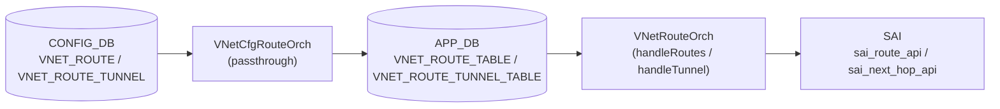

# VNET_ROUTE / VNET_ROUTE_TUNNEL テーブル

## 概要

`VNET_ROUTE` と `VNET_ROUTE_TUNNEL` は [VXLAN](../../reference/glossary.md#term-vxlan) overlay 上の仮想ネットワーク ([VNET](../../reference/glossary.md#term-vnet)) 内で静的経路を定義する [CONFIG_DB](../../reference/glossary.md#term-config_db) テーブル群[^yang]。`VNET_ROUTE` は underlay インタフェース経由の通常経路を、`VNET_ROUTE_TUNNEL` は [VXLAN](../../reference/glossary.md#term-vxlan) トンネル encapsulation を伴う overlay 経路を表す。テーブル名定数は `schema.h` で `CFG_VNET_RT_TABLE_NAME = "VNET_ROUTE"` および `CFG_VNET_RT_TUNNEL_TABLE_NAME = "VNET_ROUTE_TUNNEL"` として定義されている[^schema]。

CONFIG_DB エントリは `VNetCfgRouteOrch` によって APPL_DB (`VNET_ROUTE_TABLE` / `VNET_ROUTE_TUNNEL_TABLE`) にそのまま passthrough され、APPL_DB の消費者である `VNetRouteOrch` が実際のフィールド解釈と [SAI](../../reference/glossary.md#term-sai) への変換を担う[^vnetorch]。

<!-- cdb-mermaid -->
### データフロー (自動生成)



!!! note "凡例"
    CONFIG_DB から SAI までの典型経路。`VNetCfgRouteOrch` はフィールドを解釈せず passthrough するため、フィールドのデフォルト適用は APPL_DB 購読側の `VNetRouteOrch` で行われる。
<!-- /cdb-mermaid -->

## key 構造

```text
VNET_ROUTE|<vnet_name>|<prefix>
VNET_ROUTE_TUNNEL|<vnet_name>|<prefix>
```

| key 要素 | 説明 |
|---------|------|
| `<vnet_name>` | `VNET` テーブルへの leafref。対象 VNET 名 |
| `<prefix>` | IPv4 prefix（CIDR 形式、例 `192.168.1.0/24`） |

## 主要フィールド

### VNET_ROUTE

VNET スコープの underlay（非トンネル）静的経路。

| フィールド | 型 | 必須 | 説明 |
|-----------|----|------|------|
| `nexthop` | `ipv4-address-list` | yes | nexthop IP アドレス（カンマ区切りで ECMP 指定可） |
| `ifname` | string | yes | nexthop に対応するインタフェース名 |

### VNET_ROUTE_TUNNEL

VNET スコープの VXLAN トンネル encapsulation 経路。

| フィールド | 型 | 必須 | 説明 |
|-----------|----|------|------|
| `endpoint` | `ipv4-address-list` | yes | VXLAN tunnel endpoint IP（カンマ区切りで複数 ECMP 指定可） |
| `mac_address` | `mac-address-list` | no | encapsulated パケットの inner destination MAC（endpoint と 1:1 対応） |
| `vni` | `vnid-list` | no | encapsulated パケットに使う VNI（省略時は VNET 本体 VNI） |
| `consistent_hashing_buckets` | uint16 | no | consistent hashing のバケット数（orchagent 未読取 / dead field） |
| `metric` | uint8 | no | 経路分類用 metric。経路動作に影響しない（YANG コメント） |

## 制約

- `<vnet_name>` は既存 `VNET` エントリへの leafref（YANG 強制）。
- `nexthop`（VNET_ROUTE）および `endpoint`（VNET_ROUTE_TUNNEL）は mandatory。
- `mac_address` と `endpoint` はエントリ数が一致する必要がある（orchagent が不一致を検出してエラー）。
- `vni` リストが 2 件以上の場合は `endpoint` と同数でなければならない。
- `endpoint_monitor` を設定する場合は `endpoint` と同数でなければならない（APPL_DB 拡張フィールド）。

## 購読者・処理経路

1. **`VNetCfgRouteOrch`** (`vnetorch.cpp:3577`): CONFIG_DB の `VNET_ROUTE` / `VNET_ROUTE_TUNNEL` を購読。フィールドを解釈せず全フィールドを APPL_DB にそのまま転送する。
2. **`VNetRouteOrch::handleRoutes()`** (`vnetorch.cpp:1811`): APPL_DB `VNET_ROUTE_TABLE` を消費。`nexthop` / `ifname` を解析して underlay 経路を VRF に追加する。
3. **`VNetRouteOrch::handleTunnel()`** (`vnetorch.cpp:3195`): APPL_DB `VNET_ROUTE_TUNNEL_TABLE` を消費。`endpoint` / `mac_address` / `vni` 等を解析して tunnel nexthop グループを構築し、`sai_route_api` / `sai_next_hop_group_api` でハードウェアに反映する。

## 例外条件・特殊挙動 <!-- cdb-exceptions -->

<!-- evidence: sonic-swss/orchagent/vnetorch.cpp; sonic-buildimage/src/sonic-yang-models/yang-models/sonic-vnet.yang -->

- **`mac_address` / `endpoint` 件数不一致**: orchagent が `"MAC address size of %zu does not match endpoint size of %zu"` エラーを記録して `false` を返す（vnetorch.cpp:3280-3284）。
- **`vni` 件数不一致（2 件以上）**: `"VNI size of %zu does not match endpoint size of %zu"` エラーを記録（vnetorch.cpp:3274-3278）。
- **`endpoint_monitor` なし + `primary` あり**: `"Primary/backup behaviour cannot function without endpoint monitoring."` エラーで処理中断（vnetorch.cpp:3291-3294）。
- **VNET 未存在**: `vnet_orch_->getTypeMap()` で VNET エントリが見つからない場合、メッセージを保留してリトライ。
- **VNI 0 の encapsulation**: `vni=0` で tunnel nexthop 作成時、VXLAN orch はベース tunnel の VNI にフォールバックする。

[^yang]: YANG 定義: `sonic-vnet.yang`. <https://github.com/sonic-net/sonic-buildimage/blob/9ea932ec2e18f35e58268ec2e4456b1d4afd65cd/src/sonic-yang-models/yang-models/sonic-vnet.yang>
[^schema]: テーブル名定数: `schema.h`. <https://github.com/sonic-net/sonic-swss-common/blob/158de8d3463ff4b841653f6d57190bb142b80d9c/common/schema.h>
[^vnetorch]: 実装: `vnetorch.cpp`. <https://github.com/sonic-net/sonic-swss/blob/4305596156d70e9797e8a881b3d19b46de0bce0d/orchagent/vnetorch.cpp>

<!-- ref-triangle:start -->

## 関連リファレンス

- CONFIG_DB: [`VNET`](./vnet.md)
- YANG: [`sonic-vnet`](../yang/sonic-vnet.md)
- CLI: [`show vnet routes`](../cli/show-vnet.md)

<!-- ref-triangle:end -->

## 引用元

[^1]: YANG 定義: `sonic-vnet.yang`. <https://github.com/sonic-net/sonic-buildimage/blob/9ea932ec2e18f35e58268ec2e4456b1d4afd65cd/src/sonic-yang-models/yang-models/sonic-vnet.yang>

<!-- ops-hint -->
## 運用ヒント

### 典型値

- `VNET_ROUTE` key 例: `VNET_ROUTE|Vnet_1000|10.1.1.0/24`
- `VNET_ROUTE_TUNNEL` key 例: `VNET_ROUTE_TUNNEL|Vnet_1000|192.168.100.0/24`
- `endpoint` に複数 IP（カンマ区切り）を指定すると ECMP になる。

### よくある誤設定

- `mac_address` の件数が `endpoint` と一致しないと orchagent がエラーで処理を中断する。
- `vni` を省略すると VNET 本体 VNI で encapsulation されるため、意図的な per-prefix VNI が必要な場合は明示指定が必要。
- `consistent_hashing_buckets` と `metric` は orchagent が読まないため設定しても動作に影響しない。

### 確認コマンド

```bash
sonic-db-cli CONFIG_DB hgetall 'VNET_ROUTE|Vnet_1000|10.1.1.0/24'
sonic-db-cli CONFIG_DB hgetall 'VNET_ROUTE_TUNNEL|Vnet_1000|192.168.100.0/24'
show vnet routes all
show vnet routes tunnel
```
<!-- /ops-hint -->

<!-- runtime-trace -->
## CDB → 実コンテナ動作トレース

### 段階 1: Consumer 登録

- **`VNetCfgRouteOrch`** (`vnetorch.cpp:3577`): `VNET_ROUTE` / `VNET_ROUTE_TUNNEL` テーブルを `SubscriberStateTable` で購読。

### 段階 2: CFG → APPL passthrough

- `doVnetRouteTask()` が CONFIG_DB キー区切り文字（`|`）を APPL_DB 区切り文字（`:`）に変換し、
  全フィールドを `VNET_ROUTE_TABLE` に set する（vnetorch.cpp:3638-3661）。
- `doVnetTunnelRouteTask()` が同様に `VNET_ROUTE_TUNNEL_TABLE` に set する（vnetorch.cpp:3613-3636）。

### 段階 3: APPL → SAI

- `VNetRouteOrch::handleRoutes()`: underlay 経路を `sai_route_api->create_route_entry()` でハードウェアに追加。
- `VNetRouteOrch::handleTunnel()`: tunnel endpoint ごとに `NextHopKey` を構築し、
  nexthop group を `sai_next_hop_group_api` で作成後、`sai_route_api->create_route_entry()` で経路追加。

### 段階 4: タイミング + 副作用

- 対応する `VNET` エントリが先に処理されている必要あり。
- 副作用: endpoint モニタリング有効時は BFD セッションが自動生成される（`createBfdSession()`）。
- VNET 削除時は関連経路・nexthop が全て自動削除される。

<!-- /runtime-trace -->

<!-- entry-points -->
## 書き込み入り口 (Direction A)

### CLI

- 専用 CLI なし — `config load` による JSON 投入またはプログラマティックな `sonic-db-cli` 書き込みが主経路。

### minigraph / sonic-cfggen

minigraph.py に VNET_ROUTE 生成なし。

### REST / gNMI

REST/gNMI 書き込み経路なし（手動 JSON 投入が主経路）。

### db_migrator

`db_migrator.py` での VNET_ROUTE マイグレーションなし。

### ビルド時デフォルト (build-time default)

なし。

### ハードコードデフォルト / ランタイム注入

なし。

<!-- /entry-points -->

<!-- defaults -->
## コード由来の暗黙デフォルト

### VNET_ROUTE

| フィールド | YANG default | コード実装デフォルト | 出典 |
|-----------|-------------|---------------------|------|
| `nexthop` | なし (mandatory) | 省略不可 | sonic-vnet.yang:133 |
| `ifname` | なし (mandatory) | 省略不可。コード初期値 `""` | vnetorch.cpp:1816 |

### VNET_ROUTE_TUNNEL

| フィールド | YANG default | コード実装デフォルト | 出典 |
|-----------|-------------|---------------------|------|
| `endpoint` | なし (mandatory) | 省略不可 | sonic-vnet.yang:169 |
| `mac_address` | なし | `00:00:00:00:00:00`（ゼロ MAC）per endpoint | vnetorch.cpp:3200, 3361-3375 |
| `vni` | なし | `0` — [VNET](../../reference/glossary.md#term-vnet) 本体の VNI で encapsulation | vnetorch.cpp:3201, 3362 |
| `consistent_hashing_buckets` | なし | [orchagent](../../reference/glossary.md#term-orchagent) 未使用（dead field） | vnetorch.h（登録なし） |
| `metric` | なし | [orchagent](../../reference/glossary.md#term-orchagent) 未使用（dead field）。経路選択に影響しない | vnetorch.cpp:3214-3272 |

### 注記

- **`consistent_hashing_buckets` の dead field 性**: `vnet_route_description` への登録がないため `handleTunnel()` が読み取らない。[CONFIG_DB](../../reference/glossary.md#term-config_db) に保存されるが APPL_DB に転送後も無視される。
- **`metric` の dead field 性**: `vnetorch.h:327` で `REQ_T_UINT` として登録はされるが、`handleTunnel()` 内に読み取り・使用コードが存在しない。[YANG](../../reference/glossary.md#term-yang) コメント通り経路選択に影響しない。
- **`mac_address` = ゼロ MAC**: 省略時は各 endpoint の inner dst-mac が `00:00:00:00:00:00` になる。remote VTEP が MAC 学習する構成では問題ないが、固定 MAC が必要な場合は明示指定が必要。
- **`vni` = 0 のフォールバック**: [VXLAN](../../reference/glossary.md#term-vxlan) orch に `vni=0` を渡すとベース tunnel の VNI が encapsulation に使われる（`createNextHopTunnel()` 呼び出し経路）。
<!-- /defaults -->

<!-- ordering -->
## 書込み順依存 (Phase B)

`VNET_ROUTE` / `VNET_ROUTE_TUNNEL` の CONFIG_DB エントリは `VNetCfgRouteOrch` が即座に APPL_DB へ passthrough するが、APPL_DB 側の `VNetRouteOrch` が SAI に反映する段階で複数の順序依存が存在する。

### 検出された順序依存

| # | 依存関係 | 方向 | 緩和策 |
|---|----------|------|--------|
| 1 | `VXLAN_TUNNEL` → `VNET` → `VNET_ROUTE` / `VNET_ROUTE_TUNNEL` | **強制先行** | VXLAN トンネルが存在しない場合、`VNetOrch::addOperation()` が `return false` でリトライ待ち |
| 2 | `VNET`（親）→ `VNET_ROUTE` / `VNET_ROUTE_TUNNEL`（子） | **強制先行** | `doRouteTask()` は `isVnetExists(vnet)` が偽の間 `return false` でキューに残留 |
| 3 | peer `VNET` エントリ群 → 経路処理 | **強制先行（全 peer 揃うまで待機）** | peer のうち 1 件でも未生成なら `"Peer VNET %s not yet created"` を記録して `return false` |
| 4 | CONFIG_DB 書込み → APPL_DB 到達 | 即時（passthrough） | `VNetCfgRouteOrch::doVnetRouteTask()` / `doVnetTunnelRouteTask()` は依存チェックなし。KEY の `|` → `:` 変換のみ行い即時 SET |

### 主要な制約詳細

**VNET 未存在による処理保留 (依存 #2)**: `VNetRouteOrch::doRouteTask<VNetVrfObject>()` は冒頭で `vnet_orch_->isVnetExists(vnet)` を確認し、偽の場合は SET 操作に対して `return false` を返す（vnetorch.cpp:1158-1163, 1492-1497）。これにより APPL_DB エントリは `m_toSync` に保留され、次の orchagent イテレーションで再試行される。DEL 操作は VNET 未存在でも `return true`（スキップ扱い）。

**peer VNET による追加待機 (依存 #3)**: `VNET` テーブルに `peer_list` が設定されている場合、`doRouteTask()` は peer VNET 全件について `isVnetExists(peer)` を確認する（vnetorch.cpp:1175-1183, 1508-1516）。1 件でも未生成の peer があると `"Peer VNET %s not yet created"` を SWSS_LOG_INFO に記録し `return false` で再キューする。peer 数が多い構成では経路の SAI 反映が大幅に遅延する可能性がある。

**VXLAN_TUNNEL の先行必須 (依存 #1)**: `VNetOrch::addOperation()` は `vxlan_orch->isTunnelExists(tunnel)` で参照 VXLAN トンネルの存在を確認し、存在しない場合 `"Vxlan tunnel '%s' doesn't exist"` を記録して `return false` を返す（vnetorch.cpp:497-503）。したがって `VXLAN_TUNNEL` → `VNET` → `VNET_ROUTE*` という 3 段の順序制約が生じる。

**CFG→APPL passthrough の順序独立性 (依存 #4)**: `VNetCfgRouteOrch` は依存チェックを一切行わず、CONFIG_DB に書かれた瞬間に APPL_DB へ転送する。このため CONFIG_DB 上は `VNET_ROUTE` を先に書いても問題ないが、APPL_DB 購読側（`VNetRouteOrch`）が SAI に反映するまでの間は経路が「APPL_DB 存在・SAI 未反映」の中間状態になる。
<!-- /ordering -->

<!-- cross-refs -->
## 暗黙参照テーブル (Phase C)

`VNET_ROUTE` / `VNET_ROUTE_TUNNEL` の CONFIG_DB エントリは `VNetCfgRouteOrch` が依存チェックなしで APPL_DB に passthrough する。暗黙参照が発生するのは APPL_DB 購読側の `VNetRouteOrch` が SAI に反映する段階。以下は `vnetorch.cpp` コード精読による依存先整理[^vnetorch]。

### VNET_ROUTE（underlay 経路）— `VNetRouteOrch::handleRoutes()`

| 参照先テーブル / リソース | 参照方向 | 条件 | 参照元 evidence |
|--------------------------|---------|------|----------------|
| `VNET` (CONFIG_DB) / `VNetOrch` | `isVnetExists(vnet)` で存在確認。`false` なら `return false`（APPL_DB エントリ保留・retry） | 常時 | `vnetorch.cpp:1158-1163, 1492-1497` |
| peer `VNET` エントリ群 | `getPeerList()` で peer 一覧取得後、全 peer について `isVnetExists(peer)` を確認。1 件でも未存在なら `return false` | `VNET.peer_list` が設定されているとき | `vnetorch.cpp:1166-1183` |
| `NeighOrch` (`gNeighOrch`) | `hasNextHop()` + `getNextHopId()` で nexthop OID 取得。存在しなければ SAI 投入をスキップ | `isLocalEp = true`（ローカル endpoint）のとき | `vnetorch.cpp:790, 795, 950, 958-960` |
| SAI `sai_route_api` | `create_route_entry()` / `remove_route_entry()` / `set_route_entry_attribute()` で経路を ASIC に反映 | 常時 | `vnetorch.cpp:651, 689, 722` |
| `CrmOrch` (`gCrmOrch`) | `inc/decCrmResUsedCounter(CRM_IPV4_ROUTE / CRM_IPV6_ROUTE)` で残量カウンタ更新 | IPv4 / IPv6 経路の create / remove ごと | `vnetorch.cpp:665, 669, 698, 702` |

### VNET_ROUTE_TUNNEL（VXLAN トンネル経路）— `VNetRouteOrch::handleTunnel()`

| 参照先テーブル / リソース | 参照方向 | 条件 | 参照元 evidence |
|--------------------------|---------|------|----------------|
| `VNET` (CONFIG_DB) / `VNetOrch` | `isVnetExists(vnet)` で存在確認 | 常時 | `vnetorch.cpp:1682-1687, 1735` |
| peer `VNET` エントリ群 | peer 全件 `isVnetExists` 確認 | `VNET.peer_list` が設定されているとき | `vnetorch.cpp:1735` |
| `VxlanTunnelOrch` | `createNextHopTunnel(tun_name, ip, mac, vni)` で tunnel nexthop OID を生成・取得。`removeNextHopTunnel()` で解放 | 常時（remote endpoint ごと） | `vnetorch.cpp:313-335` |
| `BfdOrch` (`gBfdOrch`) | `createBfdSession()` で BFD セッションを生成。`gBfdOrch->attach(this)` で状態変化通知を受信 | `endpoint_monitor` フィールド指定時 | `vnetorch.cpp:46, 751, 2046, 2300` |
| SAI `sai_next_hop_group_api` | nexthop group / nexthop group member の create / remove | ECMP endpoint（複数）のとき | `vnetorch.cpp:808, 821, 849, 901, 921` |
| SAI `sai_route_api` | `create_route_entry()` / `remove_route_entry()` | 常時 | `vnetorch.cpp:651, 689` |
| `CrmOrch` (`gCrmOrch`) | `inc/decCrmResUsedCounter(CRM_NEXTHOP_GROUP / CRM_NEXTHOP_GROUP_MEMBER)` | nexthop group / member の create / remove ごと | `vnetorch.cpp:821, 861, 917, 929, 2801, 2885` |
| STATE_DB `VNET_RT_TUNNEL_TABLE` | tunnel 経路の active / inactive 状態を書き込む（読み手は監視ツール等） | tunnel 経路の状態変化時 | `vnetorch.cpp:745, 2572, 2614` |
| STATE_DB `ADVERTISE_NETWORK_TABLE` | `advertise_prefix = true` の VNET で prefix 広告を通知（BGP へ） | `VNET.advertise_prefix` 設定時 | `vnetorch.cpp:746, 2645, 2651` |

!!! note "CONFIG_DB passthrough は依存チェックなし"
    `VNetCfgRouteOrch` は CONFIG_DB への書き込みを即座に APPL_DB に転送するため、上記の暗黙参照はすべて APPL_DB 消費側 (`VNetRouteOrch`) で発生する。CONFIG_DB に `VNET_ROUTE_TUNNEL` を先に書いても passthrough は成功するが、VNET や VXLAN トンネルが未作成の間は `VNetRouteOrch` 側で SAI 投入が保留される。

!!! warning "peer VNET が多い構成は SAI 反映遅延に注意"
    `peer_list` に未作成の peer が 1 件でも存在すると `VNetRouteOrch` は `return false` で再キューする。peer 全件が揃うまで経路は SAI に反映されない。大規模 VNET mesh 構成では `VNET_ROUTE` の SAI 到達まで複数 orchagent サイクルを要する場合がある。

詳細根拠は `meta/_intermediate/cdb-flow/vnet-route-cross-refs.md` を参照。
<!-- /cross-refs -->
