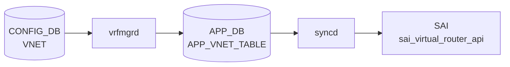

# VNET_ROUTE / VNET_ROUTE_TUNNEL テーブル

## 概要

`VNET_ROUTE` と `VNET_ROUTE_TUNNEL` は [VXLAN](../../reference/glossary.md#term-vxlan) overlay 上の仮想ネットワーク ([VNET](../../reference/glossary.md#term-vnet)) 内で静的経路を定義する [CONFIG_DB](../../reference/glossary.md#term-config_db) テーブル群[^yang]。`VNET_ROUTE` は underlay インタフェース経由の通常経路を、`VNET_ROUTE_TUNNEL` は [VXLAN](../../reference/glossary.md#term-vxlan) トンネル encapsulation を伴う overlay 経路を表す。テーブル名定数は `schema.h` で `CFG_VNET_RT_TABLE_NAME = "VNET_ROUTE"` および `CFG_VNET_RT_TUNNEL_TABLE_NAME = "VNET_ROUTE_TUNNEL"` として定義されている[^schema]。

CONFIG_DB エントリは `VNetCfgRouteOrch` によって APPL_DB (`VNET_ROUTE_TABLE` / `VNET_ROUTE_TUNNEL_TABLE`) にそのまま passthrough され、APPL_DB の消費者である `VNetRouteOrch` が実際のフィールド解釈と [SAI](../../reference/glossary.md#term-sai) への変換を担う[^vnetorch]。

<!-- cdb-mermaid -->
### データフロー (自動生成)



!!! note "凡例"
    CONFIG_DB から SAI までの典型経路を `docs/reference/config-db-orch-map.md` から機械生成したミニ図。詳細・例外は本ページ本文と対応表を参照。
<!-- /cdb-mermaid -->

## key 構造

```text
VNET_ROUTE|<vnet_name>|<prefix>
VNET_ROUTE_TUNNEL|<vnet_name>|<prefix>
```

| key 要素 | 説明 |
|---------|------|
| `<vnet_name>` | `VNET` テーブルへの leafref。対象 VNET 名 |
| `<prefix>` | IPv4 prefix（CIDR 形式、例 `192.168.1.0/24`） |

## 主要フィールド

### VNET_ROUTE

VNET スコープの underlay（非トンネル）静的経路。

| フィールド | 型 | 必須 | 説明 |
|-----------|----|------|------|
| `nexthop` | `ipv4-address-list` | yes | nexthop IP アドレス（カンマ区切りで ECMP 指定可） |
| `ifname` | string | yes | nexthop に対応するインタフェース名 |

### VNET_ROUTE_TUNNEL

VNET スコープの VXLAN トンネル encapsulation 経路。

| フィールド | 型 | 必須 | 説明 |
|-----------|----|------|------|
| `endpoint` | `ipv4-address-list` | yes | VXLAN tunnel endpoint IP（カンマ区切りで複数 ECMP 指定可） |
| `mac_address` | `mac-address-list` | no | encapsulated パケットの inner destination MAC（endpoint と 1:1 対応） |
| `vni` | `vnid-list` | no | encapsulated パケットに使う VNI（省略時は VNET 本体 VNI） |
| `consistent_hashing_buckets` | uint16 | no | consistent hashing のバケット数（orchagent 未読取 / dead field） |
| `metric` | uint8 | no | 経路分類用 metric。経路動作に影響しない（YANG コメント） |

## 制約

- `<vnet_name>` は既存 `VNET` エントリへの leafref（YANG 強制）。
- `nexthop`（VNET_ROUTE）および `endpoint`（VNET_ROUTE_TUNNEL）は mandatory。
- `mac_address` と `endpoint` はエントリ数が一致する必要がある（orchagent が不一致を検出してエラー）。
- `vni` リストが 2 件以上の場合は `endpoint` と同数でなければならない。
- `endpoint_monitor` を設定する場合は `endpoint` と同数でなければならない（APPL_DB 拡張フィールド）。

## 購読者・処理経路

1. **`VNetCfgRouteOrch`** (`vnetorch.cpp:3577`): CONFIG_DB の `VNET_ROUTE` / `VNET_ROUTE_TUNNEL` を購読。フィールドを解釈せず全フィールドを APPL_DB にそのまま転送する。
2. **`VNetRouteOrch::handleRoutes()`** (`vnetorch.cpp:1811`): APPL_DB `VNET_ROUTE_TABLE` を消費。`nexthop` / `ifname` を解析して underlay 経路を VRF に追加する。
3. **`VNetRouteOrch::handleTunnel()`** (`vnetorch.cpp:3195`): APPL_DB `VNET_ROUTE_TUNNEL_TABLE` を消費。`endpoint` / `mac_address` / `vni` 等を解析して tunnel nexthop グループを構築し、`sai_route_api` / `sai_next_hop_group_api` でハードウェアに反映する。

## 例外条件・特殊挙動 <!-- cdb-exceptions -->

<!-- evidence: sonic-swss/orchagent/vnetorch.cpp; sonic-buildimage/src/sonic-yang-models/yang-models/sonic-vnet.yang -->

- **`mac_address` / `endpoint` 件数不一致**: orchagent が `"MAC address size of %zu does not match endpoint size of %zu"` エラーを記録して `false` を返す（vnetorch.cpp:3280-3284）。
- **`vni` 件数不一致（2 件以上）**: `"VNI size of %zu does not match endpoint size of %zu"` エラーを記録（vnetorch.cpp:3274-3278）。
- **`endpoint_monitor` なし + `primary` あり**: `"Primary/backup behaviour cannot function without endpoint monitoring."` エラーで処理中断（vnetorch.cpp:3291-3294）。
- **VNET 未存在**: `vnet_orch_->getTypeMap()` で VNET エントリが見つからない場合、メッセージを保留してリトライ。
- **VNI 0 の encapsulation**: `vni=0` で tunnel nexthop 作成時、VXLAN orch はベース tunnel の VNI にフォールバックする。

[^yang]: YANG 定義: `sonic-vnet.yang`. <https://github.com/sonic-net/sonic-buildimage/blob/9ea932ec2e18f35e58268ec2e4456b1d4afd65cd/src/sonic-yang-models/yang-models/sonic-vnet.yang>
[^schema]: テーブル名定数: `schema.h`. <https://github.com/sonic-net/sonic-swss-common/blob/158de8d3463ff4b841653f6d57190bb142b80d9c/common/schema.h>
[^vnetorch]: 実装: `vnetorch.cpp`. <https://github.com/sonic-net/sonic-swss/blob/4305596156d70e9797e8a881b3d19b46de0bce0d/orchagent/vnetorch.cpp>

<!-- ref-triangle:start -->

## 関連リファレンス

- CONFIG_DB: [`VNET`](./vnet.md)
- YANG: [`sonic-vnet`](../yang/sonic-vnet.md)
- CLI: [`config vnet`](../cli/config-vnet.md)

<!-- ref-triangle:end -->

## 引用元

[^1]: YANG 定義: `sonic-vnet.yang`. <https://github.com/sonic-net/sonic-buildimage/blob/9ea932ec2e18f35e58268ec2e4456b1d4afd65cd/src/sonic-yang-models/yang-models/sonic-vnet.yang>

<!-- ops-hint -->
## 運用ヒント

### 典型値

- `VNET_ROUTE` key 例: `VNET_ROUTE|Vnet_1000|10.1.1.0/24`
- `VNET_ROUTE_TUNNEL` key 例: `VNET_ROUTE_TUNNEL|Vnet_1000|192.168.100.0/24`
- `endpoint` に複数 IP（カンマ区切り）を指定すると ECMP になる。

### よくある誤設定

- `mac_address` の件数が `endpoint` と一致しないと orchagent がエラーで処理を中断する。
- `vni` を省略すると VNET 本体 VNI で encapsulation されるため、意図的な per-prefix VNI が必要な場合は明示指定が必要。
- `consistent_hashing_buckets` と `metric` は orchagent が読まないため設定しても動作に影響しない。

### 確認コマンド

```bash
sonic-db-cli CONFIG_DB hgetall 'VNET_ROUTE|Vnet_1000|10.1.1.0/24'
sonic-db-cli CONFIG_DB hgetall 'VNET_ROUTE_TUNNEL|Vnet_1000|192.168.100.0/24'
show vnet routes all
show vnet routes tunnel
```
<!-- /ops-hint -->

<!-- runtime-trace -->
## CDB → 実コンテナ動作トレース

### 段階 1: Consumer 登録

- **`VNetCfgRouteOrch`** (`vnetorch.cpp:3577`): `VNET_ROUTE` / `VNET_ROUTE_TUNNEL` テーブルを `SubscriberStateTable` で購読。

### 段階 2: CFG → APPL passthrough

- `doVnetRouteTask()` が CONFIG_DB キー区切り文字（`|`）を APPL_DB 区切り文字（`:`）に変換し、
  全フィールドを `VNET_ROUTE_TABLE` に set する（vnetorch.cpp:3638-3661）。
- `doVnetTunnelRouteTask()` が同様に `VNET_ROUTE_TUNNEL_TABLE` に set する（vnetorch.cpp:3613-3636）。

### 段階 3: APPL → SAI

- `VNetRouteOrch::handleRoutes()`: underlay 経路を `sai_route_api->create_route_entry()` でハードウェアに追加。
- `VNetRouteOrch::handleTunnel()`: tunnel endpoint ごとに `NextHopKey` を構築し、
  nexthop group を `sai_next_hop_group_api` で作成後、`sai_route_api->create_route_entry()` で経路追加。

### 段階 4: タイミング + 副作用

- 対応する `VNET` エントリが先に処理されている必要あり。
- 副作用: endpoint モニタリング有効時は BFD セッションが自動生成される（`createBfdSession()`）。
- VNET 削除時は関連経路・nexthop が全て自動削除される。

<!-- /runtime-trace -->

<!-- entry-points -->
## 書き込み入り口 (Direction A)

### CLI

- 専用 CLI なし — `config load` による JSON 投入またはプログラマティックな `sonic-db-cli` 書き込みが主経路。

### minigraph / sonic-cfggen

minigraph.py に VNET_ROUTE 生成なし。

### REST / gNMI

REST/gNMI 書き込み経路なし（手動 JSON 投入が主経路）。

### db_migrator

`db_migrator.py` での VNET_ROUTE マイグレーションなし。

### ビルド時デフォルト (build-time default)

なし。

### ハードコードデフォルト / ランタイム注入

なし。

<!-- /entry-points -->

<!-- defaults -->
## コード由来の暗黙デフォルト

### VNET_ROUTE

| フィールド | YANG default | コード実装デフォルト | 出典 |
|-----------|-------------|---------------------|------|
| `nexthop` | なし (mandatory) | 省略不可 | sonic-vnet.yang:133 |
| `ifname` | なし (mandatory) | 省略不可。コード初期値 `""` | vnetorch.cpp:1816 |

### VNET_ROUTE_TUNNEL

| フィールド | YANG default | コード実装デフォルト | 出典 |
|-----------|-------------|---------------------|------|
| `endpoint` | なし (mandatory) | 省略不可 | sonic-vnet.yang:169 |
| `mac_address` | なし | `00:00:00:00:00:00`（ゼロ MAC）per endpoint | vnetorch.cpp:3200, 3361-3375 |
| `vni` | なし | `0` — [VNET](../../reference/glossary.md#term-vnet) 本体の VNI で encapsulation | vnetorch.cpp:3201, 3362 |
| `consistent_hashing_buckets` | なし | [orchagent](../../reference/glossary.md#term-orchagent) 未使用（dead field） | vnetorch.h（登録なし） |
| `metric` | なし | [orchagent](../../reference/glossary.md#term-orchagent) 未使用（dead field）。経路選択に影響しない | vnetorch.cpp:3214-3272 |

### 注記

- **`consistent_hashing_buckets` の dead field 性**: `vnet_route_description` への登録がないため `handleTunnel()` が読み取らない。[CONFIG_DB](../../reference/glossary.md#term-config_db) に保存されるが APPL_DB に転送後も無視される。
- **`metric` の dead field 性**: `vnetorch.h:327` で `REQ_T_UINT` として登録はされるが、`handleTunnel()` 内に読み取り・使用コードが存在しない。[YANG](../../reference/glossary.md#term-yang) コメント通り経路選択に影響しない。
- **`mac_address` = ゼロ MAC**: 省略時は各 endpoint の inner dst-mac が `00:00:00:00:00:00` になる。remote VTEP が MAC 学習する構成では問題ないが、固定 MAC が必要な場合は明示指定が必要。
- **`vni` = 0 のフォールバック**: [VXLAN](../../reference/glossary.md#term-vxlan) orch に `vni=0` を渡すとベース tunnel の VNI が encapsulation に使われる（`createNextHopTunnel()` 呼び出し経路）。
<!-- /defaults -->

<!-- ordering -->
## 書込み順依存 (Phase B)

`VNET_ROUTE` / `VNET_ROUTE_TUNNEL` の CONFIG_DB エントリは `VNetCfgRouteOrch` が即座に APPL_DB へ passthrough するが、APPL_DB 側の `VNetRouteOrch` が SAI に反映する段階で複数の順序依存が存在する。

### 検出された順序依存

| # | 依存関係 | 方向 | 緩和策 |
|---|----------|------|--------|
| 1 | `VXLAN_TUNNEL` → `VNET` → `VNET_ROUTE` / `VNET_ROUTE_TUNNEL` | **強制先行** | VXLAN トンネルが存在しない場合、`VNetOrch::addOperation()` が `return false` でリトライ待ち |
| 2 | `VNET`（親）→ `VNET_ROUTE` / `VNET_ROUTE_TUNNEL`（子） | **強制先行** | `doRouteTask()` は `isVnetExists(vnet)` が偽の間 `return false` でキューに残留 |
| 3 | peer `VNET` エントリ群 → 経路処理 | **強制先行（全 peer 揃うまで待機）** | peer のうち 1 件でも未生成なら `"Peer VNET %s not yet created"` を記録して `return false` |
| 4 | CONFIG_DB 書込み → APPL_DB 到達 | 即時（passthrough） | `VNetCfgRouteOrch::doVnetRouteTask()` / `doVnetTunnelRouteTask()` は依存チェックなし。KEY の `|` → `:` 変換のみ行い即時 SET |

### 主要な制約詳細

**VNET 未存在による処理保留 (依存 #2)**: `VNetRouteOrch::doRouteTask<VNetVrfObject>()` は冒頭で `vnet_orch_->isVnetExists(vnet)` を確認し、偽の場合は SET 操作に対して `return false` を返す（vnetorch.cpp:1158-1163, 1492-1497）。これにより APPL_DB エントリは `m_toSync` に保留され、次の orchagent イテレーションで再試行される。DEL 操作は VNET 未存在でも `return true`（スキップ扱い）。

**peer VNET による追加待機 (依存 #3)**: `VNET` テーブルに `peer_list` が設定されている場合、`doRouteTask()` は peer VNET 全件について `isVnetExists(peer)` を確認する（vnetorch.cpp:1175-1183, 1508-1516）。1 件でも未生成の peer があると `"Peer VNET %s not yet created"` を SWSS_LOG_INFO に記録し `return false` で再キューする。peer 数が多い構成では経路の SAI 反映が大幅に遅延する可能性がある。

**VXLAN_TUNNEL の先行必須 (依存 #1)**: `VNetOrch::addOperation()` は `vxlan_orch->isTunnelExists(tunnel)` で参照 VXLAN トンネルの存在を確認し、存在しない場合 `"Vxlan tunnel '%s' doesn't exist"` を記録して `return false` を返す（vnetorch.cpp:497-503）。したがって `VXLAN_TUNNEL` → `VNET` → `VNET_ROUTE*` という 3 段の順序制約が生じる。

**CFG→APPL passthrough の順序独立性 (依存 #4)**: `VNetCfgRouteOrch` は依存チェックを一切行わず、CONFIG_DB に書かれた瞬間に APPL_DB へ転送する。このため CONFIG_DB 上は `VNET_ROUTE` を先に書いても問題ないが、APPL_DB 購読側（`VNetRouteOrch`）が SAI に反映するまでの間は経路が「APPL_DB 存在・SAI 未反映」の中間状態になる。
<!-- /ordering -->

<!-- cross-refs -->
## 暗黙参照テーブル (Phase C)

`VNET_ROUTE` / `VNET_ROUTE_TUNNEL` の CONFIG_DB エントリは `VNetCfgRouteOrch` が依存チェックなしで APPL_DB に passthrough する。暗黙参照が発生するのは APPL_DB 購読側の `VNetRouteOrch` が SAI に反映する段階。以下は `vnetorch.cpp` コード精読による依存先整理[^vnetorch]。

### VNET_ROUTE（underlay 経路）— `VNetRouteOrch::handleRoutes()`

| 参照先テーブル / リソース | 参照方向 | 条件 | 参照元 evidence |
|--------------------------|---------|------|----------------|
| `VNET` (CONFIG_DB) / `VNetOrch` | `isVnetExists(vnet)` で存在確認。`false` なら `return false`（APPL_DB エントリ保留・retry） | 常時 | `vnetorch.cpp:1158-1163, 1492-1497` |
| peer `VNET` エントリ群 | `getPeerList()` で peer 一覧取得後、全 peer について `isVnetExists(peer)` を確認。1 件でも未存在なら `return false` | `VNET.peer_list` が設定されているとき | `vnetorch.cpp:1166-1183` |
| `NeighOrch` (`gNeighOrch`) | `hasNextHop()` + `getNextHopId()` で nexthop OID 取得。存在しなければ SAI 投入をスキップ | `isLocalEp = true`（ローカル endpoint）のとき | `vnetorch.cpp:790, 795, 950, 958-960` |
| SAI `sai_route_api` | `create_route_entry()` / `remove_route_entry()` / `set_route_entry_attribute()` で経路を ASIC に反映 | 常時 | `vnetorch.cpp:651, 689, 722` |
| `CrmOrch` (`gCrmOrch`) | `inc/decCrmResUsedCounter(CRM_IPV4_ROUTE / CRM_IPV6_ROUTE)` で残量カウンタ更新 | IPv4 / IPv6 経路の create / remove ごと | `vnetorch.cpp:665, 669, 698, 702` |

### VNET_ROUTE_TUNNEL（VXLAN トンネル経路）— `VNetRouteOrch::handleTunnel()`

| 参照先テーブル / リソース | 参照方向 | 条件 | 参照元 evidence |
|--------------------------|---------|------|----------------|
| `VNET` (CONFIG_DB) / `VNetOrch` | `isVnetExists(vnet)` で存在確認 | 常時 | `vnetorch.cpp:1682-1687, 1735` |
| peer `VNET` エントリ群 | peer 全件 `isVnetExists` 確認 | `VNET.peer_list` が設定されているとき | `vnetorch.cpp:1735` |
| `VxlanTunnelOrch` | `createNextHopTunnel(tun_name, ip, mac, vni)` で tunnel nexthop OID を生成・取得。`removeNextHopTunnel()` で解放 | 常時（remote endpoint ごと） | `vnetorch.cpp:313-335` |
| `BfdOrch` (`gBfdOrch`) | `createBfdSession()` で BFD セッションを生成。`gBfdOrch->attach(this)` で状態変化通知を受信 | `endpoint_monitor` フィールド指定時 | `vnetorch.cpp:46, 751, 2046, 2300` |
| SAI `sai_next_hop_group_api` | nexthop group / nexthop group member の create / remove | ECMP endpoint（複数）のとき | `vnetorch.cpp:808, 821, 849, 901, 921` |
| SAI `sai_route_api` | `create_route_entry()` / `remove_route_entry()` | 常時 | `vnetorch.cpp:651, 689` |
| `CrmOrch` (`gCrmOrch`) | `inc/decCrmResUsedCounter(CRM_NEXTHOP_GROUP / CRM_NEXTHOP_GROUP_MEMBER)` | nexthop group / member の create / remove ごと | `vnetorch.cpp:821, 861, 917, 929, 2801, 2885` |
| STATE_DB `VNET_RT_TUNNEL_TABLE` | tunnel 経路の active / inactive 状態を書き込む（読み手は監視ツール等） | tunnel 経路の状態変化時 | `vnetorch.cpp:745, 2572, 2614` |
| STATE_DB `ADVERTISE_NETWORK_TABLE` | `advertise_prefix = true` の VNET で prefix 広告を通知（BGP へ） | `VNET.advertise_prefix` 設定時 | `vnetorch.cpp:746, 2645, 2651` |

!!! note "CONFIG_DB passthrough は依存チェックなし"
    `VNetCfgRouteOrch` は CONFIG_DB への書き込みを即座に APPL_DB に転送するため、上記の暗黙参照はすべて APPL_DB 消費側 (`VNetRouteOrch`) で発生する。CONFIG_DB に `VNET_ROUTE_TUNNEL` を先に書いても passthrough は成功するが、VNET や VXLAN トンネルが未作成の間は `VNetRouteOrch` 側で SAI 投入が保留される。

!!! warning "peer VNET が多い構成は SAI 反映遅延に注意"
    `peer_list` に未作成の peer が 1 件でも存在すると `VNetRouteOrch` は `return false` で再キューする。peer 全件が揃うまで経路は SAI に反映されない。大規模 VNET mesh 構成では `VNET_ROUTE` の SAI 到達まで複数 orchagent サイクルを要する場合がある。

詳細根拠は `meta/_intermediate/cdb-flow/vnet-route-cross-refs.md` を参照。
<!-- /cross-refs -->

<!-- failure -->
## 失敗挙動 (Phase D)

<!-- evidence: meta/_intermediate/cdb-flow/vnet-route-failure.md -->
<!-- source: sonic-swss/orchagent/vnetorch.cpp -->

### 失敗パス一覧

#### CFG 層 (`VNetCfgRouteOrch`)

`doTask()` は戻り値が `false` のエントリを `m_toSync` に保留して次回再試行し、`true` なら erase する（vnetorch.cpp:3599-3608）。

| # | 失敗トリガー | 戻り値 | 再試行 | SAI 影響 |
|---|------------|--------|--------|---------|
| 1 | SET/DEL 以外の不明コマンド | `false` | あり（永続ループ） | なし |

#### APPL 層 — VNET_ROUTE（underlay）

| # | 失敗トリガー | 戻り値 | 再試行 | SAI 影響 |
|---|------------|--------|--------|---------|
| 2 | VNET 未存在（SET） | `false` | あり | なし |
| 3 | VNET 未存在（DEL） | `true` (スキップ) | なし | なし |
| 4 | peer VNET が 1 件でも未存在 | `false` | あり | なし |
| 5 | Port/RIF 未存在（subnet 経路） | `false` | あり | なし |
| 6 | SAI `create_route_entry()` / `remove_route_entry()` 失敗 | `false` | あり | SAI 変更なし / 部分変更 |
| 7 | `RouteOrch::addRoutePost()` / `removeRoutePost()` 失敗 | `false` | あり | ASIC 状態依存 |

#### APPL 層 — VNET_ROUTE_TUNNEL（VXLAN トンネル経路）

| # | 失敗トリガー | 戻り値 | 再試行 | SAI 影響 |
|---|------------|--------|--------|---------|
| 8 | `vni` リスト件数 ≠ `endpoint` 件数 | `false` | あり（永続） | なし |
| 9 | `mac_address` リスト件数 ≠ `endpoint` 件数 | `false` | あり（永続） | なし |
| 10 | `endpoint_monitor` 件数 ≠ `endpoint` 件数 | `false` | あり（永続） | なし |
| 11 | `primary` 設定 + `endpoint_monitor` なし | `false` | あり（永続） | なし |
| 12 | `pinned_state` 件数 ≠ `endpoint_monitor` 件数 | `false` | あり（永続） | なし |
| 13 | nexthop グループ上限到達 | `false` | あり | なし |
| 14 | SAI `create_next_hop_group()` 失敗 | `false` | あり | なし |
| 15 | SAI nexthop group member 作成失敗 | `false` | あり | 既存メンバー孤立リスク |
| 16 | SAI `create_route_entry()` 失敗 + nhg ロールバック | `false` | あり | nhg ロールバック試行 |
| 17 | `VxlanTunnelOrch::createNextHopTunnel()` 失敗 | `false` | あり | なし |

### 詳細

#### #1. 不明コマンド → 永続再試行ループ

`doVnetRouteTask()` / `doVnetTunnelRouteTask()` は SET / DEL 以外のコマンドに `SWSS_LOG_ERROR("Unknown command : %s")` を出力して `return false` する（vnetorch.cpp:3630, 3662）。`doTask()` はこのエントリを `m_toSync` から削除せずに `++it` するため、コマンドが変わらない限り毎回のイテレーションで同じエントリを再処理し続ける。実運用上はこのパスに入らないが、直接 APPL_DB に不正コマンドを書き込んだ場合に発生する。

#### #2–#4. VNET / peer VNET 未存在 → retry

`doRouteTask<VNetVrfObject>()` 冒頭で `isVnetExists(vnet)` を確認し、偽の場合は SET で `return false`、DEL で `return true`（スキップ）（vnetorch.cpp:1494-1497, 1684-1688）。peer VNET については peer 全件 `isVnetExists(peer)` を確認し、1 件でも偽なら `SWSS_LOG_INFO("Peer VNET %s not yet created")` + `return false`（vnetorch.cpp:1514, 1738）。VNET 作成後に自動的に再試行されて解消する。

#### #5. Port/RIF 未存在（subnet 経路）→ retry

`gPortsOrch->getPort(nh.ifname, port)` が偽または `port.m_rif_id == SAI_NULL_OBJECT_ID` の場合、`SWSS_LOG_WARN("Port/RIF %s doesn't exist")` + `return false`（vnetorch.cpp:1700-1703）。対応インタフェースが存在しない間はリトライ待ちとなる。

#### #8–#12. リスト件数不一致・設定矛盾 → 永続エラー

`handleTunnel()` はフィールド解析段階で件数チェックを行い、不一致があれば `SWSS_LOG_ERROR` + `return false` を返す（vnetorch.cpp:3274-3299）。

- `vni` 件数不一致: `"VNI size of %zu does not match endpoint size of %zu"` （vnetorch.cpp:3276）
- `mac_address` 件数不一致: `"MAC address size of %zu does not match endpoint size of %zu"` （vnetorch.cpp:3282）
- `endpoint_monitor` 件数不一致: `"Peer monitor size of %zu does not match endpoint size of %zu"` （vnetorch.cpp:3288）
- `primary` + monitor なし: `"Primary/backup behaviour cannot function without endpoint monitoring."` （vnetorch.cpp:3293）
- `pinned_state` 件数不一致: `"Pinned state size of %zu does not match monitor size of %zu"` （vnetorch.cpp:3298）

`return false` によりエントリは `m_toSync` に残り再試行されるが、設定を修正しない限り毎回同じエラーを繰り返す。

#### #15. SAI nexthop group member 作成失敗 → 孤立メンバーリスク

`addNextHopGroup()` がメンバー作成中に SAI エラーになった場合、既に作成済みのメンバーのロールバックを行わず `return false` する（vnetorch.cpp:856-858）。SAI 側に孤立した nexthop group member が残存する可能性がある。

!!! warning "リスト件数不一致は永続エラーになる"
    `VNET_ROUTE_TUNNEL` の `mac_address` / `vni` / `endpoint_monitor` / `pinned_state` の件数が `endpoint` と一致しない場合、orchagent は設定が修正されるまで毎回エラーを出力してリトライし続ける。CONFIG_DB の値を修正して件数を一致させるまで SAI への反映は行われない。

!!! warning "SAI nexthop group member 孤立"
    nexthop group member の一括作成中に途中のメンバー作成が失敗した場合、先に作成済みのメンバーのロールバックが実装されていない（vnetorch.cpp:856-858）。SAI 側に孤立したメンバーが残存する可能性があり、再起動するまで解消されない場合がある。
<!-- /failure -->

<!-- constants -->
## ハードコード定数 (Phase E)

<!-- evidence: meta/_intermediate/cdb-flow/vnet-route-constants.md -->
<!-- source: sonic-swss/orchagent/vnetorch.h; sonic-swss-common/common/schema.h -->

`VNET_ROUTE` / `VNET_ROUTE_TUNNEL` 処理に関わる、CONFIG_DB / YANG で管理されないハードコード定数の一覧。

### テーブル名定数

| マクロ名 | 値 | 用途 | ソース |
|---------|-----|------|--------|
| `CFG_VNET_RT_TABLE_NAME` | `"VNET_ROUTE"` | CONFIG_DB テーブル名 | schema.h:369 |
| `CFG_VNET_RT_TUNNEL_TABLE_NAME` | `"VNET_ROUTE_TUNNEL"` | CONFIG_DB トンネル経路テーブル名 | schema.h:370 |
| `APP_VNET_RT_TABLE_NAME` | `"VNET_ROUTE_TABLE"` | APPL_DB passthrough 先テーブル名 | schema.h:82 |
| `APP_VNET_RT_TUNNEL_TABLE_NAME` | `"VNET_ROUTE_TUNNEL_TABLE"` | APPL_DB passthrough 先トンネル経路テーブル名 | schema.h:83 |
| `STATE_VNET_RT_TUNNEL_TABLE_NAME` | `"VNET_ROUTE_TUNNEL_TABLE"` | STATE_DB トンネル経路状態テーブル名 | schema.h:495 |
| `STATE_ADVERTISE_NETWORK_TABLE_NAME` | `"ADVERTISE_NETWORK_TABLE"` | STATE_DB BGP prefix 広告通知テーブル名 | schema.h:496 |
| `APP_BFD_SESSION_TABLE_NAME` | `"BFD_SESSION_TABLE"` | APPL_DB BFD セッション書き込み先 | schema.h:120 |

### リソース上限定数

| マクロ名 | 値 | 用途 | ソース |
|---------|-----|------|--------|
| `VNET_TUNNEL_SIZE` | `40960` | VNET トンネル nexthop の最大数（SAI nexthop pool サイズ） | vnetorch.h:21 |
| `VNET_ROUTE_FULL_MASK_OFFSET_MAX` | `3000` | `/32` 経路に割り当てる VRF オフセットの最大値 | vnetorch.h:22 |
| `VNET_NEIGHBOR_MAX` | `0xffff` (65535) | VNET ネイバーテーブルの最大エントリ数 | vnetorch.h:23 |
| `VNET_BITMAP_SIZE` | `32` | VNET bitmap（VRF ID 管理用）のサイズ | vnetorch.h:20 |

### encapsulation 定数

| マクロ名 | 値 | 用途 | ソース |
|---------|-----|------|--------|
| `VXLAN_ENCAP_TTL` | `128` | VXLAN encapsulation で設定する TTL 値 | vnetorch.h:24 |
| `VNET_BITMAP_RIF_MTU` | `9100` | VNET bitmap モードで生成する RIF の MTU（bytes） | vnetorch.h:25 |

### monitoring タイプ定数

| マクロ名 | 値 | 用途 | ソース |
|---------|-----|------|--------|
| `VNET_MONITORING_TYPE_CUSTOM` | `"custom"` | `monitoring` フィールドのカスタム BFD モード識別子 | vnetorch.h:27 |
| `VNET_MONITORING_TYPE_CUSTOM_BFD` | `"custom_bfd"` | `monitoring` フィールドのカスタム BFD 拡張モード識別子 | vnetorch.h:28 |

### モニタリングタイマーデフォルト

`VNET_ROUTE_TUNNEL` の `rx_monitor_timer` / `tx_monitor_timer` フィールド未指定時の内部初期値。

| 変数 | 初期値 | 意味 | ソース |
|-----|--------|------|--------|
| `rx_monitor_timer` | `-1` | BFD rx インターバル未指定（BFD デーモン側デフォルト使用） | vnetorch.cpp:3208 |
| `tx_monitor_timer` | `-1` | BFD tx インターバル未指定（BFD デーモン側デフォルト使用） | vnetorch.cpp:3209 |

`-1` の場合 `createBfdSession()` は BFD セッション SET 時に `rx_interval` / `tx_interval` フィールドを付加しない（vnetorch.cpp:2078-2086）。これにより BFD デーモン側のデフォルトインターバルがそのまま使用される。
<!-- /constants -->

<!-- side-effects -->
## 副次 DB 書込 (Phase F)

<!-- evidence: meta/_intermediate/cdb-flow/vnet-route-side-effects.md -->
<!-- source: sonic-swss/orchagent/vnetorch.cpp -->

`VNET_ROUTE` / `VNET_ROUTE_TUNNEL` の CONFIG_DB 書込は `VNetCfgRouteOrch` が即座に APPL_DB へ passthrough する。その後 APPL_DB 消費側の `VNetRouteOrch` が SAI 反映を行い、条件次第でさらに STATE_DB や APPL_DB（BFD）への副次書込が発生する。

### 副次書込一覧

| DB | テーブル | キー形式 | トリガ | 条件 |
|----|---------|---------|--------|------|
| APPL_DB | `VNET_ROUTE_TABLE` | `<vnet>:<prefix>` | CONFIG_DB SET/DEL | 常時（passthrough） |
| APPL_DB | `VNET_ROUTE_TUNNEL_TABLE` | `<vnet>:<prefix>` | CONFIG_DB SET/DEL | 常時（passthrough） |
| APPL_DB | `BFD_SESSION_TABLE` | `<type>:<vrf>:<iface>:<peer>` | `endpoint_monitor` 設定時 | `VNET_ROUTE_TUNNEL` の `endpoint_monitor` 指定時のみ |
| STATE_DB | `VNET_ROUTE_TUNNEL_TABLE` | `<vnet>\|<prefix>` | BFD 状態変化時 | `endpoint_monitor` 指定時のみ |
| STATE_DB | `ADVERTISE_NETWORK_TABLE` | `<prefix>` | SAI 経路反映後 | 親 `VNET` の `advertise_prefix=true` 時のみ |

### 詳細

#### APPL_DB passthrough（常時）

`VNetCfgRouteOrch::doVnetRouteTask()` / `doVnetTunnelRouteTask()` が CONFIG_DB 書込と同一イテレーション内で即座に実行される（vnetorch.cpp:3638-3661）。KEY の区切り文字を `|` → `:` に変換するのみで、フィールドはそのまま転送する。

- `VNET_ROUTE` → `APPL_DB/VNET_ROUTE_TABLE:<vnet>:<prefix>`
- `VNET_ROUTE_TUNNEL` → `APPL_DB/VNET_ROUTE_TUNNEL_TABLE:<vnet>:<prefix>`

#### APPL_DB / `BFD_SESSION_TABLE`（`endpoint_monitor` 指定時）

`VNET_ROUTE_TUNNEL` に `endpoint_monitor` フィールドが設定されると、`VNetRouteOrch::createBfdSession()` が各 monitor IP に対して BFD セッションエントリを APPL_DB に書き込む（vnetorch.cpp:2046, 2078-2086）。

- **キー**: `default:default:default:<monitor_ip>`（VRF・インタフェースはデフォルト）
- **フィールド**: `local_addr`, `multihop`, `type`（`rx_interval` / `tx_interval` は `-1` のとき付加しない）
- **DEL**: 経路削除時に `deleteBfdSession()` がエントリを削除する

#### STATE_DB / `VNET_ROUTE_TUNNEL_TABLE`（endpoint_monitor 指定時）

`gBfdOrch->attach(this)` で登録した BFD 状態変化コールバックが呼ばれると、`updateVnetRouteEntry()` が STATE_DB にトンネル経路の active/inactive 状態を書き込む（vnetorch.cpp:2572, 2614）。

- **`state=active`**: BFD セッション UP — `active_endpoints` に現在 UP の endpoint IP を列挙
- **`state=inactive`**: 全 endpoint の BFD がダウン — `active_endpoints` は空文字列
- **タイミング**: CONFIG_DB 書込直後ではなく、BFD セッション状態が変化したタイミングで発生する

定数: `STATE_VNET_RT_TUNNEL_TABLE_NAME = "VNET_ROUTE_TUNNEL_TABLE"` (`schema.h:495`)

#### STATE_DB / `ADVERTISE_NETWORK_TABLE`（`advertise_prefix=true` 時）

親 `VNET` エントリに `advertise_prefix=true` が設定されている場合、`VNetRouteOrch::setBgpNetwork()` が STATE_DB に書き込む（vnetorch.cpp:2645-2651）。

- **SET**: `state=active` フィールドを書き込む。`fpmsyncd` / `bgpcfgd` が購読して BGP へ経路広告を通知する
- **DEL**: 経路削除時にエントリを削除し、BGP 広告を取り消す
- **条件**: VNET_ROUTE および VNET_ROUTE_TUNNEL どちらも発生しうる（親 VNET 設定次第）

定数: `STATE_ADVERTISE_NETWORK_TABLE_NAME = "ADVERTISE_NETWORK_TABLE"` (`schema.h:496`)

!!! note "副次書込の発生タイミング"
    APPL_DB passthrough は CONFIG_DB 書込と同一イテレーション内で即座に発生する。一方 STATE_DB への書込は SAI 反映後（VNET / BFD セッション状態変化後）に発生するため、CONFIG_DB 書込からの遅延が生じる点に注意。

!!! note "VNET_ROUTE（underlay）の STATE_DB 書込なし"
    `VNET_ROUTE`（underlay 経路）は BFD モニタリングを行わないため、STATE_DB への書込は発生しない。STATE_DB 副次書込は `VNET_ROUTE_TUNNEL` かつ `endpoint_monitor` を設定した場合のみ生じる。
<!-- /side-effects -->

<!-- pubsub -->
## Redis 通知メカニズム (Phase G)

### 書き込み側 VNetCfgRouteOrch の通信構造

CONFIG_DB から APPL_DB への通知は 2 段構成で行われる。

1. **CONFIG_DB → VNetCfgRouteOrch**: orchagent 内の `Consumer`（`ConsumerStateTable` ラッパー）が CONFIG_DB の `VNET_ROUTE` / `VNET_ROUTE_TUNNEL` テーブルを keyspace notification で監視する
2. **VNetCfgRouteOrch → APPL_DB**: `ProducerStateTable` 経由で APPL_DB の `VNET_ROUTE_TABLE` / `VNET_ROUTE_TUNNEL_TABLE` に SET/DEL を書き込み、チャネルへ PUBLISH する

### 購読方式: ConsumerStateTable / SubscriberStateTable

`VNetCfgRouteOrch` は orchdaemon 起動時に以下の CONFIG_DB テーブルを Consumer として登録する（orchdaemon.cpp:270-279）:

| 購読元 | DB | テーブル | PSUBSCRIBE パターン |
|--------|-----|---------|-------------------|
| CONFIG_DB | 4 | `VNET_ROUTE` | `__keyspace@4__:VNET_ROUTE\|*` |
| CONFIG_DB | 4 | `VNET_ROUTE_TUNNEL` | `__keyspace@4__:VNET_ROUTE_TUNNEL\|*` |

### APPL_DB への書き込み — ProducerStateTable

`VNetCfgRouteOrch` コンストラクタ（vnetorch.cpp:3573-3574）で 2 つの `ProducerStateTable` を初期化する:

```cpp
m_appVnetRouteTable       = ProducerStateTable(appDb, APP_VNET_RT_TABLE_NAME);         // "VNET_ROUTE_TABLE"
m_appVnetRouteTunnelTable = ProducerStateTable(appDb, APP_VNET_RT_TUNNEL_TABLE_NAME);  // "VNET_ROUTE_TUNNEL_TABLE"
```

書き込みごとに `VNET_ROUTE_TABLE_CHANNEL@0` / `VNET_ROUTE_TUNNEL_TABLE_CHANNEL@0` へ PUBLISH され、`VNetRouteOrch` 側の `ConsumerStateTable` が即座に通知を受け取る。

### 消費側 VNetRouteOrch の select タイムアウト

APPL_DB に書き込まれたエントリは orchagent が ConsumerStateTable で消費する。orchagent 主ループは `SELECT_TIMEOUT = 1000` ms でポーリングする（orchdaemon.cpp:23）:

| APPL_DB テーブル | 消費 Orch | ディスパッチ先 |
|-----------------|----------|-------------|
| `VNET_ROUTE_TABLE` | `VNetRouteOrch` | `handleRoutes()` (vnetorch.cpp:740) |
| `VNET_ROUTE_TUNNEL_TABLE` | `VNetRouteOrch` | `handleTunnel()` (vnetorch.cpp:741) |

### BFD セッション通知 — BfdOrch との Observer 連携

`VNET_ROUTE_TUNNEL` に `endpoint_monitor` を設定すると、`VNetRouteOrch` は `gBfdOrch->attach(this)` でオブザーバー登録する（vnetorch.cpp:754）。BFD デーモンが STATE_DB `BFD_SESSION_TABLE` を更新すると `BfdOrch` が `notifyObservers()` を呼び出し、`VNetRouteOrch::update()` コールバックが起動して STATE_DB `VNET_ROUTE_TUNNEL_TABLE` に active/inactive 状態を書き込む。

BFD セッション自体の書き込みは `bfd_session_producer_`（ProducerStateTable）経由で APPL_DB `BFD_SESSION_TABLE` に行われる（vnetorch.cpp:733）。

### 購読チャネルまとめ

| 経路 | DB | チャネル / パターン | 書き込み元 | 消費者 |
|------|-----|---------------------|-----------|--------|
| CONFIG_DB → VNetCfgRouteOrch | CONFIG_DB (4) | `__keyspace@4__:VNET_ROUTE\|*` | configd / config CLI | `VNetCfgRouteOrch` (Consumer) |
| CONFIG_DB → VNetCfgRouteOrch | CONFIG_DB (4) | `__keyspace@4__:VNET_ROUTE_TUNNEL\|*` | configd / config CLI | `VNetCfgRouteOrch` (Consumer) |
| VNetCfgRouteOrch → APPL_DB | APPL_DB (0) | `VNET_ROUTE_TABLE_CHANNEL@0` | `ProducerStateTable` | `VNetRouteOrch` (ConsumerStateTable) |
| VNetCfgRouteOrch → APPL_DB | APPL_DB (0) | `VNET_ROUTE_TUNNEL_TABLE_CHANNEL@0` | `ProducerStateTable` | `VNetRouteOrch` (ConsumerStateTable) |
| VNetRouteOrch → APPL_DB BFD | APPL_DB (0) | `BFD_SESSION_TABLE_CHANNEL@0` | `bfd_session_producer_` | `BfdOrch` |
| BfdOrch → VNetRouteOrch | STATE_DB (6) | `__keyspace@6__:BFD_SESSION_TABLE\|*` | BFD デーモン | `BfdOrch` → Observer → `VNetRouteOrch` |

### リトライ / バックオフ

- `VNetCfgRouteOrch::doTask()` はエントリを `m_toSync` に保留し、orchagent の次サイクル（最大 1000 ms 後）で再試行する。VNET_ROUTE 専用の backoff / sleep は存在しない。
- `VNetRouteOrch` も同様に `return false` で `m_toSync` に残留し、1 サイクルごとに再試行する。
- BFD 状態変化通知は非同期（BFD デーモン主導）であり、明示的な retry interval は存在しない。

> 中間調査詳細: `meta/_intermediate/cdb-flow/vnet-route-pubsub.md`
<!-- /pubsub -->

<!-- platform -->
## プラットフォーム / SAI Capability 差異 (Phase H)

### Ordered ECMP サポート — ASIC Capability 依存

`VNetRouteOrch` が `VNET_ROUTE_TUNNEL` の ECMP Next Hop Group を作成・更新する際、
`gSwitchOrch->checkOrderedEcmpEnable()` の SAI capability 照会結果に基づいて NHG type と
メンバー属性を決定する。

| ASIC capability | NHG type (`SAI_NEXT_HOP_GROUP_ATTR_TYPE`) | NHG Member `SEQUENCE_ID` | 動作 |
|----------------|------------------------------------------|--------------------------|------|
| Ordered ECMP 対応かつ有効化 | `SAI_NEXT_HOP_GROUP_TYPE_DYNAMIC_ORDERED_ECMP` | 設定あり | endpoint の優先順序を ASIC が保持 |
| 非対応または無効 | `SAI_NEXT_HOP_GROUP_TYPE_ECMP` | 設定なし | 通常 ECMP（ラウンドロビン） |

分岐は 3 箇所で発生する:

- `vnetorch.cpp:804` — `create_next_hop_group` 時の `SAI_NEXT_HOP_GROUP_ATTR_TYPE` 設定
- `vnetorch.cpp:841` — NHG メンバー追加時の `SAI_NEXT_HOP_GROUP_MEMBER_ATTR_SEQUENCE_ID` 付与
- `vnetorch.cpp:2778` — BFD モニタリング有効時の NHG メンバー更新における `SEQUENCE_ID` 付与

`checkOrderedEcmpEnable()` は `switchorch.h:68` で参照し、`switchorch.cpp:467-501` の
`setSwitchNonSaiAttributes()` で `ordered_ecmp=true` が CONFIG_DB `SWITCH` テーブルに
書かれた際に `sai_query_attribute_enum_values_capability` を発行して ASIC 能力を確認する。
非対応 ASIC では照会が失敗するか対応値を返さず、`m_orderedEcmpEnable = false` に固定される。

### ベンダー固有コードなし

`vnetorch.cpp` および `vnetorch.h` には `platform` 環境変数参照・ベンダー文字列判定
（`broadcom` / `mellanox` 等）が存在しない。VNET の SAI 操作
（`sai_virtual_router_api` / `sai_route_api` / `sai_next_hop_group_api` / `sai_tunnel_api`）
は標準 SAI インタフェース経由で呼ばれ、ASIC 固有の最適化は SAI 実装層に委譲される。

### VNET_EXEC モード固定 (VRF のみ)

`vnetorch.h:63-67` には `VNET_EXEC_VRF` / `VNET_EXEC_BRIDGE` / `VNET_EXEC_INVALID` の
3 モードが定義されているが、`orchdaemon.cpp:276` では引数省略で `VNetOrch` が生成されるため
デフォルト値の `VNET_EXEC::VNET_EXEC_VRF` が常に使用される。コミュニティ SONiC では
BRIDGE モードは無効。

### VoQ / Multi-ASIC

`vnetorch.cpp` に VoQ / Multi-ASIC 固有の分岐は存在しない。VNET は単一 ASIC 構成を前提とした
機能であり、Multi-ASIC / SmartSwitch 向け拡張は対象外。

> **スキャン証跡**: `vnetorch.cpp:804,841,2778`（Ordered ECMP NHG type・SEQUENCE_ID 分岐）、`switchorch.cpp:467-501`（`setSwitchNonSaiAttributes` — `ordered_ecmp` 属性処理）、`switchorch.h:68`（`checkOrderedEcmpEnable`）、`vnetorch.h:63-67`（`VNET_EXEC` enum）、`orchdaemon.cpp:276`（VRF モード固定）。詳細は `meta/_intermediate/cdb-flow/vnet-route-platform.md` を参照。
<!-- /platform -->
