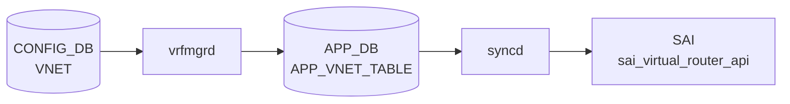

# VNET / VNET_ROUTE テーブル

## 概要

[VNET](../../reference/glossary.md#term-vnet) は [VXLAN](../../reference/glossary.md#term-vxlan) overlay 上の仮想ネットワークを [CONFIG_DB](../../reference/glossary.md#term-config_db) に定義するテーブル群。`VNET` が VNI と [VXLAN](../../reference/glossary.md#term-vxlan) tunnel の対応を持ち、`VNET_ROUTE` と `VNET_ROUTE_TUNNEL` が [VNET](../../reference/glossary.md#term-vnet) スコープの静的経路を表す[^1]。`schema.h` では [APPL_DB](../../reference/glossary.md#term-appl_db) 側の `VNET_TABLE` / `VNET_ROUTE_TABLE` / `VNET_ROUTE_TUNNEL_TABLE` と、[CONFIG_DB](../../reference/glossary.md#term-config_db) 側の `VNET_ROUTE` / `VNET_ROUTE_TUNNEL` 定数が定義されている[^2]。

<!-- cdb-mermaid -->
### データフロー (自動生成)



!!! note "凡例"
    CONFIG_DB から SAI までの典型経路を `docs/reference/config-db-orch-map.md` から機械生成したミニ図。詳細・例外は本ページ本文と対応表を参照。
<!-- /cdb-mermaid -->

## key 構造

```text
VNET|<name>
VNET_ROUTE|<vnet_name>|<prefix>
VNET_ROUTE_TUNNEL|<vnet_name>|<prefix>
```

`<vnet_name>` は `VNET.name` への leafref。`<prefix>` は IPv4 prefix。

## 主要フィールド

### VNET

| フィールド | 型 | 必須 | 説明 |
|-----------|----|------|------|
| `vxlan_tunnel` | leafref `VXLAN_TUNNEL.name` | yes | この [VNET](../../reference/glossary.md#term-vnet) が使う [VXLAN](../../reference/glossary.md#term-vxlan) tunnel |
| `vni` | `vnid_type` | yes | overlay header に入る VNI |
| `peer_list` | string | no | peer 情報 |
| `guid` | string | no | 任意 GUID |
| `scope` | string `default` | no | VNET scope |
| `advertise_prefix` | boolean | no | VNET route prefix の広告フラグ |
| `overlay_dmac` | mac-address | no | VNET ping 用 overlay destination MAC |
| `src_mac` | mac-address | no | VNET source MAC |

### VNET_ROUTE

| フィールド | 型 | 必須 | 説明 |
|-----------|----|------|------|
| `nexthop` | IPv4 address list | yes | nexthop IP 群 |
| `ifname` | string | yes | nexthop に対応する interface 名 |

### VNET_ROUTE_TUNNEL

| フィールド | 型 | 必須 | 説明 |
|-----------|----|------|------|
| `endpoint` | IPv4 address list | yes | tunnel endpoint / nexthop IP 群 |
| `mac_address` | MAC address list | no | encapsulated packet の inner destination MAC |
| `vni` | VNI list | no | encapsulated packet に使う VNI |
| `consistent_hashing_buckets` | uint16 | no | consistent hashing bucket 数 |
| `metric` | uint8 | no | route 分類用 metric。[YANG](../../reference/glossary.md#term-yang) コメント上、経路動作には影響しない |

## 制約

- `VNET.vxlan_tunnel` は `VXLAN_TUNNEL` への leafref。
- `VNET.vni` と `VNET_ROUTE.nexthop` / `ifname`、`VNET_ROUTE_TUNNEL.endpoint` は mandatory。
- `VNET_ROUTE` / `VNET_ROUTE_TUNNEL` の `vnet_name` は既存 `VNET` への leafref。
- [YANG](../../reference/glossary.md#term-yang) 上の prefix 型は IPv4 prefix に限定されている。

## 購読者

- `vxlanmgrd` / `vnetorch` 系: [CONFIG_DB](../../reference/glossary.md#term-config_db) の VNET 設定を [APPL_DB](../../reference/glossary.md#term-appl_db) `VNET_TABLE` 系へ投影し、[orchagent](../../reference/glossary.md#term-orchagent) 側で [SAI](../../reference/glossary.md#term-sai) overlay / route に反映する。
- `orchagent`: [APPL_DB](../../reference/glossary.md#term-appl_db) `VNET_TABLE` / `VNET_ROUTE_TABLE` / `VNET_ROUTE_TUNNEL_TABLE` を消費する。

## 関連 CONFIG_DB / YANG / CLI

- 関連 CONFIG_DB: `VXLAN_TUNNEL`、`VXLAN_TUNNEL_MAP`、`INTERFACE`、`VLAN_INTERFACE`、`VLAN_SUB_INTERFACE`
- 関連 CLI: `config vxlan`
- 関連 [YANG](../../reference/glossary.md#term-yang): `sonic-vnet`、`sonic-vxlan`

<!-- value-behavior -->
## 値依存挙動マトリクス

| フィールド | 値 | 実挙動 |
|-----------|-----|--------|
| `scope` | `"default"` | YANG pattern で唯一許可される値。デフォルト VRF スコープ |
| `scope` | その他 | YANG バリデーションで `"Invalid VRF name"` エラー (sonic-vnet.yang) |
| `advertise_prefix` | `true` | VNET ルートプレフィクスを BGP に広告 |
| `advertise_prefix` | `false` | 広告しない（デフォルト動作）|
| `vni` | 任意 VNI | VXLAN overlay header に使用する VNI。同一デバイス内で重複すると orchagent が後勝ちで上書き |
| `VNET_ROUTE_TUNNEL.metric` | uint8 | 経路選択に影響しない（YANG コメント: "not used for route selection, but for route classification"）|
| `VNET_ROUTE_TUNNEL.consistent_hashing_buckets` | uint16 | orchagent 未読取 (dead field)。設定しても ECMP バケット数に影響しない（`vnetorch.h` に登録なし） |
| `VNET_ROUTE.nexthop` | カンマ区切り IP リスト | ECMP nexthop として複数 IP 指定可（`ipv4-address-list` 型）|

<!-- /value-behavior -->

## 例外条件・特殊挙動 <!-- cdb-exceptions -->

<!-- evidence: sonic-swss/cfgmgr/vxlanmgr.cpp; sonic-buildimage/src/sonic-yang-models/yang-models/sonic-vnet.yang; sonic-swss/orchagent/vnetorch.cpp -->

- **`vrf_name` パターン (YANG)**: `pattern "default"` のみ許可。それ以外は YANG バリデーションで `"Invalid VRF name"` エラー[^exc2]。
- **`vxlan_tunnel` + `vni` 必須**: 両方が揃うまで `vxlanmgrd` はメッセージを破棄して再送待ち（"information is incomplete, just ignore this message"）[^exc1]。
- **VXLAN トンネル未作成**: 参照 `VXLAN_TUNNEL` がキャッシュに存在しない場合リトライ待ち[^exc1]。
- **[VRF](../../reference/glossary.md#term-vrf) 未 ready**: `isVrfStateOk()` が false の場合リトライ待ち[^exc1]。
- **MAC アドレス未設定**: ルータ MAC が未取得の場合もリトライ[^exc1]。
- **VxLAN デバイス作成失敗**: `SWSS_LOG_ERROR("Cannot create vxlan %s")` を記録して `false` を返す[^exc1]。
- **[orchagent](../../reference/glossary.md#term-orchagent) VR オブジェクト作成失敗**: `std::runtime_error` を throw し、呼び出し元でキャッチして `SWSS_LOG_ERROR` を記録[^exc3]。

[^exc1]: `sonic-swss/cfgmgr/vxlanmgr.cpp` <https://github.com/sonic-net/sonic-swss/blob/master/cfgmgr/vxlanmgr.cpp>
[^exc2]: `sonic-buildimage/src/sonic-yang-models/yang-models/sonic-vnet.yang` <https://github.com/sonic-net/sonic-buildimage/blob/master/src/sonic-yang-models/yang-models/sonic-vnet.yang>
[^exc3]: `sonic-swss/orchagent/vnetorch.cpp` <https://github.com/sonic-net/sonic-swss/blob/master/orchagent/vnetorch.cpp>

<!-- ref-triangle:start -->

## 関連リファレンス

- YANG: [`sonic-vnet`](../yang/sonic-vnet.md)
- CLI: [`config vxlan`](../cli/config-vxlan.md)

<!-- ref-triangle:end -->

## 引用元

[^1]: YANG 定義: `sonic-vnet.yang`. <https://github.com/sonic-net/sonic-buildimage/blob/9ea932ec2e18f35e58268ec2e4456b1d4afd65cd/src/sonic-yang-models/yang-models/sonic-vnet.yang>
[^2]: テーブル名定数: `schema.h`. <https://github.com/sonic-net/sonic-swss-common/blob/158de8d3463ff4b841653f6d57190bb142b80d9c/common/schema.h>

<!-- ops-hint -->
## 運用ヒント

### 典型値

- key 形式: `VNET|Vnet_<name>`。
- `vxlan_tunnel`: 紐付ける `VXLAN_TUNNEL` 名。
- `vni`: L3 VNI。
- `peer_list`: peer VNet 名（マルチサイト）。
- `scope`: `default` / `evpn`。

### よくある誤設定

- `vxlan_tunnel` が `VXLAN_TUNNEL` に未存在だと VNet が active にならない。
- `vni` を同一 device 内で重複させると [orchagent](../../reference/glossary.md#term-orchagent) が後勝ちで上書きし silent に壊れる。

### 確認コマンド

```bash
sonic-db-cli CONFIG_DB hgetall 'VNET|Vnet_1000'
show vnet brief
show vnet routes all
```
<!-- /ops-hint -->


<!-- runtime-trace -->
## CDB → 実コンテナ動作トレース

### 段階 1: Consumer 登録

- **orchagent / VNetOrch** (`sonic-swss/orchagent/vnetorch.cpp`): `VNET` テーブルを `SubscriberStateTable` で購読。

### 段階 2: CFG → APPL 翻訳

- VNetOrch が VNet 設定 (overlay / underlay VRF, VXLAN tunnel 参照) を解析。APP_DB への書き込みなし。

### 段階 3: APPL → SAI

- VNetOrch が `sai_virtual_router_api->create_virtual_router()` で VNet 用 VRF を作成し、VXLAN トンネルと関連付け。

### 段階 4: タイミング + 副作用

- VXLAN_TUNNEL テーブルと VRF テーブルが先に処理されている必要あり。
- 副作用: VNet 削除時は関連するルート・ネクストホップが全て削除される。

<!-- /runtime-trace -->
<!-- entry-points -->
## 書き込み入り口 (Direction A)

VNET テーブルへの書き込みが発生するコード経路を網羅的に調査した結果。

### CLI

  - 専用 CLI なし — `config load` または REST API 経由

### minigraph / sonic-cfggen

minigraph.py に VNET 生成なし

### REST / gNMI

REST/gNMI 書き込み経路なし (VNET は手動 JSON 投入が主経路)

### db_migrator

db_migrator.py での VNET マイグレーションなし

### ビルド時デフォルト (build-time default)

なし

### ハードコードデフォルト / ランタイム注入

なし

### 死活・デッドコード

なし
<!-- /entry-points -->

<!-- defaults -->
## コード由来の暗黙デフォルト

### VNET

| フィールド | YANG default | コード実装デフォルト | 出典 |
|-----------|-------------|---------------------|------|
| `vxlan_tunnel` | なし (mandatory) | 省略不可 | sonic-vnet.yang |
| `vni` | なし (mandatory) | 省略不可。orchagent 初期値は `0` だが実質無効 | vnetorch.cpp:442 |
| `peer_list` | なし | 空セット `{}` — peer なし動作 | vnetorch.cpp:440 |
| `guid` | なし | [orchagent](../../reference/glossary.md#term-orchagent) 未使用（dead field） | vnetorch.h |
| `scope` | なし | 空文字列 `""` — [YANG](../../reference/glossary.md#term-yang) を通れば常に `"default"` | vnetorch.cpp:444 |
| `advertise_prefix` | なし | `false` — prefix を BGP 広告しない | vnetorch.cpp:441 |
| `overlay_dmac` | なし | `00:00:00:00:00:00`（ゼロ MAC）— ping 機能無効 | macaddress.cpp:10-13, vnetorch.cpp:445 |
| `src_mac` | なし | [SAI](../../reference/glossary.md#term-sai)/プラットフォームデフォルト（スイッチ MAC） | vnetorch.cpp:449-454 |

### VNET_ROUTE

| フィールド | YANG default | コード実装デフォルト | 出典 |
|-----------|-------------|---------------------|------|
| `nexthop` | なし (mandatory) | 省略不可 | sonic-vnet.yang |
| `ifname` | なし (mandatory) | 省略不可 | sonic-vnet.yang |

### VNET_ROUTE_TUNNEL

| フィールド |YANG default | コード実装デフォルト | 出典 |
|-----------|-------------|---------------------|------|
| `endpoint` | なし (mandatory) | 省略不可 | sonic-vnet.yang |
| `mac_address` | なし | `00:00:00:00:00:00`（ゼロ MAC）per endpoint | vnetorch.cpp:3362-3383 |
| `vni` | なし | `0` — [VNET](../../reference/glossary.md#term-vnet) 本体の VNI で encapsulation | vnetorch.cpp:3362-3370 |
| `consistent_hashing_buckets` | なし | [orchagent](../../reference/glossary.md#term-orchagent) 未使用（dead field） | vnetorch.h |
| `metric` | なし | [orchagent](../../reference/glossary.md#term-orchagent) 未使用（dead field）。経路選択に影響しない | vnetorch.cpp:3196-3290 |

### 注記

- **`guid`・`consistent_hashing_buckets`・`metric` の dead field 性**: これら 3 フィールドは [orchagent](../../reference/glossary.md#term-orchagent) が parse しない（`vnet_request_description` / `vnet_route_description` に登録なし、または登録はあるが `handleTunnel()` 内で使用されない）。[CONFIG_DB](../../reference/glossary.md#term-config_db) に保存されるのみ。
- **`overlay_dmac` のゼロ MAC ガード**: [orchagent](../../reference/glossary.md#term-orchagent) は `!!overlay_dmac`（`operator bool`）でゼロ MAC を検出し、ゼロ MAC の場合は `setOverlayDMac()` を呼ばない（vnetorch.cpp:525）。
- **`src_mac` の SAI デフォルト委譲**: 省略時に [SAI](../../reference/glossary.md#term-sai) 属性を渡さないため、プラットフォームの [SAI](../../reference/glossary.md#term-sai) デフォルト（通常はスイッチシステム MAC）が [VRF](../../reference/glossary.md#term-vrf) の src_mac として使われる。
- **`vni` (VNET_ROUTE_TUNNEL) = 0**: VNI リストが空または 0 の場合、[VXLAN](../../reference/glossary.md#term-vxlan) orch 側でベース tunnel の VNI が encapsulation に使われる（`createNextHopTunnel()` に `vni=0` を渡す）。
<!-- /defaults -->

<!-- ordering -->
## 書込み順依存 (Phase B)

### VXLAN_TUNNEL が先行必須

`VxlanMgr::doVxlanCreateTask()` (`vxlanmgr.cpp:319-324`) は `m_vxlanTunnelCache.find(tunnel)` が end() を返すと `return false` で処理を保留し次ループで再試行する。orchagent 側 `VNetOrch::addOperation()` (`vnetorch.cpp:498-503`) も `vxlan_orch->isTunnelExists(tunnel)` が false なら `return false`。参照先 `VXLAN_TUNNEL|<name>` が存在しない限り VNET の SAI 登録は進まない。

### STATE_DB VRF ready 待ち（VxlanMgr 経路）

`doVxlanCreateTask()` L327-333: `isVrfStateOk(vnet_name)` (`vxlanmgr.cpp:738`) が `STATE_VRF_TABLE` に当該 VRF 名を見つけられない間は `return false` で保留。VNetOrch が [SAI](../../reference/glossary.md#term-sai) 上で VRF を作成し STATE_DB に書き込んだ後でなければカーネル VXLAN デバイス作成に進まない。orchdaemon の初期化順序（VNetOrch L276 → VRFOrch L283）により通常は自動解消されるが、起動直後の早期書き込みでは注意。

### ルータ MAC アドレスが取得済みであること

`doVxlanCreateTask()` L335-342: `getVxlanRouterMacAddress()` が false を返すと `return false` で保留。`DEVICE_METADATA|localhost:mac` が設定済みでなければ VXLAN デバイスは作成されない。通常は `sonic-cfggen` が起動時に書き込むため問題にならないが、テスト環境では注意が必要。

### VNET 本体 SET → VNET_ROUTE / VNET_ROUTE_TUNNEL SET

`VNetCfgRouteOrch::doVnetRouteTask()` / `doVnetTunnelRouteTask()` は受け取り次第即 APPL_DB に転記するため VNET 存在チェックなし。ただし orchagent 側 `VNetRouteOrch` が APPL_DB を消費する際に VNET の存在を前提とする。VNET_ROUTE を先に書いても失われないが、SAI 反映は VNET 作成完了後になる。

```
# 推奨書込み順 (SET)
SET VXLAN_TUNNEL|<tunnel_name>  src_ip=<vtep_ip>
SET VNET|<vnet_name>            vxlan_tunnel=<tunnel_name> vni=<l3_vni>
SET VNET_ROUTE|<vnet_name>|<prefix>          nexthop=<nh_ip> ifname=<ifname>
SET VNET_ROUTE_TUNNEL|<vnet_name>|<prefix>   endpoint=<vtep_ip>

# 推奨削除順 (DEL)
DEL VNET_ROUTE|<vnet_name>|<prefix>
DEL VNET_ROUTE_TUNNEL|<vnet_name>|<prefix>
DEL VNET|<vnet_name>
DEL VXLAN_TUNNEL|<tunnel_name>   # 他 VNET が残らない場合のみ
```

| 依存関係 | 方向 | 緩和策 |
|----------|------|--------|
| `VXLAN_TUNNEL` SET → `VNET` SET | 強制先行 | `return false` で自動保留・再試行 |
| STATE_DB VRF ready → `VNET` 処理 | 強制先行 | `return false` で自動保留・再試行 |
| `DEVICE_METADATA` mac 設定 → `VNET` 処理 | 強制先行 | `return false` で自動保留・再試行 |
| `VNET` SET → `VNET_ROUTE` SAI 反映 | 論理的先行 | APPL_DB への転記は即時、SAI 反映は遅延 |
| `VNET_ROUTE` DEL → `VNET` DEL | 推奨 | orchagent が内部で自動削除するが明示削除が安全 |

> **スキャン証跡**: `vxlanmgr.cpp:doVxlanCreateTask()` L287-376、`vnetorch.cpp:addOperation()` L434-558、`vnetorch.cpp:VNetCfgRouteOrch::doTask()` L3577-3611、`orchdaemon.cpp` L265-293, L350-354, L590-593 精読。
<!-- /ordering -->

<!-- cross-refs -->
## テーブル間参照 (Phase C)

### CONFIG_DB 内 leafref

| テーブル | フィールド / key 部位 | 参照先 | YANG leafref パス |
|---------|----------------------|--------|-------------------|
| `VNET` | `vxlan_tunnel` | `VXLAN_TUNNEL.name` | `sonic-vxlan/VXLAN_TUNNEL/VXLAN_TUNNEL_LIST/name` |
| `VNET_ROUTE` | `vnet_name`（key 第 1 部） | `VNET.name` | `sonic-vnet/VNET/VNET_LIST/name` |
| `VNET_ROUTE_TUNNEL` | `vnet_name`（key 第 1 部） | `VNET.name` | 同上 |

> 出典: `sonic-vnet.yang` L57-58, L120-121, L156-157

### APPL_DB 投影テーブル（書き込み先）

| APPL_DB テーブル | 書き込み元 | 消費者 |
|-----------------|-----------|--------|
| `APP_VNET_TABLE` | `vxlanmgrd`（前段処理後） | `VNetOrch` |
| `APP_VNET_RT_TABLE_NAME` | `VNetCfgRouteOrch` | `VNetRouteOrch` |
| `APP_VNET_RT_TUNNEL_TABLE_NAME` | `VNetCfgRouteOrch` | `VNetRouteOrch` |
| `APP_VNET_MONITOR_TABLE_NAME` | `VNetRouteOrch`（monitor 更新時） | `MonitorOrch` |

> 出典: `orchdaemon.cpp` L265-285、`vnetorch.cpp` L738-748

### STATE_DB 参照（読み取り）

| STATE_DB テーブル | 参照元 | 用途 |
|------------------|--------|------|
| `STATE_VRF_TABLE` | `vxlanmgrd:isVrfStateOk()` | VRF 作成完了待ち |
| `STATE_VNET_RT_TUNNEL_TABLE_NAME` | `VNetRouteOrch` | endpoint monitor 結果の取得 |
| `STATE_VNET_MONITOR_TABLE_NAME` | `MonitorOrch` | BFD/ping monitor 状態の購読 |

> 出典: `vxlanmgr.cpp` L738-752、`vnetorch.cpp` L742-748

### 関連 CONFIG_DB テーブル（ランタイム参照）

| テーブル | フィールド | 参照元 | 用途 |
|---------|-----------|--------|------|
| `DEVICE_METADATA\|localhost` | `mac` | `vxlanmgrd:getVxlanRouterMacAddress()` | VXLAN デバイス作成時のルータ MAC 取得 |
| `INTERFACE` / `VLAN_INTERFACE` | — | `VNetOrch:setIntf()/delIntf()` | VNET スコープのインタフェース登録 |

> 出典: `vxlanmgr.cpp` L784-806、`vnetorch.cpp` L392-428

### オーケストレータ連鎖図

```
CONFIG_DB: VNET_ROUTE / VNET_ROUTE_TUNNEL
  └─→ VNetCfgRouteOrch
        └─→ APPL_DB: APP_VNET_RT_TABLE / APP_VNET_RT_TUNNEL_TABLE
              └─→ VNetRouteOrch → SAI: route / nexthop / tunnel NHG

CONFIG_DB: VNET
  └─→ vxlanmgrd (VxlanMgr)
        ├─ 参照: STATE_VRF_TABLE, DEVICE_METADATA.mac
        └─→ APPL_DB: APP_VNET_TABLE
              └─→ VNetOrch
                    ├─ 参照: VxlanTunnelOrch.isTunnelExists()
                    ├─→ SAI: sai_virtual_router_api->create_virtual_router()
                    └─→ IntfsOrch (VNET スコープ IF 管理)
```

> **スキャン証跡**: `vnetorch.cpp` L40, L392-428, L497-503, L738-748、`vxlanmgr.cpp` L183-213, L738-806、`orchdaemon.cpp` L265-285, L350-358、`sonic-vnet.yang` L57-58, L120-157
<!-- /cross-refs -->

<!-- failure -->
## 失敗挙動 (Phase D)

<!-- evidence: sonic-swss/cfgmgr/vxlanmgr.cpp; sonic-swss/orchagent/vnetorch.cpp -->

`VNET` / `VNET_ROUTE` テーブルの処理失敗は `vxlanmgrd`（CONFIG_DB 前段）と `VNetOrch`（APPL_DB → SAI 後段）の二層で発生する。失敗時の共通パターンは `doTask()` が `false` を返してエントリを `m_toSync` に残し、次イテレーションで再試行することだが、**サイレントドロップ**（return true で永久 erase）が 1 ケース存在する点に注意。

### 主要失敗ケース

**フィールド不完全によるサイレントドロップ (失敗 #2)**: `vxlan_tunnel` または `vni` フィールドが欠落した VNET エントリは `SWSS_LOG_DEBUG("Vnet %s information is incomplete")` のみ記録して `return true`（`m_toSync` から erase）される (`vxlanmgr.cpp:308-317`)。エラーや WARN は出力されず、CLI や `show vnet` にも表示されない。**不完全な JSON 投入は永久に無視される**。

**VXLAN トンネル未作成によるサスペンド (失敗 #1)**: `m_vxlanTunnelCache` に参照先 VXLAN_TUNNEL が存在しない場合 `return false` で再キュー (`vxlanmgr.cpp:322-326`)。VXLAN_TUNNEL エントリが後から追加されれば自動的に処理再開する。

**VRF STATE_DB 未 ready (失敗 #3)**: `isVrfStateOk()` が `STATE_VRF_TABLE` で VRF 未登録を検出した場合 `return false` で再キュー (`vxlanmgr.cpp:328-332`)。起動シーケンス中に一時的に発生し、VRF 作成完了後に自然解消する。

**SAI VR 作成失敗 → runtime_error 捕捉 (失敗 #6)**: `sai_virtual_router_api->create_virtual_router()` が失敗すると `std::runtime_error` が throw され、`VNetOrch::addOperation()` の `catch` ブロックが `SWSS_LOG_ERROR("VNET add operation error for %s: error %s")` を記録して `return false` (`vnetorch.cpp:550-553`)。SAI リソース枯渇の場合は再試行しても継続失敗する。

**VNET 削除時のルート残存 (失敗 #9)**: `vrf_obj->getRouteCount() > 0` の場合 `SWSS_LOG_ERROR("VNET '%s': Routes are still present")` + `return false` (`vnetorch.cpp:584-585`)。VNET_ROUTE / VNET_ROUTE_TUNNEL を先に全削除しないと VNET 本体の削除が永続ブロックされる（強制削除順序制約）。

**NextHop group 上限超過 (失敗 #13)**: ASIC の NHG 上限に達した場合 `SWSS_LOG_ERROR("Reached maximum number of next hop groups.")` + `return false` (`vnetorch.cpp:773-774`)。新規 VNET_ROUTE_TUNNEL の ECMP グループが作成できず、該当ルートのみ再試行キューに残る。既存ルートへの影響はない。

### 失敗挙動サマリ

| # | 失敗条件 | ログレベル | 再試行 | 分類 |
|---|----------|-----------|--------|------|
| 1 | `VXLAN_TUNNEL` 未作成（vxlanmgrd） | DEBUG | ✅ 自動再試行 | 順序依存 suspend |
| 2 | `vxlan_tunnel`/`vni` フィールド欠落 | DEBUG | ❌ **永久 erase** | サイレントドロップ |
| 3 | VRF STATE_DB 未 ready | DEBUG | ✅ 自動再試行 | 起動シーケンス待ち |
| 4 | ルータ MAC 未設定 | DEBUG | ✅ 自動再試行 | 起動シーケンス待ち |
| 5 | netdevice 作成失敗 | ERROR | ✅ 自動再試行 | カーネル操作失敗 |
| 6 | SAI VR 作成失敗 | ERROR | ✅ 自動再試行 | SAI エラー |
| 7 | VXLAN tunnel map 作成失敗 | ERROR | ✅ 自動再試行 | SAI リソース |
| 8 | orchagent 側 tunnel 未存在 | WARN | ✅ 自動再試行 | 順序依存 suspend |
| 9 | 削除時にルートが残存 | ERROR | ✅ 再試行（先に Route 削除要） | 削除順序依存 |
| 10 | 削除時 tunnel map 解除失敗 | ERROR | ✅ 自動再試行 | SAI エラー |
| 11 | VR 属性更新失敗 | ERROR | 呼び出し元依存 | SAI エラー |
| 12 | VNET_ROUTE SAI 失敗 | ERROR | ✅ 自動再試行 | SAI エラー |
| 13 | NextHop group 上限超過 | ERROR | ✅ 自動再試行（上限解消まで） | リソース枯渇 |

> **スキャン証跡**: `vxlanmgr.cpp:doVxlanCreateTask()` L287-376、`vxlanmgr.cpp:doVxlanDeleteTask()` L437-476、`vnetorch.cpp:VNetVrfObject::createObj()` L91-108、`vnetorch.cpp:VNetOrch::addOperation()` L489-558、`vnetorch.cpp:VNetOrch::delOperation()` L560-600、`vnetorch.cpp:addRoute()/delRoute()` L645-730、`vnetorch.cpp:createNextHopGroup()` L773-774; 詳細分析 `meta/_intermediate/cdb-flow/vnet-failure.md`
<!-- /failure -->

<!-- constants -->
## ハードコード定数 (Phase E)

`VNET` / `VNET_ROUTE` / `VNET_ROUTE_TUNNEL` テーブルの処理に直接影響する、CONFIG_DB エントリでは制御できないコード内固定値の一覧。

### vnetorch.h マクロ定数

| 定数 | 値 | 用途 | ソース |
|------|----|------|--------|
| `VNET_BITMAP_SIZE` | `32` | VNET bitmap 型の内部サイズ（bitmap モードのみ使用）| `vnetorch.h:20` |
| `VNET_TUNNEL_SIZE` | `40960` | tunnel エントリ上限（bitmap モード用）| `vnetorch.h:21` |
| `VNET_ROUTE_FULL_MASK_OFFSET_MAX` | `3000` | /32 ルートの bitmap オフセット最大値（bitmap モードのみ）| `vnetorch.h:22` |
| `VNET_NEIGHBOR_MAX` | `0xffff`（65535）| neighbor エントリ上限（bitmap モードのみ）| `vnetorch.h:23` |
| `VXLAN_ENCAP_TTL` | `128` | VXLAN encapsulation 時の outer IP TTL 固定値 | `vnetorch.h:24` |
| `VNET_BITMAP_RIF_MTU` | `9100` | bitmap モードで RIF 作成時に使用する MTU 固定値 | `vnetorch.h:25` |

### monitoring 種別文字列定数

`VNET_ROUTE_TUNNEL` の `monitoring` フィールドに指定可能な値はコード内でリテラル定数として定義されており、YANG では制約されていない。

| 定数 | 値 | 用途 | ソース |
|------|----|------|--------|
| `VNET_MONITORING_TYPE_CUSTOM` | `"custom"` | カスタム BFD/ping モニタリング（`MonitorOrch` 連携）| `vnetorch.h:27` |
| `VNET_MONITORING_TYPE_CUSTOM_BFD` | `"custom_bfd"` | BFD セッション直接管理モード | `vnetorch.h:28` |

`monitoring` フィールドがこれら 2 値以外の場合、orchagent は endpoint の BFD 状態チェックをスキップして常時 UP 扱いにする（`vnetorch.cpp:786`）。

### YANG 型固定値

| 定数 | 値 | 用途 | ソース |
|------|----|------|--------|
| `vnid_type` 有効範囲 | `1..16777215` | `VNET.vni` / `VNET_ROUTE_TUNNEL.vni` の YANG 型制約 | `sonic-types.yang.j2:321-328` |
| `scope` 有効値 | `"default"` のみ | `VNET.scope` の YANG `pattern` 制約。それ以外は `"Invalid VRF name"` エラー | `sonic-vnet.yang:84` |
| `guid` 最大長 | `255` 文字 | `VNET.guid` の YANG `length` 制約 | `sonic-vnet.yang:75-78` |

### APP_DB / STATE_DB テーブル名定数（schema.h）

CONFIG_DB の変更を消費するダウンストリーム側のテーブル名はコード定数で固定されており、ConfigDB フィールドでは変更できない。

| 定数 | 値 | ソース |
|------|----|--------|
| `APP_VNET_TABLE_NAME` | `"VNET_TABLE"` | `schema.h:81` |
| `APP_VNET_RT_TABLE_NAME` | `"VNET_ROUTE_TABLE"` | `schema.h:82` |
| `APP_VNET_RT_TUNNEL_TABLE_NAME` | `"VNET_ROUTE_TUNNEL_TABLE"` | `schema.h:83` |
| `APP_VNET_MONITOR_TABLE_NAME` | `"VNET_MONITOR_TABLE"` | `schema.h:133` |
| `STATE_VNET_RT_TUNNEL_TABLE_NAME` | `"VNET_ROUTE_TUNNEL_TABLE"` | `schema.h:495` |
| `STATE_VNET_MONITOR_TABLE_NAME` | `"VNET_MONITOR_TABLE"` | `schema.h:500` |
| `CFG_VNET_RT_TABLE_NAME` | `"VNET_ROUTE"` | `schema.h:369` |

> **スキャン証跡**: `sonic-swss/orchagent/vnetorch.h:20-28`（マクロ定数全件）、`sonic-swss/orchagent/vnetorch.cpp:513,773,786`（定数使用箇所）、`sonic-swss-common/common/schema.h:81-83,133,369,495,500`（テーブル名定数）、`sonic-buildimage/src/sonic-yang-models/yang-templates/sonic-types.yang.j2:321-328`（`vnid_type` 型定義）、`sonic-buildimage/src/sonic-yang-models/yang-models/sonic-vnet.yang:75-92`（scope/guid 制約）
<!-- /constants -->

<!-- side-effects -->
## 副次 DB 書込 (Phase F)

CONFIG_DB `VNET` / `VNET_ROUTE` / `VNET_ROUTE_TUNNEL` テーブルの変更に伴って `VNetOrch` / `VNetRouteOrch` が副次的に書き込む DB エントリを示す。

| 副次 DB | 書込有無 | 対象テーブル / 根拠 |
|---|---|---|
| STATE_DB | **あり** | `VNET_ROUTE_TUNNEL_TABLE` — トンネルルート active 化時に `active_endpoints` + `state` を書込 (`vnetorch.cpp:2572`) |
| STATE_DB | **あり** | `ADVERTISE_NETWORK_TABLE` — `advertise_prefix: true` かつルート active 化時に prefix を書込、BGP コンテナが広告経路として参照 (`vnetorch.cpp:2645`) |
| APP_DB | **あり** | `VNET_MONITOR_TABLE` — `monitoring` フィールド付き `VNET_ROUTE_TUNNEL` 追加時にモニタリングセッションを書込 (`vnetorch.cpp:2247`) |
| APP_DB | **あり** | `BFD_SESSION_TABLE` — `monitoring: bfd` / `ping` 指定時に `createBfdSession()` が BFD セッションを書込 (`vnetorch.cpp:2046-2115`) |
| ASIC_DB (SAI 経由) | **あり** | `sai_virtual_router_api->create_virtual_router()` によって VRF オブジェクトが ASIC_DB に間接書込。VNET 削除時には `remove_virtual_router()` + `gFlowCounterRouteOrch->onRemoveVR()` が呼ばれる (`vnetorch.cpp:91-108`, `345-362`) |
| COUNTERS_DB | なし | `vnetorch.cpp` 全体で COUNTERS_DB への書込コード 0 件 |
| FLEX_COUNTER_DB / LOGLEVEL_DB | なし | `vnetorch.cpp` 内に参照 0 件 |

### STATE_DB 書込の対応表

| 書込関数 | STATE_DB テーブル | 操作 | 用途 |
|---|---|---|---|
| `updateTunnelRouteStatus()` | `VNET_ROUTE_TUNNEL_TABLE` | `set(<vnet>\|<prefix>, active_endpoints, state)` | ECMP エンドポイント alive 状態の公開 |
| `addRouteAdvertisement()` | `ADVERTISE_NETWORK_TABLE` | `set(<prefix>, profile)` | BGP コンテナへの経路広告指示 |
| `removeRouteAdvertisement()` | `ADVERTISE_NETWORK_TABLE` | `del(<prefix>)` | 広告撤回 |

### 副次作用の連鎖

- `VNET_ROUTE_TUNNEL_TABLE` への書込は `monitoring` 有効時の BFD 状態変化 (`SUBJECT_TYPE_BFD_SESSION_STATE_CHANGE`) を `updateVnetTunnel()` で受けて行われる (`vnetorch.cpp:2654-2665`)。
- `advertise_prefix: true` かつトンネルルートが active 化すると `addRouteAdvertisement()` → `ADVERTISE_NETWORK_TABLE` 書込 → BGP コンテナが prefix を広告、という連鎖が発生する (`vnetorch.cpp:2590-2600`)。
- BFD セッション削除 (`removeBfdSession()`) は `bfd_session_producer_.del()` で `BFD_SESSION_TABLE` エントリを消し、BfdOrch 側のセッションが破棄される (`vnetorch.cpp:2117`)。

詳細スキャン手順と grep 結果は `meta/_intermediate/cdb-flow/vnet-side-effects.md` を参照。
<!-- /side-effects -->

<!-- pubsub -->
## 通信メカニズム (Phase G)

### Producer/Consumer ペア

CONFIG_DB の `VNET` / `VNET_ROUTE` / `VNET_ROUTE_TUNNEL` テーブルは `vxlanmgrd` (`VxlanMgr`) が直接購読し、`orchagent` の `VNetOrch` / `VNetRouteOrch` は APPL_DB 経由で消費する。

| 区間 | 方式 | チャンネル / パターン |
|------|------|----------------------|
| CONFIG_DB[VNET] → vxlanmgrd | `Orch::addConsumer()` による `Selectable` 登録、`select()` ループで受信 | `CFG_VNET_TABLE_NAME` キースペース通知 |
| CONFIG_DB[VXLAN_TUNNEL] → vxlanmgrd | 同上 | `CFG_VXLAN_TUNNEL_TABLE_NAME` キースペース通知 |
| vxlanmgrd → APPL_DB[VNET_TABLE] | `ProducerStateTable::set()` (`m_appVxlanTunnelTable` 等) | APPL_DB pub/sub チャンネル |
| APPL_DB[VNET_TABLE] → VNetOrch | `Orch2(db, APP_VNET_TABLE_NAME, ...)` → `ConsumerStateTable` で受信 | `__keyspace@1__:VNET_TABLE\|*` |
| APPL_DB[VNET_RT_TABLE / VNET_RT_TUNNEL_TABLE] → VNetRouteOrch | `Orch2(db, tableNames, ...)` → `ConsumerStateTable` | `__keyspace@1__:VNET_ROUTE_TABLE\|*` 他 |

### vxlanmgrd の Consumer ロール

`vxlanmgrd` (`cfgmgr/vxlanmgrd.cpp:46-53`) は起動時に以下 4 テーブルを購読する:

```
CFG_VNET_TABLE_NAME
CFG_VXLAN_TUNNEL_TABLE_NAME
CFG_VXLAN_TUNNEL_MAP_TABLE_NAME
CFG_VXLAN_EVPN_NVO_TABLE_NAME
```

`doVxlanCreateTask()` が `CFG_VNET_TABLE_NAME` SET イベントを受けて、`vxlan_tunnel` + `vni` の完備を確認してから APP_DB へ転記する。不完全なメッセージは `return true` (破棄)、依存オブジェクト未作成は `return false` (再キュー) で処理される (`vxlanmgr.cpp:307-342`)。

### orchagent の Consumer ロール

`orchdaemon.cpp:276` で `VNetOrch` が `APPL_DB` + `APP_VNET_TABLE_NAME` を渡して構築される。`Orch2` の `ConsumerStateTable` が APPL_DB の keyspace 変化を `Select::select()` ループで捕捉し、`addOperation()` / `delOperation()` を呼び出す。

`VNetRouteOrch` (`orchdaemon.cpp:265-269`) は `APP_VNET_RT_TABLE_NAME` と `APP_VNET_RT_TUNNEL_TABLE_NAME` の 2 テーブルを同一 `Orch2` インスタンスで購読し、`handler_map_` によって `handleRoutes()` / `handleTunnel()` にディスパッチする (`vnetorch.cpp:738-739`)。

### データフロー概要

```
operator / REST
  ↓ sonic-db-cli / config vxlan
  CONFIG_DB[VNET|<name>]  ← SET/DEL
        ↓ keyspace通知
vxlanmgrd (cfgmgr/vxlanmgr.cpp)
  doVxlanCreateTask():
    - vxlan_tunnel + vni 完備チェック (L307-313)
    - m_vxlanTunnelCache 存在チェック (L318-323)
    - isVrfStateOk() チェック (L328-333)
    - MAC アドレス取得 (L334-342)
    → (成功時) APPL_DB[VNET_TABLE|<name>] ProducerStateTable::set()
        ↓ ConsumerStateTable keyspace通知
orchagent / VNetOrch (orchagent/vnetorch.cpp L377)
  addOperation():
    - VxlanTunnelOrch::isTunnelExists() (L499-502)
    - createObject<VNetVrfObject>() → SAI create_virtual_router()
    → APPL_DB[VNET_TABLE] 状態反映完了
```

<!-- /pubsub -->

<!-- platform -->
## プラットフォーム / SAI Capability 差異 (Phase H)

### Ordered ECMP サポート — ASIC Capability 依存

`VNetRouteOrch` が `VNET_ROUTE_TUNNEL` の ECMP Next Hop Group を作成する際、`gSwitchOrch->checkOrderedEcmpEnable()` の SAI capability 問い合わせ結果に基づいて NHG type を決定する (`vnetorch.cpp:804`)。

| ASIC capability | NHG type | 動作 |
|----------------|---------|------|
| Ordered ECMP 対応かつ有効化 | `SAI_NEXT_HOP_GROUP_TYPE_DYNAMIC_ORDERED_ECMP` | endpoint の優先順序を [ASIC](../../reference/glossary.md#term-asic) が保持 |
| 非対応または無効 | `SAI_NEXT_HOP_GROUP_TYPE_ECMP` | 通常 ECMP (ラウンドロビン) |

`checkOrderedEcmpEnable()` は起動時に SAI switch attribute をクエリし、[ASIC](../../reference/glossary.md#term-asic) が非対応の場合は false を返す。このため非対応 [ASIC](../../reference/glossary.md#term-asic) で Ordered ECMP ビットが設定されることはなく、`create_next_hop_group()` 失敗は発生しない。

### ベンダー固有コードなし

`vnetorch.cpp` / `vxlanmgr.cpp` には `platform` 環境変数参照・ベンダー文字列判定 (`mellanox` / `broadcom` 等) が存在しない。VNET の [SAI](../../reference/glossary.md#term-sai) 操作 (`sai_virtual_router_api` / `sai_route_api` / `sai_next_hop_group_api`) は標準 [SAI](../../reference/glossary.md#term-sai) インタフェース経由で呼ばれ、[ASIC](../../reference/glossary.md#term-asic) 固有の最適化は [SAI](../../reference/glossary.md#term-sai) 実装層に委譲される。

### VNET_EXEC モード (VRF 固定)

`vnetorch.h` では `VNET_EXEC_VRF` と `VNET_EXEC_BRIDGE` の 2 モードが定義されているが、`orchdaemon.cpp:276` では常に `VNET_EXEC_VRF` が使用される。コミュニティ SONiC では BRIDGE モードは無効。

### VoQ / Multi-ASIC

VNET テーブル処理に VoQ / multi-ASIC 分岐は存在しない。VNET は単一 [ASIC](../../reference/glossary.md#term-asic) 構成を前提とした機能。

> **スキャン証跡**: `vnetorch.cpp:804,841,2778`（Ordered ECMP NHG type 分岐）、`vnetorch.h:63-67`（VNET_EXEC enum）、`orchdaemon.cpp:276`（VRF モード固定）、`vxlanmgr.cpp` 全体（ベンダー分岐 0 件確認）
<!-- /platform -->

<!-- glossary-links-injected: f94986e6b96c -->
