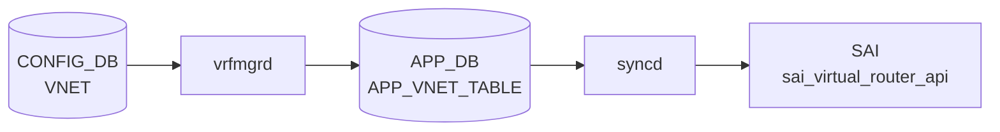

# VNET / VNET_ROUTE テーブル

## 概要

[VNET](../../reference/glossary.md#term-vnet) は [VXLAN](../../reference/glossary.md#term-vxlan) overlay 上の仮想ネットワークを [CONFIG_DB](../../reference/glossary.md#term-config_db) に定義するテーブル群。`VNET` が VNI と [VXLAN](../../reference/glossary.md#term-vxlan) tunnel の対応を持ち、`VNET_ROUTE` と `VNET_ROUTE_TUNNEL` が [VNET](../../reference/glossary.md#term-vnet) スコープの静的経路を表す[^1]。`schema.h` では [APPL_DB](../../reference/glossary.md#term-appl_db) 側の `VNET_TABLE` / `VNET_ROUTE_TABLE` / `VNET_ROUTE_TUNNEL_TABLE` と、[CONFIG_DB](../../reference/glossary.md#term-config_db) 側の `VNET_ROUTE` / `VNET_ROUTE_TUNNEL` 定数が定義されている[^2]。

<!-- cdb-mermaid -->
### データフロー (自動生成)



!!! note "凡例"
    CONFIG_DB から SAI までの典型経路を `docs/reference/config-db-orch-map.md` から機械生成したミニ図。詳細・例外は本ページ本文と対応表を参照。
<!-- /cdb-mermaid -->

## key 構造

```text
VNET|<name>
VNET_ROUTE|<vnet_name>|<prefix>
VNET_ROUTE_TUNNEL|<vnet_name>|<prefix>
```

`<vnet_name>` は `VNET.name` への leafref。`<prefix>` は IPv4 prefix。

## 主要フィールド

### VNET

| フィールド | 型 | 必須 | 説明 |
|-----------|----|------|------|
| `vxlan_tunnel` | leafref `VXLAN_TUNNEL.name` | yes | この [VNET](../../reference/glossary.md#term-vnet) が使う [VXLAN](../../reference/glossary.md#term-vxlan) tunnel |
| `vni` | `vnid_type` | yes | overlay header に入る VNI |
| `peer_list` | string | no | peer 情報 |
| `guid` | string | no | 任意 GUID |
| `scope` | string `default` | no | VNET scope |
| `advertise_prefix` | boolean | no | VNET route prefix の広告フラグ |
| `overlay_dmac` | mac-address | no | VNET ping 用 overlay destination MAC |
| `src_mac` | mac-address | no | VNET source MAC |

### VNET_ROUTE

| フィールド | 型 | 必須 | 説明 |
|-----------|----|------|------|
| `nexthop` | IPv4 address list | yes | nexthop IP 群 |
| `ifname` | string | yes | nexthop に対応する interface 名 |

### VNET_ROUTE_TUNNEL

| フィールド | 型 | 必須 | 説明 |
|-----------|----|------|------|
| `endpoint` | IPv4 address list | yes | tunnel endpoint / nexthop IP 群 |
| `mac_address` | MAC address list | no | encapsulated packet の inner destination MAC |
| `vni` | VNI list | no | encapsulated packet に使う VNI |
| `consistent_hashing_buckets` | uint16 | no | consistent hashing bucket 数 |
| `metric` | uint8 | no | route 分類用 metric。[YANG](../../reference/glossary.md#term-yang) コメント上、経路動作には影響しない |

## 制約

- `VNET.vxlan_tunnel` は `VXLAN_TUNNEL` への leafref。
- `VNET.vni` と `VNET_ROUTE.nexthop` / `ifname`、`VNET_ROUTE_TUNNEL.endpoint` は mandatory。
- `VNET_ROUTE` / `VNET_ROUTE_TUNNEL` の `vnet_name` は既存 `VNET` への leafref。
- [YANG](../../reference/glossary.md#term-yang) 上の prefix 型は IPv4 prefix に限定されている。

## 購読者

- `vxlanmgrd` / `vnetorch` 系: [CONFIG_DB](../../reference/glossary.md#term-config_db) の VNET 設定を [APPL_DB](../../reference/glossary.md#term-appl_db) `VNET_TABLE` 系へ投影し、[orchagent](../../reference/glossary.md#term-orchagent) 側で [SAI](../../reference/glossary.md#term-sai) overlay / route に反映する。
- `orchagent`: [APPL_DB](../../reference/glossary.md#term-appl_db) `VNET_TABLE` / `VNET_ROUTE_TABLE` / `VNET_ROUTE_TUNNEL_TABLE` を消費する。

## 関連 CONFIG_DB / YANG / CLI

- 関連 CONFIG_DB: `VXLAN_TUNNEL`、`VXLAN_TUNNEL_MAP`、`INTERFACE`、`VLAN_INTERFACE`、`VLAN_SUB_INTERFACE`
- 関連 CLI: `config vxlan`
- 関連 [YANG](../../reference/glossary.md#term-yang): `sonic-vnet`、`sonic-vxlan`

<!-- value-behavior -->
## 値依存挙動マトリクス

| フィールド | 値 | 実挙動 |
|-----------|-----|--------|
| `scope` | `"default"` | YANG pattern で唯一許可される値。デフォルト VRF スコープ |
| `scope` | その他 | YANG バリデーションで `"Invalid VRF name"` エラー (sonic-vnet.yang) |
| `advertise_prefix` | `true` | VNET ルートプレフィクスを BGP に広告 |
| `advertise_prefix` | `false` | 広告しない（デフォルト動作）|
| `vni` | 任意 VNI | VXLAN overlay header に使用する VNI。同一デバイス内で重複すると orchagent が後勝ちで上書き |
| `VNET_ROUTE_TUNNEL.metric` | uint8 | 経路選択に影響しない（YANG コメント: "not used for route selection, but for route classification"）|
| `VNET_ROUTE_TUNNEL.consistent_hashing_buckets` | uint16 | 複数 endpoint 時の ECMP consistent hashing バケット数を制御 |
| `VNET_ROUTE.nexthop` | カンマ区切り IP リスト | ECMP nexthop として複数 IP 指定可（`ipv4-address-list` 型）|

<!-- /value-behavior -->

## 例外条件・特殊挙動 <!-- cdb-exceptions -->

<!-- evidence: sonic-swss/cfgmgr/vxlanmgr.cpp; sonic-buildimage/src/sonic-yang-models/yang-models/sonic-vnet.yang; sonic-swss/orchagent/vnetorch.cpp -->

- **`vrf_name` パターン (YANG)**: `pattern "default"` のみ許可。それ以外は YANG バリデーションで `"Invalid VRF name"` エラー[^exc2]。
- **`vxlan_tunnel` + `vni` 必須**: 両方が揃うまで `vxlanmgrd` はメッセージを破棄して再送待ち（"information is incomplete, just ignore this message"）[^exc1]。
- **VXLAN トンネル未作成**: 参照 `VXLAN_TUNNEL` がキャッシュに存在しない場合リトライ待ち[^exc1]。
- **[VRF](../../reference/glossary.md#term-vrf) 未 ready**: `isVrfStateOk()` が false の場合リトライ待ち[^exc1]。
- **MAC アドレス未設定**: ルータ MAC が未取得の場合もリトライ[^exc1]。
- **VxLAN デバイス作成失敗**: `SWSS_LOG_ERROR("Cannot create vxlan %s")` を記録して `false` を返す[^exc1]。
- **[orchagent](../../reference/glossary.md#term-orchagent) VR オブジェクト作成失敗**: `std::runtime_error` を throw し、呼び出し元でキャッチして `SWSS_LOG_ERROR` を記録[^exc3]。

[^exc1]: `sonic-swss/cfgmgr/vxlanmgr.cpp` <https://github.com/sonic-net/sonic-swss/blob/master/cfgmgr/vxlanmgr.cpp>
[^exc2]: `sonic-buildimage/src/sonic-yang-models/yang-models/sonic-vnet.yang` <https://github.com/sonic-net/sonic-buildimage/blob/master/src/sonic-yang-models/yang-models/sonic-vnet.yang>
[^exc3]: `sonic-swss/orchagent/vnetorch.cpp` <https://github.com/sonic-net/sonic-swss/blob/master/orchagent/vnetorch.cpp>

<!-- ref-triangle:start -->

## 関連リファレンス

- YANG: [`sonic-vnet`](../yang/sonic-vnet.md)
- CLI: [`config vxlan`](../cli/config-vxlan.md)

<!-- ref-triangle:end -->

## 引用元

[^1]: YANG 定義: `sonic-vnet.yang`. <https://github.com/sonic-net/sonic-buildimage/blob/9ea932ec2e18f35e58268ec2e4456b1d4afd65cd/src/sonic-yang-models/yang-models/sonic-vnet.yang>
[^2]: テーブル名定数: `schema.h`. <https://github.com/sonic-net/sonic-swss-common/blob/158de8d3463ff4b841653f6d57190bb142b80d9c/common/schema.h>

<!-- ops-hint -->
## 運用ヒント

### 典型値

- key 形式: `VNET|Vnet_<name>`。
- `vxlan_tunnel`: 紐付ける `VXLAN_TUNNEL` 名。
- `vni`: L3 VNI。
- `peer_list`: peer VNet 名（マルチサイト）。
- `scope`: `default` / `evpn`。

### よくある誤設定

- `vxlan_tunnel` が `VXLAN_TUNNEL` に未存在だと VNet が active にならない。
- `vni` を同一 device 内で重複させると [orchagent](../../reference/glossary.md#term-orchagent) が後勝ちで上書きし silent に壊れる。

### 確認コマンド

```bash
sonic-db-cli CONFIG_DB hgetall 'VNET|Vnet_1000'
show vnet brief
show vnet routes all
```
<!-- /ops-hint -->


<!-- runtime-trace -->
## CDB → 実コンテナ動作トレース

### 段階 1: Consumer 登録

- **orchagent / VNetOrch** (`sonic-swss/orchagent/vnetorch.cpp`): `VNET` テーブルを `SubscriberStateTable` で購読。

### 段階 2: CFG → APPL 翻訳

- VNetOrch が VNet 設定 (overlay / underlay VRF, VXLAN tunnel 参照) を解析。APP_DB への書き込みなし。

### 段階 3: APPL → SAI

- VNetOrch が `sai_virtual_router_api->create_virtual_router()` で VNet 用 VRF を作成し、VXLAN トンネルと関連付け。

### 段階 4: タイミング + 副作用

- VXLAN_TUNNEL テーブルと VRF テーブルが先に処理されている必要あり。
- 副作用: VNet 削除時は関連するルート・ネクストホップが全て削除される。

<!-- /runtime-trace -->
<!-- entry-points -->
## 書き込み入り口 (Direction A)

VNET テーブルへの書き込みが発生するコード経路を網羅的に調査した結果。

### CLI

  - 専用 CLI なし — `config load` または REST API 経由

### minigraph / sonic-cfggen

minigraph.py に VNET 生成なし

### REST / gNMI

REST/gNMI 書き込み経路なし (VNET は手動 JSON 投入が主経路)

### db_migrator

db_migrator.py での VNET マイグレーションなし

### ビルド時デフォルト (build-time default)

なし

### ハードコードデフォルト / ランタイム注入

なし

### 死活・デッドコード

なし
<!-- /entry-points -->

<!-- defaults -->
## コード由来の暗黙デフォルト

### VNET

| フィールド | YANG default | コード実装デフォルト | 出典 |
|-----------|-------------|---------------------|------|
| `vxlan_tunnel` | なし (mandatory) | 省略不可 | sonic-vnet.yang |
| `vni` | なし (mandatory) | 省略不可。orchagent 初期値は `0` だが実質無効 | vnetorch.cpp:442 |
| `peer_list` | なし | 空セット `{}` — peer なし動作 | vnetorch.cpp:440 |
| `guid` | なし | [orchagent](../../reference/glossary.md#term-orchagent) 未使用（dead field） | vnetorch.h |
| `scope` | なし | 空文字列 `""` — [YANG](../../reference/glossary.md#term-yang) を通れば常に `"default"` | vnetorch.cpp:444 |
| `advertise_prefix` | なし | `false` — prefix を BGP 広告しない | vnetorch.cpp:441 |
| `overlay_dmac` | なし | `00:00:00:00:00:00`（ゼロ MAC）— ping 機能無効 | macaddress.cpp:10-13, vnetorch.cpp:445 |
| `src_mac` | なし | [SAI](../../reference/glossary.md#term-sai)/プラットフォームデフォルト（スイッチ MAC） | vnetorch.cpp:449-454 |

### VNET_ROUTE

| フィールド | YANG default | コード実装デフォルト | 出典 |
|-----------|-------------|---------------------|------|
| `nexthop` | なし (mandatory) | 省略不可 | sonic-vnet.yang |
| `ifname` | なし (mandatory) | 省略不可 | sonic-vnet.yang |

### VNET_ROUTE_TUNNEL

| フィールド |YANG default | コード実装デフォルト | 出典 |
|-----------|-------------|---------------------|------|
| `endpoint` | なし (mandatory) | 省略不可 | sonic-vnet.yang |
| `mac_address` | なし | `00:00:00:00:00:00`（ゼロ MAC）per endpoint | vnetorch.cpp:3362-3383 |
| `vni` | なし | `0` — [VNET](../../reference/glossary.md#term-vnet) 本体の VNI で encapsulation | vnetorch.cpp:3362-3370 |
| `consistent_hashing_buckets` | なし | [orchagent](../../reference/glossary.md#term-orchagent) 未使用（dead field） | vnetorch.h |
| `metric` | なし | [orchagent](../../reference/glossary.md#term-orchagent) 未使用（dead field）。経路選択に影響しない | vnetorch.cpp:3196-3290 |

### 注記

- **`guid`・`consistent_hashing_buckets`・`metric` の dead field 性**: これら 3 フィールドは [orchagent](../../reference/glossary.md#term-orchagent) が parse しない（`vnet_request_description` / `vnet_route_description` に登録なし、または登録はあるが `handleTunnel()` 内で使用されない）。[CONFIG_DB](../../reference/glossary.md#term-config_db) に保存されるのみ。
- **`overlay_dmac` のゼロ MAC ガード**: [orchagent](../../reference/glossary.md#term-orchagent) は `!!overlay_dmac`（`operator bool`）でゼロ MAC を検出し、ゼロ MAC の場合は `setOverlayDMac()` を呼ばない（vnetorch.cpp:525）。
- **`src_mac` の SAI デフォルト委譲**: 省略時に [SAI](../../reference/glossary.md#term-sai) 属性を渡さないため、プラットフォームの [SAI](../../reference/glossary.md#term-sai) デフォルト（通常はスイッチシステム MAC）が [VRF](../../reference/glossary.md#term-vrf) の src_mac として使われる。
- **`vni` (VNET_ROUTE_TUNNEL) = 0**: VNI リストが空または 0 の場合、[VXLAN](../../reference/glossary.md#term-vxlan) orch 側でベース tunnel の VNI が encapsulation に使われる（`createNextHopTunnel()` に `vni=0` を渡す）。
<!-- /defaults -->

<!-- glossary-links-injected: f94986e6b96c -->
