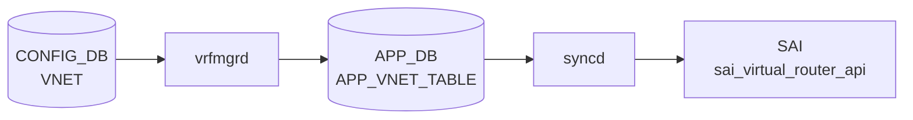

# VNET / VNET_ROUTE テーブル

## 概要

VNET は VXLAN overlay 上の仮想ネットワークを CONFIG_DB に定義するテーブル群。`VNET` が VNI と VXLAN tunnel の対応を持ち、`VNET_ROUTE` と `VNET_ROUTE_TUNNEL` が VNET スコープの静的経路を表す[^1]。`schema.h` では APPL_DB 側の `VNET_TABLE` / `VNET_ROUTE_TABLE` / `VNET_ROUTE_TUNNEL_TABLE` と、CONFIG_DB 側の `VNET_ROUTE` / `VNET_ROUTE_TUNNEL` 定数が定義されている[^2]。

<!-- cdb-mermaid -->
### データフロー (自動生成)



!!! note "凡例"
    CONFIG_DB から SAI までの典型経路を `docs/reference/config-db-orch-map.md` から機械生成したミニ図。詳細・例外は本ページ本文と対応表を参照。
<!-- /cdb-mermaid -->

## key 構造

```text
VNET|<name>
VNET_ROUTE|<vnet_name>|<prefix>
VNET_ROUTE_TUNNEL|<vnet_name>|<prefix>
```

`<vnet_name>` は `VNET.name` への leafref。`<prefix>` は IPv4 prefix。

## 主要フィールド

### VNET

| フィールド | 型 | 必須 | 説明 |
|-----------|----|------|------|
| `vxlan_tunnel` | leafref `VXLAN_TUNNEL.name` | yes | この VNET が使う VXLAN tunnel |
| `vni` | `vnid_type` | yes | overlay header に入る VNI |
| `peer_list` | string | no | peer 情報 |
| `guid` | string | no | 任意 GUID |
| `scope` | string `default` | no | VNET scope |
| `advertise_prefix` | boolean | no | VNET route prefix の広告フラグ |
| `overlay_dmac` | mac-address | no | VNET ping 用 overlay destination MAC |
| `src_mac` | mac-address | no | VNET source MAC |

### VNET_ROUTE

| フィールド | 型 | 必須 | 説明 |
|-----------|----|------|------|
| `nexthop` | IPv4 address list | yes | nexthop IP 群 |
| `ifname` | string | yes | nexthop に対応する interface 名 |

### VNET_ROUTE_TUNNEL

| フィールド | 型 | 必須 | 説明 |
|-----------|----|------|------|
| `endpoint` | IPv4 address list | yes | tunnel endpoint / nexthop IP 群 |
| `mac_address` | MAC address list | no | encapsulated packet の inner destination MAC |
| `vni` | VNI list | no | encapsulated packet に使う VNI |
| `consistent_hashing_buckets` | uint16 | no | consistent hashing bucket 数 |
| `metric` | uint8 | no | route 分類用 metric。YANG コメント上、経路動作には影響しない |

## 制約

- `VNET.vxlan_tunnel` は `VXLAN_TUNNEL` への leafref。
- `VNET.vni` と `VNET_ROUTE.nexthop` / `ifname`、`VNET_ROUTE_TUNNEL.endpoint` は mandatory。
- `VNET_ROUTE` / `VNET_ROUTE_TUNNEL` の `vnet_name` は既存 `VNET` への leafref。
- YANG 上の prefix 型は IPv4 prefix に限定されている。

## 購読者

- `vxlanmgrd` / `vnetorch` 系: CONFIG_DB の VNET 設定を APPL_DB `VNET_TABLE` 系へ投影し、orchagent 側で SAI overlay / route に反映する。
- `orchagent`: APPL_DB `VNET_TABLE` / `VNET_ROUTE_TABLE` / `VNET_ROUTE_TUNNEL_TABLE` を消費する。

## 関連 CONFIG_DB / YANG / CLI

- 関連 CONFIG_DB: `VXLAN_TUNNEL`、`VXLAN_TUNNEL_MAP`、`INTERFACE`、`VLAN_INTERFACE`、`VLAN_SUB_INTERFACE`
- 関連 CLI: `config vxlan`
- 関連 YANG: `sonic-vnet`、`sonic-vxlan`

<!-- ref-triangle:start -->

## 関連リファレンス

- YANG: [`sonic-vnet`](../yang/sonic-vnet.md)
- CLI: [`config vxlan`](../cli/config-vxlan.md)

<!-- ref-triangle:end -->

## 引用元

[^1]: YANG 定義: `sonic-vnet.yang`. <https://github.com/sonic-net/sonic-buildimage/blob/9ea932ec2e18f35e58268ec2e4456b1d4afd65cd/src/sonic-yang-models/yang-models/sonic-vnet.yang>
[^2]: テーブル名定数: `schema.h`. <https://github.com/sonic-net/sonic-swss-common/blob/158de8d3463ff4b841653f6d57190bb142b80d9c/common/schema.h>

<!-- ops-hint -->
## 運用ヒント

### 典型値

- key 形式: `VNET|Vnet_<name>`。
- `vxlan_tunnel`: 紐付ける `VXLAN_TUNNEL` 名。
- `vni`: L3 VNI。
- `peer_list`: peer VNet 名（マルチサイト）。
- `scope`: `default` / `evpn`。

### よくある誤設定

- `vxlan_tunnel` が `VXLAN_TUNNEL` に未存在だと VNet が active にならない。
- `vni` を同一 device 内で重複させると orchagent が後勝ちで上書きし silent に壊れる。

### 確認コマンド

```bash
sonic-db-cli CONFIG_DB hgetall 'VNET|Vnet_1000'
show vnet brief
show vnet routes all
```
<!-- /ops-hint -->
