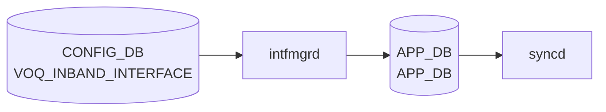

# VOQ_INBAND_INTERFACE テーブル

## 概要

`VOQ_INBAND_INTERFACE` テーブルは [VOQ](../../reference/glossary.md#term-voq) chassis におけるラインカード間のインバンド通信用論理インターフェース (`Ethernet-IB<n>`) を [CONFIG_DB](../../reference/glossary.md#term-config_db) に定義する[^1]。[BGP](../../reference/glossary.md#term-bgp) internal-neighbor などのコントロールプレーン通信に使われる。テーブルは 2 段構造:

- `VOQ_INBAND_INTERFACE_LIST` (key: name)
- `VOQ_INBAND_INTERFACE_IPPREFIX_LIST` (key: name, ip-prefix)

<!-- cdb-mermaid -->
### データフロー (自動生成)



!!! note "凡例"
    CONFIG_DB から SAI までの典型経路を `docs/reference/config-db-orch-map.md` から機械生成したミニ図。詳細・例外は本ページ本文と対応表を参照。
<!-- /cdb-mermaid -->

## key 構造

```text
VOQ_INBAND_INTERFACE|<name>
VOQ_INBAND_INTERFACE|<name>|<ip-prefix>
```

## VOQ_INBAND_INTERFACE_LIST フィールド

| フィールド | 型 | デフォルト | 説明 |
|-----------|----|-----------|------|
| `name` (key) | string パターン `Ethernet-IB[0-9]+` | — | インバンド IF 名 |
| `inband_type` | string パターン `port\|Port` | `port` | インバンドタイプ |

## VOQ_INBAND_INTERFACE_IPPREFIX_LIST フィールド

| フィールド | 型 | 説明 |
|-----------|----|------|
| `name` (key) | leafref → `VOQ_INBAND_INTERFACE_LIST.name` | 親インターフェース |
| `ip-prefix` (key) | `sonic-ip-prefix` | アサイン IP プレフィックス |

<!-- defaults -->
## フィールドデフォルト一覧

### VOQ_INBAND_INTERFACE_LIST

| フィールド | デフォルト | 由来 |
|-----------|-----------|------|
| `inband_type` | `"port"` | YANG `default "port"` ([sonic-voq-inband-interface.yang](https://github.com/sonic-net/sonic-buildimage/blob/master/src/sonic-yang-models/yang-models/sonic-voq-inband-interface.yang)) |

### SYSTEM_PORT_LIST

SYSTEM_PORT の全フィールドはデフォルトなし。`minigraph.py` が minigraph XML の `<SystemPorts>` セクションまたは `InterfaceMetadata` から全量生成して CONFIG_DB に投入する。`system_port_id` は投入時にソート順で `1` から自動採番される (`parse_chassis_deviceinfo_intf_metadata()`)。

<!-- /defaults -->

## 制約

- `name` は `Ethernet-IB<数値>` パターン
- `inband_type` は `port` または `Port`

## 購読者

- `intfmgrd` / `intfsyncd` ([sonic-swss](../../reference/glossary.md#term-sonic-swss))
- `bgpcfgd` / `bgpd` — [BGP](../../reference/glossary.md#term-bgp) internal neighbor のソース interface として使う場合

## 関連 CONFIG_DB / YANG / CLI

- 関連 [CONFIG_DB](../../reference/glossary.md#term-config_db): `SYSTEM_PORT`、`BGP_INTERNAL_NEIGHBOR`、`BGP_VOQ_CHASSIS_NEIGHBOR`、`CHASSIS_MODULE`
- 関連 [YANG](../../reference/glossary.md#term-yang): `sonic-voq-inband-interface`、`sonic-bgp-internal-neighbor`、`sonic-bgp-voq-chassis-neighbor`
- 関連 CLI: `config interface`

<!-- value-behavior -->
## 値依存挙動マトリクス

本テーブルは enum フィールドが少なく、フィールドはほぼ string パターンで制御される。

| フィールド | 値 | 実挙動 |
|-----------|-----|--------|
| `inband_type` | `port` | インバンドタイプを port に設定（デフォルト、YANG default "port"）|
| `inband_type` | `Port` | `port` と同義。YANG pattern "port\|Port" で両方許可 |
| `inband_type` | 省略 | YANG default `"port"` が補完される |
| `inband_type` | その他 | YANG pattern 違反で reject |
| `name` | `Ethernet-IB<n>` | 有効な VOQ インバンド IF 名 |
| `name` | その他 | YANG `pattern "Ethernet-IB[0-9]+"` 違反で reject |

<!-- /value-behavior -->

## 例外条件・特殊挙動 <!-- cdb-exceptions -->

<!-- evidence: sonic-buildimage/src/sonic-yang-models/yang-models/sonic-voq-inband-interface.yang; sonic-swss/cfgmgr/intfmgr.cpp -->

- **名前パターン (YANG)**: `pattern "Ethernet-IB[0-9]+"` — パターン違反は YANG バリデーションで reject される[^exc1]。
- **`inband_type` パターン (YANG)**: `pattern "port|Port"` のみ許可[^exc1]。
- **IP プレフィクス leafref (YANG)**: `VOQ_INBAND_INTERFACE_IPPREFIX_LIST` の `name` は `VOQ_INBAND_INTERFACE_LIST/name` への leafref — 対応エントリが存在しない場合 YANG バリデーションで reject[^exc1]。
- **デフォルト補完**: `inband_type` 省略時は YANG `default "port"` が補完される[^exc1]。
- **インタフェース未 ready**: 親インタフェースが [STATE_DB](../../reference/glossary.md#term-state_db) に未登録の場合 `intfmgrd` はリトライ待ちとなる（通常の `VLAN_INTERFACE` と同動作）[^exc2]。

[^exc1]: `sonic-buildimage/src/sonic-yang-models/yang-models/sonic-voq-inband-interface.yang` <https://github.com/sonic-net/sonic-buildimage/blob/master/src/sonic-yang-models/yang-models/sonic-voq-inband-interface.yang>
[^exc2]: `sonic-swss/cfgmgr/intfmgr.cpp` <https://github.com/sonic-net/sonic-swss/blob/master/cfgmgr/intfmgr.cpp>

<!-- ref-triangle:start -->

## 関連リファレンス

- [YANG](../../reference/glossary.md#term-yang): `sonic-voq-inband-interface`
- CLI: [`config interface`](../cli/config-interface.md)

<!-- ref-triangle:end -->

## 引用元

[^1]: [YANG](../../reference/glossary.md#term-yang) 定義: `sonic-voq-inband-interface.yang`. <https://github.com/sonic-net/sonic-buildimage/blob/9ea932ec2e18f35e58268ec2e4456b1d4afd65cd/src/sonic-yang-models/yang-models/sonic-voq-inband-interface.yang>

## 関連ページ
- [CONFIG_DB: INTERFACE](interface.md)

<!-- ops-hint -->
## 運用ヒント

### 典型値

- key 形式: `VOQ_INBAND_INTERFACE|<name>` (例 `VOQ_INBAND_INTERFACE|Ethernet-IB0`)、`VOQ_INBAND_INTERFACE|<name>|<ip-prefix>`。
- `inband_type=port` が一般的。

### よくある誤設定

- `name` が `Ethernet-IB<n>` パターンに一致しない命名で YANG validation エラー。
- [VOQ](../../reference/glossary.md#term-voq) chassis 以外の単体スイッチで設定して効果が無い ([VOQ](../../reference/glossary.md#term-voq) 専用)。

### 確認コマンド

```bash
sonic-db-cli CONFIG_DB keys 'VOQ_INBAND_INTERFACE|*'
show interfaces status Ethernet-IB0
show ip interface | grep Ethernet-IB
```
<!-- /ops-hint -->


<!-- runtime-trace -->
## CDB → 実コンテナ動作トレース

### 段階 1: Consumer 登録

- **orchagent / VoqOrch** (`sonic-swss/orchagent/voqorch.cpp`): `VOQ_INBAND_INTERFACE` テーブルを購読 (VOQ chassis 環境専用)。

### 段階 2: CFG → APPL 翻訳

- VoqOrch が inband インタフェース (asic-asic 通信用) を APP_DB `INTF_TABLE` に書き込む。

### 段階 3: APPL → SAI

- IntfsOrch が SAI で inband ポートの RIF を作成し、VOQ 配送に使用するルートを設定。

### 段階 4: タイミング + 副作用

- VOQ chassis 環境でのみ有効。non-VOQ 環境では orchagent が処理をスキップ。

<!-- /runtime-trace -->
<!-- entry-points -->
## 書き込み入り口 (Direction A)

VOQ_INBAND_INTERFACE テーブルへの書き込みが発生するコード経路を網羅的に調査した結果。

### CLI

  - 専用 CLI なし

### minigraph / sonic-cfggen

**minigraph.py** が VOQ_INBAND_INTERFACE を生成し投入 (sonic-buildimage/src/sonic-config-engine/minigraph.py)

### REST / gNMI

REST/gNMI 書き込み経路なし

### db_migrator

db_migrator.py での VOQ_INBAND_INTERFACE マイグレーションなし

### ビルド時デフォルト (build-time default)

なし

### ハードコードデフォルト / ランタイム注入

**sonic-bgpcfgd** `main.py` が VOQ_INBAND_INTERFACE を監視し BGP ルート配布に使用 (sonic-buildimage/src/sonic-bgpcfgd/bgpcfgd/main.py)

### 死活・デッドコード

なし
<!-- /entry-points -->

<!-- ordering -->
## 書込み順依存 (Phase B)

> 調査対象: `sonic-swss/cfgmgr/intfmgr.cpp`
> 調査日: 2026-05-16

### 他テーブル先行必須

`VOQ_INBAND_INTERFACE` は `intfmgrd` が購読する（`intfmgrd.cpp:34`）が、単一キー SET の場合は `doIntfGeneralTask()` を呼ばず**直接 APP_DB へ relay** する（`intfmgr.cpp:1195-1204`）。

```cpp
// intfmgr.cpp:1195-1203
if((table_name == CFG_VOQ_INBAND_INTERFACE_TABLE_NAME) &&
        (op == SET_COMMAND))
{
    //No further processing needed. Just relay to orchagent
    m_appIntfTableProducer.set(keys[0], data);
    m_stateIntfTable.hset(keys[0], "vrf", "");
    ...
}
```

| 先行テーブル / 条件 | 依存の内容 | コード根拠 |
|------------------|-----------|-----------|
| VOQ 環境が有効 (`switch_type == "voq"`) | `VoqOrch` が起動していること。non-VOQ 環境では orchagent がスキップ | `sonic-swss/orchagent/voqorch.cpp` |
| IP プレフィクスロウは属性ロウの STATE_DB 書込み後 | `isIntfCreated()` が false → IP プレフィクスロウをスキップ（2-key パスは `doIntfAddrTask` 経由） | `intfmgr.cpp:1115` |

### 主要ポイント

- 単一キー SET（属性ロウ）は `isIntfStateOk()` 検査をバイパスし、即 APP_DB に relay される — PORT / LAG / VLAN の STATE_DB ready を待たない
- IP プレフィクスロウ（2-key）は通常の `doIntfAddrTask()` パスを通るため `isIntfCreated()` が必要
- `VoqOrch` が APP_DB の `INTF_TABLE` を購読し、inband ポートの SAI RIF を作成する

詳細調査ノートは `meta/_intermediate/cdb-flow/voq-inband-interface-ordering.md` 参照。

<!-- /ordering -->

<!-- cross-refs -->
## 暗黙参照テーブル (Phase C)

> 調査対象: `sonic-swss/cfgmgr/intfmgr.cpp`, `sonic-swss/cfgmgr/nbrmgr.cpp`, `sonic-swss/orchagent/intfsorch.cpp`, `sonic-swss/orchagent/portsorch.cpp`, `sonic-buildimage/src/sonic-yang-models/yang-models/sonic-voq-inband-interface.yang`
> 調査日: 2026-05-18
> 調査証跡: `meta/_intermediate/cdb-flow/voq-inband-interface-cross-refs.md`

YANG leafref を超えた他テーブル・他 DB・プロセスへの実装上の依存関係。

| # | 参照先 | DB / 場所 | 方向 | 依存内容 | 根拠コード |
|---|--------|-----------|------|---------|-----------|
| 1 | `DEVICE_METADATA.localhost.switch_type` | CONFIG_DB | READ | `switch_type != "voq"` のとき VoQ 系処理全体がスキップされ VOQ_INBAND_INTERFACE は事実上無効 | `intfmgr.cpp:71-75`, `main.cpp` |
| 2 | `APP_INTF_TABLE` | APPL_DB | WRITE | 単一キー SET は `doIntfGeneralTask()` をバイパスし `m_appIntfTableProducer.set()` で即時 relay | `intfmgr.cpp:1198-1199` |
| 3 | `STATE_INTF_TABLE` | STATE_DB | WRITE/READ | `intfmgrd` が `vrf=""` を書き込み、IP プレフィクスロウ (2-key) の `isIntfCreated()` チェック成立に必要 | `intfmgr.cpp:1200`, `intfmgr.cpp:1115` |
| 4 | `portsorch` 内部ポートマップ (`getPort()`) | orchagent (in-process) | READ | `setVoqInbandIntf()` が `getPort()` で対象ポートの存在を確認。未登録ならリトライキュー戻し | `portsorch.cpp:11121-11131` |
| 5 | `VOQ_INBAND_INTERFACE` (READ by nbrmgr) | CONFIG_DB | READ | `nbrmgrd` が VOQ 環境でリモートネイバーのカーネルルート追加時に `inband_type` を参照 | `nbrmgr.cpp:82,524-549` |
| 6 | `VOQ_INBAND_INTERFACE_LIST.name` (YANG leafref) | CONFIG_DB | READ | IP プレフィクスロウの `name` キーは属性ロウへの leafref。対応属性行なしで YANG バリデーション reject | `sonic-voq-inband-interface.yang:48` |

!!! note "依存 #1 (switch_type ゲート)"
    `switch_type == "voq"` かつ VOQ chassis 環境が成立しない限り、VOQ_INBAND_INTERFACE を CONFIG_DB に書いても orchagent / intfmgrd ともに処理をスキップする（エラーログなし）。単体スイッチでは設定が無視される。

!!! note "依存 #3 (2-key IP プレフィクスロウの前提)"
    属性ロウ（単一キー `VOQ_INBAND_INTERFACE|<name>`）の SET が先行し `STATE_INTF_TABLE` に `vrf=""` が書かれた後でなければ、IP プレフィクスロウ（2-key `VOQ_INBAND_INTERFACE|<name>|<ip-prefix>`）が `doIntfAddrTask()` で処理されない（`isIntfCreated()` が false を返す）。

<!-- /cross-refs -->

<!-- failure -->
## 失敗挙動 (Phase D)

対象: `intfmgrd` (`sonic-swss/cfgmgr/intfmgr.cpp`) および `orchagent` の `IntfsOrch` / `PortsOrch` (`sonic-swss/orchagent/intfsorch.cpp`, `portsorch.cpp`)。

`VOQ_INBAND_INTERFACE` の処理は **単一キー SET**（属性ロウ `|<name>`）と **2-key SET**（IP プレフィクスロウ `|<name>|<ip-prefix>`）で挙動が異なる。

### 単一キー SET — intfmgr 側は失敗分岐なし

`intfmgr.cpp:1195-1204` は `doIntfGeneralTask()` を一切呼ばず、`m_appIntfTableProducer.set()` と `m_stateIntfTable.hset()` を直接実行してから `erase()` する。Redis 書き込みは通常失敗しないため、**intfmgr 側では失敗ケースが存在しない**。

### 2-key SET — isIntfCreated() 待ち

IP プレフィクスロウ (`doIntfAddrTask()`) は `isIntfStateOk()` + `isIntfCreated()` を両方チェックする（`intfmgr.cpp:1115`）。単一キー SET が先行して `STATE_INTF_TABLE` に `vrf=""` を書くまで `isIntfCreated()` が false を返し、タスクを `m_toSync` に残留させて次回ループで再試行する（silent retry、エラーログなし）。

### orchagent 側 (portsorch.cpp:11110-11134)

APPL_DB `INTF_TABLE` を受け取った `IntfsOrch::doTask()` は `setVoqInbandIntf()` を呼び、次の 2 条件で `false` を返す。

| # | 失敗条件 | ログ | orchagent 挙動 | 解消条件 |
|---|---------|------|---------------|---------|
| 1 | `getPort(alias, port)` が false — portsorch の内部マップにポート未登録 | `SWSS_LOG_ERROR("Port/Vlan configured for inband intf %s is not ready!", ...)` | `it++; continue;` → `m_toSync` に残留、次回ループで再試行 | `portsyncd` が APPL_DB `PORT_TABLE` を書き → `portsorch` がポートを登録した時点 |
| 2 | `type == "port"` かつ `port.m_hif_id == 0` — host interface 未作成 | `SWSS_LOG_ERROR("Host interface is not available for port %s", ...)` | 同上 | `portsorch` が `sai_create_hostif` を完了した時点 |

同名インターフェースが既登録の場合は `SWSS_LOG_NOTICE` を出力して `true` を返す（idempotent）。

### STATE_DB への障害記録

VOQ 系には ACL/QoS のような `STATE_DB` ステータスエントリがない。失敗時は `syslog`（swss プロセス）へのエラーログのみ。

```bash
# 失敗ログ確認
journalctl -u swss | grep -i "inband"
```

> 中間調査ファイル: `meta/_intermediate/cdb-flow/voq-inband-interface-failure.md`
<!-- /failure -->

<!-- glossary-links-injected: 6981be1a469d -->
