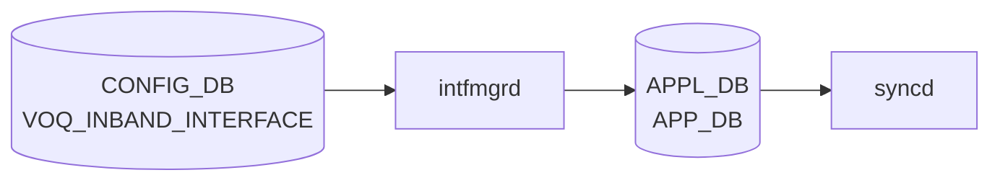

# VOQ_INBAND_INTERFACE テーブル

## 概要

`VOQ_INBAND_INTERFACE` テーブルは [VOQ](../../reference/glossary.md#term-voq) chassis におけるラインカード間のインバンド通信用論理インターフェース (`Ethernet-IB<n>`) を [CONFIG_DB](../../reference/glossary.md#term-config_db) に定義する[^1]。[BGP](../../reference/glossary.md#term-bgp) internal-neighbor などのコントロールプレーン通信に使われる。テーブルは 2 段構造:

- `VOQ_INBAND_INTERFACE_LIST` (key: name)
- `VOQ_INBAND_INTERFACE_IPPREFIX_LIST` (key: name, ip-prefix)

<!-- cdb-mermaid -->
### データフロー (自動生成)



!!! note "凡例"
    CONFIG_DB から SAI までの典型経路を `docs/reference/config-db-orch-map.md` から機械生成したミニ図。詳細・例外は本ページ本文と対応表を参照。
<!-- /cdb-mermaid -->

## key 構造

```text
VOQ_INBAND_INTERFACE|<name>
VOQ_INBAND_INTERFACE|<name>|<ip-prefix>
```

## VOQ_INBAND_INTERFACE_LIST フィールド

| フィールド | 型 | デフォルト | 説明 |
|-----------|----|-----------|------|
| `name` (key) | string パターン `Ethernet-IB[0-9]+` | — | インバンド IF 名 |
| `inband_type` | string パターン `port\|Port` | `port` | インバンドタイプ |

## VOQ_INBAND_INTERFACE_IPPREFIX_LIST フィールド

| フィールド | 型 | 説明 |
|-----------|----|------|
| `name` (key) | leafref → `VOQ_INBAND_INTERFACE_LIST.name` | 親インターフェース |
| `ip-prefix` (key) | `sonic-ip-prefix` | アサイン IP プレフィックス |

<!-- defaults -->
## フィールドデフォルト一覧

### VOQ_INBAND_INTERFACE_LIST

| フィールド | デフォルト | 由来 |
|-----------|-----------|------|
| `inband_type` | `"port"` | YANG `default "port"` ([sonic-voq-inband-interface.yang](https://github.com/sonic-net/sonic-buildimage/blob/master/src/sonic-yang-models/yang-models/sonic-voq-inband-interface.yang)) |

### SYSTEM_PORT_LIST

SYSTEM_PORT の全フィールドはデフォルトなし。`minigraph.py` が minigraph XML の `<SystemPorts>` セクションまたは `InterfaceMetadata` から全量生成して [CONFIG_DB](../../reference/glossary.md#term-config_db) に投入する。`system_port_id` は投入時にソート順で `1` から自動採番される (`parse_chassis_deviceinfo_intf_metadata()`)。

<!-- /defaults -->

## 制約

- `name` は `Ethernet-IB<数値>` パターン
- `inband_type` は `port` または `Port`

## 購読者

- `intfmgrd` / `intfsyncd` ([sonic-swss](../../reference/glossary.md#term-sonic-swss))
- `bgpcfgd` / `bgpd` — [BGP](../../reference/glossary.md#term-bgp) internal neighbor のソース interface として使う場合

## 関連 CONFIG_DB / YANG / CLI

- 関連 [CONFIG_DB](../../reference/glossary.md#term-config_db): `SYSTEM_PORT`、`BGP_INTERNAL_NEIGHBOR`、`BGP_VOQ_CHASSIS_NEIGHBOR`、`CHASSIS_MODULE`
- 関連 [YANG](../../reference/glossary.md#term-yang): `sonic-voq-inband-interface`、`sonic-bgp-internal-neighbor`、`sonic-bgp-voq-chassis-neighbor`
- 関連 CLI: `config interface`

<!-- value-behavior -->
## 値依存挙動マトリクス

本テーブルは enum フィールドが少なく、フィールドはほぼ string パターンで制御される。

| フィールド | 値 | 実挙動 |
|-----------|-----|--------|
| `inband_type` | `port` | インバンドタイプを port に設定（デフォルト、YANG default "port"）|
| `inband_type` | `Port` | `port` と同義。YANG pattern "port\|Port" で両方許可 |
| `inband_type` | 省略 | YANG default `"port"` が補完される |
| `inband_type` | その他 | YANG pattern 違反で reject |
| `name` | `Ethernet-IB<n>` | 有効な VOQ インバンド IF 名 |
| `name` | その他 | YANG `pattern "Ethernet-IB[0-9]+"` 違反で reject |

<!-- /value-behavior -->

## 例外条件・特殊挙動 <!-- cdb-exceptions -->

<!-- evidence: sonic-buildimage/src/sonic-yang-models/yang-models/sonic-voq-inband-interface.yang; sonic-swss/cfgmgr/intfmgr.cpp -->

- **名前パターン (YANG)**: `pattern "Ethernet-IB[0-9]+"` — パターン違反は YANG バリデーションで reject される[^exc1]。
- **`inband_type` パターン (YANG)**: `pattern "port|Port"` のみ許可[^exc1]。
- **IP プレフィクス leafref (YANG)**: `VOQ_INBAND_INTERFACE_IPPREFIX_LIST` の `name` は `VOQ_INBAND_INTERFACE_LIST/name` への leafref — 対応エントリが存在しない場合 YANG バリデーションで reject[^exc1]。
- **デフォルト補完**: `inband_type` 省略時は YANG `default "port"` が補完される[^exc1]。
- **インタフェース未 ready**: 親インタフェースが [STATE_DB](../../reference/glossary.md#term-state_db) に未登録の場合 `intfmgrd` はリトライ待ちとなる（通常の `VLAN_INTERFACE` と同動作）[^exc2]。

[^exc1]: `sonic-buildimage/src/sonic-yang-models/yang-models/sonic-voq-inband-interface.yang` <https://github.com/sonic-net/sonic-buildimage/blob/master/src/sonic-yang-models/yang-models/sonic-voq-inband-interface.yang>
[^exc2]: `sonic-swss/cfgmgr/intfmgr.cpp` <https://github.com/sonic-net/sonic-swss/blob/master/cfgmgr/intfmgr.cpp>

<!-- ref-triangle:start -->

## 関連リファレンス

- [YANG](../../reference/glossary.md#term-yang): `sonic-voq-inband-interface`
- CLI: [`config interface`](../cli/config-interface.md)

<!-- ref-triangle:end -->

## 引用元

[^1]: [YANG](../../reference/glossary.md#term-yang) 定義: `sonic-voq-inband-interface.yang`. <https://github.com/sonic-net/sonic-buildimage/blob/9ea932ec2e18f35e58268ec2e4456b1d4afd65cd/src/sonic-yang-models/yang-models/sonic-voq-inband-interface.yang>

## 関連ページ
- [CONFIG_DB: INTERFACE](interface.md)

<!-- ops-hint -->
## 運用ヒント

### 典型値

- key 形式: `VOQ_INBAND_INTERFACE|<name>` (例 `VOQ_INBAND_INTERFACE|Ethernet-IB0`)、`VOQ_INBAND_INTERFACE|<name>|<ip-prefix>`。
- `inband_type=port` が一般的。

### よくある誤設定

- `name` が `Ethernet-IB<n>` パターンに一致しない命名で YANG validation エラー。
- [VOQ](../../reference/glossary.md#term-voq) chassis 以外の単体スイッチで設定して効果が無い ([VOQ](../../reference/glossary.md#term-voq) 専用)。

### 確認コマンド

```bash
sonic-db-cli CONFIG_DB keys 'VOQ_INBAND_INTERFACE|*'
show interfaces status Ethernet-IB0
show ip interface | grep Ethernet-IB
```
<!-- /ops-hint -->

<!-- runtime-trace -->
## CDB → 実コンテナ動作トレース

### 段階 1: Consumer 登録

- **[orchagent](../../reference/glossary.md#term-orchagent) / VoqOrch** (`sonic-swss/orchagent/voqorch.cpp`): `VOQ_INBAND_INTERFACE` テーブルを購読 (VOQ chassis 環境専用)。

### 段階 2: CFG → APPL 翻訳

- VoqOrch が inband インタフェース (asic-asic 通信用) を APP_DB `INTF_TABLE` に書き込む。

### 段階 3: APPL → SAI

- IntfsOrch が [SAI](../../reference/glossary.md#term-sai) で inband ポートの [RIF](../../reference/glossary.md#term-rif) を作成し、VOQ 配送に使用するルートを設定。

### 段階 4: タイミング + 副作用

- VOQ chassis 環境でのみ有効。non-VOQ 環境では [orchagent](../../reference/glossary.md#term-orchagent) が処理をスキップ。

<!-- /runtime-trace -->
<!-- entry-points -->
## 書き込み入り口 (Direction A)

VOQ_INBAND_INTERFACE テーブルへの書き込みが発生するコード経路を網羅的に調査した結果。

### CLI

  - 専用 CLI なし

### minigraph / sonic-cfggen

**minigraph.py** が VOQ_INBAND_INTERFACE を生成し投入 ([sonic-buildimage](../../reference/glossary.md#term-sonic-buildimage)/src/sonic-config-engine/minigraph.py)

### REST / gNMI

REST/[gNMI](../../reference/glossary.md#term-gnmi) 書き込み経路なし

### db_migrator

db_migrator.py での VOQ_INBAND_INTERFACE マイグレーションなし

### ビルド時デフォルト (build-time default)

なし

### ハードコードデフォルト / ランタイム注入

**sonic-[bgpcfgd](../../reference/glossary.md#term-bgpcfgd)** `main.py` が VOQ_INBAND_INTERFACE を監視し [BGP](../../reference/glossary.md#term-bgp) ルート配布に使用 ([sonic-buildimage](../../reference/glossary.md#term-sonic-buildimage)/src/sonic-[bgpcfgd](../../reference/glossary.md#term-bgpcfgd)/[bgpcfgd](../../reference/glossary.md#term-bgpcfgd)/main.py)

### 死活・デッドコード

なし
<!-- /entry-points -->

<!-- ordering -->
## 書込み順依存 (Phase B)

> 調査対象: `sonic-swss/cfgmgr/intfmgr.cpp`
> 調査日: 2026-05-16

### 他テーブル先行必須

`VOQ_INBAND_INTERFACE` は `intfmgrd` が購読する（`intfmgrd.cpp:34`）が、単一キー SET の場合は `doIntfGeneralTask()` を呼ばず**直接 APP_DB へ relay** する（`intfmgr.cpp:1195-1204`）。

```cpp
// intfmgr.cpp:1195-1203
if((table_name == CFG_VOQ_INBAND_INTERFACE_TABLE_NAME) &&
        (op == SET_COMMAND))
{
    //No further processing needed. Just relay to orchagent
    m_appIntfTableProducer.set(keys[0], data);
    m_stateIntfTable.hset(keys[0], "vrf", "");
    ...
}
```

| 先行テーブル / 条件 | 依存の内容 | コード根拠 |
|------------------|-----------|-----------|
| VOQ 環境が有効 (`switch_type == "voq"`) | `VoqOrch` が起動していること。non-VOQ 環境では [orchagent](../../reference/glossary.md#term-orchagent) がスキップ | `sonic-swss/orchagent/voqorch.cpp` |
| IP プレフィクスロウは属性ロウの [STATE_DB](../../reference/glossary.md#term-state_db) 書込み後 | `isIntfCreated()` が false → IP プレフィクスロウをスキップ（2-key パスは `doIntfAddrTask` 経由） | `intfmgr.cpp:1115` |

### 主要ポイント

- 単一キー SET（属性ロウ）は `isIntfStateOk()` 検査をバイパスし、即 APP_DB に relay される — PORT / [LAG](../../reference/glossary.md#term-lag) / [VLAN](../../reference/glossary.md#term-vlan) の [STATE_DB](../../reference/glossary.md#term-state_db) ready を待たない
- IP プレフィクスロウ（2-key）は通常の `doIntfAddrTask()` パスを通るため `isIntfCreated()` が必要
- `VoqOrch` が APP_DB の `INTF_TABLE` を購読し、inband ポートの [SAI](../../reference/glossary.md#term-sai) [RIF](../../reference/glossary.md#term-rif) を作成する

詳細調査ノートは `meta/_intermediate/cdb-flow/voq-inband-interface-ordering.md` 参照。

<!-- /ordering -->

<!-- cross-refs -->
## 暗黙参照テーブル (Phase C)

> 調査対象: `sonic-swss/cfgmgr/intfmgr.cpp`, `sonic-swss/cfgmgr/nbrmgr.cpp`, `sonic-swss/orchagent/intfsorch.cpp`, `sonic-swss/orchagent/portsorch.cpp`, `sonic-buildimage/src/sonic-yang-models/yang-models/sonic-voq-inband-interface.yang`
> 調査日: 2026-05-18
> 調査証跡: `meta/_intermediate/cdb-flow/voq-inband-interface-cross-refs.md`

YANG leafref を超えた他テーブル・他 DB・プロセスへの実装上の依存関係。

| # | 参照先 | DB / 場所 | 方向 | 依存内容 | 根拠コード |
|---|--------|-----------|------|---------|-----------|
| 1 | `DEVICE_METADATA.localhost.switch_type` | CONFIG_DB | READ | `switch_type != "voq"` のとき VoQ 系処理全体がスキップされ VOQ_INBAND_INTERFACE は事実上無効 | `intfmgr.cpp:71-75`, `main.cpp` |
| 2 | `APP_INTF_TABLE` | [APPL_DB](../../reference/glossary.md#term-appl_db) | WRITE | 単一キー SET は `doIntfGeneralTask()` をバイパスし `m_appIntfTableProducer.set()` で即時 relay | `intfmgr.cpp:1198-1199` |
| 3 | `STATE_INTF_TABLE` | STATE_DB | WRITE/READ | `intfmgrd` が `vrf=""` を書き込み、IP プレフィクスロウ (2-key) の `isIntfCreated()` チェック成立に必要 | `intfmgr.cpp:1200`, `intfmgr.cpp:1115` |
| 4 | `portsorch` 内部ポートマップ (`getPort()`) | orchagent (in-process) | READ | `setVoqInbandIntf()` が `getPort()` で対象ポートの存在を確認。未登録ならリトライキュー戻し | `portsorch.cpp:11121-11131` |
| 5 | `VOQ_INBAND_INTERFACE` (READ by nbrmgr) | CONFIG_DB | READ | `nbrmgrd` が VOQ 環境でリモートネイバーのカーネルルート追加時に `inband_type` を参照 | `nbrmgr.cpp:82,524-549` |
| 6 | `VOQ_INBAND_INTERFACE_LIST.name` (YANG leafref) | CONFIG_DB | READ | IP プレフィクスロウの `name` キーは属性ロウへの leafref。対応属性行なしで YANG バリデーション reject | `sonic-voq-inband-interface.yang:48` |

!!! note "依存 #1 (switch_type ゲート)"
    `switch_type == "voq"` かつ VOQ chassis 環境が成立しない限り、VOQ_INBAND_INTERFACE を CONFIG_DB に書いても orchagent / intfmgrd ともに処理をスキップする（エラーログなし）。単体スイッチでは設定が無視される。

!!! note "依存 #3 (2-key IP プレフィクスロウの前提)"
    属性ロウ（単一キー `VOQ_INBAND_INTERFACE|<name>`）の SET が先行し `STATE_INTF_TABLE` に `vrf=""` が書かれた後でなければ、IP プレフィクスロウ（2-key `VOQ_INBAND_INTERFACE|<name>|<ip-prefix>`）が `doIntfAddrTask()` で処理されない（`isIntfCreated()` が false を返す）。

<!-- /cross-refs -->

<!-- failure -->
## 失敗挙動 (Phase D)

対象: `intfmgrd` (`sonic-swss/cfgmgr/intfmgr.cpp`) および `orchagent` の `IntfsOrch` / `PortsOrch` (`sonic-swss/orchagent/intfsorch.cpp`, `portsorch.cpp`)。

`VOQ_INBAND_INTERFACE` の処理は **単一キー SET**（属性ロウ `|<name>`）と **2-key SET**（IP プレフィクスロウ `|<name>|<ip-prefix>`）で挙動が異なる。

### 単一キー SET — intfmgr 側は失敗分岐なし

`intfmgr.cpp:1195-1204` は `doIntfGeneralTask()` を一切呼ばず、`m_appIntfTableProducer.set()` と `m_stateIntfTable.hset()` を直接実行してから `erase()` する。[Redis](../../reference/glossary.md#term-redis) 書き込みは通常失敗しないため、**intfmgr 側では失敗ケースが存在しない**。

### 2-key SET — isIntfCreated() 待ち

IP プレフィクスロウ (`doIntfAddrTask()`) は `isIntfStateOk()` + `isIntfCreated()` を両方チェックする（`intfmgr.cpp:1115`）。単一キー SET が先行して `STATE_INTF_TABLE` に `vrf=""` を書くまで `isIntfCreated()` が false を返し、タスクを `m_toSync` に残留させて次回ループで再試行する（silent retry、エラーログなし）。

### orchagent 側 (portsorch.cpp:11110-11134)

[APPL_DB](../../reference/glossary.md#term-appl_db) `INTF_TABLE` を受け取った `IntfsOrch::doTask()` は `setVoqInbandIntf()` を呼び、次の 2 条件で `false` を返す。

| # | 失敗条件 | ログ | orchagent 挙動 | 解消条件 |
|---|---------|------|---------------|---------|
| 1 | `getPort(alias, port)` が false — [portsorch](../../reference/glossary.md#term-portsorch) の内部マップにポート未登録 | `SWSS_LOG_ERROR("Port/Vlan configured for inband intf %s is not ready!", ...)` | `it++; continue;` → `m_toSync` に残留、次回ループで再試行 | `portsyncd` が [APPL_DB](../../reference/glossary.md#term-appl_db) `PORT_TABLE` を書き → `portsorch` がポートを登録した時点 |
| 2 | `type == "port"` かつ `port.m_hif_id == 0` — host interface 未作成 | `SWSS_LOG_ERROR("Host interface is not available for port %s", ...)` | 同上 | `portsorch` が `sai_create_hostif` を完了した時点 |

同名インターフェースが既登録の場合は `SWSS_LOG_NOTICE` を出力して `true` を返す（idempotent）。

### STATE_DB への障害記録

VOQ 系には [ACL](../../reference/glossary.md#term-acl)/[QoS](../../reference/glossary.md#term-qos) のような `STATE_DB` ステータスエントリがない。失敗時は `syslog`（swss プロセス）へのエラーログのみ。

```bash
# 失敗ログ確認
journalctl -u swss | grep -i "inband"
```

> 中間調査ファイル: `meta/_intermediate/cdb-flow/voq-inband-interface-failure.md`
<!-- /failure -->

<!-- constants -->
## ハードコード定数 (Phase E)

以下の定数は `sonic-swss/cfgmgr/intfmgr.cpp`、`sonic-swss/cfgmgr/intfmgrd.cpp`、`sonic-buildimage/src/sonic-yang-models/yang-models/sonic-voq-inband-interface.yang` から検出したマジックナンバー・閾値。

| 定数 / マジック値 | 値 | 定義場所 | 意味・影響 |
|------------------|-----|----------|-----------|
| IPv6 metric (VOQ 専用) | `256` | `intfmgr.cpp:105` | `switch_type == "voq"` のとき IPv6 アドレス追加コマンドに `metric 256` を付与。カーネルのデフォルト connected route metric (256) と揃えることで、eBGP / iBGP 経路と inband 接続ルートを同一 [ECMP](../../reference/glossary.md#term-ecmp) グループに収める |
| IPv6 broadcast 付与閾値 | prefixLen `< 127` | `intfmgr.cpp:108` | `/127` 以上 (`/127`, `/128`) では broadcast オプションなしで `ip -6 address add` を実行。Linux カーネルの仕様に準拠 |
| `SELECT_TIMEOUT` | `1000` ms | `intfmgrd.cpp:17` | `intfmgrd` メインループの `s.select()` タイムアウト値。設定変更が反映されるまでの最大遅延 |
| `name` パターン | `"Ethernet-IB[0-9]+"` | `sonic-voq-inband-interface.yang:32` | インバンド IF 名の YANG pattern 制約。違反すると YANG バリデーションで reject される |
| `inband_type` パターン | `"port\|Port"` | `sonic-voq-inband-interface.yang:38` | インバンドタイプの許容値。この 2 値以外は YANG バリデーションで reject |
| `inband_type` デフォルト | `"port"` | `sonic-voq-inband-interface.yang` | YANG `default "port"` 指定値。省略時に補完される |

!!! note "metric 256 の意味"
    VOQ chassis では、inband ポート経由の eBGP / iBGP 学習経路と直接接続ルートが競合したとき、カーネルの connected route metric (デフォルト 256) に合わせて IPv6 アドレスを `metric 256` で追加することで両者を同一 ECMP グループに統合できる。IPv4 ではカーネルの connected / static 両 metric がデフォルト 0 のため明示指定不要 (`intfmgr.cpp:101-102` コメント参照)。

> 調査証跡: `meta/_intermediate/cdb-flow/voq-inband-interface-constants.md`

<!-- /constants -->

<!-- side-effects -->
## 副次 DB 書込 (Phase F)

`VOQ_INBAND_INTERFACE` テーブルへの SET/DEL が引き起こす、CONFIG_DB 以外の DB への書込みを示す。

> 調査対象: `sonic-swss/cfgmgr/intfmgr.cpp`, `sonic-buildimage/src/sonic-bgpcfgd/bgpcfgd/managers_intf.py`, `sonic-swss/cfgmgr/nbrmgr.cpp`
> 調査日: 2026-05-18

### SET — インタフェースロウ (`VOQ_INBAND_INTERFACE|<name>`)

`intfmgrd` は VOQ_INBAND_INTERFACE の `keys.size() == 1` (インタフェース行) を検出すると、通常の `doIntfGeneralTask()` を経由せず即座に中継する専用パスを通る (`intfmgr.cpp:1195-1205`)。

| 操作 | 対象 DB / テーブル | キー / フィールド | コード根拠 |
|------|------------------|-----------------|-----------|
| `INTF_TABLE.set(<name>, data)` | APPL_DB / `INTF_TABLE` | `<name>` | `intfmgr.cpp:1199` — `m_appIntfTableProducer.set` |
| `INTERFACE_TABLE.hset(<name>, "vrf", "")` | STATE_DB / `INTERFACE_TABLE` | `<name>` field=`vrf` 空文字 | `intfmgr.cpp:1200` — VOQ inband は常に global [VRF](../../reference/glossary.md#term-vrf) |

`bgpcfgd` の `InterfaceMgr` もこのテーブルを購読しており、SET 時に `Directory` の `LOCAL/interfaces` および `LOCAL/local_addresses` を更新し、BGP ピア解決に使用する (`managers_intf.py:38-40`)。

### SET — IP プレフィクスロウ (`VOQ_INBAND_INTERFACE|<name>|<ip-prefix>`)

`keys.size() == 2` の場合は `doIntfAddrTask()` に委譲される。インタフェース行が STATE_DB に登録済みであることが前提 (`intfmgr.cpp:1115`)。

| 操作 | 対象 DB / テーブル | キー / フィールド | コード根拠 |
|------|------------------|-----------------|-----------|
| `INTF_TABLE.set(<name>:<ip-prefix>, {scope,family})` | APPL_DB / `INTF_TABLE` | `<name>:<ip-prefix>` | `intfmgr.cpp:1134` — IPv4 link-local 以外のみ |
| `INTERFACE_TABLE.hset("<name>&#124;<ip-prefix>", "state", "ok")` | STATE_DB / `INTERFACE_TABLE` | `<name>|<ip-prefix>` | `intfmgr.cpp:1138` — IPv4 link-local 以外のみ |

`bgpcfgd` は IP プレフィクスロウの SET で `LOCAL/local_addresses/<ip>` にエントリを追加し、BGP ネクストホップ解決のローカルアドレス候補として使用する (`managers_intf.py:28-40`)。

### DEL — インタフェースロウ

`keys.size() == 1` の DEL は通常の `doIntfGeneralTask()` DEL パスを通る。

| 操作 | 対象 DB / テーブル | キー | コード根拠 |
|------|------------------|------|-----------|
| `INTF_TABLE.del(<name>)` | APPL_DB / `INTF_TABLE` | `<name>` | `intfmgr.cpp:1089` |
| `INTERFACE_TABLE.del(<name>)` | STATE_DB / `INTERFACE_TABLE` | `<name>` | `intfmgr.cpp:1089` |

`bgpcfgd` は DEL で `LOCAL/interfaces` および `LOCAL/local_addresses` からエントリを除去する (`managers_intf.py:43-56`)。

### DEL — IP プレフィクスロウ

| 操作 | 対象 DB / テーブル | キー | コード根拠 |
|------|------------------|------|-----------|
| `INTF_TABLE.del(<name>:<ip-prefix>)` | APPL_DB / `INTF_TABLE` | `<name>:<ip-prefix>` | `intfmgr.cpp:1162` — IPv4 link-local 以外のみ |
| `INTERFACE_TABLE.del("<name>&#124;<ip-prefix>")` | STATE_DB / `INTERFACE_TABLE` | `<name>|<ip-prefix>` | `intfmgr.cpp:1162` — IPv4 link-local 以外のみ |

### nbrmgr による間接参照

`nbrmgr` は VOQ モード (`switch_type == "voq"`) 時に `VOQ_INBAND_INTERFACE` テーブルを**参照専用**で保持する (`nbrmgr.cpp:82`)。STATE_SYSTEM_NEIGH イベント処理 (`doStateSystemNeighTask`) のたびに `getVoqInbandInterfaceName()` でテーブルを読み出し、リモート neighbor 用のカーネルルート (`ip route add`) 追加先デバイス名と `inband_type` を取得する (`nbrmgr.cpp:523-547`)。本テーブルへの SET/DEL は直接 DB 書込みを引き起こさないが、**nbrmgr のカーネルルート注入動作の前提条件**となる。

<!-- /side-effects -->

<!-- pubsub -->
## 通信メカニズム (Redis PUBSUB / ConsumerStateTable) (Phase G)

> 調査対象: `sonic-swss/cfgmgr/intfmgrd.cpp`, `sonic-swss/cfgmgr/intfmgr.cpp`
> 調査日: 2026-05-18

### 購読方式

`VOQ_INBAND_INTERFACE` テーブルの変更通知は **[Redis](../../reference/glossary.md#term-redis) PUBLISH/SUBSCRIBE** を使った `swss::ConsumerStateTable` で伝達される。`intfmgrd` は `Orch(cfgDb, tableNames)` コンストラクタ経由で `CFG_VOQ_INBAND_INTERFACE_TABLE_NAME` を購読テーブルリストに登録する (`intfmgrd.cpp:34`)。

### ProducerStateTable → ConsumerStateTable フロー

```text
CLI / minigraph.py
  └─ CONFIG_DB HSET VOQ_INBAND_INTERFACE|Ethernet-IB0 inband_type port
       └─ ConsumerStateTable (CFG_VOQ_INBAND_INTERFACE_TABLE_NAME_CHANNEL@<cfgDbId>)
            └─ SADD キーセット "Ethernet-IB0"
            └─ HSET _VOQ_INBAND_INTERFACE|Ethernet-IB0 <fields>
            └─ PUBLISH CFG_VOQ_INBAND_INTERFACE_TABLE_NAME_CHANNEL@<cfgDbId> "G"

intfmgrd (swss::Select, timeout=1000ms)
  └─ ConsumerStateTable::pops()  (Orch::doTask(Consumer&) へ dispatch)
       └─ doTask(consumer) → table_name == CFG_VOQ_INBAND_INTERFACE_TABLE_NAME

単一キー SET パス (keys.size() == 1, op == SET_COMMAND):
  └─ m_appIntfTableProducer.set(keys[0], data)   ← APPL_DB APP_INTF_TABLE に ProducerStateTable 経由で書込み
  └─ m_stateIntfTable.hset(keys[0], "vrf", "")   ← STATE_DB INTERFACE_TABLE に直接 hset

IP プレフィクスロウ SET パス (keys.size() == 2):
  └─ doIntfAddrTask() → isIntfStateOk() + isIntfCreated() を確認
  └─ m_appIntfTableProducer.set(<name>:<ip-prefix>, {scope, family})
  └─ m_stateIntfTable.hset(<name>|<ip-prefix>, "state", "ok")
```

### チャンネル / キー名

| 名前 | 値 |
|------|----|
| [intfmgrd](../../reference/glossary.md#term-intfmgrd) 受信チャンネル | `CFG_VOQ_INBAND_INTERFACE_TABLE_NAME_CHANNEL@<cfgDbId>` |
| orchagent 受信チャンネル | `APP_INTF_TABLE_CHANNEL@<appDbId>` ([ProducerStateTable](../../reference/glossary.md#term-producerstatetable) 経由) |
| PUBLISH ペイロード | `"G"` (固定) |
| 一時ステートハッシュ (cfgDb 側) | `_VOQ_INBAND_INTERFACE|<key>` |

### Select ループと retry

- タイムアウト `1000` ms (`SELECT_TIMEOUT`, `intfmgrd.cpp:17`)
- TIMEOUT 時は `intfmgr.doTask()` を呼び、`m_toSync` に残留している保留タスクを再試行
- IP プレフィクスロウが `isIntfCreated()` = false のとき `it++`（スキップ）で silent retry

### STATE_DB への通知（逆方向）

- `intfmgrd` は `SubscriberStateTable(stateDb, STATE_PORT_TABLE_NAME)` および `SubscriberStateTable(stateDb, STATE_LAG_TABLE_NAME)` を登録 (`intfmgr.cpp:45-53`)。
- STATE_DB `PORT_TABLE` に `state=ok` が書かれると `intfmgrd` の `doPortTableTask()` が呼ばれ、pending の interface タスクを再実行するトリガーになる。

<!-- /pubsub -->

<!-- platform -->
## プラットフォーム差 (Phase H)

> 調査対象: `sonic-swss/orchagent/main.cpp`, `sonic-swss/cfgmgr/intfmgr.cpp`, `sonic-swss/orchagent/portsorch.cpp`
> 調査日: 2026-05-19

### switch_type による有効性

`VOQ_INBAND_INTERFACE` テーブルは **`switch_type == "voq"` の場合のみ** 実質的に機能する。

| switch_type | 挙動 |
|-------------|------|
| `"voq"` | `intfmgrd` が購読 → APP_DB に relay → orchagent `IntfsOrch` / `PortsOrch` が [SAI](../../reference/glossary.md#term-sai) 設定 → VOQ inband ポートを使用 |
| `"switch"` (通常スイッチ) | `intfmgrd` は表を購読しているがコード分岐 (`intfmgr.cpp:1195`) は `switch_type=="voq"` 前提で生成された設定のためあり得ない。`PortsOrch::setVoqInbandIntf()` も呼ばれない |
| `"fabric"` | `FabricOrchDaemon` を使用し `IntfsOrch` 自体が起動しない。テーブルは完全に無視される |

### SAI レベルの前提

orchagent が `switch_type == "voq"` のとき `sai_create_switch()` に次の属性を渡す（`main.cpp:697-707`）:

| SAI 属性 | 値 | 意味 |
|----------|-----|------|
| `SAI_SWITCH_ATTR_TYPE` | `SAI_SWITCH_TYPE_VOQ` | SAI に VOQ 動作モードを宣言 |
| `SAI_SWITCH_ATTR_SWITCH_ID` | `gVoqMySwitchId` | [DEVICE_METADATA](../../reference/glossary.md#term-device_metadata).localhost.switch_id から取得 |
| `SAI_SWITCH_ATTR_MAX_SYSTEM_CORES` | `gVoqMaxCores` | [DEVICE_METADATA](../../reference/glossary.md#term-device_metadata).localhost.max_cores から取得 |
| `SAI_SWITCH_ATTR_SYSTEM_PORT_CONFIG_LIST` | システムポートリスト | SYSTEM_PORT テーブルから生成。0 件なら `exit(EXIT_FAILURE)` |

`SAI_SWITCH_TYPE_VOQ` をサポートしない [ASIC](../../reference/glossary.md#term-asic) では orchagent 起動時点で SAI エラーが発生し、`VOQ_INBAND_INTERFACE` の処理に到達しない。

### multi-asic VOQ chassis vs. standalone VOQ

| 構成 | `gMultiAsicVoq` | 影響 |
|------|----------------|------|
| multi-asic chassis（`CHASSIS_APP_DB` 利用可能） | `true` | [LAG](../../reference/glossary.md#term-lag) / System Port が CHASSIS_APP_DB に同期される。`VOQ_INBAND_INTERFACE` 処理自体に差はないが、inband ポートのリモートネイバールートが supervisor 経由で他 asic に配信される |
| standalone VOQ（`CHASSIS_APP_DB` 不在） | `false` | CHASSIS_APP_DB への同期なし。[LAG](../../reference/glossary.md#term-lag)/System Port の chassis 共有は行われないが、inband インタフェースの APP_DB relay / SAI 設定は同一 |

### IPv6 metric 差分（switch_type 依存）

`intfmgr.cpp:103-106` において `mySwitchType == "voq"` 時のみ IPv6 アドレス追加コマンドに `metric 256` を付与する。通常スイッチ (`"switch"`) では metric 指定なし（カーネルデフォルト 0 またはカーネル任意値）。

| switch_type | `ip -6 address add` オプション | 理由 |
|-------------|-------------------------------|------|
| `"voq"` | `metric 256` を付加 | inband 接続ルートとカーネルの connected route metric を同値にして eBGP/iBGP [ECMP](../../reference/glossary.md#term-ecmp) を成立させる |
| その他 | metric 指定なし | VOQ 固有の [ECMP](../../reference/glossary.md#term-ecmp) 要件なし |

### ベンダー ASIC 固有性

VOQ SAI (`SAI_SWITCH_TYPE_VOQ`) を実装しているベンダー [ASIC](../../reference/glossary.md#term-asic) に限定される。コミュニティ [SONiC](../../reference/glossary.md#term-sonic) では Cisco 8000 シリーズなどが代表例として挙げられるが、[SONiC](../../reference/glossary.md#term-sonic) コードは [ASIC](../../reference/glossary.md#term-asic) 種別を直接確認せず `switch_type` 設定のみで判定する。

<!-- /platform -->

<!-- glossary-links-injected: b5657f3f91ae -->
