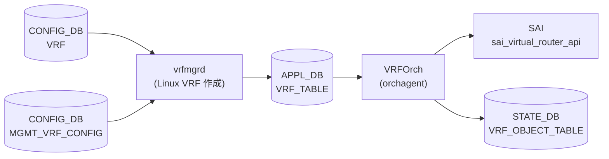

# APPL_DB VRF_TABLE (VRFOrch)

## 概要

`APPL_DB VRF_TABLE` は [VRF](../../reference/glossary.md#term-vrf) インスタンスの実効設定を保持する [APPL_DB](../../reference/glossary.md#term-appl_db) テーブル。テーブル名は `"VRF_TABLE"` (`schema.h:80`)。

パイプラインは 2 段構成:

1. **vrfmgrd** — `CONFIG_DB VRF` を購読し、Linux `ip link add ... type vrf table <id>` で VRF デバイスを作成した後、`kfvFieldsValues(t)` をそのまま `APP_VRF_TABLE` へ書き込む（デフォルト補完なし）
2. **VRFOrch** — `APP_VRF_TABLE` を購読し、フィールドを SAI 属性に変換して `sai_virtual_router_api->create_virtual_router()` を呼ぶ



## key 構造

```text
VRF_TABLE:<vrf_name>
```

`<vrf_name>` は CONFIG_DB `VRF` テーブルの key と同一。`Vrf` プレフィクス付きが通常（例: `VRF_TABLE:VrfRed`）。`mgmt` は例外として固定テーブル ID `6000` を使用。

## フィールド一覧

| フィールド | 型 | SAI 属性 | デフォルト | 説明 |
|-----------|----|---------|-----------|------|
| `v4` | boolean | `SAI_VIRTUAL_ROUTER_ATTR_ADMIN_V4_STATE` | SAI 依存 ※1 | IPv4 管理状態 |
| `v6` | boolean | `SAI_VIRTUAL_ROUTER_ATTR_ADMIN_V6_STATE` | SAI 依存 ※1 | IPv6 管理状態 |
| `src_mac` | MAC アドレス | `SAI_VIRTUAL_ROUTER_ATTR_SRC_MAC_ADDRESS` | SAI 依存 ※1 | 送信元 MAC |
| `ttl_action` | packet_action | `SAI_VIRTUAL_ROUTER_ATTR_VIOLATION_TTL1_PACKET_ACTION` | SAI 依存 ※1 | TTL=1 パケット処理 |
| `ip_opt_action` | packet_action | `SAI_VIRTUAL_ROUTER_ATTR_VIOLATION_IP_OPTIONS_PACKET_ACTION` | SAI 依存 ※1 | IP オプション違反処理 |
| `l3_mc_action` | packet_action | `SAI_VIRTUAL_ROUTER_ATTR_UNKNOWN_L3_MULTICAST_PACKET_ACTION` | SAI 依存 ※1 | 未知 L3 マルチキャスト処理 |
| `vni` | uint32 | SAI 非直接 ※2 | `0` | L3 VNI マッピング |
| `fallback` | boolean | なし ※3 | (dead) | フォールバック（未実装） |
| `mgmtVrfEnabled` | boolean | なし ※4 | (ignored) | mgmt VRF 有効フラグ |
| `in_band_mgmt_enabled` | boolean | なし ※4 | (ignored) | in-band mgmt 有効フラグ |

- ※1 フィールド省略時は SAI `create_virtual_router()` の attrs リストに含まれない → SAI / ASIC 側デフォルト値が適用される
- ※2 `vni` は SAI 属性に直接マップされず `updateVrfVNIMap()` 経由で VXLAN VRF マップに書く (vrforch.cpp:114)
- ※3 `fallback` は `vrforch.h` の `request_description` に宣言のみ、`addOperation` にハンドラなし → `SWSS_LOG_ERROR("Logic error: Unknown attribute")` で破棄 (dead field)
- ※4 `mgmtVrfEnabled` / `in_band_mgmt_enabled` は `SWSS_LOG_INFO("MGMT VRF field: %s ignored")` で明示的に無視 (vrforch.cpp:74-78)

<!-- defaults -->
## 暗黙デフォルト・コード由来挙動 (Phase A)

> 調査日 2026-05-15。ソース: `sonic-swss/orchagent/vrforch.cpp`, `sonic-swss/orchagent/vrforch.h`, `sonic-swss/cfgmgr/vrfmgr.cpp`, `sonic-swss-common/common/schema.h`

### v4 / v6 — SAI attrs 省略による ASIC 依存デフォルト

`v4`/`v6` フィールドが `APP_VRF_TABLE` に存在しない場合、VRFOrch は `attrs` ベクタに追加しない。`create_virtual_router()` 呼び出し時に `SAI_VIRTUAL_ROUTER_ATTR_ADMIN_V4_STATE` / `SAI_VIRTUAL_ROUTER_ATTR_ADMIN_V6_STATE` が省略される → SAI の実装依存デフォルト（多くの実装で `true`）が適用される。

```cpp
// vrforch.cpp:39-47
if (name == "v4")
{
    attr.id = SAI_VIRTUAL_ROUTER_ATTR_ADMIN_V4_STATE;
    attr.value.booldata = request.getAttrBool("v4");
}
else if (name == "v6")
{
    attr.id = SAI_VIRTUAL_ROUTER_ATTR_ADMIN_V6_STATE;
    attr.value.booldata = request.getAttrBool("v6");
}
```

これらフィールドは CONFIG_DB `sonic-vrf.yang` に定義がなく、通常の `config vrf add` では APP_VRF_TABLE に書かれない。VNETOrch が APP_DB に直接書き込む経路でのみ到達可能。

### vni — 実装デフォルト 0 (VNI なし)

```cpp
// vrforch.cpp:30
uint32_t vni = 0;
// vrforch.cpp:69-73
else if (name == "vni")
{
    vni = static_cast<uint32_t>(request.getAttrUint(name));
    continue;  // SAI attrs には追加しない
}
```

省略時は `vni = 0` のまま。`updateVrfVNIMap()` が `vni != 0` の場合のみ VXLAN マッピングを実行する (vrforch.cpp:111-119)。これは CONFIG_DB `sonic-vrf.yang` の `default 0` と一致する。

### fallback — dead field (silent discard)

`vrforch.h:34` で `{ "fallback", REQ_T_BOOL }` として `request_description` に宣言されているが、`vrforch.cpp::addOperation` に対応する分岐が存在しない。`else` ブランチに落ちて `SWSS_LOG_ERROR("Logic error: Unknown attribute: %s", name.c_str())` が出力され、フィールドは破棄される。

- SAI への影響: なし
- カーネルへの影響: なし（VRFOrch は Linux ルーティングを直接操作しない）
- **`fallback=true` に設定しても実際のフォールバック動作は発生しない**

### mgmtVrfEnabled / in_band_mgmt_enabled — 明示的 ignore

```cpp
// vrforch.cpp:74-78
else if ((name == "mgmtVrfEnabled") || (name == "in_band_mgmt_enabled"))
{
    SWSS_LOG_INFO("MGMT VRF field: %s ignored", name.c_str());
    continue;
}
```

SAI 処理に一切渡されない。mgmt VRF の SAI 表現は `gVirtualRouterId`（デフォルトルータ OID）で代用される。

### Linux ルーティングテーブル ID — CONFIG_DB 非表現のハードコード

vrfmgrd が管理するテーブル ID 割り当てルール（CONFIG_DB `VRF` テーブルのフィールドには出現しない）:

| 定数 | 値 | 意味 |
|------|----|------|
| `VRF_TABLE_START` | `1001` | 通常 VRF テーブル ID 開始 (vrfmgr.cpp:12) |
| `VRF_TABLE_END` | `5097` | 通常 VRF テーブル ID 終端 (vrfmgr.cpp:13) |
| `TABLE_LOCAL_PREF` | `1001` | `ip rule` local テーブル移動先 preference (vrfmgr.cpp:14) |
| `MGMT_VRF_TABLE_ID` | `6000` | `mgmt` VRF 専用固定テーブル ID (vrfmgr.cpp:15) |

最大同時 VRF 数は **4096** (5097 − 1001)。プール枯渇時は `getFreeTable()` が `0` を返し `ip link add` が失敗する。

### mgmt VRF 特例

`vrfName == "mgmt"` の場合:

- `ip link add mgmt type vrf table ...` は実行しない（hostcfgd 側で初期化済み前提）
- テーブル ID は `MGMT_VRF_TABLE_ID = 6000` を固定使用 (vrfmgr.cpp:180-183)
- APP_VRF_TABLE への書き込みは通常 VRF と同様に行われ、VRFOrch が SAI VR を作成する

### STATE_DB 書き戻し (orchagent → vrfmgrd 連携)

VRFOrch は VRF 作成/更新成功後に `STATE_VRF_OBJECT_TABLE|<vrf_name>` に `"state"="ok"` を書く (vrforch.cpp:120, 150)。削除時は `m_stateVrfObjectTable.del(vrf_name)` (vrforch.cpp:193)。vrfmgrd は `isVrfObjExist()` でこのフラグを参照し、VRF 削除の遅延タイミングを制御する。

<!-- /defaults -->

<!-- ordering -->
## 書込み順依存 (Phase B)

`vrfmgrd` (`sonic-swss/cfgmgr/vrfmgr.cpp`) および `VRFOrch::addOperation` / `VRFOrch::delOperation` (`sonic-swss/orchagent/vrforch.cpp`) を精読した結果、以下の順序依存・タイミング依存を検出した。

### SET（VRF 追加）の先行必須条件

| # | 先行条件 | 方向 | 違反時の挙動 |
|---|----------|------|-------------|
| 1 | Linux VRF デバイス作成（vrfmgrd `setLink()`） | **強制先行** | VRF プールが空 (`getFreeTable()` → `0`) の場合 `ip link add` が失敗しエントリが APPL_DB に書かれない (`vrfmgr.cpp:185-188`) |
| 2 | EVPN VTEP（`VXLAN_EVPN_NVO` テーブル）— `vni` フィールドが非ゼロの VRF のみ | **強制先行** | `updateVrfVNIMap()` が `evpn_orch->getEVPNVtep()` null を検出して `false` を返し、`addOperation` が `false` でリターン → Consumer がエントリを `m_toSync` に残して次ループで再試行 (`vrforch.cpp:225-230`) |
| 3 | APPL_DB VRF_TABLE エントリ到着（VRFOrch の前提）— vrfmgrd が先に書いていること | 自然順（vrfmgrd → APPL_DB → VRFOrch） | `VRFOrch::addOperation` は APPL_DB の Consumer イベントで駆動されるため、vrfmgrd が `m_appVrfTableProducer.set()` を呼ぶまで SAI 作成は発生しない (`vrfmgr.cpp:303`) |

**推奨書込み順序（VNI 付き VRF の場合）**:

```text
# 1. VXLAN NVO/VTEP を先に作成
SET CONFIG_DB VXLAN_EVPN_NVO|nvo1  ...
# 2. VRF を追加（vrfmgrd が Linux link 作成 → APPL_DB 書込み → VRFOrch が SAI VR 作成）
SET CONFIG_DB VRF|VrfRed  vni=10000
# 3. VRFOrch が STATE_VRF_OBJECT_TABLE|VrfRed  state=ok を書く
```

VNI なし VRF は手順 1 が不要。

### DEL（VRF 削除）の先行必須条件

| # | 先行条件 | 方向 | 違反時の挙動 |
|---|----------|------|-------------|
| 1 | VRF を参照する INTERFACE / ROUTE の削除 | **強制先行** | `VRFOrch::delOperation` は `vrf_table_[vrf_name].ref_count != 0` を検出して `false` をリターン → Consumer が再キューし、参照カウントが 0 になるまで無限ポーリング (`vrforch.cpp:169-170`) |
| 2 | VRFOrch による `STATE_VRF_OBJECT_TABLE` エントリ削除 | **強制先行** | vrfmgrd DEL ハンドラは `isVrfObjExist()` が真の間、`it++; continue` で DEL を保留し続ける。VRFOrch が SAI `remove_virtual_router()` 成功後に `m_stateVrfObjectTable.del()` を呼んだ後にのみ `ip link del` が実行される (`vrfmgr.cpp:331-346`, `vrforch.cpp:193`) |

**安全な削除手順**:

```text
# 1. VRF 配下の全 INTERFACE を削除（ref_count のデクリメント）
DEL CONFIG_DB INTERFACE|Ethernet0|10.0.0.1/31  (VRFOrch が decreaseVrfRefCount を呼ぶまで待機)
# 2. VRF を削除
DEL CONFIG_DB VRF|VrfRed
# → vrfmgrd が APPL_DB DEL → VRFOrch が SAI DEL → STATE_VRF_OBJECT_TABLE クリア → vrfmgrd が ip link del
```

### 自動調停の仕組み

- **VNI 解決待ち（doTask 再試行）**: `addOperation` が `false` を返すと `Orch2::doTask()` が `m_toSync` にエントリを残したまま次ループへ。EVPN VTEP 作成後の次スケジュールで自動再評価される。
- **ref_count ガード（delOperation 再試行）**: `delOperation` が `false` を返した場合も同様。参照 Orch（RouteOrch / IntfsOrch 等）が `decreaseVrfRefCount()` を呼び ref_count が 0 になるまでポーリングを繰り返す。
- **VNI マップ整合性**: VNI 変更 (SET) 時は `updateVrfVNIMap()` が新旧 VNI を比較し差分のみ更新するため、同一 VNI での再投入は冪等 (`vrforch.cpp:212`)。

<!-- /ordering -->

<!-- cross-refs -->
## 暗黙参照テーブル (Phase C)

`APPL_DB VRF_TABLE` はエントリの **書き手が vrfmgrd 単独** であり、YANG leafref も未定義のため、暗黙参照はすべて実装レベルの依存として現れる。以下は (A) vrfmgrd が CONFIG_DB から読む入力テーブル、(B) VRFOrch が orchagent の `gDirectory` 経由で参照する内部 Orch、(C) 書込み先となる STATE_DB / APPL_DB テーブルを整理したもの。

### A. vrfmgrd が参照する CONFIG_DB 入力テーブル

| 参照先テーブル / リソース | 参照方向 | 条件 | 参照元 evidence |
|--------------------------|---------|------|----------------|
| `CONFIG_DB VRF\|<vrf_name>` | SET/DEL トリガ → Linux `ip link add/del` → APPL_DB VRF_TABLE に転写 | 常時。通常の VRF 追加・削除の主経路 | `vrfmgr.cpp:273-310` (`doTask` SET/DEL 分岐) |
| `CONFIG_DB MGMT_VRF_CONFIG\|vrf_global` | `mgmtVrfEnabled` / `in_band_mgmt_enabled` 解釈 → vrf_name を `"mgmt"` 固定で SET/DEL | mgmt VRF のみ。`mgmtVrfEnabled=false` または `in_band_mgmt_enabled=false` のとき DEL に強制変換される | `vrfmgr.cpp:229-270` |
| `CONFIG_DB VXLAN_EVPN_NVO\|<nvo_name>` (`source_vtep` フィールド) | EVPN VTEP tunnel 名を `m_evpnVxlanTunnel` にキャッシュ | EVPN NVO 設定時のみ。VNI 付き VRF の `APPL_DB VXLAN_VRF_TABLE` 書込み (`doVrfVxlanTableUpdate`) の前提 | `vrfmgr.cpp:373-396` (`doVrfEvpnNvoAddTask`) |

### B. VRFOrch が参照する内部 Orch / グローバルリソース

| 依存先 | 参照方向 | 条件 | 参照元 evidence |
|--------|---------|------|----------------|
| `EvpnNvoOrch::getEVPNVtep()` (`gDirectory.get<EvpnNvoOrch*>()`) | EVPN VTEP オブジェクト取得 → null なら VRF 作成を中断・再キュー | `vni != 0` のとき `addOperation` / `updateVrfVNIMap` で参照。VTEP が null なら `false` 返却 → Consumer が `m_toSync` に残して再試行 | `vrforch.cpp:205, 225-229` (`updateVrfVNIMap`) |
| `VxlanTunnelOrch::getVlanMappedToVni(vni)` (`gDirectory.get<VxlanTunnelOrch*>()`) | VNI → VLAN ID 解決 → L3 VNI VLAN インターフェイス UP/DOWN 決定 | `vni != 0` かつ EVPN VTEP 取得成功後。VLAN ID = 0 なら `updateL3VniStatus` は呼ばれない | `vrforch.cpp:207, 233-241` |
| `gPortsOrch->updateL3VniStatus(vlan_id, true)` / `updateL3VniStatus(vlan_id, false)` | VE インターフェイス UP/DOWN 通知 | VLAN ID が非ゼロの VNI 付き VRF の add / del 時。直接 PortsOrch に作用するため VRF 削除で VLAN VE がダウンする | `vrforch.cpp:239` (add), `vrforch.cpp:267` (del), `vrforch.cpp:285` (`updateL3VniVlan`) |
| `gFlowCounterRouteOrch->onAddVR(router_id)` | SAI Virtual Router OID を FlowCounterRouteOrch に登録 | VRF create 成功直後（SAI `create_virtual_router` 戻り値の OID を引数） | `vrforch.cpp:110` |
| `gFlowCounterRouteOrch->onRemoveVR(router_id)` | FlowCounterRouteOrch から VR 登録を削除 | SAI `remove_virtual_router` 成功後、`vrf_table_` / `vrf_id_table_` erase の直前 | `vrforch.cpp:184` |

### C. VRFOrch / vrfmgrd が書込む STATE_DB / APPL_DB テーブル

| テーブル / key | 書込元 | 書込タイミング | フィールド | evidence |
|---|---|---|---|---|
| `STATE_DB VRF_TABLE\|<vrf_name>` | vrfmgrd | `CONFIG_DB VRF` SET 受信直後・APPL_DB 書込み前 | `state=ok` | `vrfmgr.cpp:289` |
| `STATE_DB VRF_TABLE\|<vrf_name>` DEL | vrfmgrd | `VRF_OBJECT_TABLE` が消えた後の `CONFIG_DB VRF` DEL 処理 | — | `vrfmgr.cpp:339` |
| `STATE_DB VRF_OBJECT_TABLE\|<vrf_name>` | VRFOrch | SAI `create_virtual_router` / `set_virtual_router_attribute` 成功後 | `state=ok` | `vrforch.cpp:120, 150` |
| `STATE_DB VRF_OBJECT_TABLE\|<vrf_name>` DEL | VRFOrch | SAI `remove_virtual_router` 成功後 | — | `vrforch.cpp:193` |
| `APPL_DB VXLAN_VRF_TABLE\|<nvo>:evpn_map_<vni>_<vrf>` | vrfmgrd `doVrfVxlanTableUpdate()` | VNI 付き VRF の SET（追加）/ DEL（削除）時、かつ `m_evpnVxlanTunnel` が設定済みの場合のみ | `vni`, `vrf` | `vrfmgr.cpp:510-528` |

!!! note "STATE_DB VRF_TABLE と VRF_OBJECT_TABLE の役割分担"
    `STATE_DB VRF_TABLE` は vrfmgrd が「Linux VRF デバイスを作成し APPL_DB に書いた」ことを示し、`STATE_DB VRF_OBJECT_TABLE` は VRFOrch が「SAI Virtual Router を作成した」ことを示す。vrfmgrd の DEL 処理は `VRF_OBJECT_TABLE` が存在する間は `m_toSync` に保留し続ける (`vrfmgr.cpp:331-346`)。この 2 段シグナルにより、「Linux デバイス削除」は必ず「SAI VR 削除」の後になることが保証される。

!!! note "APPL_DB VXLAN_VRF_TABLE は NVO 設定の有無に依存"
    `VXLAN_EVPN_NVO` が未設定（`m_evpnVxlanTunnel` が空）の場合、vrfmgrd は `doVrfVxlanTableUpdate()` で即座に `false` を返してスキップする (`vrfmgr.cpp:503-508`)。VNI が設定済みの VRF でも `VXLAN_VRF_TABLE` には何も書かれない。EVPN NVO が後から追加されると `VrfVxlanTableSync(true)` が呼ばれて既存の VNI マッピングが一括書込みされる (`vrfmgr.cpp:531-542`)。

詳細な参照経路・行番号は `meta/_intermediate/cdb-flow/vrf-orch-cross-refs.md` を参照。

<!-- /cross-refs -->

<!-- failure -->
## 失敗挙動マトリクス (Phase D)

> 調査日 2026-05-19。ソース: `sonic-swss/orchagent/vrforch.cpp`, `sonic-swss/cfgmgr/vrfmgr.cpp`

### addOperation における失敗経路

| 失敗条件 | 検出箇所 | 結果 | ログ | evidence |
|---|---|---|---|---|
| `sai_virtual_router_api->create_virtual_router()` 失敗 | `vrforch.cpp:97-104` | `handleSaiCreateStatus` → `task_need_retry` なら `false` 返却・Consumer 再試行 / `task_failed` なら `true` 返却・Consumer drop | `SWSS_LOG_ERROR "Failed to create virtual router name: %s, rv: %d"` | `vrforch.cpp:99-103` |
| VNI 付き VRF 追加時に EVPN VTEP 未設定 (`getEVPNVtep()` → null) | `vrforch.cpp:225-229` | SAI VR 作成は成功済みだが `STATE_VRF_OBJECT_TABLE` 未書込み → `addOperation` が `false` 返却 → Consumer 再試行。EVPN VTEP 到着後の次スケジュールで `updateVrfVNIMap` を再実行 | `SWSS_LOG_NOTICE "updateVrfVNIMap unable to find EVPN VTEP"` | `vrforch.cpp:228-229` |
| 既存 VRF の `set_virtual_router_attribute()` 失敗 | `vrforch.cpp:131-140` | 失敗した属性のみ `handleSaiSetStatus` でエラー処理。後続の属性 set は**継続**（属性単位の中断なし） | `SWSS_LOG_ERROR "Failed to update virtual router attribute. vrf name: %s, rv: %d"` | `vrforch.cpp:134-139` |
| 未知フィールド名 (`fallback` 等) が attrs リストに届く | `vrforch.cpp:79-83` | `attrs` に追加されず **silent discard**。SAI 処理なし | `SWSS_LOG_ERROR "Logic error: Unknown attribute: %s"` | `vrforch.cpp:81` |

!!! note "EVPN VTEP 中間状態"
    VNI 付き VRF の EVPN VTEP 未設定失敗では SAI VR が作成済み (`vrf_table_` / `vrf_id_table_` 登録済み) だが `STATE_VRF_OBJECT_TABLE` にエントリがない。次の再試行は `vrf_table_.find(vrf_name) != end` に入るため、SAI VR 重複作成は発生せず `set_virtual_router_attribute` + `updateVrfVNIMap` のみ再実行される。

### delOperation における失敗経路

| 失敗条件 | 検出箇所 | 結果 | ログ | evidence |
|---|---|---|---|---|
| `vrf_table_[vrf_name].ref_count != 0`（INTERFACE / ROUTE 参照中） | `vrforch.cpp:169-170` | `false` 返却 → Consumer が `m_toSync` に保留。参照 Orch が `decreaseVrfRefCount()` を呼び `ref_count == 0` になるまで無限保留 | なし（ログなし）| `vrforch.cpp:169-170` |
| 存在しない VRF 名への DEL | `vrforch.cpp:163-166` | `true` 返却（Consumer はエントリを消費）・SAI / STATE_DB への変更なし | `SWSS_LOG_ERROR "VRF '%s' doesn't exist"` | `vrforch.cpp:165-166` |
| `sai_virtual_router_api->remove_virtual_router()` 失敗 | `vrforch.cpp:174-181` | `handleSaiRemoveStatus` → `task_need_retry` なら `false` 返却（`m_stateVrfObjectTable.del` 未呼出し → vrfmgrd の `ip link del` も保留継続）/ `task_failed` なら `true` 返却（SAI VR リーク） | `SWSS_LOG_ERROR "Failed to remove virtual router name: %s, rv:%d"` | `vrforch.cpp:176-181` |
| `delVrfVNIMap` 内 `updateL3VniStatus` 失敗 | `vrforch.cpp:267` | 戻り値無視・処理継続（VLAN VE が DOWN 通知されない可能性） | なし | `vrforch.cpp:267-268` |

### vrfmgrd 側の失敗経路

| 失敗条件 | 検出箇所 | 結果 | ログ | evidence |
|---|---|---|---|---|
| VRF テーブルプール枯渇（4096 VRF 使用済み、`getFreeTable()` → `0`） | `vrfmgr.cpp:185-188` | `setLink()` が `false` 返却。エラーログ後も STATE_VRF_TABLE.set / APPL_DB.set が**実行継続**。Linux VRF デバイスなしで SAI VR だけが作成される中間状態になりうる | `SWSS_LOG_ERROR "Failed to create vrf netdev %s"` | `vrfmgr.cpp:282-284, 289, 303` |
| `ip link add` / `ip link set up` 失敗（`EXEC_WITH_ERROR_THROW`） | `vrfmgr.cpp:192, 198` | `std::runtime_error` 例外が未捕捉 → vrfmgrd プロセスクラッシュ → supervisord による再起動 | stderr + supervisord ログ | `vrfmgr.cpp:192, 198` |
| `ip link del` 失敗（`EXEC_WITH_ERROR_THROW`） | `vrfmgr.cpp:156` | `std::runtime_error` 例外が未捕捉 → vrfmgrd クラッシュ → supervisord 再起動。Linux VRF デバイスが残存したまま再起動する可能性 | stderr + supervisord ログ | `vrfmgr.cpp:156` |
| VNI 重複 (`vni` が既存 VRF にマップ済み) | `vrfmgr.cpp:436-444` | `doVrfVxlanTableCreateTask` が `false` 返却 → Consumer がエントリを **erase**（再試行なし）。`setLink` + `STATE_VRF_TABLE.set` は実行済みで APPL_DB 書き込みのみ抑止 | `SWSS_LOG_ERROR " vni %d is already mapped to vrf %s"` | `vrfmgr.cpp:441-443` |
| VRF-VNI マッピング済みの VRF に対して異なる VNI を再 SET | `vrfmgr.cpp:459-462` | `doVrfVxlanTableCreateTask` が `false` 返却 → Consumer erase（再試行なし） | `SWSS_LOG_ERROR " vrf %s is already mapped to vni %d"` | `vrfmgr.cpp:461-462` |

詳細解析: `meta/_intermediate/cdb-flow/vrf-orch-failure.md`
<!-- /failure -->

## 例外条件・特殊挙動

- **VRF 削除タイミング**: VRFOrch が STATE_VRF_OBJECT_TABLE のエントリを削除するまで vrfmgrd は `ip link del` を遅延する。INTERFACE / ROUTE テーブルが VRF を参照中の場合は `ref_count` が非ゼロで `delOperation` が `false` を返して再キュー。
- **VXLAN EVPN 未設定時の VNI**: `evpn_orch->getEVPNVtep()` が null を返す場合 `updateVrfVNIMap()` は `false` を返して VRF 作成を中断する (vrforch.cpp:228-230)。VNI 付き VRF は EVPN VTEP が先に設定されている必要がある。
- **VNI の SAI 非直接性**: VNI は `sai_virtual_router_api` には渡されない。VXLAN Tunnel Orch が VNI-VRF マッピングを別途管理する。

## 関連ページ

- [CONFIG_DB VRF テーブル](./vrf.md)
- [CONFIG_DB MGMT_VRF_CONFIG](./mgmt-vrf-config.md)
- [CONFIG_DB STATE_VRF](./state-vrf.md)
- [YANG: sonic-vrf](../yang/sonic-vrf.md)
- [CLI: config vrf](../cli/config-vrf.md)

## 引用元

[^1]: `sonic-swss/orchagent/vrforch.cpp` <https://github.com/sonic-net/sonic-swss/blob/master/orchagent/vrforch.cpp>
[^2]: `sonic-swss/orchagent/vrforch.h` <https://github.com/sonic-net/sonic-swss/blob/master/orchagent/vrforch.h>
[^3]: `sonic-swss/cfgmgr/vrfmgr.cpp` <https://github.com/sonic-net/sonic-swss/blob/master/cfgmgr/vrfmgr.cpp>
[^4]: `sonic-swss-common/common/schema.h` <https://github.com/sonic-net/sonic-swss-common/blob/master/common/schema.h>
