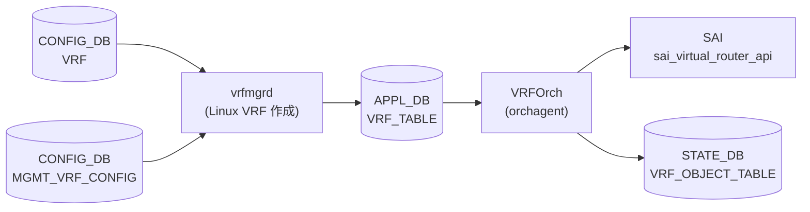

# APPL_DB VRF_TABLE (VRFOrch)

## 概要

`APPL_DB VRF_TABLE` は [VRF](../../reference/glossary.md#term-vrf) インスタンスの実効設定を保持する [APPL_DB](../../reference/glossary.md#term-appl_db) テーブル。テーブル名は `"VRF_TABLE"` (`schema.h:80`)。

パイプラインは 2 段構成:

1. **vrfmgrd** — `CONFIG_DB VRF` を購読し、Linux `ip link add ... type vrf table <id>` で VRF デバイスを作成した後、`kfvFieldsValues(t)` をそのまま `APP_VRF_TABLE` へ書き込む（デフォルト補完なし）
2. **VRFOrch** — `APP_VRF_TABLE` を購読し、フィールドを SAI 属性に変換して `sai_virtual_router_api->create_virtual_router()` を呼ぶ



## key 構造

```text
VRF_TABLE:<vrf_name>
```

`<vrf_name>` は CONFIG_DB `VRF` テーブルの key と同一。`Vrf` プレフィクス付きが通常（例: `VRF_TABLE:VrfRed`）。`mgmt` は例外として固定テーブル ID `6000` を使用。

## フィールド一覧

| フィールド | 型 | SAI 属性 | デフォルト | 説明 |
|-----------|----|---------|-----------|------|
| `v4` | boolean | `SAI_VIRTUAL_ROUTER_ATTR_ADMIN_V4_STATE` | SAI 依存 ※1 | IPv4 管理状態 |
| `v6` | boolean | `SAI_VIRTUAL_ROUTER_ATTR_ADMIN_V6_STATE` | SAI 依存 ※1 | IPv6 管理状態 |
| `src_mac` | MAC アドレス | `SAI_VIRTUAL_ROUTER_ATTR_SRC_MAC_ADDRESS` | SAI 依存 ※1 | 送信元 MAC |
| `ttl_action` | packet_action | `SAI_VIRTUAL_ROUTER_ATTR_VIOLATION_TTL1_PACKET_ACTION` | SAI 依存 ※1 | TTL=1 パケット処理 |
| `ip_opt_action` | packet_action | `SAI_VIRTUAL_ROUTER_ATTR_VIOLATION_IP_OPTIONS_PACKET_ACTION` | SAI 依存 ※1 | IP オプション違反処理 |
| `l3_mc_action` | packet_action | `SAI_VIRTUAL_ROUTER_ATTR_UNKNOWN_L3_MULTICAST_PACKET_ACTION` | SAI 依存 ※1 | 未知 L3 マルチキャスト処理 |
| `vni` | uint32 | SAI 非直接 ※2 | `0` | L3 VNI マッピング |
| `fallback` | boolean | なし ※3 | (dead) | フォールバック（未実装） |
| `mgmtVrfEnabled` | boolean | なし ※4 | (ignored) | mgmt VRF 有効フラグ |
| `in_band_mgmt_enabled` | boolean | なし ※4 | (ignored) | in-band mgmt 有効フラグ |

- ※1 フィールド省略時は SAI `create_virtual_router()` の attrs リストに含まれない → SAI / ASIC 側デフォルト値が適用される
- ※2 `vni` は SAI 属性に直接マップされず `updateVrfVNIMap()` 経由で VXLAN VRF マップに書く (vrforch.cpp:114)
- ※3 `fallback` は `vrforch.h` の `request_description` に宣言のみ、`addOperation` にハンドラなし → `SWSS_LOG_ERROR("Logic error: Unknown attribute")` で破棄 (dead field)
- ※4 `mgmtVrfEnabled` / `in_band_mgmt_enabled` は `SWSS_LOG_INFO("MGMT VRF field: %s ignored")` で明示的に無視 (vrforch.cpp:74-78)

<!-- defaults -->
## 暗黙デフォルト・コード由来挙動 (Phase A)

> 調査日 2026-05-15。ソース: `sonic-swss/orchagent/vrforch.cpp`, `sonic-swss/orchagent/vrforch.h`, `sonic-swss/cfgmgr/vrfmgr.cpp`, `sonic-swss-common/common/schema.h`

### v4 / v6 — SAI attrs 省略による ASIC 依存デフォルト

`v4`/`v6` フィールドが `APP_VRF_TABLE` に存在しない場合、VRFOrch は `attrs` ベクタに追加しない。`create_virtual_router()` 呼び出し時に `SAI_VIRTUAL_ROUTER_ATTR_ADMIN_V4_STATE` / `SAI_VIRTUAL_ROUTER_ATTR_ADMIN_V6_STATE` が省略される → SAI の実装依存デフォルト（多くの実装で `true`）が適用される。

```cpp
// vrforch.cpp:39-47
if (name == "v4")
{
    attr.id = SAI_VIRTUAL_ROUTER_ATTR_ADMIN_V4_STATE;
    attr.value.booldata = request.getAttrBool("v4");
}
else if (name == "v6")
{
    attr.id = SAI_VIRTUAL_ROUTER_ATTR_ADMIN_V6_STATE;
    attr.value.booldata = request.getAttrBool("v6");
}
```

これらフィールドは CONFIG_DB `sonic-vrf.yang` に定義がなく、通常の `config vrf add` では APP_VRF_TABLE に書かれない。VNETOrch が APP_DB に直接書き込む経路でのみ到達可能。

### vni — 実装デフォルト 0 (VNI なし)

```cpp
// vrforch.cpp:30
uint32_t vni = 0;
// vrforch.cpp:69-73
else if (name == "vni")
{
    vni = static_cast<uint32_t>(request.getAttrUint(name));
    continue;  // SAI attrs には追加しない
}
```

省略時は `vni = 0` のまま。`updateVrfVNIMap()` が `vni != 0` の場合のみ VXLAN マッピングを実行する (vrforch.cpp:111-119)。これは CONFIG_DB `sonic-vrf.yang` の `default 0` と一致する。

### fallback — dead field (silent discard)

`vrforch.h:34` で `{ "fallback", REQ_T_BOOL }` として `request_description` に宣言されているが、`vrforch.cpp::addOperation` に対応する分岐が存在しない。`else` ブランチに落ちて `SWSS_LOG_ERROR("Logic error: Unknown attribute: %s", name.c_str())` が出力され、フィールドは破棄される。

- SAI への影響: なし
- カーネルへの影響: なし（VRFOrch は Linux ルーティングを直接操作しない）
- **`fallback=true` に設定しても実際のフォールバック動作は発生しない**

### mgmtVrfEnabled / in_band_mgmt_enabled — 明示的 ignore

```cpp
// vrforch.cpp:74-78
else if ((name == "mgmtVrfEnabled") || (name == "in_band_mgmt_enabled"))
{
    SWSS_LOG_INFO("MGMT VRF field: %s ignored", name.c_str());
    continue;
}
```

SAI 処理に一切渡されない。mgmt VRF の SAI 表現は `gVirtualRouterId`（デフォルトルータ OID）で代用される。

### Linux ルーティングテーブル ID — CONFIG_DB 非表現のハードコード

vrfmgrd が管理するテーブル ID 割り当てルール（CONFIG_DB `VRF` テーブルのフィールドには出現しない）:

| 定数 | 値 | 意味 |
|------|----|------|
| `VRF_TABLE_START` | `1001` | 通常 VRF テーブル ID 開始 (vrfmgr.cpp:12) |
| `VRF_TABLE_END` | `5097` | 通常 VRF テーブル ID 終端 (vrfmgr.cpp:13) |
| `TABLE_LOCAL_PREF` | `1001` | `ip rule` local テーブル移動先 preference (vrfmgr.cpp:14) |
| `MGMT_VRF_TABLE_ID` | `6000` | `mgmt` VRF 専用固定テーブル ID (vrfmgr.cpp:15) |

最大同時 VRF 数は **4096** (5097 − 1001)。プール枯渇時は `getFreeTable()` が `0` を返し `ip link add` が失敗する。

### mgmt VRF 特例

`vrfName == "mgmt"` の場合:

- `ip link add mgmt type vrf table ...` は実行しない（hostcfgd 側で初期化済み前提）
- テーブル ID は `MGMT_VRF_TABLE_ID = 6000` を固定使用 (vrfmgr.cpp:180-183)
- APP_VRF_TABLE への書き込みは通常 VRF と同様に行われ、VRFOrch が SAI VR を作成する

### STATE_DB 書き戻し (orchagent → vrfmgrd 連携)

VRFOrch は VRF 作成/更新成功後に `STATE_VRF_OBJECT_TABLE|<vrf_name>` に `"state"="ok"` を書く (vrforch.cpp:120, 150)。削除時は `m_stateVrfObjectTable.del(vrf_name)` (vrforch.cpp:193)。vrfmgrd は `isVrfObjExist()` でこのフラグを参照し、VRF 削除の遅延タイミングを制御する。

<!-- /defaults -->

## 例外条件・特殊挙動

- **VRF 削除タイミング**: VRFOrch が STATE_VRF_OBJECT_TABLE のエントリを削除するまで vrfmgrd は `ip link del` を遅延する。INTERFACE / ROUTE テーブルが VRF を参照中の場合は `ref_count` が非ゼロで `delOperation` が `false` を返して再キュー。
- **VXLAN EVPN 未設定時の VNI**: `evpn_orch->getEVPNVtep()` が null を返す場合 `updateVrfVNIMap()` は `false` を返して VRF 作成を中断する (vrforch.cpp:228-230)。VNI 付き VRF は EVPN VTEP が先に設定されている必要がある。
- **VNI の SAI 非直接性**: VNI は `sai_virtual_router_api` には渡されない。VXLAN Tunnel Orch が VNI-VRF マッピングを別途管理する。

## 関連ページ

- [CONFIG_DB VRF テーブル](./vrf.md)
- [CONFIG_DB MGMT_VRF_CONFIG](./mgmt-vrf-config.md)
- [CONFIG_DB STATE_VRF](./state-vrf.md)
- [YANG: sonic-vrf](../yang/sonic-vrf.md)
- [CLI: config vrf](../cli/config-vrf.md)

## 引用元

[^1]: `sonic-swss/orchagent/vrforch.cpp` <https://github.com/sonic-net/sonic-swss/blob/master/orchagent/vrforch.cpp>
[^2]: `sonic-swss/orchagent/vrforch.h` <https://github.com/sonic-net/sonic-swss/blob/master/orchagent/vrforch.h>
[^3]: `sonic-swss/cfgmgr/vrfmgr.cpp` <https://github.com/sonic-net/sonic-swss/blob/master/cfgmgr/vrfmgr.cpp>
[^4]: `sonic-swss-common/common/schema.h` <https://github.com/sonic-net/sonic-swss-common/blob/master/common/schema.h>
