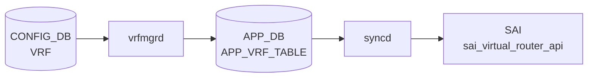

# VRF テーブル

## 概要

L3 トラフィック分離のための Virtual Routing and Forwarding インスタンスを定義する[^1]。`vrfmgrd` がこのテーブルを購読し、Linux [VRF](../../reference/glossary.md#term-vrf) (`ip vrf` / `cgroup`) を作成する。各種 `*_INTERFACE` テーブルから `vrf_name` で leafref 参照される。[EVPN](../../reference/glossary.md#term-evpn) [VXLAN](../../reference/glossary.md#term-vxlan) では `vni` を介して L3 VNI と紐付く。

<!-- cdb-mermaid -->
### データフロー (自動生成)



!!! note "凡例"
    CONFIG_DB から SAI までの典型経路を `docs/reference/config-db-orch-map.md` から機械生成したミニ図。詳細・例外は本ページ本文と対応表を参照。
<!-- /cdb-mermaid -->

## key 構造

```text
VRF|<name>
```

`<name>` は `Vrf` プレフィクス + `[a-zA-Z0-9_-]+` のパターン制約あり（例: `Vrf_blue`）。

## フィールド一覧

| フィールド | 型 | 必須 | デフォルト | 説明 |
|-----------|----|------|-----------|------|
| `name` (key) | string `Vrf<...>` | ✅ | - | [VRF](../../reference/glossary.md#term-vrf) 名 |
| `fallback` | boolean | - | `false` | 指定 [VRF](../../reference/glossary.md#term-vrf) からデフォルト経路へフォールバック |
| `vni` | uint32 (0..16777215) | - | `0` | この VRF にマップする L3 VNI |

## 購読者

- `vrfmgrd`: Linux VRF / cgroup を作成・破棄
- `intfmgrd`: 各 `*_INTERFACE` の `vrf_name` 参照を反映
- `bgpcfgd` / `frr-mgmt-framework`: `BGP_GLOBALS|<vrf>` と組合わせて [FRR](../../reference/glossary.md#term-frr) `vrf <name>` 設定生成
- `orchagent` `VRFOrch`: [SAI](../../reference/glossary.md#term-sai) VR (Virtual Router) を生成

## 関連 CONFIG_DB / YANG / CLI

- 関連 [CONFIG_DB](../../reference/glossary.md#term-config_db): `INTERFACE`、`VLAN_INTERFACE`、`PORTCHANNEL_INTERFACE`、`LOOPBACK_INTERFACE`、`BGP_GLOBALS`、`MGMT_VRF_CONFIG`
- 関連 CLI: `config vrf add/del`
- 関連 [YANG](../../reference/glossary.md#term-yang): `sonic-vrf`

<!-- value-behavior -->
## 値依存挙動マトリクス

| フィールド | 値 | 実挙動 |
|-----------|-----|--------|
| `fallback` | `false` | デフォルト。当該 VRF の経路テーブルのみ参照 |
| `fallback` | `true` | (dead field) `orchagent/vrforch.cpp` の `addOperation` に `"fallback"` のハンドラが存在せず silent drop されるため、実際の挙動変化なし。詳細は下記「暗黙デフォルト・コード由来挙動」セクション参照 |
| `vni` | `0` | L3 VNI マッピングなし（デフォルト、YANG default 0）|
| `vni` | `1`〜`16777215` | EVPN L3 VNI マッピングを設定。`vrfmgrd` が VXLAN_TUNNEL_MAP に `evpn_map_<vni>_<vrf>` エントリを作成 (vrfmgr.cpp:510) |
| `vni` | 重複 VNI | `vrfmgrd` が `"vni %d is already mapped to vrf %s"` でエラーして破棄 (vrfmgr.cpp:441) |
| `vni` | 既存 VRF の VNI 変更 | `"vrf %s is already mapped to vni %d"` でエラー。一旦 `vni=0` にしてから再設定必要 (vrfmgr.cpp:461) |
| `name` | `Vrf` で始まる | 有効。[sonic-cfggen](../../reference/glossary.md#term-sonic-cfggen) / [orchagent](../../reference/glossary.md#term-orchagent) が VRF として認識 |
| `name` | `Vrf` で始まらない | YANG `"Invalid VRF name"` エラーで reject |

<!-- /value-behavior -->

## 例外条件・特殊挙動 <!-- cdb-exceptions -->

<!-- evidence: sonic-swss/cfgmgr/vrfmgr.cpp; sonic-buildimage/src/sonic-yang-models/yang-models/sonic-vrf.yang -->

- **名前パターン (YANG)**: `pattern "Vrf[a-zA-Z0-9_-]+"` — 違反は `"Invalid VRF name"` エラーで reject される[^exc2]。
- **VNI 重複禁止**: 同じ VNI が別 VRF にマップ済みの場合 `vrfmgrd` は `SWSS_LOG_ERROR("vni %d is already mapped to vrf %s")` を記録してエントリを破棄する[^exc1]。
- **VRF への VNI 再マップ禁止**: 既に VNI が設定されている VRF に別の VNI を設定しようとすると `SWSS_LOG_ERROR("vrf %s is already mapped to vni %d")` でエラー[^exc1]。
- **削除遅延**: VRF 削除時に [orchagent](../../reference/glossary.md#term-orchagent) の VRF オブジェクトが残存している場合 `vrfmgrd` は削除をリトライ待ち（`isVrfObjExist()` チェック）[^exc1]。
- **Linux netdev 作成失敗**: `SWSS_LOG_ERROR("Failed to create vrf netdev")` を記録[^exc1]。
- **VNI マップ設定失敗**: `SWSS_LOG_ERROR("VRF VNI Map Config Failed")` を記録してエントリを破棄[^exc1]。
- **デフォルト補完**: `fallback` のデフォルト `false`、`vni` のデフォルト `0`（マッピングなし）[^exc2]。

[^exc1]: `sonic-swss/cfgmgr/vrfmgr.cpp` <https://github.com/sonic-net/sonic-swss/blob/master/cfgmgr/vrfmgr.cpp>
[^exc2]: `sonic-buildimage/src/sonic-yang-models/yang-models/sonic-vrf.yang` <https://github.com/sonic-net/sonic-buildimage/blob/master/src/sonic-yang-models/yang-models/sonic-vrf.yang>

<!-- ref-triangle:start -->

## 関連リファレンス

- [YANG](../../reference/glossary.md#term-yang): [`sonic-vrf`](../yang/sonic-vrf.md)
- CLI: [`config vrf`](../cli/config-vrf.md)

<!-- ref-triangle:end -->

## 引用元

[^1]: [YANG](../../reference/glossary.md#term-yang) 定義: `sonic-vrf.yang`. <https://github.com/sonic-net/sonic-buildimage/blob/9ea932ec2e18f35e58268ec2e4456b1d4afd65cd/src/sonic-yang-models/yang-models/sonic-vrf.yang>

## 関連ページ
- [HLD: VRF サポート](../../routing/sonic-vrf-support-design-spec-draft.md)
- [CLI: config vrf](../cli/config-vrf.md)
- [CLI: config interface](../cli/config-interface.md)
- [YANG: sonic-vrf](../yang/sonic-vrf.md)

<!-- ops-hint -->
## 運用ヒント

### 典型値

- key 形式: `VRF|Vrf<name>` (例 `VRF|VrfRed`)。
- `vni`: L3 VNI（[VXLAN](../../reference/glossary.md#term-vxlan) [EVPN](../../reference/glossary.md#term-evpn) tenant L3）。
- `fallback`: `true` に設定しても実際には dead field であり動作変化なし（詳細は「暗黙デフォルト・コード由来挙動」参照）。

### よくある誤設定

- VRF 名が `Vrf` で始まらないと [sonic-cfggen](../../reference/glossary.md#term-sonic-cfggen) / [orchagent](../../reference/glossary.md#term-orchagent) が認識しない。
- `vni` を tenant 間で重複させると [EVPN](../../reference/glossary.md#term-evpn) route が混線する。

### 確認コマンド

```bash
sonic-db-cli CONFIG_DB keys 'VRF|*'
show vrf
ip vrf show
```
<!-- /ops-hint -->

<!-- runtime-trace -->
## CDB → 実コンテナ動作トレース

### 段階 1: Consumer 登録

- **orchagent / VrfOrch** (`sonic-swss/orchagent/vrforch.cpp`): [APPL_DB](../../reference/glossary.md#term-appl_db) の `VRF_TABLE` を `ConsumerStateTable` で購読 (`Orch2(appDb, APP_VRF_TABLE_NAME)`)。[CONFIG_DB](../../reference/glossary.md#term-config_db) の `VRF` テーブルは直接購読しない。
- **[vrfmgrd](../../reference/glossary.md#term-vrfmgrd)** (`sonic-swss/cfgmgr/vrfmgr.cpp`): `VRF` テーブルを購読して Linux VRF デバイスを管理。

### 段階 2: CFG → APPL 翻訳

- [vrfmgrd](../../reference/glossary.md#term-vrfmgrd) が `ip vrf add <name>` でカーネル VRF デバイスを作成し APP_DB `VRF_TABLE` に書き込む。

### 段階 3: APPL → SAI

- VrfOrch が APP_DB を読み `sai_virtual_router_api->create_virtual_router()` でハードウェア VRF を作成。
- VRF OID は後続の INTERFACE / ROUTE テーブル処理で使用される。

### 段階 4: タイミング + 副作用

- カーネル VRF 作成 ([vrfmgrd](../../reference/glossary.md#term-vrfmgrd)) と [SAI](../../reference/glossary.md#term-sai) VRF 作成 (VrfOrch) はほぼ同時。
- 副作用: VRF 削除時は所属インタフェース・ルートを先に削除しないと `VRF is in use` エラー。

<!-- /runtime-trace -->
<!-- entry-points -->
## 書き込み入り口 (Direction A)

VRF テーブルへの書き込みが発生するコード経路を網羅的に調査した結果。

### CLI

  - `config vrf add/del <name>` — `config/main.py` が `set_entry('VRF', vrf_name, {'NULL': 'NULL'})` を呼ぶ ([sonic-utilities](../../reference/glossary.md#term-sonic-utilities)/config/main.py:7698, 7731)
  - `config vrf add_vrf_vni_map/del_vrf_vni_map <name>` — `config/main.py` が `mod_entry('VRF', vrfname, {'vni': vni})` を呼ぶ ([sonic-utilities](../../reference/glossary.md#term-sonic-utilities)/config/main.py:7774, 7784)

### minigraph / sonic-cfggen

**minigraph.py** が VRF エントリを生成し投入 ([sonic-buildimage](../../reference/glossary.md#term-sonic-buildimage)/src/sonic-config-engine/minigraph.py)

### REST / gNMI

REST/[gNMI](../../reference/glossary.md#term-gnmi) 書き込み経路なし

### db_migrator

db_migrator.py での VRF マイグレーションなし

### ビルド時デフォルト (build-time default)

なし

### ハードコードデフォルト / ランタイム注入

なし

### 死活・デッドコード

なし
<!-- /entry-points -->

<!-- defaults -->
## 暗黙デフォルト・コード由来挙動 (Phase A)

> 調査日 2026-05-14。ソース: `sonic-swss/cfgmgr/vrfmgr.cpp`, `sonic-swss/orchagent/vrforch.cpp`, `sonic-swss/orchagent/vrforch.h`, `sonic-buildimage/src/sonic-yang-models/yang-models/sonic-vrf.yang`

### fallback — dead field (silent drop at orchagent)

`fallback` は YANG で `default false` として定義されており、vrfmgrd は `kfvFieldsValues(t)` をそのまま APP_DB へ pass-through する (`vrfmgr.cpp:303`)。しかし `orchagent/vrforch.cpp` の `addOperation` には `"fallback"` のハンドラが存在せず、`SWSS_LOG_ERROR("Logic error: Unknown attribute")` が出てフィールドが silent drop される。[bgpcfgd](../../reference/glossary.md#term-bgpcfgd)/[FRR](../../reference/glossary.md#term-frr) テンプレートでも `fallback` を参照するコードは存在しない。**実質的に dead field であり、`true` に設定しても Linux カーネル・[SAI](../../reference/glossary.md#term-sai)・[FRR](../../reference/glossary.md#term-frr) のいずれにも影響しない。**

- `vrforch.h:34`: `{ "fallback", REQ_T_BOOL }` — 宣言のみ
- `vrforch.cpp` addOperation: `"fallback"` の分岐なし → else branch で `SWSS_LOG_ERROR` → フィールド破棄

### vni — YANG default と実装デフォルトが一致

省略時は vrfmgr.cpp:418 で `uint32_t vni = 0;`、vrforch.cpp:30 でも `uint32_t vni = 0;` として初期化される。YANG `default 0` と一致。VNI マッピングなしの状態をコード的にも `0` で表現する。

### Linux ルーティングテーブル割り当て (ハードコード・CONFIG_DB 非表現)

vrfmgrd は VRF ごとに Linux ルーティングテーブル ID を自動割り当てする。このロジックは [CONFIG_DB](../../reference/glossary.md#term-config_db) フィールドには一切現れない。

| 定数 | 値 | 意味 |
|------|----|------|
| `VRF_TABLE_START` | `1001` | 通常 VRF テーブル ID 開始 (vrfmgr.cpp:12) |
| `VRF_TABLE_END` | `5097` | 通常 VRF テーブル ID 終端 (vrfmgr.cpp:13) |
| `TABLE_LOCAL_PREF` | `1001` | local テーブル移動先 preference (vrfmgr.cpp:14) |
| `MGMT_VRF_TABLE_ID` | `6000` | `mgmt` VRF 専用テーブル ID (vrfmgr.cpp:15) |

最大同時 VRF 数は **4096** (5097 − 1001)。超過時 `getFreeTable()` が `0` を返して Linux VRF デバイス作成失敗。

### mgmt VRF 特例 (プラットフォーム依存)

`vrfName == "mgmt"` の場合、通常の free テーブルプールを使わず固定 ID `6000` を使用し (`vrfmgr.cpp:180-183`)、Linux VRF デバイスの `ip link add` も実行しない。mgmt VRF は [hostcfgd](../../reference/glossary.md#term-hostcfgd) 側で初期化済みの前提。

### orchagent 内部フィールド (YANG 未定義・CONFIG_DB 非経由)

`vrforch.h` には `v4`/`v6`/`src_mac`/`ttl_action`/`ip_opt_action`/`l3_mc_action` が宣言されており、orchagent で SAI 属性に変換される実装がある。しかし **YANG `sonic-vrf.yang` には存在せず**、通常の `config vrf add` で CONFIG_DB に書かれることはない。[VNET](../../reference/glossary.md#term-vnet) テーブル経由で APP_DB に直接書き込まれた場合のみ機能する残存コード。

<!-- /defaults -->

<!-- ordering -->
## 書込み順依存 (Phase B)

> 調査日 2026-05-15。ソース: `sonic-swss/cfgmgr/vrfmgr.cpp`, `sonic-swss/orchagent/vrforch.cpp`, `sonic-swss/cfgmgr/intfmgr.cpp`, `sonic-utilities/config/main.py`

### CREATE 順序

| ステップ | 書込み対象 | 理由 |
|---------|-----------|------|
| 1 | `VXLAN_TUNNEL` | EVPN L3 VNI を使う場合のみ |
| 2 | `VXLAN_TUNNEL_MAP` ([VLAN](../../reference/glossary.md#term-vlan)-VNI エントリ) | `VRF.vni` の前提条件。CLI が存在確認 (main.py:7759) |
| 3 | **`VRF\|<name>`** | Linux VRF デバイス作成。vrfmgrd が [STATE_DB](../../reference/glossary.md#term-state_db) に `state=ok` を書く (vrfmgr.cpp:289) |
| 4 | `VRF\|<name>.vni` (mod_entry) | VRF 作成後かつ VXLAN_TUNNEL_MAP 確認後に設定 (main.py:7774) |
| 5 | `*_INTERFACE\|<port>` (vrf_name 指定) | [intfmgrd](../../reference/glossary.md#term-intfmgrd) が `isIntfStateOk(vrf_name)` で VRF の [STATE_DB](../../reference/glossary.md#term-state_db) ready を確認してから処理 (intfmgr.cpp:839) |
| 6 | `BGP_GLOBALS\|<vrf_name>` | Linux VRF デバイス作成後が推奨。逆順でも FRR 側で retry されるがタイムアウト依存になる |

### DELETE 順序

| ステップ | 書込み対象 | 理由 |
|---------|-----------|------|
| 1 | `SYSLOG_SERVER` (VRF 参照エントリ) | CLI が参照存在時に削除を拒否 (main.py:7712-7717) |
| 2 | `BGP_GLOBALS\|<vrf_name>` DEL | FRR VRF 設定を先に解除 |
| 3 | ROUTE テーブルの VRF 内全ルート DEL | routeorch が `decreaseVrfRefCount` を呼ぶまで ref_count が残る (routeorch.cpp:2773) |
| 4 | `*_INTERFACE\|<port>` (vrf_name 参照ロウ) DEL | [intfsorch](../../reference/glossary.md#term-intfsorch) が `decreaseVrfRefCount` を呼ぶ ([intfsorch](../../reference/glossary.md#term-intfsorch).cpp:640)。CLI は自動処理 (main.py:7729) |
| 5 | `VRF\|<name>.vni` を 0 に SET | VNI マッピング解除 (vrfmgr.cpp:337)。CLI `del_vrf_vni_map` が自動実行 |
| 6 | **`VRF\|<name>`** DEL | orchagent の ref_count が 0 になると VRFOrch が SAI VR を削除し STATE_VRF_OBJECT_TABLE を消去。vrfmgrd がそれを確認して Linux デバイスを削除 (vrfmgr.cpp:331-346) |

### SAI virtual_router 作成順序 (vrforch.cpp)

`VRFOrch::addOperation` (vrforch.cpp:27–155) が SAI VR を作成する際の内部シーケンス:

1. `vrf_table_.find(vrf_name) == end` → 新規作成パス
2. `sai_virtual_router_api->create_virtual_router(&router_id, ...)` — SAI VR オブジェクト生成 (vrforch.cpp:93)
3. `vrf_table_[vrf_name].vrf_id = router_id; ref_count = 0` — 内部テーブル登録 (vrforch.cpp:107–108)
4. `gFlowCounterRouteOrch->onAddVR(router_id)` — フローカウンタ登録 (vrforch.cpp:110)
5. `vni != 0` の場合 `updateVrfVNIMap()` → EVPN [VTEP](../../reference/glossary.md#term-vtep) 存在確認 → `vrf_vni_map_table_` 更新 (vrforch.cpp:111–118)
6. `m_stateVrfObjectTable.hset(vrf_name, "state", "ok")` — [STATE_DB](../../reference/glossary.md#term-state_db) に SAI VR 完了を通知 (vrforch.cpp:120)

**依存**: SAI VR 作成が完了し STATE_DB `VRF_OBJECT_TABLE|<name>` に `state=ok` が書かれるまで、`intfsorch` は `isVRFexists()` をブロックとして使用し、ROUTE/NEIGHBOR の処理は SAI VR OID (`vrf_id`) が確立するまで待機する。

### ROUTE / NEIGHBOR からの参照順序

`vrf_table_[name].ref_count` を増減する orchagent コンポーネント (vrforch.h:91–119):

| orchagent | 増加 (increaseVrfRefCount) | 減少 (decreaseVrfRefCount) |
|-----------|--------------------------|--------------------------|
| `intfsorch.cpp:504` | インタフェース VRF bind | — |
| `intfsorch.cpp:640` | — | インタフェース VRF unbind |
| `intfsorch.cpp:848,855` | VRF 変更時の新 VRF | 旧 VRF unbind |
| `intfsorch.cpp:1057` | — | インタフェース削除時 |
| `routeorch.cpp:2013` | ROUTE 追加 | — |
| `routeorch.cpp:2773,2993` | — | ROUTE 削除 |
| `mplsrouteorch.cpp:474` | [MPLS](../../reference/glossary.md#term-mpls) ROUTE 追加 | — |
| `mplsrouteorch.cpp:957` | — | [MPLS](../../reference/glossary.md#term-mpls) ROUTE 削除 |
| `srv6orch.cpp:1639` | [SRv6](../../reference/glossary.md#term-srv6) SID 追加 | — |
| `srv6orch.cpp:1683` | — | [SRv6](../../reference/glossary.md#term-srv6) SID 削除 |
| `fgnhgorch.cpp:1326` | FG-NHG 追加 | — |
| `fgnhgorch.cpp:1612` | — | FG-NHG 削除 |

NEIGHBOR（neigh エントリ）は VRF の ref_count を直接操作しない。NEIGHBOR が解決する際にはインタフェース VRF bind が先行している前提であり、NEIGHBOR 削除だけでは ref_count は減少しない。

**CREATE 順序依存**: ROUTE を追加する前に VRF が SAI VR として確立済みである必要がある（routeorch は VRF OID を `m_vrfOrch->getVRFid(vrf_name)` で参照する）。VRF が未確立の場合は routeorch がキューに残す。

**DELETE 順序依存**: VRF DEL 前に ROUTE・INTERFACE・[MPLS](../../reference/glossary.md#term-mpls) ROUTE・[SRv6](../../reference/glossary.md#term-srv6) SID・FG-NHG を先にすべて削除して ref_count を 0 にする必要がある。NEIGHBOR エントリは ref_count に影響しないが、インタフェースを削除すると関連 NEIGHBOR も消える。

### 重要な挙動

- **ref_count ガード**: `VRF|<name>` DEL は orchagent 内で `vrf_table_[name].ref_count == 0` になるまで `delOperation` が `return false` を返し続ける (vrforch.cpp:169)。所属インタフェース・ルート・MPLS ルート・SRv6 SID をすべて削除してから VRF を DEL すること。
- **STATE_DB ready 待機**: `*_INTERFACE` への `vrf_name` 指定は、vrfmgrd が `STATE_DB.VRF_TABLE|<name>` に `state=ok` を書くまで Consumer キューで待機する。逆順でも最終収束するが、VRF 作成が完了するまでインタフェース設定は適用されない。
- **mgmt VRF 特例**: `MGMT_VRF_CONFIG|vrf_global.mgmtVrfEnabled=true` による mgmt VRF は [hostcfgd](../../reference/glossary.md#term-hostcfgd) の初期化済みを前提とし、Linux VRF デバイス `ip link add` をスキップする (vrfmgr.cpp:176-183)。通常の `VRF` テーブル書込みとは別経路。
- **VNI 変更制限**: 既に VNI が設定されている VRF に別 VNI を上書きすることは不可。一旦 `vni=0` に SET してから新 VNI を SET する必要がある (vrfmgr.cpp:459-463)。
- **SAI VR 削除シーケンス**: `delOperation` で `ref_count == 0` 確認後 `remove_virtual_router` → `vrf_table_.erase` → `delVrfVNIMap` → `m_stateVrfObjectTable.del()` の順に実行される (vrforch.cpp:173–193)。STATE_DB `VRF_OBJECT_TABLE` 消去が vrfmgrd の Linux VRF デバイス削除トリガになる。

<!-- /ordering -->

<!-- cross-refs -->
## 暗黙参照テーブル (Phase C)

> 調査日 2026-05-16。ソース: `sonic-swss/cfgmgr/vrfmgr.cpp`, `sonic-swss/orchagent/vrforch.cpp`, `sonic-swss/cfgmgr/intfmgr.cpp`, `sonic-buildimage/src/sonic-yang-models/yang-models/sonic-vrf.yang`

### `STATE_VRF_TABLE` (STATE_DB) — readiness sentinel

各 `*_INTERFACE` テーブルで `vrf_name` が指定されたとき、`intfmgrd` は `STATE_DB::STATE_VRF_TABLE` に VRF が登録済みであることを `isIntfStateOk(vrf_name)` で確認する（`intfmgr.cpp:671-684`）。未登録なら SET をスキップして Consumer キューに残す。orchagent 側も `isVRFexists(vrf_name)` で VRF OID 存在を確認する（`intfsorch.cpp:826-830`）。YANG leafref `VRF.name` は静的参照だが、この STATE_DB 依存は実行時ガードとして機能する。

### `VRF_OBJECT_TABLE` (STATE_DB) — 削除同期 sentinel

`orchagent/VRFOrch` が SAI Virtual Router 作成成功後に `STATE_VRF_OBJECT_TABLE|<name>` へ `state=ok` を書き込む。`vrfmgrd` は VRF 削除前に `isVrfObjExist()` でこのエントリを確認し、orchagent 側 SAI オブジェクトが残存する間は削除をリトライ待ちにする。VRF テーブル設定には一切現れない 2 フェーズ非同期削除の同期機構。

### `MGMT_VRF_CONFIG` (CONFIG_DB) — mgmt VRF 特例制御

`vrfmgrd` は `MGMT_VRF_CONFIG|vrf_global` の `mgmtVrfEnabled` と `in_band_mgmt_enabled` を参照し、いずれかが `false` のとき `VRF` テーブルへの SET を DEL として上書き処理する（`vrfmgr.cpp:257`）。`mgmt` VRF は通常プール（1001–5096）を使わず固定 ID `6000` を割り当てる（`vrfmgr.cpp:180-183`）。この制御ロジックは `VRF` テーブルフィールドには一切現れない。

### `VXLAN_TUNNEL_MAP` (CONFIG_DB) — `vni` 設定の副作用 WRITE

`VRF.vni` に非ゼロ値を設定すると、`vrfmgrd` が自動で `VXLAN_TUNNEL_MAP` に `evpn_map_<vni>_<vrf>` エントリを作成する（`vrfmgr.cpp:510`）。`vni=0` に戻すと対応エントリが削除される。`VRF` テーブルの `vni` フィールド変更が別テーブルを書き換えるという暗黙の副作用。

### YANG leafref 被参照テーブル

以下のテーブルは `vrf_name` フィールドで `VRF.name` を leafref 参照する。`VRF` エントリが削除されると orphan になり、各 consumer がエラーを返す。

| 被参照テーブル | leafref フィールド | orphan 時の影響 |
|--------------|------------------|---------------|
| `INTERFACE` | `vrf_name` | [intfmgrd](../../reference/glossary.md#term-intfmgrd) / [intfsorch](../../reference/glossary.md#term-intfsorch) が VRF not found エラー |
| `VLAN_INTERFACE` | `vrf_name` | 同上 |
| `PORTCHANNEL_INTERFACE` | `vrf_name` | 同上 |
| `LOOPBACK_INTERFACE` | `vrf_name` | 同上 |
| `VLAN_SUB_INTERFACE` | `vrf_name` | 同上 |
| `BGP_GLOBALS` | key `<vrf_name>` | [bgpcfgd](../../reference/glossary.md#term-bgpcfgd) が `"non-default VRF {} was not configured"` エラー |

### key 埋め込み参照（leafref 非強制）

`STATIC_ROUTE|<vrf_name>|<prefix>` および `PIM_GLOBALS|<vrf>|<af>` / `PIM_INTERFACE|<vrf>|<af>|<interface>` は key に VRF 名を直接埋め込む形式。YANG leafref による強制バリデーションはなく、VRF が存在しなくても CONFIG_DB への書き込みは成功するが、各 manager（staticroutemgrd、frr-mgmt-framework）が FRR への反映で失敗する。

### Linux ルーティングテーブル ID（隠れたリソース上限）

`vrfmgrd` は VRF 追加のたびに Linux カーネルのルーティングテーブル ID（`VRF_TABLE_START=1001` 〜 `VRF_TABLE_END=5097`）を消費する。CONFIG_DB フィールドに現れない外部リソースで、最大 4096 VRF を超えると `getFreeTable()=0` となり Linux VRF デバイス作成が失敗する。

### `FlowCounterRouteOrch` — VR 作成/削除時の ROUTE フローカウンタ登録（vrforch.cpp 由来）

`VRFOrch::addOperation` は SAI Virtual Router 作成成功直後に `gFlowCounterRouteOrch->onAddVR(router_id)` を呼び出し、`delOperation` では `gFlowCounterRouteOrch->onRemoveVR(router_id)` を呼び出す（`vrforch.cpp:110, 184`）。これにより `FLEX_COUNTER_TABLE` や `COUNTERS_DB` 上の ROUTE フローカウンタエントリが VRF の生死に連動して自動登録・解除される。CONFIG_DB `VRF` テーブルに対応フィールドは存在せず、VRF 追加/削除という操作自体が暗黙的に ROUTE カウンタリソースに副作用を及ぼす。

### `EvpnNvoOrch` / `VXLAN_EVPN_NVO` — VNI マッピング前提条件（vrforch.cpp 由来）

`VRFOrch::updateVrfVNIMap` は VNI 非ゼロ設定時に `gDirectory.get<EvpnNvoOrch*>()->getEVPNVtep()` を呼び出し、EVPN [VTEP](../../reference/glossary.md#term-vtep) が未設定の場合 `return false` でエントリを破棄する（`vrforch.cpp:225-229`）。`VXLAN_EVPN_NVO` テーブルに有効な NVO エントリが存在しない限り `VRF.vni` の設定は orchagent 側で無効化される。CONFIG_DB の `VRF` テーブルには `vni` フィールドしか見えないが、実際には `VXLAN_EVPN_NVO` への暗黙依存がある。

### `VxlanTunnelOrch` / `PortsOrch` — VLAN-VNI マッピングと kernel netns L3 VNI（vrforch.cpp 由来）

VNI マッピング設定時、`VRFOrch::updateVrfVNIMap` は `gDirectory.get<VxlanTunnelOrch*>()->getVlanMappedToVni(vni)` で対応 [VLAN](../../reference/glossary.md#term-vlan) ID を取得し（`vrforch.cpp:233`）、[VLAN](../../reference/glossary.md#term-vlan) が存在する場合は `gPortsOrch->updateL3VniStatus(vlan_id, true)` で Linux カーネルの VLAN インタフェース（VE）を L3 VNI として有効化する（`vrforch.cpp:239`）。削除時は `updateL3VniStatus(vlan_id, false)` で無効化（`vrforch.cpp:267`）。`VLAN_INTERFACE` テーブルおよびカーネルの netns 状態が `VRF.vni` 設定の副作用として変化するが、CONFIG_DB の `VRF` テーブルには一切現れない暗黙の連携。

<!-- /cross-refs -->

<!-- failure -->
## 失敗挙動・リトライ・回復 (Phase D)

> 調査日 2026-05-15。ソース: `sonic-swss/cfgmgr/vrfmgr.cpp`, `sonic-swss/orchagent/vrforch.cpp`, `sonic-swss/orchagent/saihelper.cpp`

### vrfmgrd 側の失敗処理

vrfmgrd は失敗時に基本的にエントリを即破棄する。唯一の例外は VRF DEL 時のパッシブリトライ。

| 失敗シナリオ | コード参照 | 挙動 |
|------------|-----------|------|
| Linux netdev 作成失敗 (`ip link add` エラー / テーブル枯渇) | vrfmgr.cpp:281-284 | `SWSS_LOG_ERROR("Failed to create vrf netdev %s")` → エントリ破棄。リトライなし |
| テーブル枯渇 (4096 VRF 超過) | vrfmgr.cpp:185-188 | `getFreeTable()` が 0 を返す → `setLink()` false → エントリ破棄。既存 VRF 削除後に再投入が必要 |
| VNI マップ設定失敗 | vrfmgr.cpp:295-301 | `SWSS_LOG_ERROR("VRF VNI Map Config Failed")` → エントリ破棄 |
| VNI 重複 | vrfmgr.cpp:441-443 | `SWSS_LOG_ERROR("vni %d is already mapped to vrf %s")` → 即破棄 |
| VNI 上書き禁止 | vrfmgr.cpp:461-463 | `SWSS_LOG_ERROR("vrf %s is already mapped to vni %d")` → 即破棄。`vni=0` リセット後に再設定が必要 |

### vrfmgrd DEL のパッシブリトライ

VRF 削除時、orchagent が SAI VR を削除するまで vrfmgrd はループをスキップしてキュー内で待機し続ける。これが唯一のリトライ機構。

```cpp
// vrfmgr.cpp:331-334: VRFOrch の STATE_DB 消去を待つ
if (!isVrfObjExist(vrfName))
{
    it++;   // erase せず次回ループで再試行
    continue;
}
```

- `isVrfObjExist()` は `STATE_DB.VRF_OBJECT_TABLE|<vrfName>` を参照
- VRFOrch が `m_stateVrfObjectTable.del(vrfName)` を呼ぶまで無制限に待機
- タイムアウトなし

### orchagent (VRFOrch) の不正属性・存在しない VRF

`VRFOrch::addOperation` のフィールドループで認識できないフィールド名が来た場合、エラーログを出力して当該フィールドを **スキップし処理を継続する**（エントリ全体は破棄されない）。

```cpp
// vrforch.cpp:80-83
SWSS_LOG_ERROR("Logic error: Unknown attribute: %s", name.c_str());
continue;   // attrs に push せず次フィールドへ
```

- `fallback` フィールドはこのパスに落ちる（Phase A で確認済み）
- 不明フィールドがあっても `sai_virtual_router_api->create_virtual_router()` は残りの有効属性で呼ばれる

`VRFOrch::delOperation` で対象 VRF が `vrf_table_` に存在しない場合は `SWSS_LOG_ERROR("VRF '%s' doesn't exist")` を出力して `true` を返す（**成功扱い・no-op**）。リトライなし、エントリ破棄もなし。

```cpp
// vrforch.cpp:163-167
if (vrf_table_.find(vrf_name) == std::end(vrf_table_))
{
    SWSS_LOG_ERROR("VRF '%s' doesn't exist", vrf_name.c_str());
    return true;
}
```

### orchagent (VRFOrch) の task_need_retry

`VRFOrch::addOperation` の SAI create / set 失敗、`delOperation` の SAI remove 失敗は `handleSai*Status` → `parseHandleSaiStatusFailure` を通じてリトライ判定される。

```
parseHandleSaiStatusFailure(task_need_retry) → false  → Consumer キューに残留、次回再試行
parseHandleSaiStatusFailure(task_failed)     → true   → エントリ破棄
```

| SAI ステータス | create/set | remove | 実効挙動 |
|--------------|-----------|--------|---------|
| `SAI_STATUS_INSUFFICIENT_RESOURCES` / `TABLE_FULL` / `NO_MEMORY` / `NV_STORAGE_FULL` | `task_need_retry` | `task_success` (警告のみ) | create/set: 自動再試行 |
| `SAI_STATUS_OBJECT_IN_USE` | `task_success` (警告のみ) | `task_need_retry` | remove: `OBJECT_IN_USE` 解消まで自動再試行 |
| その他エラー | `task_failed` | `task_failed` | エントリ破棄 + `handleSaiFailure` 呼び出し |

### ref_count ガード (DEL ブロック)

orchagent は VRF に参照カウンタを持ち、ゼロになるまで DEL をブロックする。

```cpp
// vrforch.cpp:169-170
if (vrf_table_[vrf_name].ref_count)
    return false;  // Consumer キューに残留
```

- `intfsorch.cpp:640` (インタフェース削除) / `routeorch.cpp:2773` (ルート削除) が `decreaseVrfRefCount` を呼ぶ
- 所属インタフェース・ルート・MPLS ルート・SRv6 SID を先にすべて削除すること

### 失敗挙動まとめ

| シナリオ | 発生場所 | リトライ | 回復操作 |
|---------|---------|---------|---------|
| netdev 作成失敗 | vrfmgrd | なし | CONFIG_DB 再投入 |
| 4096 VRF 超過 | vrfmgrd | なし | 既存 VRF 削除後に再投入 |
| VNI 重複 | vrfmgrd | なし | 重複 VNI 解除後に再設定 |
| VNI 上書き | vrfmgrd | なし | `vni=0` リセット → 新 VNI 設定 |
| VRF DEL (orchagent 未削除) | vrfmgrd | passive (無制限) | orchagent の ref_count ゼロを待つ |
| 不明属性フィールド | orchagent | なし (フィールドスキップ、エントリ継続) | 有効フィールドのみで SAI create が進む |
| DEL 対象 VRF 不在 | orchagent | なし (no-op、success 扱い) | 冪等操作のため何もしなくてよい |
| SAI create リソース不足 | orchagent | task_need_retry (自動) | リソース解放後に自動回復 |
| SAI remove OBJECT_IN_USE | orchagent | task_need_retry (自動) | 参照オブジェクト削除後に自動回復 |
| ref_count > 0 で VRF DEL | orchagent | passive (無制限) | インタフェース・ルートを先に削除 |

<!-- /failure -->

<!-- constants -->
## ハードコード定数 (Phase E)

> 調査日 2026-05-16。ソース: `sonic-swss/cfgmgr/vrfmgr.cpp`, `sonic-swss/orchagent/vrforch.cpp`, `sonic-swss/orchagent/nexthopkey.h`

### Linux ルーティングテーブル ID 定数

vrfmgrd は VRF ごとに Linux カーネルのルーティングテーブル ID を自動割り当てする。これらの値は CONFIG_DB フィールドに一切現れない内部定数。

| 定数名 | 値 | 意味 | ソース |
|--------|-----|------|--------|
| `VRF_TABLE_START` | `1001` | 通常 VRF に割り当てる table ID の開始値 | `vrfmgr.cpp:12` |
| `VRF_TABLE_END` | `5097` | 通常 VRF に割り当てる table ID の終端値（排他） | `vrfmgr.cpp:13` |
| `TABLE_LOCAL_PREF` | `1001` | `ip rule` で local テーブルを移動する preference 値 | `vrfmgr.cpp:14` |
| `MGMT_VRF_TABLE_ID` | `6000` | `mgmt` VRF 専用の固定 table ID（通常プール外） | `vrfmgr.cpp:15` |

**最大同時 VRF 数**: `VRF_TABLE_END - VRF_TABLE_START = 4096`。超過すると `getFreeTable()` が `0` を返し、Linux VRF デバイス作成が失敗する（`vrfmgr.cpp:185-188`）。VRF 削除により `recycleTable()` でプールに返却される。

### リトライ定数

vrfmgrd にはタイムアウト定数が存在しない。VRF DEL 時のパッシブリトライは **タイムアウトなし・無制限**。`isVrfObjExist()` が `true` を返す（orchagent 側の SAI オブジェクトが残存する）間、Consumer キューをスキップして次回ループで再試行し続ける。

### VNI デフォルト定数

| 変数 | 値 | ソース |
|------|-----|--------|
| `uint32_t vni = 0`（vrfmgrd 初期化） | `0` | `vrfmgr.cpp:418` |
| `uint32_t vni = 0`（orchagent 初期化） | `0` | `vrforch.cpp:30` |

YANG `default 0` と一致。VNI 上限 `16777215` は YANG `range "0..16777215"` による制約であり、vrfmgr.cpp 内にマジックナンバーとして現れない。

### orchagent (vrforch.cpp) — VRF 名プレフィクス定数

VRF 名の識別に使われるプレフィクスは `nexthopkey.h` にマクロとして定義されている。

| 定数名 | 値 | 意味 | ソース |
|--------|-----|------|--------|
| `VRF_PREFIX` | `"Vrf"` | VRF 名の先頭プレフィクス。routeorch / mplsrouteorch が `compare(0, strlen(VRF_PREFIX), VRF_PREFIX)` で VRF ルートを識別 | `nexthopkey.h:20` |

YANG `sonic-vrf.yang` も `pattern "Vrf[a-zA-Z0-9_-]+"` で同値を強制している。

### orchagent (vrforch.cpp) — SAI virtual_router_attr マッピング

`VRFOrch::addOperation` は APP_DB フィールドを以下の SAI 属性にマッピングする（`vrforch.cpp:38-84`）。これらは CONFIG_DB `VRF` テーブルフィールドには存在せず、[VNET](../../reference/glossary.md#term-vnet) テーブル経由の APP_DB 直接書込み時のみ機能する。

| APP_DB フィールド | SAI 属性 | SAI 値型 | ソース |
|-----------------|---------|---------|--------|
| `v4` | `SAI_VIRTUAL_ROUTER_ATTR_ADMIN_V4_STATE` | `bool` | `vrforch.cpp:40-41` |
| `v6` | `SAI_VIRTUAL_ROUTER_ATTR_ADMIN_V6_STATE` | `bool` | `vrforch.cpp:45-46` |
| `src_mac` | `SAI_VIRTUAL_ROUTER_ATTR_SRC_MAC_ADDRESS` | `sai_mac_t` | `vrforch.cpp:51-52` |
| `ttl_action` | `SAI_VIRTUAL_ROUTER_ATTR_VIOLATION_TTL1_PACKET_ACTION` | `sai_packet_action_t` | `vrforch.cpp:56-57` |
| `ip_opt_action` | `SAI_VIRTUAL_ROUTER_ATTR_VIOLATION_IP_OPTIONS_PACKET_ACTION` | `sai_packet_action_t` | `vrforch.cpp:61-62` |
| `l3_mc_action` | `SAI_VIRTUAL_ROUTER_ATTR_UNKNOWN_L3_MULTICAST_PACKET_ACTION` | `sai_packet_action_t` | `vrforch.cpp:66-67` |

`ttl_action` と `l3_mc_action` はいずれも `REQ_T_PACKET_ACTION` 型（`vrforch.h:31,33`）で、取りうる値は SAI 標準の `SAI_PACKET_ACTION_FORWARD` / `SAI_PACKET_ACTION_DROP` / `SAI_PACKET_ACTION_TRAP` 等。デフォルト値のハードコードはなく、フィールド省略時は SAI 実装ベンダーのデフォルトが適用される。

MTU に相当する SAI 属性は `vrforch.cpp` / `vrforch.h` に存在しない（VRF レベルの MTU 設定は [SONiC](../../reference/glossary.md#term-sonic) VRF モデルの対象外）。

<!-- /constants -->

<!-- pubsub -->
## 通信メカニズム (Phase G)

<!-- evidence: meta/_intermediate/cdb-flow/vrf-pubsub.md -->

### Producer/Consumer ペア

CONFIG_DB から SAI までの全通信は [Redis](../../reference/glossary.md#term-redis) の **keyspace notification** と **[ProducerStateTable](../../reference/glossary.md#term-producerstatetable)/[ConsumerStateTable](../../reference/glossary.md#term-consumerstatetable)** パターンで構成される。

#### CONFIG_DB → vrfmgrd

`vrfmgrd` は起動時に `Orch(cfgDb, tableNames)` コンストラクタ経由で `Orch::addConsumer()` を呼ぶ。CONFIG_DB（db_id=4）に対しては `SubscriberStateTable` が選択される（`orch.cpp:1186-1190`）。

購読テーブル（`vrfmgrd.cpp:29-34`）:

| テーブル | 用途 |
|---------|------|
| `VRF` | VRF インスタンス作成・削除 |
| `VNET` | [VNET](../../reference/glossary.md#term-vnet) (VRF ベース仮想ネットワーク) |
| `VXLAN_EVPN_NVO` | EVPN NVO トンネル設定 |
| `MGMT_VRF_CONFIG` | mgmt VRF 有効化制御 |

`SubscriberStateTable` は [Redis](../../reference/glossary.md#term-redis) keyspace notification を使用する（`subscriberstatetable.cpp:20-24`）。

```
PSUBSCRIBE __keyspace@4__:VRF|*
```

イベント受信フロー:

1. CONFIG_DB への `hset` / `hdel` / `del` を [Redis](../../reference/glossary.md#term-redis) が検知し keyspace 通知を発行
2. `Select::select()` が fd を wake-up（タイムアウト 1000 ms）
3. `readData()` が `redisGetReply()` でイベントをバッファへ蓄積
4. `pops()` がイベントから key を抽出し `TABLE.get(key)` で現在値取得
5. `Consumer::execute()` → `VrfMgr::doTask(Consumer&)` を呼び出し

また起動時は `getKeys()` で既存エントリを全件スキャンし `m_buffer` に積み込み、warm restart 時のリプレイに対応する。

#### vrfmgrd → APPL_DB

処理完了後、`ProducerStateTable` で [APPL_DB](../../reference/glossary.md#term-appl_db) に書き込む（`vrfmgr.h:46`）。

| Producer | 書き込み先 | 用途 |
|---------|-----------|------|
| `m_appVrfTableProducer` | `APPL_DB::VRF_TABLE` | VRF エントリ |
| `m_appVnetTableProducer` | `APPL_DB::VNET_TABLE` | VNET エントリ |
| `m_appVxlanVrfTableProducer` | `APPL_DB::VXLAN_VRF_TABLE` | VRF-VNI マッピング |

Lua スクリプト（`EVALSHA`）がアトミックに実行（`vrfmgr.cpp:303`）:

```
SADD VRF_TABLE_KEY_SET <vrfName>
HSET _VRF_TABLE:<vrfName> <fields>
PUBLISH VRF_TABLE_CHANNEL@0 G
```

#### APPL_DB → orchagent (VRFOrch)

`orchdaemon.cpp:283`:

```cpp
VRFOrch *vrf_orch = new VRFOrch(m_applDb, APP_VRF_TABLE_NAME,
                                 m_stateDb, STATE_VRF_OBJECT_TABLE_NAME);
```

`VRFOrch` が `Orch2(appDb, APP_VRF_TABLE_NAME, request_)` を通じて `ConsumerStateTable` を使用する（`orch.cpp:1194`）。[APPL_DB](../../reference/glossary.md#term-appl_db)（db_id=0）への通知を購読:

```
SUBSCRIBE VRF_TABLE_CHANNEL@0
```

チャンネル通知で wake-up → `consumer_state_table_pops.lua`（`SPOP KEY_SET` + `HGETALL _VRF_TABLE:<key>`）→ `VRFOrch::addOperation()` / `delOperation()` → `sai_virtual_router_api`。

### STATE_DB への書き込み

| テーブル | 書き込み元 | タイミング | 操作 |
|---------|-----------|-----------|------|
| `STATE_VRF_TABLE\|<name>` | vrfmgrd | `setLink()` 成功直後 | `hset("state", "ok")` (`vrfmgr.cpp:288`) |
| `STATE_VRF_TABLE\|<name>` | vrfmgrd | VRF DEL 実行時 | `del()` (`vrfmgr.cpp:339`) |
| `STATE_VRF_OBJECT_TABLE\|<name>` | VRFOrch | SAI VR 作成成功 | `hset("state", "ok")` |
| `STATE_VRF_OBJECT_TABLE\|<name>` | VRFOrch | SAI VR 削除完了 | `del()` |

`vrfmgrd` は `isVrfObjExist()` で `STATE_VRF_OBJECT_TABLE` を読み取り専用参照し、orchagent 側 SAI オブジェクトが削除されるまで VRF DEL をブロックする（2 フェーズ非同期削除）。

### select() ループと retry

`vrfmgrd.cpp:49-84`（`SELECT_TIMEOUT = 1000 ms`）:

```
s.select(&sel, 1000 ms)
  TIMEOUT → vrfmgr.doTask()   // 全 consumer のキューを再試行
  EVENT   → c->execute()       // 該当 consumer を処理
```

VRF DEL 処理中に `isVrfObjExist()` が true（orchagent 未完了）の場合、`it++; continue;` でキューに残し次のループで再試行（タイムアウトなし・無制限待機）。

### 通信フロー全体図

```
CONFIG_DB[VRF|*]
  │  keyspace notification: PSUBSCRIBE __keyspace@4__:VRF|*
  ▼
vrfmgrd::VrfMgr::doTask
  │  (VRF / MGMT_VRF_CONFIG) ProducerStateTable::set/del
  │  EVALSHA → SADD KEY_SET + HSET _VRF_TABLE:<key>
  │            + PUBLISH VRF_TABLE_CHANNEL@0 G
  ├─→ STATE_DB[VRF_TABLE|<name>]  hset(state=ok) / del
  ▼
APPL_DB[VRF_TABLE|*]
  │  ConsumerStateTable: SUBSCRIBE VRF_TABLE_CHANNEL@0
  │  consumer_state_table_pops.lua → SPOP + HGETALL
  ▼
orchagent::VRFOrch::addOperation / delOperation
  │  sai_virtual_router_api::create / remove_virtual_router
  ├─→ STATE_DB[VRF_OBJECT_TABLE|<name>]  hset(state=ok) / del
  ▼
SAI (ハードウェア VRF)
```

<!-- /pubsub -->

<!-- side-effects -->
## 副次 DB 書込 (Phase F)

> 調査日 2026-05-15。ソース: `sonic-swss/cfgmgr/vrfmgr.cpp`, `sonic-swss/orchagent/vrforch.cpp`, `sonic-swss-common/common/schema.h`

`VRF` エントリの SET/DEL が CONFIG_DB 外の DB テーブルへ書き込む副次効果を網羅する。

### vrfmgrd — SET 時の副次書込み

| 操作 | 対象 DB / テーブル | キー / フィールド | 条件 |
|------|------------------|-----------------|------|
| `m_stateVrfTable.set(name, [{state:"ok"}])` | STATE_DB / `VRF_TABLE` | `<name>` field=`state` | Linux netdev 作成後、常時 (vrfmgr.cpp:289) |
| `m_appVrfTableProducer.set(name, fields)` | APPL_DB / `VRF_TABLE` | `<name>` | VRF_TABLE または MGMT_VRF_CONFIG 経由 (vrfmgr.cpp:303) |
| `m_appVxlanVrfTableProducer.set(key, [{vni,vrf}])` | APPL_DB / `VXLAN_VRF_TABLE` | `<tunnel>:evpn_map_<vni>_<vrf>` | `vni` 非ゼロ かつ EVPN NVO トンネル設定済み (vrfmgr.cpp:521) |

カーネル副作用 (DB 外): `ip link add <name> type vrf table <id>` / `ip link set <name> up`。mgmt VRF では `ip link add` をスキップ。

### vrfmgrd — DEL 時の副次書込み

| 操作 | 対象 DB / テーブル | キー | 条件 |
|------|------------------|------|------|
| `m_appVrfTableProducer.del(name)` | APPL_DB / `VRF_TABLE` | `<name>` | STATE_DB に該当エントリが存在する場合 (vrfmgr.cpp:338) |
| `m_stateVrfTable.del(name)` | STATE_DB / `VRF_TABLE` | `<name>` | 同上 (vrfmgr.cpp:339) |
| `m_appVxlanVrfTableProducer.del(key)` | APPL_DB / `VXLAN_VRF_TABLE` | `<tunnel>:evpn_map_<vni>_<vrf>` | `vni` マッピングが存在する場合 (vrfmgr.cpp:524) |

カーネル副作用: `ip link del <name>`。DEL 実行は orchagent が `VRF_OBJECT_TABLE` を消去するまで遅延する。

### VRFOrch (orchagent) — APPL_DB VRF_TABLE 受信後の副次書込み

| 操作 | 対象 DB / テーブル | キー / フィールド | 条件 |
|------|------------------|-----------------|------|
| `m_stateVrfObjectTable.hset(name, "state", "ok")` | STATE_DB / `VRF_OBJECT_TABLE` | `<name>` field=`state` | SAI create/set 成功後 (vrforch.cpp:120, 150) |
| `m_stateVrfObjectTable.del(name)` | STATE_DB / `VRF_OBJECT_TABLE` | `<name>` | SAI remove 成功後 (vrforch.cpp:193) |

SAI 副作用 ([ASIC_DB](../../reference/glossary.md#term-asic_db) 経由): `create_virtual_router` / `remove_virtual_router` / `set_virtual_router_attribute`。VNI 設定時は `VxlanTunnelOrch` を経由して [ASIC_DB](../../reference/glossary.md#term-asic_db) に [VXLAN](../../reference/glossary.md#term-vxlan) エントリが反映される。

### VRFOrch — orchagent 内部副次操作（DB 外）

| 操作 | 対象 | 条件 |
|------|------|------|
| `gFlowCounterRouteOrch->onAddVR(router_id)` | FlowCounterRouteOrch 内部登録 | SAI create_virtual_router 成功後 (vrforch.cpp:110) |
| `gFlowCounterRouteOrch->onRemoveVR(router_id)` | FlowCounterRouteOrch 内部解除 | SAI remove_virtual_router 成功後 (vrforch.cpp:184) |
| `gPortsOrch->updateL3VniStatus(vlan_id, true)` | VLAN VE インタフェース UP | VNI マッピング追加時、VLAN-VNI マップが既存の場合 (vrforch.cpp:239) |
| `gPortsOrch->updateL3VniStatus(vlan_id, false)` | VLAN VE インタフェース DOWN | VNI マッピング削除時、VLAN-VNI マップが存在する場合 (vrforch.cpp:267) |

`updateL3VniStatus` は VLAN の VE（Virtual Ethernet）インタフェースの UP/DOWN を制御し、L3 VNI の有効化/無効化と連動する。[VTEP](../../reference/glossary.md#term-vtep)・VLAN-VNI マッピングが存在しない場合は実行されない。

### STATE_DB テーブル役割まとめ

| STATE_DB テーブル | 書込みプロセス | 削除プロセス | 役割 |
|-----------------|-------------|------------|------|
| `VRF_TABLE\|<name>` (`state=ok`) | vrfmgrd | vrfmgrd | [intfmgrd](../../reference/glossary.md#term-intfmgrd) の VRF readiness ガード |
| `VRF_OBJECT_TABLE\|<name>` (`state=ok`) | VRFOrch | VRFOrch | vrfmgrd DEL の遅延同期ゲート |

### 確認コマンド

```bash
sonic-db-cli STATE_DB hgetall 'VRF_TABLE|VrfRed'
sonic-db-cli STATE_DB hgetall 'VRF_OBJECT_TABLE|VrfRed'
sonic-db-cli APPL_DB hgetall 'VRF_TABLE:VrfRed'
sonic-db-cli APPL_DB hgetall 'VXLAN_VRF_TABLE:vtep1:evpn_map_10001_VrfRed'
```

<!-- /side-effects -->

<!-- platform -->
## プラットフォーム差 (Phase H)

> 調査日 2026-05-15。ソース: `sonic-swss/cfgmgr/vrfmgr.cpp`, `sonic-swss/orchagent/vrforch.cpp`, `sonic-sairedis/vslib/vpp/SwitchVpp.cpp`, `sonic-sairedis/vslib/vpp/SwitchVppRif.cpp`, `sonic-host-services/scripts/hostcfgd`

### mgmt VRF — hostcfgd 初期化前提の Linux デバイス作成スキップ

`vrfName == "mgmt"` の場合、`vrfmgrd` は `ip link add ... type vrf table <id>` を実行しない（`vrfmgr.cpp:176-183`）。`hostcfgd` が `systemctl restart interfaces-config` 経由で Linux の管理 VRF を事前に初期化している前提であり、固定テーブル ID `6000` を通常プール（1001–5096）外に割り当てる。管理インタフェース（`eth0`）の有無はハードウェア形態に依存するが、vrfmgrd のコードパスはプラットフォーム共通。

### Linux ルーティングテーブル ID プール — 全プラットフォーム共通定数

テーブル ID 範囲（`VRF_TABLE_START=1001`〜`VRF_TABLE_END=5097`、最大 4096 VRF）はハードウェア [ASIC](../../reference/glossary.md#term-asic) とは無関係な Linux カーネルリソース。一部の組み込み Linux 構成（[SmartSwitch](../../reference/glossary.md#term-smartswitch) [DPU](../../reference/glossary.md#term-dpu) 等）ではカーネルのルーティングテーブル最大数設定が異なる場合があるが、vrfmgrd の定数は変更されない。

### VNET 経由 SAI Virtual Router 属性 — ASIC ベンダー依存

orchagent は `v4`/`v6`/`src_mac`/`ttl_action`/`ip_opt_action`/`l3_mc_action` を SAI VR 属性に変換できるが、これらは CONFIG_DB `VRF` テーブルフィールドには存在せず、VNET テーブル経由の APP_DB 直接書込み時のみ機能する残存コード（`vrforch.cpp:38-84`）。`SAI_VIRTUAL_ROUTER_ATTR_SRC_MAC_ADDRESS` 等の対応は [ASIC](../../reference/glossary.md#term-asic) ベンダーにより異なる。SAI capability query は実施されておらず、非サポート [ASIC](../../reference/glossary.md#term-asic) に渡した場合の挙動はベンダー SAI 実装依存。

### `fallback` フィールド — 全 ASIC で silent drop

YANG に定義された `fallback` フィールドは `vrfmgrd` が APPL_DB へ pass-through するが、`orchagent/VRFOrch::addOperation` にハンドラが存在しない（`vrforch.cpp:80-82` の `else` ブランチで `SWSS_LOG_ERROR("Logic error: Unknown attribute")` → 破棄）。Linux カーネル・SAI・FRR のいずれにも影響しない dead field であり、ASIC の種類にかかわらず常に無視される。

### VS / VPP SAI — Linux + VPP の二重 VRF 管理

VPP（Vector Packet Processing）SAI バックエンドを使う [VS](../../reference/glossary.md#term-vs) プラットフォームでは、SAI VR create が VPP API `ip_vrf_add()` を呼び出し、[ECMP](../../reference/glossary.md#term-ecmp) フローハッシュも設定する（`SwitchVppRif.cpp:1403-1414`）。標準 [VS](../../reference/glossary.md#term-vs)（`SwitchStateBase`）では SAI OID 割り当てのみ。実 ASIC（Broadcom / Mellanox / Marvell 等）では SAI VR create はハードウェアへの [ASIC_DB](../../reference/glossary.md#term-asic_db) 操作のみであり、Linux VRF デバイス管理は別プロセス（vrfmgrd）が担う。

### EVPN L3 VNI (`vni` フィールド) — VTEP 設定必須

`VRF.vni` に非ゼロ値を設定した場合、`VRFOrch::updateVrfVNIMap` が EVPN NVO（VTEP）の存在を確認し、未設定なら `return false` でエントリを破棄する（`vrforch.cpp:225-230`）。VXLAN EVPN を動作させる ASIC（Broadcom TD3/TH2, Mellanox SN シリーズ等）と、EVPN をサポートしない環境（VTEP 設定なし、または EVPN 非対応プラットフォーム）では `vni` フィールドの有効性が異なる。VTEP 未設定環境では `VRF.vni` は常に無効。

<!-- /platform -->

<!-- glossary-links-injected: 0af8863862be -->
