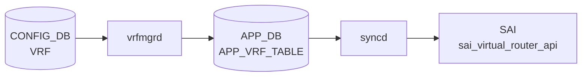

# VRF テーブル

## 概要

L3 トラフィック分離のための Virtual Routing and Forwarding インスタンスを定義する[^1]。`vrfmgrd` がこのテーブルを購読し、Linux [VRF](../../reference/glossary.md#term-vrf) (`ip vrf` / `cgroup`) を作成する。各種 `*_INTERFACE` テーブルから `vrf_name` で leafref 参照される。[EVPN](../../reference/glossary.md#term-evpn) [VXLAN](../../reference/glossary.md#term-vxlan) では `vni` を介して L3 VNI と紐付く。

<!-- cdb-mermaid -->
### データフロー (自動生成)



!!! note "凡例"
    CONFIG_DB から SAI までの典型経路を `docs/reference/config-db-orch-map.md` から機械生成したミニ図。詳細・例外は本ページ本文と対応表を参照。
<!-- /cdb-mermaid -->

## key 構造

```text
VRF|<name>
```

`<name>` は `Vrf` プレフィクス + `[a-zA-Z0-9_-]+` のパターン制約あり（例: `Vrf_blue`）。

## フィールド一覧

| フィールド | 型 | 必須 | デフォルト | 説明 |
|-----------|----|------|-----------|------|
| `name` (key) | string `Vrf<...>` | ✅ | - | [VRF](../../reference/glossary.md#term-vrf) 名 |
| `fallback` | boolean | - | `false` | 指定 [VRF](../../reference/glossary.md#term-vrf) からデフォルト経路へフォールバック |
| `vni` | uint32 (0..16777215) | - | `0` | この VRF にマップする L3 VNI |

## 購読者

- `vrfmgrd`: Linux VRF / cgroup を作成・破棄
- `intfmgrd`: 各 `*_INTERFACE` の `vrf_name` 参照を反映
- `bgpcfgd` / `frr-mgmt-framework`: `BGP_GLOBALS|<vrf>` と組合わせて [FRR](../../reference/glossary.md#term-frr) `vrf <name>` 設定生成
- `orchagent` `VRFOrch`: [SAI](../../reference/glossary.md#term-sai) VR (Virtual Router) を生成

## 関連 CONFIG_DB / YANG / CLI

- 関連 [CONFIG_DB](../../reference/glossary.md#term-config_db): `INTERFACE`、`VLAN_INTERFACE`、`PORTCHANNEL_INTERFACE`、`LOOPBACK_INTERFACE`、`BGP_GLOBALS`、`MGMT_VRF_CONFIG`
- 関連 CLI: `config vrf add/del`
- 関連 [YANG](../../reference/glossary.md#term-yang): `sonic-vrf`

<!-- value-behavior -->
## 値依存挙動マトリクス

| フィールド | 値 | 実挙動 |
|-----------|-----|--------|
| `fallback` | `false` | デフォルト。当該 VRF の経路テーブルのみ参照 |
| `fallback` | `true` | VRF に経路がない場合にデフォルト VRF（main routing table）へフォールバック |
| `vni` | `0` | L3 VNI マッピングなし（デフォルト、YANG default 0）|
| `vni` | `1`〜`16777215` | EVPN L3 VNI マッピングを設定。`vrfmgrd` が VXLAN_TUNNEL_MAP に `evpn_map_<vni>_<vrf>` エントリを作成 (vrfmgr.cpp:510) |
| `vni` | 重複 VNI | `vrfmgrd` が `"vni %d is already mapped to vrf %s"` でエラーして破棄 (vrfmgr.cpp:441) |
| `vni` | 既存 VRF の VNI 変更 | `"vrf %s is already mapped to vni %d"` でエラー。一旦 `vni=0` にしてから再設定必要 (vrfmgr.cpp:461) |
| `name` | `Vrf` で始まる | 有効。sonic-cfggen / orchagent が VRF として認識 |
| `name` | `Vrf` で始まらない | YANG `"Invalid VRF name"` エラーで reject |

<!-- /value-behavior -->

## 例外条件・特殊挙動 <!-- cdb-exceptions -->

<!-- evidence: sonic-swss/cfgmgr/vrfmgr.cpp; sonic-buildimage/src/sonic-yang-models/yang-models/sonic-vrf.yang -->

- **名前パターン (YANG)**: `pattern "Vrf[a-zA-Z0-9_-]+"` — 違反は `"Invalid VRF name"` エラーで reject される[^exc2]。
- **VNI 重複禁止**: 同じ VNI が別 VRF にマップ済みの場合 `vrfmgrd` は `SWSS_LOG_ERROR("vni %d is already mapped to vrf %s")` を記録してエントリを破棄する[^exc1]。
- **VRF への VNI 再マップ禁止**: 既に VNI が設定されている VRF に別の VNI を設定しようとすると `SWSS_LOG_ERROR("vrf %s is already mapped to vni %d")` でエラー[^exc1]。
- **削除遅延**: VRF 削除時に [orchagent](../../reference/glossary.md#term-orchagent) の VRF オブジェクトが残存している場合 `vrfmgrd` は削除をリトライ待ち（`isVrfObjExist()` チェック）[^exc1]。
- **Linux netdev 作成失敗**: `SWSS_LOG_ERROR("Failed to create vrf netdev")` を記録[^exc1]。
- **VNI マップ設定失敗**: `SWSS_LOG_ERROR("VRF VNI Map Config Failed")` を記録してエントリを破棄[^exc1]。
- **デフォルト補完**: `fallback` のデフォルト `false`、`vni` のデフォルト `0`（マッピングなし）[^exc2]。

[^exc1]: `sonic-swss/cfgmgr/vrfmgr.cpp` <https://github.com/sonic-net/sonic-swss/blob/master/cfgmgr/vrfmgr.cpp>
[^exc2]: `sonic-buildimage/src/sonic-yang-models/yang-models/sonic-vrf.yang` <https://github.com/sonic-net/sonic-buildimage/blob/master/src/sonic-yang-models/yang-models/sonic-vrf.yang>

<!-- ref-triangle:start -->

## 関連リファレンス

- [YANG](../../reference/glossary.md#term-yang): [`sonic-vrf`](../yang/sonic-vrf.md)
- CLI: [`config vrf`](../cli/config-vrf.md)

<!-- ref-triangle:end -->

## 引用元

[^1]: [YANG](../../reference/glossary.md#term-yang) 定義: `sonic-vrf.yang`. <https://github.com/sonic-net/sonic-buildimage/blob/9ea932ec2e18f35e58268ec2e4456b1d4afd65cd/src/sonic-yang-models/yang-models/sonic-vrf.yang>

## 関連ページ
- [HLD: VRF サポート](../../routing/sonic-vrf-support-design-spec-draft.md)
- [CLI: config vrf](../cli/config-vrf.md)
- [CLI: config interface](../cli/config-interface.md)
- [YANG: sonic-vrf](../yang/sonic-vrf.md)

<!-- ops-hint -->
## 運用ヒント

### 典型値

- key 形式: `VRF|Vrf<name>` (例 `VRF|VrfRed`)。
- `vni`: L3 VNI（[VXLAN](../../reference/glossary.md#term-vxlan) [EVPN](../../reference/glossary.md#term-evpn) tenant L3）。
- `fallback`: `true` で default VRF にフォールバック。

### よくある誤設定

- VRF 名が `Vrf` で始まらないと [sonic-cfggen](../../reference/glossary.md#term-sonic-cfggen) / [orchagent](../../reference/glossary.md#term-orchagent) が認識しない。
- `vni` を tenant 間で重複させると [EVPN](../../reference/glossary.md#term-evpn) route が混線する。

### 確認コマンド

```bash
sonic-db-cli CONFIG_DB keys 'VRF|*'
show vrf
ip vrf show
```
<!-- /ops-hint -->


<!-- runtime-trace -->
## CDB → 実コンテナ動作トレース

### 段階 1: Consumer 登録

- **orchagent / VrfOrch** (`sonic-swss/orchagent/vrforch.cpp`): `VRF` テーブルを `SubscriberStateTable` で購読。
- **vrfmgrd** (`sonic-swss/cfgmgr/vrfmgr.cpp`): `VRF` テーブルを購読して Linux VRF デバイスを管理。

### 段階 2: CFG → APPL 翻訳

- vrfmgrd が `ip vrf add <name>` でカーネル VRF デバイスを作成し APP_DB `VRF_TABLE` に書き込む。

### 段階 3: APPL → SAI

- VrfOrch が APP_DB を読み `sai_virtual_router_api->create_virtual_router()` でハードウェア VRF を作成。
- VRF OID は後続の INTERFACE / ROUTE テーブル処理で使用される。

### 段階 4: タイミング + 副作用

- カーネル VRF 作成 (vrfmgrd) と SAI VRF 作成 (VrfOrch) はほぼ同時。
- 副作用: VRF 削除時は所属インタフェース・ルートを先に削除しないと `VRF is in use` エラー。

<!-- /runtime-trace -->
<!-- entry-points -->
## 書き込み入り口 (Direction A)

VRF テーブルへの書き込みが発生するコード経路を網羅的に調査した結果。

### CLI

  - `config vrf add/del <name>` — `config/main.py` が `set_entry('VRF', vrf_name, {'NULL': 'NULL'})` を呼ぶ (sonic-utilities/config/main.py:7698, 7731)
  - `config vrf add_vrf_vni_map/del_vrf_vni_map <name>` — `config/main.py` が `mod_entry('VRF', vrfname, {'vni': vni})` を呼ぶ (sonic-utilities/config/main.py:7774, 7784)

### minigraph / sonic-cfggen

**minigraph.py** が VRF エントリを生成し投入 (sonic-buildimage/src/sonic-config-engine/minigraph.py)

### REST / gNMI

REST/gNMI 書き込み経路なし

### db_migrator

db_migrator.py での VRF マイグレーションなし

### ビルド時デフォルト (build-time default)

なし

### ハードコードデフォルト / ランタイム注入

なし

### 死活・デッドコード

なし
<!-- /entry-points -->

<!-- glossary-links-injected: e2892b76fd9a -->
