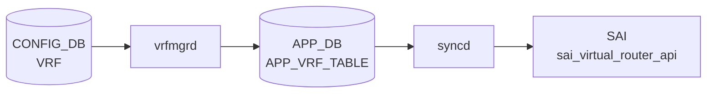

# VRF テーブル

## 概要

L3 トラフィック分離のための Virtual Routing and Forwarding インスタンスを定義する[^1]。`vrfmgrd` がこのテーブルを購読し、Linux [VRF](../../reference/glossary.md#term-vrf) (`ip vrf` / `cgroup`) を作成する。各種 `*_INTERFACE` テーブルから `vrf_name` で leafref 参照される。[EVPN](../../reference/glossary.md#term-evpn) [VXLAN](../../reference/glossary.md#term-vxlan) では `vni` を介して L3 VNI と紐付く。

<!-- cdb-mermaid -->
### データフロー (自動生成)



!!! note "凡例"
    CONFIG_DB から SAI までの典型経路を `docs/reference/config-db-orch-map.md` から機械生成したミニ図。詳細・例外は本ページ本文と対応表を参照。
<!-- /cdb-mermaid -->

## key 構造

```
VRF|<name>
```

`<name>` は `Vrf` プレフィクス + `[a-zA-Z0-9_-]+` のパターン制約あり（例: `Vrf_blue`）。

## フィールド一覧

| フィールド | 型 | 必須 | デフォルト | 説明 |
|-----------|----|------|-----------|------|
| `name` (key) | string `Vrf<...>` | ✅ | - | [VRF](../../reference/glossary.md#term-vrf) 名 |
| `fallback` | boolean | - | `false` | 指定 [VRF](../../reference/glossary.md#term-vrf) からデフォルト経路へフォールバック |
| `vni` | uint32 (0..16777215) | - | `0` | この VRF にマップする L3 VNI |

## 購読者

- `vrfmgrd`: Linux VRF / cgroup を作成・破棄
- `intfmgrd`: 各 `*_INTERFACE` の `vrf_name` 参照を反映
- `bgpcfgd` / `frr-mgmt-framework`: `BGP_GLOBALS|<vrf>` と組合わせて [FRR](../../reference/glossary.md#term-frr) `vrf <name>` 設定生成
- `orchagent` `VRFOrch`: [SAI](../../reference/glossary.md#term-sai) VR (Virtual Router) を生成

## 関連 CONFIG_DB / YANG / CLI

- 関連 [CONFIG_DB](../../reference/glossary.md#term-config_db): `INTERFACE`、`VLAN_INTERFACE`、`PORTCHANNEL_INTERFACE`、`LOOPBACK_INTERFACE`、`BGP_GLOBALS`、`MGMT_VRF_CONFIG`
- 関連 CLI: `config vrf add/del`
- 関連 [YANG](../../reference/glossary.md#term-yang): `sonic-vrf`

<!-- ref-triangle:start -->

## 関連リファレンス

- [YANG](../../reference/glossary.md#term-yang): [`sonic-vrf`](../yang/sonic-vrf.md)
- CLI: [`config vrf`](../cli/config-vrf.md)

<!-- ref-triangle:end -->

## 引用元

[^1]: [YANG](../../reference/glossary.md#term-yang) 定義: `sonic-vrf.yang`. <https://github.com/sonic-net/sonic-buildimage/blob/9ea932ec2e18f35e58268ec2e4456b1d4afd65cd/src/sonic-yang-models/yang-models/sonic-vrf.yang>

## 関連ページ
- [HLD: VRF サポート](../../routing/sonic-vrf-support-design-spec-draft.md)
- [CLI: config vrf](../cli/config-vrf.md)
- [CLI: config interface](../cli/config-interface.md)
- [YANG: sonic-vrf](../yang/sonic-vrf.md)

<!-- ops-hint -->
## 運用ヒント

### 典型値

- key 形式: `VRF|Vrf<name>` (例 `VRF|VrfRed`)。
- `vni`: L3 VNI（[VXLAN](../../reference/glossary.md#term-vxlan) [EVPN](../../reference/glossary.md#term-evpn) tenant L3）。
- `fallback`: `true` で default VRF にフォールバック。

### よくある誤設定

- VRF 名が `Vrf` で始まらないと [sonic-cfggen](../../reference/glossary.md#term-sonic-cfggen) / [orchagent](../../reference/glossary.md#term-orchagent) が認識しない。
- `vni` を tenant 間で重複させると [EVPN](../../reference/glossary.md#term-evpn) route が混線する。

### 確認コマンド

```bash
sonic-db-cli CONFIG_DB keys 'VRF|*'
show vrf
ip vrf show
```
<!-- /ops-hint -->

<!-- glossary-links-injected: fb18b738b957 -->
