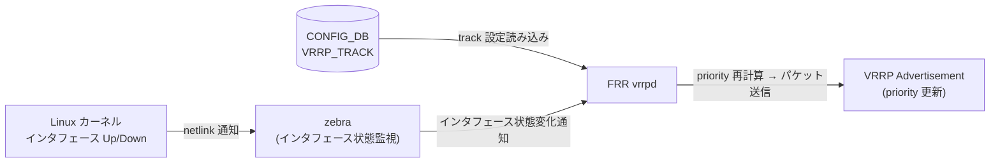

# VRRP_TRACK テーブル

## 概要

VRRP_TRACK テーブルは、VRRP IPv4 インスタンスが監視するアップリンクインタフェース（追跡インタフェース）と、そのインタフェースがダウンした際に VRRP priority から差し引く `priority_increment` 値を [CONFIG_DB](../../reference/glossary.md#term-config_db) に保持するテーブル[^1]。

FRR の `vrrpd` は `zebra` 経由でカーネルのインタフェース状態変化イベントを受信し、VRRP_TRACK に登録された追跡インタフェースの Up/Down に応じて VRRP インスタンスの priority を動的に加減算する。追跡インタフェースがダウンすると priority が `priority_increment` 分だけ減少し、バックアップルータへのフェイルオーバーを促す。インタフェースが復旧すると priority が元の値に戻る。

!!! note "IPv6 版"
    VRRP IPv6 インスタンスの追跡設定は別テーブル `VRRP6_TRACK` で管理される。`VRRP6_TRACK` はキー構造・フィールドともに本テーブルと同一だが、親インスタンスが `VRRP6` テーブルを参照する点が異なる。

<!-- cdb-mermaid -->
### データフロー



<!-- /cdb-mermaid -->

## key 構造

```text
VRRP_TRACK|<interface_name>|<vrid>|<track_interface>
```

- `<interface_name>`: VRRP インスタンスが設定されているベースインタフェース名 (例: `Ethernet64`, `Vlan1`, `PortChannel001`)
- `<vrid>`: 仮想ルータ識別子 (1–255)。`VRRP|<interface_name>|<vrid>` として存在する親インスタンスへの参照
- `<track_interface>`: 追跡対象インタフェース名 (Ethernet, Vlan, PortChannel のいずれか)

## フィールド

| フィールド | 型 | デフォルト | 説明 |
|-----------|----|-----------|------|
| `priority_increment` | uint8 (1–255) | `20` | 追跡インタフェースがダウンした際に VRRP priority から差し引く値。CLI では 10–50 の範囲が強制されるが YANG では 1–255 を許容する |

## 制約

- 1 つの VRRP インスタンス (`interface_name` + `vrid`) につき最大 **8 つ**の追跡インタフェースを設定可能 (`config/main.py:7038`)
- `priority_increment` の CLI 許容範囲は **10–50**（YANG スキーマでは 1–255 を許容。直接 DB 書き込みの場合は YANG 制約が適用される）
- 追跡インタフェースには Ethernet / VLAN / PortChannel が使用可能。Loopback は不可
- 追跡インタフェースにはルータインタフェース (`INTERFACE` / `VLAN_INTERFACE` / `PORTCHANNEL_INTERFACE`) が CONFIG_DB に存在する必要がある

## 購読者

- **FRR `vrrpd`**: VRRP_TRACK の設定を読み込み、`zebra` 経由で受信したインタフェース状態変化通知に応じて VRRP priority を動的計算し VRRP Advertisement パケットに反映する

## 関連 CONFIG_DB / CLI

- 関連 [CONFIG_DB](../../reference/glossary.md#term-config_db): [`VRRP`](../../reference/config-db/vrrp-track.md) (親インスタンステーブル)
- 関連 CLI:
  - `config interface vrrp track_interface add <intf> <vrid> <track_intf> [<priority_increment>]`
  - `config interface vrrp track_interface remove <intf> <vrid> <track_intf>`
  - `show vrrp`

<!-- ordering -->
## 書込み順依存 (Phase B — コード由来)

`sonic-utilities/config/main.py` の `add_track_interface()` / `remove_track_interface()` を精読して検出した順序依存・タイミング依存。詳細スキャンノート: [`meta/_intermediate/cdb-flow/vrrp-track-ordering.md`](https://github.com/aoki-taquan/sonic-unofficial-docs/blob/main/meta/_intermediate/cdb-flow/vrrp-track-ordering.md)。

| # | 依存関係 | 方向 | 緩和策 / 備考 |
|---|----------|------|--------------|
| 1 | `VRRP\|<intf>\|<vrid>` 存在 → VRRP_TRACK SET | 強制先行 | `add_track_interface()` が `get_entry("VRRP", ...)` で親インスタンスの存在確認。未存在の場合は `ctx.fail()` で永続拒絶（自動再試行なし）。`config/main.py:7017-7019` |
| 2 | `INTERFACE`/`PORTCHANNEL_INTERFACE`/`VLAN_INTERFACE` (base) 存在 → VRRP_TRACK SET | 強制先行 | `get_interface_table_name(interface_name)` + `get_table()` で存在確認。Loopback は `""` / `"LOOPBACK_INTERFACE"` として拒絶。`config/main.py:7000-7006` |
| 3 | `INTERFACE`/`PORTCHANNEL_INTERFACE`/`VLAN_INTERFACE` (track) 存在 → VRRP_TRACK SET | 強制先行 | `get_interface_table_name(track_interface)` + `get_table()` で track 対象も同様に確認。`config/main.py:7007-7014` |
| 4 | VRRP_TRACK DEL → VRRP DEL | 強制先行 | `remove_track_interface()` は VRRP インスタンスの存在確認後に DEL を実行。VRRP インスタンスを先に削除すると `ctx.fail("vrrp instance {} not found")` で track DEL が失敗する。削除はトラック → VRRP の逆順。`config/main.py:7070-7072` |
| 5 | FRR track 設定読み込み → インタフェース Up/Down イベント | 推奨先行 | CONFIG_DB への VRRP_TRACK 書き込みが FRR に反映される前にインタフェース状態変化が発生すると、priority 計算が欠落する。確実なトラッキングが必要な場合は VRRP インスタンス起動前に VRRP_TRACK を投入する。HLD — Uplink interface tracking セクション (L481-492) |

### 推奨投入順序

```text
1. ルータインタフェース確立 (INTERFACE / PORTCHANNEL_INTERFACE / VLAN_INTERFACE)
2. VRRP インスタンス作成 (VRRP|<intf>|<vrid>)
3. VRRP_TRACK 投入 (VRRP_TRACK|<intf>|<vrid>|<track_intf>)
```

削除時は逆順 (VRRP_TRACK → VRRP → インタフェース) で実施する。
<!-- /ordering -->

## 引用元

[^1]: `sonic-utilities/config/main.py` (`add_track_interface()` L6993-7040, `remove_track_interface()` L7045-7077); `SONiC/doc/vrrp/VRRP_Adaptation_HLD.md` (CONFIG_DB changes L308-315, Uplink interface tracking L481-492); `SONiC/doc/vrrp/sonic-vrrp.yang` (VRRP_TRACK container L136-177). <https://github.com/sonic-net/sonic-utilities/blob/master/config/main.py>

<!-- ops-hint -->
## 運用ヒント

### 典型的な設定例

```bash
# 1. VRRP インスタンスを作成
config interface vrrp ip add Ethernet64 8 10.0.0.1/24

# 2. アップリンク追跡を追加（priority_increment=20、デフォルト）
config interface vrrp track_interface add Ethernet64 8 Ethernet72 20

# 3. 追加確認
redis-cli -n 4 HGETALL "VRRP_TRACK|Ethernet64|8|Ethernet72"

# 4. 追跡インタフェースを削除
config interface vrrp track_interface remove Ethernet64 8 Ethernet72
```

### よくある誤設定

- VRRP インスタンス未作成のまま VRRP_TRACK を投入しようとすると `"vrrp instance {} not found on interface {}"` で拒絶される
- `priority_increment` が 50 超 (例: 80) を CLI で指定するとパラメータ範囲エラー（YANG は 1–255 まで許容）
- 1 VRRP インスタンスに 9 本目の track を追加しようとすると `"The Vrrpv instance {} has already configured 8 track interfaces"` で拒絶される

### 確認コマンド

```bash
sonic-db-cli CONFIG_DB keys 'VRRP_TRACK|*'
sonic-db-cli CONFIG_DB hgetall 'VRRP_TRACK|Ethernet64|8|Ethernet72'
show vrrp
```
<!-- /ops-hint -->
