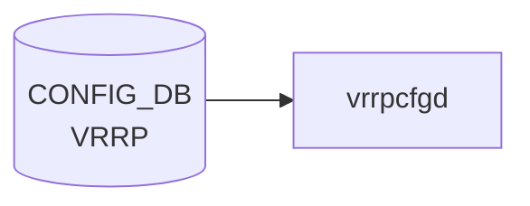

# VRRP_TRACK テーブル

## 概要

VRRP_TRACK テーブルは、[VRRP](../../reference/glossary.md#term-vrrp) IPv4 インスタンスが監視するアップリンクインタフェース（追跡インタフェース）と、そのインタフェースがダウンした際に [VRRP](../../reference/glossary.md#term-vrrp) priority から差し引く `priority_increment` 値を [CONFIG_DB](../../reference/glossary.md#term-config_db) に保持するテーブル[^1]。

[FRR](../../reference/glossary.md#term-frr) の `vrrpd` は `zebra` 経由でカーネルのインタフェース状態変化イベントを受信し、VRRP_TRACK に登録された追跡インタフェースの Up/Down に応じて VRRP インスタンスの priority を動的に加減算する。追跡インタフェースがダウンすると priority が `priority_increment` 分だけ減少し、バックアップルータへのフェイルオーバーを促す。インタフェースが復旧すると priority が元の値に戻る。

!!! note "IPv6 版"
    VRRP IPv6 インスタンスの追跡設定は別テーブル `VRRP6_TRACK` で管理される。`VRRP6_TRACK` はキー構造・フィールドともに本テーブルと同一だが、親インスタンスが `VRRP6` テーブルを参照する点が異なる。

<!-- cdb-mermaid -->
### データフロー (自動生成)



!!! note "凡例"
    CONFIG_DB から SAI までの典型経路を `docs/reference/config-db-orch-map.md` から機械生成したミニ図。詳細・例外は本ページ本文と対応表を参照。
<!-- /cdb-mermaid -->

## key 構造

```text
VRRP_TRACK|<interface_name>|<vrid>|<track_interface>
```

- `<interface_name>`: [VRRP](../../reference/glossary.md#term-vrrp) インスタンスが設定されているベースインタフェース名 (例: `Ethernet64`, `Vlan1`, `PortChannel001`)
- `<vrid>`: 仮想ルータ識別子 (1–255)。`VRRP|<interface_name>|<vrid>` として存在する親インスタンスへの参照
- `<track_interface>`: 追跡対象インタフェース名 (Ethernet, Vlan, [PortChannel](../../reference/glossary.md#term-portchannel) のいずれか)

## フィールド

| フィールド | 型 | デフォルト | 説明 |
|-----------|----|-----------|------|
| `priority_increment` | uint8 (1–255) | `20` | 追跡インタフェースがダウンした際に VRRP priority から差し引く値。CLI では 10–50 の範囲が強制されるが [YANG](../../reference/glossary.md#term-yang) では 1–255 を許容する |

## 制約

- 1 つの VRRP インスタンス (`interface_name` + `vrid`) につき最大 **8 つ**の追跡インタフェースを設定可能 (`config/main.py:7038`)
- `priority_increment` の CLI 許容範囲は **10–50**（[YANG](../../reference/glossary.md#term-yang) スキーマでは 1–255 を許容。直接 DB 書き込みの場合は [YANG](../../reference/glossary.md#term-yang) 制約が適用される）
- 追跡インタフェースには Ethernet / [VLAN](../../reference/glossary.md#term-vlan) / [PortChannel](../../reference/glossary.md#term-portchannel) が使用可能。Loopback は不可
- 追跡インタフェースにはルータインタフェース (`INTERFACE` / `VLAN_INTERFACE` / `PORTCHANNEL_INTERFACE`) が [CONFIG_DB](../../reference/glossary.md#term-config_db) に存在する必要がある

## 購読者

- **[FRR](../../reference/glossary.md#term-frr) `vrrpd`**: VRRP_TRACK の設定を読み込み、`zebra` 経由で受信したインタフェース状態変化通知に応じて VRRP priority を動的計算し VRRP Advertisement パケットに反映する

## 関連 CONFIG_DB / CLI

- 関連 [CONFIG_DB](../../reference/glossary.md#term-config_db): [`VRRP`](../../reference/config-db/vrrp-track.md) (親インスタンステーブル)
- 関連 CLI:
  - `config interface vrrp track_interface add <intf> <vrid> <track_intf> [<priority_increment>]`
  - `config interface vrrp track_interface remove <intf> <vrid> <track_intf>`
  - `show vrrp`

<!-- ordering -->
## 書込み順依存 (Phase B — コード由来)

`sonic-utilities/config/main.py` の `add_track_interface()` / `remove_track_interface()` を精読して検出した順序依存・タイミング依存。詳細スキャンノート: [`meta/_intermediate/cdb-flow/vrrp-track-ordering.md`](https://github.com/aoki-taquan/sonic-unofficial-docs/blob/main/meta/_intermediate/cdb-flow/vrrp-track-ordering.md)。

| # | 依存関係 | 方向 | 緩和策 / 備考 |
|---|----------|------|--------------|
| 1 | `VRRP\|<intf>\|<vrid>` 存在 → VRRP_TRACK SET | 強制先行 | `add_track_interface()` が `get_entry("VRRP", ...)` で親インスタンスの存在確認。未存在の場合は `ctx.fail()` で永続拒絶（自動再試行なし）。`config/main.py:7017-7019` |
| 2 | `INTERFACE`/`PORTCHANNEL_INTERFACE`/`VLAN_INTERFACE` (base) 存在 → VRRP_TRACK SET | 強制先行 | `get_interface_table_name(interface_name)` + `get_table()` で存在確認。Loopback は `""` / `"LOOPBACK_INTERFACE"` として拒絶。`config/main.py:7000-7006` |
| 3 | `INTERFACE`/`PORTCHANNEL_INTERFACE`/`VLAN_INTERFACE` (track) 存在 → VRRP_TRACK SET | 強制先行 | `get_interface_table_name(track_interface)` + `get_table()` で track 対象も同様に確認。`config/main.py:7007-7014` |
| 4 | VRRP_TRACK DEL → VRRP DEL | 強制先行 | `remove_track_interface()` は VRRP インスタンスの存在確認後に DEL を実行。VRRP インスタンスを先に削除すると `ctx.fail("vrrp instance {} not found")` で track DEL が失敗する。削除はトラック → VRRP の逆順。`config/main.py:7070-7072` |
| 5 | [FRR](../../reference/glossary.md#term-frr) track 設定読み込み → インタフェース Up/Down イベント | 推奨先行 | CONFIG_DB への VRRP_TRACK 書き込みが FRR に反映される前にインタフェース状態変化が発生すると、priority 計算が欠落する。確実なトラッキングが必要な場合は VRRP インスタンス起動前に VRRP_TRACK を投入する。[HLD](../../reference/glossary.md#term-hld) — Uplink interface tracking セクション (L481-492) |

### 推奨投入順序

```text
1. ルータインタフェース確立 (INTERFACE / PORTCHANNEL_INTERFACE / VLAN_INTERFACE)
2. VRRP インスタンス作成 (VRRP|<intf>|<vrid>)
3. VRRP_TRACK 投入 (VRRP_TRACK|<intf>|<vrid>|<track_intf>)
```

削除時は逆順 (VRRP_TRACK → VRRP → インタフェース) で実施する。
<!-- /ordering -->

<!-- cross-refs -->
## 暗黙参照テーブル (Phase C)

`VRRP_TRACK` テーブルは YANG leafref と CLI 実行時チェックの 2 系統で外部テーブルを参照する。詳細スキャンノート: [`meta/_intermediate/cdb-flow/vrrp-track-cross-refs.md`](https://github.com/aoki-taquan/sonic-unofficial-docs/blob/main/meta/_intermediate/cdb-flow/vrrp-track-cross-refs.md)。

### YANG leafref (VRRP_TRACK_LIST)

`sonic-vrrp.yang` の `VRRP_TRACK` コンテナ (L135–183) に定義された leafref。`sonic-yang-mgmt` / [gNMI](../../reference/glossary.md#term-gnmi) 経路でバリデーションされる。

| フィールド | 参照先テーブル | 説明 | evidence |
|---|---|---|---|
| `baseifname` | `VRRP/VRRP_LIST/ifname` | 親 VRRP インスタンスの `ifname` を参照 | `sonic-vrrp.yang` L144–146 |
| `idkey` | `VRRP/VRRP_LIST/idkey` | 親 VRRP インスタンスの `idkey` (vrid) を参照 | `sonic-vrrp.yang` L150–152 |
| `trackifname` (PORT) | `PORT/PORT_LIST/ifname` | 物理ポートを追跡インタフェースに指定する場合 | `sonic-vrrp.yang` L158–160 |
| `trackifname` ([PortChannel](../../reference/glossary.md#term-portchannel)) | `PORTCHANNEL/PORTCHANNEL_LIST/name` | PortChannel を追跡インタフェースに指定する場合 | `sonic-vrrp.yang` L161–163 |
| `trackifname` ([VLAN](../../reference/glossary.md#term-vlan)) | `VLAN/VLAN_LIST/name` | [VLAN](../../reference/glossary.md#term-vlan) インタフェースを追跡インタフェースに指定する場合 | `sonic-vrrp.yang` L164–166 |
| `trackifname` (Sub-IF) | `VLAN_SUB_INTERFACE/VLAN_SUB_INTERFACE_LIST/id` | サブインタフェースを追跡インタフェースに指定する場合 | `sonic-vrrp.yang` L167–169 |

### CLI 実行時存在確認 (config/main.py)

YANG バリデーションとは独立して `add_track_interface()` が実行する `get_table()` 存在確認。

| 確認対象テーブル | 確認タイミング | 失敗時の挙動 | evidence |
|---|---|---|---|
| `INTERFACE` / `PORTCHANNEL_INTERFACE` / `VLAN_INTERFACE` (ベース) | VRRP_TRACK 追加時 | `ctx.fail("Router Interface '{}' not found")` で永続拒絶 | `config/main.py:7000–7006` |
| `INTERFACE` / `PORTCHANNEL_INTERFACE` / `VLAN_INTERFACE` (追跡) | VRRP_TRACK 追加時 | `ctx.fail("Router Interface '{}' not found")` で永続拒絶 | `config/main.py:7007–7015` |
| `VRRP` (親インスタンス) | VRRP_TRACK 追加時 | `ctx.fail("vrrp instance {} not found on interface {}")` で永続拒絶 | `config/main.py:7017–7019` |

### データ流出先

VRRP_TRACK への書き込みは直接 [APPL_DB](../../reference/glossary.md#term-appl_db) / [ASIC_DB](../../reference/glossary.md#term-asic_db) には流れない。FRR `vrrpd` が CONFIG_DB.VRRP_TRACK を読み込み、`zebra` 経由のインタフェース状態変化通知と組み合わせて priority を再計算する。

| 流出先 | 経路 |
|---|---|
| FRR `vrrpd` 内部メモリ (priority 計算) | CONFIG_DB.VRRP_TRACK → vrrpd track 設定読み込み |
| VRRP Advertisement パケット (priority フィールド更新) | vrrpd priority 再計算 → パケット送出 (DB 書き込みなし) |

<!-- /cross-refs -->

<!-- failure -->
## 失敗挙動 (Phase D)

`VRRP_TRACK` / `VRRP6_TRACK` テーブルへの書き込みは CLI (`sonic-utilities/config/main.py`) 経路と YANG/[gNMI](../../reference/glossary.md#term-gnmi) 直書き経路で異なる失敗分岐を持つ。詳細スキャンノート: [`meta/_intermediate/cdb-flow/vrrp-track-failure.md`](https://github.com/aoki-taquan/sonic-unofficial-docs/blob/main/meta/_intermediate/cdb-flow/vrrp-track-failure.md)。

### CLI 経路 — add_track_interface() の失敗パターン

#### エイリアスモード

| 失敗ケース | 失敗箇所 | 挙動 | retry |
|---|---|---|---|
| `interface_name` のエイリアス解決失敗 | `config/main.py:7000-7001` | `ctx.fail("'interface_name' is None!")` で永続拒絶 | なし |
| `track_interface` のエイリアス解決失敗 | `config/main.py:7002-7003` | `ctx.fail("'track_interface' is None!")` で永続拒絶 | なし |

#### ベースインタフェース検証

| 失敗ケース | 失敗箇所 | 挙動 | retry |
|---|---|---|---|
| `interface_name` が Loopback 系または無効名 | `config/main.py:7006-7007` | `ctx.fail("'interface_name' is not valid. Valid names [Ethernet/PortChannel/Vlan]")` | なし |
| `interface_name` が CONFIG_DB (INTERFACE / VLAN_INTERFACE / PORTCHANNEL_INTERFACE) に未存在 | `config/main.py:7008-7009` | `ctx.fail("Router Interface '{}' not found")` で永続拒絶 | なし |

#### 追跡インタフェース検証

| 失敗ケース | 失敗箇所 | 挙動 | retry |
|---|---|---|---|
| `track_interface` が Loopback 系または無効名 | `config/main.py:7012-7013` | `ctx.fail("'track_interface' is not valid. Valid names [Ethernet/PortChannel/Vlan]")` | なし |
| `track_interface` が CONFIG_DB に未存在 | `config/main.py:7014-7015` | `ctx.fail("Router Interface '{}' not found")` で永続拒絶 | なし |

#### 親インスタンス・スケール検証

| 失敗ケース | 失敗箇所 | 挙動 | retry |
|---|---|---|---|
| 親 VRRP インスタンス (`VRRP\|<intf>\|<vrid>`) が未存在 | `config/main.py:7017-7019` | `ctx.fail("vrrp instance {} not found on interface {}")` で永続拒絶 | なし |
| 同インスタンスに既に 8 トラックインタフェースが設定済み | `config/main.py:7037-7038` | `ctx.fail("The Vrrpv instance {} has already configured 8 track interfaces")` | なし |
| `priority_increment` が 10–50 の範囲外 | Click `IntRange(10, 50)` コマンド解析時 | 解析段階で即時拒絶。DB 書き込みなし | なし |

!!! note "冪等動作"
    既存の VRRP_TRACK エントリに `add` を再実行した場合、CLI は `ctx.fail()` せず `priority_increment` のみ上書きする (`config/main.py:7021-7026`)。

### CLI 経路 — remove_track_interface() の失敗パターン

| 失敗ケース | 失敗箇所 | 挙動 |
|---|---|---|
| `interface_name` / `track_interface` のエイリアス解決失敗 | `config/main.py:7055-7058` | `ctx.fail("'interface_name'/'track_interface' is None!")` |
| `interface_name` が Loopback 系または無効名 | `config/main.py:7061-7062` | `ctx.fail("'interface_name' is not valid.")` |
| `interface_name` が CONFIG_DB に未存在 | `config/main.py:7063-7064` | `ctx.fail("Router Interface '{}' not found")` |
| `track_interface` が Loopback 系または無効名 | `config/main.py:7067-7068` | `ctx.fail("'track_interface' is not valid.")` |
| 親 VRRP インスタンスが未存在 (インスタンス先削除時) | `config/main.py:7070-7072` | `ctx.fail("vrrp instance {} not found on interface {}")` |
| 対象 VRRP_TRACK エントリが未存在 | `config/main.py:7074-7076` | `ctx.fail("{} is not configured on the vrrp instance {}!")` |

### YANG/gNMI 直書き経路の失敗

| 失敗ケース | 挙動 |
|---|---|
| `priority_increment` が uint8 範囲外 | YANG 型バリデーションで reject |
| `baseifname` leafref 解決失敗 (親 VRRP インスタンス未存在) | `sonic-yang-mgmt` が leafref エラーを返す |
| `trackifname` leafref 解決失敗 (PORT / PORTCHANNEL / VLAN 未存在) | `sonic-yang-mgmt` が leafref エラーを返す |

### FRR vrrpd / zebra の失敗挙動

| 条件 | 挙動 | 備考 |
|---|---|---|
| VRRP_TRACK 書き込み直後に FRR が未読み込みの場合 | インタフェース Up/Down 通知が来ても priority 計算が欠落する (一過性) | [HLD](../../reference/glossary.md#term-hld) Uplink interface tracking L481-492 |
| [zebra](../../reference/glossary.md#term-zebra) プロセス障害 | インタフェース状態変化通知が vrrpd に届かず priority 更新が停止 | DB への副次書き込みなし。[STATE_DB](../../reference/glossary.md#term-state_db) 更新なし |

<!-- /failure -->

<!-- constants -->
## ハードコード定数 (Phase E)

`VRRP_TRACK` / `VRRP6_TRACK` に関連する、CONFIG_DB スキーマ外でソースコードに固定されたリテラル値の一覧。詳細スキャンノート: [`meta/_intermediate/cdb-flow/vrrp-track-constants.md`](https://github.com/aoki-taquan/sonic-unofficial-docs/blob/main/meta/_intermediate/cdb-flow/vrrp-track-constants.md)。

### スケール上限（CLI ハードコード整数）

| 定数 | 値 | 用途 | evidence |
|------|----|------|----------|
| 最大追跡インタフェース数 | `8` | 1 VRRP/VRRP6 インスタンスあたりの上限。`count >= 8` 時に `ctx.fail()` で即時拒絶。YANG `max-elements` 未定義でここのみで管理 | `config/main.py:7037-7038, 7465` |

### `priority_increment` パラメータ定数

CLI と YANG で許容範囲が意図的に乖離している。

| 定数種別 | 値 | 定義箇所 |
|----------|-----|---------|
| CLI 下限 (`click.IntRange` min) | `10` | `config/main.py:6990, 7423` |
| CLI 上限 (`click.IntRange` max) | `50` | `config/main.py:6990, 7423` |
| CLI デフォルト | `20` | `config/main.py:6991, 7424` |
| YANG `uint8` 下限 | `1` | `sonic-vrrp.yang:174-175, 292-294` |
| YANG `uint8` 上限 | `255` | `sonic-vrrp.yang:175, 294` |

!!! note "CLI と YANG の乖離"
    CLI は運用上の安全域として `10–50` に絞っている。YANG バリデーション（gNMI / `sonic-yang-mgmt` 経路）は `1–255` を通過させるため、直接 DB 書き込みでは YANG 制約範囲内ならば CLI 拒絶値でも投入可能。

### `vrid` (vrrp_id) パラメータ定数

| 定数種別 | 値 | 定義箇所 |
|----------|-----|---------|
| CLI / YANG 下限 | `1` | `config/main.py:6988, 7421`; `sonic-vrrp.yang:80-81` |
| CLI / YANG 上限 | `255` | `config/main.py:6988, 7421`; `sonic-vrrp.yang:80-81` |

### DB フィールド名文字列リテラル

| 文字列 | 用途 | evidence |
|--------|------|----------|
| `"VRRP_TRACK"` | CONFIG_DB テーブル名（定数化なし、文字列リテラルのみ） | `config/main.py:7021, 7028, 7040, 7074, 7077` |
| `"priority_increment"` | VRRP_TRACK エントリの唯一のフィールド名 | `config/main.py:7023, 7026, 7469` |

<!-- /constants -->

<!-- side-effects -->
## 副次 DB 書込 (Phase F)

> 根拠: `SONiC/doc/vrrp/VRRP_Adaptation_HLD.md` L219-232, L481-492 全行精読。
> 詳細証跡: `meta/_intermediate/cdb-flow/vrrp-track-side-effects.md`

`VRRP_TRACK` / `VRRP6_TRACK` への SET / DEL は **他の DB（[APPL_DB](../../reference/glossary.md#term-appl_db) / [STATE_DB](../../reference/glossary.md#term-state_db) / [ASIC_DB](../../reference/glossary.md#term-asic_db)）へ直接書き込まない**。変更は CONFIG_DB から FRR `vrrpd` のインメモリ track 設定に反映されるのみであり、DB への副次書き込みは発生しない。

### SET 時

| # | 副次書き込み先 | 内容 | 条件 |
|---|--------------|------|------|
| — | なし（DB 書き込みなし） | FRR `vrrpd` がインメモリの priority 計算パラメータを更新する | 常時 |

`vrrpd` は `zebra` 経由で受信するインタフェース Up/Down イベントと `priority_increment` 値を組み合わせて VRRP priority を再計算し、VRRP Advertisement パケットの priority フィールドを更新する。この priority 変化が VRRP 状態遷移（Backup → Master）を引き起こした場合は、下流の波及効果として `vrrpsyncd` が `APPL_DB VRRP_TABLE` を更新し、さらに `vrrporch` が `ASIC_DB` へ仮想 [RIF](../../reference/glossary.md#term-rif) / VIP ルートエントリを追加する。ただしこれは VRRP_TRACK 変更の直接結果ではなく、VRRP 状態機械の遷移に伴う別コンポーネントの書き込みである。

### DEL 時

| # | 副次書き込み先 | 内容 | 条件 |
|---|--------------|------|------|
| — | なし（DB 書き込みなし） | FRR `vrrpd` がインメモリから track 設定を削除し priority を再計算 | 常時 |

追跡インタフェースが削除されると、そのインタフェースによる priority 減算が解消される。priority が増加して現インスタンスが Master に昇格する場合は SET 時と同様の下流波及が発生しうる。

### 下流波及チェーン（参考）

VRRP_TRACK 変更に起因する priority 再計算が VRRP 状態遷移を引き起こした場合の間接的な書き込みチェーン（VRRP_TRACK 自身は直接関与しない）:

```
VRRP_TRACK priority_increment 変化
  → FRR vrrpd: priority 再計算 → VRRP Advertisement 送信
  → VRRP 状態遷移発生時:
      vrrpsyncd: Linux macvlan インタフェース状態変化
        → APPL_DB VRRP_TABLE SET/DEL (Master 状態の VIP/VMAC エントリ)
          → vrrporch: ASIC_DB 仮想 RIF / VIP ルートエントリ追加・削除
```

> **Evidence**: `SONiC/doc/vrrp/VRRP_Adaptation_HLD.md` L219-232 (macvlanmgrd / vrrpsyncd / vrrporch の役割分担), L481-492 (Uplink interface tracking の設計)
<!-- /side-effects -->

<!-- pubsub -->
## 通信メカニズム (Phase G)

`VRRP_TRACK` / `VRRP6_TRACK` テーブルへの書き込みは **macvlanmgrd が単独で購読する**。`VRRP` テーブルとは異なり、VRRP_TRACK の変更は [APPL_DB](../../reference/glossary.md#term-appl_db) / [ASIC_DB](../../reference/glossary.md#term-asic_db) へ直接伝播しない。詳細スキャンノート: [`meta/_intermediate/cdb-flow/vrrp-track-pubsub.md`](https://github.com/aoki-taquan/sonic-unofficial-docs/blob/main/meta/_intermediate/cdb-flow/vrrp-track-pubsub.md)。

### 購読方式一覧

| コンポーネント | コンテナ | 購読元 | 購読 API | 書き込み先 |
|---|---|---|---|---|
| `macvlanmgrd` | [BGP](../../reference/glossary.md#term-bgp) | CONFIG_DB `VRRP_TRACK` / `VRRP6_TRACK` | `SubscriberStateTable` (keyspace) | FRR vrrpd ([vtysh](../../reference/glossary.md#term-vtysh) 経由、DB 書き込みなし) |

### 通知フロー

```
CLI / YANG → CONFIG_DB HSET "VRRP_TRACK|<intf>|<vrid>|<track_intf>"
  ↓ Redis keyspace PUBLISH "__keyspace@4__:VRRP_TRACK|<intf>|<vrid>|<track_intf>" "hset"
macvlanmgrd SubscriberStateTable 受信 (BGP コンテナ)
  ↓ vtysh コマンドで FRR vrrpd に track 設定投入
vrrpd がインメモリの track 設定を更新 (DB 書き込みなし)
  ↓ zebra からの netlink インタフェース状態変化通知と組み合わせて priority 再計算
vrrpd が VRRP Advertisement パケット送信 (priority フィールド更新)
```

### macvlanmgrd — CONFIG_DB SubscriberStateTable

`macvlanmgrd` は [BGP](../../reference/glossary.md#term-bgp) コンテナ内で動作し、CONFIG_DB の `VRRP` / `VRRP6` / `VRRP_TRACK` / `VRRP6_TRACK` の全 4 テーブルを `SubscriberStateTable` で一括購読する。`VRRP_TRACK` 変更受信時は [vtysh](../../reference/glossary.md#term-vtysh) 経由で FRR `vrrpd` に track 設定を投入する。Linux カーネルへの netlink 書き込みや APPL_DB への書き込みは発生しない（[HLD](../../reference/glossary.md#term-hld) L219-225）。

| 購読テーブル | PSUBSCRIBE パターン | 処理内容 |
|---|---|---|
| `VRRP_TRACK` | `__keyspace@4__:VRRP_TRACK\|*` | [vtysh](../../reference/glossary.md#term-vtysh) 経由で vrrpd に track 設定投入 |
| `VRRP6_TRACK` | `__keyspace@4__:VRRP6_TRACK\|*` | vtysh 経由で vrrpd に track 設定投入 |

### vrrpsyncd / vrrporch との関係

`VRRP_TRACK` 変更は `vrrpsyncd` や `vrrporch` には**直接影響しない**。VRRP_TRACK 変更に起因する priority 再計算が VRRP 状態遷移（Master/Backup 切替）を引き起こした場合のみ、下流の `vrrpsyncd` → APPL_DB → `vrrporch` → ASIC_DB チェーンが間接的に動作する（詳細は副次 DB 書込セクション参照）。

> **Evidence**: HLD L219-225 (macvlanmgrd の役割)、HLD L461-492 (Modules Design and Flows)、HLD L268 (Consumer: macvlanmgrd)
<!-- /pubsub -->

<!-- platform -->
## プラットフォーム差 (Phase H)

**プラットフォーム差なし**: `VRRP_TRACK` テーブルへの書き込み・読み込みは [ASIC](../../reference/glossary.md#term-asic) 種別・multi-asic 構成・[VOQ](../../reference/glossary.md#term-voq) chassis 構成に依らない。

| 観点 | 結果 | 根拠 |
|------|------|------|
| [ASIC](../../reference/glossary.md#term-asic) 種別 (Broadcom / Mellanox / Marvell / Innovium 等) | 影響なし | VRRP_TRACK は [SAI](../../reference/glossary.md#term-sai) 非経由。macvlanmgrd が CONFIG_DB を購読し FRR `vrrpd` に vtysh 経由で設定を投入するのみ。[ASIC](../../reference/glossary.md#term-asic) との接点なし (HLD L219-225) |
| multi-asic (`is_multi_npu() == True`) | 影響なし | `config/main.py` の `add_track_interface()` / `remove_track_interface()` は `is_multi_npu()` / namespace iteration を呼び出さない。VRRP は host-scope FRR 機能であり、`asicN` namespace を持たない (スキャン: `config/main.py:6993-7077`) |
| [VOQ](../../reference/glossary.md#term-voq) chassis (supervisor + line cards) | 各 host で独立適用 | VRRP_TRACK は host CONFIG_DB のみ参照。chassis 全体での集中管理機構はなく、各 host の macvlanmgrd が独立して vrrpd に設定を投入する |
| [SAI](../../reference/glossary.md#term-sai) `SAI_ROUTER_INTERFACE_ATTR_IS_VIRTUAL` 未サポート ASIC | 間接的のみ | 当該 [SAI](../../reference/glossary.md#term-sai) capability 差は `vrrporch` / ASIC_DB 層の話であり、VRRP_TRACK → FRR vrrpd 経路には影響しない。VRRP_TRACK エントリ自体の書き込み・読み込みに差は出ない (HLD L519-520) |
| ベンダー固有 FRR パッチ | なし | community master の `sonic-frr` は platform 分岐を持たない。`sonic-vrrp.yang` にも platform 条件付きフィールドは存在しない |

詳細根拠は `meta/_intermediate/cdb-flow/vrrp-track-platform.md` を参照。
<!-- /platform -->

## 引用元

[^1]: `sonic-utilities/config/main.py` (`add_track_interface()` L6993-7040, `remove_track_interface()` L7045-7077); `SONiC/doc/vrrp/VRRP_Adaptation_HLD.md` (CONFIG_DB changes L308-315, Uplink interface tracking L481-492); `SONiC/doc/vrrp/sonic-vrrp.yang` (VRRP_TRACK container L136-177). <https://github.com/sonic-net/sonic-utilities/blob/master/config/main.py>

<!-- ops-hint -->
## 運用ヒント

### 典型的な設定例

```bash
# 1. VRRP インスタンスを作成
config interface vrrp ip add Ethernet64 8 10.0.0.1/24

# 2. アップリンク追跡を追加（priority_increment=20、デフォルト）
config interface vrrp track_interface add Ethernet64 8 Ethernet72 20

# 3. 追加確認
redis-cli -n 4 HGETALL "VRRP_TRACK|Ethernet64|8|Ethernet72"

# 4. 追跡インタフェースを削除
config interface vrrp track_interface remove Ethernet64 8 Ethernet72
```

### よくある誤設定

- VRRP インスタンス未作成のまま VRRP_TRACK を投入しようとすると `"vrrp instance {} not found on interface {}"` で拒絶される
- `priority_increment` が 50 超 (例: 80) を CLI で指定するとパラメータ範囲エラー（YANG は 1–255 まで許容）
- 1 VRRP インスタンスに 9 本目の track を追加しようとすると `"The Vrrpv instance {} has already configured 8 track interfaces"` で拒絶される

### 確認コマンド

```bash
sonic-db-cli CONFIG_DB keys 'VRRP_TRACK|*'
sonic-db-cli CONFIG_DB hgetall 'VRRP_TRACK|Ethernet64|8|Ethernet72'
show vrrp
```
<!-- /ops-hint -->

<!-- glossary-links-injected: 56d5f42550d2 -->
