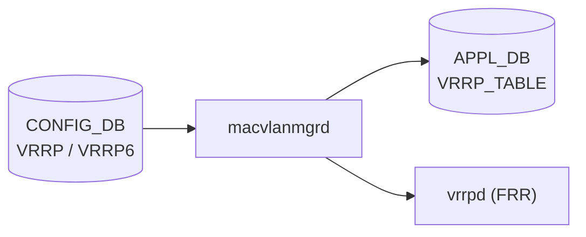

# VRRP テーブル

## 概要

[VRRP](../../reference/glossary.md#term-vrrp) (Virtual Router Redundancy Protocol) の CONFIG_DB スキーマ[^1]。FRR (`vrrpd`) を使用して VRRPv2 (IPv4 のみ) / VRRPv3 (IPv4・IPv6) を実装する。Linux の macvlan デバイス機能で仮想 MAC アドレスを付与し、仮想 IP (VIP) を管理する。

4 つのテーブルで構成される:

| テーブル | 説明 |
|---------|------|
| `VRRP` | IPv4 VRRP インスタンス設定 |
| `VRRP6` | IPv6 VRRP インスタンス設定 |
| `VRRP_TRACK` | IPv4 VRRP インスタンスのアップリンク追跡 |
| `VRRP6_TRACK` | IPv6 VRRP インスタンスのアップリンク追跡 |

Consumer: `macvlanmgrd` (CONFIG_DB を subscribe → Linux macvlan デバイス作成 → APPL_DB 更新 → vrrpd 設定)

<!-- cdb-mermaid -->
### データフロー (自動生成)



!!! note "凡例"
    CONFIG_DB から FRR/APPL_DB までの典型経路。macvlanmgrd が macvlan デバイスを Linux カーネルに作成し、APPL_DB に VMAC 情報を書き込む。vrrpd (FRR) が VRRP 状態機械を実行する。
<!-- /cdb-mermaid -->

## key 構造

```text
VRRP|<interface_name>|<vrid>
VRRP6|<interface_name>|<vrid>
VRRP_TRACK|<interface_name>|<vrid>|<track_interface>
VRRP6_TRACK|<interface_name>|<vrid>|<track_interface>
```

- `interface_name`: `Ethernet`・`Vlan`・`PortChannel`・サブインターフェース。`Loopback` は不可。
- `vrid`: VRRP インスタンス識別子 (1–255)。インターフェーススコープ — 同一インターフェース上でユニーク。
- `track_interface`: 追跡対象インターフェース名。

## フィールド — VRRP / VRRP6

| フィールド | 型 | デフォルト | 説明 |
|-----------|------|-----------|------|
| `vrid` | uint8 (1–255) | — | VRRP インスタンス識別子 |
| `vip` | leaf-list ipv4-prefix (VRRP) / ipv6-prefix (VRRP6) | — | 仮想 IP アドレス。最大 4 件 |
| `priority` | uint8 (1–254) | `100` | このルータの VRRP 優先度。高いほど Master になりやすい。255 は Owner 用 |
| `adv_interval` | uint8 (1–254) | `1` | Advertisement 送信間隔（秒） |
| `version` | string `"2"` / `"3"` | `"3"` | VRRP バージョン (VRRP のみ。VRRP6 は常に VRRPv3) |
| `pre_empt` | string `"True"` / `"False"` | `"True"` | より高優先度のバックアップが Master を引き継ぐプリエンプション |
| `use_v2_checksum` | string `"True"` / `"False"` | — | VRRPv3 でも v2 互換チェックサムを使用 |

## フィールド — VRRP_TRACK / VRRP6_TRACK

| フィールド | 型 | 説明 |
|-----------|------|------|
| `priority_increment` | uint8 (1–255) | 追跡インターフェースがダウンした場合の優先度減少量 |

## 仮想 MAC アドレス

RFC 5798 に基づき以下の仮想 MAC が使用される:

- IPv4: `00:00:5e:00:01:<vrid>` (16進)
- IPv6: `00:00:5e:00:02:<vrid>` (16進)

## 制約・スケール上限

| 制約 | 上限 | 根拠 |
|------|------|------|
| システム全体の VRRP インスタンス数 | 254 | `config/main.py:6912-6913` |
| インターフェースあたりの VRRP インスタンス数 | 16 | `config/main.py:6921-6924` |
| インスタンスあたりの VIP 数 | 4 | YANG `max-elements 4` |
| インスタンスあたりのトラック インターフェース数 | 8 | `config/main.py:7034-7038` |
| YANG `max-elements` (VRRP_LIST / VRRP6_LIST) | 128 | `sonic-vrrp.yang` |

## 購読者

- `macvlanmgrd`: CONFIG_DB の `VRRP` / `VRRP6` テーブルを subscribe し、macvlan デバイスを Linux カーネルに作成。APPL_DB の `VRRP_TABLE` に VMAC 情報を書き込む。vtysh 経由で vrrpd に設定を投入する
- `vrrpsyncd`: Linux カーネルの macvlan インターフェース状態変化を listen し、APPL_DB の `INTF_TABLE` を更新する
- `intforch`: APPL_DB の `INTF_TABLE` を受けて VIP と仮想 MAC エントリを ASIC_DB に書き込む

## 関連 CONFIG_DB / YANG / CLI

- 関連 [CONFIG_DB](../../reference/glossary.md#term-config_db): `INTERFACE`、`VLAN_INTERFACE`、`PORTCHANNEL_INTERFACE`
- 関連 [YANG](../../reference/glossary.md#term-yang): `sonic-vrrp`
- 関連 CLI: `config interface vrrp ip add/remove`、`config interface vrrp priority`、`config interface vrrp adv_interval`、`config interface vrrp pre_empt`、`config interface vrrp version`、`config interface vrrp track_interface add/remove`

<!-- cdb-exceptions -->
## 例外条件・特殊挙動

| 条件 | 挙動 |
|------|------|
| `version = "2"` で IPv6 VIP を設定 | FRR が VRRPv2 は IPv6 非対応として reject |
| VIP が親インターフェースの実 IP と同一 | VRRP Owner (priority=255) として動作。プリエンプション無効でも Master を維持 |
| `pre_empt = "False"` | バックアップが優先度が高くても Master へ昇格しない（Owner は例外） |
| macvlanmgrd 未起動時の CONFIG_DB 書き込み | macvlanmgrd 起動後に購読キューをリプレイして適用。macvlan デバイス作成は起動後 |
| VIP が別インスタンスと重複 | CLI `check_vrrp_ip_exist()` が abort |

<!-- /cdb-exceptions -->

## 書込み順依存 (Phase B)

`VRRP` / `VRRP6` テーブルはインターフェース存在・インスタンス存在・YANG leafref という 3 系統の順序依存を持つ。`sonic-utilities/config/main.py` の VRRP サブコマンド全行精読と `sonic-vrrp.yang` の leafref 確認で抽出。

### 強制順序（破ると不整合・reject）

| # | 順序 | 依存元 | 破った場合の挙動 |
|---|------|--------|----------------|
| 1 | INTERFACE / VLAN_INTERFACE / PORTCHANNEL_INTERFACE エントリ → VRRP インスタンス作成 | CLI `add_vrrp_ip()` L6889-6890 | `ctx.fail("Router Interface '{}' not found")` で abort |
| 2 | VRRP\|<ifname>\|<vrid> → VRRP_TRACK\|<ifname>\|<vrid>\|<trackifname> | CLI `add_track_interface()` L7017-7020 | `ctx.fail("vrrp instance {} not found")` で abort |
| 3 | INTERFACE / VLAN_INTERFACE / PORTCHANNEL_INTERFACE エントリ → VRRP_TRACK の trackifname | CLI `add_track_interface()` L7013-7016 | `ctx.fail("Router Interface '{}' not found")` で abort |
| 4 | VRRP6\|<ifname>\|<vrid> → VRRP6_TRACK\|<ifname>\|<vrid>\|<trackifname> | YANG leafref `baseifname` → `VRRP6_LIST/ifname` | YANG バリデーション経路で leafref エラー。直接書き込みは macvlanmgrd が未定義挙動 |
| 7 | YANG leafref: VRRP_TRACK.baseifname → VRRP_LIST.ifname | `sonic-vrrp.yang` leafref 宣言 | sonic-yang-mgmt / GNMI が leafref エラーで reject |

### 起動順（実装で吸収される一過性の窓）

| # | 順序 | 依存元 | 吸収機構 |
|---|------|--------|---------|
| 6 | macvlanmgrd 起動 → VRRP macvlan デバイス作成 | `macvlanmgrd` subscribe 開始 | 起動後に CONFIG_DB 既存エントリを全リプレイ |

### スケール制約（書き込み前チェック）

| 制約 | 上限 | evidence |
|------|------|---------|
| 全 VRRP インスタンス数 | 254 | `config/main.py:6912-6913` |
| 1 インターフェースあたり VRRP インスタンス数 | 16 | `config/main.py:6921-6924` |
| 1 インスタンスあたり VIP 数 | 4 | YANG `max-elements 4`、`config/main.py:6908-6910` |
| 1 インスタンスあたりトラック インターフェース数 | 8 | `config/main.py:7034-7038` |

### DEL 操作の順序

| 操作 | 推奨順序 |
|------|---------|
| VRRP インスタンス削除 | VRRP_TRACK エントリを先に DEL → VRRP インスタンスを DEL |
| VIP 削除後インスタンス削除 | VIP を全削除 → インスタンスエントリを DEL |

### 順序依存サマリ

| # | 依存関係 | 区分 | 緩和策 |
|---|----------|------|--------|
| 1 | INTERFACE 等 → VRRP インスタンス | 強制先行 (CLI reject) | 順序遵守 |
| 2 | VRRP インスタンス → VRRP_TRACK | 強制先行 (CLI reject) | 順序遵守 |
| 3 | INTERFACE 等 → VRRP_TRACK trackifname | 強制先行 (CLI reject) | 順序遵守 |
| 4 | VRRP6 インスタンス → VRRP6_TRACK | 強制先行 (YANG leafref) | 順序遵守 |
| 5 | VIP 重複禁止 | 非順序制約 | `check_vrrp_ip_exist` で事前確認 |
| 6 | macvlanmgrd 起動 → macvlan 反映 | 一過性 (起動後リプレイ) | 運用上無視可 |

<!-- /ordering (Phase B) -->

## 引用元

[^1]: VRRP Adaptation HLD: `sonic-net/SONiC`, `doc/vrrp/VRRP_Adaptation_HLD.md`. <https://github.com/sonic-net/SONiC/blob/master/doc/vrrp/VRRP_Adaptation_HLD.md>

<!-- ops-hint -->
## 運用ヒント

### 典型設定例

```bash
# Vlan100 上で VRID=1 の VRRPv3 インスタンスを作成
config interface vrrp ip add Vlan100 1 192.168.1.254/24
config interface vrrp priority Vlan100 1 110
config interface vrrp version Vlan100 1 3
config interface vrrp adv_interval Vlan100 1 1
config interface vrrp pre_empt Vlan100 1 True

# アップリンク追跡を追加 (Ethernet0 がダウンすると優先度を 20 下げる)
config interface vrrp track_interface add Vlan100 1 Ethernet0 20

# CONFIG_DB 確認
sonic-db-cli CONFIG_DB hgetall "VRRP|Vlan100|1"
```

### 確認コマンド

```bash
sonic-db-cli CONFIG_DB keys 'VRRP|*'
sonic-db-cli CONFIG_DB keys 'VRRP6|*'
sonic-db-cli CONFIG_DB keys 'VRRP_TRACK|*'
```
<!-- /ops-hint -->

<!-- glossary-links-injected: vrrp-phase-b -->
