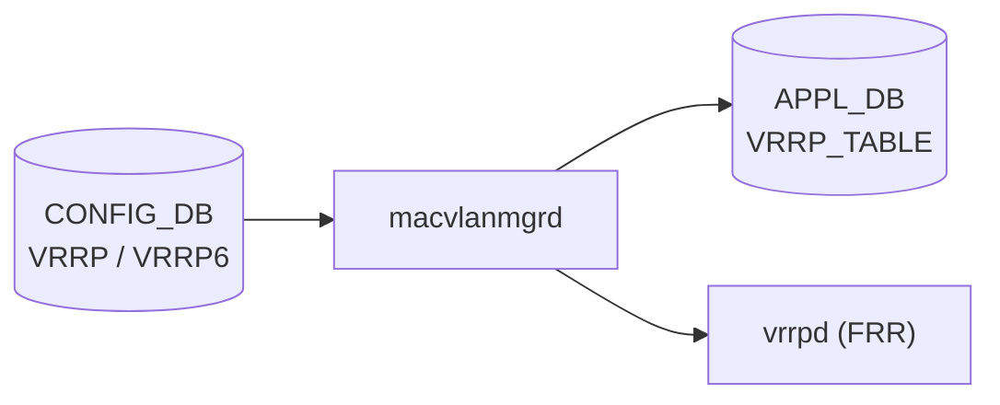

# VRRP テーブル

## 概要

[VRRP](../../reference/glossary.md#term-vrrp) (Virtual Router Redundancy Protocol) の CONFIG_DB スキーマ[^1]。FRR (`vrrpd`) を使用して VRRPv2 (IPv4 のみ) / VRRPv3 (IPv4・IPv6) を実装する。Linux の macvlan デバイス機能で仮想 MAC アドレスを付与し、仮想 IP (VIP) を管理する。

4 つのテーブルで構成される:

| テーブル | 説明 |
|---------|------|
| `VRRP` | IPv4 VRRP インスタンス設定 |
| `VRRP6` | IPv6 VRRP インスタンス設定 |
| `VRRP_TRACK` | IPv4 VRRP インスタンスのアップリンク追跡 |
| `VRRP6_TRACK` | IPv6 VRRP インスタンスのアップリンク追跡 |

Consumer: `macvlanmgrd` (CONFIG_DB を subscribe → Linux macvlan デバイス作成 → APPL_DB 更新 → vrrpd 設定)

<!-- cdb-mermaid -->
### データフロー (自動生成)



!!! note "凡例"
    CONFIG_DB から FRR/APPL_DB までの典型経路。macvlanmgrd が macvlan デバイスを Linux カーネルに作成し、APPL_DB に VMAC 情報を書き込む。vrrpd (FRR) が VRRP 状態機械を実行する。
<!-- /cdb-mermaid -->

## key 構造

```text
VRRP|<interface_name>|<vrid>
VRRP6|<interface_name>|<vrid>
VRRP_TRACK|<interface_name>|<vrid>|<track_interface>
VRRP6_TRACK|<interface_name>|<vrid>|<track_interface>
```

- `interface_name`: `Ethernet`・`Vlan`・`PortChannel`・サブインターフェース。`Loopback` は不可。
- `vrid`: VRRP インスタンス識別子 (1–255)。インターフェーススコープ — 同一インターフェース上でユニーク。
- `track_interface`: 追跡対象インターフェース名。

## フィールド — VRRP / VRRP6

| フィールド | 型 | デフォルト | 説明 |
|-----------|------|-----------|------|
| `vrid` | uint8 (1–255) | — | VRRP インスタンス識別子 |
| `vip` | leaf-list ipv4-prefix (VRRP) / ipv6-prefix (VRRP6) | — | 仮想 IP アドレス。最大 4 件 |
| `priority` | uint8 (1–254) | `100` | このルータの VRRP 優先度。高いほど Master になりやすい。255 は Owner 用 |
| `adv_interval` | uint8 (1–254) | `1` | Advertisement 送信間隔（秒） |
| `version` | string `"2"` / `"3"` | `"3"` | VRRP バージョン (VRRP のみ。VRRP6 は常に VRRPv3) |
| `pre_empt` | string `"True"` / `"False"` | `"True"` | より高優先度のバックアップが Master を引き継ぐプリエンプション |
| `use_v2_checksum` | string `"True"` / `"False"` | — | VRRPv3 でも v2 互換チェックサムを使用 |

## フィールド — VRRP_TRACK / VRRP6_TRACK

| フィールド | 型 | 説明 |
|-----------|------|------|
| `priority_increment` | uint8 (1–255) | 追跡インターフェースがダウンした場合の優先度減少量 |

## 仮想 MAC アドレス

RFC 5798 に基づき以下の仮想 MAC が使用される:

- IPv4: `00:00:5e:00:01:<vrid>` (16進)
- IPv6: `00:00:5e:00:02:<vrid>` (16進)

## 制約・スケール上限

| 制約 | 上限 | 根拠 |
|------|------|------|
| システム全体の VRRP インスタンス数 | 254 | `config/main.py:6912-6913` |
| インターフェースあたりの VRRP インスタンス数 | 16 | `config/main.py:6921-6924` |
| インスタンスあたりの VIP 数 | 4 | YANG `max-elements 4` |
| インスタンスあたりのトラック インターフェース数 | 8 | `config/main.py:7034-7038` |
| YANG `max-elements` (VRRP_LIST / VRRP6_LIST) | 128 | `sonic-vrrp.yang` |

## 購読者

- `macvlanmgrd`: CONFIG_DB の `VRRP` / `VRRP6` テーブルを subscribe し、macvlan デバイスを Linux カーネルに作成。APPL_DB の `VRRP_TABLE` に VMAC 情報を書き込む。vtysh 経由で vrrpd に設定を投入する
- `vrrpsyncd`: Linux カーネルの macvlan インターフェース状態変化を listen し、APPL_DB の `INTF_TABLE` を更新する
- `intforch`: APPL_DB の `INTF_TABLE` を受けて VIP と仮想 MAC エントリを ASIC_DB に書き込む

## 関連 CONFIG_DB / YANG / CLI

- 関連 [CONFIG_DB](../../reference/glossary.md#term-config_db): `INTERFACE`、`VLAN_INTERFACE`、`PORTCHANNEL_INTERFACE`
- 関連 [YANG](../../reference/glossary.md#term-yang): `sonic-vrrp`
- 関連 CLI: `config interface vrrp ip add/remove`、`config interface vrrp priority`、`config interface vrrp adv_interval`、`config interface vrrp pre_empt`、`config interface vrrp version`、`config interface vrrp track_interface add/remove`

<!-- cdb-exceptions -->
## 例外条件・特殊挙動

| 条件 | 挙動 |
|------|------|
| `version = "2"` で IPv6 VIP を設定 | FRR が VRRPv2 は IPv6 非対応として reject |
| VIP が親インターフェースの実 IP と同一 | VRRP Owner (priority=255) として動作。プリエンプション無効でも Master を維持 |
| `pre_empt = "False"` | バックアップが優先度が高くても Master へ昇格しない（Owner は例外） |
| macvlanmgrd 未起動時の CONFIG_DB 書き込み | macvlanmgrd 起動後に購読キューをリプレイして適用。macvlan デバイス作成は起動後 |
| VIP が別インスタンスと重複 | CLI `check_vrrp_ip_exist()` が abort |

<!-- /cdb-exceptions -->

## 書込み順依存 (Phase B)

`VRRP` / `VRRP6` テーブルはインターフェース存在・インスタンス存在・YANG leafref という 3 系統の順序依存を持つ。`sonic-utilities/config/main.py` の VRRP サブコマンド全行精読と `sonic-vrrp.yang` の leafref 確認で抽出。

### 強制順序（破ると不整合・reject）

| # | 順序 | 依存元 | 破った場合の挙動 |
|---|------|--------|----------------|
| 1 | INTERFACE / VLAN_INTERFACE / PORTCHANNEL_INTERFACE エントリ → VRRP インスタンス作成 | CLI `add_vrrp_ip()` L6889-6890 | `ctx.fail("Router Interface '{}' not found")` で abort |
| 2 | VRRP\|<ifname>\|<vrid> → VRRP_TRACK\|<ifname>\|<vrid>\|<trackifname> | CLI `add_track_interface()` L7017-7020 | `ctx.fail("vrrp instance {} not found")` で abort |
| 3 | INTERFACE / VLAN_INTERFACE / PORTCHANNEL_INTERFACE エントリ → VRRP_TRACK の trackifname | CLI `add_track_interface()` L7013-7016 | `ctx.fail("Router Interface '{}' not found")` で abort |
| 4 | VRRP6\|<ifname>\|<vrid> → VRRP6_TRACK\|<ifname>\|<vrid>\|<trackifname> | YANG leafref `baseifname` → `VRRP6_LIST/ifname` | YANG バリデーション経路で leafref エラー。直接書き込みは macvlanmgrd が未定義挙動 |
| 7 | YANG leafref: VRRP_TRACK.baseifname → VRRP_LIST.ifname | `sonic-vrrp.yang` leafref 宣言 | sonic-yang-mgmt / GNMI が leafref エラーで reject |

### 起動順（実装で吸収される一過性の窓）

| # | 順序 | 依存元 | 吸収機構 |
|---|------|--------|---------|
| 6 | macvlanmgrd 起動 → VRRP macvlan デバイス作成 | `macvlanmgrd` subscribe 開始 | 起動後に CONFIG_DB 既存エントリを全リプレイ |

### スケール制約（書き込み前チェック）

| 制約 | 上限 | evidence |
|------|------|---------|
| 全 VRRP インスタンス数 | 254 | `config/main.py:6912-6913` |
| 1 インターフェースあたり VRRP インスタンス数 | 16 | `config/main.py:6921-6924` |
| 1 インスタンスあたり VIP 数 | 4 | YANG `max-elements 4`、`config/main.py:6908-6910` |
| 1 インスタンスあたりトラック インターフェース数 | 8 | `config/main.py:7034-7038` |

### DEL 操作の順序

| 操作 | 推奨順序 |
|------|---------|
| VRRP インスタンス削除 | VRRP_TRACK エントリを先に DEL → VRRP インスタンスを DEL |
| VIP 削除後インスタンス削除 | VIP を全削除 → インスタンスエントリを DEL |

### 順序依存サマリ

| # | 依存関係 | 区分 | 緩和策 |
|---|----------|------|--------|
| 1 | INTERFACE 等 → VRRP インスタンス | 強制先行 (CLI reject) | 順序遵守 |
| 2 | VRRP インスタンス → VRRP_TRACK | 強制先行 (CLI reject) | 順序遵守 |
| 3 | INTERFACE 等 → VRRP_TRACK trackifname | 強制先行 (CLI reject) | 順序遵守 |
| 4 | VRRP6 インスタンス → VRRP6_TRACK | 強制先行 (YANG leafref) | 順序遵守 |
| 5 | VIP 重複禁止 | 非順序制約 | `check_vrrp_ip_exist` で事前確認 |
| 6 | macvlanmgrd 起動 → macvlan 反映 | 一過性 (起動後リプレイ) | 運用上無視可 |

<!-- /ordering (Phase B) -->

<!-- cross-refs -->
## 暗黙参照テーブル (Phase C)

`VRRP` / `VRRP6` テーブルは YANG leafref と CLI 実行時チェックの 2 系統で外部テーブルを参照する。詳細スキャンノート: [`meta/_intermediate/cdb-flow/vrrp-cross-refs.md`](https://github.com/aoki-taquan/sonic-unofficial-docs/blob/main/meta/_intermediate/cdb-flow/vrrp-cross-refs.md)。

### YANG leafref (VRRP / VRRP6 — `ifname` フィールド)

`VRRP_LIST.ifname` / `VRRP6_LIST.ifname` は union leafref で以下 4 テーブルのいずれかを参照。`sonic-yang-mgmt` / gNMI 経路でバリデーション。

| 参照先テーブル | フィールド | 条件 | evidence |
|---|---|---|---|
| `INTERFACE` | `INTERFACE_LIST/portname` | `Ethernet*` 系インタフェース | `sonic-vrrp.yang` L65–67, L190–192 |
| `PORTCHANNEL_INTERFACE` | `PORTCHANNEL_INTERFACE_LIST/pch_name` | `PortChannel*` 系 | `sonic-vrrp.yang` L68–70, L193–195 |
| `VLAN_INTERFACE` | `VLAN_INTERFACE_LIST/vlanName` | `Vlan*` 系 | `sonic-vrrp.yang` L71–73, L196–198 |
| `VLAN_SUB_INTERFACE` | `VLAN_SUB_INTERFACE_LIST/id` | サブインタフェース (e.g. `Ethernet0.10`) | `sonic-vrrp.yang` L74–76, L199–201 |

### YANG leafref (VRRP_TRACK / VRRP6_TRACK)

| フィールド | 参照先テーブル | evidence |
|---|---|---|
| `baseifname` | `VRRP_LIST/ifname` (親 VRRP インスタンス) | `sonic-vrrp.yang` L144–146 |
| `idkey` | `VRRP_LIST/idkey` (親 VRRP インスタンス) | `sonic-vrrp.yang` L150–152 |
| `trackifname` | `PORT/PORT_LIST/ifname` | `sonic-vrrp.yang` L158–160 |
| `trackifname` | `PORTCHANNEL/PORTCHANNEL_LIST/name` | `sonic-vrrp.yang` L161–163 |
| `trackifname` | `VLAN/VLAN_LIST/name` | `sonic-vrrp.yang` L164–166 |
| `trackifname` | `VLAN_SUB_INTERFACE/VLAN_SUB_INTERFACE_LIST/id` | `sonic-vrrp.yang` L167–169 |

(`VRRP6_TRACK` も同様に `VRRP6_LIST` を参照、`sonic-vrrp.yang` L263–291)

### CLI 実行時存在確認 (config/main.py)

YANG バリデーションとは独立して CLI が `get_table()` で存在確認を行う。

| 確認対象テーブル | 確認タイミング | 失敗時の挙動 | evidence |
|---|---|---|---|
| `INTERFACE` / `PORTCHANNEL_INTERFACE` / `VLAN_INTERFACE` | VRRP インスタンス作成時 | `ctx.fail("Router Interface '{}' not found")` で永続拒絶 | `config/main.py` L6886–6890 |
| `INTERFACE` / `PORTCHANNEL_INTERFACE` / `VLAN_INTERFACE` | VRRP_TRACK 追加時 (基底 IF) | `ctx.fail("Router Interface '{}' not found")` | `config/main.py` L7000–7006 |
| `INTERFACE` / `PORTCHANNEL_INTERFACE` / `VLAN_INTERFACE` | VRRP_TRACK 追加時 (追跡 IF) | `ctx.fail("Router Interface '{}' not found")` | `config/main.py` L7007–7014 |

### データ流出先

`macvlanmgrd` が CONFIG_DB.VRRP / VRRP6 変更を受けて書き込む先:

| 書き込み先 | 後続 Consumer |
|---|---|
| `APPL_DB.VRRP_TABLE` (VMAC・インタフェース情報) | `intforch` → VIP / VMAC エントリを `ASIC_DB` へ |
| Linux macvlan デバイス (カーネル) | `vrrpsyncd` → `APPL_DB.INTF_TABLE` → `intforch` → `ASIC_DB` |

<!-- /cross-refs -->

<!-- failure -->
## 失敗挙動 (Phase D)

`VRRP` / `VRRP6` / `VRRP_TRACK` / `VRRP6_TRACK` テーブルへの書き込みは CLI (`sonic-utilities/config/main.py`) 経路と YANG/gNMI 直書き経路で異なる失敗分岐を持つ。詳細スキャンノート: [`meta/_intermediate/cdb-flow/vrrp-failure.md`](https://github.com/aoki-taquan/sonic-unofficial-docs/blob/main/meta/_intermediate/cdb-flow/vrrp-failure.md)。

### CLI 経路の失敗パターン

#### VIP 追加 / インスタンス新規作成 (`add_vrrp_ip`)

| 失敗ケース | 失敗箇所 | 挙動 | retry |
|---|---|---|---|
| インタフェース名が Loopback 系 | `config/main.py:6884-6886` | `ctx.fail("'interface_name' is not valid.")` で永続拒絶 | なし |
| `INTERFACE` / `VLAN_INTERFACE` / `PORTCHANNEL_INTERFACE` 未存在 | `config/main.py:6887-6890` | `ctx.fail("Router Interface '{}' not found")` で永続拒絶 | なし |
| VIP アドレス形式不正 | `config/main.py:6892-6893` | `ctx.abort()` で即時終了 | なし |
| VIP が別インスタンスで使用中 | `config/main.py:6894-6895` | `ctx.abort()` で即時終了（`check_vrrp_ip_exist` による重複確認） | なし |
| VIP に CIDR prefix がない | `config/main.py:6897-6898` | `ctx.fail("IP address {} is missing a mask.")` | なし |
| 同インスタンスが既に 4 VIP 設定済み | `config/main.py:6906-6909` | `ctx.fail("...already configured 4 IP addresses")` | なし |
| システム全体 254 インスタンス上限超過 | `config/main.py:6914-6916` | `ctx.fail("Has already configured 254 vrrp instances")` | なし |
| 同 VRID が別インタフェースで既存 | `config/main.py:6919-6920` | `ctx.fail("The vrrp instance {} has already configured!")` | なし |
| 同インタフェースで 16 インスタンス上限超過 | `config/main.py:6922-6924` | `ctx.fail("{} has already configured 16 vrrp instances!")` | なし |

#### パラメータ変更コマンド (`priority` / `adv_interval` / `pre_empt` / `version`)

各コマンドは共通して以下の順でバリデーションを行う:

| 失敗ケース | 挙動 |
|---|---|
| インタフェース名が無効 / Loopback 系 | `ctx.fail("'interface_name' is not valid.")` |
| `INTERFACE` / `VLAN_INTERFACE` / `PORTCHANNEL_INTERFACE` 未存在 | `ctx.fail("Router Interface '{}' not found")` |
| VRRP インスタンス未存在 | `ctx.fail("vrrp instance {} not found on interface {}")` |
| パラメータ値が範囲外 | Click `IntRange` / `Choice` でコマンド解析時に即時拒絶（DB 書き込みなし） |

#### トラックインタフェース追加 (`add_track_interface`)

| 失敗ケース | 失敗箇所 | 挙動 |
|---|---|---|
| ベースインタフェース未存在 | `config/main.py:7000-7006` | `ctx.fail("Router Interface '{}' not found")` |
| 追跡インタフェース未存在 | `config/main.py:7007-7014` | `ctx.fail("Router Interface '{}' not found")` |
| 親 VRRP インスタンス未存在 | `config/main.py:7017-7019` | `ctx.fail("vrrp instance {} not found on interface {}")` |
| 同インスタンスに 8 トラック既存 | `config/main.py:7028-7038` | `ctx.fail("The Vrrpv instance {} has already configured 8 track interfaces")` |

### macvlanmgrd / vrrpsyncd の失敗挙動

| 条件 | 挙動 | 備考 |
|---|---|---|
| macvlanmgrd 未起動時の CONFIG_DB 書き込み | エントリは購読キューに滞留し、macvlanmgrd 起動後にリプレイされて macvlan デバイスが作成される | HLD `Modules Design and Flows` セクション |
| Linux カーネルが 5.1 未満 | macvlan デバイスの protodown がサポートされないため VRRP 状態機械が正常動作しない | HLD `Operating environment` (L199-200) |
| vtysh コマンド失敗 (FRR 側) | macvlanmgrd の vtysh 投入失敗時の明示的ロールバック仕様は HLD に記述なし。CONFIG_DB / APPL_DB は書き込み済みのまま | HLD 記述範囲外 |

### Warmboot 非対応

HLD `Warmboot and Fastboot Design Impact` セクション (L622-628) の記述:

- VRRP は **Warm boot 非対応**。VRRPv2 / VRRPv3 の RFC ではウォームブートの維持方法が定義されていないため
- VRRP が有効な状態でウォームブートを実行しようとするとエラーメッセージが表示される
- ウォームブート実行前に VRRP を無効化（全インスタンス削除）する必要がある
<!-- /failure -->

<!-- constants -->
## ハードコード定数 (Phase E)

`VRRP` / `VRRP6` / `VRRP_TRACK` / `VRRP6_TRACK` テーブルおよび `macvlanmgrd` / `vrrpsyncd` 内に存在する、CONFIG_DB / YANG で管理されないハードコード定数の一覧。詳細スキャンノート: [`meta/_intermediate/cdb-flow/vrrp-constants.md`](https://github.com/aoki-taquan/sonic-unofficial-docs/blob/main/meta/_intermediate/cdb-flow/vrrp-constants.md)。

### スケール上限リテラル (config/main.py)

| 定数 / リテラル | 値 | 対象テーブル | ソース |
|---|---|---|---|
| システム全体 VRRP / VRRP6 インスタンス上限 | `254` | `VRRP` / `VRRP6` | `config/main.py:6915, 7231, 7333` |
| インタフェースあたり VRRP / VRRP6 インスタンス上限 | `16` | `VRRP` / `VRRP6` | `config/main.py:6924, 7240, 7342` |
| インスタンスあたり VIP 上限 (IPv4 / IPv6) | `4` | `VRRP` / `VRRP6` | `config/main.py:6908, 7327` |
| インスタンスあたりトラックインタフェース上限 | `8` | `VRRP_TRACK` | `config/main.py:7038` |

!!! note "YANG `max-elements` との乖離"
    `sonic-vrrp.yang` の `VRRP_LIST` / `VRRP6_LIST` には `max-elements 128` が宣言されているが、CLI 側の上限は `254`。CLI 検査が先に発火するため YANG の `128` 上限は実効的に到達しない。

### フィールドデフォルト (YANG スキーマ由来)

| フィールド | YANG default | 対象テーブル | ソース |
|---|---|---|---|
| `priority` | `100` | `VRRP` / `VRRP6` | `sonic-vrrp.yang` L106, L224 |
| `adv_interval` | `1` (秒) | `VRRP` / `VRRP6` | `sonic-vrrp.yang` L112, L230 |

### プロトコル RFC 定数 (DB 管理外)

`macvlanmgrd` / FRR `vrrpd` が内部でハードコードする RFC 5798 由来の定数。CONFIG_DB には現れない。

| 定数 | 値 | 説明 | ソース |
|---|---|---|---|
| IPv4 仮想 MAC プレフィクス | `00:00:5e:00:01:<vrid>` | VRID ごとに VMAC を一意に決定 (RFC 5798) | HLD L169 |
| IPv6 仮想 MAC プレフィクス | `00:00:5e:00:02:<vrid>` | IPv6 VRID 用 VMAC | HLD L171 |
| VRRP IPv4 マルチキャストアドレス | `224.0.0.18` | Advertisement パケットの宛先 | HLD L177 |
| VRRP IPv6 マルチキャストアドレス | `ff02::12` | IPv6 Advertisement の宛先 | HLD L177 |
| IP プロトコル番号 | `112` | VRRP パケットの IP プロトコル TYPE (IANA) | HLD L177 |
| Linux カーネル最小バージョン | `5.1` | macvlan protodown サポート要件 | HLD L199-200 |

### macvlan デバイス命名規則 (macvlanmgrd 由来)

`macvlanmgrd` が Linux カーネルに作成する macvlan デバイスの名前規則。CONFIG_DB には記録されない。

| 規則 | 値 | 説明 | ソース |
|---|---|---|---|
| IPv4 macvlan 名プレフィクス | `Vrrp4-` | `ip link add Vrrp4-<intf>-<vrid> type macvlan mode bridge` | HLD Container セクション |
| IPv6 macvlan 名プレフィクス | `Vrrp6-` | `ip link add Vrrp6-<intf>-<vrid> type macvlan mode bridge` | HLD Container セクション |
| macvlan タイプ | `bridge` | macvlan デバイスの mode | HLD L117 |
| macvlan addrgenmode | `random` | link local 生成を MAC ではなくランダムにする | HLD L117 |

<!-- /constants -->

<!-- side-effects -->
## 副次 DB 書込 (Phase F)

`VRRP` / `VRRP6` テーブルへの SET/DEL が起点となり、`macvlanmgrd` → `vrrpsyncd` → `intforch (vrrporch)` の 3 段チェーンで CONFIG_DB 以外のリソースへ書き込む。詳細スキャンノート: [`meta/_intermediate/cdb-flow/vrrp-side-effects.md`](https://github.com/aoki-taquan/sonic-unofficial-docs/blob/main/meta/_intermediate/cdb-flow/vrrp-side-effects.md)。

### macvlanmgrd — Linux カーネルへの書込 (CONFIG_DB → kernel)

`macvlanmgrd` は CONFIG_DB.VRRP / VRRP6 の変更を受けて以下を実行する。DB への直接書込ではなく Linux カーネルへのネットリンク操作。

| 操作 | 内容 | トリガ | evidence |
|------|------|--------|---------|
| macvlan デバイス作成 | `ip link add Vrrp4-<intf>-<vrid> link <intf> addrgenmode random type macvlan mode bridge` | VRRP SET | HLD L117, L221 |
| 仮想 MAC 設定 | `ip link set Vrrp4-<intf>-<vrid> address 00:00:5e:00:01:<vrid>` | VRRP SET | HLD L221 |
| VIP 付与 | `ip addr add <vip>/32 dev Vrrp4-<intf>-<vrid>` | VRRP VIP SET | HLD L222 |
| macvlan デバイス削除 | `ip link del Vrrp4-<intf>-<vrid>` | VRRP DEL | HLD L221 |
| IPv6 macvlan 作成 | `ip link add Vrrp6-<intf>-<vrid> link <intf> addrgenmode random type macvlan mode bridge` | VRRP6 SET | HLD L122, L221 |

さらに、`vtysh` コマンド経由で FRR `vrrpd` にインスタンス設定を投入する（DB 書込なし）。

### vrrpsyncd — APPL_DB.VRRP_TABLE への書込 (kernel → APPL_DB)

`vrrpsyncd` は Linux macvlan デバイスの protodown 状態変化（Master 昇格 = protodown off）を netlink で監視し、APPL_DB に書き込む。

| 操作 | 対象 DB / テーブル | キー / フィールド | トリガ | evidence |
|------|------------------|-----------------|--------|---------|
| SET | APPL_DB / `VRRP_TABLE` | `VRRP_TABLE:<intf>\|<vip>/32` field=`vmac:<00:00:5e:00:01:<vrid>>` | macvlan デバイスへの IP 追加 (Master 昇格) | HLD L231 |
| DEL | APPL_DB / `VRRP_TABLE` | `VRRP_TABLE:<intf>\|<vip>/32` | macvlan デバイスからの IP 削除 (Master 降格) | HLD L232 |
| SET (IPv6) | APPL_DB / `VRRP_TABLE` | `VRRP_TABLE:<intf>\|<vip>/128` field=`vmac:<00:00:5e:00:02:<vrid>>` | IPv6 Master 昇格 | HLD L231 |

`type` フィールド (IPv4 / IPv6) もキーに含まれる: `VRRP_TABLE:<interface_name>:<vip>:<type>`。

### intforch (vrrporch) — ASIC_DB への書込 (APPL_DB → ASIC_DB)

`vrrporch` は APPL_DB.VRRP_TABLE を購読し、SAI API 経由で ASIC_DB に仮想 RIF と VIP ルートを書き込む。

| 操作 | 対象 DB / テーブル | 内容 | トリガ | evidence |
|------|------------------|------|--------|---------|
| 仮想 RIF 作成 | ASIC_DB / `ASIC_STATE:SAI_OBJECT_TYPE_ROUTER_INTERFACE:<oid>` | `SAI_ROUTER_INTERFACE_ATTR_IS_VIRTUAL=true`, `SAI_ROUTER_INTERFACE_ATTR_SRC_MAC_ADDRESS=<vmac>` | APPL_DB.VRRP_TABLE SET | HLD L438-459, SAI API セクション |
| VIP ルート追加 | ASIC_DB / `ASIC_STATE:SAI_OBJECT_TYPE_ROUTE_ENTRY` | VIP の /32 or /128 ルートを CPU trap / 仮想 RIF に向ける | APPL_DB.VRRP_TABLE SET | HLD L235 |
| 仮想 RIF 削除 | ASIC_DB | RIF OID を削除 | APPL_DB.VRRP_TABLE DEL | HLD L235 |

### VRRP_TRACK の副次書込

`VRRP_TRACK` / `VRRP6_TRACK` テーブルへの SET/DEL は DB への副次書込を発生させない。FRR `vrrpd` が CONFIG_DB から直接読み込んだ追跡設定をメモリ内で保持し、`zebra` 経由のインタフェース状態変化通知に応じて priority を再計算する。DB への書込は行われず VRRP Advertisement パケットのみに反映される（HLD L486-491）。

### 副次書込なし

- **STATE_DB**: VRRP 状態は STATE_DB に記録されない。Master/Backup 状態は APPL_DB.VRRP_TABLE の有無と macvlan デバイスの protodown 状態で管理。
- **FLEX_COUNTER_DB**: VRRP インスタンスに対する FlexCounter 登録はなし。
- **COUNTERS_DB**: VRRP 専用カウンタマップの登録はなし（ACL/RIF カウンタとは独立）。

<!-- /side-effects -->

## 引用元

[^1]: VRRP Adaptation HLD: `sonic-net/SONiC`, `doc/vrrp/VRRP_Adaptation_HLD.md`. <https://github.com/sonic-net/SONiC/blob/master/doc/vrrp/VRRP_Adaptation_HLD.md>

<!-- ops-hint -->
## 運用ヒント

### 典型設定例

```bash
# Vlan100 上で VRID=1 の VRRPv3 インスタンスを作成
config interface vrrp ip add Vlan100 1 192.168.1.254/24
config interface vrrp priority Vlan100 1 110
config interface vrrp version Vlan100 1 3
config interface vrrp adv_interval Vlan100 1 1
config interface vrrp pre_empt Vlan100 1 True

# アップリンク追跡を追加 (Ethernet0 がダウンすると優先度を 20 下げる)
config interface vrrp track_interface add Vlan100 1 Ethernet0 20

# CONFIG_DB 確認
sonic-db-cli CONFIG_DB hgetall "VRRP|Vlan100|1"
```

### 確認コマンド

```bash
sonic-db-cli CONFIG_DB keys 'VRRP|*'
sonic-db-cli CONFIG_DB keys 'VRRP6|*'
sonic-db-cli CONFIG_DB keys 'VRRP_TRACK|*'
```
<!-- /ops-hint -->

<!-- glossary-links-injected: vrrp-phase-b -->
