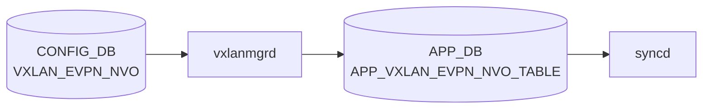

# VXLAN_EVPN_NVO テーブル

## 概要

`VXLAN_EVPN_NVO` テーブルは EVPN ベースの Network Virtualization Overlay (NVO) インスタンスを CONFIG_DB に定義する[^1]。EVPN コントロールプレーン (FRR + bgpd の `l2vpn evpn`) を有効化する際に、source VTEP として参照する VXLAN_TUNNEL を結びつける。1 エントリのみ許可される (`max-elements 1`)。

<!-- cdb-mermaid -->
### データフロー (自動生成)



!!! note "凡例"
    CONFIG_DB から SAI までの典型経路を `docs/reference/config-db-orch-map.md` から機械生成したミニ図。詳細・例外は本ページ本文と対応表を参照。
<!-- /cdb-mermaid -->

## key 構造

```
VXLAN_EVPN_NVO|<name>
```

| キー | 型 | 説明 |
|------|----|------|
| `name` | string | EVPN NVO インスタンス名 |

`max-elements: 1` — システム全体で 1 エントリのみ

## フィールド

| フィールド | 型 | 必須 | 説明 |
|-----------|----|------|------|
| `source_vtep` | leafref → `VXLAN_TUNNEL.name` | yes | ソース VTEP として参照する VXLAN_TUNNEL |

## 制約

- `source_vtep` は `VXLAN_TUNNEL` への leafref（先にトンネル作成が必要）
- インスタンスはシステム全体で 1 件のみ

## 購読者

- `vxlanorch` (sonic-swss)
- `bgpcfgd` / `bgpd` — EVPN address-family の起動条件

## 関連 CONFIG_DB / YANG / CLI

- 関連 CONFIG_DB: `VXLAN_TUNNEL`、`VXLAN_TUNNEL_MAP`、`VNET`、`BGP_GLOBALS_AF` (l2vpn evpn)
- 関連 YANG: `sonic-vxlan`
- 関連 CLI: `config vxlan evpn_nvo`

<!-- ref-triangle:start -->

## 関連リファレンス

- YANG: [`sonic-vxlan`](../yang/sonic-vxlan.md)
- CLI: [`config vxlan`](../cli/config-vxlan.md)

<!-- ref-triangle:end -->

## 引用元

[^1]: YANG 定義: `sonic-vxlan.yang`. <https://github.com/sonic-net/sonic-buildimage/blob/9ea932ec2e18f35e58268ec2e4456b1d4afd65cd/src/sonic-yang-models/yang-models/sonic-vxlan.yang>

## 関連ページ
- [CONFIG_DB: VXLAN_TUNNEL](vxlan-tunnel.md)
- [CONFIG_DB: VXLAN_TUNNEL_MAP](vxlan-tunnel-map.md)

<!-- ops-hint -->
## 運用ヒント

### 典型値

- key 形式: `VXLAN_EVPN_NVO|<nvo-name>` (例 `nvo1`)。
- `source_vtep`: `VXLAN_TUNNEL` 名を指す。

### よくある誤設定

- `source_vtep` が複数 NVO で重複指定されると最初の 1 つしか有効にならない。

### 確認コマンド

```bash
sonic-db-cli CONFIG_DB hgetall 'VXLAN_EVPN_NVO|nvo1'
show vxlan tunnel
```
<!-- /ops-hint -->
