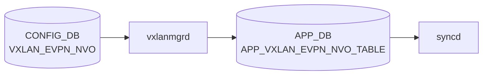

# VXLAN_EVPN_NVO テーブル

## 概要

`VXLAN_EVPN_NVO` テーブルは [EVPN](../../reference/glossary.md#term-evpn) ベースの Network Virtualization Overlay (NVO) インスタンスを [CONFIG_DB](../../reference/glossary.md#term-config_db) に定義する[^1]。[EVPN](../../reference/glossary.md#term-evpn) コントロールプレーン ([FRR](../../reference/glossary.md#term-frr) + bgpd の `l2vpn evpn`) を有効化する際に、source VTEP として参照する VXLAN_TUNNEL を結びつける。1 エントリのみ許可される (`max-elements 1`)。

<!-- cdb-mermaid -->
### データフロー (自動生成)



!!! note "凡例"
    CONFIG_DB から SAI までの典型経路を `docs/reference/config-db-orch-map.md` から機械生成したミニ図。詳細・例外は本ページ本文と対応表を参照。
<!-- /cdb-mermaid -->

## key 構造

```text
VXLAN_EVPN_NVO|<name>
```

| キー | 型 | 説明 |
|------|----|------|
| `name` | string | [EVPN](../../reference/glossary.md#term-evpn) NVO インスタンス名 |

`max-elements: 1` — システム全体で 1 エントリのみ

## フィールド

| フィールド | 型 | 必須 | 説明 |
|-----------|----|------|------|
| `source_vtep` | leafref → `VXLAN_TUNNEL.name` | yes | ソース VTEP として参照する VXLAN_TUNNEL |

<!-- defaults -->
## フィールドのコード由来デフォルト

| フィールド | デフォルト | 根拠 |
|-----------|-----------|------|
| `source_vtep` | なし（必須） | YANG `mandatory true`。CLI が `fvs = {'source_vtep': vxlan_name}` を書き込む (`config/vxlan.py:127`)。コード側にハードコードデフォルトなし |
| `name` (key) | なし（必須） | オペレータ指定。minigraph / db_migrator による自動生成なし |

> コード調査: `sonic-utilities/config/vxlan.py:102-131`、`sonic-swss/cfgmgr/vxlanmgr.cpp:672-705`、`sonic-vxlan.yang`

<!-- /defaults -->

## 制約

- `source_vtep` は `VXLAN_TUNNEL` への leafref（先にトンネル作成が必要）
- インスタンスはシステム全体で 1 件のみ

## 購読者

- `vxlanorch` ([sonic-swss](../../reference/glossary.md#term-sonic-swss))
- `bgpcfgd` / `bgpd` — EVPN address-family の起動条件

## 関連 CONFIG_DB / YANG / CLI

- 関連 [CONFIG_DB](../../reference/glossary.md#term-config_db): `VXLAN_TUNNEL`、`VXLAN_TUNNEL_MAP`、`VNET`、`BGP_GLOBALS_AF` (l2vpn evpn)
- 関連 [YANG](../../reference/glossary.md#term-yang): `sonic-vxlan`
- 関連 CLI: `config vxlan evpn_nvo`

<!-- value-behavior -->
## 値依存挙動マトリクス

本テーブルは enum フィールドを持たない。フィールドは `source_vtep`（leafref）と `name`（string）のみ。

| フィールド | 値 | 実挙動 |
|-----------|-----|--------|
| `source_vtep` | 有効な `VXLAN_TUNNEL` 名 | NVO 作成成功。`disableLearningForAllVxlanNetdevices()` でシステム全体の VXLAN MAC learning が無効化される (vxlanmgr.cpp) |
| `source_vtep` | 存在しない / 未 active な `VXLAN_TUNNEL` 名 | `"NVO %s creation failed. VTEP not present"` でリトライ待ち |
| エントリ数 | 1 件目 | 正常作成 |
| エントリ数 | 2 件目以降 | YANG `max-elements 1` で reject。vxlanmgrd も `"Only Single NVO object allowed"` でキャッシュ側防護 |

<!-- /value-behavior -->

## 例外条件・特殊挙動 <!-- cdb-exceptions -->

<!-- evidence: sonic-swss/cfgmgr/vxlanmgr.cpp; sonic-buildimage/src/sonic-yang-models/yang-models/sonic-vxlan.yang -->

- **最大 1 エントリ (YANG)**: `max-elements 1` — 2 エントリ目は YANG バリデーションで reject される[^exc2]。
- **`vxlanmgrd` 重複チェック**: キャッシュに既存 NVO エントリがある場合 `SWSS_LOG_ERROR("Only Single NVO object allowed")` を記録して破棄（YANG 検証バイパス時の二重防護）[^exc1]。
- **VTEP 未 active**: `source_vtep` が参照する `VXLAN_TUNNEL` が active でない場合 `SWSS_LOG_ERROR("NVO %s creation failed. VTEP not present")` を記録してリトライ待ち[^exc1]。
- **NVO 削除時エントリ不在**: `SWSS_LOG_ERROR("NVO deletion NVO: %s not found exception: %s")` を記録[^exc1]。
- **MAC learning 無効化**: NVO 作成成功時にすべての [VXLAN](../../reference/glossary.md#term-vxlan) netdev の MAC learning が `disableLearningForAllVxlanNetdevices()` で無効化される（EVPN 前提の動作）[^exc1]。

[^exc1]: `sonic-swss/cfgmgr/vxlanmgr.cpp` <https://github.com/sonic-net/sonic-swss/blob/master/cfgmgr/vxlanmgr.cpp>
[^exc2]: `sonic-buildimage/src/sonic-yang-models/yang-models/sonic-vxlan.yang` <https://github.com/sonic-net/sonic-buildimage/blob/master/src/sonic-yang-models/yang-models/sonic-vxlan.yang>

<!-- ref-triangle:start -->

## 関連リファレンス

- [YANG](../../reference/glossary.md#term-yang): [`sonic-vxlan`](../yang/sonic-vxlan.md)
- CLI: [`config vxlan`](../cli/config-vxlan.md)

<!-- ref-triangle:end -->

## 引用元

[^1]: [YANG](../../reference/glossary.md#term-yang) 定義: `sonic-vxlan.yang`. <https://github.com/sonic-net/sonic-buildimage/blob/9ea932ec2e18f35e58268ec2e4456b1d4afd65cd/src/sonic-yang-models/yang-models/sonic-vxlan.yang>

## 関連ページ
- [CONFIG_DB: VXLAN_TUNNEL](vxlan-tunnel.md)
- [CONFIG_DB: VXLAN_TUNNEL_MAP](vxlan-tunnel-map.md)

<!-- ops-hint -->
## 運用ヒント

### 典型値

- key 形式: `VXLAN_EVPN_NVO|<nvo-name>` (例 `nvo1`)。
- `source_vtep`: `VXLAN_TUNNEL` 名を指す。

### よくある誤設定

- `source_vtep` が複数 NVO で重複指定されると最初の 1 つしか有効にならない。

### 確認コマンド

```bash
sonic-db-cli CONFIG_DB hgetall 'VXLAN_EVPN_NVO|nvo1'
show vxlan tunnel
```
<!-- /ops-hint -->


<!-- runtime-trace -->
## CDB → 実コンテナ動作トレース

### 段階 1: Consumer 登録

- **orchagent / VxlanOrch** (`sonic-swss/orchagent/vxlanorch.cpp`): `VXLAN_EVPN_NVO` テーブルを `SubscriberStateTable` で購読。

### 段階 2: CFG → APPL 翻訳

- VxlanOrch が EVPN NVO 設定 (source vtep 名) を解析し FRR 経由で EVPN ルートを受信する準備をする。
- APP_DB への書き込みなし (orchagent → SAI 直接)。

### 段階 3: APPL → SAI

- VxlanOrch が SAI トンネルオブジェクト (VXLAN_TUNNEL 参照) に EVPN を関連付け、`sai_tunnel_api` で VTEP を設定。

### 段階 4: タイミング + 副作用

- VXLAN_TUNNEL テーブルが先に処理されている必要あり。BGP EVPN ルート受信後に MAC/IP ルートが SAI に展開される。
- 副作用: EVPN NVO 削除時は全 VNI・MAC エントリが一斉削除されトラフィックが断。

<!-- /runtime-trace -->
<!-- entry-points -->
## 書き込み入り口 (Direction A)

VXLAN_EVPN_NVO テーブルへの書き込みが発生するコード経路を網羅的に調査した結果。

### CLI

  - `config vxlan evpn_nvo add/del ...` — `config/vxlan.py` が `set_entry('VXLAN_EVPN_NVO', nvo_name, fvs)` を呼ぶ (sonic-utilities/config/vxlan.py:129, 154)

### minigraph / sonic-cfggen

minigraph.py に VXLAN_EVPN_NVO 生成なし

### REST / gNMI

REST/gNMI 書き込み経路なし

### db_migrator

db_migrator.py での VXLAN_EVPN_NVO マイグレーションなし

### ビルド時デフォルト (build-time default)

なし

### ハードコードデフォルト / ランタイム注入

なし

### 死活・デッドコード

なし
<!-- /entry-points -->

<!-- failure -->
## 失敗挙動 (Phase D)

ソース: `sonic-net/sonic-swss/orchagent/vxlanorch.cpp`

### SET 処理における失敗経路

| 失敗条件 | 結果 | ログ | evidence |
|---|---|---|---|
| `source_vtep` が参照する VXLAN_TUNNEL が未登録（`getVxlanTunnel()` → nullptr） | `source_vtep_ptr = nullptr` のまま `true` 返却。後続 EVPN 処理が `getEVPNVtep()` null チェックで silent-drop | ログなし（INFO のみ） | `vxlanorch.cpp:2779-2791` |
| EVPN VTEP が未 active 状態で Remote VNI 追加到着 | `return false` — タスクキューでリトライ | SWSS_LOG_WARN `"VTEP not yet active.user=%d remote_vtep=%s"` | `vxlanorch.cpp:1696` |
| `getEVPNVtep()` が nullptr（NVO 未登録）で Remote VNI 追加 | `return false` — タスクキューでリトライ | SWSS_LOG_WARN `"Unable to find EVPN VTEP. user=%d remote_vtep=%s"` | `vxlanorch.cpp:1689` |
| VXLAN_TUNNEL 名が既存エントリと重複した状態で SET | `return true`（再試行なし）— 上書き不可 | SWSS_LOG_ERROR `"Vxlan tunnel '%s' is already exists"` | `vxlanorch.cpp:1638` |
| `sai_tunnel_api->create_tunnel()` 失敗 | `throw std::runtime_error` → catch で SWSS_LOG_ERROR | `"Can't create a tunnel object"` / `"Error creating tunnel %s: %s"` | `vxlanorch.cpp:403-411, 846-848` |
| `sai_tunnel_api->create_tunnel_map()` 失敗 | `throw std::runtime_error` — トンネルマップ未作成 | SWSS_LOG_ERROR `"Can't create tunnel map object"` | `vxlanorch.cpp:147-155` |
| `sai_next_hop_api->create_next_hop()` 失敗 | `handleSaiCreateStatus()` → task_success 以外の場合 `return SAI_NULL_OBJECT_ID` | SWSS_LOG_ERROR `"NH vxlan tunnel create failed for %s, ip %s, mac %s, vni %d"` | `vxlanorch.cpp:1430-1436` |

### DEL 処理における失敗経路

| 失敗条件 | 結果 | ログ | evidence |
|---|---|---|---|
| NVO DEL 到着時に `source_vtep_ptr` が NULL | `return true`（スキップ・再試行なし） | SWSS_LOG_WARN `"NVO Delete failed as VTEP Ptr is NULL"` | `vxlanorch.cpp:2799` |
| VTEP の HW 削除未完了 (`del_tnl_hw_pending == true`) で NVO DEL | `return false` — タスクキューでリトライ | SWSS_LOG_WARN `"NVO not deleted as hw delete is pending"` | `vxlanorch.cpp:2803-2806` |
| VXLAN_TUNNEL DEL 到着時にエントリ未存在 | `return true`（スキップ・再試行なし） | SWSS_LOG_ERROR `"Vxlan tunnel '%s' doesn't exist"` | `vxlanorch.cpp:1656` |
| VTEP に `del_tnl_hw_pending` フラグが立っている状態でトンネル DEL | `return false` — DIP 参照カウントが 0 になるまでリトライ | SWSS_LOG_WARN `"VTEP %s not deleted as hw delete is pending"` | `vxlanorch.cpp:1663` |

### retry 挙動まとめ

| シナリオ | retry 挙動 |
|---|---|
| `del_tnl_hw_pending` による NVO / VTEP DEL ブロック | `return false` → 上限なしリトライ。FDB 参照解消後に自動解除 |
| EVPN VTEP 未登録・非 active での Remote VNI 追加 | `return false` → VTEP active 化後に解消 |
| SAI API 失敗 / VXLAN_TUNNEL 名重複 | `return true` — **再試行なし**。同一フィールドの再書き込みで再トリガー必要 |

> `EvpnNvoOrch::addOperation()` は `source_vtep_ptr` 解決失敗でも `true` を返す。後続の Remote VNI 処理が `getEVPNVtep()` null チェックで `return false` し続けることが実質的なリトライ機構となる。

詳細解析: `meta/_intermediate/cdb-flow/vxlan-evpn-nvo-failure.md`

<!-- evidence: sonic-swss/orchagent/vxlanorch.cpp:147-155,403-411,846-848,1430-1436,1638,1656,1663,1689,1696,2779-2811 -->
<!-- /failure -->

<!-- glossary-links-injected: 7e2e79cf3524 -->
