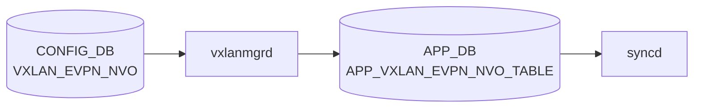

# VXLAN_EVPN_NVO テーブル

## 概要

`VXLAN_EVPN_NVO` テーブルは [EVPN](../../reference/glossary.md#term-evpn) ベースの Network Virtualization Overlay (NVO) インスタンスを [CONFIG_DB](../../reference/glossary.md#term-config_db) に定義する[^1]。[EVPN](../../reference/glossary.md#term-evpn) コントロールプレーン ([FRR](../../reference/glossary.md#term-frr) + bgpd の `l2vpn evpn`) を有効化する際に、source VTEP として参照する VXLAN_TUNNEL を結びつける。1 エントリのみ許可される (`max-elements 1`)。

<!-- cdb-mermaid -->
### データフロー (自動生成)



!!! note "凡例"
    CONFIG_DB から SAI までの典型経路を `docs/reference/config-db-orch-map.md` から機械生成したミニ図。詳細・例外は本ページ本文と対応表を参照。
<!-- /cdb-mermaid -->

## key 構造

```text
VXLAN_EVPN_NVO|<name>
```

| キー | 型 | 説明 |
|------|----|------|
| `name` | string | [EVPN](../../reference/glossary.md#term-evpn) NVO インスタンス名 |

`max-elements: 1` — システム全体で 1 エントリのみ

## フィールド

| フィールド | 型 | 必須 | 説明 |
|-----------|----|------|------|
| `source_vtep` | leafref → `VXLAN_TUNNEL.name` | yes | ソース VTEP として参照する VXLAN_TUNNEL |

<!-- defaults -->
## フィールドのコード由来デフォルト

| フィールド | デフォルト | 根拠 |
|-----------|-----------|------|
| `source_vtep` | なし（必須） | YANG `mandatory true`。CLI が `fvs = {'source_vtep': vxlan_name}` を書き込む (`config/vxlan.py:127`)。コード側にハードコードデフォルトなし |
| `name` (key) | なし（必須） | オペレータ指定。minigraph / db_migrator による自動生成なし |

> コード調査: `sonic-utilities/config/vxlan.py:102-131`、`sonic-swss/cfgmgr/vxlanmgr.cpp:672-705`、`sonic-vxlan.yang`

<!-- /defaults -->

<!-- ordering -->
## 書込み順序依存 (Phase B)

<!-- evidence: meta/_intermediate/cdb-flow/vxlan-evpn-nvo-ordering.md; sonic-swss/orchagent/vxlanorch.cpp -->

### 作成順序

| 順序 | テーブル | 理由 |
|------|---------|------|
| 1 | `VXLAN_TUNNEL\|<name>` | `EvpnNvoOrch::addOperation()` が `source_vtep` を `getVxlanTunnel()` でルックアップする。TUNNEL 未登録なら null ポインタになり後続 EVPN 処理が `return false` でリトライ待ち (vxlanorch.cpp:2784) |
| 2 | `VXLAN_TUNNEL_MAP\|<name>\|<map>` | 初回 MAP エントリで `createTunnelHw()` がトリガーされ VTEP が `isActive() = true` になる (vxlanorch.cpp:2063)。VTEP active 前は EVPN remote VTEP 追加が `return false` でリトライ待ち (vxlanorch.cpp:1694) |
| 3 | `VXLAN_EVPN_NVO\|<nvo-name>` | source_vtep 参照先 TUNNEL が存在し、かつ VTEP active 後に設定するのが推奨 |

### 削除順序（逆順）

```
EVPN remote VTEP 削除 → VXLAN_EVPN_NVO 削除 → VXLAN_TUNNEL_MAP 全削除 → VXLAN_TUNNEL 削除
```

`EvpnNvoOrch::delOperation()` は `del_tnl_hw_pending == true` のとき `return false` でリトライ待ちになる (vxlanorch.cpp:2803)。TUNNEL_MAP を先に全削除し DIP トンネルカウントを 0 にしてから NVO・TUNNEL を削除すること。

<!-- /ordering -->

## 制約

- `source_vtep` は `VXLAN_TUNNEL` への leafref（先にトンネル作成が必要）
- インスタンスはシステム全体で 1 件のみ

## 購読者

- `vxlanorch` ([sonic-swss](../../reference/glossary.md#term-sonic-swss))
- `bgpcfgd` / `bgpd` — EVPN address-family の起動条件

## 関連 CONFIG_DB / YANG / CLI

- 関連 [CONFIG_DB](../../reference/glossary.md#term-config_db): `VXLAN_TUNNEL`、`VXLAN_TUNNEL_MAP`、`VNET`、`BGP_GLOBALS_AF` (l2vpn evpn)
- 関連 [YANG](../../reference/glossary.md#term-yang): `sonic-vxlan`
- 関連 CLI: `config vxlan evpn_nvo`

<!-- value-behavior -->
## 値依存挙動マトリクス

本テーブルは enum フィールドを持たない。フィールドは `source_vtep`（leafref）と `name`（string）のみ。

| フィールド | 値 | 実挙動 |
|-----------|-----|--------|
| `source_vtep` | 有効な `VXLAN_TUNNEL` 名 | NVO 作成成功。`disableLearningForAllVxlanNetdevices()` でシステム全体の VXLAN MAC learning が無効化される (vxlanmgr.cpp) |
| `source_vtep` | 存在しない / 未 active な `VXLAN_TUNNEL` 名 | `"NVO %s creation failed. VTEP not present"` でリトライ待ち |
| エントリ数 | 1 件目 | 正常作成 |
| エントリ数 | 2 件目以降 | YANG `max-elements 1` で reject。vxlanmgrd も `"Only Single NVO object allowed"` でキャッシュ側防護 |

<!-- /value-behavior -->

## 例外条件・特殊挙動 <!-- cdb-exceptions -->

<!-- evidence: sonic-swss/cfgmgr/vxlanmgr.cpp; sonic-buildimage/src/sonic-yang-models/yang-models/sonic-vxlan.yang -->

- **最大 1 エントリ (YANG)**: `max-elements 1` — 2 エントリ目は YANG バリデーションで reject される[^exc2]。
- **`vxlanmgrd` 重複チェック**: キャッシュに既存 NVO エントリがある場合 `SWSS_LOG_ERROR("Only Single NVO object allowed")` を記録して破棄（YANG 検証バイパス時の二重防護）[^exc1]。
- **VTEP 未 active**: `source_vtep` が参照する `VXLAN_TUNNEL` が active でない場合 `SWSS_LOG_ERROR("NVO %s creation failed. VTEP not present")` を記録してリトライ待ち[^exc1]。
- **NVO 削除時エントリ不在**: `SWSS_LOG_ERROR("NVO deletion NVO: %s not found exception: %s")` を記録[^exc1]。
- **MAC learning 無効化**: NVO 作成成功時にすべての [VXLAN](../../reference/glossary.md#term-vxlan) netdev の MAC learning が `disableLearningForAllVxlanNetdevices()` で無効化される（EVPN 前提の動作）[^exc1]。

[^exc1]: `sonic-swss/cfgmgr/vxlanmgr.cpp` <https://github.com/sonic-net/sonic-swss/blob/master/cfgmgr/vxlanmgr.cpp>
[^exc2]: `sonic-buildimage/src/sonic-yang-models/yang-models/sonic-vxlan.yang` <https://github.com/sonic-net/sonic-buildimage/blob/master/src/sonic-yang-models/yang-models/sonic-vxlan.yang>

<!-- platform -->
## プラットフォーム差異 (EVPN 対応 ASIC)

<!-- evidence: sonic-swss/orchagent/vxlanorch.cpp:1256-1274, 1701-1724, 1807-1822, 903, 356-370 -->

`VXLAN_EVPN_NVO` が参照する source VTEP（`VXLAN_TUNNEL`）の実際の ASIC 動作は、`VxlanTunnelOrch` 初期化時に `sai_query_attribute_enum_values_capability` で `SAI_TUNNEL_ATTR_PEER_MODE` を問い合わせた結果で決まる。

| 差異ポイント | P2P モード (DIP サポートあり) | P2MP モード (DIP サポートなし) |
|---|---|---|
| SAI ケーパビリティクエリ失敗時 | `is_dip_tunnel_supported = true` へ自動 fallback | — |
| リモート VTEP ごとのトンネル | 動的 DIP トンネルを個別生成 | 生成しない (IP 参照カウントのみ) |
| SIP トンネル削除タイミング | DIP カウントが 0 になるまで延期 | 参照カウント 0 で即時可能 |
| ブリッジポート | VTEP ごとに個別作成 | SIP 単一ブリッジポートを共有 |
| FDB/flooding | DIP トンネルポート経由 | P2MP + L2MC グループ (IMET ルート) 経由 |
| EVPN DIP トンネル SAI mode | `SAI_TUNNEL_PEER_MODE_P2P` | 使用しない |
| CLI 静的トンネル SAI mode | `SAI_TUNNEL_PEER_MODE_P2MP` | 同左 |

### P2P モード詳細 (DIP トンネルサポートあり)

EVPN ルート受信時に `addTunnelUser()` (vxlanorch.cpp:1701) が `createDynamicDIPTunnel(remote_vtep, usr)` を呼び出し、SAI `create_tunnel()` を `SAI_TUNNEL_PEER_MODE_P2P` + `SAI_TUNNEL_ATTR_ENCAP_DST_IP` で実行する。EVPN 動的 DIP トンネル生成時 (`TNL_CREATION_SRC_EVPN`) は `p2p = true` が明示される (vxlanorch.cpp:903)。

### P2MP モード詳細 (DIP トンネルサポートなし)

`addTunnelUser()` は DIP トンネルを生成せず、リモート VTEP の IP 参照カウントを更新するのみ。FDB フラッディングは P2MP SIP トンネルブリッジポートと IMET ルートの L2MC グループメンバーで実現する (vxlanorch.cpp コメント: `"P2MP scenario where P2MP tunnel port is used for FDB learning"`)。

### SmartSwitch / DPU

`vxlanorch.cpp` に SmartSwitch DPU 固有の分岐コードは存在しない。EVPN NVO テーブルは NPU 通常モード向けのみであり、DPU 側のオーバーレイスタックとの連携は orchagent 実装外となる。

<!-- /platform -->

<!-- ref-triangle:start -->

## 関連リファレンス

- [YANG](../../reference/glossary.md#term-yang): [`sonic-vxlan`](../yang/sonic-vxlan.md)
- CLI: [`config vxlan`](../cli/config-vxlan.md)

<!-- ref-triangle:end -->

## 引用元

[^1]: [YANG](../../reference/glossary.md#term-yang) 定義: `sonic-vxlan.yang`. <https://github.com/sonic-net/sonic-buildimage/blob/9ea932ec2e18f35e58268ec2e4456b1d4afd65cd/src/sonic-yang-models/yang-models/sonic-vxlan.yang>

## 関連ページ
- [CONFIG_DB: VXLAN_TUNNEL](vxlan-tunnel.md)
- [CONFIG_DB: VXLAN_TUNNEL_MAP](vxlan-tunnel-map.md)

<!-- ops-hint -->
## 運用ヒント

### 典型値

- key 形式: `VXLAN_EVPN_NVO|<nvo-name>` (例 `nvo1`)。
- `source_vtep`: `VXLAN_TUNNEL` 名を指す。

### よくある誤設定

- `source_vtep` が複数 NVO で重複指定されると最初の 1 つしか有効にならない。

### 確認コマンド

```bash
sonic-db-cli CONFIG_DB hgetall 'VXLAN_EVPN_NVO|nvo1'
show vxlan tunnel
```
<!-- /ops-hint -->


<!-- runtime-trace -->
## CDB → 実コンテナ動作トレース

### 段階 1: Consumer 登録

- **orchagent / VxlanOrch** (`sonic-swss/orchagent/vxlanorch.cpp`): `VXLAN_EVPN_NVO` テーブルを `SubscriberStateTable` で購読。

### 段階 2: CFG → APPL 翻訳

- VxlanOrch が EVPN NVO 設定 (source vtep 名) を解析し FRR 経由で EVPN ルートを受信する準備をする。
- APP_DB への書き込みなし (orchagent → SAI 直接)。

### 段階 3: APPL → SAI

- VxlanOrch が SAI トンネルオブジェクト (VXLAN_TUNNEL 参照) に EVPN を関連付け、`sai_tunnel_api` で VTEP を設定。

### 段階 4: タイミング + 副作用

- VXLAN_TUNNEL テーブルが先に処理されている必要あり。BGP EVPN ルート受信後に MAC/IP ルートが SAI に展開される。
- 副作用: EVPN NVO 削除時は全 VNI・MAC エントリが一斉削除されトラフィックが断。

<!-- /runtime-trace -->

<!-- pubsub -->
## 通信メカニズム (Phase G)

### Redis 購読方式

`VXLAN_EVPN_NVO` テーブルへの変更は **2 段階** で伝播する。

1. **vxlanmgrd** (`docker-swss` 内 cfgmgr プロセス) が **CONFIG_DB** を `ConsumerStateTable` (`swss::Orch` 継承) で購読する。`vxlanmgrd.cpp:46-53` で `CFG_VXLAN_EVPN_NVO_TABLE_NAME` を含むテーブルリストを `VxlanMgr` に渡し、`swss::Select` ループ (`SELECT_TIMEOUT=1000ms`) でイベントを待機する。
2. **orchagent** (`EvpnNvoOrch`) が **APPL_DB** の `APP_VXLAN_EVPN_NVO_TABLE` を `ConsumerStateTable` (`swss::Orch2` 継承) で購読する (`orchdaemon.cpp:358`)。

| 購読者 | 購読 DB | 購読テーブル | API 種別 | ハンドラ |
|--------|--------|------------|---------|---------|
| `vxlanmgrd` (VxlanMgr) | CONFIG_DB | `VXLAN_EVPN_NVO` | `ConsumerStateTable` (Orch 継承) | `doVxlanEvpnNvoCreateTask` / `doVxlanEvpnNvoDeleteTask` |
| orchagent (EvpnNvoOrch) | APPL_DB | `APP_VXLAN_EVPN_NVO_TABLE` | `ConsumerStateTable` (Orch2 継承) | `EvpnNvoOrch::addOperation` / `delOperation` |

### keyspace 通知 → ハンドラ呼び出しの流れ

```
CONFIG_DB HSET "VXLAN_EVPN_NVO|nvo1" source_vtep vtep1
  ↓ Redis keyspace → vxlanmgrd ConsumerStateTable バッファ
swss::Select::select(1000ms) 検出
  ↓ VxlanMgr::doTask() → doVxlanEvpnNvoCreateTask()
  ↓ isTunnelActive(vtep) チェック（失敗時 return false → リトライ待ち）
  ↓ disableLearningForAllVxlanNetdevices()
  ↓ m_appEvpnNvoTable.set() → APPL_DB "APP_VXLAN_EVPN_NVO_TABLE|nvo1" 書込
APPL_DB 書込 → orchagent EvpnNvoOrch ConsumerStateTable 検出
  ↓ EvpnNvoOrch::addOperation()
  ↓ VxlanTunnelOrch からVTEP ポインタ取得・キャッシュ（SAI 直接呼び出しなし）
```

- `op == SET_COMMAND` → `addOperation()`、`op == DEL_COMMAND` → `delOperation()` に分岐。
- `EvpnNvoOrch` 自体は SAI `tunnel_map_api` を直接呼ばない。VTEP SAI オブジェクトは `VxlanTunnelOrch` が先行して `sai_tunnel_api->create_tunnel_map()` で作成済み。

### SAI tunnel_map_api との関係

`vxlanorch.cpp:28` で `extern sai_tunnel_api_t *sai_tunnel_api` を宣言。EVPN NVO フロー自体では tunnel_map_api を直接使用しないが、VXLAN_TUNNEL_MAP テーブル処理 (`VxlanTunnelMapOrch`) が同じ `sai_tunnel_api` を利用して MAP_T → SAI_TUNNEL_MAP_TYPE_* のマッピングオブジェクトを作成する。EVPN NVO は作成済み VTEP ポインタを参照するだけで SAI 呼び出しは行わない。

> **Evidence**: `sonic-swss/cfgmgr/vxlanmgrd.cpp:26-123`、`sonic-swss/cfgmgr/vxlanmgr.cpp:213-285,672-735`、`sonic-swss/orchagent/orchdaemon.cpp:358`、`sonic-swss/orchagent/vxlanorch.h:541-557`、`sonic-swss/orchagent/vxlanorch.cpp:28,124-165,2773-2814`; 詳細分析 `meta/_intermediate/cdb-flow/vxlan-evpn-nvo-pubsub.md`
<!-- /pubsub -->

<!-- entry-points -->
## 書き込み入り口 (Direction A)

VXLAN_EVPN_NVO テーブルへの書き込みが発生するコード経路を網羅的に調査した結果。

### CLI

  - `config vxlan evpn_nvo add/del ...` — `config/vxlan.py` が `set_entry('VXLAN_EVPN_NVO', nvo_name, fvs)` を呼ぶ (sonic-utilities/config/vxlan.py:129, 154)

### minigraph / sonic-cfggen

minigraph.py に VXLAN_EVPN_NVO 生成なし

### REST / gNMI

REST/gNMI 書き込み経路なし

### db_migrator

db_migrator.py での VXLAN_EVPN_NVO マイグレーションなし

### ビルド時デフォルト (build-time default)

なし

### ハードコードデフォルト / ランタイム注入

なし

### 死活・デッドコード

なし
<!-- /entry-points -->

<!-- failure -->
## 失敗挙動 (Phase D)

ソース: `sonic-net/sonic-swss/orchagent/vxlanorch.cpp`

### SET 処理における失敗経路

| 失敗条件 | 結果 | ログ | evidence |
|---|---|---|---|
| `source_vtep` が参照する VXLAN_TUNNEL が未登録（`getVxlanTunnel()` → nullptr） | `source_vtep_ptr = nullptr` のまま `true` 返却。後続 EVPN 処理が `getEVPNVtep()` null チェックで silent-drop | ログなし（INFO のみ） | `vxlanorch.cpp:2779-2791` |
| EVPN VTEP が未 active 状態で Remote VNI 追加到着 | `return false` — タスクキューでリトライ | SWSS_LOG_WARN `"VTEP not yet active.user=%d remote_vtep=%s"` | `vxlanorch.cpp:1696` |
| `getEVPNVtep()` が nullptr（NVO 未登録）で Remote VNI 追加 | `return false` — タスクキューでリトライ | SWSS_LOG_WARN `"Unable to find EVPN VTEP. user=%d remote_vtep=%s"` | `vxlanorch.cpp:1689` |
| VXLAN_TUNNEL 名が既存エントリと重複した状態で SET | `return true`（再試行なし）— 上書き不可 | SWSS_LOG_ERROR `"Vxlan tunnel '%s' is already exists"` | `vxlanorch.cpp:1638` |
| `sai_tunnel_api->create_tunnel()` 失敗 | `throw std::runtime_error` → catch で SWSS_LOG_ERROR | `"Can't create a tunnel object"` / `"Error creating tunnel %s: %s"` | `vxlanorch.cpp:403-411, 846-848` |
| `sai_tunnel_api->create_tunnel_map()` 失敗 | `throw std::runtime_error` — トンネルマップ未作成 | SWSS_LOG_ERROR `"Can't create tunnel map object"` | `vxlanorch.cpp:147-155` |
| `sai_next_hop_api->create_next_hop()` 失敗 | `handleSaiCreateStatus()` → task_success 以外の場合 `return SAI_NULL_OBJECT_ID` | SWSS_LOG_ERROR `"NH vxlan tunnel create failed for %s, ip %s, mac %s, vni %d"` | `vxlanorch.cpp:1430-1436` |

### DEL 処理における失敗経路

| 失敗条件 | 結果 | ログ | evidence |
|---|---|---|---|
| NVO DEL 到着時に `source_vtep_ptr` が NULL | `return true`（スキップ・再試行なし） | SWSS_LOG_WARN `"NVO Delete failed as VTEP Ptr is NULL"` | `vxlanorch.cpp:2799` |
| VTEP の HW 削除未完了 (`del_tnl_hw_pending == true`) で NVO DEL | `return false` — タスクキューでリトライ | SWSS_LOG_WARN `"NVO not deleted as hw delete is pending"` | `vxlanorch.cpp:2803-2806` |
| VXLAN_TUNNEL DEL 到着時にエントリ未存在 | `return true`（スキップ・再試行なし） | SWSS_LOG_ERROR `"Vxlan tunnel '%s' doesn't exist"` | `vxlanorch.cpp:1656` |
| VTEP に `del_tnl_hw_pending` フラグが立っている状態でトンネル DEL | `return false` — DIP 参照カウントが 0 になるまでリトライ | SWSS_LOG_WARN `"VTEP %s not deleted as hw delete is pending"` | `vxlanorch.cpp:1663` |

### retry 挙動まとめ

| シナリオ | retry 挙動 |
|---|---|
| `del_tnl_hw_pending` による NVO / VTEP DEL ブロック | `return false` → 上限なしリトライ。FDB 参照解消後に自動解除 |
| EVPN VTEP 未登録・非 active での Remote VNI 追加 | `return false` → VTEP active 化後に解消 |
| SAI API 失敗 / VXLAN_TUNNEL 名重複 | `return true` — **再試行なし**。同一フィールドの再書き込みで再トリガー必要 |

> `EvpnNvoOrch::addOperation()` は `source_vtep_ptr` 解決失敗でも `true` を返す。後続の Remote VNI 処理が `getEVPNVtep()` null チェックで `return false` し続けることが実質的なリトライ機構となる。

詳細解析: `meta/_intermediate/cdb-flow/vxlan-evpn-nvo-failure.md`

<!-- evidence: sonic-swss/orchagent/vxlanorch.cpp:147-155,403-411,846-848,1430-1436,1638,1656,1663,1689,1696,2779-2811 -->
<!-- /failure -->

<!-- constants -->
## ハードコード定数 (Phase E)

実装コードに直接定義されている文字列定数・enum 値を一覧化する。

### source_vtep フィールドキー

| フィールド | 取得方法 | ソース |
|-----------|---------|--------|
| `source_vtep` | `request.getAttrString("source_vtep")` | `vxlanorch.cpp:2780` |

- `EvpnNvoOrch::addOperation()` が `"source_vtep"` キーで属性を読み取り、`VxlanTunnelOrch::getVxlanTunnel(vtep_name)` に渡す (`vxlanorch.cpp:2784`)

### SAI tunnel_map_type ハードコードマッピング

EVPN NVO が source_vtep 経由で間接参照する tunnel_map_type の定数マップ (`vxlanorch.cpp:38-46`):

| MAP_T enum | SAI_TUNNEL_MAP_TYPE |
|-----------|---------------------|
| `VNI_TO_VLAN_ID` | `SAI_TUNNEL_MAP_TYPE_VNI_TO_VLAN_ID` |
| `VLAN_ID_TO_VNI` | `SAI_TUNNEL_MAP_TYPE_VLAN_ID_TO_VNI` |
| `VRID_TO_VNI` | `SAI_TUNNEL_MAP_TYPE_VIRTUAL_ROUTER_ID_TO_VNI` |
| `VNI_TO_VRID` | `SAI_TUNNEL_MAP_TYPE_VNI_TO_VIRTUAL_ROUTER_ID` |
| `BRIDGE_TO_VNI` | `SAI_TUNNEL_MAP_TYPE_BRIDGE_IF_TO_VNI` |
| `VNI_TO_BRIDGE` | `SAI_TUNNEL_MAP_TYPE_VNI_TO_BRIDGE_IF` |

- EVPN NVO 確立時、このマップに基づき encap/decap mapper が SAI に設定される
- `VXLAN_EVPN_NVO` テーブル自体に数値定数はなく、SAI 定数は source_vtep (VXLAN_TUNNEL) 側で設定される

### EvpnNvoOrch ログ定数

| 状態 | ログメッセージ | ソース |
|------|-------------|--------|
| add 成功 | `"evpnnvo: %s vtep : %s"` (INFO) | `vxlanorch.cpp:2786` |
| del 時 VTEP NULL | `"NVO Delete failed as VTEP Ptr is NULL"` (WARN) | `vxlanorch.cpp:2799` |
| del 時 hw pending | `"NVO not deleted as hw delete is pending"` (WARN) | `vxlanorch.cpp:2805` |
| del 成功 | `"NVO: %s"` (INFO) | `vxlanorch.cpp:2811` |

<!-- /constants -->

<!-- side-effects -->
## 副次 DB 書込（Phase F）

`EvpnNvoOrch::addOperation()` 自体は `source_vtep_ptr` の格納のみで DB・SAI への直接書込を行わない。副次書込は後続の EVPN ルート処理で VTEP トンネルが生成される際に連鎖的に発生する。

### SAI: `create_tunnel_map`（`sai_tunnel_api`）

VTEP トンネル初回作成時（`VxlanTunnel::createMapperHw()`）に SAI tunnel_map オブジェクトを作成する。

- **SAI API**: `sai_tunnel_api->create_tunnel_map()` (vxlanorch.cpp:141)
- **作成されるマップ型**:
  - `SAI_TUNNEL_MAP_TYPE_VNI_TO_VLAN_ID` / `VLAN_ID_TO_VNI`
  - `SAI_TUNNEL_MAP_TYPE_VNI_TO_VIRTUAL_ROUTER_ID` / `VIRTUAL_ROUTER_ID_TO_VNI`
  - `SAI_TUNNEL_MAP_TYPE_VNI_TO_BRIDGE_IF` / `BRIDGE_IF_TO_VNI`
- **トリガー**: VNI ↔ VLAN/VRF/Bridge マッピング登録時（`VXLAN_TUNNEL_MAP` テーブル処理）

### SAI: `create_tunnel`（`sai_tunnel_api`）

- **SAI API**: `sai_tunnel_api->create_tunnel()` (vxlanorch.cpp:399)
- **主要属性**: `SAI_TUNNEL_ATTR_TYPE=SAI_TUNNEL_TYPE_VXLAN`、`DECAP_MAPPERS`/`ENCAP_MAPPERS`（上記 map OID 一覧）、`ENCAP_SRC_IP`（VTEP IP）、`PEER_MODE`（P2MP: VTEP、P2P: EVPN 動的トンネル）
- **トリガー**: `VxlanTunnel::createTunnelHw()` (vxlanorch.cpp:885)

### SAI: `create_tunnel_map_entry`（`sai_tunnel_api`）

- **SAI API**: `sai_tunnel_api->create_tunnel_map_entry()` (vxlanorch.cpp:211)
- VNI ↔ VLAN/VRF/Bridge ペアごとに 1 呼び出し
- **トリガー**: `addEncapMapperEntry()` / `addDecapMapperEntry()` 経由 (vxlanorch.cpp:551-560)

### STATE_DB: `VXLAN_TUNNEL_TABLE`

EVPN 動的トンネル（`TNL_CREATION_SRC_EVPN`）が作成されると STATE_DB に書き込まれる。

```cpp
// sonic-swss/orchagent/vxlanorch.cpp:1935-1944
fvVector.emplace_back("src_ip", (sip.to_string()).c_str());
fvVector.emplace_back("dst_ip", (dip.to_string()).c_str());
fvVector.emplace_back("tnl_src", "EVPN");
fvVector.emplace_back("operstatus", "down");
m_stateVxlanTable.set(tunnel_name, fvVector);
```

- **テーブル名**: `"VXLAN_TUNNEL_TABLE"` (`STATE_VXLAN_TUNNEL_TABLE_NAME`, schema.h:435)
- **キー形式**: `<tunnel_name>`（EVPN 動的トンネル名）
- **書込フィールド**: `src_ip`、`dst_ip`、`tnl_src="EVPN"`、`operstatus="down"`
- **削除**: トンネル削除時に `m_stateVxlanTable.del(tunnel_name)` (vxlanorch.cpp:1953)
- **コード**: `VxlanTunnelOrch::addRemoveStateTableEntry()` (vxlanorch.cpp:1913)

<!-- /side-effects -->

<!-- cross-refs -->
## 暗黙参照 (Phase C / vxlanorch.cpp)

<!-- evidence: sonic-swss/orchagent/vxlanorch.cpp -->

以下の参照は `VXLAN_EVPN_NVO` テーブルが間接的に依存するが、CONFIG_DB スキーマや YANG には明示されていない。

### VXLAN_TUNNEL → EvpnNvoOrch

- **参照箇所**: `vxlanorch.cpp:2782-2786`
- `EvpnNvoOrch::addOperation()` は `tunnel_orch->getVxlanTunnel(source_vtep)` で VXLAN_TUNNEL オブジェクトを取得し `source_vtep_ptr` に格納する。
- VXLAN_TUNNEL が未登録の場合 `source_vtep_ptr = NULL` となり、後続の DIP トンネル作成 (`addTunnelUser`) で NULL 参照が生じる可能性がある。
- 削除時: `EvpnNvoOrch::delOperation()` が `source_vtep_ptr->del_tnl_hw_pending` を確認し、HW 削除保留中は `return false` でリトライ待ちになる。**NVO は VXLAN_TUNNEL より先に削除する必要がある。**

### VXLAN_TUNNEL_MAP / EVPN リモート VNI → addTunnelUser

- **参照箇所**: `vxlanorch.cpp:1678,1733`
- `VxlanTunnelOrch::addTunnelUser()` / `delTunnelUser()` 内で `gDirectory.get<EvpnNvoOrch*>()` で NVO オブジェクトを参照し、EVPN 状態 (`source_vtep_ptr`) を確認する。
- NVO が設定されていない状態でリモート VNI 追加処理が走ると `source_vtep_ptr` が NULL のため DIP トンネルが不完全になる。

### VLAN (PortsOrch)

- **参照箇所**: `vxlanorch.cpp:1719-1721,1750-1761`
- EVPN NVO 有効状態で DIP トンネル作成時に `gPortsOrch->addTunnel()` / `addBridgePort()` でリモートトンネルポートを VLAN ブリッジドメインに登録する。
- 対応 VLAN が未作成の場合、ブリッジポート登録が失敗してリモート MAC/IP ルートが HW に反映されない。

### 依存解決順序

```
VLAN (PortsOrch) ──┐
VRF  (VRFOrch)  ───┼──→ VXLAN_TUNNEL ──→ VXLAN_TUNNEL_MAP ──→ VXLAN_EVPN_NVO
```

削除は逆順: `VXLAN_EVPN_NVO` → `VXLAN_TUNNEL_MAP` → `VXLAN_TUNNEL`

<!-- /cross-refs -->

<!-- glossary-links-injected: 7e2e79cf3524 -->
