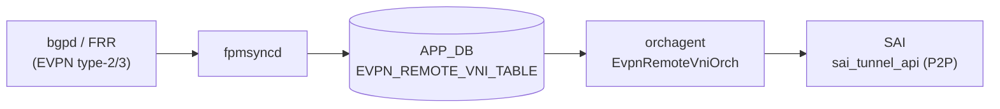

# EVPN DIP トンネル (動的生成)

## 概要

[CONFIG_DB](../../reference/glossary.md#term-config_db) に `VXLAN_EVPN_TUNNEL` テーブルは存在しない。
本ページで扱う **EVPN DIP トンネル** は、`orchagent` の `VxlanTunnel::createDynamicDIPTunnel()` が
[BGP](../../reference/glossary.md#term-bgp) [EVPN](../../reference/glossary.md#term-evpn) でリモート
[VTEP](../../reference/glossary.md#term-vtep) を学習した際に**ランタイムで動的生成**する
per-remote-VTEP P2P トンネルである[^1]。

- トンネル名: `EVPN_<remote_vtep_ip>` (prefix `EVPN_TUNNEL_NAME_PREFIX`)
- トンネルポート名: `Port_EVPN_<remote_vtep_ip>` (prefix `EVPN_TUNNEL_PORT_PREFIX`)
- 生成元: `vxlanorch.cpp:1160` — `new VxlanTunnel(tunnel_name, src_ip_, dipaddr, TNL_CREATION_SRC_EVPN)`

この動的トンネルは `VXLAN_TUNNEL` [CONFIG_DB](../../reference/glossary.md#term-config_db) テーブルの
CLI 生成エントリ (`TNL_CREATION_SRC_CLI`) とは別物であり、オペレータが直接設定する対象ではない。
[VXLAN_EVPN_NVO](vxlan-evpn-nvo.md) を通じて有効化された EVPN コントロールプレーンが自動管理する。

<!-- cdb-mermaid -->
### データフロー (自動生成)



!!! note "凡例"
    CONFIG_DB 由来ではなく APP_DB 経由の動的生成フロー。`VXLAN_TUNNEL` (CONFIG_DB) で定義した
    VTEP が先に有効化されている前提で動作する。
<!-- /cdb-mermaid -->

## トンネル識別

| 属性 | 値 | 根拠 |
|------|----|------|
| 名前プレフィックス | `EVPN_` | `vxlanorch.h:43` `EVPN_TUNNEL_NAME_PREFIX` |
| ポートプレフィックス | `Port_EVPN_` | `vxlanorch.h:42` `EVPN_TUNNEL_PORT_PREFIX` |
| 生成元種別 | `TNL_CREATION_SRC_EVPN` | `vxlanorch.h:54` |
| STATE_DB `tnl_src` | `"EVPN"` | `vxlanorch.cpp:1939` |

## 購読者

- `orchagent` `EvpnRemoteVniOrch` / `EvpnRemoteVnip2pOrch`: `EVPN_REMOTE_VNI_TABLE` (APP_DB) を
  購読し DIP トンネルを生成
- `EvpnNvoOrch`: EVPN VTEP ポインタを管理し `getEVPNVtep()` で参照提供

<!-- defaults -->
## コード由来の暗黙デフォルト (Phase A)

| 属性 / 挙動 | デフォルト / 実挙動 | 分類 | 根拠 |
|------------|-------------------|------|------|
| `decap_ttl_mode` | `VxlanTunnelTTLMode::NOT_SET` → `SAI_TUNNEL_ATTR_DECAP_TTL_MODE` を SAI に渡さない → プラットフォーム依存 | プラットフォーム依存 silent default | `vxlanorch.h:152` (デフォルト引数), `vxlanorch.cpp:1160`, `vxlanorch.cpp:372-383` |
| `peer_mode` | 常に `SAI_TUNNEL_PEER_MODE_P2P` (`TNL_CREATION_SRC_EVPN` ハードコード) | ハードコード | `vxlanorch.cpp:903`, `vxlanorch.cpp:356-363` |
| `mapper_list` | VLAN + VRF のみ (BRIDGE なし) + `TUNNEL_MAP_USE_COMMON_ENCAP_DECAP` | ハードコード | `vxlanorch.cpp:1167-1169` |
| `with_term` | `false` (SAI tunnel termination を生成しない) | ハードコード | `vxlanorch.cpp:1169` |
| `tagging_mode` | `"untagged"` (VLAN flood domain 参加時) | ハードコード | `vxlanorch.cpp:2525-2527`, `vxlanorch.cpp:2685-2687` |
| `operstatus` 初期値 | `"down"` (STATE_DB 初期登録時) | ハードコード初期値 | `vxlanorch.cpp:1942` |
| EVPN VTEP 不在時 | `addTunnelUser()` が `false` を返しサイレント失敗。キュー残留なし | dead-consumer / silent drop | `vxlanorch.cpp:1685-1692` |
| VTEP 未 active 時 | `SWSS_LOG_WARN("VTEP not yet active")` で `false` 返却。リトライは呼び出し元依存 | dead-consumer / silent drop | `vxlanorch.cpp:1694-1699` |

### `decap_ttl_mode` の詳細

EVPN DIP トンネルの `VxlanTunnel` コンストラクタ呼び出し (`vxlanorch.cpp:1160`) は
`ttl_mode` 引数を省略するため、ヘッダで定義されたデフォルト値 `VxlanTunnelTTLMode::NOT_SET`
が適用される。`createTunnelHw()` 内の `create_tunnel()` では `NOT_SET` の場合は
`SAI_TUNNEL_ATTR_DECAP_TTL_MODE` を属性リストに追加しない。結果として SAI プラットフォーム
実装のデフォルト TTL モードが適用される（通常は `PIPE` または `UNIFORM` だがプラットフォーム依存）。

### `tagging_mode` の設計上の注記

コード内に明示的なコメント `// NOTE: does 'untagged' make the most sense here?` が 2 箇所存在
(`vxlanorch.cpp:2525`, `vxlanorch.cpp:2685`)。実装者が `"untagged"` の妥当性に迷いを示しているが、
実装はハードコードされており設定変更手段はない。

<!-- /defaults -->

<!-- ordering -->
## 書込み順依存 (Phase B)

EVPN DIP トンネルは CONFIG_DB の直接エントリを持たないが、APP_DB 経由の動的生成フローにおいて
複数の「先行条件が満たされなければ処理が進まない」強制順序依存が存在する。

### 検出された順序依存

| # | 先行条件 | 後続操作 | 強制度 | 根拠 |
|---|----------|----------|--------|------|
| 1 | `VXLAN_EVPN_NVO` 処理済み (`getEVPNVtep()` 非 NULL) | DIP トンネル生成 | **強制先行** | `vxlanorch.cpp:1685-1692` |
| 2 | `VXLAN_TUNNEL` (VTEP) が active (`isActive()` = true) | DIP トンネル生成 | **強制先行** | `vxlanorch.cpp:1694-1699` |
| 3 | `VXLAN_TUNNEL_MAP` でローカル VNI-VLAN マップが存在 | `EVPN_REMOTE_VNI_TABLE` 処理 | **強制先行** | `vxlanorch.cpp:2490-2494` |
| 4 | 対象 VLAN が存在 (`getVlanByVlanId()` 成功) | `EVPN_REMOTE_VNI_TABLE` 処理 | **強制先行** | `vxlanorch.cpp:2483-2487` |
| 5 | 全 DIP トンネルの参照カウント = 0 (`del_tnl_hw_pending` = false) | `VXLAN_EVPN_NVO` 削除 | **強制先行** | `vxlanorch.cpp:2803-2807` |

### 主要な制約詳細

**EVPN VTEP 未設定 / 未 active の場合の silent drop (依存 #1, #2)**:
`VxlanTunnelOrch::addTunnelUser()` は冒頭で `evpn_orch->getEVPNVtep()` を呼ぶ。
VTEP ポインタが NULL の場合（`VXLAN_EVPN_NVO` 未設定）は `SWSS_LOG_WARN("Unable to find EVPN VTEP")` を
出力して即 `false` を返す。VTEP ポインタが非 NULL でも `isActive()` が false の場合は
`SWSS_LOG_WARN("VTEP not yet active")` を出力して `false` を返す。
どちらの場合もリクエストは **再エンキューされない**。再試行は上位呼び出し元（`EvpnRemoteVnip2pOrch::addOperation()`
が `return false` を返した場合に orchagent のイベントループが次の消費サイクルで再処理する）
に依存する（`vxlanorch.cpp:1687-1699`）。

**VXLAN_TUNNEL_MAP が先に必要 (依存 #3)**:
`EvpnRemoteVnip2pOrch::addOperation()` は
`vxlan_tun_map_orch->isVniVlanMapExists(vni_id, ...)` を呼び、ローカル VNI マップが
存在しない場合は `SWSS_LOG_WARN("Vxlan tunnel map is not created for vni:%d")` を出力し
`return false` で処理を中断する。`VXLAN_TUNNEL_MAP` で VNI-VLAN ペアを事前登録してから
BGP EVPN がリモート VTEP を学習する順序が必要
（`vxlanorch.cpp:2489-2494`、コメント `"Remote end point can be added only after local VLAN to VNI map gets created"`）。

**NVO 削除が DIP トンネル完全削除まで待機 (依存 #5)**:
`EvpnNvoOrch::delOperation()` は `source_vtep_ptr->del_tnl_hw_pending` が true の場合に
`SWSS_LOG_WARN("NVO not deleted as hw delete is pending")` を出力して `return false` を返す。
`del_tnl_hw_pending` は DIP トンネルが HW 削除ペンディング状態の間 true を保持し、
`deletePendingSIPTunnel()` が全 DIP トンネルの参照カウント = 0 を確認してから `false` に戻す。
`config vxlan evpn_nvo del` を実行しても、既存リモート VTEP への DIP トンネルが残存していると
CONFIG_DB 削除が SAI に反映されない（`vxlanorch.cpp:2803-2807`, `vxlanorch.cpp:952-964`）。

<!-- /ordering -->

<!-- cross-refs -->
## 暗黙参照 (Phase C)

EVPN DIP トンネルは CONFIG_DB に直接テーブルを持たないため YANG `leafref` 制約は存在しない。
しかし DIP トンネルを生成・VLAN flood domain に参加させるまでの処理チェーンに複数の暗黙参照が存在する。

### YANG leafref (sonic-vxlan.yang)

`VXLAN_EVPN_TUNNEL` テーブル自体は YANG モデル化されていない。関連テーブルの leafref は以下の 2 点のみ:

| テーブル | フィールド | leafref 先 | 根拠 |
|---------|-----------|-----------|------|
| `VXLAN_EVPN_NVO` | `source_vtep` | `VXLAN_TUNNEL_LIST/name` | `sonic-vxlan.yang:123-124` |
| `VXLAN_TUNNEL_MAP` | `name` | `VXLAN_TUNNEL_LIST/name` | `sonic-vxlan.yang:75-76` |

VLAN への leafref (`VXLAN_TUNNEL_MAP.name → VLAN.name`) はコメントアウトされており未実施 (`sonic-vxlan.yang:89-90`)。

### 暗黙参照テーブル一覧

| # | 参照先 | 方向 | 強制度 | 意味 | 根拠 |
|---|--------|------|--------|------|------|
| 1 | `CONFIG_DB VXLAN_EVPN_NVO` | 読み取り (EvpnNvoOrch::getEVPNVtep()) | **必須** (NULL → silent drop) | EVPN VTEP ポインタが NULL の場合 `addTunnelUser()` は即 `false` を返しトンネル生成をスキップ | `vxlanorch.cpp:1685-1692` |
| 2 | `CONFIG_DB VXLAN_TUNNEL` | 読み取り (VxlanTunnel::isActive()) | **必須** (false → silent drop) | VTEP ポインタが非 NULL でも `isActive()` が false の場合 `addTunnelUser()` は `false` を返す | `vxlanorch.cpp:1694-1699` |
| 3 | `CONFIG_DB VXLAN_TUNNEL_MAP` | 読み取り (isVniVlanMapExists()) | **必須** (未存在 → return false) | `EvpnRemoteVnip2pOrch::addOperation()` で VNI-VLAN マップ未存在なら処理中断。コード注記: `"Remote end point can be added only after local VLAN to VNI map gets created"` | `vxlanorch.cpp:2490-2494` |
| 4 | `CONFIG_DB VLAN` (PortsOrch) | 読み取り (getVlanByVlanId()) | **必須** (未存在 → return false) | VLAN が PortsOrch に未登録の場合 `addOperation()` は処理を中断。DIP トンネルポートを VLAN flood domain へ参加させる前提 | `vxlanorch.cpp:2483-2487` |
| 5 | `APP_DB EVPN_REMOTE_VNI_TABLE` | 読み取り (EvpnRemoteVnip2pOrch subscribe) | 起動トリガ | BGP EVPN が学習したリモート VTEP を fpmsyncd が書き込み、`EvpnRemoteVnip2pOrch` が購読して DIP トンネル生成を開始 | `vxlanorch.cpp:2447-2520` |
| 6 | `STATE_DB VXLAN_TUNNEL_TABLE` | 書き込み (m_stateVxlanTable.set()) | 書き込み先 | DIP トンネル生成後に `src_ip`, `dst_ip`, `tnl_src="EVPN"`, `operstatus` を書き込む。削除時は del | `vxlanorch.cpp:1910`, `1928-1953` |

### 参照グラフ

```
fpmsyncd (BGP EVPN type-2/3)
  └─→ APP_DB EVPN_REMOTE_VNI_TABLE
        └─→ EvpnRemoteVnip2pOrch::addOperation()
              ├─[必須] CONFIG_DB VXLAN_EVPN_NVO  ─→ getEVPNVtep() ── NULL → skip
              ├─[必須] CONFIG_DB VXLAN_TUNNEL     ─→ isActive()    ── false → skip
              ├─[必須] CONFIG_DB VXLAN_TUNNEL_MAP ─→ isVniVlanMapExists() ── 未存在 → return false
              ├─[必須] CONFIG_DB VLAN             ─→ getVlanByVlanId()     ── 未存在 → return false
              └─→ addTunnelUser() ─→ createDynamicDIPTunnel()
                    └─→ STATE_DB VXLAN_TUNNEL_TABLE (tnl_src="EVPN", operstatus="down"→"up")
```

詳細解析: `meta/_intermediate/cdb-flow/vxlan-evpn-tunnel-cross-refs.md`

<!-- evidence: vxlanorch.cpp:1685-1699 (addTunnelUser VTEP ガード); vxlanorch.cpp:2483-2494 (VLAN + VNI-VLAN マップ確認); vxlanorch.cpp:2516 (addTunnelUser 呼び出し); vxlanorch.cpp:1910,1928-1953 (STATE_DB 書き込み); sonic-vxlan.yang:75-76,89-90,123-124 (leafref) -->
<!-- /cross-refs -->

<!-- failure -->
## 失敗挙動 (Phase D)

EVPN DIP トンネルは CONFIG_DB エントリを持たず、`APP_DB EVPN_REMOTE_VNI_TABLE` への書き込みを
`EvpnRemoteVnip2pOrch` が処理する形で動的に生成される。失敗経路は大別して
「SET 処理（生成）側」と「DEL 処理（削除）側」で return 値の扱いが異なる。

### SET 処理 (addTunnelUser → createDynamicDIPTunnel) における失敗経路

| 失敗条件 | 検出箇所 | 結果 | ログ出力 | evidence |
|---|---|---|---|---|
| `getEVPNVtep()` が nullptr（VXLAN_EVPN_NVO 未設定） | `VxlanTunnelOrch::addTunnelUser()` | `return false` — orchagent タスクキューに残留してリトライ | SWSS_LOG_WARN `"Unable to find EVPN VTEP. user=%d remote_vtep=%s"` | `vxlanorch.cpp:1689` |
| VTEP が存在するが `isActive()` が false | `VxlanTunnelOrch::addTunnelUser()` | `return false` — タスクキューに残留してリトライ | SWSS_LOG_WARN `"VTEP not yet active.user=%d remote_vtep=%s"` | `vxlanorch.cpp:1696` |
| `isDipTunnelsSupported()` が false（プラットフォーム非対応） | `VxlanTunnelOrch::addTunnelUser()` | DIP トンネル作成をスキップし `return true`。`updateRemoteEndPointIpRef()` で IP 参照カウントのみ更新（縮退動作） | （ログなし） | `vxlanorch.cpp:1701-1704` |
| VLAN が PortsOrch 未登録（`getVlanByVlanId()` 失敗） | `EvpnRemoteVniOrch::addOperation()` | `return false` — タスクキューに残留してリトライ | SWSS_LOG_WARN `"Vxlan tunnel map vlan id doesn't exist: %d"` | `vxlanorch.cpp:2483-2487` |
| VNI-VLAN マップ未存在（`isVniVlanMapExists()` 失敗） | `EvpnRemoteVniOrch::addOperation()` | `return false` — タスクキューに残留してリトライ | SWSS_LOG_WARN `"Vxlan tunnel map is not created for vni:%d"` | `vxlanorch.cpp:2491-2494` |
| L3 VNI として登録済みの VNI に対する Remote VNI add | `EvpnRemoteVniOrch::addOperation()` | `return false`（再試行なし扱い） | SWSS_LOG_WARN `"Ignoring remote VNI add for L3 VNI:%d, remote:%s"` | `vxlanorch.cpp:2499` |
| `getTunnelPort()` 失敗（addTunnelUser 後にポート未生成） | `EvpnRemoteVniOrch::addOperation()` | `return false` — タスクキューに残留してリトライ | SWSS_LOG_WARN `"Vxlan tunnelPort doesn't exist: %s"` | `vxlanorch.cpp:2520` |
| トンネルポートがすでに VLAN メンバ（重複 add） | `EvpnRemoteVniOrch::addOperation()` | `return true`（スキップ）。`increment_spurious_imr_add()` でカウンタ更新のみ | SWSS_LOG_WARN `"tunnelPort %s already member of vid %d"` | `vxlanorch.cpp:2513` |

### DEL 処理 (deleteDynamicDIPTunnel / RemoteVniDel) における失敗経路

| 失敗条件 | 検出箇所 | 結果 | ログ出力 | evidence |
|---|---|---|---|---|
| 参照カウント > 0 の DIP が残存する間の削除要求（`del_tnl_hw_pending`） | `VxlanTunnel::deleteDynamicDIPTunnel()` | `return true`（削除スキップ・HW ペンディング維持）。FDB 参照カウントが 0 になるまでポートを保持 | SWSS_LOG_NOTICE `"DIP = %s Not deleting tunnel from HW as tunnelPort is not yet deleted. fdbcount = %d"` | `vxlanorch.cpp:1213` |
| DIP トンネルオブジェクトが nullptr（`getVxlanTunnel()` 失敗） | `VxlanTunnel::deleteDynamicDIPTunnel()` | `return false`（異常扱い） | SWSS_LOG_INFO `"DIP Tunnel is NULL unexpected"` | `vxlanorch.cpp:1222` |
| `tnl_users_` マップに対象 DIP エントリが存在しない | `VxlanTunnel::deleteDynamicDIPTunnel()` | WARN ログを出力して `return true`（no-op） | SWSS_LOG_WARN `"Unable to find dynamic tunnel for deletion"` | `vxlanorch.cpp:1235` |
| Remote VNI DEL 時に `getTunnelPort()` 失敗 | `EvpnRemoteVniOrch::delOperation()` | `return true`（スキップ・再試行なし） | SWSS_LOG_WARN `"RemoteVniDel getTunnelPort Fails: %s"` | `vxlanorch.cpp:2567` |
| Remote VNI DEL 時に `getEVPNVtep()` が nullptr | `EvpnRemoteVniOrch::delOperation()` | `return true`（スキップ・再試行なし） | SWSS_LOG_WARN `"Remote VNI del: VTEP not found. remote=%s vid=%d"` | `vxlanorch.cpp:2575` |
| トンネルポートが VLAN の非メンバ状態での DEL（spurious del） | `EvpnRemoteVniOrch::delOperation()` | `return true`（スキップ）。`increment_spurious_imr_del()` でカウンタ更新のみ | SWSS_LOG_WARN `"marking it as spurious tunnelPort %s not a member of vid %d"` | `vxlanorch.cpp:2582` |
| `removeVlanMember()` 失敗 | `EvpnRemoteVniOrch::delOperation()` | `return true`（スキップ・再試行なし） | SWSS_LOG_WARN `"RemoteVniDel remove vlan member fails: %s"` | `vxlanorch.cpp:2593` |
| IP 参照カウントのデクリメント対象エントリが未存在 | `VxlanTunnel::updateRemoteEndPointIpRef()` | no-op（カウンタ不整合の可能性） | SWSS_LOG_ERROR `"Cannot decrement ref. End point not referenced %s"` | `vxlanorch.cpp:1133` |

### retry 挙動まとめ

| シナリオ | return 値 | retry 挙動 |
|---|---|---|
| EVPN VTEP 未登録 / 非 active での DIP トンネル生成要求 | `false` | orchagent タスクキューで自動リトライ（VTEP active 化で解消） |
| VLAN 未存在 / VNI-VLAN マップ未存在 での Remote VNI add | `false` | orchagent タスクキューで自動リトライ（VLAN / TUNNEL_MAP 設定後に解消） |
| tunnelPort 生成待ち (addTunnelUser 後の getPort 失敗) | `false` | タスクキューでリトライ |
| DIP トンネル参照カウント > 0 での HW 削除スキップ | `true` | **リトライなし**。FDB カウント解消後に再 DEL イベントが必要 |
| getTunnelPort / VLAN 未存在 での DEL スキップ | `true` | **リトライなし**（エントリが残存しないため実害は少ない） |
| `isDipTunnelsSupported()` = false | `true` | リトライなし — 縮退動作として設計上許容 |

詳細解析: `meta/_intermediate/cdb-flow/vxlan-evpn-tunnel-failure.md`

<!-- evidence: vxlanorch.cpp:1133 (ref decrement error); vxlanorch.cpp:1213,1222,1235 (deleteDynamicDIPTunnel); vxlanorch.cpp:1689,1696,1701-1704 (addTunnelUser guards); vxlanorch.cpp:2483-2494 (VLAN+VNI checks); vxlanorch.cpp:2499 (L3 VNI ignore); vxlanorch.cpp:2513,2520 (tunnelPort checks); vxlanorch.cpp:2567,2575,2582,2593 (delOperation) -->
<!-- /failure -->

<!-- constants -->
## ハードコード定数 (Phase E)

ソース: `sonic-swss/orchagent/vxlanorch.h`、`sonic-swss/orchagent/vxlanorch.cpp`、`sonic-swss-common/common/schema.h`

### 名前プレフィックス定数

| 定数 | 値 | 用途 | 根拠 |
|------|----|------|------|
| `EVPN_TUNNEL_NAME_PREFIX` | `"EVPN_"` | DIP トンネル名: `EVPN_<remote_vtep_ip>` | `vxlanorch.h:43` |
| `EVPN_TUNNEL_PORT_PREFIX` | `"Port_EVPN_"` | DIP トンネルポート名: `Port_EVPN_<remote_vtep_ip>` | `vxlanorch.h:42` |

### 数値境界値

| 定数 | 値 | 用途 | 根拠 |
|------|----|------|------|
| `MIN_VLAN_ID` | `1` | VLAN ID 下限 — `to_uint<sai_vlan_id_t>()` の境界チェック | `vxlanorch.h:45` |
| `MAX_VLAN_ID` | `4095` | VLAN ID 上限 (IEEE 802.1Q) | `vxlanorch.h:46` |
| `MAX_VNI_ID` | `16777215` (= 2²⁴ − 1) | VNI 上限 (24-bit)。超過時は `SWSS_LOG_WARN` + `return false` | `vxlanorch.h:48` |
| `DEFAULT_TUNNEL_ENCAP_TTL` | `255` | CLI 生成トンネルのデフォルト encap TTL。EVPN DIP トンネルは TTL 属性を SAI に渡さないため**適用外** | `vxlanorch.h:49` |

### tunnel_creation_src_t enum

| enum 値 | 意味 | 用途 |
|---------|------|------|
| `TNL_CREATION_SRC_CLI` | CLI 生成トンネル | peer_mode 判定・`tnl_src` 分岐 |
| `TNL_CREATION_SRC_EVPN` | EVPN 動的生成トンネル | EVPN DIP トンネルはこの値で固定 (`vxlanorch.cpp:1160`) |

`TNL_CREATION_SRC_EVPN` は peer_mode を `SAI_TUNNEL_PEER_MODE_P2P` に固定する分岐 (`vxlanorch.cpp:903`) と、STATE_DB `tnl_src="EVPN"` 書き込みの分岐 (`vxlanorch.cpp:1934-1939`) で参照される。

### STATE_DB / APP_DB テーブル名定数

| 定数 | 値 | 根拠 |
|------|----|------|
| `STATE_VXLAN_TUNNEL_TABLE_NAME` | `"VXLAN_TUNNEL_TABLE"` | `schema.h:435` |
| `APP_VXLAN_REMOTE_VNI_TABLE_NAME` | `"VXLAN_REMOTE_VNI_TABLE"` | `schema.h:88` |

DIP トンネルの生成・oper status 変更はすべて `STATE_VXLAN_TUNNEL_TABLE_NAME` に書き込まれ、
`EvpnRemoteVnip2pOrch` は `APP_VXLAN_REMOTE_VNI_TABLE_NAME` を購読して処理を行う。

### STATE_DB フィールドのハードコード文字列値

| フィールド | ハードコード値 | タイミング | 根拠 |
|-----------|--------------|-----------|------|
| `tnl_src` | `"EVPN"` | 初期登録時 | `vxlanorch.cpp:1939` |
| `operstatus` | `"down"` | 初期登録時 / down 遷移 | `vxlanorch.cpp:1942`, `1905` |
| `operstatus` | `"up"` | up 遷移 | `vxlanorch.cpp:1901` |
| VLAN メンバ `tagging_mode` | `"untagged"` | flood domain 追加時 (設計上の注記あり) | `vxlanorch.cpp:2525`, `2685` |

詳細解析: `meta/_intermediate/cdb-flow/vxlan-evpn-tunnel-constants.md`

<!-- evidence: vxlanorch.h:42-49 (prefix/bounds defines); vxlanorch.h:52-55 (tunnel_creation_src_t); vxlanorch.cpp:903,1160,1169 (enum 参照); vxlanorch.cpp:1901,1905,1934-1942 (STATE_DB ハードコード値); vxlanorch.cpp:2037,2461,2621 (VNI/VLAN 境界チェック); schema.h:88,435 (テーブル名定数) -->
<!-- /constants -->

<!-- side-effects -->
## 副次 DB 書込・副作用 (Phase F)

EVPN DIP トンネルは APP_DB `EVPN_REMOTE_VNI_TABLE` の処理を起点に **SAI・STATE_DB・COUNTERS_DB** の 3 系統に副次書込を行う。CONFIG_DB への直接書込はない。

### SAI: P2P トンネル生成 (`createTunnelHw`)

DIP トンネル初回生成時 (`VxlanTunnel::createDynamicDIPTunnel()`) に SAI トンネルオブジェクトを作成する。

- **SAI API**: `sai_tunnel_api->create_tunnel_map()` + `create_tunnel()` (vxlanorch.cpp:141, 399)
- **mapper_list**: `TUNNEL_MAP_T_VLAN` + `TUNNEL_MAP_T_VIRTUAL_ROUTER` のみ (`TUNNELMAP_SET_VLAN` + `TUNNELMAP_SET_VRF`。BRIDGE は含まない) (vxlanorch.cpp:1167-1169)
- **tunnel 生成モード**: `TUNNEL_MAP_USE_COMMON_ENCAP_DECAP` — 親 VTEP トンネルのマップを共用 (vxlanorch.cpp:1169)
- **peer_mode**: `SAI_TUNNEL_PEER_MODE_P2P` — `TNL_CREATION_SRC_EVPN` 固定 (vxlanorch.cpp:903)
- **with_term**: `false` — SAI tunnel termination entry を生成しない (vxlanorch.cpp:1169)
- **トリガー**: `tnl_users_` マップにリモート VTEP が未存在の場合のみ実行 (vxlanorch.cpp:1155-1170)

### SAI: VLAN メンバ追加 (`addVlanMember`)

DIP トンネルポートを VLAN flood domain に追加する。

- **呼び出し元**: `EvpnRemoteVnip2pOrch::addOperation()` (vxlanorch.cpp:2527)
- **SAI API**: `gPortsOrch->addVlanMember()` — SAI `create_vlan_member()`
- **tagging_mode**: `"untagged"` ハードコード (vxlanorch.cpp:2526)
- **削除**: `EvpnRemoteVnip2pOrch::delOperation()` が `gPortsOrch->removeVlanMember()` を呼ぶ (vxlanorch.cpp:2591)

### STATE_DB: `VXLAN_TUNNEL_TABLE` 書込

DIP トンネル生成・削除に連動して STATE_DB に書き込む。

| 操作 | STATE_DB キー | 書込フィールド | ソース |
|------|-------------|--------------|--------|
| 生成時 (add=true) | `VXLAN_TUNNEL_TABLE\|EVPN_<remote_vtep_ip>` | `src_ip`, `dst_ip`, `tnl_src="EVPN"`, `operstatus="down"` | `vxlanorch.cpp:1930-1943` |
| oper up | 同上 | `operstatus="up"` | `vxlanorch.cpp:1901` |
| oper down | 同上 | `operstatus="down"` | `vxlanorch.cpp:1905` |
| 削除時 (add=false) | 同上 | (del — エントリ削除) | `vxlanorch.cpp:1953` |

WarmBoot 時: すでにエントリが存在する場合は上書きせず SKIP する (`vxlanorch.cpp:1927-1948`)。

### COUNTERS_DB: FlexCounter 登録

DIP トンネル用 SAI OID が生成されると FlexCounter に登録され、統計収集が開始される。

- **登録**: `VxlanTunnelOrch::addTunnelToFlexCounter()` — `m_pendingAddToFlexCntr` キューへ追加 (vxlanorch.cpp:1342-1344)。実際の COUNTERS_DB 書込は FlexCounter タイマー (10 秒間隔) で実行
- **解除**: `VxlanTunnelOrch::removeTunnelFromFlexCounter()` — `COUNTERS_TUNNEL_NAME_MAP` / `COUNTERS_TUNNEL_TYPE_MAP` からエントリ削除 (vxlanorch.cpp:1365-1367)
- **カウンタ統計**: `tunnel_rates.lua` Lua スクリプトが COUNTERS_DB に集計値を書き込む

### インメモリ状態の副次変更

| データ構造 | 変更タイミング | 内容 |
|-----------|-------------|------|
| `VxlanTunnel::tnl_users_` | DIP トンネル生成・削除 | `remote_vtep → tunnel_refcnt_t` マップへの追加・削除 (vxlanorch.cpp:1165, 1230) |
| `VxlanTunnelOrch::vxlan_tunnel_table_` | DIP トンネル生成・削除 | `addTunnel()` / `delTunnel()` でトンネルオブジェクト管理 (vxlanorch.cpp:1161, 1232) |
| `VxlanTunnel::active_` | SAI トンネル生成成功時 | `true` に設定。SAI 失敗時は `false` のまま (vxlanorch.cpp:869) |

### 副作用サマリ

| 操作 | SAI | STATE_DB | COUNTERS_DB | PortsOrch |
|------|-----|---------|-------------|-----------|
| DIP トンネル初回生成 | `create_tunnel_map` + `create_tunnel` | `VXLAN_TUNNEL_TABLE` set | FlexCounter 登録 | (なし) |
| VLAN メンバ追加 | `create_vlan_member` | (なし) | (なし) | `addVlanMember()` |
| oper status 変化 | (なし) | `operstatus` 更新 | (なし) | (なし) |
| DIP トンネル削除 | `remove_tunnel` + `remove_tunnel_map` | `VXLAN_TUNNEL_TABLE` del | FlexCounter 解除 | (なし) |
| VLAN メンバ削除 | `remove_vlan_member` | (なし) | (なし) | `removeVlanMember()` |

<!-- evidence: vxlanorch.cpp:1155-1170 (createDynamicDIPTunnel SAI生成); vxlanorch.cpp:1161,1232 (addTunnel/delTunnel); vxlanorch.cpp:1226-1228 (deleteTunnelHw); vxlanorch.cpp:1342-1367 (FlexCounter); vxlanorch.cpp:1930-1953 (STATE_DB書込); vxlanorch.cpp:2526-2527 (addVlanMember); vxlanorch.cpp:2591 (removeVlanMember) -->
<!-- /side-effects -->

<!-- pubsub -->
## Redis 通知メカニズム (Phase G)

EVPN DIP トンネルは CONFIG_DB エントリを持たず、カーネル Netlink → `fdbsyncd` → APP_DB → `orchagent` という非同期パイプラインで動作する。

### 1. fdbsyncd — Netlink (RTNLGRP_NEIGH) → IMET ルート検出

`fdbsyncd` は `libnl` で RTNLGRP_NEIGH グループを購読し、FRR bgpd が EVPN Type-3 (IMET) ルートを学習するとカーネルネイバーテーブルの変化が `RTM_NEWNEIGH` / `RTM_DELNEIGH` イベントとして到達する (`fdbsyncd.cpp:26-28`、`fdbsync.cpp:692`)。

判定条件: MAC アドレスが `00:00:00:00:00:00` かつ `vtep.s_addr != 0` → `imetAddRoute()` / `imetDelRoute()` を呼ぶ (`fdbsync.cpp:805-817`)。

### 2. fdbsyncd → APP_DB (ProducerStateTable)

`FdbSync::m_imetTable` が `RedisPipeline` 上の `ProducerStateTable` として `APP_VXLAN_REMOTE_VNI_TABLE_NAME` (`"VXLAN_REMOTE_VNI_TABLE"`) に書き込む。

```text
SET  VXLAN_REMOTE_VNI_TABLE|Vlan<id>:<vtep_ip>  vni=<vni>   # imetAddRoute
DEL  VXLAN_REMOTE_VNI_TABLE|Vlan<id>:<vtep_ip>               # imetDelRoute
```

WarmStart 中は `AppRestartAssist::insertToMap()` でキャッシュし、reconciliation 完了後に一括適用する。

### 3. fdbsyncd 主ループ — blocking select、タイムアウトなし

`fdbsyncd.cpp:91` の `s.select(&temps)` はタイムアウトなし (UINT_MAX) の永続ブロック。netlink イベント、STATE_DB `FDB_TABLE`、CONFIG_DB `EVPN_NVO_TABLE` のいずれかが到達したときのみ処理が走る。明示的な retry interval や sleep は存在しない。

| selectable | 購読先 | 処理関数 |
|-----------|--------|---------|
| `netlink` (RTNLGRP_NEIGH / RTNLGRP_LINK) | カーネル netlink | `FdbSync::onMsgNbr()` / `onMsgLink()` |
| `getFdbStateTable()` | STATE_DB `FDB_TABLE` | `processStateFdb()` |
| `getMclagRemoteFdbStateTable()` | STATE_DB `MCLAG_REMOTE_FDB_TABLE` | `processStateMclagRemoteFdb()` |
| `getCfgEvpnNvoTable()` | CONFIG_DB `EVPN_NVO_TABLE` | `processEvpnNvo()` |

### 4. orchagent — ConsumerStateTable + select ループ (SELECT_TIMEOUT = 1000 ms)

`orchdaemon.cpp:579-586` で `isDipTunnelsSupported()` が `true` の場合は `EvpnRemoteVnip2pOrch`、`false` の場合は `EvpnRemoteVnip2mpOrch` を生成し APP_DB `VXLAN_REMOTE_VNI_TABLE` を購読する。

orchagent 共通の `Select::select()` ループ (SELECT_TIMEOUT = 1000 ms、`orchdaemon.cpp:23,959`) が APP_DB への書き込みを検知し `addOperation()` / `delOperation()` を呼び出す。前提条件 (EVPN VTEP active / VLAN 存在 / VNI-VLAN マップ存在) が未満足の場合は `return false` でタスクキューに残留し次のループで自動再試行される。

### 5. orchagent → SAI — 同期直接呼び出し (bulk なし)

`addTunnelUser()` → `createDynamicDIPTunnel()` → `sai_tunnel_api->create_tunnel()` を同期で呼ぶ。bulk API は使用しない。

### 6. STATE_DB への書き戻し

DIP トンネル生成・oper status 変化・削除のたびに orchagent が STATE_DB `VXLAN_TUNNEL_TABLE` に直接書き込む (`vxlanorch.cpp:1930-1953`)。外部読み取りは `show vxlan tunnel` などのコマンド実行時の snapshot 読み取りのみ（イベント駆動ではない）。

### 通信メカニズム サマリ

| 区間 | 方式 | チャンネル / テーブル |
|------|------|---------------------|
| カーネル netlink → `FdbSync` | libnl RTNLGRP_NEIGH | RTM_NEWNEIGH / RTM_DELNEIGH |
| `FdbSync` → APP_DB | `ProducerStateTable` (RedisPipeline) | `VXLAN_REMOTE_VNI_TABLE` |
| APP_DB → `EvpnRemoteVnip2pOrch` | `ConsumerStateTable` (Orch2) | keyspace notification |
| `EvpnRemoteVnip2pOrch` → SAI | 直接 API 呼び出し (同期) | `sai_tunnel_api`, `sai_vlan_api` |
| orchagent → STATE_DB | `Table::set/del` | `VXLAN_TUNNEL_TABLE` |

詳細解析: `meta/_intermediate/cdb-flow/vxlan-evpn-tunnel-pubsub.md`

<!-- evidence: fdbsyncd/fdbsyncd.cpp:26-28,79,91 (netlink登録・selectループ); fdbsyncd/fdbsync.cpp:26,561-615,692,804-817 (imetAddRoute/delRoute・RTM判定); orchdaemon.cpp:23,579-586,959 (EvpnRemoteVniOrch生成・SELECT_TIMEOUT); vxlanorch.h:499-502 (EvpnRemoteVnip2pOrch Orch2基底); vxlanorch.cpp:1930-1953 (STATE_DB書き込み) -->
<!-- /pubsub -->

<!-- platform -->
## プラットフォーム差異 (Phase H)

EVPN DIP トンネルの動作はプラットフォームの SAI ケーパビリティによって 2 つのモードに分岐する。
分岐の起点は `VxlanTunnelOrch` 初期化時に 1 回だけ実行される `isDipTunnelsSupported()` の結果である。

### 1. DIP トンネルサポート判定 (起動時 SAI 照会)

`vxlanorch.cpp:1256-1274` — `VxlanTunnelOrch` コンストラクタが `sai_query_attribute_enum_values_capability()` で
`SAI_OBJECT_TYPE_TUNNEL` / `SAI_TUNNEL_ATTR_PEER_MODE` に対して ASIC のサポートする peer mode を照会する。

| 照会結果 | `is_dip_tunnel_supported` | 実装モード |
|---------|--------------------------|-----------|
| SAI クエリ失敗（`SAI_STATUS_SUCCESS` 以外） | `true` (fallback) | P2P DIP トンネルモード |
| `SAI_TUNNEL_PEER_MODE_P2P` が列挙値に含まれる | `true` | P2P DIP トンネルモード |
| `SAI_TUNNEL_PEER_MODE_P2P` が列挙値に**含まれない** | `false` | P2MP 縮退モード |

SAI クエリに失敗した場合は `SWSS_LOG_WARN("Unable to get supported tunnel peer modes. Defaulting to P2P")` を出力して
`true` に設定する (`vxlanorch.cpp:1260-1261`)。

### 2. P2P モード (DIP トンネルあり) — 主要プラットフォーム

`isDipTunnelsSupported()` = `true` の場合 (`orchdaemon.cpp:577-581`)、
`EvpnRemoteVnip2pOrch` が起動され EVPN リモート VTEP ごとに個別の P2P DIP トンネルを動的生成する。

- SAI トンネル: `SAI_TUNNEL_PEER_MODE_P2P` + `SAI_TUNNEL_ATTR_ENCAP_DST_IP` でリモート VTEP IP を指定
- per-VTEP トンネルポート (`Port_EVPN_<remote_vtep_ip>`) を生成して VLAN flood domain に参加
- VTEP ごとに FDB エントリを独立管理
- 生成関数: `createDynamicDIPTunnel()` (`vxlanorch.cpp:1151-1184`)

### 3. P2MP 縮退モード (DIP トンネルなし) — 一部プラットフォーム

`isDipTunnelsSupported()` = `false` の場合 (`orchdaemon.cpp:583-587`)、
`EvpnRemoteVnip2mpOrch` が起動される。DIP トンネルは生成されない。

- `addTunnelUser()` は DIP トンネル作成をスキップし、リモート VTEP の IP 参照カウントのみ更新して `return true` (`vxlanorch.cpp:1701-1704`)
- 単一の P2MP SIP トンネルブリッジポートを共用し、IMET ルートの L2MC グループメンバーとして処理
- SIP トンネル生成時に `addBridgePort()` で P2MP トンネルポートを bridge domain に追加 (`vxlanorch.cpp:2191-2199`)
- SIP トンネル削除時も DIP カウントが常に 0 のため `del_tnl_hw_pending` が立たず即時削除可能

### 4. TTL モード: `NOT_SET` → プラットフォームデフォルト

EVPN DIP トンネルは `VxlanTunnel` コンストラクタの `ttl_mode` 引数を省略するため
`VxlanTunnelTTLMode::NOT_SET` が適用される。`createTunnelHw()` は `NOT_SET` の場合
`SAI_TUNNEL_ATTR_DECAP_TTL_MODE` を属性リストに追加しない (`vxlanorch.cpp:372-383`)。
結果として ASIC ベンダーの SAI 実装デフォルト TTL モードが適用される。

| プラットフォーム傾向 | 一般的な SAI デフォルト |
|--------------------|----------------------|
| Broadcom XGS / Trident / Tomahawk | `PIPE` (実装依存) |
| Mellanox / NVIDIA Spectrum | `PIPE` (実装依存) |
| VS (仮想スイッチ) | SAI stub — 実際の TTL 書換なし |
| その他 ASIC | ベンダー定義。変更手段なし |

`DEFAULT_TUNNEL_ENCAP_TTL = 255` (`vxlanorch.h:49`) は CLI 生成トンネル専用であり、EVPN DIP トンネルには**適用されない**。

### 5. WarmBoot 時のプラットフォーム差

WarmBoot 中は `vxlanorch.cpp:1925-1948` のガードにより STATE_DB `VXLAN_TUNNEL_TABLE` への重複書込みをスキップする。
`is_dip_tunnel_supported` フラグは WarmBoot 後の orchagent 再起動時に再度 SAI 照会によって設定される。
プラットフォームの SAI が WarmBoot で peer mode ケーパビリティを変化させると、DIP/P2MP モードが切り替わる可能性があるが
SONiC コード上には明示的な変化検出ロジックは存在しない。

### プラットフォーム差異サマリ

| 観点 | P2P 対応 ASIC | P2MP 専用 ASIC |
|------|------------|--------------|
| `isDipTunnelsSupported()` | `true` | `false` |
| 起動する Orch | `EvpnRemoteVnip2pOrch` | `EvpnRemoteVnip2mpOrch` |
| DIP トンネル生成 | VTEP ごとに動的生成 | 生成しない (IP 参照カウントのみ) |
| SAI peer_mode | `P2P` + dst_ip | (SIP トンネルの `P2MP` を共用) |
| VLAN メンバ管理 | トンネルポート単位 (`Port_EVPN_*`) | P2MP ブリッジポート共用 |
| TTL モード | プラットフォームデフォルト (`NOT_SET`) | 同左 |
| SIP 遅延削除 | `del_tnl_hw_pending` で DIP カウント待ち | 即時削除可能 |

<!-- evidence: vxlanorch.cpp:1256-1274 (isDipTunnelsSupported SAI照会); vxlanorch.cpp:1701-1704 (P2MP縮退 skip); orchdaemon.cpp:577-587 (Orch分岐); vxlanorch.cpp:372-383 (TTL NOT_SET時の属性省略); vxlanorch.cpp:1925-1948 (WarmBoot guard); vxlanorch.cpp:2191-2199 (P2MP addBridgePort) -->
<!-- /platform -->

## 例外条件・特殊挙動

- **isDipTunnelsSupported() = false の場合**: DIP トンネルは作成されず、リモート VTEP の
  IP 参照カウントのみ更新される (`vxlanorch.cpp:1701-1704`)。プラットフォームが DIP トンネルを
  サポートしない場合の縮退動作。
- **重複リモート VTEP**: `tnl_users_` マップにすでに DIP が存在する場合、新規トンネル作成は
  行われず参照カウントのみインクリメントされる (`vxlanorch.cpp:1173-1177`)。
- **削除順序依存**: EVPN NVO 削除は DIP トンネルの `del_tnl_hw_pending` フラグが true の場合に
  ブロックされる (`vxlanorch.cpp:2803-2807`)。

## 関連 CONFIG_DB / YANG / CLI

- 関連 [CONFIG_DB](../../reference/glossary.md#term-config_db): [`VXLAN_TUNNEL`](vxlan-tunnel.md)、[`VXLAN_EVPN_NVO`](vxlan-evpn-nvo.md)、[`VXLAN_TUNNEL_MAP`](vxlan-tunnel-map.md)
- 関連 [YANG](../../reference/glossary.md#term-yang): `sonic-vxlan`
- 関連 CLI: [`config vxlan`](../cli/config-vxlan.md)

<!-- ref-triangle:start -->

## 関連リファレンス

- [CONFIG_DB: VXLAN_TUNNEL](vxlan-tunnel.md)
- [CONFIG_DB: VXLAN_EVPN_NVO](vxlan-evpn-nvo.md)
- [YANG: sonic-vxlan](../yang/sonic-vxlan.md)
- [CLI: config vxlan](../cli/config-vxlan.md)

<!-- ref-triangle:end -->

## 引用元

[^1]: `sonic-swss/orchagent/vxlanorch.cpp` `createDynamicDIPTunnel()` <https://github.com/sonic-net/sonic-swss/blob/master/orchagent/vxlanorch.cpp>

## 関連ページ

- [HLD: VXLAN / VNet 全体設計](../../overlay/vxlan-sonic.md)
- [CONFIG_DB: VXLAN_TUNNEL](vxlan-tunnel.md)
- [CONFIG_DB: VXLAN_EVPN_NVO](vxlan-evpn-nvo.md)
- [CONFIG_DB: VXLAN_TUNNEL_MAP](vxlan-tunnel-map.md)
- [YANG: sonic-vxlan](../yang/sonic-vxlan.md)

<!-- ops-hint -->
## 運用ヒント

### EVPN DIP トンネルの確認

```bash
# STATE_DB でダイナミックトンネルを確認 (tnl_src=EVPN のもの)
sonic-db-cli STATE_DB keys 'VXLAN_TUNNEL_TABLE|EVPN_*'

# 個別トンネルの状態
sonic-db-cli STATE_DB hgetall 'VXLAN_TUNNEL_TABLE|EVPN_<remote_vtep_ip>'

# show コマンド
show vxlan tunnel
show vxlan remotevtep
```

### よくある問題

- **EVPN VTEP 不在**: `VXLAN_EVPN_NVO` が設定されていないと DIP トンネルが生成されない。
  先に `config vxlan evpn_nvo add <name> <vtep>` を実行する。
- **VTEP 未 active**: `VXLAN_TUNNEL` テーブルの `src_ip` が設定されており active でないと
  DIP トンネル生成が `false` を返す。VTEP の active 状態を `show vxlan tunnel` で確認。
- **`decap_ttl_mode` の挙動**: EVPN DIP トンネルは TTL モードを SAI に渡さないため、
  プラットフォームの ASIC デフォルトが適用される。TTL 関連のトラフィック問題時は ASIC
  ベンダーのドキュメントを参照。
<!-- /ops-hint -->
