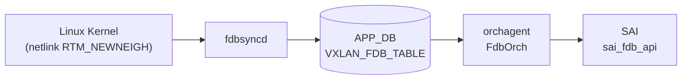

# VXLAN_FDB_TABLE テーブル

## 概要

`VXLAN_FDB_TABLE` は **APP_DB** に存在するテーブルであり、[EVPN](../../reference/glossary.md#term-evpn) [MAC](../../reference/glossary.md#term-mac) sync によってリモート [VTEP](../../reference/glossary.md#term-vtep) から学習された MAC アドレスエントリを保持する[^1]。

データフローは以下の通り:

1. **fdbsyncd** が Linux カーネルの netlink イベント（`RTM_NEWNEIGH` / `RTM_DELNEIGH`）を受信
2. [VXLAN](../../reference/glossary.md#term-vxlan) インタフェース上の MAC 学習イベントを `VXLAN_FDB_TABLE` として APP_DB に書き込む
3. **orchagent** の `FdbOrch` が `APP_VXLAN_FDB_TABLE` を購読し、SAI FDB エントリを生成する

[CONFIG_DB](../../reference/glossary.md#term-config_db) の静的エントリ (`FDB` テーブル) とは異なり、本テーブルはランタイム動的学習エントリのみを保持する。

<!-- cdb-mermaid -->
### データフロー (自動生成)



!!! note "凡例"
    VXLAN_FDB_TABLE は CONFIG_DB ではなく APP_DB に書かれる。fdbsyncd (fdbsyncd コンテナ) が netlink から直接書き込む。

<!-- /cdb-mermaid -->

## key 構造

```text
VXLAN_FDB_TABLE|<VlanName>:<MAC>
```

例:

```text
VXLAN_FDB_TABLE|Vlan200:00:02:00:00:47:e2
```

キーの `<VlanName>` は `"VlanXXX"` 形式（`"Vlan"` プレフィックス付き）、`<MAC>` は `xx:xx:xx:xx:xx:xx` 形式。

## フィールド一覧

| フィールド | 型 | 説明 |
|-----------|-----|------|
| `remote_vtep` | IPv4 アドレス文字列 | リモート VTEP の IP アドレス |
| `type` | string `dynamic`\|`static` | FDB エントリ種別 |
| `vni` | string (数値) | VxLAN Network Identifier |

!!! note "esi フィールド"
    `fdborch.cpp` は `esi` フィールドも読み出し変数として定義するが、`fdbsyncd` はこれを書き込まない。`esi` は他の経路（EVPN BGP 連携）でのみ設定される可能性がある。

## 購読者

- **orchagent / FdbOrch**: `APP_VXLAN_FDB_TABLE_NAME` を `ConsumerStateTable` で購読し、`FDB_ORIGIN_VXLAN_ADVERTIZED` として SAI FDB エントリを生成する（`fdborch.cpp:719-722`）
- **show vxlan remotemac**: `sonic-utilities/show/vxlan.py:360` が APP_DB を直接参照して表示する

## 関連 CONFIG_DB / YANG / CLI

- 関連 [CONFIG_DB](../../reference/glossary.md#term-config_db): `VXLAN_TUNNEL`、`VXLAN_TUNNEL_MAP`、`VXLAN_EVPN_NVO`、`FDB`
- 関連 CLI: `show vxlan remotemac all`、`show vxlan remotemac <vtep-ip>`

<!-- defaults -->
## コード由来の暗黙デフォルト (Phase A)

| フィールド | 省略/条件 | 実挙動 | 分類 | 根拠 |
|-----------|---------|--------|------|------|
| `type` | netlink `NUD_NOARP` フラグなし | `"dynamic"` を書き込む | netlink state ハードコード | `fdbsync.cpp:800-802` |
| `type` | netlink `NUD_NOARP` フラグあり | `"static"` を書き込む | netlink state ハードコード | `fdbsync.cpp:795-798` |
| `type` | fdborch 受信側でフィールド省略 | `"dynamic"` デフォルト初期化 | ローカル変数初期化 | `fdborch.cpp:770` |
| `vni` | フィールド省略または数値変換失敗 | `0` デフォルト → エントリはそのまま処理続行 | ローカル変数初期化 | `fdborch.cpp:773, 820-824` |
| `remote_vtep` | 不正 IP または省略 | `""` → silent drop（DIP トンネルモード） | バリデーション失敗 → silent drop | `fdborch.cpp:795-841` |
| `esi` | fdbsyncd 経由 | 常に空文字列（書き込まれない） | 書き込み元依存 | `fdbsync.cpp:658-664` |
| `origin` | テーブル名 = `APP_VXLAN_FDB_TABLE_NAME` | `FDB_ORIGIN_VXLAN_ADVERTIZED` にハードコード | ハードコード | `fdborch.cpp:719-722` |
| warm-restart 中 | `isWarmStartInProgress() == true` | APP_DB 直書きせず `insertToMap()` でキャッシュ蓄積、完了後に一括フラッシュ | warm-restart 遅延書き込み | `fdbsync.cpp:669-673` |
| エントリ削除トリガー | `RTM_DELNEIGH` または state が `NUD_INCOMPLETE`/`NUD_FAILED` | `macDelVxlan()` を呼び APP_DB からエントリ削除 | netlink state ハードコード | `fdbsync.cpp:787-792` |

### 補足: `type` 判定ロジック詳細

`fdbsyncd` の `onMsgNbr()` 関数でカーネル netlink の state ビットを参照する:

```cpp
// sonic-swss/fdbsyncd/fdbsync.cpp:794-802
int state = rtnl_neigh_get_state(neigh);
if (state & NUD_NOARP)
{
    /* This is a static route */
    type = "static";
}
else
{
    type = "dynamic";
}
```

`NUD_NOARP` は「ARP タイムアウトなし（固定 = static）」を意味する Linux カーネルの neigh state フラグ。EVPN type-2 で学習される通常のリモート MAC は ARP によって老化するため `NUD_NOARP` が立たず、`"dynamic"` となる。

<!-- /defaults -->

<!-- ordering -->
## 書込み順依存 (Phase B)

`FdbOrch::doTask(Consumer&)` (`sonic-swss/orchagent/fdborch.cpp`) を全行精読した結果、以下の順序依存・タイミング依存を検出した。中間ノート: `meta/_intermediate/cdb-flow/vxlan-fdb-ordering.md`。

### 他テーブル先行必須

| 先行条件 | 理由 | 違反時の挙動 |
|---|---|---|
| PortsOrch `allPortsReady()` | `doTask()` 冒頭のグローバルガード | 全 PORT の SAI 作成完了まで `APP_VXLAN_FDB_TABLE` のイベントは一切処理されず `m_toSync` に滞留する（`fdborch.cpp:710-713`） |
| `VLAN|<name>` (PortsOrch に `Vlan<id>` 登録済み) | `doTask()` が `m_portsOrch->getPort(keys[0], vlan)` で VLAN OID を解決する | SET は `it++` で次周回再試行（自動ポーリング）、DEL は `deleteFdbEntryFromSavedFDB()` を呼んで erase（破棄）（`fdborch.cpp:736-754`） |
| `VXLAN_TUNNEL` / VxlanTunnelOrch の tunnel 作成完了 (`isDipTunnelsSupported() == true` 時) | `tunnel_orch->getTunnelPortName(remote_ip)` でトンネルポート名を解決する | `remote_ip` が空ならば `m_toSync.erase` で**再試行なし破棄**（`fdborch.cpp:834-841`） |
| `VXLAN_EVPN_NVO` / EvpnNvoOrch の source VTEP 作成完了 (`isDipTunnelsSupported() == false` 時) | `evpn_nvo_orch->getEVPNVtep()` で source VTEP を解決する | 戻り値が `NULL` なら `m_toSync.erase` で**再試行なし破棄**（`fdborch.cpp:847-854`） |

**推奨書込み順序**:

```text
# 1. PortsOrch 初期化完了（orchagent 起動時に自然満足）
# 2. VXLAN_TUNNEL — VxlanTunnelOrch がトンネルポートを作成
SET CONFIG_DB VXLAN_TUNNEL|vtep1  src_ip=10.0.0.1
# 3. (DIP サポートなし時のみ) VXLAN_EVPN_NVO — EvpnNvoOrch が source VTEP を登録
SET CONFIG_DB VXLAN_EVPN_NVO|nvo1  source_vtep=vtep1
# 4. VLAN
SET CONFIG_DB VLAN|Vlan200  vlanid=200
# 5. VXLAN_FDB_TABLE エントリ（fdbsyncd が netlink から書き込む）
SET APP_DB VXLAN_FDB_TABLE|Vlan200:00:02:00:00:47:e2  remote_vtep=10.0.0.2  type=dynamic  vni=10000
```

### retry / 自動調停の仕組み

- **VLAN 未解決の SET**: `m_toSync` に残り続け、`Orch::doTask()` の次回スケジュールで再評価（無限ポーリング）。
- **VXLAN tunnel 未解決 / `remote_vtep` 不正**: `m_toSync.erase` で即破棄。**自動救済なし**。再投入が必要。
- **EVPN NVO の source VTEP が NULL**: 同上、即破棄。

### `remote_vtep` バリデーション (fail-fast)

`IpAddress(remote_ip)` のコンストラクタで例外が発生した場合（不正 IP 文字列）、`remote_ip = ""`
にセットされたうえで `m_toSync.erase` により破棄される。`fdbsyncd` 経由では正常な IPv4 アドレスのみが書き込まれるため通常は問題にならないが、外部から直接 APP_DB に書き込む場合は妥当な IPv4 形式であることを保証すること（`fdborch.cpp:795-808`）。

<!-- /ordering -->

<!-- cross-refs -->
## 暗黙参照テーブル (Phase C)

`orchagent/fdborch.cpp` の静的解析から抽出した、`VXLAN_FDB_TABLE` 処理が暗黙的に依存するテーブル・オブジェクト一覧。中間ノート: `meta/_intermediate/cdb-flow/vxlan-fdb-cross-refs.md`。

| 参照先テーブル/オブジェクト | 参照種別 | 依存方向 | コード根拠 |
|---------------------------|---------|---------|-----------|
| `PORT` 群 (PortsOrch `allPortsReady`) | 全ポート初期化ガード | VXLAN_FDB_TABLE → PortsOrch | `fdborch.cpp:711-714` — `m_portsOrch->allPortsReady()` が false の間は全イベントを `m_toSync` に留め置き処理しない |
| `VLAN` (PortsOrch) | VLAN OID 解決 | VXLAN_FDB_TABLE → VLAN | `fdborch.cpp:739-759` — `m_portsOrch->getPort(keys[0], vlan)` で key の VlanName から VLAN OID を取得; SET は次周回再試行、DEL は即破棄 |
| `VXLAN_TUNNEL` (VxlanTunnelOrch) | リモート VTEP ポート名解決 (DIP モード) | VXLAN_FDB_TABLE → VXLAN_TUNNEL | `fdborch.cpp:834,836,843` — `isDipTunnelsSupported() == true` 時に `getTunnelPortName(remote_ip)` で VTEP ポートを解決; `remote_vtep` 空なら即破棄 (`fdborch.cpp:838-841`) |
| `VXLAN_EVPN_NVO` (EvpnNvoOrch) | source VTEP 解決 (非 DIP モード) | VXLAN_FDB_TABLE → VXLAN_EVPN_NVO | `fdborch.cpp:847-854` — `isDipTunnelsSupported() == false` 時に `evpn_nvo_orch->getEVPNVtep()` で source VTEP を取得; NULL なら即破棄 |

### 依存解決の順序制約

1. PortsOrch の `allPortsReady()` が true になるまで全 `APP_VXLAN_FDB_TABLE` イベントはブロックされる（`fdborch.cpp:711-714`）。
2. `VLAN` が PortsOrch に登録されていないと SET イベントが次周回に延期され続ける（`fdborch.cpp:739,758`）。
3. DIP モードでは `VXLAN_TUNNEL` エントリが先に存在し VxlanTunnelOrch がトンネルポートを作成済みである必要がある（`fdborch.cpp:834,843`）。
4. 非 DIP モードでは `VXLAN_EVPN_NVO` が先に書かれ EvpnNvoOrch が source VTEP を登録済みである必要がある（`fdborch.cpp:847-848`）。
5. 条件 3・4 が未満足の場合は `m_toSync.erase` で**再試行なし破棄**となるため、手動再投入が必要。

<!-- evidence: sonic-swss/orchagent/fdborch.cpp:711-714,739-759,832-854 -->

<!-- /cross-refs -->

<!-- failure -->
## 失敗挙動 (Phase D)

> 調査証跡: `meta/_intermediate/cdb-flow/vxlan-fdb-failure.md`

`VXLAN_FDB_TABLE` は APP_DB テーブルであり、書き込みは `fdbsyncd` が行い、消費は `orchagent/FdbOrch::doTask()` が行う。失敗経路は **fdbsyncd 側**（netlink イベント処理・warm-restart）と **orchagent 側**（APP_DB エントリ処理・SAI 操作）の 2 層に分かれる。

<!-- evidence: sonic-swss/fdbsyncd/fdbsync.cpp:580-583,609-612,639-642; sonic-swss/fdbsyncd/fdbsync.h:15; sonic-swss/orchagent/fdborch.cpp:711-713,739-759,801-808,836-854,870-895,917-918,1291-1318,1531-1542 -->

### A. fdbsyncd 側の失敗パターン

| # | 失敗条件 | 挙動 | retry | evidence |
|---|----------|------|-------|---------|
| 1 | warm-restart タイマー進行中 (120 秒) | `macAddVxlan` / `macUpdateVxlan` / `macDelVxlan` が APP_DB へ直接書かず `AppRestartAssist::insertToMap()` でキャッシュ蓄積。タイマー完了後の reconcile フェーズで差分を一括反映 | 自動 (reconcile) | `fdbsync.cpp:580-583, 609-612, 639-642; fdbsync.h:15` |
| 2 | netlink MAC が `00:00:00:00:00:00` (BUM / IMET) | `VXLAN_FDB_TABLE` に書かず `APP_VXLAN_REMOTE_VNI_TABLE_NAME` に書く | なし | `fdbsync.cpp:805` |
| 3 | 非 VXLAN インタフェースの netlink イベント | `isVxlanIntf == false` → スキップ | なし | `fdbsync.cpp` |

### B. orchagent (FdbOrch) 側の失敗パターン

| # | 失敗条件 | 挙動 | retry | evidence |
|---|----------|------|-------|---------|
| 4 | `allPortsReady() == false` | `doTask()` が early return。`m_toSync` に蓄積されたまま全処理がブロック | 自動 (ポート初期化完了後の次イベントループ) | `fdborch.cpp:711-713` |
| 5 | VLAN が PortsOrch に未登録 (SET) | `it++` で次周回再試行（無限ポーリング） | 自動 | `fdborch.cpp:739-759` |
| 6 | VLAN が PortsOrch に未登録 (DEL) + `stoi` 成功 | `deleteFdbEntryFromSavedFDB()` を呼んで `erase(it)` 破棄 | なし | `fdborch.cpp:744-754` |
| 7 | VLAN が PortsOrch に未登録 (DEL) + `stoi` 例外 | `erase(it)` で即破棄 | なし | `fdborch.cpp:748-750` |
| 8 | `remote_vtep` が不正 IP 文字列 | `IpAddress()` が例外 → `SWSS_LOG_NOTICE` → `remote_ip = ""` → break | なし (後続で #9 により破棄) | `fdborch.cpp:801-808` |
| 9 | `remote_vtep` が空 (DIP トンネルモード) | `erase(it)` で即破棄 | なし | `fdborch.cpp:838-841` |
| 10 | EVPN NVO source VTEP が NULL (非 DIP モード) | `erase(it)` で即破棄 | なし | `fdborch.cpp:848-852` |
| 11 | `addFdbEntry()` が `false` を返す (SAI 生成失敗等) | `it++` で次周回再試行 | 自動 | `fdborch.cpp:870-895` |
| 12 | ポートが未作成または bridge_port_id が `SAI_NULL_OBJECT_ID` | `saved_fdb_entries[port_name]` にパーク → `return true`。ポート作成完了時にコールバック経由で再試行 | 自動 | `fdborch.cpp:1297-1303` |
| 13 | ポートが VLAN メンバーでない | 同上 (`saved_fdb_entries` パーク) | 自動 | `fdborch.cpp:1313-1318` |
| 14 | SAI `create_fdb_entry()` 失敗 | `SWSS_LOG_ERROR` → `handleSaiCreateStatus()` → `parseHandleSaiStatusFailure()` → `false`。`doTask()` 側で `it++` 再試行 | 自動 | `fdborch.cpp:1531-1542` |
| 15 | 不明 OP (SET / DEL 以外) | `SWSS_LOG_ERROR` → `erase(it)` 即破棄 | なし | `fdborch.cpp:917-918` |

### C. 失敗別サマリ

| ケース | 最悪の結果 | 回復方法 |
|---|---|---|
| warm-restart 120 秒タイムアウト超過 | reconcile が完了せず古いエントリが残存 | `fdbsyncd` の warm-restart 完了を待つ / 再起動 |
| `remote_vtep` 不正 IP | エントリ即破棄（VXLAN FDB 未登録、パケット転送不可） | `fdbsyncd` が正しい IP を再送信するか手動で APP_DB を修正 |
| EVPN NVO 未設定で VXLAN FDB エントリが先着 | エントリ即破棄 | EVPN NVO を設定後、BGP / `fdbsyncd` が再学習するのを待つ |
| SAI `create_fdb_entry` 失敗 | 次周回で自動再試行。ASIC リソース枯渇時は再試行が続く | `show vxlan remotemac` でエントリが現れるか確認 |

!!! note "`VXLAN_FDB_TABLE` に失敗ステータスは書かれない"
    orchagent は `VXLAN_FDB_TABLE` の失敗を STATE_DB / ERROR_TABLE には記録しない。失敗は `SWSS_LOG_*` 経由でのみ `/var/log/swss/orchagent.log` に出力される。エントリの存否は `sonic-db-cli APPL_DB keys 'VXLAN_FDB_TABLE:*'` または `show vxlan remotemac` で確認する。

<!-- /failure -->

<!-- constants -->
## ハードコード定数 (Phase E)

<!-- evidence: meta/_intermediate/cdb-flow/vxlan-fdb-constants.md -->

### テーブル名 (schema.h)

```c
// sonic-swss-common/common/schema.h:87-88
#define APP_VXLAN_FDB_TABLE_NAME          "VXLAN_FDB_TABLE"
#define APP_VXLAN_REMOTE_VNI_TABLE_NAME   "VXLAN_REMOTE_VNI_TABLE"
```

APP_DB に書き込まれるテーブル名は `#define` で固定されており、設定で変更不可。[^c1]

### warm-restart バッファリングタイマー

```c
// sonic-swss/fdbsyncd/fdbsync.h:15
#define DEFAULT_FDBSYNC_WARMSTART_TIMER 120
```

warm-restart 中に APP_DB への書き込みをバッファリングする時間（秒）。`fdbsyncd` はこの期間中、`AppRestartAssist::insertToMap()` でキャッシュに蓄積し、タイマー完了後に reconcile フェーズで差分を一括反映する。設定で変更不可。[^c2]

### `type` フィールドの有効値

| 値 | 意味 | コード根拠 |
|----|------|-----------|
| `"dynamic"` | EVPN 動的学習 MAC（`NUD_NOARP` フラグなし） | `fdbsync.cpp:801` |
| `"static"` | 静的 MAC（`NUD_NOARP` フラグあり） | `fdbsync.cpp:797` |

この 2 値のみが有効。`fdbsync.cpp:794-802` の `NUD_NOARP` チェックでハードコードされており、第三の値は存在しない。[^c2]

### FDB Origin 列挙値 (fdborch.h)

```c
// sonic-swss/orchagent/fdborch.h:10-14
FDB_ORIGIN_INVALID         = 0
FDB_ORIGIN_LEARN           = 1
FDB_ORIGIN_PROVISIONED     = 2
FDB_ORIGIN_VXLAN_ADVERTIZED = 4
FDB_ORIGIN_MCLAG_ADVERTIZED = 8
```

`APP_VXLAN_FDB_TABLE_NAME` から来るエントリには常に `FDB_ORIGIN_VXLAN_ADVERTIZED = 4` が付与される（`fdborch.cpp:719-722`）。この値は設定で変更不可。[^c3]

### VXLAN ブリッジインタフェース名プレフィックス

```c
// sonic-swss/fdbsyncd/fdbsync.cpp:22
#define VXLAN_BR_IF_NAME_PREFIX    "Brvxlan"
```

`fdbsyncd` が VXLAN ブリッジインタフェースを識別するためのプレフィックス。`isVxlanIntf` 判定に使用され、このプレフィックスを持たないインタフェースからの netlink イベントは VXLAN_FDB_TABLE に書かれない。[^c1]

<!-- /constants -->

## 例外条件・特殊挙動

<!-- evidence: sonic-swss/fdbsyncd/fdbsync.cpp; sonic-swss/orchagent/fdborch.cpp -->

- **IMET (BUM) エントリは書き込まれない**: MAC が `00:00:00:00:00:00`（ブロードキャスト）の場合、`fdbsyncd` は `VXLAN_FDB_TABLE` ではなく `APP_VXLAN_REMOTE_VNI_TABLE_NAME` (IMET ルート) に書き込む（`fdbsync.cpp:805`）。
- **remote_vtep が空または不正の場合 silent drop**: `orchagent` が `remote_vtep` を `IpAddress` としてバリデーションし、失敗した場合は例外をキャッチして空文字列に設定、その後エントリを `toSync` から除去する（`fdborch.cpp:795-808, 838-841`）。
- **ローカル MAC 学習で VXLAN エントリが削除される**: `fdbsyncd` は同じ Vlan+MAC がローカルに学習された場合 (`STATE_FDB_TABLE`)、対応する `VXLAN_FDB_TABLE` エントリを削除する (`fdbsync.cpp:343-350: macDelVxlanEntry + macDelVxlan`)。これは local learn 優先の動作である。
- **warm-restart 中のバッファリング**: `fdbsyncd` の warm-restart 中（`DEFAULT_FDBSYNC_WARMSTART_TIMER = 120 秒`）は APP_DB への直接書き込みが抑制され、キャッシュに蓄積される。完了後に `reconciliation` フェーズで差分のみを反映する。
- **DIP トンネル未サポートモード**: `isDipTunnelsSupported() == false` の場合、`remote_vtep` が空でも EVPN NVO の source VTEP を使ってトンネルポートを解決する（`fdborch.cpp:847-854`）。

[^exc1]: `sonic-swss/fdbsyncd/fdbsync.cpp` <https://github.com/sonic-net/sonic-swss/blob/master/fdbsyncd/fdbsync.cpp>
[^exc2]: `sonic-swss/orchagent/fdborch.cpp` <https://github.com/sonic-net/sonic-swss/blob/master/orchagent/fdborch.cpp>

<!-- ref-triangle:start -->

## 関連リファレンス

- CONFIG_DB: [`VXLAN_TUNNEL`](vxlan-tunnel.md)
- CONFIG_DB: [`VXLAN_TUNNEL_MAP`](vxlan-tunnel-map.md)
- CONFIG_DB: [`VXLAN_EVPN_NVO`](vxlan-evpn-nvo.md)
- CONFIG_DB: [`FDB`](fdb.md)

<!-- ref-triangle:end -->

## 引用元

[^1]: `fdbsyncd/fdbsync.cpp` — `macAddVxlan()` 関数で `APP_VXLAN_FDB_TABLE_NAME` に書き込む. <https://github.com/sonic-net/sonic-swss/blob/master/fdbsyncd/fdbsync.cpp>
[^c1]: `sonic-swss-common/common/schema.h:87-88` および `fdbsync.cpp:22` — テーブル名とブリッジプレフィックスのハードコード定数. <https://github.com/sonic-net/sonic-swss-common/blob/master/common/schema.h>
[^c2]: `sonic-swss/fdbsyncd/fdbsync.h:15` および `fdbsync.cpp:794-802` — warm-restart タイマーと `type` 文字列ハードコード. <https://github.com/sonic-net/sonic-swss/blob/master/fdbsyncd/fdbsync.h>
[^c3]: `sonic-swss/orchagent/fdborch.h:10-14` および `fdborch.cpp:719-722` — FDB Origin 列挙値と VXLAN 固定割り当て. <https://github.com/sonic-net/sonic-swss/blob/master/orchagent/fdborch.h>

## 関連ページ

- [HLD: VXLAN / VNet 全体設計](../../overlay/vxlan-sonic.md)
- [CONFIG_DB: VXLAN_TUNNEL](vxlan-tunnel.md)
- [CONFIG_DB: VXLAN_EVPN_NVO](vxlan-evpn-nvo.md)

<!-- ops-hint -->
## 運用ヒント

### 典型値

- key 形式: `VXLAN_FDB_TABLE|Vlan<id>:<MAC>`
- `remote_vtep`: リモート VTEP の IPv4 アドレス
- `type`: 通常 `"dynamic"`（EVPN 学習 MAC）
- `vni`: 対応する VxLAN VNI 番号

### 確認コマンド

```bash
# APP_DB から直接参照
sonic-db-cli APPL_DB keys 'VXLAN_FDB_TABLE:*'
sonic-db-cli APPL_DB hgetall 'VXLAN_FDB_TABLE|Vlan200:00:02:00:00:47:e2'

# CLI から確認
show vxlan remotemac all
show vxlan remotemac <remote-vtep-ip>
```

<!-- /ops-hint -->

<!-- runtime-trace -->
## APP_DB → 実コンテナ動作トレース

### 段階 1: fdbsyncd — netlink 受信

- `fdbsyncd` の `onMsgNbr()` が `RTM_NEWNEIGH` を受信
- VXLAN インタフェース (`isVxlanIntf == true`) かつ MAC が非ゼロの場合のみ処理
- `rtnl_neigh_get_state()` から `NUD_NOARP` ビットを確認して `type` を決定
- `macAddVxlan()` で APP_DB の `VXLAN_FDB_TABLE` に `{remote_vtep, type, vni}` を書き込む

### 段階 2: orchagent / FdbOrch — APP_DB 消費

- `FdbOrch::doTask()` が `APP_VXLAN_FDB_TABLE_NAME` のエントリを受け取る
- `origin = FDB_ORIGIN_VXLAN_ADVERTIZED` にハードコード設定
- `remote_vtep` を IpAddress としてバリデーション; 不正なら silent drop
- `isDipTunnelsSupported()` が true なら `remote_vtep` からトンネルポート名を解決
- `addFdbEntry()` で SAI FDB エントリを生成

### 段階 3: SAI — ハードウェアへの反映

- SAI `sai_fdb_api->create_fdb_entry()` で ASIC のブリッジ転送テーブルにリモート MAC が登録される
- VXLAN トンネルポートが nexthop として使用される

### 段階 4: タイミング + 副作用

- 同 Vlan+MAC がローカルに学習されると `fdbsyncd` が VXLAN エントリを削除（local learn 優先）
- warm-restart タイマー (120 秒) 中は APP_DB 書き込みが遅延する
- EVPN NVO 削除時は全 VXLAN FDB エントリが一斉フラッシュされる

<!-- /runtime-trace -->
