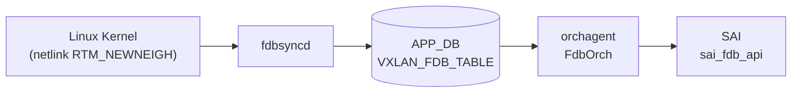

# VXLAN_FDB_TABLE テーブル

## 概要

`VXLAN_FDB_TABLE` は **APP_DB** に存在するテーブルであり、[EVPN](../../reference/glossary.md#term-evpn) [MAC](../../reference/glossary.md#term-mac) sync によってリモート [VTEP](../../reference/glossary.md#term-vtep) から学習された MAC アドレスエントリを保持する[^1]。

データフローは以下の通り:

1. **fdbsyncd** が Linux カーネルの netlink イベント（`RTM_NEWNEIGH` / `RTM_DELNEIGH`）を受信
2. [VXLAN](../../reference/glossary.md#term-vxlan) インタフェース上の MAC 学習イベントを `VXLAN_FDB_TABLE` として APP_DB に書き込む
3. **orchagent** の `FdbOrch` が `APP_VXLAN_FDB_TABLE` を購読し、SAI FDB エントリを生成する

[CONFIG_DB](../../reference/glossary.md#term-config_db) の静的エントリ (`FDB` テーブル) とは異なり、本テーブルはランタイム動的学習エントリのみを保持する。

<!-- cdb-mermaid -->
### データフロー (自動生成)



!!! note "凡例"
    VXLAN_FDB_TABLE は CONFIG_DB ではなく APP_DB に書かれる。fdbsyncd (fdbsyncd コンテナ) が netlink から直接書き込む。

<!-- /cdb-mermaid -->

## key 構造

```text
VXLAN_FDB_TABLE|<VlanName>:<MAC>
```

例:

```text
VXLAN_FDB_TABLE|Vlan200:00:02:00:00:47:e2
```

キーの `<VlanName>` は `"VlanXXX"` 形式（`"Vlan"` プレフィックス付き）、`<MAC>` は `xx:xx:xx:xx:xx:xx` 形式。

## フィールド一覧

| フィールド | 型 | 説明 |
|-----------|-----|------|
| `remote_vtep` | IPv4 アドレス文字列 | リモート VTEP の IP アドレス |
| `type` | string `dynamic`\|`static` | FDB エントリ種別 |
| `vni` | string (数値) | VxLAN Network Identifier |

!!! note "esi フィールド"
    `fdborch.cpp` は `esi` フィールドも読み出し変数として定義するが、`fdbsyncd` はこれを書き込まない。`esi` は他の経路（EVPN BGP 連携）でのみ設定される可能性がある。

## 購読者

- **orchagent / FdbOrch**: `APP_VXLAN_FDB_TABLE_NAME` を `ConsumerStateTable` で購読し、`FDB_ORIGIN_VXLAN_ADVERTIZED` として SAI FDB エントリを生成する（`fdborch.cpp:719-722`）
- **show vxlan remotemac**: `sonic-utilities/show/vxlan.py:360` が APP_DB を直接参照して表示する

## 関連 CONFIG_DB / YANG / CLI

- 関連 [CONFIG_DB](../../reference/glossary.md#term-config_db): `VXLAN_TUNNEL`、`VXLAN_TUNNEL_MAP`、`VXLAN_EVPN_NVO`、`FDB`
- 関連 CLI: `show vxlan remotemac all`、`show vxlan remotemac <vtep-ip>`

<!-- defaults -->
## コード由来の暗黙デフォルト (Phase A)

| フィールド | 省略/条件 | 実挙動 | 分類 | 根拠 |
|-----------|---------|--------|------|------|
| `type` | netlink `NUD_NOARP` フラグなし | `"dynamic"` を書き込む | netlink state ハードコード | `fdbsync.cpp:800-802` |
| `type` | netlink `NUD_NOARP` フラグあり | `"static"` を書き込む | netlink state ハードコード | `fdbsync.cpp:795-798` |
| `type` | fdborch 受信側でフィールド省略 | `"dynamic"` デフォルト初期化 | ローカル変数初期化 | `fdborch.cpp:770` |
| `vni` | フィールド省略または数値変換失敗 | `0` デフォルト → エントリはそのまま処理続行 | ローカル変数初期化 | `fdborch.cpp:773, 820-824` |
| `remote_vtep` | 不正 IP または省略 | `""` → silent drop（DIP トンネルモード） | バリデーション失敗 → silent drop | `fdborch.cpp:795-841` |
| `esi` | fdbsyncd 経由 | 常に空文字列（書き込まれない） | 書き込み元依存 | `fdbsync.cpp:658-664` |
| `origin` | テーブル名 = `APP_VXLAN_FDB_TABLE_NAME` | `FDB_ORIGIN_VXLAN_ADVERTIZED` にハードコード | ハードコード | `fdborch.cpp:719-722` |
| warm-restart 中 | `isWarmStartInProgress() == true` | APP_DB 直書きせず `insertToMap()` でキャッシュ蓄積、完了後に一括フラッシュ | warm-restart 遅延書き込み | `fdbsync.cpp:669-673` |
| エントリ削除トリガー | `RTM_DELNEIGH` または state が `NUD_INCOMPLETE`/`NUD_FAILED` | `macDelVxlan()` を呼び APP_DB からエントリ削除 | netlink state ハードコード | `fdbsync.cpp:787-792` |

### 補足: `type` 判定ロジック詳細

`fdbsyncd` の `onMsgNbr()` 関数でカーネル netlink の state ビットを参照する:

```cpp
// sonic-swss/fdbsyncd/fdbsync.cpp:794-802
int state = rtnl_neigh_get_state(neigh);
if (state & NUD_NOARP)
{
    /* This is a static route */
    type = "static";
}
else
{
    type = "dynamic";
}
```

`NUD_NOARP` は「ARP タイムアウトなし（固定 = static）」を意味する Linux カーネルの neigh state フラグ。EVPN type-2 で学習される通常のリモート MAC は ARP によって老化するため `NUD_NOARP` が立たず、`"dynamic"` となる。

<!-- /defaults -->

## 例外条件・特殊挙動

<!-- evidence: sonic-swss/fdbsyncd/fdbsync.cpp; sonic-swss/orchagent/fdborch.cpp -->

- **IMET (BUM) エントリは書き込まれない**: MAC が `00:00:00:00:00:00`（ブロードキャスト）の場合、`fdbsyncd` は `VXLAN_FDB_TABLE` ではなく `APP_VXLAN_REMOTE_VNI_TABLE_NAME` (IMET ルート) に書き込む（`fdbsync.cpp:805`）。
- **remote_vtep が空または不正の場合 silent drop**: `orchagent` が `remote_vtep` を `IpAddress` としてバリデーションし、失敗した場合は例外をキャッチして空文字列に設定、その後エントリを `toSync` から除去する（`fdborch.cpp:795-808, 838-841`）。
- **ローカル MAC 学習で VXLAN エントリが削除される**: `fdbsyncd` は同じ Vlan+MAC がローカルに学習された場合 (`STATE_FDB_TABLE`)、対応する `VXLAN_FDB_TABLE` エントリを削除する (`fdbsync.cpp:343-350: macDelVxlanEntry + macDelVxlan`)。これは local learn 優先の動作である。
- **warm-restart 中のバッファリング**: `fdbsyncd` の warm-restart 中（`DEFAULT_FDBSYNC_WARMSTART_TIMER = 120 秒`）は APP_DB への直接書き込みが抑制され、キャッシュに蓄積される。完了後に `reconciliation` フェーズで差分のみを反映する。
- **DIP トンネル未サポートモード**: `isDipTunnelsSupported() == false` の場合、`remote_vtep` が空でも EVPN NVO の source VTEP を使ってトンネルポートを解決する（`fdborch.cpp:847-854`）。

[^exc1]: `sonic-swss/fdbsyncd/fdbsync.cpp` <https://github.com/sonic-net/sonic-swss/blob/master/fdbsyncd/fdbsync.cpp>
[^exc2]: `sonic-swss/orchagent/fdborch.cpp` <https://github.com/sonic-net/sonic-swss/blob/master/orchagent/fdborch.cpp>

<!-- ref-triangle:start -->

## 関連リファレンス

- CONFIG_DB: [`VXLAN_TUNNEL`](vxlan-tunnel.md)
- CONFIG_DB: [`VXLAN_TUNNEL_MAP`](vxlan-tunnel-map.md)
- CONFIG_DB: [`VXLAN_EVPN_NVO`](vxlan-evpn-nvo.md)
- CONFIG_DB: [`FDB`](fdb.md)

<!-- ref-triangle:end -->

## 引用元

[^1]: `fdbsyncd/fdbsync.cpp` — `macAddVxlan()` 関数で `APP_VXLAN_FDB_TABLE_NAME` に書き込む. <https://github.com/sonic-net/sonic-swss/blob/master/fdbsyncd/fdbsync.cpp>

## 関連ページ

- [HLD: VXLAN / VNet 全体設計](../../overlay/vxlan-sonic.md)
- [CONFIG_DB: VXLAN_TUNNEL](vxlan-tunnel.md)
- [CONFIG_DB: VXLAN_EVPN_NVO](vxlan-evpn-nvo.md)

<!-- ops-hint -->
## 運用ヒント

### 典型値

- key 形式: `VXLAN_FDB_TABLE|Vlan<id>:<MAC>`
- `remote_vtep`: リモート VTEP の IPv4 アドレス
- `type`: 通常 `"dynamic"`（EVPN 学習 MAC）
- `vni`: 対応する VxLAN VNI 番号

### 確認コマンド

```bash
# APP_DB から直接参照
sonic-db-cli APPL_DB keys 'VXLAN_FDB_TABLE:*'
sonic-db-cli APPL_DB hgetall 'VXLAN_FDB_TABLE|Vlan200:00:02:00:00:47:e2'

# CLI から確認
show vxlan remotemac all
show vxlan remotemac <remote-vtep-ip>
```

<!-- /ops-hint -->

<!-- runtime-trace -->
## APP_DB → 実コンテナ動作トレース

### 段階 1: fdbsyncd — netlink 受信

- `fdbsyncd` の `onMsgNbr()` が `RTM_NEWNEIGH` を受信
- VXLAN インタフェース (`isVxlanIntf == true`) かつ MAC が非ゼロの場合のみ処理
- `rtnl_neigh_get_state()` から `NUD_NOARP` ビットを確認して `type` を決定
- `macAddVxlan()` で APP_DB の `VXLAN_FDB_TABLE` に `{remote_vtep, type, vni}` を書き込む

### 段階 2: orchagent / FdbOrch — APP_DB 消費

- `FdbOrch::doTask()` が `APP_VXLAN_FDB_TABLE_NAME` のエントリを受け取る
- `origin = FDB_ORIGIN_VXLAN_ADVERTIZED` にハードコード設定
- `remote_vtep` を IpAddress としてバリデーション; 不正なら silent drop
- `isDipTunnelsSupported()` が true なら `remote_vtep` からトンネルポート名を解決
- `addFdbEntry()` で SAI FDB エントリを生成

### 段階 3: SAI — ハードウェアへの反映

- SAI `sai_fdb_api->create_fdb_entry()` で ASIC のブリッジ転送テーブルにリモート MAC が登録される
- VXLAN トンネルポートが nexthop として使用される

### 段階 4: タイミング + 副作用

- 同 Vlan+MAC がローカルに学習されると `fdbsyncd` が VXLAN エントリを削除（local learn 優先）
- warm-restart タイマー (120 秒) 中は APP_DB 書き込みが遅延する
- EVPN NVO 削除時は全 VXLAN FDB エントリが一斉フラッシュされる

<!-- /runtime-trace -->
