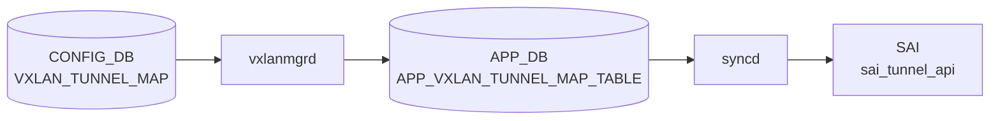

# VXLAN_TUNNEL_MAP テーブル

## 概要

[VXLAN](../../reference/glossary.md#term-vxlan) tunnel に対し、ローカル [VLAN](../../reference/glossary.md#term-vlan) と VNI ([VXLAN](../../reference/glossary.md#term-vxlan) Network Identifier) のマッピングを与える[^1]。`orchagent` の `VxlanTunnelMapOrch` がこのテーブルを購読し、[SAI](../../reference/glossary.md#term-sai) tunnel-map (`SAI_TUNNEL_MAP_TYPE_VLAN_ID_TO_VNI` / `SAI_TUNNEL_MAP_TYPE_VNI_TO_VLAN_ID`) のエントリを生成する。

<!-- cdb-mermaid -->
### データフロー (自動生成)



!!! note "凡例"
    CONFIG_DB から SAI までの典型経路を `docs/reference/config-db-orch-map.md` から機械生成したミニ図。詳細・例外は本ページ本文と対応表を参照。
<!-- /cdb-mermaid -->

## key 構造

```text
VXLAN_TUNNEL_MAP|<tunnel_name>|<map_name>
```

`<tunnel_name>` は `VXLAN_TUNNEL.name` への leafref、`<map_name>` はユーザ任意。

## フィールド一覧

| フィールド | 型 | 必須 | 説明 |
|-----------|----|------|------|
| `name` (key) | leafref `VXLAN_TUNNEL.name` | ✅ | 親トンネル |
| `mapname` (key) | string | ✅ | マッピング名（任意ラベル） |
| `vlan` | string `Vlan<id>` (パターン) | ✅ | 対応 [VLAN](../../reference/glossary.md#term-vlan) |
| `vni` | `vnid_type` (uint32 0..2^24-1) | ✅ | VNI |

備考: `vlan` 本来は `VLAN.name` への leafref が望ましいが、libyang の back-link 問題により暫定的に文字列パターン化されている (`sonic-vxlan.yang` のコメント参照)。

## 購読者

- `orchagent` `VxlanTunnelMapOrch`: [SAI](../../reference/glossary.md#term-sai) tunnel-map エントリ生成
- [EVPN](../../reference/glossary.md#term-evpn) フローでは `VxlanMgr` がここから [VLAN](../../reference/glossary.md#term-vlan)-VNI を引き、type-2/3 経路と紐付ける

## 関連 CONFIG_DB / YANG / CLI

- 関連 [CONFIG_DB](../../reference/glossary.md#term-config_db): `VXLAN_TUNNEL`、`VLAN`、`VLAN_INTERFACE`、`VNET`
- 関連 CLI: [`config vxlan`](../cli/config-vxlan.md) (`map add` / `map del`)
- 関連 [YANG](../../reference/glossary.md#term-yang): `sonic-vxlan`

<!-- value-behavior -->
## 値依存挙動マトリクス

| フィールド | 値 | 実挙動 |
|-----------|-----|--------|
| `vlan` | `Vlan<id>` 形式 | YANG pattern で検証。SAI tunnel-map に `SAI_TUNNEL_MAP_TYPE_VLAN_ID_TO_VNI` / `_TO_VLAN_ID` エントリを生成 |
| `vlan` | `Vlan` プレフィクスなし | YANG pattern 違反で reject |
| `vlan` | 既にマップ済みの VLAN | `vxlanmgr` が `"Vlan %s already mapped. Map Create failed"` でエラーして破棄 (vxlanmgr.cpp) |
| `vni` | 有効な VNI | VLAN と VNI を紐付け。EVPN type-2/3 経路と紐付く |
| `vni` | 既にマップ済みの VNI | `vxlanmgr` が重複エラーで破棄 |
| `vni` | `0` | 予約済み値。使用不可（`vnid_type` 型は 1 以上が実質有効）|

<!-- /value-behavior -->

<!-- defaults -->
## コード由来の暗黙デフォルト (Phase A)

<!-- evidence: meta/_intermediate/cdb-flow/vxlan-tunnel-map-defaults.md -->

| 挙動 | 実装動作 | コードロケーション |
|------|---------|------------------|
| mapping type | 常に `VNI_TO_VLAN_ID` (decap) + `VLAN_ID_TO_VNI` (encap) のペアを自動生成。CONFIG_DB に型指定フィールドなし | `vxlanorch.cpp:759-760` |
| VRF マッパー初期化 | VLAN MAP 追加時にトンネルが inactive ならば VRF マッパー (`VIRTUAL_ROUTER_ID_TO_VNI` / `VNI_TO_VIRTUAL_ROUTER_ID`) も同時に先行生成 (over-provision) | `vxlanorch.cpp:2065-2072` |
| `vni` >= 16777215 | `SWSS_LOG_ERROR` + `return true` で永続破棄 (リトライなし)。YANG `vnid_type` 型との二重チェック | `vxlanorch.cpp:2037-2040` |
| L3VNI の場合 | `VRFOrch::isL3VniVlan()` が真の場合 SAI entry を生成せず `SAI_NULL_OBJECT_ID` を記録 (暗黙 no-op) | `vxlanorch.cpp:2101-2113` |
| VLAN 未存在 | `PortsOrch::getVlanByVlanId()` が失敗 → `return false` でリトライ待ち | `vxlanorch.cpp:2031-2035` |
| tunnel 未存在 | `TunnelOrch::isTunnelExists()` が失敗 → `return false` でリトライ待ち | `vxlanorch.cpp:2047-2051` |
| del_tnl_hw_pending | 親トンネルの HW 削除保留中は MAP 追加もブロック → `return false` でリトライ待ち | `vxlanorch.cpp:2053-2058` |

### 書込み順依存

- `VXLAN_TUNNEL` が未作成の状態で `VXLAN_TUNNEL_MAP` を書くとトンネル存在チェックで `false` 返却 → リトライ。トンネル登録後に自動再処理される。
- `VLAN` が未作成の状態で MAP を書くと VLAN チェックで `false` 返却 → 同様にリトライ。

### 既知 YANG-実装 discrepancy

- L3VNI 判定は `VRFOrch` の内部状態 (`isL3VniVlan()`) に依存。YANG / CONFIG_DB に L3VNI を明示するフィールドはなく、同じ `vni` 値でも VRF 登録状態により SAI entry が生成されるかどうかが変わる — **外部から観測不可能な silent 挙動差**。

<!-- /defaults -->

<!-- ordering -->
## 書込み順序依存 (Phase B)

<!-- evidence: meta/_intermediate/cdb-flow/vxlan-tunnel-map-ordering.md; sonic-swss/orchagent/vxlanorch.cpp -->

### 作成順序

| 順序 | テーブル | 理由 |
|------|---------|------|
| 1 | `VLAN\|<id>` | `VxlanTunnelMapOrch::addOperation()` が `gPortsOrch->getVlanByVlanId()` で VLAN の存在を確認。未作成なら `return false`（リトライ待ち）(vxlanorch.cpp:2030) |
| 2 | `VXLAN_TUNNEL\|<tunnel-name>` | `isTunnelExists()` チェック。TUNNEL 未登録なら `return false`（リトライ待ち）(vxlanorch.cpp:2047) |
| 3 | `VXLAN_TUNNEL_MAP\|<tunnel>\|<map>` | 初回エントリ受信時に `createTunnelHw()` が呼ばれ SAI トンネルオブジェクト（mapper → tunnel → tunnel-term）が一括生成される (vxlanorch.cpp:2063)。VXLAN_TUNNEL 単体では SAI HW は作成されない点に注意 |

複数の MAP エントリは VLAN・TUNNEL が揃っていれば順不同で書込み可能。

### SAI HW 作成の内部順序（参考）

`createTunnelHw()` 内部では以下の順で SAI オブジェクトを生成する:

1. `createMapperHw()` — `sai_tunnel_api->create_tunnel_map()`（encap/decap マッパー）
2. `create_tunnel()` — `sai_tunnel_api->create_tunnel()`（マッパー OID リストを参照）
3. `create_tunnel_termination()` — `sai_tunnel_api->create_tunnel_term_table_entry()`

### 削除順序（逆順）

```
VXLAN_EVPN_NVO 削除 → VXLAN_TUNNEL_MAP 全削除 → VXLAN_TUNNEL 削除 → VLAN 削除
```

`del_tnl_hw_pending` フラグが true の間は MAP 追加もブロックされる (vxlanorch.cpp:2057)。削除途中での再追加は避けること。

<!-- /ordering -->

## 例外条件・特殊挙動 <!-- cdb-exceptions -->

<!-- evidence: sonic-swss/cfgmgr/vxlanmgr.cpp; sonic-buildimage/src/sonic-yang-models/yang-models/sonic-vxlan.yang -->

- **`vlan` 必須 (YANG)**: `mandatory true`、`pattern 'Vlan([0-9]{1,3}|...)'` — パターン違反は YANG で reject される[^exc2]。
- **`vni` 必須 (YANG)**: `mandatory true`[^exc2]。
- **VLAN leafref 無効化 (既知制限)**: libyang の back-link 問題のため VLAN の `leafref` はコメントアウトされ、文字列パターンのみで検証される（`sonic-vlan.yang` との整合性チェックなし）[^exc2]。
- **VLAN 重複マッピング禁止**: 同じ `vlan` が既にマップされている場合 `SWSS_LOG_ERROR("Vlan %s already mapped. Map Create failed")` を記録して破棄[^exc1]。
- **VNI 重複マッピング禁止**: 同じ `vni` が既にマップされている場合も同様に破棄[^exc1]。
- **マップキー重複**: キャッシュに同名マップが存在する場合 `SWSS_LOG_ERROR("Map already present")` で破棄[^exc1]。
- **参照トンネル未 active**: `VXLAN_TUNNEL` が active でない場合リトライ待ち[^exc1]。

[^exc1]: `sonic-swss/cfgmgr/vxlanmgr.cpp` <https://github.com/sonic-net/sonic-swss/blob/master/cfgmgr/vxlanmgr.cpp>
[^exc2]: `sonic-buildimage/src/sonic-yang-models/yang-models/sonic-vxlan.yang` <https://github.com/sonic-net/sonic-buildimage/blob/master/src/sonic-yang-models/yang-models/sonic-vxlan.yang>

<!-- ref-triangle:start -->

## 関連リファレンス

- [YANG](../../reference/glossary.md#term-yang): [`sonic-vxlan`](../yang/sonic-vxlan.md)
- CLI: [`config vxlan`](../cli/config-vxlan.md)

<!-- ref-triangle:end -->

## 引用元

[^1]: [YANG](../../reference/glossary.md#term-yang) 定義: `sonic-vxlan.yang` 内 `VXLAN_TUNNEL_MAP`. <https://github.com/sonic-net/sonic-buildimage/blob/9ea932ec2e18f35e58268ec2e4456b1d4afd65cd/src/sonic-yang-models/yang-models/sonic-vxlan.yang#L66>

## 関連ページ
- [HLD: VXLAN / VNet 全体設計](../../overlay/vxlan-sonic.md)
- [CLI: config vxlan](../cli/config-vxlan.md)
- [CONFIG_DB: VXLAN_TUNNEL](vxlan-tunnel.md)
- [YANG: sonic-vxlan](../yang/sonic-vxlan.md)

<!-- ops-hint -->
## 運用ヒント

### 典型値

- key 形式: `VXLAN_TUNNEL_MAP|<tunnel>|<map-name>` (例 `tunnel1|map_1000_Vlan100`)。
- `vni`: L2 VNI (例 1000)。
- `vlan`: `Vlan100`。

### よくある誤設定

- VLAN 未作成のまま VNI map を入れると [orchagent](../../reference/glossary.md#term-orchagent) が pending、トンネルが半開状態。

### 確認コマンド

```bash
sonic-db-cli CONFIG_DB keys 'VXLAN_TUNNEL_MAP|*'
show vxlan vlanvnimap
```
<!-- /ops-hint -->


<!-- runtime-trace -->
## CDB → 実コンテナ動作トレース

### 段階 1: Consumer 登録

- **orchagent / VxlanOrch**: `VXLAN_TUNNEL_MAP` テーブルを `SubscriberStateTable` で購読。

### 段階 2: CFG → APPL 翻訳

- VxlanOrch が VNI ↔ VLAN マッピングを解析。APP_DB への書き込みなし。

### 段階 3: APPL → SAI

- VxlanOrch が `sai_tunnel_api->create_tunnel_map_entry()` で VNI ↔ VLAN のマッピングエントリをハードウェアに設定。

### 段階 4: タイミング + 副作用

- VXLAN_TUNNEL と VLAN テーブルが処理済みであることが前提。
- 副作用: VNI マッピング削除時は対応する EVPN MAC/IP ルートも連動して削除。

<!-- /runtime-trace -->
<!-- entry-points -->
## 書き込み入り口 (Direction A)

VXLAN_TUNNEL_MAP テーブルへの書き込みが発生するコード経路を網羅的に調査した結果。

### CLI

  - `config vxlan map add/del ...` / `config vxlan map_range add/del ...` — `config/vxlan.py` が `set_entry('VXLAN_TUNNEL_MAP', mapname, fvs)` を呼ぶ (sonic-utilities/config/vxlan.py:206, 248, 315, 359)

### minigraph / sonic-cfggen

minigraph.py に VXLAN_TUNNEL_MAP 生成なし

### REST / gNMI

REST/gNMI 書き込み経路なし

### db_migrator

**db_migrator.py** が VXLAN_TUNNEL_MAP のマイグレーション処理を実装 (sonic-utilities/scripts/db_migrator.py)

### ビルド時デフォルト (build-time default)

なし

### ハードコードデフォルト / ランタイム注入

なし

### 死活・デッドコード

なし
<!-- /entry-points -->

<!-- cross-refs -->
## 暗黙参照 (Phase C / vxlanorch.cpp)

<!-- evidence: sonic-swss/orchagent/vxlanorch.cpp -->

以下の参照は `VXLAN_TUNNEL_MAP` テーブルが間接的に依存するが、CONFIG_DB スキーマや YANG には明示されていない。

### VXLAN_TUNNEL (VxlanTunnelOrch)

- **参照箇所**: `vxlanorch.cpp:2047-2058`
- `VxlanTunnelMapOrch::addOperation()` が `tunnel_orch->isTunnelExists(tunnel_name)` で親トンネルを確認し、`tunnel_orch->getVxlanTunnel(tunnel_name)` でポインタを取得する。
- 未登録時は `SWSS_LOG_WARN("Vxlan tunnel '%s' doesn't exist")` を記録して `return false` (リトライ待ち)。
- `del_tnl_hw_pending` フラグが立っている場合も `SWSS_LOG_WARN("Tunnel Mapper deletion is pending")` を記録して `return false` でブロック (`vxlanorch.cpp:2053-2058`)。
- **MAP エントリ数がゼロになると TUNNEL HW 削除がトリガされる**: `vlan_vrf_vni_count == 0` になった時点で `deleteTunnelHw()` が呼ばれ、DIP トンネルが残存している場合は `del_tnl_hw_pending = true` が設定される (`vxlanorch.cpp:2193-2226`)。

### VLAN (PortsOrch)

- **参照箇所**: `vxlanorch.cpp:2030-2034, 2145-2148`
- `gPortsOrch->getVlanByVlanId(vlan_id, tempPort)` で VLAN オブジェクトを取得する。
- VLAN が `PortsOrch` に未登録の場合 `SWSS_LOG_WARN("Vxlan tunnel map vlan id doesn't exist: %d", vlan_id)` を記録して `return false` (リトライ待ち)。
- 削除時に VLAN が消えていた場合は `SWSS_LOG_ERROR("Delete VLAN-VNI map.vlan id doesn't exist: %d")` を記録して `return true` (永続破棄、警告のみ)。

### VRF (VRFOrch) — L3VNI 判定

- **参照箇所**: `vxlanorch.cpp:2095-2113`
- `VRFOrch* vrf_orch = gDirectory.get<VRFOrch*>()` → `vrf_orch->isL3VniVlan(vni_id)` でこの VNI が L3VNI として登録済みかを確認する。
- `isL3VniVlan()` が `true` の場合、SAI `create_tunnel_map_entry()` を呼ばず `SAI_NULL_OBJECT_ID` を記録する (暗黙 no-op)。
- CONFIG_DB に L3VNI を明示するフィールドはなく VRFOrch 内部状態に依存する **silent 挙動差**。同じ `vni` 値でも VRF 登録状態により SAI エントリが生成されるかどうかが変わる。

### PortsOrch — トンネルポート / ブリッジポート管理

- **参照箇所**: `vxlanorch.cpp:2082-2084`
- `VXLAN_TUNNEL_MAP` の最初のエントリ追加がトンネルポートの HW 作成トリガになる（トンネルが非 active かつ DIP トンネル不使用の場合に `gPortsOrch->addTunnel()` / `addBridgePort()` を呼ぶ）。
- 逆に最後のエントリ削除時 (`vlan_vrf_vni_count == 0`) にトンネルポートの HW 削除が走る。

### 依存解決順序

```
VLAN (PortsOrch) ──┐
VRF  (VRFOrch)  ───┼──→ VXLAN_TUNNEL ──→ VXLAN_TUNNEL_MAP
```

削除は逆順: `VXLAN_EVPN_NVO` → `VXLAN_TUNNEL_MAP` → `VXLAN_TUNNEL`  
(`VLAN` は `VXLAN_TUNNEL_MAP` 全削除後に削除可)

<!-- /cross-refs -->

<!-- glossary-links-injected: 7111763d84c2 -->
