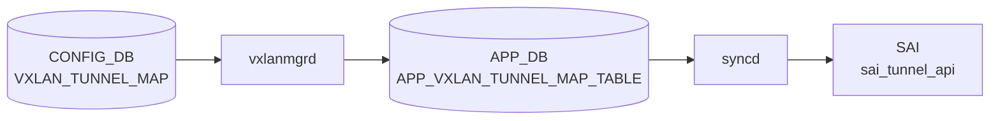

# VXLAN_TUNNEL_MAP テーブル

## 概要

[VXLAN](../../reference/glossary.md#term-vxlan) tunnel に対し、ローカル [VLAN](../../reference/glossary.md#term-vlan) と VNI ([VXLAN](../../reference/glossary.md#term-vxlan) Network Identifier) のマッピングを与える[^1]。`orchagent` の `VxlanTunnelMapOrch` がこのテーブルを購読し、[SAI](../../reference/glossary.md#term-sai) tunnel-map (`SAI_TUNNEL_MAP_TYPE_VLAN_ID_TO_VNI` / `SAI_TUNNEL_MAP_TYPE_VNI_TO_VLAN_ID`) のエントリを生成する。

<!-- cdb-mermaid -->
### データフロー (自動生成)



!!! note "凡例"
    CONFIG_DB から SAI までの典型経路を `docs/reference/config-db-orch-map.md` から機械生成したミニ図。詳細・例外は本ページ本文と対応表を参照。
<!-- /cdb-mermaid -->

## key 構造

```text
VXLAN_TUNNEL_MAP|<tunnel_name>|<map_name>
```

`<tunnel_name>` は `VXLAN_TUNNEL.name` への leafref、`<map_name>` はユーザ任意。

## フィールド一覧

| フィールド | 型 | 必須 | 説明 |
|-----------|----|------|------|
| `name` (key) | leafref `VXLAN_TUNNEL.name` | ✅ | 親トンネル |
| `mapname` (key) | string | ✅ | マッピング名（任意ラベル） |
| `vlan` | string `Vlan<id>` (パターン) | ✅ | 対応 [VLAN](../../reference/glossary.md#term-vlan) |
| `vni` | `vnid_type` (uint32 0..2^24-1) | ✅ | VNI |

備考: `vlan` 本来は `VLAN.name` への leafref が望ましいが、libyang の back-link 問題により暫定的に文字列パターン化されている (`sonic-vxlan.yang` のコメント参照)。

## 購読者

- `orchagent` `VxlanTunnelMapOrch`: [SAI](../../reference/glossary.md#term-sai) tunnel-map エントリ生成
- [EVPN](../../reference/glossary.md#term-evpn) フローでは `VxlanMgr` がここから [VLAN](../../reference/glossary.md#term-vlan)-VNI を引き、type-2/3 経路と紐付ける

## 関連 CONFIG_DB / YANG / CLI

- 関連 [CONFIG_DB](../../reference/glossary.md#term-config_db): `VXLAN_TUNNEL`、`VLAN`、`VLAN_INTERFACE`、`VNET`
- 関連 CLI: [`config vxlan`](../cli/config-vxlan.md) (`map add` / `map del`)
- 関連 [YANG](../../reference/glossary.md#term-yang): `sonic-vxlan`

<!-- value-behavior -->
## 値依存挙動マトリクス

| フィールド | 値 | 実挙動 |
|-----------|-----|--------|
| `vlan` | `Vlan<id>` 形式 | YANG pattern で検証。SAI tunnel-map に `SAI_TUNNEL_MAP_TYPE_VLAN_ID_TO_VNI` / `_TO_VLAN_ID` エントリを生成 |
| `vlan` | `Vlan` プレフィクスなし | YANG pattern 違反で reject |
| `vlan` | 既にマップ済みの VLAN | `vxlanmgr` が `"Vlan %s already mapped. Map Create failed"` でエラーして破棄 (vxlanmgr.cpp) |
| `vni` | 有効な VNI | VLAN と VNI を紐付け。EVPN type-2/3 経路と紐付く |
| `vni` | 既にマップ済みの VNI | `vxlanmgr` が重複エラーで破棄 |
| `vni` | `0` | 予約済み値。使用不可（`vnid_type` 型は 1 以上が実質有効）|

<!-- /value-behavior -->

## 例外条件・特殊挙動 <!-- cdb-exceptions -->

<!-- evidence: sonic-swss/cfgmgr/vxlanmgr.cpp; sonic-buildimage/src/sonic-yang-models/yang-models/sonic-vxlan.yang -->

- **`vlan` 必須 (YANG)**: `mandatory true`、`pattern 'Vlan([0-9]{1,3}|...)'` — パターン違反は YANG で reject される[^exc2]。
- **`vni` 必須 (YANG)**: `mandatory true`[^exc2]。
- **VLAN leafref 無効化 (既知制限)**: libyang の back-link 問題のため VLAN の `leafref` はコメントアウトされ、文字列パターンのみで検証される（`sonic-vlan.yang` との整合性チェックなし）[^exc2]。
- **VLAN 重複マッピング禁止**: 同じ `vlan` が既にマップされている場合 `SWSS_LOG_ERROR("Vlan %s already mapped. Map Create failed")` を記録して破棄[^exc1]。
- **VNI 重複マッピング禁止**: 同じ `vni` が既にマップされている場合も同様に破棄[^exc1]。
- **マップキー重複**: キャッシュに同名マップが存在する場合 `SWSS_LOG_ERROR("Map already present")` で破棄[^exc1]。
- **参照トンネル未 active**: `VXLAN_TUNNEL` が active でない場合リトライ待ち[^exc1]。

[^exc1]: `sonic-swss/cfgmgr/vxlanmgr.cpp` <https://github.com/sonic-net/sonic-swss/blob/master/cfgmgr/vxlanmgr.cpp>
[^exc2]: `sonic-buildimage/src/sonic-yang-models/yang-models/sonic-vxlan.yang` <https://github.com/sonic-net/sonic-buildimage/blob/master/src/sonic-yang-models/yang-models/sonic-vxlan.yang>

<!-- ref-triangle:start -->

## 関連リファレンス

- [YANG](../../reference/glossary.md#term-yang): [`sonic-vxlan`](../yang/sonic-vxlan.md)
- CLI: [`config vxlan`](../cli/config-vxlan.md)

<!-- ref-triangle:end -->

## 引用元

[^1]: [YANG](../../reference/glossary.md#term-yang) 定義: `sonic-vxlan.yang` 内 `VXLAN_TUNNEL_MAP`. <https://github.com/sonic-net/sonic-buildimage/blob/9ea932ec2e18f35e58268ec2e4456b1d4afd65cd/src/sonic-yang-models/yang-models/sonic-vxlan.yang#L66>

## 関連ページ
- [HLD: VXLAN / VNet 全体設計](../../overlay/vxlan-sonic.md)
- [CLI: config vxlan](../cli/config-vxlan.md)
- [CONFIG_DB: VXLAN_TUNNEL](vxlan-tunnel.md)
- [YANG: sonic-vxlan](../yang/sonic-vxlan.md)

<!-- ops-hint -->
## 運用ヒント

### 典型値

- key 形式: `VXLAN_TUNNEL_MAP|<tunnel>|<map-name>` (例 `tunnel1|map_1000_Vlan100`)。
- `vni`: L2 VNI (例 1000)。
- `vlan`: `Vlan100`。

### よくある誤設定

- VLAN 未作成のまま VNI map を入れると [orchagent](../../reference/glossary.md#term-orchagent) が pending、トンネルが半開状態。

### 確認コマンド

```bash
sonic-db-cli CONFIG_DB keys 'VXLAN_TUNNEL_MAP|*'
show vxlan vlanvnimap
```
<!-- /ops-hint -->

<!-- glossary-links-injected: 7111763d84c2 -->
