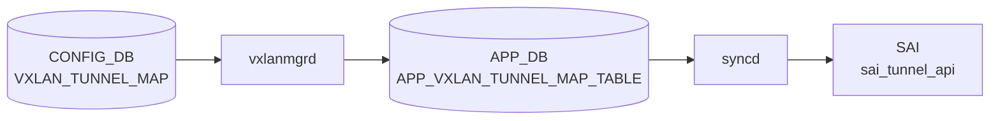

# VXLAN_TUNNEL_MAP テーブル

## 概要

VXLAN tunnel に対し、ローカル VLAN と VNI (VXLAN Network Identifier) のマッピングを与える[^1]。`orchagent` の `VxlanTunnelMapOrch` がこのテーブルを購読し、SAI tunnel-map (`SAI_TUNNEL_MAP_TYPE_VLAN_ID_TO_VNI` / `SAI_TUNNEL_MAP_TYPE_VNI_TO_VLAN_ID`) のエントリを生成する。

<!-- cdb-mermaid -->
### データフロー (自動生成)



!!! note "凡例"
    CONFIG_DB から SAI までの典型経路を `docs/reference/config-db-orch-map.md` から機械生成したミニ図。詳細・例外は本ページ本文と対応表を参照。
<!-- /cdb-mermaid -->

## key 構造

```
VXLAN_TUNNEL_MAP|<tunnel_name>|<map_name>
```

`<tunnel_name>` は `VXLAN_TUNNEL.name` への leafref、`<map_name>` はユーザ任意。

## フィールド一覧

| フィールド | 型 | 必須 | 説明 |
|-----------|----|------|------|
| `name` (key) | leafref `VXLAN_TUNNEL.name` | ✅ | 親トンネル |
| `mapname` (key) | string | ✅ | マッピング名（任意ラベル） |
| `vlan` | string `Vlan<id>` (パターン) | ✅ | 対応 VLAN |
| `vni` | `vnid_type` (uint32 0..2^24-1) | ✅ | VNI |

備考: `vlan` 本来は `VLAN.name` への leafref が望ましいが、libyang の back-link 問題により暫定的に文字列パターン化されている (`sonic-vxlan.yang` のコメント参照)。

## 購読者

- `orchagent` `VxlanTunnelMapOrch`: SAI tunnel-map エントリ生成
- EVPN フローでは `VxlanMgr` がここから VLAN-VNI を引き、type-2/3 経路と紐付ける

## 関連 CONFIG_DB / YANG / CLI

- 関連 CONFIG_DB: `VXLAN_TUNNEL`、`VLAN`、`VLAN_INTERFACE`、`VNET`
- 関連 CLI: [`config vxlan`](../cli/config-vxlan.md) (`map add` / `map del`)
- 関連 YANG: `sonic-vxlan`

<!-- ref-triangle:start -->

## 関連リファレンス

- YANG: [`sonic-vxlan`](../yang/sonic-vxlan.md)
- CLI: [`config vxlan`](../cli/config-vxlan.md)

<!-- ref-triangle:end -->

## 引用元

[^1]: YANG 定義: `sonic-vxlan.yang` 内 `VXLAN_TUNNEL_MAP`. <https://github.com/sonic-net/sonic-buildimage/blob/9ea932ec2e18f35e58268ec2e4456b1d4afd65cd/src/sonic-yang-models/yang-models/sonic-vxlan.yang#L66>

## 関連ページ
- [HLD: VXLAN / VNet 全体設計](../../overlay/vxlan-sonic.md)
- [CLI: config vxlan](../cli/config-vxlan.md)
- [CONFIG_DB: VXLAN_TUNNEL](vxlan-tunnel.md)
- [YANG: sonic-vxlan](../yang/sonic-vxlan.md)
