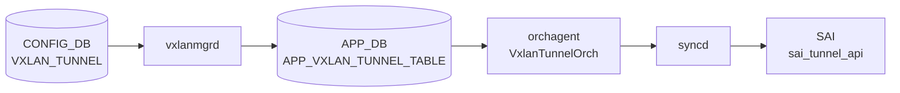

# VXLAN_TUNNEL テーブル

## 概要

[VXLAN](../../reference/glossary.md#term-vxlan) VTEP (Virtual Tunnel End Point) を定義するテーブル。source / destination IP と decap TTL モードを保持する[^1]。`orchagent` の `VxlanOrch` / `VxlanTunnelOrch` が [SAI](../../reference/glossary.md#term-sai) [VXLAN](../../reference/glossary.md#term-vxlan) tunnel と [SAI](../../reference/glossary.md#term-sai) tunnel termination を生成する。[EVPN](../../reference/glossary.md#term-evpn) ベースのオーバーレイでは destination は省略され、`VXLAN_EVPN_NVO` で NVO がバインドされる。

<!-- cdb-mermaid -->
### データフロー (自動生成)



!!! note "凡例"
    CONFIG_DB から SAI までの典型経路を `docs/reference/config-db-orch-map.md` から機械生成したミニ図。詳細・例外は本ページ本文と対応表を参照。
<!-- /cdb-mermaid -->

## key 構造

```text
VXLAN_TUNNEL|<name>
```

[YANG](../../reference/glossary.md#term-yang) `max-elements 2` 制約により最大 2 トンネルまで（実装的に [EVPN](../../reference/glossary.md#term-evpn) 用 1 + 静的 1 を想定）。

## フィールド一覧

| フィールド | 型 | 必須 | 説明 |
|-----------|----|------|------|
| `name` (key) | string | ✅ | トンネル名 |
| `src_ip` | ip-address | - | 自 VTEP IP（origination 用） |
| `dst_ip` | ip-address | - | 対向 VTEP IP（point-to-point の場合） |
| `ttl_mode` | string `uniform`/`pipe` | - | decap 時 TTL モード |

## 関連サブテーブル

- `VXLAN_TUNNEL_MAP` (key: `name`, `mapname`): [VLAN](../../reference/glossary.md#term-vlan) ↔ VNI マッピング
    - `vlan` (string `Vlan<id>`, mandatory)
    - `vni` (`vnid_type`, mandatory)
- `VXLAN_EVPN_NVO` (key: `name`, max-elements 1): [EVPN](../../reference/glossary.md#term-evpn) NVO インスタンス
    - `source_vtep` (leafref `VXLAN_TUNNEL.name`, mandatory)

## 購読者

- `orchagent` `VxlanTunnelOrch` / `VxlanTunnelMapOrch` / `EvpnNvoOrch`: [SAI](../../reference/glossary.md#term-sai) tunnel / tunnel-map / NVO を生成
- `bgpcfgd` (EVPN type-2 / type-3 advertise との連携)

## 関連 CONFIG_DB / YANG / CLI

- 関連 [CONFIG_DB](../../reference/glossary.md#term-config_db): `VXLAN_TUNNEL_MAP`、`VXLAN_EVPN_NVO`、`VLAN`、`VNET`、`VLAN_INTERFACE`
- 関連 CLI: [`config vxlan`](../cli/config-vxlan.md)
- 関連 [YANG](../../reference/glossary.md#term-yang): `sonic-vxlan`

<!-- value-behavior -->
## 値依存挙動マトリクス

| フィールド | 値 | 実挙動 |
|-----------|-----|--------|
| `ttl_mode` | `uniform` | decap 時に outer TTL を inner TTL にコピーして適用 |
| `ttl_mode` | `pipe` | decap 時に inner TTL を保持（outer TTL は無視） |
| `ttl_mode` | その他 | YANG `pattern "uniform\|pipe"` 違反で reject |
| `dst_ip` | 省略 | EVPN 動的学習モード。`ip link add ... type vxlan id <vni> local <src_ip>` の remote オプションなし (vxlanmgr.cpp:1014) |
| `dst_ip` | 明示指定 | P2P 静的トンネル。`ip link add ... remote <dst_ip>` が追加される。EVPN との併用は非推奨 |
| `src_ip` | Loopback0 IP | 推奨構成。リンクダウン影響なし |
| `src_ip` | 物理 IF IP | リンクダウン時に VTEP が消失するため非推奨 |
| エントリ数 | 1〜2 件 | YANG `max-elements 2`。通常 EVPN 用 1 + P2P 用 1 |
| エントリ数 | 3 件以上 | YANG バリデーションで reject |

<!-- /value-behavior -->

## 例外条件・特殊挙動 <!-- cdb-exceptions -->

<!-- evidence: sonic-swss/cfgmgr/vxlanmgr.cpp; sonic-buildimage/src/sonic-yang-models/yang-models/sonic-vxlan.yang -->

- **最大 2 エントリ (YANG)**: `max-elements 2` — 3 エントリ目は YANG バリデーションで reject される[^exc2]。
- **`ttl_mode` パターン (YANG)**: `pattern "uniform|pipe"` — それ以外の値は YANG で reject[^exc2]。
- **`src_ip` / `dst_ip` 型 (YANG)**: `inet:ip-address` 型 — 不正 IP は YANG で reject[^exc2]。
- **削除時の NVO 残留**: tunnel 削除時に NVO エントリが残存していると `SWSS_LOG_WARN("Tunnel %s deletion failed. Need to delete NVO")` を記録してリトライ待ち[^exc1]。
- **削除時のマップ残留**: tunnel map エントリが残存していると `SWSS_LOG_WARN("Need to delete mapping entries")` でリトライ待ち[^exc1]。
- **State テーブル未クリア**: state [VXLAN](../../reference/glossary.md#term-vxlan) tunnel テーブルが空でない場合 `SWSS_LOG_WARN("State VXLAN tunnel table not yet empty.")` を記録してリトライ[^exc1]。
- **Vxlan Net Dev 作成失敗**: `SWSS_LOG_WARN("Vxlan Net Dev creation failure for %s VNI(%s) VLAN(%s)")` を記録[^exc1]。

[^exc1]: `sonic-swss/cfgmgr/vxlanmgr.cpp` <https://github.com/sonic-net/sonic-swss/blob/master/cfgmgr/vxlanmgr.cpp>
[^exc2]: `sonic-buildimage/src/sonic-yang-models/yang-models/sonic-vxlan.yang` <https://github.com/sonic-net/sonic-buildimage/blob/master/src/sonic-yang-models/yang-models/sonic-vxlan.yang>

<!-- ref-triangle:start -->

## 関連リファレンス

- [YANG](../../reference/glossary.md#term-yang): [`sonic-vxlan`](../yang/sonic-vxlan.md)
- CLI: [`config vxlan`](../cli/config-vxlan.md)

<!-- ref-triangle:end -->

## 引用元

[^1]: YANG 定義: `sonic-vxlan.yang`. <https://github.com/sonic-net/sonic-buildimage/blob/9ea932ec2e18f35e58268ec2e4456b1d4afd65cd/src/sonic-yang-models/yang-models/sonic-vxlan.yang>

## 関連ページ
- [HLD: VXLAN / VNet 全体設計](../../overlay/vxlan-sonic.md)
- [CLI: config vxlan](../cli/config-vxlan.md)
- [CONFIG_DB: VXLAN_TUNNEL_MAP](vxlan-tunnel-map.md)
- [YANG: sonic-vxlan](../yang/sonic-vxlan.md)

<!-- ops-hint -->
## 運用ヒント

### 典型値

- key 形式: `VXLAN_TUNNEL|<name>`。
- `src_ip`: 自 Loopback IP（VTEP）。
- `dst_ip`: P2P トンネル先（EVPN 動的の場合は省略）。

### よくある誤設定

- `src_ip` を物理 IF に置くとリンクダウンで VTEP が消える。Loopback0 を使う。
- EVPN 構成で `dst_ip` を静的指定すると EVPN type-3 と競合する。

### 確認コマンド

```bash
sonic-db-cli CONFIG_DB hgetall 'VXLAN_TUNNEL|tunnel1'
show vxlan tunnel
show vxlan remotevtep
```
<!-- /ops-hint -->


<!-- runtime-trace -->
## CDB → 実コンテナ動作トレース

### 段階 1: Consumer 登録

- **orchagent / VxlanOrch**: `VXLAN_TUNNEL` テーブルを `SubscriberStateTable` で購読。

### 段階 2: CFG → APPL 翻訳

- VxlanOrch が VTEP の src_ip / dst_ip を解析し SAI トンネルオブジェクト作成の準備をする。
- APP_DB への書き込みなし。

### 段階 3: APPL → SAI

- VxlanOrch が `sai_tunnel_api->create_tunnel()` で SAI_TUNNEL_TYPE_VXLAN トンネルを作成し OID を保持。

### 段階 4: タイミング + 副作用

- トンネル作成は orchagent 処理後数 ms 以内。アンダーレイルートがない場合はトンネルが inactive。
- 副作用: VXLAN_TUNNEL 削除時は TUNNEL_MAP / EVPN_NVO など依存オブジェクトを先に削除する必要あり。

<!-- /runtime-trace -->
<!-- entry-points -->
## 書き込み入り口 (Direction A)

VXLAN_TUNNEL テーブルへの書き込みが発生するコード経路を網羅的に調査した結果。

### CLI

  - `config vxlan add/del ...` — `config/vxlan.py` が `set_entry('VXLAN_TUNNEL', vxlan_name, fvs)` を呼ぶ (sonic-utilities/config/vxlan.py:49, 94)

### minigraph / sonic-cfggen

minigraph.py に VXLAN_TUNNEL 生成なし

### REST / gNMI

REST/gNMI 書き込み経路なし

### db_migrator

db_migrator.py での VXLAN_TUNNEL マイグレーションなし

### ビルド時デフォルト (build-time default)

なし

### ハードコードデフォルト / ランタイム注入

なし

### 死活・デッドコード

なし
<!-- /entry-points -->

<!-- defaults -->
## コード由来の暗黙デフォルト (Phase A)

| フィールド | 省略/条件 | 実挙動 | 分類 | 根拠 |
|-----------|---------|--------|------|------|
| `ttl_mode` | 省略 | `SAI_TUNNEL_ATTR_DECAP_TTL_MODE` を SAI に渡さない → プラットフォーム実装依存のデフォルトが適用 | プラットフォーム依存 silent default | `vxlanorch.cpp:1617`, `vxlanorch.cpp:372-383` |
| `dst_ip` | 省略 | IPv4 なら `0.0.0.0`、IPv6 なら `::` に置換。`SAI_TUNNEL_PEER_MODE_P2MP` で SAI トンネルを生成 | 暗黙フォールバック | `vxlanorch.cpp:1598-1606`, `vxlanorch.cpp:356-370` |
| `src_ip` | CONFIG_DB に書かれない (直接 DB 書き込み) | vxlanmgrd 内部キャッシュの `m_sourceIp` が `"NULL"` のまま。`isTunnelActive()` が false を返し、後続の `VXLAN_TUNNEL_MAP` 処理が永続サスペンド | dead-consumer / silent drop | `vxlanmgr.cpp:1318`, `vxlanmgr.cpp:420-421` |
| `encap_ttl` | CONFIG_DB / YANG に存在しないフィールド | 呼び出し元が常に `encap_ttl=0` を渡すため `SAI_TUNNEL_ATTR_ENCAP_TTL_VAL` 属性は SAI に設定されない | YANG 未定義 dead field | `vxlanorch.cpp:885-907` |
| UDP dstport | 設定フィールドなし | カーネル netdevice 作成時に `dstport 4789` をハードコード | ハードコード | `vxlanmgr.cpp:67` |
| FDB learning | 設定フィールドなし | `createVxlanNetdevice()` は常に `nolearning` フラグ付きで netdevice を作成。EVPN NVO 登録後は `bridge link set dev ... learning off` も追加 | ハードコード | `vxlanmgr.cpp:1015`, `vxlanmgr.cpp:1046-1049` |
| CLI 書き込み | `config vxlan add` | `src_ip` のみ書き込む。`dst_ip`・`ttl_mode` は常に省略 → 上記フォールバックが適用 | 書込み元依存 | `sonic-utilities/config/vxlan.py:47` |
| 書込み順 | MAP が TUNNEL より先に書かれた場合 | `isTunnelActive()` が false → MAP 処理がサスペンド。TUNNEL 書き込み後も vxlanmgrd がリトライするまで適用されない | 書込み順依存 | `vxlanmgr.cpp:530-535` |

### 追記: YANG-実装 二重バリデーション

`ttl_mode` は YANG `pattern "uniform|pipe"` でバリデーションされるが、orchagent も独自に文字列比較して無効値を `SWSS_LOG_ERROR` で排除する (`vxlanorch.cpp:1629-1633`)。管理面バイパス (直接 Redis 書き込み) では YANG チェックを回避するため orchagent 側のみが有効になる。

<!-- /defaults -->

<!-- pubsub -->
## 通信メカニズム (Phase G)

### Redis 購読方式

`VXLAN_TUNNEL` テーブルの変更は **vxlanmgrd → orchagent** の 2 段階パイプラインで処理される。

**段階 1 — vxlanmgrd が CONFIG_DB を購読**

`vxlanmgrd` は `Orch` 基底クラスの `addConsumer()` 経由で CONFIG_DB の `VXLAN_TUNNEL`（`CFG_VXLAN_TUNNEL_TABLE_NAME`）を購読する。CONFIG_DB のため `Orch::addConsumer()` は `swss::SubscriberStateTable`（Redis keyspace 通知 `__keyspace@4__:VXLAN_TUNNEL|*` への PSUBSCRIBE）を割り当てる (`vxlanmgrd.cpp:48-57`)。

**段階 2 — orchagent が APP_DB を購読**

`orchagent` の `VxlanTunnelOrch` は `Orch2` 基底クラスで APP_DB の `VXLAN_TUNNEL_TABLE`（`APP_VXLAN_TUNNEL_TABLE_NAME`）を購読する。APP_DB のため `Orch::addConsumer()` は `swss::ConsumerStateTable`（PUBLISH/SUBSCRIBE channel ベース）を割り当てる (`orchdaemon.cpp:350-351`)。

| 購読者 | 購読 API | 購読テーブル | バッチ |
|--------|---------|--------------|--------|
| `vxlanmgrd` (`VxlanMgr`) | `SubscriberStateTable` (keyspace) | `VXLAN_TUNNEL` (CONFIG_DB) | `DEFAULT_POP_BATCH_SIZE` (128) |
| `orchagent` (`VxlanTunnelOrch`) | `ConsumerStateTable` (channel) | `VXLAN_TUNNEL_TABLE` (APP_DB) | `gBatchSize` (CLI `-b` 引数) |

### keyspace 通知 → ハンドラ呼び出しの流れ

```
CLI: config vxlan add <name> <src_ip>
  ↓ sonic-utilities/config/vxlan.py:49
  Table::set("VXLAN_TUNNEL|<name>", {src_ip: <ip>})
CONFIG_DB: HSET "VXLAN_TUNNEL|<name>" src_ip <ip>
  ↓ Redis keyspace event "__keyspace@4__:VXLAN_TUNNEL|<name>" "hset"
vxlanmgrd: SubscriberStateTable::pops() → HGETALL
  ↓ VxlanMgr::doTask(consumer) [vxlanmgr.cpp:214-260]
    CFG_VXLAN_TUNNEL_TABLE_NAME → doVxlanTunnelCreateTask()
  ↓ ip link add ... type vxlan + m_appVxlanTunnelTable.set(...)
APP_DB: HSET "VXLAN_TUNNEL_TABLE|<name>" src_ip <ip>  + PUBLISH channel
  ↓ ConsumerStateTable channel notification
orchagent: VxlanTunnelOrch::addOperation(request) [vxlanorch.cpp:1591]
  ↓ vxlan_tunnel_table_[name] = new VxlanTunnel(...)
  ↓ create_tunnel() [vxlanorch.cpp:291]
SAI: sai_tunnel_api->create_tunnel(&tunnel_id, ...) [vxlanorch.cpp:397]
     sai_tunnel_api->create_tunnel_term_table_entry(...) [vxlanorch.cpp:482]
```

- `SELECT_TIMEOUT = 1000 ms` (`orchdaemon.cpp:22-23`)。keyspace 通知到着で即座に wake up し、タイムアウト前に処理。
- `VxlanTunnelOrch::addOperation()` が `VxlanTunnel` オブジェクトを生成し、NVO/マップ登録時に `SAI_TUNNEL_TYPE_VXLAN` トンネルを作成する。削除時は NVO・MAP が先に消えていないと `delOperation()` が `false` を返しリトライキューに積まれる (`vxlanorch.cpp:1648-1672`)。

### gDirectory を介した Orch 間連携 (Observer 代替)

`VxlanTunnelOrch` は伝統的な `attach()`/`notify()` Observer インタフェースを持たず、`gDirectory` グローバルレジストリ経由で他 Orch が直接参照を取得する。

| 呼び出し元 | 呼び出し先 | 契機 |
|-----------|-----------|------|
| `VxlanTunnelOrch` | `EvpnNvoOrch` (`gDirectory.get`) | `addTunnelUser()` / `delTunnelUser()` 時にリモート VTEP 処理 (`vxlanorch.cpp:1678,1733,1795`) |
| `VxlanTunnelMapOrch` | `VxlanTunnelOrch` (`gDirectory.get`) | MAP addOperation 時にトンネル存在確認 + OID 取得 (`vxlanorch.cpp:2046`) |
| `VxlanVrfMapOrch` | `VxlanTunnelOrch` + `VxlanTunnelMapOrch` | VRF-VNI マッピング生成 (`vxlanorch.cpp:2260-2261`) |

### STATE_DB フィードバックパス

`VxlanTunnelOrch` は `addRemoveStateTableEntry()` で `STATE_DB` の `STATE_VXLAN_TUNNEL_TABLE_NAME` にトンネル稼働状態を書き戻す (`vxlanorch.cpp:1913-1955`)。`vxlanmgrd` も `m_stateVxlanTunnelTable` (STATE_DB) を参照して tunnel が active かを確認し（`vxlanmgr.cpp:196`）、削除時に STATE テーブルが空でないと `SWSS_LOG_WARN` + リトライする。これは監視フィードバックパスであり、双方向 pub/sub ではない。

### サービス再起動トリガー

なし。`VxlanTunnelOrch` は orchagent 内インメモリハンドラであり、`VXLAN_TUNNEL` の追加・削除は `sai_tunnel_api->create_tunnel()` / `remove_tunnel()` のライブ SAI 操作で反映される。プロセス再起動・サービス restart を伴わない。`vxlanmgrd` 側も netlink（`ip link add/del`）のライブ操作のみ。

> **Evidence**: `sonic-swss/orchagent/orchdaemon.cpp:22-23,350-351,573` (SELECT_TIMEOUT / VxlanTunnelOrch 生成)、`sonic-swss/orchagent/vxlanorch.cpp:1245-1308,1591-1672,291-400,1678,1733` (Orch2 コンストラクタ / addOperation / create_tunnel / EvpnNvoOrch 連携)、`sonic-swss/cfgmgr/vxlanmgrd.cpp:44-58` (CFG_VXLAN_TUNNEL_TABLE_NAME 購読)、`sonic-swss/cfgmgr/vxlanmgr.cpp:183-260` (VxlanMgr::doTask ディスパッチ); 詳細分析 `meta/_intermediate/cdb-flow/vxlan-tunnel-pubsub.md`
<!-- /pubsub -->

<!-- platform -->
## プラットフォーム差異

SONiC の VXLAN トンネル実装は、ASIC の SAI ケーパビリティによって動作モードが分岐する。

### EVPN 対応 ASIC: P2MP vs P2P トンネルモード

`VxlanTunnelOrch` 初期化時に `sai_query_attribute_enum_values_capability()` で ASIC の tunnel peer mode サポートを問い合わせる (vxlanorch.cpp:1256-1274)。

| 条件 | 動作モード |
|------|-----------|
| SAI クエリ失敗（ドライバ未対応など） | P2P (DIP tunnel) モードに自動 fallback |
| `SAI_TUNNEL_PEER_MODE_P2P` が返される | DIP トンネルサポートあり (P2P モード) |
| P2MP のみが返される | P2MP モード (`is_dip_tunnel_supported = false`) |

### DIP (Destination IP) トンネル差異

**DIP サポートあり（P2P モード）**: EVPN リモート VTEP ごとに個別の P2P DIP トンネルを動的生成する (`createDynamicDIPTunnel()`)。SAI トンネルは `SAI_TUNNEL_PEER_MODE_P2P` + `SAI_TUNNEL_ATTR_ENCAP_DST_IP` で生成。FDB エントリを DIP トンネルポート単位で管理する (vxlanorch.cpp:1701-1724)。

**DIP サポートなし（P2MP モード）**: DIP トンネルを作成しない。単一の P2MP SIP トンネルブリッジポートを使い回し、IMET ルートの L2MC グループメンバーとして実現する。`addTunnelUser()` はリモート VTEP の IP 参照カウントのみを更新する (vxlanorch.cpp:1701-1704)。

### SIP トンネル遅延削除

EVPN シナリオでは SIP トンネル HW の削除が DIP 参照カウントに依存する。DIP トンネルが残存している間は `del_tnl_hw_pending` フラグで削除を延期し、DIP カウントが 0 になった後に `deletePendingSIPTunnel()` が HW を削除する (vxlanorch.cpp:955-964)。P2MP モードでは DIP カウントが常に 0 のため即時削除可能。

### P2P vs P2MP の SAI 作成差

EVPN 動的 DIP トンネル (`TNL_CREATION_SRC_EVPN`, dst_ip 非ゼロ) は `SAI_TUNNEL_PEER_MODE_P2P` で作成される。一方 CLI 経由の静的トンネル (`TNL_CREATION_SRC_CLI`) は dst_ip の有無によらず `SAI_TUNNEL_PEER_MODE_P2MP` で作成される (vxlanorch.cpp:899-907)。

### SmartSwitch / DPU

`vxlanorch.cpp` に SmartSwitch DPU 固有の分岐コードは存在しない。現実装は NPU 通常モードのみを対象とし、DPU 側 VXLAN 処理は別スタックが担当する。

<!-- /platform -->

<!-- constants -->
## ハードコード定数 (Phase E)

ソース: `sonic-swss/orchagent/vxlanorch.cpp`, `sonic-swss/orchagent/vxlanorch.h`, `sonic-swss/cfgmgr/vxlanmgr.cpp`

### UDP デスティネーションポート

| 定数 | 値 | 根拠 |
|------|----|------|
| VXLAN UDP dstport | **4789** | `vxlanmgr.cpp:67` `vxlanmgr.cpp:1015` — `ip link add ... dstport 4789` にハードコード |

IANA 標準ポート (RFC 7348)。CONFIG_DB に設定フィールドなし・変更不可。

### SAI tunnel_type enum

| シンボル | 用途 |
|---------|------|
| `SAI_TUNNEL_TYPE_VXLAN` | `SAI_TUNNEL_ATTR_TYPE` に常時セット (`vxlanorch.cpp:304`) |
| `SAI_TUNNEL_TERM_TABLE_ENTRY_TYPE_P2MP` | `dst_ip` 省略時の termination エントリ型 (`vxlanorch.cpp:451`) |
| `SAI_TUNNEL_TERM_TABLE_ENTRY_TYPE_P2P` | `dst_ip` 明示時の termination エントリ型 (`vxlanorch.cpp:457`) |

### SAI tunnel_attr セット一覧

| SAI 属性 | 設定条件 | 値 |
|---------|---------|-----|
| `SAI_TUNNEL_ATTR_TYPE` | 常時 | `SAI_TUNNEL_TYPE_VXLAN` |
| `SAI_TUNNEL_ATTR_UNDERLAY_INTERFACE` | 常時 | `gUnderlayIfId` (アンダーレイ RIF OID) |
| `SAI_TUNNEL_ATTR_DECAP_MAPPERS` | 常時 | decap mapper OID リスト |
| `SAI_TUNNEL_ATTR_ENCAP_MAPPERS` | 常時 | encap mapper OID リスト |
| `SAI_TUNNEL_ATTR_ENCAP_SRC_IP` | `src_ip` あり | src VTEP IP |
| `SAI_TUNNEL_ATTR_PEER_MODE` | 常時 | `P2P` (dst_ip あり) / `P2MP` (dst_ip なし) |
| `SAI_TUNNEL_ATTR_ENCAP_DST_IP` | `dst_ip` あり | dst VTEP IP |
| `SAI_TUNNEL_ATTR_DECAP_TTL_MODE` | `ttl_mode=pipe` | `SAI_TUNNEL_TTL_MODE_PIPE_MODEL` |
| `SAI_TUNNEL_ATTR_DECAP_TTL_MODE` | `ttl_mode=uniform` | `SAI_TUNNEL_TTL_MODE_UNIFORM_MODEL` |
| `SAI_TUNNEL_ATTR_ENCAP_TTL_MODE` | `encap_ttl != 0` | `SAI_TUNNEL_TTL_MODE_PIPE_MODEL` (dead path) |
| `SAI_TUNNEL_ATTR_ENCAP_TTL_VAL` | `encap_ttl != 0` | encap_ttl 値 (dead path) |

### TTL モード enum (VxlanTunnelTTLMode)

```cpp
// vxlanorch.h:142
enum class VxlanTunnelTTLMode {
    NOT_SET,   // デフォルト: SAI に TTL 属性を渡さない → プラットフォーム ASIC 依存
    PIPE,      // ttl_mode="pipe": SAI_TUNNEL_TTL_MODE_PIPE_MODEL
    UNIFORM    // ttl_mode="uniform": SAI_TUNNEL_TTL_MODE_UNIFORM_MODEL
};
```

`ttl_mode` 省略時は `NOT_SET` → `SAI_TUNNEL_ATTR_DECAP_TTL_MODE` は SAI に送られず、プラットフォーム実装のデフォルトが適用される。

### デフォルト encap TTL

```cpp
// vxlanorch.h:49
#define DEFAULT_TUNNEL_ENCAP_TTL 255
```

`createTunnelHw()` のデフォルト引数値は `255` だが、CONFIG_DB / YANG に `encap_ttl` フィールドが存在しないため呼び出し元は常に `encap_ttl=0` を渡す。結果として `SAI_TUNNEL_ATTR_ENCAP_TTL_VAL` は実際には設定されない (dead path)。

### DSCP モード

`SAI_TUNNEL_ATTR_DECAP_DSCP_MODE` / `SAI_TUNNEL_ATTR_ENCAP_DSCP_MODE` は `vxlanorch.cpp` に設定コードなし。DSCP モードは未実装で、プラットフォームデフォルトが適用される。

<!-- /constants -->

<!-- failure -->
## 失敗挙動 (Phase D)

<!-- evidence: sonic-swss/orchagent/vxlanorch.cpp -->

### 1. VRF 未解決 → `return false` (無制限 retry)

`VxlanVrfMapOrch::addOperation()` (`vxlanorch.cpp:2320-2323`) で VNI→VRF マッピング SET 時に参照先 VRF が VRFOrch にまだ登録されていない場合:

```
SWSS_LOG_WARN("Vrf '%s' hasn't been created yet", vrf_name.c_str());
return false;
```

`return false` によりエントリがキューに残り、次回 `doTask()` で再試行される（無制限 retry）。VRF が後から作成されれば自動的に適用される。rollback なし[^fail1]。

### 2. SAI tunnel 作成失敗 → mapper rollback + `active_ = false` で停止

`VxlanTunnel::createTunnelHw()` (`vxlanorch.cpp:912-921`) で `sai_tunnel_api->create_tunnel()` が失敗すると `SAI_NULL_OBJECT_ID` を返す。orchagent は mapper をロールバックし `active_ = false` にセットして `false` を返す:

```
deleteMapperHw(mapper_list, map_src);
ids_.tunnel_id = SAI_NULL_OBJECT_ID;
active_ = false;
return false;
```

`tunnel_obj->isActive()` が false のまま固定され、後続の `VXLAN_TUNNEL_MAP` / `VXLAN_EVPN_NVO` 処理がすべてサスペンドされる。自動 retry なし。DEL + 再 SET でリカバリ[^fail1]。

SAI term table 作成失敗時も同様に tunnel + mapper を全ロールバック (`vxlanorch.cpp:926-937`)。

### 3. 不正 `src_ip` / `dst_ip` アドレスファミリ不一致 → エントリ破棄 (drop)

`VxlanTunnelOrch::addOperation()` (`vxlanorch.cpp:1610-1614`) で src_ip と dst_ip のアドレスファミリ（IPv4/IPv6）が一致しない場合:

```
SWSS_LOG_ERROR("Format mismatch: 'src_ip' and 'dst_ip' must be of the same family");
return true;
```

`return true` でエントリをキューから破棄する。トンネルオブジェクトは作成されない。retry なし。CONFIG_DB のエントリは残存する（YANG バリデーション回避時のみ発生）[^fail1]。

`ttl_mode` の不正値 (`vxlanorch.cpp:1631`) も同様に `return true` で破棄。

### 4. DEL 時に依存オブジェクト残存 → retry 待ち

`VXLAN_TUNNEL` DEL 時に `VXLAN_EVPN_NVO` / `VXLAN_TUNNEL_MAP` / state テーブルエントリが残存している場合、`delOperation()` が `false` を返しキューに残る。cfgmgr 側でも WARN ログを記録してリトライ待ちとなる[^exc1]。

適切な削除順序: `VXLAN_TUNNEL_MAP` → `VXLAN_EVPN_NVO` → `VXLAN_TUNNEL`。

### retry パターンサマリ

| ケース | 挙動 | 自動復旧 |
|--------|------|----------|
| VRF 未解決 | `return false` → 無制限 retry | VRF 作成後に自動復旧 |
| SAI tunnel 作成失敗 | mapper rollback + `active_=false` | 手動 DEL + 再 SET 必要 |
| src/dst_ip ファミリ不一致・不正 ttl_mode | `return true` エントリ破棄 | なし |
| DEL 時依存オブジェクト残存 | `return false` → retry 待ち | 依存 DEL 後に自動復旧 |
| SAI term table 作成失敗 | tunnel/mapper 全 rollback + `false` | 手動 DEL + 再 SET 必要 |

[^fail1]: `sonic-swss/orchagent/vxlanorch.cpp` <https://github.com/sonic-net/sonic-swss/blob/master/orchagent/vxlanorch.cpp>

<!-- /failure -->

<!-- ordering -->
## 書込み順依存・タイミング依存 (Phase B)

<!-- evidence: sonic-swss/orchagent/vxlanorch.cpp -->

### 1. VXLAN_TUNNEL が MAP/NVO より先行必須

`VxlanTunnelOrch::addOperation()` (vxlanorch.cpp:1591) は `VXLAN_TUNNEL` 受信時に **SAI トンネルオブジェクトを作成しない**。`vxlan_tunnel_table_` にメモリオブジェクトを登録するだけであり、SAI HW 作成は `VXLAN_TUNNEL_MAP` 初回エントリ受信時 (vxlanorch.cpp:2063) または `VXLAN_EVPN_NVO` / VRF マップ受信時 (vxlanorch.cpp:2292) にトリガーされる。`VXLAN_TUNNEL` が存在しない状態で MAP を書くと `getVxlanTunnel()` がヌルを返す。

### 2. SAI 作成順序: tunnel_map → tunnel → tunnel_term

`createTunnelHw()` (vxlanorch.cpp:885) 内部では以下の順で SAI オブジェクトを生成する:

1. `createMapperHw()` — `sai_tunnel_api->create_tunnel_map()` (encap/decap mapper × VLAN/VRF/Bridge)
2. `create_tunnel()` — `sai_tunnel_api->create_tunnel()` (mapper OID を `SAI_TUNNEL_ATTR_DECAP_MAPPERS`/`SAI_TUNNEL_ATTR_ENCAP_MAPPERS` に渡す)
3. `create_tunnel_termination()` — `sai_tunnel_api->create_tunnel_term_table_entry()` (with_term=true 時のみ)

`create_tunnel()` 失敗時は `deleteMapperHw()` でマッパーをロールバックし `active_=false` にリセット (vxlanorch.cpp:913-921)。`create_tunnel_termination()` 失敗時は `remove_tunnel()` → `deleteMapperHw()` で全段ロールバック (vxlanorch.cpp:927-936)。

### 3. VRF が VRF マップより先行必須

`VxlanVrfMapOrch::addOperation()` (vxlanorch.cpp:2290) は `vrf_orch->isVRFexists(vrf_name)` をチェックし、VRF 未作成なら `SWSS_LOG_WARN("Vrf '%s' hasn't been created yet")` → `return false` (vxlanorch.cpp:2315-2316)。`return false` は orchagent がエントリをキューに戻して**再処理する**設計だが、VRF 作成まで SAI への VNI→VRF マッピングが未設定のままとなる。

### 4. EVPN_NVO は source_vtep 参照先の VXLAN_TUNNEL が先行必須

`EvpnNvoOrch::addOperation()` (vxlanorch.cpp:2775) は `tunnel_orch->getVxlanTunnel(vtep_name)` で参照先 VTEP を取得し `source_vtep_ptr` に格納する。VTEP が存在しない場合 null が入り、後続の `addTunnelUser()` (vxlanorch.cpp:1685) で `SWSS_LOG_WARN("Unable to find EVPN VTEP")` → `return false` となる。

### 5. VTEP isActive() — MAP 1 件後に EVPN remote を追加

`addTunnelUser()` (vxlanorch.cpp:1694) は `vtep_ptr->isActive()` を確認し、false なら `SWSS_LOG_WARN("VTEP not yet active")` → `return false`。`isActive()` は `createTunnelHw()` 完了後に `active_=true` (vxlanorch.cpp:939) にセットされる。EVPN remote VTEP 設定は `VXLAN_TUNNEL_MAP` 1 件書き込み（= HW 作成トリガー）の後に行う。

### 6. 削除は追加の逆順

DIP トンネル（動的 EVPN remote）が残存している間は SIP トンネルの HW 削除が保留 (`del_tnl_hw_pending` フラグ)。`EvpnNvoOrch::delOperation()` (vxlanorch.cpp:2803) は `del_tnl_hw_pending=true` の場合 `return false` でリトライ待ちになる。

**推奨 CONFIG_DB 書込み順序**:

```
追加:
  1. VRF テーブルエントリ（EVPN L3VNI が必要な場合）
  2. VXLAN_TUNNEL|<name>          ← SAI 未作成・メモリ登録のみ
  3. VXLAN_TUNNEL_MAP|<name>|<map>  ← 初回 MAP で SAI HW 作成がトリガー
  4. VXLAN_EVPN_NVO|<name>        ← source_vtep は step 2 で存在必須
  5. EVPN remote VTEP 設定        ← VTEP active (step 3 完了) 後

削除（逆順）:
  5. EVPN remote VTEP 削除
  4. VXLAN_EVPN_NVO 削除
  3. VXLAN_TUNNEL_MAP 全削除
  2. VXLAN_TUNNEL 削除
  1. VRF 削除
```

<!-- /ordering -->

<!-- side-effects -->
## 副次 DB 書込 (Phase F)

<!-- evidence: sonic-swss/orchagent/vxlanorch.cpp; sonic-swss/cfgmgr/vxlanmgr.cpp -->

### APPL_DB — APP_VXLAN_TUNNEL_TABLE

| 操作 | トリガ | 書込経路 |
|------|-------|---------|
| SET | CONFIG_DB に `VXLAN_TUNNEL` エントリが作成される | `vxlanmgrd` の `doVxlanTunnelCreateTask()` が `m_appVxlanTunnelTable.set(name, fvs)` を呼ぶ (`vxlanmgr.cpp:432`) |
| DEL | CONFIG_DB から `VXLAN_TUNNEL` エントリが削除され NVO / MAP 参照がゼロになる | `doVxlanTunnelDeleteTask()` が `m_appVxlanTunnelTable.del(name)` を呼ぶ (`vxlanmgr.cpp:463`) |

書き込まれるフィールド: CONFIG_DB フィールドをそのまま転送 (`kfvFieldsValues(t)` を渡す)。

### STATE_DB — STATE_VXLAN_TUNNEL_TABLE

| 操作 | トリガ | 書込フィールド |
|------|-------|--------------|
| SET (初回登録) | `VxlanTunnelOrch` が SAI トンネル生成直後 `addRemoveStateTableEntry(add=true)` | `src_ip`, `dst_ip`, `tnl_src`(`CLI`\|`EVPN`), `operstatus=down` (`vxlanorch.cpp:1930–1943`) |
| SET (oper 更新) | SAI port oper status 変化イベント `updateDbTunnelOperStatus()` | `operstatus=up`\|`down` (`vxlanorch.cpp:1910`) |
| DEL | `addRemoveStateTableEntry(add=false)` — トンネル削除時 | — (`vxlanorch.cpp:1953`) |

!!! note "ウォームブート例外"
    `WarmStart::INITIALIZED` 状態かつ既に STATE_DB にエントリが存在する場合は SET をスキップし既存エントリを保持する (`vxlanorch.cpp:1927-1948`)。

### ASIC_DB — SAI tunnel オブジェクト (syncd 経由)

| SAI API 呼び出し | 生成オブジェクト |
|----------------|--------------|
| `sai_tunnel_api->create_tunnel()` | `SAI_OBJECT_TYPE_TUNNEL` (VXLAN) (`vxlanorch.cpp:397`) |
| `sai_tunnel_api->create_tunnel_term_table_entry()` | `SAI_OBJECT_TYPE_TUNNEL_TERM_TABLE_ENTRY` (`vxlanorch.cpp:482`) |
| `sai_tunnel_api->create_tunnel_map()` | `SAI_OBJECT_TYPE_TUNNEL_MAP` (VNI↔VLAN 等) (`vxlanorch.cpp:141`) |
| `sai_tunnel_api->create_tunnel_map_entry()` | `SAI_OBJECT_TYPE_TUNNEL_MAP_ENTRY` (`vxlanorch.cpp:211`) |

主な SAI 属性: `SAI_TUNNEL_ATTR_TYPE=SAI_TUNNEL_TYPE_VXLAN`、`SAI_TUNNEL_ATTR_PEER_MODE=P2P/P2MP`、`SAI_TUNNEL_ATTR_ENCAP_SRC_IP`、`SAI_TUNNEL_ATTR_DECAP_TTL_MODE`(ttl_mode 指定時のみ)。

### カーネル netlink — VXLAN netdevice

`vxlanmgrd` が SAI 経由ではなく `ip` / `bridge` コマンドでカーネル netlink を直接操作する。

| netlink 操作 | コマンド例 |
|-------------|---------|
| VXLAN netdevice 作成 | `ip link add <name> type vxlan id <vni> local <src_ip> dstport 4789 nolearning` (`vxlanmgr.cpp:56`) |
| FDB learning 無効化 | `bridge link set dev <vxlan> learning off` — EVPN NVO 登録後 (`vxlanmgr.cpp:146`) |
| VXLAN netdevice 削除 | `ip link del dev <name>` (`vxlanmgr.cpp:135`) |

`dstport 4789` と `nolearning` フラグは設定フィールドなしでハードコード付与される。

### COUNTERS_DB — COUNTERS_TUNNEL_NAME_MAP / COUNTERS_TUNNEL_TYPE_MAP

SAI OID が VIDTORID に登録された後、`VxlanTunnelOrch::doTask(timer)` が非同期で `COUNTERS_TUNNEL_NAME_MAP` / `COUNTERS_TUNNEL_TYPE_MAP` に SAI OID を登録する (`vxlanorch.cpp:1328-1329`)。削除時は `hdel()` で除去 (`vxlanorch.cpp:1365-1366`)。

<!-- /side-effects -->

<!-- cross-refs -->
## 暗黙参照テーブル (Phase C)

`orchagent/vxlanorch.cpp` の静的解析から抽出した、`VXLAN_TUNNEL` が暗黙的に依存するテーブル・オブジェクト一覧。

| 参照先テーブル/オブジェクト | 参照種別 | 依存方向 | コード根拠 |
|---------------------------|---------|---------|-----------|
| `VRF` (VRFOrch) | VRF SAI OID 解決 | VXLAN_TUNNEL → VRF | `vxlanorch.cpp:2095,2286,2311` — `VRFOrch::getVRFid(vrf_name)` で VRF OID を取得し SAI tunnel-map entry に設定 |
| `VXLAN_TUNNEL_MAP` | L2 VNI-VLAN マッピング | VXLAN_TUNNEL → VXLAN_TUNNEL_MAP | `vxlanorch.cpp:2110,2120` — tunnel 作成後に `addVlanMappedToVni()` で VLAN-VNI 対応を登録; map 未登録時は tunnel inactive |
| `VXLAN_EVPN_NVO` | VTEP EVPN バインド | VXLAN_TUNNEL → EVPN_NVO | `vxlanorch.cpp:2780-2784` — `EvpnNvoOrch::addOperation()` が `source_vtep` leafref で VXLAN_TUNNEL.name を参照; NVO 残留時はトンネル削除失敗 |
| `VLAN` (PortsOrch) | VLAN OID 検索 | VXLAN_TUNNEL_MAP → VLAN | `vxlanorch.cpp:2030,2145,2483` — `gPortsOrch->getVlanByVlanId(vlan_id)` で VLAN オブジェクトを取得; VLAN 未作成時は `SWSS_LOG_WARN` でスキップ |
| SAI `VNI_TO_VLAN_ID` / `VLAN_ID_TO_VNI` map | SAI トンネルマップ | 内部 | `vxlanorch.cpp:40-54,759-760` — TUNNEL_MAP_T_VLAN 用の encap/decap map pair を SAI に生成 |
| SAI `VNI_TO_VRID` / `VRID_TO_VNI` map | SAI トンネルマップ (L3) | 内部 | `vxlanorch.cpp:42-60,767-768` — TUNNEL_MAP_T_VIRTUAL_ROUTER 用 map pair; VRF-VNI バインド時に有効化 |
| `VxlanVrfMapOrch` (VXLAN_VRF_MAP) | VRF-VNI マッピング登録 | VXLAN_TUNNEL → VRF-VNI | `vxlanorch.cpp:2250-2335` — VRF が存在しない場合は pending; 存在確認は `vrf_orch->isVRFexists()` |

### 依存解決の順序制約

1. `VXLAN_TUNNEL` エントリが先に存在しないと `VXLAN_EVPN_NVO` の `source_vtep` 解決が失敗する (`vxlanorch.cpp:2784`)。
2. `VLAN` が PortsOrch に登録されていないと `VXLAN_TUNNEL_MAP` の VNI-VLAN 紐付けがスキップされる (`vxlanorch.cpp:2030`)。
3. `VRF` が VRFOrch に登録されていないと `VXLAN_VRF_MAP` の addOperation が pending になる (`vxlanorch.cpp:2290`)。
4. EVPN NVO / VLAN MAP の削除より前に `VXLAN_TUNNEL` を削除すると `SWSS_LOG_WARN` + リトライ待ちになる (`vxlanorch.cpp:109,112`)。

<!-- /cross-refs -->
<!-- glossary-links-injected: 7e2e79cf3524 -->
