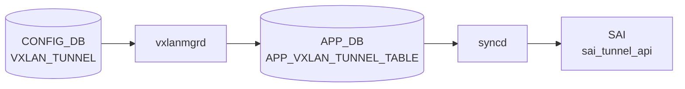

# VXLAN_TUNNEL テーブル

## 概要

[VXLAN](../../reference/glossary.md#term-vxlan) VTEP (Virtual Tunnel End Point) を定義するテーブル。source / destination IP と decap TTL モードを保持する[^1]。`orchagent` の `VxlanOrch` / `VxlanTunnelOrch` が [SAI](../../reference/glossary.md#term-sai) [VXLAN](../../reference/glossary.md#term-vxlan) tunnel と [SAI](../../reference/glossary.md#term-sai) tunnel termination を生成する。[EVPN](../../reference/glossary.md#term-evpn) ベースのオーバーレイでは destination は省略され、`VXLAN_EVPN_NVO` で NVO がバインドされる。

<!-- cdb-mermaid -->
### データフロー (自動生成)



!!! note "凡例"
    CONFIG_DB から SAI までの典型経路を `docs/reference/config-db-orch-map.md` から機械生成したミニ図。詳細・例外は本ページ本文と対応表を参照。
<!-- /cdb-mermaid -->

## key 構造

```text
VXLAN_TUNNEL|<name>
```

[YANG](../../reference/glossary.md#term-yang) `max-elements 2` 制約により最大 2 トンネルまで（実装的に [EVPN](../../reference/glossary.md#term-evpn) 用 1 + 静的 1 を想定）。

## フィールド一覧

| フィールド | 型 | 必須 | 説明 |
|-----------|----|------|------|
| `name` (key) | string | ✅ | トンネル名 |
| `src_ip` | ip-address | - | 自 VTEP IP（origination 用） |
| `dst_ip` | ip-address | - | 対向 VTEP IP（point-to-point の場合） |
| `ttl_mode` | string `uniform`/`pipe` | - | decap 時 TTL モード |

## 関連サブテーブル

- `VXLAN_TUNNEL_MAP` (key: `name`, `mapname`): [VLAN](../../reference/glossary.md#term-vlan) ↔ VNI マッピング
    - `vlan` (string `Vlan<id>`, mandatory)
    - `vni` (`vnid_type`, mandatory)
- `VXLAN_EVPN_NVO` (key: `name`, max-elements 1): [EVPN](../../reference/glossary.md#term-evpn) NVO インスタンス
    - `source_vtep` (leafref `VXLAN_TUNNEL.name`, mandatory)

## 購読者

- `orchagent` `VxlanTunnelOrch` / `VxlanTunnelMapOrch` / `EvpnNvoOrch`: [SAI](../../reference/glossary.md#term-sai) tunnel / tunnel-map / NVO を生成
- `bgpcfgd` (EVPN type-2 / type-3 advertise との連携)

## 関連 CONFIG_DB / YANG / CLI

- 関連 [CONFIG_DB](../../reference/glossary.md#term-config_db): `VXLAN_TUNNEL_MAP`、`VXLAN_EVPN_NVO`、`VLAN`、`VNET`、`VLAN_INTERFACE`
- 関連 CLI: [`config vxlan`](../cli/config-vxlan.md)
- 関連 [YANG](../../reference/glossary.md#term-yang): `sonic-vxlan`

<!-- value-behavior -->
## 値依存挙動マトリクス

| フィールド | 値 | 実挙動 |
|-----------|-----|--------|
| `ttl_mode` | `uniform` | decap 時に outer TTL を inner TTL にコピーして適用 |
| `ttl_mode` | `pipe` | decap 時に inner TTL を保持（outer TTL は無視） |
| `ttl_mode` | その他 | YANG `pattern "uniform\|pipe"` 違反で reject |
| `dst_ip` | 省略 | EVPN 動的学習モード。`ip link add ... type vxlan id <vni> local <src_ip>` の remote オプションなし (vxlanmgr.cpp:1014) |
| `dst_ip` | 明示指定 | P2P 静的トンネル。`ip link add ... remote <dst_ip>` が追加される。EVPN との併用は非推奨 |
| `src_ip` | Loopback0 IP | 推奨構成。リンクダウン影響なし |
| `src_ip` | 物理 IF IP | リンクダウン時に VTEP が消失するため非推奨 |
| エントリ数 | 1〜2 件 | YANG `max-elements 2`。通常 EVPN 用 1 + P2P 用 1 |
| エントリ数 | 3 件以上 | YANG バリデーションで reject |

<!-- /value-behavior -->

## 例外条件・特殊挙動 <!-- cdb-exceptions -->

<!-- evidence: sonic-swss/cfgmgr/vxlanmgr.cpp; sonic-buildimage/src/sonic-yang-models/yang-models/sonic-vxlan.yang -->

- **最大 2 エントリ (YANG)**: `max-elements 2` — 3 エントリ目は YANG バリデーションで reject される[^exc2]。
- **`ttl_mode` パターン (YANG)**: `pattern "uniform|pipe"` — それ以外の値は YANG で reject[^exc2]。
- **`src_ip` / `dst_ip` 型 (YANG)**: `inet:ip-address` 型 — 不正 IP は YANG で reject[^exc2]。
- **削除時の NVO 残留**: tunnel 削除時に NVO エントリが残存していると `SWSS_LOG_WARN("Tunnel %s deletion failed. Need to delete NVO")` を記録してリトライ待ち[^exc1]。
- **削除時のマップ残留**: tunnel map エントリが残存していると `SWSS_LOG_WARN("Need to delete mapping entries")` でリトライ待ち[^exc1]。
- **State テーブル未クリア**: state [VXLAN](../../reference/glossary.md#term-vxlan) tunnel テーブルが空でない場合 `SWSS_LOG_WARN("State VXLAN tunnel table not yet empty.")` を記録してリトライ[^exc1]。
- **Vxlan Net Dev 作成失敗**: `SWSS_LOG_WARN("Vxlan Net Dev creation failure for %s VNI(%s) VLAN(%s)")` を記録[^exc1]。

[^exc1]: `sonic-swss/cfgmgr/vxlanmgr.cpp` <https://github.com/sonic-net/sonic-swss/blob/master/cfgmgr/vxlanmgr.cpp>
[^exc2]: `sonic-buildimage/src/sonic-yang-models/yang-models/sonic-vxlan.yang` <https://github.com/sonic-net/sonic-buildimage/blob/master/src/sonic-yang-models/yang-models/sonic-vxlan.yang>

<!-- ref-triangle:start -->

## 関連リファレンス

- [YANG](../../reference/glossary.md#term-yang): [`sonic-vxlan`](../yang/sonic-vxlan.md)
- CLI: [`config vxlan`](../cli/config-vxlan.md)

<!-- ref-triangle:end -->

## 引用元

[^1]: YANG 定義: `sonic-vxlan.yang`. <https://github.com/sonic-net/sonic-buildimage/blob/9ea932ec2e18f35e58268ec2e4456b1d4afd65cd/src/sonic-yang-models/yang-models/sonic-vxlan.yang>

## 関連ページ
- [HLD: VXLAN / VNet 全体設計](../../overlay/vxlan-sonic.md)
- [CLI: config vxlan](../cli/config-vxlan.md)
- [CONFIG_DB: VXLAN_TUNNEL_MAP](vxlan-tunnel-map.md)
- [YANG: sonic-vxlan](../yang/sonic-vxlan.md)

<!-- ops-hint -->
## 運用ヒント

### 典型値

- key 形式: `VXLAN_TUNNEL|<name>`。
- `src_ip`: 自 Loopback IP（VTEP）。
- `dst_ip`: P2P トンネル先（EVPN 動的の場合は省略）。

### よくある誤設定

- `src_ip` を物理 IF に置くとリンクダウンで VTEP が消える。Loopback0 を使う。
- EVPN 構成で `dst_ip` を静的指定すると EVPN type-3 と競合する。

### 確認コマンド

```bash
sonic-db-cli CONFIG_DB hgetall 'VXLAN_TUNNEL|tunnel1'
show vxlan tunnel
show vxlan remotevtep
```
<!-- /ops-hint -->


<!-- runtime-trace -->
## CDB → 実コンテナ動作トレース

### 段階 1: Consumer 登録

- **orchagent / VxlanOrch**: `VXLAN_TUNNEL` テーブルを `SubscriberStateTable` で購読。

### 段階 2: CFG → APPL 翻訳

- VxlanOrch が VTEP の src_ip / dst_ip を解析し SAI トンネルオブジェクト作成の準備をする。
- APP_DB への書き込みなし。

### 段階 3: APPL → SAI

- VxlanOrch が `sai_tunnel_api->create_tunnel()` で SAI_TUNNEL_TYPE_VXLAN トンネルを作成し OID を保持。

### 段階 4: タイミング + 副作用

- トンネル作成は orchagent 処理後数 ms 以内。アンダーレイルートがない場合はトンネルが inactive。
- 副作用: VXLAN_TUNNEL 削除時は TUNNEL_MAP / EVPN_NVO など依存オブジェクトを先に削除する必要あり。

<!-- /runtime-trace -->
<!-- entry-points -->
## 書き込み入り口 (Direction A)

VXLAN_TUNNEL テーブルへの書き込みが発生するコード経路を網羅的に調査した結果。

### CLI

  - `config vxlan add/del ...` — `config/vxlan.py` が `set_entry('VXLAN_TUNNEL', vxlan_name, fvs)` を呼ぶ (sonic-utilities/config/vxlan.py:49, 94)

### minigraph / sonic-cfggen

minigraph.py に VXLAN_TUNNEL 生成なし

### REST / gNMI

REST/gNMI 書き込み経路なし

### db_migrator

db_migrator.py での VXLAN_TUNNEL マイグレーションなし

### ビルド時デフォルト (build-time default)

なし

### ハードコードデフォルト / ランタイム注入

なし

### 死活・デッドコード

なし
<!-- /entry-points -->

<!-- defaults -->
## コード由来の暗黙デフォルト (Phase A)

| フィールド | 省略/条件 | 実挙動 | 分類 | 根拠 |
|-----------|---------|--------|------|------|
| `ttl_mode` | 省略 | `SAI_TUNNEL_ATTR_DECAP_TTL_MODE` を SAI に渡さない → プラットフォーム実装依存のデフォルトが適用 | プラットフォーム依存 silent default | `vxlanorch.cpp:1617`, `vxlanorch.cpp:372-383` |
| `dst_ip` | 省略 | IPv4 なら `0.0.0.0`、IPv6 なら `::` に置換。`SAI_TUNNEL_PEER_MODE_P2MP` で SAI トンネルを生成 | 暗黙フォールバック | `vxlanorch.cpp:1598-1606`, `vxlanorch.cpp:356-370` |
| `src_ip` | CONFIG_DB に書かれない (直接 DB 書き込み) | vxlanmgrd 内部キャッシュの `m_sourceIp` が `"NULL"` のまま。`isTunnelActive()` が false を返し、後続の `VXLAN_TUNNEL_MAP` 処理が永続サスペンド | dead-consumer / silent drop | `vxlanmgr.cpp:1318`, `vxlanmgr.cpp:420-421` |
| `encap_ttl` | CONFIG_DB / YANG に存在しないフィールド | 呼び出し元が常に `encap_ttl=0` を渡すため `SAI_TUNNEL_ATTR_ENCAP_TTL_VAL` 属性は SAI に設定されない | YANG 未定義 dead field | `vxlanorch.cpp:885-907` |
| UDP dstport | 設定フィールドなし | カーネル netdevice 作成時に `dstport 4789` をハードコード | ハードコード | `vxlanmgr.cpp:67` |
| FDB learning | 設定フィールドなし | `createVxlanNetdevice()` は常に `nolearning` フラグ付きで netdevice を作成。EVPN NVO 登録後は `bridge link set dev ... learning off` も追加 | ハードコード | `vxlanmgr.cpp:1015`, `vxlanmgr.cpp:1046-1049` |
| CLI 書き込み | `config vxlan add` | `src_ip` のみ書き込む。`dst_ip`・`ttl_mode` は常に省略 → 上記フォールバックが適用 | 書込み元依存 | `sonic-utilities/config/vxlan.py:47` |
| 書込み順 | MAP が TUNNEL より先に書かれた場合 | `isTunnelActive()` が false → MAP 処理がサスペンド。TUNNEL 書き込み後も vxlanmgrd がリトライするまで適用されない | 書込み順依存 | `vxlanmgr.cpp:530-535` |

### 追記: YANG-実装 二重バリデーション

`ttl_mode` は YANG `pattern "uniform|pipe"` でバリデーションされるが、orchagent も独自に文字列比較して無効値を `SWSS_LOG_ERROR` で排除する (`vxlanorch.cpp:1629-1633`)。管理面バイパス (直接 Redis 書き込み) では YANG チェックを回避するため orchagent 側のみが有効になる。

<!-- /defaults -->

<!-- pubsub -->
## 通信メカニズム (Phase G)

### Redis 購読方式

`VXLAN_TUNNEL` テーブルの変更は **vxlanmgrd → orchagent** の 2 段階パイプラインで処理される。

**段階 1 — vxlanmgrd が CONFIG_DB を購読**

`vxlanmgrd` は `Orch` 基底クラスの `addConsumer()` 経由で CONFIG_DB の `VXLAN_TUNNEL`（`CFG_VXLAN_TUNNEL_TABLE_NAME`）を購読する。CONFIG_DB のため `Orch::addConsumer()` は `swss::SubscriberStateTable`（Redis keyspace 通知 `__keyspace@4__:VXLAN_TUNNEL|*` への PSUBSCRIBE）を割り当てる (`vxlanmgrd.cpp:48-57`)。

**段階 2 — orchagent が APP_DB を購読**

`orchagent` の `VxlanTunnelOrch` は `Orch2` 基底クラスで APP_DB の `VXLAN_TUNNEL_TABLE`（`APP_VXLAN_TUNNEL_TABLE_NAME`）を購読する。APP_DB のため `Orch::addConsumer()` は `swss::ConsumerStateTable`（PUBLISH/SUBSCRIBE channel ベース）を割り当てる (`orchdaemon.cpp:350-351`)。

| 購読者 | 購読 API | 購読テーブル | バッチ |
|--------|---------|--------------|--------|
| `vxlanmgrd` (`VxlanMgr`) | `SubscriberStateTable` (keyspace) | `VXLAN_TUNNEL` (CONFIG_DB) | `DEFAULT_POP_BATCH_SIZE` (128) |
| `orchagent` (`VxlanTunnelOrch`) | `ConsumerStateTable` (channel) | `VXLAN_TUNNEL_TABLE` (APP_DB) | `gBatchSize` (CLI `-b` 引数) |

### keyspace 通知 → ハンドラ呼び出しの流れ

```
CLI: config vxlan add <name> <src_ip>
  ↓ sonic-utilities/config/vxlan.py:49
  Table::set("VXLAN_TUNNEL|<name>", {src_ip: <ip>})
CONFIG_DB: HSET "VXLAN_TUNNEL|<name>" src_ip <ip>
  ↓ Redis keyspace event "__keyspace@4__:VXLAN_TUNNEL|<name>" "hset"
vxlanmgrd: SubscriberStateTable::pops() → HGETALL
  ↓ VxlanMgr::doTask(consumer) [vxlanmgr.cpp:214-260]
    CFG_VXLAN_TUNNEL_TABLE_NAME → doVxlanTunnelCreateTask()
  ↓ ip link add ... type vxlan + m_appVxlanTunnelTable.set(...)
APP_DB: HSET "VXLAN_TUNNEL_TABLE|<name>" src_ip <ip>  + PUBLISH channel
  ↓ ConsumerStateTable channel notification
orchagent: VxlanTunnelOrch::addOperation(request) [vxlanorch.cpp:1591]
  ↓ vxlan_tunnel_table_[name] = new VxlanTunnel(...)
  ↓ create_tunnel() [vxlanorch.cpp:291]
SAI: sai_tunnel_api->create_tunnel(&tunnel_id, ...) [vxlanorch.cpp:397]
     sai_tunnel_api->create_tunnel_term_table_entry(...) [vxlanorch.cpp:482]
```

- `SELECT_TIMEOUT = 1000 ms` (`orchdaemon.cpp:22-23`)。keyspace 通知到着で即座に wake up し、タイムアウト前に処理。
- `VxlanTunnelOrch::addOperation()` が `VxlanTunnel` オブジェクトを生成し、NVO/マップ登録時に `SAI_TUNNEL_TYPE_VXLAN` トンネルを作成する。削除時は NVO・MAP が先に消えていないと `delOperation()` が `false` を返しリトライキューに積まれる (`vxlanorch.cpp:1648-1672`)。

### gDirectory を介した Orch 間連携 (Observer 代替)

`VxlanTunnelOrch` は伝統的な `attach()`/`notify()` Observer インタフェースを持たず、`gDirectory` グローバルレジストリ経由で他 Orch が直接参照を取得する。

| 呼び出し元 | 呼び出し先 | 契機 |
|-----------|-----------|------|
| `VxlanTunnelOrch` | `EvpnNvoOrch` (`gDirectory.get`) | `addTunnelUser()` / `delTunnelUser()` 時にリモート VTEP 処理 (`vxlanorch.cpp:1678,1733,1795`) |
| `VxlanTunnelMapOrch` | `VxlanTunnelOrch` (`gDirectory.get`) | MAP addOperation 時にトンネル存在確認 + OID 取得 (`vxlanorch.cpp:2046`) |
| `VxlanVrfMapOrch` | `VxlanTunnelOrch` + `VxlanTunnelMapOrch` | VRF-VNI マッピング生成 (`vxlanorch.cpp:2260-2261`) |

### STATE_DB フィードバックパス

`VxlanTunnelOrch` は `addRemoveStateTableEntry()` で `STATE_DB` の `STATE_VXLAN_TUNNEL_TABLE_NAME` にトンネル稼働状態を書き戻す (`vxlanorch.cpp:1913-1955`)。`vxlanmgrd` も `m_stateVxlanTunnelTable` (STATE_DB) を参照して tunnel が active かを確認し（`vxlanmgr.cpp:196`）、削除時に STATE テーブルが空でないと `SWSS_LOG_WARN` + リトライする。これは監視フィードバックパスであり、双方向 pub/sub ではない。

### サービス再起動トリガー

なし。`VxlanTunnelOrch` は orchagent 内インメモリハンドラであり、`VXLAN_TUNNEL` の追加・削除は `sai_tunnel_api->create_tunnel()` / `remove_tunnel()` のライブ SAI 操作で反映される。プロセス再起動・サービス restart を伴わない。`vxlanmgrd` 側も netlink（`ip link add/del`）のライブ操作のみ。

> **Evidence**: `sonic-swss/orchagent/orchdaemon.cpp:22-23,350-351,573` (SELECT_TIMEOUT / VxlanTunnelOrch 生成)、`sonic-swss/orchagent/vxlanorch.cpp:1245-1308,1591-1672,291-400,1678,1733` (Orch2 コンストラクタ / addOperation / create_tunnel / EvpnNvoOrch 連携)、`sonic-swss/cfgmgr/vxlanmgrd.cpp:44-58` (CFG_VXLAN_TUNNEL_TABLE_NAME 購読)、`sonic-swss/cfgmgr/vxlanmgr.cpp:183-260` (VxlanMgr::doTask ディスパッチ); 詳細分析 `meta/_intermediate/cdb-flow/vxlan-tunnel-pubsub.md`
<!-- /pubsub -->

<!-- glossary-links-injected: 7e2e79cf3524 -->
