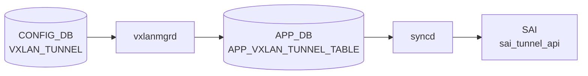

# VXLAN_TUNNEL テーブル

## 概要

[VXLAN](../../reference/glossary.md#term-vxlan) VTEP (Virtual Tunnel End Point) を定義するテーブル。source / destination IP と decap TTL モードを保持する[^1]。`orchagent` の `VxlanOrch` / `VxlanTunnelOrch` が [SAI](../../reference/glossary.md#term-sai) [VXLAN](../../reference/glossary.md#term-vxlan) tunnel と [SAI](../../reference/glossary.md#term-sai) tunnel termination を生成する。[EVPN](../../reference/glossary.md#term-evpn) ベースのオーバーレイでは destination は省略され、`VXLAN_EVPN_NVO` で NVO がバインドされる。

<!-- cdb-mermaid -->
### データフロー (自動生成)



!!! note "凡例"
    CONFIG_DB から SAI までの典型経路を `docs/reference/config-db-orch-map.md` から機械生成したミニ図。詳細・例外は本ページ本文と対応表を参照。
<!-- /cdb-mermaid -->

## key 構造

```text
VXLAN_TUNNEL|<name>
```

[YANG](../../reference/glossary.md#term-yang) `max-elements 2` 制約により最大 2 トンネルまで（実装的に [EVPN](../../reference/glossary.md#term-evpn) 用 1 + 静的 1 を想定）。

## フィールド一覧

| フィールド | 型 | 必須 | 説明 |
|-----------|----|------|------|
| `name` (key) | string | ✅ | トンネル名 |
| `src_ip` | ip-address | - | 自 VTEP IP（origination 用） |
| `dst_ip` | ip-address | - | 対向 VTEP IP（point-to-point の場合） |
| `ttl_mode` | string `uniform`/`pipe` | - | decap 時 TTL モード |

## 関連サブテーブル

- `VXLAN_TUNNEL_MAP` (key: `name`, `mapname`): [VLAN](../../reference/glossary.md#term-vlan) ↔ VNI マッピング
    - `vlan` (string `Vlan<id>`, mandatory)
    - `vni` (`vnid_type`, mandatory)
- `VXLAN_EVPN_NVO` (key: `name`, max-elements 1): [EVPN](../../reference/glossary.md#term-evpn) NVO インスタンス
    - `source_vtep` (leafref `VXLAN_TUNNEL.name`, mandatory)

## 購読者

- `orchagent` `VxlanTunnelOrch` / `VxlanTunnelMapOrch` / `EvpnNvoOrch`: [SAI](../../reference/glossary.md#term-sai) tunnel / tunnel-map / NVO を生成
- `bgpcfgd` (EVPN type-2 / type-3 advertise との連携)

## 関連 CONFIG_DB / YANG / CLI

- 関連 [CONFIG_DB](../../reference/glossary.md#term-config_db): `VXLAN_TUNNEL_MAP`、`VXLAN_EVPN_NVO`、`VLAN`、`VNET`、`VLAN_INTERFACE`
- 関連 CLI: [`config vxlan`](../cli/config-vxlan.md)
- 関連 [YANG](../../reference/glossary.md#term-yang): `sonic-vxlan`

<!-- ref-triangle:start -->

## 関連リファレンス

- [YANG](../../reference/glossary.md#term-yang): [`sonic-vxlan`](../yang/sonic-vxlan.md)
- CLI: [`config vxlan`](../cli/config-vxlan.md)

<!-- ref-triangle:end -->

## 引用元

[^1]: YANG 定義: `sonic-vxlan.yang`. <https://github.com/sonic-net/sonic-buildimage/blob/9ea932ec2e18f35e58268ec2e4456b1d4afd65cd/src/sonic-yang-models/yang-models/sonic-vxlan.yang>

## 関連ページ
- [HLD: VXLAN / VNet 全体設計](../../overlay/vxlan-sonic.md)
- [CLI: config vxlan](../cli/config-vxlan.md)
- [CONFIG_DB: VXLAN_TUNNEL_MAP](vxlan-tunnel-map.md)
- [YANG: sonic-vxlan](../yang/sonic-vxlan.md)

<!-- ops-hint -->
## 運用ヒント

### 典型値

- key 形式: `VXLAN_TUNNEL|<name>`。
- `src_ip`: 自 Loopback IP（VTEP）。
- `dst_ip`: P2P トンネル先（EVPN 動的の場合は省略）。

### よくある誤設定

- `src_ip` を物理 IF に置くとリンクダウンで VTEP が消える。Loopback0 を使う。
- EVPN 構成で `dst_ip` を静的指定すると EVPN type-3 と競合する。

### 確認コマンド

```bash
sonic-db-cli CONFIG_DB hgetall 'VXLAN_TUNNEL|tunnel1'
show vxlan tunnel
show vxlan remotevtep
```
<!-- /ops-hint -->

<!-- glossary-links-injected: f45d7ede5f79 -->
