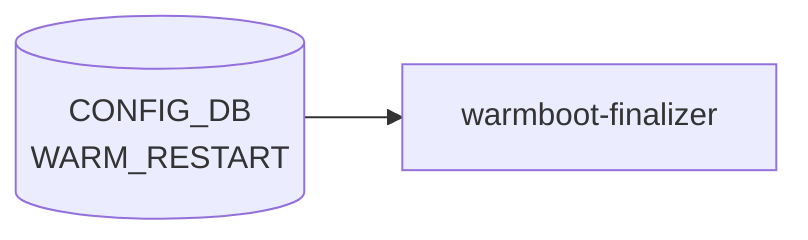

# WARM_RESTART テーブル

## 概要

ホットフィックスやソフトウェアアップグレード時に**データプレーンを落とさず**コントロールプレーンを再起動するためのモジュール別 warm-restart 設定を持つテーブル[^1]。モジュール (`bgp`/`teamd`/`swss`/`system`) ごとに enable 状態と各種タイマを保持する。

`warmboot-finalizer` / 各プロセス (`bgpd`, `teamd`, `orchagent`, `neighsyncd` 等) が起動時に [CONFIG_DB](../../reference/glossary.md#term-config_db) から読み出し、再収束の待ち時間を決める。

<!-- cdb-mermaid -->
### データフロー (自動生成)



!!! note "凡例"
    CONFIG_DB から SAI までの典型経路を `docs/reference/config-db-orch-map.md` から機械生成したミニ図。詳細・例外は本ページ本文と対応表を参照。
<!-- /cdb-mermaid -->

## key 構造

```text
WARM_RESTART|<module>
```

- `<module>`: `bgp`, `teamd`, `swss`, `system` の enum。

## フィールド

| フィールド | 型 | 制約 | 説明 |
|-----------|----|------|------|
| `module` (key) | enum | `bgp`/`teamd`/`swss`/`system` | warm-restart 対象モジュール |
| `bgp_eoiu` | boolean | module=bgp のみ | [BGP](../../reference/glossary.md#term-bgp) End-of-Initial-Update シグナルの有効化 |
| `bgp_timer` | uint16 (1..3600) | module=bgp のみ | [BGP](../../reference/glossary.md#term-bgp) の再収束待ちタイマ [秒] |
| `teamsyncd_timer` | uint16 (1..3600) | module=[teamd](../../reference/glossary.md#term-teamd-teamsyncd-teammgrd) のみ | `teamsyncd` の再同期猶予 [秒] |
| `neighsyncd_timer` | uint16 (1..9999) | module=swss のみ | `neighsyncd` の [ARP](../../reference/glossary.md#term-arp)/[NDP](../../reference/glossary.md#term-ndp) 再収束タイマ [秒] |

なお `STATE_DB:WARM_RESTART_TABLE` (state DB) は restart 進捗のランタイム表現で、[CONFIG_DB](../../reference/glossary.md#term-config_db) のこのテーブルとは別物。`enable` フラグなどシステム全体の制御は `STATE_DB` 側の `WARM_RESTART_ENABLE_TABLE` および `config warm_restart enable` で扱う実装が多い。

## 制約

- 各タイマには `must` 句でモジュールとの整合性チェックがかかる（例: `bgp_timer` は `module = 'bgp'` でないと許可されない）。
- タイマ範囲を外れる値は [YANG](../../reference/glossary.md#term-yang) validation 段で拒否される。

## 購読者

- `bgpcfgd`: `bgp_timer` / `bgp_eoiu` を vtysh の `bgp graceful-restart` 系設定に変換
- `teamd` ([LACP](../../reference/glossary.md#term-lacp)): `teamsyncd_timer` を読み、[LAG](../../reference/glossary.md#term-lag) 再収束タイムアウトとして使用
- `orchagent` / `neighsyncd` / `fpmsyncd`: `neighsyncd_timer` を [ARP](../../reference/glossary.md#term-arp)/route の reconciliation 待ちに使用
- `warmboot-finalizer.sh`: `WARM_RESTART_TABLE` 状態を見ながら最終的に dataplane を unfreeze

## 関連 CONFIG_DB / YANG / CLI

- 関連 [CONFIG_DB](../../reference/glossary.md#term-config_db): `DEVICE_METADATA` (`synchronous_mode`, `warm-restart` enable 補助)
- 関連 CLI: `config warm_restart enable`, `config warm_restart bgp_timer`, `config warm_restart neighsyncd_timer`, `show warm_restart`
- 関連 [YANG](../../reference/glossary.md#term-yang): `sonic-warm-restart`

<!-- value-behavior -->
## 値依存挙動マトリクス

| フィールド | 値 | 実挙動 |
|-----------|-----|--------|
| `module` | `bgp` | `bgp_eoiu` / `bgp_timer` が有効。`bgpcfgd` が vtysh の `bgp graceful-restart restart-time <val>` に変換 |
| `module` | `teamd` | `teamsyncd_timer` が有効。`teamd` が LAG 再収束タイムアウトとして使用 |
| `module` | `swss` | `neighsyncd_timer` が有効。`neighsyncd` が ARP/NDP reconciliation 待ちに使用 |
| `module` | `system` | システム全体の warm-restart 制御。個別タイマフィールドなし |
| `module` | その他 | YANG バリデーションで reject |
| `bgp_eoiu` | `true` | BGP End-of-Initial-Update シグナルを待って再収束完了と判定 |
| `bgp_eoiu` | `false` | EOIU なしで再収束完了と判定 |
| `bgp_timer` | `1`〜`3600` (秒) | BGP graceful-restart のタイムアウト。典型値 300 秒 |
| `bgp_timer` | module≠bgp | YANG `must` 違反で reject |
| `teamsyncd_timer` | `1`〜`3600` (秒) | LAG 再収束タイムアウト |
| `teamsyncd_timer` | module≠teamd | YANG `must` 違反で reject |
| `neighsyncd_timer` | `1`〜`9999` (秒) | ARP/NDP reconciliation 待ちタイムアウト。典型値 110 秒 |
| `neighsyncd_timer` | module≠swss | YANG `must` 違反で reject |

!!! note "enable フィールドについて"
    CONFIG_DB の WARM_RESTART テーブルに `enable` フィールドは存在しない。enable/disable は STATE_DB の `WARM_RESTART_ENABLE_TABLE` と `config warm_restart enable` コマンドで制御する。

<!-- /value-behavior -->

## 例外条件・特殊挙動 <!-- cdb-exceptions -->

<!-- evidence: sonic-buildimage/src/sonic-yang-models/yang-models/sonic-warm-restart.yang; sonic-swss/cfgmgr/vlanmgr.cpp -->

- **`module` 列挙値 (YANG)**: `bgp` / `teamd` / `swss` / `system` のみ許可。それ以外は YANG バリデーションで reject される[^exc1]。
- **フィールドとモジュールの対応 (YANG `must`)**:
  - `bgp_eoiu` / `bgp_timer`: `must "current()/../module = 'bgp'"` — bgp 以外のモジュールで設定すると `"bgp_timer is only supported for module bgp."` エラー[^exc1]。
  - `teamsyncd_timer`: `must "current()/../module = 'teamd'"`[^exc1]。
  - `neighsyncd_timer`: `must "current()/../module = 'swss'"`[^exc1]。
- **タイマー範囲 (YANG)**:
  - `bgp_timer` / `teamsyncd_timer`: `1..3600` — 範囲外は `"Timer must be 1..3600"` エラー[^exc1]。
  - `neighsyncd_timer`: `1..9999`[^exc1]。
- **YANG 制約違反**: `sonic-cfggen` / `config load` の段階でエラーが発生し DB には書き込まれない。
- **warm-restart 有効化ログ**: `enable` が `true` の場合、各 mgr が起動後に `SWSS_LOG_NOTICE("warmstart state set to REPLAYED/RECONCILED")` を記録する[^exc2]。

[^exc1]: `sonic-buildimage/src/sonic-yang-models/yang-models/sonic-warm-restart.yang` <https://github.com/sonic-net/sonic-buildimage/blob/master/src/sonic-yang-models/yang-models/sonic-warm-restart.yang>
[^exc2]: `sonic-swss/cfgmgr/vlanmgr.cpp` (warmstart ロジック参照) <https://github.com/sonic-net/sonic-swss/blob/master/cfgmgr/vlanmgr.cpp>

<!-- ref-triangle:start -->

## 関連リファレンス

- [YANG](../../reference/glossary.md#term-yang): [`sonic-warm-restart`](../yang/sonic-warm-restart.md)
- CLI: [`config warm_restart`](../cli/config-warm_restart.md) / `show warm_restart`

<!-- ref-triangle:end -->

## 引用元

[^1]: YANG 定義: `sonic-warm-restart.yang`. <https://github.com/sonic-net/sonic-buildimage/blob/9ea932ec2e18f35e58268ec2e4456b1d4afd65cd/src/sonic-yang-models/yang-models/sonic-warm-restart.yang>

<!-- ops-hint -->
## 運用ヒント

### 典型値

- key 形式: `WARM_RESTART|<module>` (`bgp`, `swss`, `teamd`, `system`)。
- `enable`: `true` / `false`。
- `bgp_timer`: 未設定時フォールバック 120 秒 (`DEFAULT_ROUTING_RESTART_INTERVAL`)。設定例として 300 秒が使われることがあるが、コードデフォルトは 120 秒。
- `neighsyncd_timer`: 未設定時フォールバック 5 秒 (`DEFAULT_NEIGHSYNC_WARMSTART_TIMER`)。

### よくある誤設定

- `enable: true` のまま長時間運用したまま `config save` し忘れて再起動すると warm-restart 状態が不整合になる。

### 確認コマンド

```bash
sonic-db-cli CONFIG_DB keys 'WARM_RESTART|*'
show warm_restart config
show warm_restart state
```
<!-- /ops-hint -->


<!-- runtime-trace -->
## CDB → 実コンテナ動作トレース

### 段階 1: Consumer 登録

- **各サービス (swss, syncd, bgp 等)**: 起動時に `WARM_RESTART` テーブルを `ConfigDBConnector` で読み込む。
- **system_halt_app** / **warmboot-finalizer**: warm restart フロー全体を管理。

### 段階 2: CFG → APPL 翻訳

- 各サービスが `WARM_RESTART` テーブルの `enable` / `neighsyncd_timer` 等を読み込み、warm restart モードで起動するかを決定。
- STATE_DB `WARM_RESTART_TABLE` に現在の warm restart 状態を書き込む。

### 段階 3: APPL → SAI

- SAI: warm restart 時は syncd が `SAI_SWITCH_ATTR_WARM_BOOT_WRITE/READ_FILE` を使用して ASIC 状態を保存・復元する。
- swss / orchagent は warm restart 完了後に APP_DB を再生して SAI との整合を確認する。

### 段階 4: タイミング + 副作用

- warm restart の完了時間はサービス数・ルート数に依存。数十秒〜数分。
- 副作用: warm restart が失敗するとコールドリスタートにフォールバックし、トラフィックが完全断になる。
- STATE_DB `WARM_RESTART_TABLE` で各サービスの進捗を確認可能。

<!-- /runtime-trace -->
<!-- entry-points -->
## 書き込み入り口 (Direction A)

WARM_RESTART テーブルへの書き込みが発生するコード経路を網羅的に調査した結果。

### CLI

  - `config warm_restart enable/disable/neighsyncd_timer/bgp_timer/teamsyncd_timer ...` — `config/main.py` が `mod_entry('WARM_RESTART', 'swss'/'bgp'/'teamd', ...)` を呼ぶ (sonic-utilities/config/main.py:4032–4094)

### minigraph / sonic-cfggen

minigraph.py に WARM_RESTART 生成なし

### REST / gNMI

REST/gNMI 書き込み経路なし

### db_migrator

**db_migrator.py** が WARM_RESTART のマイグレーション処理を実装 (sonic-utilities/scripts/db_migrator.py)

### ビルド時デフォルト (build-time default)

なし

### ハードコードデフォルト / ランタイム注入

なし

### 死活・デッドコード

なし
<!-- /entry-points -->

<!-- defaults -->
## コード由来の暗黙デフォルト

YANG に `default` 節が存在しないため、フィールド未設定時の実挙動はすべてコードのハードコード値に依存する。

| フィールド | YANG デフォルト | コード実装フォールバック | 根拠 |
|-----------|----------------|------------------------|------|
| `bgp_eoiu` | なし | `false` 相当 — `bgp_eoiu_marker` プロセスが supervisord に登録されない | `docker-fpm-frr/.../supervisord.conf.j2:239` |
| `bgp_timer` | なし | **120 秒** (`DEFAULT_ROUTING_RESTART_INTERVAL`) | `fpmsyncd.cpp:46,160` |
| `teamsyncd_timer` | なし | **5 秒** (`DEFAULT_INTERNAL_TIMER_VALUE`) | `warmRestartAssist.h:104` |
| `neighsyncd_timer` | なし | **5 秒** (`DEFAULT_NEIGHSYNC_WARMSTART_TIMER`) | `neighsync.h:10`, `neighsync.cpp:30` |

!!! warning "既存ドキュメントとの乖離"
    運用ヒント欄の「典型値: `bgp_timer`: 300、`neighsyncd_timer`: 110」はコード上の根拠がない。
    実装フォールバックは `bgp_timer` = **120 秒**、`neighsyncd_timer` = **5 秒**。
    設定例として広く使われている値であっても、コードデフォルトとは異なる。

### undocumented フィールド: `eoiu_hold_timer`

`fpmsyncd` は `WARM_RESTART|bgp` テーブルから `eoiu_hold_timer` フィールドを読む
(`WarmStart::getWarmStartTimer("eoiu_hold", "bgp")`)。このフィールドは YANG にも CLI にも未定義。
未設定時は `DEFAULT_EOIU_HOLD_INTERVAL = 3 秒` にフォールバックする。

### `enable` フィールドは CONFIG_DB に存在しない

`config warm_restart enable` は **CONFIG_DB ではなく STATE_DB の `WARM_RESTART_ENABLE_TABLE`** に書き込む。
`bgp.sh` / `teamd.sh` / `swss.sh` / `WarmStart::checkWarmStart()` はすべて STATE_DB を参照する。

### fast-reboot による副作用

`finalize-warmboot.sh` の `finalize_fast_reboot()` は `CONFIG_DB DEL "WARM_RESTART|teamd"` を実行する。
fast-reboot 後に `teamsyncd_timer` エントリが削除される副作用がある。
<!-- /defaults -->

<!-- ordering -->
## 順序依存 (Phase B)

### CONFIG_DB 読み取りタイミング

`WARM_RESTART` テーブルの値はすべて**各プロセスの起動時一回読み**であり、`SubscriberStateTable` による動的購読は行わない。`WarmStart::initialize()` → `WarmStart::checkWarmStart()` → `WarmStart::getWarmStartTimer()` の順序で同期的に実行される。

```
プロセス起動
  ├─ WarmStart::initialize(app_name, docker_name)
  │    CONFIG_DB コネクタ生成 + CFG_WARM_RESTART_TABLE_NAME テーブル接続
  │    warm_restart.cpp L35-62
  ├─ WarmStart::checkWarmStart(app_name, docker_name)
  │    STATE_DB WARM_RESTART_ENABLE_TABLE["system"]["enable"] 確認
  │    STATE_DB WARM_RESTART_ENABLE_TABLE[docker_name]["enable"] 確認
  │    STATE_DB WARM_RESTART_TABLE[app_name]["restore_count"] 確認
  │    warm_restart.cpp L86-147
  └─ WarmStart::getWarmStartTimer(app_name, docker_name)   ← warm start のときのみ
       CONFIG_DB WARM_RESTART[docker_name][app_name+"_timer"] 読み取り
       warm_restart.cpp L149-172
```

### モジュール別 CONFIG_DB 読み取り順序

`WARM_RESTART` テーブルの `<app>_timer` フィールドは各プロセスが個別に読み取る。呼び出し元と参照フィールドの対応:

| プロセス | docker_name | 参照フィールド | evidence |
|---------|-------------|--------------|---------|
| `orchagent` | `swss` | ─ (timer は参照しない) | `sonic-swss/orchagent/main.cpp:433-434` |
| `teamsyncd` | `teamd` | `teamsyncd_timer` | `sonic-swss/teamsyncd/teamsync.cpp:32-39` |
| `fpmsyncd` | `bgp` | `eoiu_hold_timer` (bgp_eoiu_marker からは bgp_timer) | `sonic-swss/fpmsyncd/fpmsyncd.cpp:226` |
| `fdbsyncd` | `bgp` | `bgp_timer` (LAG reconcile 待ち参照) | `sonic-swss/fdbsyncd/fdbsyncd.cpp:115` |
| `portsyncd` | `swss` | ─ | `sonic-swss/portsyncd/portsyncd.cpp:80-81` |
| `vlanmgrd` | `swss` | ─ | `sonic-swss/cfgmgr/vlanmgrd.cpp:48-49` |
| `intfmgrd` | `swss` | ─ | `sonic-swss/cfgmgr/intfmgrd.cpp:41-42` |
| `nbrmgrd` | `swss` | ─ | `sonic-swss/cfgmgr/nbrmgrd.cpp:42-43` |
| `buffermgrd` | `swss` | ─ | `sonic-swss/cfgmgr/buffermgrd.cpp:169-170` |

`getWarmStartTimer()` は `warm start` が有効な場合のみ呼ばれる。有効でない場合は `checkWarmStart()` が `false` を返した時点でタイマー読み取りをスキップする。

### orchagent warm start 内部実行順序

`WarmStart::isWarmStart()` が `true` の場合、`OrchDaemon::init()` の末尾で `warmRestoreAndSyncUp()` が実行される。内部順序 (`orchdaemon.cpp L1092-1170`):

```
1. WarmStart::setWarmStartState("orchagent", INITIALIZED)
2. 全 Orch に対して o->bake()       ← APP_DB/CONFIG_DB の既存データをキャッシュ
3. gMuxOrch->enableCachingNeighborUpdate()
4. 全 Orch に対して o->doTask() × 3 回イテレーション
   第1回: SwitchOrch + PortsOrch (port init/hostif) + BufferOrch
   第2回: port speed/mtu/fec_mode 等 + 残 Orch
   第3回: 順序外れデータの消化
5. gMuxOrch->updateCachedNeighbors() / disableCachingNeighborUpdate()
6. gMirrorOrch->doTask() + gAclOrch->doTask()   ← 最後に実行（他 Orch に依存するため）
7. warmRestoreValidation()   → 未処理タスクがあれば NOTICE ログ
8. syncd_apply_view()
9. 全 Orch に対して o->onWarmBootEnd()
10. WarmStart::setWarmStartState("orchagent", RECONCILED)
```

> **ポイント**: `gMirrorOrch` は他 Orch がすべて処理を終えた後に初めて doTask() される (`orchdaemon.cpp:1140-1145`)。warm start 中に MirrorOrch を早期実行すると、依存する route/neighbor が未確立のまま ACL ルールが適用される危険があるため。

### STATE_DB 経由の enable フラグ依存

`checkWarmStart()` が参照する `STATE_DB WARM_RESTART_ENABLE_TABLE` は `CONFIG_DB WARM_RESTART` テーブルとは別の DB。enable フラグ (`config warm_restart enable system/bgp/teamd/swss`) は CONFIG_DB でなく **STATE_DB** に書き込まれる。そのため:

1. `STATE_DB` が先に起動していること（`redis-server` と `sonic-db-daemon` の起動完了）が前提
2. `CONFIG_DB` の `WARM_RESTART` テーブル (`bgp_timer` 等タイマー値) は STATE_DB の enable フラグが true になった後に初めて意味を持つ
3. タイマー値を変更しても、enable フラグが false であれば `getWarmStartTimer()` は呼ばれずコールドスタートになる

<!-- evidence: warm_restart.cpp L86-95 (checkWarmStart), L149-172 (getWarmStartTimer), orchdaemon.cpp L1099-1170 (warmRestoreAndSyncUp) -->
<!-- /ordering -->

<!-- glossary-links-injected: ddc022697593 -->
