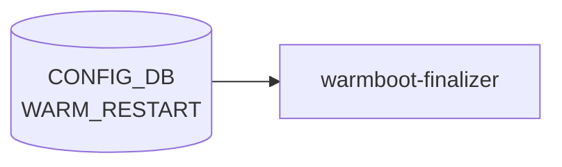

# WARM_RESTART テーブル

## 概要

ホットフィックスやソフトウェアアップグレード時に**データプレーンを落とさず**コントロールプレーンを再起動するためのモジュール別 warm-restart 設定を持つテーブル[^1]。モジュール (`bgp`/`teamd`/`swss`/`system`) ごとに enable 状態と各種タイマを保持する。

`warmboot-finalizer` / 各プロセス (`bgpd`, `teamd`, `orchagent`, `neighsyncd` 等) が起動時に [CONFIG_DB](../../reference/glossary.md#term-config_db) から読み出し、再収束の待ち時間を決める。

<!-- cdb-mermaid -->
### データフロー (自動生成)



!!! note "凡例"
    CONFIG_DB から SAI までの典型経路を `docs/reference/config-db-orch-map.md` から機械生成したミニ図。詳細・例外は本ページ本文と対応表を参照。
<!-- /cdb-mermaid -->

## key 構造

```text
WARM_RESTART|<module>
```

- `<module>`: `bgp`, `teamd`, `swss`, `system` の enum。

## フィールド

| フィールド | 型 | 制約 | 説明 |
|-----------|----|------|------|
| `module` (key) | enum | `bgp`/`teamd`/`swss`/`system` | warm-restart 対象モジュール |
| `bgp_eoiu` | boolean | module=bgp のみ | [BGP](../../reference/glossary.md#term-bgp) End-of-Initial-Update シグナルの有効化 |
| `bgp_timer` | uint16 (1..3600) | module=bgp のみ | [BGP](../../reference/glossary.md#term-bgp) の再収束待ちタイマ [秒] |
| `teamsyncd_timer` | uint16 (1..3600) | module=[teamd](../../reference/glossary.md#term-teamd-teamsyncd-teammgrd) のみ | `teamsyncd` の再同期猶予 [秒] |
| `neighsyncd_timer` | uint16 (1..9999) | module=swss のみ | `neighsyncd` の [ARP](../../reference/glossary.md#term-arp)/[NDP](../../reference/glossary.md#term-ndp) 再収束タイマ [秒] |

なお `STATE_DB:WARM_RESTART_TABLE` (state DB) は restart 進捗のランタイム表現で、[CONFIG_DB](../../reference/glossary.md#term-config_db) のこのテーブルとは別物。`enable` フラグなどシステム全体の制御は `STATE_DB` 側の `WARM_RESTART_ENABLE_TABLE` および `config warm_restart enable` で扱う実装が多い。

## 制約

- 各タイマには `must` 句でモジュールとの整合性チェックがかかる（例: `bgp_timer` は `module = 'bgp'` でないと許可されない）。
- タイマ範囲を外れる値は [YANG](../../reference/glossary.md#term-yang) validation 段で拒否される。

## 購読者

- `bgpcfgd`: `bgp_timer` / `bgp_eoiu` を vtysh の `bgp graceful-restart` 系設定に変換
- `teamd` ([LACP](../../reference/glossary.md#term-lacp)): `teamsyncd_timer` を読み、[LAG](../../reference/glossary.md#term-lag) 再収束タイムアウトとして使用
- `orchagent` / `neighsyncd` / `fpmsyncd`: `neighsyncd_timer` を [ARP](../../reference/glossary.md#term-arp)/route の reconciliation 待ちに使用
- `warmboot-finalizer.sh`: `WARM_RESTART_TABLE` 状態を見ながら最終的に dataplane を unfreeze

## 関連 CONFIG_DB / YANG / CLI

- 関連 [CONFIG_DB](../../reference/glossary.md#term-config_db): `DEVICE_METADATA` (`synchronous_mode`, `warm-restart` enable 補助)
- 関連 CLI: `config warm_restart enable`, `config warm_restart bgp_timer`, `config warm_restart neighsyncd_timer`, `show warm_restart`
- 関連 [YANG](../../reference/glossary.md#term-yang): `sonic-warm-restart`

<!-- ref-triangle:start -->

## 関連リファレンス

- [YANG](../../reference/glossary.md#term-yang): [`sonic-warm-restart`](../yang/sonic-warm-restart.md)
- CLI: [`config warm_restart`](../cli/config-warm_restart.md) / `show warm_restart`

<!-- ref-triangle:end -->

## 引用元

[^1]: YANG 定義: `sonic-warm-restart.yang`. <https://github.com/sonic-net/sonic-buildimage/blob/9ea932ec2e18f35e58268ec2e4456b1d4afd65cd/src/sonic-yang-models/yang-models/sonic-warm-restart.yang>

<!-- ops-hint -->
## 運用ヒント

### 典型値

- key 形式: `WARM_RESTART|<module>` (`bgp`, `swss`, `teamd`, `system`)。
- `enable`: `true` / `false`。
- `bgp_timer`: 300、`neighsyncd_timer`: 110。

### よくある誤設定

- `enable: true` のまま長時間運用したまま `config save` し忘れて再起動すると warm-restart 状態が不整合になる。

### 確認コマンド

```bash
sonic-db-cli CONFIG_DB keys 'WARM_RESTART|*'
show warm_restart config
show warm_restart state
```
<!-- /ops-hint -->

<!-- glossary-links-injected: ddc022697593 -->
