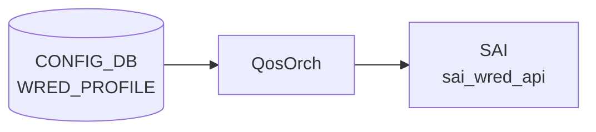

# WRED_PROFILE テーブル

## 概要

Weighted Random Early Detection ([WRED](../../reference/glossary.md#term-wred)) と ECN マーキングの設定プロファイルを定義する。`QUEUE` テーブルの `wred_profile` から名前で参照される[^1]。[orchagent](../../reference/glossary.md#term-orchagent) の `QosOrch` が [CONFIG_DB](../../reference/glossary.md#term-config_db) を購読し、[SAI](../../reference/glossary.md#term-sai) [WRED](../../reference/glossary.md#term-wred) オブジェクトに変換する。

<!-- cdb-mermaid -->
### データフロー (自動生成)



!!! note "凡例"
    CONFIG_DB から SAI までの典型経路を `docs/reference/config-db-orch-map.md` から機械生成したミニ図。詳細・例外は本ページ本文と対応表を参照。
<!-- /cdb-mermaid -->

## key 構造

```text
WRED_PROFILE|<name>
```

`<name>` は 1〜32 文字、英数字始まり。

## 主要フィールド

| フィールド | 型 | 既定 | 説明 |
|-----------|----|------|------|
| `green_min_threshold` / `yellow_min_threshold` / `red_min_threshold` | uint64 (bytes) | - | カラー別の [WRED](../../reference/glossary.md#term-wred) 開始閾値 |
| `green_max_threshold` / `yellow_max_threshold` / `red_max_threshold` | uint64 (bytes) | - | カラー別の最大閾値 (この値で全 drop) |
| `green_drop_probability` / `yellow_drop_probability` / `red_drop_probability` | uint64 (0..100) | 100 | 最大 drop 確率 [%] |
| `wred_green_enable` / `wred_yellow_enable` / `wred_red_enable` | boolean | false | カラー別 WRED 有効化 |
| `ecn` | enum | `ecn_none` | ECN マーキング対象色: `ecn_none`/`ecn_green`/`ecn_yellow`/`ecn_red`/`ecn_green_yellow`/`ecn_green_red`/`ecn_yellow_red`/`ecn_all` |

## 制約

- 各色の `max_threshold >= min_threshold` を `must` 制約で強制
- drop 確率は 0..100 の uint64 (パーセント単位)

## 購読者

- `orchagent` (`QosOrch`): [CONFIG_DB](../../reference/glossary.md#term-config_db) → [SAI](../../reference/glossary.md#term-sai) WRED → `QUEUE` への bind

## 関連 CONFIG_DB / YANG / CLI

- 関連 [CONFIG_DB](../../reference/glossary.md#term-config_db): `QUEUE`、`SCHEDULER`
- 関連 CLI: `config qos clear`、テンプレート起点の生成 (`buffers.json.j2`)
- 関連 [YANG](../../reference/glossary.md#term-yang): `sonic-wred-profile`

<!-- value-behavior -->
## 値依存挙動マトリクス

| フィールド | 値 | 実挙動 |
|-----------|-----|--------|
| `ecn` | `ecn_none` | `SAI_ECN_MARK_MODE_NONE`。ECN マーキングなし（デフォルト）|
| `ecn` | `ecn_green` | `SAI_ECN_MARK_MODE_GREEN`。緑パケットのみ ECN マーク |
| `ecn` | `ecn_yellow` | `SAI_ECN_MARK_MODE_YELLOW`。黄パケットのみ ECN マーク |
| `ecn` | `ecn_red` | `SAI_ECN_MARK_MODE_RED`。赤パケットのみ ECN マーク |
| `ecn` | `ecn_green_yellow` | `SAI_ECN_MARK_MODE_GREEN_YELLOW`。緑・黄をマーク |
| `ecn` | `ecn_green_red` | `SAI_ECN_MARK_MODE_GREEN_RED`。緑・赤をマーク |
| `ecn` | `ecn_yellow_red` | `SAI_ECN_MARK_MODE_YELLOW_RED`。黄・赤をマーク |
| `ecn` | `ecn_all` | `SAI_ECN_MARK_MODE_ALL`。全色 ECN マーク（DCQCN 等で推奨）|
| `wred_*_enable` | `true` | 指定色の WRED ドロップを有効化（フィールド定数: `wred_green_enable_field_name` / `wred_yellow_enable_field_name` / `wred_red_enable_field_name`、qosorch.h:40-42） |
| `wred_*_enable` | `false` | 無効（デフォルト）。閾値設定があっても drop しない |
| `wred_*_enable` | `"true"`/`"false"` 以外 | `SWSS_LOG_ERROR("Invalid input specified")` でエントリ破棄 |
| `*_drop_probability` | `0` | min threshold 到達時もドロップなし（ECN マーキングのみ使用する場合）|
| `*_drop_probability` | `100` | min〜max 間で線形ドロップ、max で全ドロップ（デフォルト）|
| `*_min_threshold` | bytes 値 | この Queue 深さからランダムドロップ開始 |
| `*_max_threshold` | bytes 値 | この Queue 深さで全パケットドロップ（100% drop）|
| `*_max_threshold` | `< min_threshold` | YANG `must` 違反で reject |

!!! note "閾値変更の 2 フェーズ適用"
    `orchagent` の `WredMapHandler` は閾値更新時に min/max の一時的な逆転を防ぐため、現在値と新値の比較から順序を決定して 2 段階で SAI に適用する（qosorch.cpp）。

<!-- /value-behavior -->

## 例外条件・特殊挙動 <!-- cdb-exceptions -->

<!-- evidence: sonic-swss/orchagent/qosorch.cpp (WredMapHandler); sonic-buildimage/src/sonic-yang-models/yang-models/sonic-wred-profile.yang -->

- **名前パターン (YANG)**: `pattern '[a-zA-Z0-9]{1}([-a-zA-Z0-9_]{0,31})'`、長さ 1〜32 文字 — 違反は `"Invalid length for wred profile name."` エラー[^exc2]。
- **max >= min 制約 (YANG)**: 各色の max threshold が min 以上である `must` 制約 — 違反は `"Yellow/Green/Red max threshold must be >= min threshold"` エラーで reject[^exc2]。
- **`convertBool` エラー**: `wred_green_enable` 等に `"true"` / `"false"` 以外の文字列が来た場合 `SWSS_LOG_ERROR("Invalid input specified")` を記録してエントリを破棄する[^exc1]。
- **threshold 2 フェーズ適用 (旧 SAI 互換)**: `WredMapHandler` は閾値変更時に「現在 min > 新 max」または「現在 max < 新 min」となる属性を deferred リストに後回しにし、残りを先に SAI に適用してから deferred を適用する。一部ベンダー SAI での順序エラーを回避するための特殊処理[^exc1]。
- **デフォルト補完 (YANG)**:
  - `ecn`: `default ecn_none`[^exc2]。
  - `wred_*_enable`: `default false`[^exc2]。
  - `*_drop_probability`: `default 100`（100%）[^exc2]。

[^exc1]: `sonic-swss/orchagent/qosorch.cpp` (WredMapHandler) <https://github.com/sonic-net/sonic-swss/blob/master/orchagent/qosorch.cpp>
[^exc2]: `sonic-buildimage/src/sonic-yang-models/yang-models/sonic-wred-profile.yang` <https://github.com/sonic-net/sonic-buildimage/blob/master/src/sonic-yang-models/yang-models/sonic-wred-profile.yang>

<!-- value-behavior -->
## `ecn` 値別挙動

YANG 定義 8 値 (sonic-wred-profile.yang)、default `ecn_none`。
実装 lookup map: `ecn_map` (qosorch.cpp:36-44)、フィールド定数: `ecn_field_name = "ecn"` (qosorch.h:55) → `SAI_WRED_ATTR_ECN_MARK_MODE` (qosorch.cpp:743)。
不正値 (`ecn_map.at()` が `std::out_of_range`) → エントリ破棄。

| 値 | SAI マッピング | マーキング対象色 | evidence |
|---|---|---|---|
| `ecn_none` (**既定**) | `SAI_ECN_MARK_MODE_NONE` | なし。ECN マーキング全無効 | `qosorch.cpp:37`, YANG:128 |
| `ecn_green` | `SAI_ECN_MARK_MODE_GREEN` | Green のみ。Yellow/Red は WRED drop のみ | `qosorch.cpp:38`, YANG |
| `ecn_yellow` | `SAI_ECN_MARK_MODE_YELLOW` | Yellow のみ。Green/Red は WRED drop のみ | `qosorch.cpp:39`, YANG |
| `ecn_red` | `SAI_ECN_MARK_MODE_RED` | Red のみ。Green/Yellow は WRED drop のみ | `qosorch.cpp:40`, YANG |
| `ecn_green_yellow` | `SAI_ECN_MARK_MODE_GREEN_YELLOW` | Green + Yellow。Red は WRED drop のみ | `qosorch.cpp:41`, YANG |
| `ecn_green_red` | `SAI_ECN_MARK_MODE_GREEN_RED` | Green + Red。Yellow は WRED drop のみ | `qosorch.cpp:42`, YANG |
| `ecn_yellow_red` | `SAI_ECN_MARK_MODE_YELLOW_RED` | Yellow + Red。Green は WRED drop のみ | `qosorch.cpp:43`, YANG |
| `ecn_all` | `SAI_ECN_MARK_MODE_ALL` | 全色 (Green + Yellow + Red) ECN マーキング有効 | `qosorch.cpp:44`, YANG:123 |

!!! note "ロスレス運用"
    RoCE / ロスレストラフィックでは `ecn_all` + `wred_*_enable=true` が典型設定。`ecn_none` では ECN 通知が発生しないためロスレス保証ができない。

### 複合条件

1. `ecn_none` + `wred_*_enable=true` — WRED drop は発生するが ECN マーキングなし。ベストエフォートの確率的 drop のみ。
2. `ecn_all` + `wred_*_enable=false` — ECN モードは設定されるが WRED 閾値に到達しない。実質 ECN 無効と同じ。
3. `ecn_green` + `wred_yellow_enable=true` — Yellow パケットは確率的に drop されるが ECN マーキングなし。Green パケットのみ ECN 通知。
4. **threshold 2 フェーズ適用**: 閾値変更時に「現在 min > 新 max」または「現在 max < 新 min」の属性は deferred リストに退避して後回し。`ecn` 変更と閾値変更が同時の場合、適用順序が通常と異なる (`qosorch.cpp:WredMapHandler`)。

### 値別 grep カバレッジ

| 値 | hit 数 | 証跡 |
|---|---|---|
| ecn_none | 3 | qosorch.cpp:37, yang(enum), yang(default) |
| ecn_green | 2 | qosorch.cpp:38, yang |
| ecn_yellow | 2 | qosorch.cpp:39, yang |
| ecn_red | 2 | qosorch.cpp:40, yang |
| ecn_green_yellow | 2 | qosorch.cpp:41, yang |
| ecn_green_red | 2 | qosorch.cpp:42, yang |
| ecn_yellow_red | 2 | qosorch.cpp:43, yang |
| ecn_all | 2 | qosorch.cpp:44, yang:123 |

全 8 値 hit。0 hit なし。
<!-- /value-behavior -->

<!-- defaults -->
## コード由来の暗黙デフォルト (Phase A)

YANG `default` 宣言、C++ runtime fallback、Jinja テンプレート生成の 3 層を per-field で整理する。

| フィールド | YANG default | C++ runtime fallback | qos_config.j2 AZURE_LOSSLESS |
|---|---|---|---|
| `ecn` | `ecn_none` | なし | `"ecn_all"` (明示設定) |
| `wred_green_enable` / `wred_yellow_enable` / `wred_red_enable` | `false` | なし | `"true"` (明示設定) |
| `green_drop_probability` / `yellow_drop_probability` / `red_drop_probability` | `100` (%) | `100` — `wred_*_enable=true` かつ当該フィールド省略時に `addQosItem()` が SAI へ自動補完[^def1] | `"5"` (%) |
| `green_min_threshold` / `yellow_min_threshold` / `red_min_threshold` | なし | なし（SAI ベンダーデフォルト依存） | `"1048576"` bytes (1 MiB) |
| `green_max_threshold` / `yellow_max_threshold` / `red_max_threshold` | なし | なし（SAI ベンダーデフォルト依存） | `"2097152"` bytes (2 MiB) |
| `SAI_WRED_ATTR_WEIGHT` *(CONFIG_DB フィールドなし)* | — | 常に `0` を SAI 属性リスト先頭へ無条件挿入[^def1] | — |

[^def1]: `sonic-swss/orchagent/qosorch.cpp` `WredMapHandler::addQosItem()` L794-850 <https://github.com/sonic-net/sonic-swss/blob/master/orchagent/qosorch.cpp>

### 詳細

**`*_drop_probability` の C++ fallback**

`addQosItem()` では、WRED enable が `true` に設定されているにもかかわらず drop probability フィールドが CONFIG_DB に存在しない場合（`drop_prob_set` ビットが立っていない）、SAI 属性リストに `SAI_WRED_ATTR_{GREEN/YELLOW/RED}_DROP_PROBABILITY = 100` を自動補完する（`qosorch.cpp:836-850`）。YANG default の `100` と一致するが、YANG default は sonic-yang validation 層で補完される一方、C++ fallback は SAI API 呼び出し直前に補完される点が異なる。

**`SAI_WRED_ATTR_WEIGHT` の無条件注入**

CONFIG_DB に `weight` フィールドは存在しない。`addQosItem()` は SAI WRED オブジェクト作成時に常に `SAI_WRED_ATTR_WEIGHT = 0` を属性リスト先頭に追加する（`qosorch.cpp:794-796`）。これは SAI の要求する必須属性を満たすための固定値である。

**`*_min_threshold` / `*_max_threshold` のデフォルトなし**

YANG に `default` 宣言がなく、[orchagent](../../reference/glossary.md#term-orchagent) も省略時のフォールバックを設定しない。フィールド省略時は SAI に対応属性が渡されず、ベンダー SAI 実装のデフォルト値に依存する。実用上は `qos_config.j2` の `AZURE_LOSSLESS` テンプレート（min=1 MiB / max=2 MiB）か、プラットフォーム固有の `generate_wred_profiles` マクロで設定される。

<!-- /defaults -->

<!-- derivation -->
## 派生・条件付き登録 (Phase 6/7)

### Phase 6: 自動派生

| 派生先フィールド | 派生元条件 | 派生値 | ソース |
|---|---|---|---|
| `ecn` | YANG `default` | `ecn_none` (フィールド省略時に自動補完) | `sonic-wred-profile.yang:128` |
| `wred_green_enable` / `wred_yellow_enable` / `wred_red_enable` | YANG `default` | `false` (フィールド省略時) | `sonic-wred-profile.yang` |
| `green_drop_probability` 等 | YANG `default` | `100` (%) (フィールド省略時) | `sonic-wred-profile.yang` |
| `WRED_PROFILE` エントリ全体 | `qos_config.j2` の静的テンプレート | `AZURE_LOSSLESS` プロファイル (`ecn=ecn_all`, 各閾値固定値) が自動生成 | `qos_config.j2:489-506` |
| `generate_wred_profiles` あり | ベンダー固有 j2 テンプレート定義 | プラットフォーム固有の WRED_PROFILE を生成 (標準の `AZURE_LOSSLESS` を置換) | `qos_config.j2:486-487` |
| `wred_profile` (QUEUE 側) | `qos_config.j2` QUEUE セクション | [RoCE](../../reference/glossary.md#term-roce) キュー (queue 3, 4 等) に `wred_profile=AZURE_LOSSLESS` を自動設定 | `qos_config.j2:514-660` |

**フォーマット変換 (db_migrator.py)**:

- 旧バージョンの CONFIG_DB では `wred_profile` の値が `|AZURE_LOSSLESS|` ABNF 形式で格納。
- `db_migrator.py:574-585` のマイグレーションステップでプレーン文字列 `AZURE_LOSSLESS` に変換。

### Phase 7: 条件付き登録

| 条件 | 影響 | ソース |
|---|---|---|
| `QosOrch` は常時登録 (platform / capability 非依存) | `CFG_WRED_PROFILE_TABLE_NAME` 購読は無条件 | `orchdaemon.cpp:375,384` |
| `gMySwitchType == "voq"` | `applyWredProfileToQueue()` が VoQ ID を使用 (物理キューではなく VoQ に適用) | `qosorch.cpp:1709-1730` |
| `QUEUE.wred_profile` 未解決 | `task_need_retry` → WRED_PROFILE エントリ登録後に再試行 | `qosorch.cpp:1864-1870` |

### グレップカバレッジ

| 項目 | hit 数 | 証跡 |
|---|---|---|
| `ecn` YANG default | 1 | `sonic-wred-profile.yang:128` |
| `AZURE_LOSSLESS` 自動生成 | 2 | `qos_config.j2:489,514-660` |
| `generate_wred_profiles` 条件 | 1 | `qos_config.j2:486` |
| db_migrator `wred_profile` 変換 | 1 | `db_migrator.py:575` |
| `applyWredProfileToQueue` VoQ 分岐 | 2 | `qosorch.cpp:1709,1716-1722` |
| `task_need_retry` (未解決) | 1 | `qosorch.cpp:1869` |

<!-- /derivation -->

<!-- handler-branching -->
### Phase 8: Handler メソッド内分岐

WRED_PROFILE は `WredMapHandler::convertFieldValuesToAttributes()` がフィールド値を解釈し SAI 属性リストに変換する。

| Handler | メソッド | 分岐条件 | 効果 | evidence |
|---|---|---|---|---|
| `WredMapHandler` | `convertFieldValuesToAttributes()` | `fvField == ecn_field_name` | `ecn_map.at(fvValue)` で `SAI_WRED_ATTR_ECN_MARK_MODE` を設定、未知値は `std::out_of_range` 例外 → エントリ破棄 | `sonic-swss/orchagent/qosorch.cpp:741-746` |
| `WredMapHandler` | `convertFieldValuesToAttributes()` | `fvField IN [wred_green_enable, wred_yellow_enable, wred_red_enable]` | `convertBool()` 失敗（`"true"/"false"` 以外）→ `SWSS_LOG_ERROR` + `return false`（エントリ破棄） | `sonic-swss/orchagent/qosorch.cpp:714-739` |
| `WredMapHandler` | `convertFieldValuesToAttributes()` | `storedProfile.yellow_min_threshold > threshold` (新 max < 旧 min) | 閾値変更を deferred リストへ退避（2 フェーズ適用、先に反対側を SAI に投入して min>max 違反を回避）| `sonic-swss/orchagent/qosorch.cpp:636-644` |
| `WredMapHandler` | `convertFieldValuesToAttributes()` | `currentProfile.green_min_threshold > currentProfile.green_max_threshold` (いずれかの色で) | `SWSS_LOG_ERROR("Wrong wred profile: min > max")` + `return false` → エントリ破棄 | `sonic-swss/orchagent/qosorch.cpp:754-760` |
| `WredMapHandler` | `addQosItem()` | `wred_enable_set & GREEN_WRED_ENABLED` かつ `drop_prob_set` に green なし | `SAI_WRED_ATTR_GREEN_DROP_PROBABILITY = 100` を自動補完 | `sonic-swss/orchagent/qosorch.cpp:836-840` |
| `WredMapHandler` | `addQosItem()` | 同上 yellow / red 各色 | `SAI_WRED_ATTR_YELLOW/RED_DROP_PROBABILITY = 100` を自動補完 | `sonic-swss/orchagent/qosorch.cpp:842-850` |

> **スキャン証跡**: `convertFieldValuesToAttributes()` L585-762 全行読了（34 フィールド if-elif 連鎖）、`addQosItem()` L784-860 読了。6 件分岐抽出。`ecn` 値の dispatch は `ecn_map.at()` ルックアップテーブル形式。Phase 6/7 derivation ブロック再確認: YANG default / qos_config.j2 AZURE_LOSSLESS 生成 / VoQ applyWredProfileToQueue — 実ソースと整合、誤読なし。

<!-- /handler-branching -->

<!-- pubsub -->
## 通信メカニズム (Phase G)

### 購読 API

CONFIG_DB の `WRED_PROFILE` は `orchdaemon.cpp:375` の `qos_tables` ベクタ経由で `QosOrch` に登録される。`Orch::addConsumer()` が CONFIG_DB を検出し **`swss::SubscriberStateTable`** を選択する。

- 購読方式: [Redis](../../reference/glossary.md#term-redis) **keyspace 通知** (`__keyspace@<dbId>__:WRED_PROFILE|*` への `PSUBSCRIBE`)
- 通知到着時に `HGETALL` で値を再取得し `(key, op, fvs)` タプルとして `pops()` で返す
- バッチサイズ: `TableConsumable::DEFAULT_POP_BATCH_SIZE = 128`（`table.h:164`、ハードコード）
- `orchagent -b` オプションの影響なし（[APPL_DB](../../reference/glossary.md#term-appl_db) 側 `ConsumerStateTable` のみに作用）

### 書き込み側 (publisher)

CLI `config qos reload`（`sonic-cfggen` + `qos_config.j2`）または firstboot 時のテンプレート展開が `swss::Table::set()` / `HSET` を発行。明示的 `PUBLISH` は行われず [Redis](../../reference/glossary.md#term-redis) keyspace 通知で購読者に伝達。

### ディスパッチ経路

```
SubscriberStateTable (PSUBSCRIBE keyspace)
  → Consumer::execute() → pops() (HGETALL)
  → QosOrch::doTask(Consumer&)           # allPortsReady() チェック後
  → m_qos_handler_map[CFG_WRED_PROFILE_TABLE_NAME]
  → QosOrch::handleWredProfileTable()    # qosorch.cpp:877
  → WredMapHandler::processWorkItem()
  → addQosItem(): sai_wred_api->create_wred()
                  [SAI_WRED_ATTR_ECN_MARK_MODE / SAI_WRED_ATTR_*_ENABLE 等]
```

`QosOrch::doTask()` は WRED_PROFILE を PORT_QOS_MAP / QUEUE より先に drain する順序制御あり（`qosorch.cpp:2231-2252`）。これにより `QUEUE.wred_profile` 参照を解決した状態で QUEUE を処理できる。

### select タイムアウト・リトライ

- select タイムアウト: **1000 ms** (`SELECT_TIMEOUT`, `orchdaemon.cpp:23`)
- `task_need_retry` 時は `m_toSync` にエントリを残置して次サイクルで再処理
- サービス再起動トリガーなし（SAI ライブ操作のみで完結）

### APPL_DB / STATE_DB 書き込み

なし。`WRED_PROFILE` は CONFIG_DB → `QosOrch` → SAI の直接経路で完結し、[APPL_DB](../../reference/glossary.md#term-appl_db) への中継も [STATE_DB](../../reference/glossary.md#term-state_db) への反映も行わない。

| 観点 | 値 |
|---|---|
| 購読方式 | `SubscriberStateTable` (keyspace `PSUBSCRIBE`) |
| バッチサイズ | 128 (`DEFAULT_POP_BATCH_SIZE`) |
| select タイムアウト | 1000 ms |
| ハンドラ | `QosOrch::handleWredProfileTable()` → `WredMapHandler` |
| SAI API | `sai_wred_api->create_wred()` / `set_wred_attribute()` / `remove_wred()` |
| channel PUBLISH | 使わない |
| [APPL_DB](../../reference/glossary.md#term-appl_db) 中継 | なし |
| TTL | 未使用 |

<!-- /pubsub -->

<!-- platform -->
## プラットフォーム差 (Phase H)

WRED_PROFILE の処理において、プラットフォーム識別文字列（`broadcom` / `mellanox` / `cisco-8000` 等）による静的分岐は存在しない。SAI capability の動的照会（`querySwitchCapability` / `sai_query_attribute_capability`）も WRED 属性に対しては実施されない。確認されるプラットフォーム差は以下の通り。

### 差異 1: VoQ chassis — WRED プロファイルの bind 対象が VoQ に変わる

`gMySwitchType == "voq"` の場合、`applyWredProfileToQueue()` (`qosorch.cpp:1715-1730`) は物理キュー ID（`port.m_queue_ids[queue_ind]`）の代わりに **VoQ ID**（`gPortsOrch->getPortVoQIds(port)[queue_ind]`）を使用し、SAI 属性 `SAI_QUEUE_ATTR_WRED_PROFILE_ID` を VoQ に設定する。

| 条件 | bind 対象 |
|------|----------|
| `gMySwitchType == "voq"` | `getPortVoQIds()` で取得した VoQ ID |
| それ以外（通常スイッチ / multi-asic / [DPU](../../reference/glossary.md#term-dpu) 等） | `port.m_queue_ids[queue_ind]`（物理キュー） |

VoQ chassis ではローカル ASIC のポートか否かも判定される。非ローカルポートへの WRED bind は暗黙的にスキップされる（`qosorch.cpp:1790-1800`）。

### 差異 2: VoQ chassis — QUEUE キーフォーマットが 4 トークンに変わる

`handleQueueTable()` (`qosorch.cpp:1772-1810`) における QUEUE キー解析:

| 条件 | キーフォーマット | 不正時の挙動 |
|------|----------------|------------|
| `gMySwitchType == "voq"` | `{hostname}\|{asic}\|{port}\|{index}` (4 トークン必須) | 4 トークン未満 → `task_invalid_entry` |
| それ以外 | `{port}\|{index}` (2 トークン必須) | 2 トークン以外 → `task_invalid_entry` |

VoQ 環境で `QUEUE` テーブルを書く場合は `hostname|asicN|EthernetX|queue_index` 形式を使用する必要がある。

### 差異 3: 一部ベンダー SAI の min/max threshold 順序制約（対策済み）

コメント (`qosorch.cpp:596-629`) に「一部ベンダー SAI では 1 回の SET ごとに min/max の整合性を検証するため、閾値の過渡的な逆転（旧 max < 新 min）がエラーになる」と記されている。対象ベンダーは明示されていない。

この問題は **2 フェーズ属性適用**（`convertFieldValuesToAttributes()` の `deferred_attributes` 機構, L636-694）で吸収されており、ユーザー操作・CONFIG_DB 書き込み順序には依存しない。全プラットフォームでこの機構が有効。

### 差異 4: SAI capability 照会なし — ASIC 非対応は SAI エラー時のみ判明

WRED の各 SAI 属性（`SAI_WRED_ATTR_ECN_MARK_MODE`、`SAI_WRED_ATTR_*_{ENABLE/MIN_THRESHOLD/MAX_THRESHOLD/DROP_PROBABILITY}`、`SAI_WRED_ATTR_WEIGHT`）は能力照会なしで直接 `sai_wred_api->create_wred()` / `set_wred_attribute()` に渡される。ASIC が非対応の場合 SAI がエラーを返し、[orchagent](../../reference/glossary.md#term-orchagent) はエントリを破棄する（ログ: `"Failed to create wred profile: %d"`）。対応可否は各ベンダーの `libsai` 実装に依存。

### 差異 5: プラットフォーム別 WRED テンプレート（build-time）

`qos_config.j2:486-506` のマクロ分岐:

| 条件 | 生成される WRED_PROFILE |
|------|----------------------|
| hwsku テンプレートが `generate_wred_profiles` マクロを定義している | プラットフォーム固有の WRED プロファイル（カスタム閾値・ECN 設定） |
| マクロ未定義（デフォルト） | `AZURE_LOSSLESS`（min=1 MiB / max=2 MiB / prob=5% / ecn=ecn_all） |

runtime の orchagent 側にはプラットフォーム別の分岐なし。差異はすべて build-time の j2 テンプレートで吸収される。

!!! note "VoQ スイッチ運用上の注意"
    VoQ chassis 環境では QUEUE テーブルのキーを `hostname|asic|port|queue_index` の 4 トークン形式で書く必要がある。2 トークン形式（通常スイッチ用）を使うと `task_invalid_entry` で即破棄される。

<!-- /platform -->

<!-- failure -->
## 失敗挙動 (Phase D)

`WredMapHandler` が CONFIG_DB エントリを処理する際の失敗パターンを網羅する。ソース: `sonic-swss/orchagent/qosorch.cpp`。

| # | 失敗種別 | トリガー条件 | ログメッセージ | エントリ継続 |
|---|---|---|---|---|
| 1 | 不正 threshold (min > max) | `*_min_threshold > *_max_threshold` の C++ 側チェック (`convertFieldValuesToAttributes()` 末尾) | `"Wrong wred profile: min threshold is greater than max threshold"` | 破棄 |
| 2 | SAI `create_wred` 失敗 | `sai_wred_api->create_wred()` がエラーを返す（新規作成時） | `"Failed to create wred profile: %d"` | 破棄 |
| 3 | SAI `set_wred_attribute` 失敗 | `sai_wred_api->set_wred_attribute()` がエラーを返す（runtime 更新時） | `"Failed to set wred profile attribute, id:%d, status:%d"` | 部分適用（ループ中断） |
| 4 | 参照中 DEL → `remove_wred` 失敗 | `QUEUE` が参照中の状態で `WRED_PROFILE` エントリを DEL した場合に SAI がエラー | `"Failed to remove scheduler profile, status:%d"` | SAI オブジェクト残留 |
| 5 | 不正 `ecn` enum 値 | `ecn_map.at(fvValue)` で `std::out_of_range` 例外発生（許可値 8 種以外） | なし（例外伝播、ログなし） | 破棄 |
| 6 | 不正 `wred_*_enable` 値 | `convertBool()` が `"true"`/`"false"` 以外を受けて失敗 | `"Invalid input specified"` | 破棄 |

### 詳細

**不正 threshold (min > max)** (`qosorch.cpp:754-759`):
YANG `must` 制約（max >= min）は yang-validation 層で弾くが、orchagent も C++ 側で二重チェックする。
いずれかの色で `min > max` となる場合、`convertFieldValuesToAttributes()` が `false` を返しエントリを破棄する。
SAI への変更はなく、CONFIG_DB エントリは残る（hardware に下りない状態が続く）。

**SAI 失敗（create / set）**:
新規作成時は `create_wred()` 失敗でエントリ破棄。`QUEUE.wred_profile` が参照している場合、参照先が未登録のまま `task_need_retry` ループが継続する。
runtime 更新時は `set_wred_attribute()` が属性ループを途中で中断するため、失敗前の属性は適用済み・失敗後は未適用という部分適用状態になりうる。

**参照中 DEL**: `QUEUE` が `wred_profile=<name>` で参照している WRED_PROFILE を先に削除すると、SAI 側が `SAI_STATUS_OBJECT_IN_USE` 相当のエラーを返す。`removeQosItem()` が `false` を返し SAI オブジェクトが残留する。正しい手順は QUEUE 側を先に DEL（または `wred_profile` フィールドを除去）してから WRED_PROFILE を DEL する。

**不正 `ecn` enum**: `ecn_map.at()` は try-catch なしで呼ばれるため `std::out_of_range` が上位に伝播し、エントリが無音で破棄される（`SWSS_LOG_ERROR` なし）。YANG 定義の 8 値以外を CONFIG_DB に直接書き込んだ場合のみ発生。

**不正 `wred_*_enable`**: `convertBool()` 内で `SWSS_LOG_ERROR("Invalid input specified")` を出力した後 `false` を返す。`"true"`/`"false"` 以外（例: `"yes"`, `"1"`, `"TRUE"`）で発生。

<!-- evidence: sonic-swss/orchagent/qosorch.cpp WredMapHandler::convertFieldValuesToAttributes() L585-762, addQosItem() L784-860, removeQosItem() L864-874 -->
<!-- /failure -->

<!-- side-effects -->
## 副次 DB 書込 (Phase F)

`WRED_PROFILE` の SET/DEL を受けた `QosOrch` (`WredMapHandler`) は、SAI 経由で [ASIC_DB](../../reference/glossary.md#term-asic_db) に書き込む。[STATE_DB](../../reference/glossary.md#term-state_db) / [COUNTERS_DB](../../reference/glossary.md#term-counters_db) / [FLEX_COUNTER_DB](../../reference/glossary.md#term-flex_counter_db) への直接書込はない。

### ASIC_DB 書込み (SAI/syncd 経由)

| タイミング | SAI API | [ASIC_DB](../../reference/glossary.md#term-asic_db) への反映 |
|---|---|---|
| SET → 新規 (`addQosItem()`) | `sai_wred_api->create_wred(&sai_object, gSwitchId, ...)` | `ASIC_STATE:SAI_OBJECT_TYPE_WRED:<oid>` 生成 |
| SET → 既存更新 (`modifyQosItem()`) | `sai_wred_api->set_wred_attribute(sai_object, &attr)` | `ASIC_STATE:SAI_OBJECT_TYPE_WRED:<oid>` フィールド更新 |
| DEL → `removeQosItem()` | `sai_wred_api->remove_wred(sai_object)` | `ASIC_STATE:SAI_OBJECT_TYPE_WRED:<oid>` 削除 |
| QUEUE bind (`applyWredProfileToQueue()`) | `sai_queue_api->set_queue_attribute(queue_id, SAI_QUEUE_ATTR_WRED_PROFILE_ID)` | `ASIC_STATE:SAI_OBJECT_TYPE_QUEUE:<queue_oid>` の `SAI_QUEUE_ATTR_WRED_PROFILE_ID` 更新 |
| QUEUE unbind (DEL / `wred_profile` 解除) | 同上、値 `SAI_NULL_OBJECT_ID` | 同上フィールドを `NULL` に更新 |

### QUEUE への副次 bind

`WRED_PROFILE` SAI オブジェクト作成後、`QUEUE.wred_profile` で参照されている場合に `applyWredProfileToQueue()` が `SAI_QUEUE_ATTR_WRED_PROFILE_ID` を設定してキューに紐付ける。VoQ スイッチ (`gMySwitchType == "voq"`) では物理キューではなく VoQ ID に適用する (`qosorch.cpp:1709-1730`)。

| 副次 bind 条件 | 処理 | ソース |
|---|---|---|
| `QUEUE.wred_profile=<name>` が解決済み | `sai_queue_api->set_queue_attribute(SAI_QUEUE_ATTR_WRED_PROFILE_ID)` | `qosorch.cpp:1735-1738` |
| `QUEUE.wred_profile` 未解決 (WRED_PROFILE 未作成) | `task_need_retry` → WRED_PROFILE 作成後に自動再処理 | `qosorch.cpp:1864-1870` |
| DEL または `wred_profile` フィールド削除 | `SAI_QUEUE_ATTR_WRED_PROFILE_ID = SAI_NULL_OBJECT_ID` で unbind | `qosorch.cpp:1893` |

```bash
# WRED SAI オブジェクト確認
sonic-db-cli ASIC_DB keys 'ASIC_STATE:SAI_OBJECT_TYPE_WRED:*'
# キューへの bind 確認
sonic-db-cli ASIC_DB hget 'ASIC_STATE:SAI_OBJECT_TYPE_QUEUE:<queue_oid>' SAI_QUEUE_ATTR_WRED_PROFILE_ID
```

> **証跡**: `create_wred()` L855、`set_wred_attribute()` L774、`remove_wred()` L868、`set_queue_attribute(SAI_QUEUE_ATTR_WRED_PROFILE_ID)` L1735-1738。`qosorch.cpp` 全 WRED 処理経路読了。[STATE_DB](../../reference/glossary.md#term-state_db) / [COUNTERS_DB](../../reference/glossary.md#term-counters_db) への書込なし確認済み。
<!-- /side-effects -->

<!-- constants -->
## ハードコード定数 (Phase E)

### ECN enum — `ecn_map` (qosorch.cpp:37-44 / qosorch.h:56-63)

CONFIG_DB `ecn` フィールド文字列を SAI `SAI_WRED_ATTR_ECN_MARK_MODE` にマッピングするルックアップテーブル。不正値は `std::out_of_range` → エントリ破棄。

| フィールド値 | SAI 属性値 | ソース |
|---|---|---|
| `ecn_none` (**既定**) | `SAI_ECN_MARK_MODE_NONE` | qosorch.cpp:37, qosorch.h:56 |
| `ecn_green` | `SAI_ECN_MARK_MODE_GREEN` | qosorch.cpp:38, qosorch.h:60 |
| `ecn_yellow` | `SAI_ECN_MARK_MODE_YELLOW` | qosorch.cpp:39, qosorch.h:58 |
| `ecn_red` | `SAI_ECN_MARK_MODE_RED` | qosorch.cpp:40, qosorch.h:57 |
| `ecn_green_yellow` | `SAI_ECN_MARK_MODE_GREEN_YELLOW` | qosorch.cpp:41, qosorch.h:62 |
| `ecn_green_red` | `SAI_ECN_MARK_MODE_GREEN_RED` | qosorch.cpp:42, qosorch.h:61 |
| `ecn_yellow_red` | `SAI_ECN_MARK_MODE_YELLOW_RED` | qosorch.cpp:43, qosorch.h:59 |
| `ecn_all` | `SAI_ECN_MARK_MODE_ALL` | qosorch.cpp:44, qosorch.h:63 |

### SAI wred_attr マッピング (qosorch.cpp:636-746)

`WredMapHandler::convertFieldValuesToAttributes()` が各 CONFIG_DB フィールドを SAI 属性 ID に変換する。

| CONFIG_DB フィールド | SAI 属性 ID |
|---|---|
| `green_min_threshold` | `SAI_WRED_ATTR_GREEN_MIN_THRESHOLD` |
| `green_max_threshold` | `SAI_WRED_ATTR_GREEN_MAX_THRESHOLD` |
| `yellow_min_threshold` | `SAI_WRED_ATTR_YELLOW_MIN_THRESHOLD` |
| `yellow_max_threshold` | `SAI_WRED_ATTR_YELLOW_MAX_THRESHOLD` |
| `red_min_threshold` | `SAI_WRED_ATTR_RED_MIN_THRESHOLD` |
| `red_max_threshold` | `SAI_WRED_ATTR_RED_MAX_THRESHOLD` |
| `green_drop_probability` | `SAI_WRED_ATTR_GREEN_DROP_PROBABILITY` |
| `yellow_drop_probability` | `SAI_WRED_ATTR_YELLOW_DROP_PROBABILITY` |
| `red_drop_probability` | `SAI_WRED_ATTR_RED_DROP_PROBABILITY` |
| `wred_green_enable` | `SAI_WRED_ATTR_GREEN_ENABLE` |
| `wred_yellow_enable` | `SAI_WRED_ATTR_YELLOW_ENABLE` |
| `wred_red_enable` | `SAI_WRED_ATTR_RED_ENABLE` |
| `ecn` | `SAI_WRED_ATTR_ECN_MARK_MODE` |

### デフォルト threshold / probability ハードコード値

**drop probability の C++ fallback** (qosorch.cpp:836-850): `wred_*_enable=true` かつ対応 `*_drop_probability` フィールド省略時、`addQosItem()` が SAI 属性リストに自動補完する固定値。

| 対象色 | SAI 属性 | ハードコード値 |
|---|---|---|
| Green | `SAI_WRED_ATTR_GREEN_DROP_PROBABILITY` | `100` (%) |
| Yellow | `SAI_WRED_ATTR_YELLOW_DROP_PROBABILITY` | `100` (%) |
| Red | `SAI_WRED_ATTR_RED_DROP_PROBABILITY` | `100` (%) |

**threshold**: YANG・orchagent ともにデフォルト値なし。フィールド省略時は SAI ベンダー依存。`AZURE_LOSSLESS` テンプレートが min=1,048,576 bytes / max=2,097,152 bytes を設定。

### weight デフォルト (qosorch.cpp:794-796)

CONFIG_DB に `weight` フィールドは存在しない。`addQosItem()` は WRED オブジェクト作成時に常に `SAI_WRED_ATTR_WEIGHT = 0` を属性リスト先頭へ無条件挿入する（SAI WRED 必須属性を満たすための固定値、ユーザー設定不可）。

<!-- /constants -->

<!-- ref-triangle:start -->

## 関連リファレンス

- [YANG](../../reference/glossary.md#term-yang): [`sonic-wred-profile`](../yang/sonic-wred-profile.md)
- CLI: [`config qos`](../cli/config-qos.md)

<!-- ref-triangle:end -->

## 引用元

[^1]: [YANG](../../reference/glossary.md#term-yang) 定義: `sonic-wred-profile.yang`. <https://github.com/sonic-net/sonic-buildimage/blob/9ea932ec2e18f35e58268ec2e4456b1d4afd65cd/src/sonic-yang-models/yang-models/sonic-wred-profile.yang>

<!-- topics-back-ref -->
## 関連 Topics

- [Topics: QoS / Buffer / PFC / Watermark](../../topics/08-qos-buffer/index.md)

<!-- /topics-back-ref -->

<!-- ops-hint -->
## 運用ヒント

### 典型値

- key 形式: `WRED_PROFILE|<name>`。
- `ecn`: `ecn_all` / `ecn_green` / `ecn_none`。
- `*_min_threshold` / `*_max_threshold` / `*_drop_probability`。

### よくある誤設定

- min > max に設定すると [SAI](../../reference/glossary.md#term-sai) がエラーを返し、profile が hardware に下りない。

### 確認コマンド

```bash
sonic-db-cli CONFIG_DB hgetall 'WRED_PROFILE|AZURE_LOSSY'
show wred
```
<!-- /ops-hint -->

<!-- entry-points -->
## 書き込み入り口 (Direction A)

CONFIG_DB の `WRED_PROFILE` テーブルを書き込むコードパスを網羅する。

### CLI — config qos reload

`sonic-utilities/config/main.py:3666-3755`

`config qos reload` の実行フロー:

1. `_clear_qos()` (L895-915) で WRED_PROFILE テーブルを全削除:
   ```python
   config_db.delete_table("WRED_PROFILE")
   ```
2. プラットフォーム固有の `qos.json.j2` を `sonic-cfggen` で展開し `--write-to-db` で CONFIG_DB に書き込む
3. テンプレート内の `WRED_PROFILE` セクション (`AZURE_LOSSLESS` 等) が CONFIG_DB に反映される

入力プロトコル: `sonic-cfggen` のテンプレート展開（プラットフォーム hwsku パスの `qos.json.j2`）

### CLI — config qos clear

`sonic-utilities/config/main.py:895-915` (`_clear_qos()`)

`QOS_TABLE_NAMES` リストに `'WRED_PROFILE'` が含まれており、`config qos clear` で WRED_PROFILE テーブルが全削除される。

```python
config_db.delete_table("WRED_PROFILE")
```

### build-time デフォルト (qos_config.j2)

`sonic-buildimage/files/build_templates/qos_config.j2:486-506`

`generate_wred_profiles` マクロが未定義の場合、デフォルトの `AZURE_LOSSLESS` プロファイルを静的生成:

| フィールド | デフォルト値 |
|---|---|
| `wred_green_enable` / `wred_yellow_enable` / `wred_red_enable` | `"true"` |
| `ecn` | `"ecn_all"` |
| `green_max_threshold` / `yellow_max_threshold` / `red_max_threshold` | `"2097152"` (bytes) |
| `green_min_threshold` / `yellow_min_threshold` / `red_min_threshold` | `"1048576"` (bytes) |
| `green_drop_probability` / `yellow_drop_probability` / `red_drop_probability` | `"5"` (%) |

プラットフォームが `generate_wred_profiles` マクロを定義している場合は置換。`config qos reload` または firstboot 時に CONFIG_DB へ書き込まれる。

### db_migrator

`sonic-utilities/scripts/db_migrator.py:574-585`

WRED_PROFILE テーブル自体は変更しないが、参照側 QUEUE テーブルの `wred_profile` フィールド値の ABNF 形式（`|AZURE_LOSSLESS|`）をプレーン文字列（`AZURE_LOSSLESS`）に変換するマイグレーションを実行する。

### minigraph

なし。WRED_PROFILE は `minigraph.py` で生成しない。

### REST / gNMI

なし。`sonic-mgmt-common/translib/` に WRED_PROFILE 対応の App が存在しない。OpenConfig [QoS](../../reference/glossary.md#term-qos) YANG モデルへの translib 実装が未完のため、REST/[gNMI](../../reference/glossary.md#term-gnmi) 経由での直接書き込みは現時点では非サポート。

### hard-coded デフォルト

なし。デフォルト値は YANG `default` 宣言および `qos_config.j2` テンプレートで定義。

### 死活 (runtime injection)

`orchagent` の `QosOrch` は WRED_PROFILE を購読するのみ（書き込みなし）。

<!-- /entry-points -->

<!-- cross-refs -->
## 暗黙参照 (Phase C: このテーブルを参照するテーブル)

`WRED_PROFILE` テーブルは他テーブルから名前で参照される被参照テーブル。参照元と解決フローを以下に示す。

### QUEUE テーブル (直接名前参照)

`QUEUE` テーブルの `wred_profile` フィールドが `WRED_PROFILE` のエントリ名を文字列で保持し、`QosOrch::handleQueueTable()` 内で `resolveFieldRefValue()` により実オブジェクトに解決される。

| 参照元テーブル | 参照フィールド | 解決タイミング | 未解決時の挙動 | evidence |
|---|---|---|---|---|
| `QUEUE` | `wred_profile` | `handleQueueTable()` SET パス | `task_need_retry` — WRED_PROFILE 先行作成を待つ | `qosorch.cpp:1856-1867` |
| `QUEUE` | `wred_profile` (DEL) | `handleQueueTable()` DEL パス | `sai_wred_profile = SAI_NULL_OBJECT_ID` で unbind | `qosorch.cpp:1889-1893` |

**解決フロー**:

1. `resolveFieldRefValue(m_qos_maps, wred_profile_field_name, qos_to_ref_table_map.at(wred_profile_field_name), tuple, sai_wred_profile, wred_profile_name)` (qosorch.cpp:1857-1859)
2. 未解決 (`ref_resolve_status::not_resolved`) → `SWSS_LOG_INFO("Missing or invalid wred profile reference")` + `task_need_retry` (L1864-1867)
3. 解決成功 → `setObjectReference(m_qos_maps, CFG_QUEUE_TABLE_NAME, key, wred_profile_field_name, wred_profile_name)` (L1886)
4. `applyWredProfileToQueue(port, queue_ind, sai_wred_profile)` (L1936) → SAI `SAI_QUEUE_ATTR_WRED_PROFILE_ID` を設定

!!! note "VoQ スイッチ"
    `gMySwitchType == "voq"` の場合、`applyWredProfileToQueue()` (qosorch.cpp:1708-1730) が物理キューではなく VoQ ID に対して WRED を適用する。

### PORT_QOS_MAP / SCHEDULER (参照なし)

- **`PORT_QOS_MAP`**: `wred_profile` フィールドを持たない。`handlePortQosMapTable()` のフィールドループに `wred_profile_field_name` は含まれない (`qosorch.cpp:2021,2124`)。ただし `PORT_QOS_MAP → QUEUE → wred_profile` の間接チェーンは存在する。
- **`SCHEDULER`**: WRED 属性を扱わない。`SchedulerHandler` は `WRED_PROFILE` を参照しない (`qosorch.cpp:1333-`)。

### build-time 静的参照 (qos_config.j2)

`qos_config.j2:514-660` の QUEUE セクションで [RoCE](../../reference/glossary.md#term-roce) キュー (queue 3, 4 等) に `"wred_profile": "AZURE_LOSSLESS"` を静的設定する。runtime の `resolveFieldRefValue()` 経由ではなく、firstboot / `config qos reload` 時のテンプレート展開で CONFIG_DB に書き込まれる。

<!-- /cross-refs -->

<!-- runtime-trace -->
## 起動経路 (Direction B: CFG → APPL → SAI)

### 段階 1: Consumer 登録

`orchdaemon.cpp:375` で `CFG_WRED_PROFILE_TABLE_NAME` (`"WRED_PROFILE"`) を [QoS](../../reference/glossary.md#term-qos) tables list に追加し、`gQosOrch = new QosOrch(m_configDb, qos_tables)` (`orchdaemon.cpp:384`) で `CONFIG_DB` の `WRED_PROFILE` テーブルを購読。`QosOrch` は `m_orchList` に登録され (`orchdaemon.cpp:500`)、メインループで `doTask()` → `handleWredProfileTable(consumer, tuple)` (`qosorch.cpp:877`) に委譲。他コンシューマなし。ただし `QUEUE.wred_profile` で名前参照されるため、`QosOrch::handleQueueTable()` が `task_need_retry` を発行して WRED_PROFILE の先行作成を待つ (`qosorch.cpp:1864-1870`)。

### 段階 2: CFG → APPL 翻訳

`WRED_PROFILE` は `cfgmgr` 中間層なし、`APP_DB` への書き込みなし。`WredMapHandler::convertFieldValuesToAttributes()` (`qosorch.cpp:585-762`) でフィールドを SAI 属性に変換する。主な変換:

| CFG フィールド | 変換 | SAI 属性 |
|---|---|---|
| `ecn` | `ecn_map.at(value)` ルックアップ (`qosorch.cpp:36-44`) | `SAI_WRED_ATTR_ECN_MARK_MODE` |
| `wred_*_enable` | `convertBool()` → bool | `SAI_WRED_ATTR_{GREEN/YELLOW/RED}_ENABLE` |
| `*_min/max_threshold` | uint64 bytes そのまま | `SAI_WRED_ATTR_*_{MIN/MAX}_THRESHOLD` |
| `*_drop_probability` | uint64 (0-100%) | `SAI_WRED_ATTR_*_DROP_PROBABILITY` |

暗黙追加: `SAI_WRED_ATTR_WEIGHT = 0` を常に先頭に付与 (`qosorch.cpp:794`)。`*_enable=true` かつ `*_drop_probability` 未指定 → 100% を自動補完 (`qosorch.cpp:836-850`)。閾値変更は **2 フェーズ適用**: min > 新 max となる属性を deferred リストへ退避し後から適用 (`qosorch.cpp:636-644`)。

### 段階 3: APPL → SAI

`WredMapHandler::addQosItem()` → `sai_wred_api->create_wred(&sai_object, gSwitchId, attrs, ...)` (`qosorch.cpp:855`)。設定 SAI 属性: `SAI_WRED_ATTR_WEIGHT`、`SAI_WRED_ATTR_{GREEN/YELLOW/RED}_{ENABLE/MIN_THRESHOLD/MAX_THRESHOLD/DROP_PROBABILITY}`、`SAI_WRED_ATTR_ECN_MARK_MODE`。ランタイム更新は `sai_wred_api->set_wred_attribute(sai_object, &attr)` (`qosorch.cpp:774`) — WRED 属性は **mutable**。WRED 作成後、`QUEUE.wred_profile` 参照が解決した時点で `sai_queue_api->set_queue_attribute(SAI_QUEUE_ATTR_WRED_PROFILE_ID)` でキューに紐付け。

### 段階 4: タイミング・副作用

- **config reload**: warm start 非対応 (warm start 分岐なし)。reload 時は WRED_PROFILE を再作成。QUEUE 側が先に処理された場合は `task_need_retry` で待機し、WRED_PROFILE 作成後に再処理。
- **runtime 変更 (SET)**: `modifyQosItem()` → `set_wred_attribute()` で差分適用。閾値変更は 2 フェーズ適用あり。`ecn` / `wred_*_enable` も mutable。
- **DEL**: `sai_wred_api->remove_wred()` 後に参照エントリを削除。QUEUE から先に unbind しないと SAI エラーになる可能性。
- **VoQ スイッチ**: `gMySwitchType == "voq"` の場合、`applyWredProfileToQueue()` が VoQ ID を使用 (`qosorch.cpp:1709-1730`)。
- **AZURE_LOSSLESS 自動生成**: 起動時に `qos_config.j2` が `WRED_PROFILE|AZURE_LOSSLESS` を CONFIG_DB に書き込み (`qos_config.j2:489-506`)。`ecn=ecn_all`、[RoCE](../../reference/glossary.md#term-roce) キュー (queue 3, 4) に自動 bind。
- **db_migrator**: 旧 DB の `wred_profile` フィールド値 `|AZURE_LOSSLESS|` 形式を `AZURE_LOSSLESS` に変換 (`db_migrator.py:574-585`)。

<!-- /runtime-trace -->

<!-- ordering -->
## 書込み順依存 (Phase B)

`QosOrch` / `WredMapHandler` (`sonic-swss/orchagent/qosorch.cpp`) の処理において、WRED_PROFILE の SAI 作成順・QUEUE からの参照順・SAI bind 順に明確な順序制約が存在する。

### 検出された順序依存

| # | 依存関係 | 方向 | 重要度 | 緩和策 |
|---|----------|------|--------|--------|
| 1 | SAI 属性リスト先頭 `SAI_WRED_ATTR_WEIGHT=0` の固定注入 | 内部固定（CONFIG_DB 記述順に依存しない） | — | `addQosItem()` が常に保証 (`qosorch.cpp:794`) |
| 2 | `WRED_PROFILE\|<name>` 先行登録 → `QUEUE.wred_profile` 参照 | **先行推奨**（未登録でも retry で最終適用） | 中 | `task_need_retry` 自動再試行 (`qosorch.cpp:1869`) |
| 3 | SAI WRED create 完了 → `SAI_QUEUE_ATTR_WRED_PROFILE_ID` bind | **先行必須**（orchagent 内部で保証） | 高（内部） | orchagent 内部マップ管理で自動保証 |
| 4 | DEL 時: QUEUE `wred_profile` 解除 → `remove_wred()` | **先行必須**（SAI 参照カウント整合） | 高 | DEL_COMMAND 処理内で自動順序化 (`qosorch.cpp:1893`) |
| 5 | 閾値変更: min/max 逆転を避ける 2 フェーズ適用 | 内部固定（orchagent が保証） | — | `convertFieldValuesToAttributes` が自動管理 (`qosorch.cpp:636-644`) |

### 主要な制約詳細

**SAI WRED 属性の注入順序 (依存 #1)**: `addQosItem()` は `sai_wred_api->create_wred()` 呼び出し前に SAI 属性リストを ① `SAI_WRED_ATTR_WEIGHT=0`（無条件先頭）、② `convertFieldValuesToAttributes()` 変換済み属性群、③ `*_drop_probability` 自動補完（Green → Yellow → Red 順）の順序で構築する（`qosorch.cpp:794-850`）。CONFIG_DB フィールドの記述順には依存しない。

**WRED_PROFILE → QUEUE 参照の順序 (依存 #2)**: `handleQueueTable()` は `resolveFieldRefValue()` で `QUEUE.wred_profile` 名前参照を解決する。参照先 `WRED_PROFILE|<name>` が orchagent 内部マップに未登録の場合は `task_need_retry` を返して Consumer キューに再投入し、WRED_PROFILE 登録後に自動再処理される。**推奨順序**: `WRED_PROFILE|<name>` を先に CONFIG_DB に書き込み、その後 `QUEUE|<port>|<index>` の `wred_profile` フィールドを書き込む（`qosorch.cpp:1857-1870`）。

**SAI bind 順序 (依存 #3/4)**: `applyWredProfileToQueue()` は有効な SAI WRED OID が得られた後に `sai_queue_api->set_queue_attribute(SAI_QUEUE_ATTR_WRED_PROFILE_ID)` を呼ぶ。VoQ スイッチ (`gMySwitchType == "voq"`) では `getPortVoQIds()` 経由で VoQ の queue_id を使用する（`qosorch.cpp:1716-1730`）。DEL 時は `sai_wred_profile = SAI_NULL_OBJECT_ID` でキューから unbind してから `remove_wred()` を実行するため SAI 参照カウント整合が保たれる（`qosorch.cpp:1893, 864-870`）。

**閾値変更の 2 フェーズ適用 (依存 #5)**: min > max の一時的逆転を防ぐため、`convertFieldValuesToAttributes()` は逆転を引き起こさない属性を Phase 1 で先行適用し、deferred リストを Phase 2 で後から適用する（`qosorch.cpp:636-644`）。外部からは透過的で CONFIG_DB 書き込み順序は問わない。

<!-- /ordering -->

<!-- glossary-links-injected: 69ebec87307c -->
