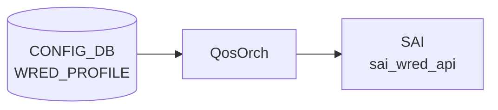

# WRED_PROFILE テーブル

## 概要

Weighted Random Early Detection ([WRED](../../reference/glossary.md#term-wred)) と ECN マーキングの設定プロファイルを定義する。`QUEUE` テーブルの `wred_profile` から名前で参照される[^1]。[orchagent](../../reference/glossary.md#term-orchagent) の `QosOrch` が [CONFIG_DB](../../reference/glossary.md#term-config_db) を購読し、[SAI](../../reference/glossary.md#term-sai) [WRED](../../reference/glossary.md#term-wred) オブジェクトに変換する。

<!-- cdb-mermaid -->
### データフロー (自動生成)



!!! note "凡例"
    CONFIG_DB から SAI までの典型経路を `docs/reference/config-db-orch-map.md` から機械生成したミニ図。詳細・例外は本ページ本文と対応表を参照。
<!-- /cdb-mermaid -->

## key 構造

```text
WRED_PROFILE|<name>
```

`<name>` は 1〜32 文字、英数字始まり。

## 主要フィールド

| フィールド | 型 | 既定 | 説明 |
|-----------|----|------|------|
| `green_min_threshold` / `yellow_min_threshold` / `red_min_threshold` | uint64 (bytes) | - | カラー別の [WRED](../../reference/glossary.md#term-wred) 開始閾値 |
| `green_max_threshold` / `yellow_max_threshold` / `red_max_threshold` | uint64 (bytes) | - | カラー別の最大閾値 (この値で全 drop) |
| `green_drop_probability` / `yellow_drop_probability` / `red_drop_probability` | uint64 (0..100) | 100 | 最大 drop 確率 [%] |
| `wred_green_enable` / `wred_yellow_enable` / `wred_red_enable` | boolean | false | カラー別 WRED 有効化 |
| `ecn` | enum | `ecn_none` | ECN マーキング対象色: `ecn_none`/`ecn_green`/`ecn_yellow`/`ecn_red`/`ecn_green_yellow`/`ecn_green_red`/`ecn_yellow_red`/`ecn_all` |

## 制約

- 各色の `max_threshold >= min_threshold` を `must` 制約で強制
- drop 確率は 0..100 の uint64 (パーセント単位)

## 購読者

- `orchagent` (`QosOrch`): [CONFIG_DB](../../reference/glossary.md#term-config_db) → [SAI](../../reference/glossary.md#term-sai) WRED → `QUEUE` への bind

## 関連 CONFIG_DB / YANG / CLI

- 関連 [CONFIG_DB](../../reference/glossary.md#term-config_db): `QUEUE`、`SCHEDULER`
- 関連 CLI: `config qos clear`、テンプレート起点の生成 (`buffers.json.j2`)
- 関連 [YANG](../../reference/glossary.md#term-yang): `sonic-wred-profile`

<!-- value-behavior -->
## 値依存挙動マトリクス

| フィールド | 値 | 実挙動 |
|-----------|-----|--------|
| `ecn` | `ecn_none` | `SAI_ECN_MARK_MODE_NONE`。ECN マーキングなし（デフォルト）|
| `ecn` | `ecn_green` | `SAI_ECN_MARK_MODE_GREEN`。緑パケットのみ ECN マーク |
| `ecn` | `ecn_yellow` | `SAI_ECN_MARK_MODE_YELLOW`。黄パケットのみ ECN マーク |
| `ecn` | `ecn_red` | `SAI_ECN_MARK_MODE_RED`。赤パケットのみ ECN マーク |
| `ecn` | `ecn_green_yellow` | `SAI_ECN_MARK_MODE_GREEN_YELLOW`。緑・黄をマーク |
| `ecn` | `ecn_green_red` | `SAI_ECN_MARK_MODE_GREEN_RED`。緑・赤をマーク |
| `ecn` | `ecn_yellow_red` | `SAI_ECN_MARK_MODE_YELLOW_RED`。黄・赤をマーク |
| `ecn` | `ecn_all` | `SAI_ECN_MARK_MODE_ALL`。全色 ECN マーク（DCQCN 等で推奨）|
| `wred_*_enable` | `true` | 指定色の WRED ドロップを有効化（フィールド定数: `wred_green_enable_field_name` / `wred_yellow_enable_field_name` / `wred_red_enable_field_name`、qosorch.h:40-42） |
| `wred_*_enable` | `false` | 無効（デフォルト）。閾値設定があっても drop しない |
| `wred_*_enable` | `"true"`/`"false"` 以外 | `SWSS_LOG_ERROR("Invalid input specified")` でエントリ破棄 |
| `*_drop_probability` | `0` | min threshold 到達時もドロップなし（ECN マーキングのみ使用する場合）|
| `*_drop_probability` | `100` | min〜max 間で線形ドロップ、max で全ドロップ（デフォルト）|
| `*_min_threshold` | bytes 値 | この Queue 深さからランダムドロップ開始 |
| `*_max_threshold` | bytes 値 | この Queue 深さで全パケットドロップ（100% drop）|
| `*_max_threshold` | `< min_threshold` | YANG `must` 違反で reject |

!!! note "閾値変更の 2 フェーズ適用"
    `orchagent` の `WredMapHandler` は閾値更新時に min/max の一時的な逆転を防ぐため、現在値と新値の比較から順序を決定して 2 段階で SAI に適用する（qosorch.cpp）。

<!-- /value-behavior -->

## 例外条件・特殊挙動 <!-- cdb-exceptions -->

<!-- evidence: sonic-swss/orchagent/qosorch.cpp (WredMapHandler); sonic-buildimage/src/sonic-yang-models/yang-models/sonic-wred-profile.yang -->

- **名前パターン (YANG)**: `pattern '[a-zA-Z0-9]{1}([-a-zA-Z0-9_]{0,31})'`、長さ 1〜32 文字 — 違反は `"Invalid length for wred profile name."` エラー[^exc2]。
- **max >= min 制約 (YANG)**: 各色の max threshold が min 以上である `must` 制約 — 違反は `"Yellow/Green/Red max threshold must be >= min threshold"` エラーで reject[^exc2]。
- **`convertBool` エラー**: `wred_green_enable` 等に `"true"` / `"false"` 以外の文字列が来た場合 `SWSS_LOG_ERROR("Invalid input specified")` を記録してエントリを破棄する[^exc1]。
- **threshold 2 フェーズ適用 (旧 SAI 互換)**: `WredMapHandler` は閾値変更時に「現在 min > 新 max」または「現在 max < 新 min」となる属性を deferred リストに後回しにし、残りを先に SAI に適用してから deferred を適用する。一部ベンダー SAI での順序エラーを回避するための特殊処理[^exc1]。
- **デフォルト補完 (YANG)**:
  - `ecn`: `default ecn_none`[^exc2]。
  - `wred_*_enable`: `default false`[^exc2]。
  - `*_drop_probability`: `default 100`（100%）[^exc2]。

[^exc1]: `sonic-swss/orchagent/qosorch.cpp` (WredMapHandler) <https://github.com/sonic-net/sonic-swss/blob/master/orchagent/qosorch.cpp>
[^exc2]: `sonic-buildimage/src/sonic-yang-models/yang-models/sonic-wred-profile.yang` <https://github.com/sonic-net/sonic-buildimage/blob/master/src/sonic-yang-models/yang-models/sonic-wred-profile.yang>

<!-- value-behavior -->
## `ecn` 値別挙動

YANG 定義 8 値 (sonic-wred-profile.yang)、default `ecn_none`。
実装 lookup map: `ecn_map` (qosorch.cpp:36-44)、フィールド定数: `ecn_field_name = "ecn"` (qosorch.h:55) → `SAI_WRED_ATTR_ECN_MARK_MODE` (qosorch.cpp:743)。
不正値 (`ecn_map.at()` が `std::out_of_range`) → エントリ破棄。

| 値 | SAI マッピング | マーキング対象色 | evidence |
|---|---|---|---|
| `ecn_none` (**既定**) | `SAI_ECN_MARK_MODE_NONE` | なし。ECN マーキング全無効 | `qosorch.cpp:37`, YANG:128 |
| `ecn_green` | `SAI_ECN_MARK_MODE_GREEN` | Green のみ。Yellow/Red は WRED drop のみ | `qosorch.cpp:38`, YANG |
| `ecn_yellow` | `SAI_ECN_MARK_MODE_YELLOW` | Yellow のみ。Green/Red は WRED drop のみ | `qosorch.cpp:39`, YANG |
| `ecn_red` | `SAI_ECN_MARK_MODE_RED` | Red のみ。Green/Yellow は WRED drop のみ | `qosorch.cpp:40`, YANG |
| `ecn_green_yellow` | `SAI_ECN_MARK_MODE_GREEN_YELLOW` | Green + Yellow。Red は WRED drop のみ | `qosorch.cpp:41`, YANG |
| `ecn_green_red` | `SAI_ECN_MARK_MODE_GREEN_RED` | Green + Red。Yellow は WRED drop のみ | `qosorch.cpp:42`, YANG |
| `ecn_yellow_red` | `SAI_ECN_MARK_MODE_YELLOW_RED` | Yellow + Red。Green は WRED drop のみ | `qosorch.cpp:43`, YANG |
| `ecn_all` | `SAI_ECN_MARK_MODE_ALL` | 全色 (Green + Yellow + Red) ECN マーキング有効 | `qosorch.cpp:44`, YANG:123 |

!!! note "ロスレス運用"
    RoCE / ロスレストラフィックでは `ecn_all` + `wred_*_enable=true` が典型設定。`ecn_none` では ECN 通知が発生しないためロスレス保証ができない。

### 複合条件

1. `ecn_none` + `wred_*_enable=true` — WRED drop は発生するが ECN マーキングなし。ベストエフォートの確率的 drop のみ。
2. `ecn_all` + `wred_*_enable=false` — ECN モードは設定されるが WRED 閾値に到達しない。実質 ECN 無効と同じ。
3. `ecn_green` + `wred_yellow_enable=true` — Yellow パケットは確率的に drop されるが ECN マーキングなし。Green パケットのみ ECN 通知。
4. **threshold 2 フェーズ適用**: 閾値変更時に「現在 min > 新 max」または「現在 max < 新 min」の属性は deferred リストに退避して後回し。`ecn` 変更と閾値変更が同時の場合、適用順序が通常と異なる (`qosorch.cpp:WredMapHandler`)。

### 値別 grep カバレッジ

| 値 | hit 数 | 証跡 |
|---|---|---|
| ecn_none | 3 | qosorch.cpp:37, yang(enum), yang(default) |
| ecn_green | 2 | qosorch.cpp:38, yang |
| ecn_yellow | 2 | qosorch.cpp:39, yang |
| ecn_red | 2 | qosorch.cpp:40, yang |
| ecn_green_yellow | 2 | qosorch.cpp:41, yang |
| ecn_green_red | 2 | qosorch.cpp:42, yang |
| ecn_yellow_red | 2 | qosorch.cpp:43, yang |
| ecn_all | 2 | qosorch.cpp:44, yang:123 |

全 8 値 hit。0 hit なし。
<!-- /value-behavior -->

<!-- derivation -->
## 派生・条件付き登録 (Phase 6/7)

### Phase 6: 自動派生

| 派生先フィールド | 派生元条件 | 派生値 | ソース |
|---|---|---|---|
| `ecn` | YANG `default` | `ecn_none` (フィールド省略時に自動補完) | `sonic-wred-profile.yang:128` |
| `wred_green_enable` / `wred_yellow_enable` / `wred_red_enable` | YANG `default` | `false` (フィールド省略時) | `sonic-wred-profile.yang` |
| `green_drop_probability` 等 | YANG `default` | `100` (%) (フィールド省略時) | `sonic-wred-profile.yang` |
| `WRED_PROFILE` エントリ全体 | `qos_config.j2` の静的テンプレート | `AZURE_LOSSLESS` プロファイル (`ecn=ecn_all`, 各閾値固定値) が自動生成 | `qos_config.j2:489-506` |
| `generate_wred_profiles` あり | ベンダー固有 j2 テンプレート定義 | プラットフォーム固有の WRED_PROFILE を生成 (標準の `AZURE_LOSSLESS` を置換) | `qos_config.j2:486-487` |
| `wred_profile` (QUEUE 側) | `qos_config.j2` QUEUE セクション | RoCE キュー (queue 3, 4 等) に `wred_profile=AZURE_LOSSLESS` を自動設定 | `qos_config.j2:514-660` |

**フォーマット変換 (db_migrator.py)**:

- 旧バージョンの CONFIG_DB では `wred_profile` の値が `|AZURE_LOSSLESS|` ABNF 形式で格納。
- `db_migrator.py:574-585` のマイグレーションステップでプレーン文字列 `AZURE_LOSSLESS` に変換。

### Phase 7: 条件付き登録

| 条件 | 影響 | ソース |
|---|---|---|
| `QosOrch` は常時登録 (platform / capability 非依存) | `CFG_WRED_PROFILE_TABLE_NAME` 購読は無条件 | `orchdaemon.cpp:375,384` |
| `gMySwitchType == "voq"` | `applyWredProfileToQueue()` が VoQ ID を使用 (物理キューではなく VoQ に適用) | `qosorch.cpp:1709-1730` |
| `QUEUE.wred_profile` 未解決 | `task_need_retry` → WRED_PROFILE エントリ登録後に再試行 | `qosorch.cpp:1864-1870` |

### グレップカバレッジ

| 項目 | hit 数 | 証跡 |
|---|---|---|
| `ecn` YANG default | 1 | `sonic-wred-profile.yang:128` |
| `AZURE_LOSSLESS` 自動生成 | 2 | `qos_config.j2:489,514-660` |
| `generate_wred_profiles` 条件 | 1 | `qos_config.j2:486` |
| db_migrator `wred_profile` 変換 | 1 | `db_migrator.py:575` |
| `applyWredProfileToQueue` VoQ 分岐 | 2 | `qosorch.cpp:1709,1716-1722` |
| `task_need_retry` (未解決) | 1 | `qosorch.cpp:1869` |

<!-- /derivation -->

<!-- handler-branching -->
### Phase 8: Handler メソッド内分岐

WRED_PROFILE は `WredMapHandler::convertFieldValuesToAttributes()` がフィールド値を解釈し SAI 属性リストに変換する。

| Handler | メソッド | 分岐条件 | 効果 | evidence |
|---|---|---|---|---|
| `WredMapHandler` | `convertFieldValuesToAttributes()` | `fvField == ecn_field_name` | `ecn_map.at(fvValue)` で `SAI_WRED_ATTR_ECN_MARK_MODE` を設定、未知値は `std::out_of_range` 例外 → エントリ破棄 | `sonic-swss/orchagent/qosorch.cpp:741-746` |
| `WredMapHandler` | `convertFieldValuesToAttributes()` | `fvField IN [wred_green_enable, wred_yellow_enable, wred_red_enable]` | `convertBool()` 失敗（`"true"/"false"` 以外）→ `SWSS_LOG_ERROR` + `return false`（エントリ破棄） | `sonic-swss/orchagent/qosorch.cpp:714-739` |
| `WredMapHandler` | `convertFieldValuesToAttributes()` | `storedProfile.yellow_min_threshold > threshold` (新 max < 旧 min) | 閾値変更を deferred リストへ退避（2 フェーズ適用、先に反対側を SAI に投入して min>max 違反を回避）| `sonic-swss/orchagent/qosorch.cpp:636-644` |
| `WredMapHandler` | `convertFieldValuesToAttributes()` | `currentProfile.green_min_threshold > currentProfile.green_max_threshold` (いずれかの色で) | `SWSS_LOG_ERROR("Wrong wred profile: min > max")` + `return false` → エントリ破棄 | `sonic-swss/orchagent/qosorch.cpp:754-760` |
| `WredMapHandler` | `addQosItem()` | `wred_enable_set & GREEN_WRED_ENABLED` かつ `drop_prob_set` に green なし | `SAI_WRED_ATTR_GREEN_DROP_PROBABILITY = 100` を自動補完 | `sonic-swss/orchagent/qosorch.cpp:836-840` |
| `WredMapHandler` | `addQosItem()` | 同上 yellow / red 各色 | `SAI_WRED_ATTR_YELLOW/RED_DROP_PROBABILITY = 100` を自動補完 | `sonic-swss/orchagent/qosorch.cpp:842-850` |

> **スキャン証跡**: `convertFieldValuesToAttributes()` L585-762 全行読了（34 フィールド if-elif 連鎖）、`addQosItem()` L784-860 読了。6 件分岐抽出。`ecn` 値の dispatch は `ecn_map.at()` ルックアップテーブル形式。Phase 6/7 derivation ブロック再確認: YANG default / qos_config.j2 AZURE_LOSSLESS 生成 / VoQ applyWredProfileToQueue — 実ソースと整合、誤読なし。

<!-- /handler-branching -->

<!-- ref-triangle:start -->

## 関連リファレンス

- [YANG](../../reference/glossary.md#term-yang): [`sonic-wred-profile`](../yang/sonic-wred-profile.md)
- CLI: [`config qos`](../cli/config-qos.md)

<!-- ref-triangle:end -->

## 引用元

[^1]: [YANG](../../reference/glossary.md#term-yang) 定義: `sonic-wred-profile.yang`. <https://github.com/sonic-net/sonic-buildimage/blob/9ea932ec2e18f35e58268ec2e4456b1d4afd65cd/src/sonic-yang-models/yang-models/sonic-wred-profile.yang>

<!-- topics-back-ref -->
## 関連 Topics

- [Topics: QoS / Buffer / PFC / Watermark](../../topics/08-qos-buffer/index.md)

<!-- /topics-back-ref -->

<!-- ops-hint -->
## 運用ヒント

### 典型値

- key 形式: `WRED_PROFILE|<name>`。
- `ecn`: `ecn_all` / `ecn_green` / `ecn_none`。
- `*_min_threshold` / `*_max_threshold` / `*_drop_probability`。

### よくある誤設定

- min > max に設定すると [SAI](../../reference/glossary.md#term-sai) がエラーを返し、profile が hardware に下りない。

### 確認コマンド

```bash
sonic-db-cli CONFIG_DB hgetall 'WRED_PROFILE|AZURE_LOSSY'
show wred
```
<!-- /ops-hint -->

<!-- glossary-links-injected: 7c1942297ce7 -->
