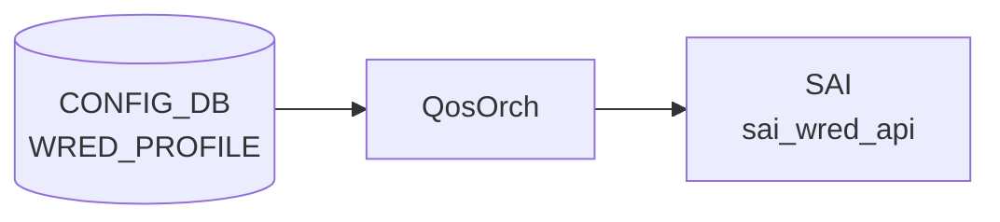

# WRED_PROFILE テーブル

## 概要

Weighted Random Early Detection ([WRED](../../reference/glossary.md#term-wred)) と ECN マーキングの設定プロファイルを定義する。`QUEUE` テーブルの `wred_profile` から名前で参照される[^1]。[orchagent](../../reference/glossary.md#term-orchagent) の `QosOrch` が [CONFIG_DB](../../reference/glossary.md#term-config_db) を購読し、[SAI](../../reference/glossary.md#term-sai) [WRED](../../reference/glossary.md#term-wred) オブジェクトに変換する。

<!-- cdb-mermaid -->
### データフロー (自動生成)



!!! note "凡例"
    CONFIG_DB から SAI までの典型経路を `docs/reference/config-db-orch-map.md` から機械生成したミニ図。詳細・例外は本ページ本文と対応表を参照。
<!-- /cdb-mermaid -->

## key 構造

```text
WRED_PROFILE|<name>
```

`<name>` は 1〜32 文字、英数字始まり。

## 主要フィールド

| フィールド | 型 | 既定 | 説明 |
|-----------|----|------|------|
| `green_min_threshold` / `yellow_min_threshold` / `red_min_threshold` | uint64 (bytes) | - | カラー別の [WRED](../../reference/glossary.md#term-wred) 開始閾値 |
| `green_max_threshold` / `yellow_max_threshold` / `red_max_threshold` | uint64 (bytes) | - | カラー別の最大閾値 (この値で全 drop) |
| `green_drop_probability` / `yellow_drop_probability` / `red_drop_probability` | uint64 (0..100) | 100 | 最大 drop 確率 [%] |
| `wred_green_enable` / `wred_yellow_enable` / `wred_red_enable` | boolean | false | カラー別 WRED 有効化 |
| `ecn` | enum | `ecn_none` | ECN マーキング対象色: `ecn_none`/`ecn_green`/`ecn_yellow`/`ecn_red`/`ecn_green_yellow`/`ecn_green_red`/`ecn_yellow_red`/`ecn_all` |

## 制約

- 各色の `max_threshold >= min_threshold` を `must` 制約で強制
- drop 確率は 0..100 の uint64 (パーセント単位)

## 購読者

- `orchagent` (`QosOrch`): [CONFIG_DB](../../reference/glossary.md#term-config_db) → [SAI](../../reference/glossary.md#term-sai) WRED → `QUEUE` への bind

## 関連 CONFIG_DB / YANG / CLI

- 関連 [CONFIG_DB](../../reference/glossary.md#term-config_db): `QUEUE`、`SCHEDULER`
- 関連 CLI: `config qos clear`、テンプレート起点の生成 (`buffers.json.j2`)
- 関連 [YANG](../../reference/glossary.md#term-yang): `sonic-wred-profile`

<!-- value-behavior -->
## 値依存挙動マトリクス

| フィールド | 値 | 実挙動 |
|-----------|-----|--------|
| `ecn` | `ecn_none` | `SAI_ECN_MARK_MODE_NONE`。ECN マーキングなし（デフォルト）|
| `ecn` | `ecn_green` | `SAI_ECN_MARK_MODE_GREEN`。緑パケットのみ ECN マーク |
| `ecn` | `ecn_yellow` | `SAI_ECN_MARK_MODE_YELLOW`。黄パケットのみ ECN マーク |
| `ecn` | `ecn_red` | `SAI_ECN_MARK_MODE_RED`。赤パケットのみ ECN マーク |
| `ecn` | `ecn_green_yellow` | `SAI_ECN_MARK_MODE_GREEN_YELLOW`。緑・黄をマーク |
| `ecn` | `ecn_green_red` | `SAI_ECN_MARK_MODE_GREEN_RED`。緑・赤をマーク |
| `ecn` | `ecn_yellow_red` | `SAI_ECN_MARK_MODE_YELLOW_RED`。黄・赤をマーク |
| `ecn` | `ecn_all` | `SAI_ECN_MARK_MODE_ALL`。全色 ECN マーク（DCQCN 等で推奨）|
| `wred_*_enable` | `true` | 指定色の WRED ドロップを有効化 |
| `wred_*_enable` | `false` | 無効（デフォルト）。閾値設定があっても drop しない |
| `wred_*_enable` | `"true"`/`"false"` 以外 | `SWSS_LOG_ERROR("Invalid input specified")` でエントリ破棄 |
| `*_drop_probability` | `0` | min threshold 到達時もドロップなし（ECN マーキングのみ使用する場合）|
| `*_drop_probability` | `100` | min〜max 間で線形ドロップ、max で全ドロップ（デフォルト）|
| `*_min_threshold` | bytes 値 | この Queue 深さからランダムドロップ開始 |
| `*_max_threshold` | bytes 値 | この Queue 深さで全パケットドロップ（100% drop）|
| `*_max_threshold` | `< min_threshold` | YANG `must` 違反で reject |

!!! note "閾値変更の 2 フェーズ適用"
    `orchagent` の `WredMapHandler` は閾値更新時に min/max の一時的な逆転を防ぐため、現在値と新値の比較から順序を決定して 2 段階で SAI に適用する（qosorch.cpp）。

<!-- /value-behavior -->

## 例外条件・特殊挙動 <!-- cdb-exceptions -->

<!-- evidence: sonic-swss/orchagent/qosorch.cpp (WredMapHandler); sonic-buildimage/src/sonic-yang-models/yang-models/sonic-wred-profile.yang -->

- **名前パターン (YANG)**: `pattern '[a-zA-Z0-9]{1}([-a-zA-Z0-9_]{0,31})'`、長さ 1〜32 文字 — 違反は `"Invalid length for wred profile name."` エラー[^exc2]。
- **max >= min 制約 (YANG)**: 各色の max threshold が min 以上である `must` 制約 — 違反は `"Yellow/Green/Red max threshold must be >= min threshold"` エラーで reject[^exc2]。
- **`convertBool` エラー**: `wred_green_enable` 等に `"true"` / `"false"` 以外の文字列が来た場合 `SWSS_LOG_ERROR("Invalid input specified")` を記録してエントリを破棄する[^exc1]。
- **threshold 2 フェーズ適用 (旧 SAI 互換)**: `WredMapHandler` は閾値変更時に「現在 min > 新 max」または「現在 max < 新 min」となる属性を deferred リストに後回しにし、残りを先に SAI に適用してから deferred を適用する。一部ベンダー SAI での順序エラーを回避するための特殊処理[^exc1]。
- **デフォルト補完 (YANG)**:
  - `ecn`: `default ecn_none`[^exc2]。
  - `wred_*_enable`: `default false`[^exc2]。
  - `*_drop_probability`: `default 100`（100%）[^exc2]。

[^exc1]: `sonic-swss/orchagent/qosorch.cpp` (WredMapHandler) <https://github.com/sonic-net/sonic-swss/blob/master/orchagent/qosorch.cpp>
[^exc2]: `sonic-buildimage/src/sonic-yang-models/yang-models/sonic-wred-profile.yang` <https://github.com/sonic-net/sonic-buildimage/blob/master/src/sonic-yang-models/yang-models/sonic-wred-profile.yang>

<!-- ref-triangle:start -->

## 関連リファレンス

- [YANG](../../reference/glossary.md#term-yang): [`sonic-wred-profile`](../yang/sonic-wred-profile.md)
- CLI: [`config qos`](../cli/config-qos.md)

<!-- ref-triangle:end -->

## 引用元

[^1]: [YANG](../../reference/glossary.md#term-yang) 定義: `sonic-wred-profile.yang`. <https://github.com/sonic-net/sonic-buildimage/blob/9ea932ec2e18f35e58268ec2e4456b1d4afd65cd/src/sonic-yang-models/yang-models/sonic-wred-profile.yang>

<!-- topics-back-ref -->
## 関連 Topics

- [Topics: QoS / Buffer / PFC / Watermark](../../topics/08-qos-buffer/index.md)

<!-- /topics-back-ref -->

<!-- ops-hint -->
## 運用ヒント

### 典型値

- key 形式: `WRED_PROFILE|<name>`。
- `ecn`: `ecn_all` / `ecn_green` / `ecn_none`。
- `*_min_threshold` / `*_max_threshold` / `*_drop_probability`。

### よくある誤設定

- min > max に設定すると [SAI](../../reference/glossary.md#term-sai) がエラーを返し、profile が hardware に下りない。

### 確認コマンド

```bash
sonic-db-cli CONFIG_DB hgetall 'WRED_PROFILE|AZURE_LOSSY'
show wred
```
<!-- /ops-hint -->

<!-- glossary-links-injected: 7c1942297ce7 -->
