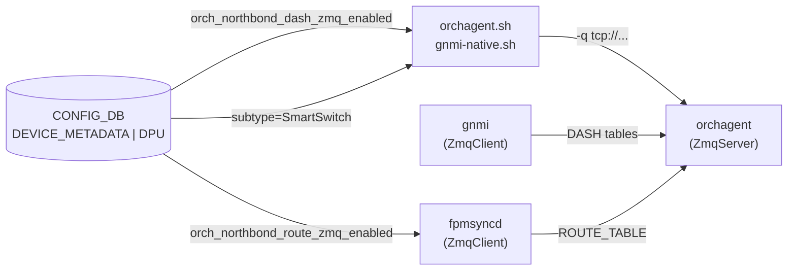

# ZMQ 関連 CONFIG_DB フィールド (DEVICE_METADATA / DPU)

## 概要

SONiC の **northbound ZMQ チャネル**は orchagent が gNMI / fpmsyncd 等の上位コンポーネントから
APPL_DB テーブルへの書き込みを直接受け取るための ZeroMQ ベースの高スループット通信路。

ZMQ に関連する [CONFIG_DB](../../reference/glossary.md#term-config_db) フィールドは独立テーブルを持たず、
既存の `DEVICE_METADATA|localhost` エントリおよび SmartSwitch 専用の `DPU|<name>` エントリに分散して保持される。

<!-- cdb-mermaid -->
### データフロー (自動生成)



!!! note "凡例"
    CONFIG_DB から orchagent ZMQ サーバへの典型経路。詳細・例外は本文と関連ページを参照。
<!-- /cdb-mermaid -->

<!-- defaults -->
## コード由来デフォルト

ZMQ 関連フィールドはいずれも YANG `default` 文を持たず、コード内のフォールバック値が実効デフォルトとなる。

| フィールド | CONFIG_DB キー | コード由来デフォルト | 根拠コード |
|-----------|--------------|-------------------|-----------|
| `orch_northbond_dash_zmq_enabled` | `DEVICE_METADATA\|localhost` | `true` (不在 = DASH ZMQ 有効) | `orchdaemon.cpp:1329` — `get_feature_status(..., true)` |
| `orch_northbond_route_zmq_enabled` | `DEVICE_METADATA\|localhost` | `false` (不在 = ROUTE ZMQ 無効) | `routesync.cpp:155` — `create_local_zmq_client(..., false)` |
| `orchagent_zmq_port` | `DPU\|<name>` | なし (YANG optional) | `sonic-smart-switch.yang:176` — `type inet:port-number` のみ |

システムレベルのポート定数 `ORCH_ZMQ_PORT = 8100` は CONFIG_DB フィールドではなく
`sonic-swss-common/common/zmqserver.h:16` にハードコードされている[^zmq_port]。
<!-- /defaults -->

<!-- ordering -->
## 書込み順依存 (Phase B)

ZMQ 関連フィールドは orchagent **起動時の一回のみ** 読まれる。以下の順序依存が存在する。

### 検出された順序依存

| # | 依存関係 | 方向 | 備考 |
|---|----------|------|------|
| 1 | `orch_northbond_*_zmq_enabled` の CONFIG_DB 書き込み → orchagent 再起動 | **起動前必須** | runtime 変更は無効。orchdaemon コンストラクタ内で一度だけ読まれる |
| 2 | 全 ZmqConsumerStateTable ハンドラ登録 → `ZmqServer::bind()` | 強制先行（lazy bind で自動保証） | bind 前に送信側が接続しても `ECONNREFUSED` |
| 3 | orchagent の `bind()` 完了 → fpmsyncd / gnmi の ZmqClient 接続 | orchagent 先行 | fpmsyncd は `routesync.cpp:155` で ZmqClient を起動時に固定 |
| 4 | `ORCH_NORTHBOND_ROUTE_ZMQ_ENABLED` 読み取り → `RouteOrch` 生成 | 1 回限り（init 内） | 変更には orchagent 再起動が必要。以後の runtime 書き換えは無視 |
| 5 | DASH ZMQ 有効 → DashXxxOrch 群を同一 `zmq_server` 共有で直列生成 | `DpuOrchDaemon::init()` 内で直列 | 全 DASH orch は同一 ZmqServer インスタンスを参照 |

### 主要な制約詳細

**CONFIG_DB 読み取りは起動時の一回のみ (依存 #1, #4)**: `get_feature_status()` (`orch_zmq_config.cpp:81-104`) は orchagent 起動時に `DEVICE_METADATA|localhost` から直接 `hget` してフラグを決定する。`OrchDaemon` コンストラクタ内 (`orchdaemon.cpp:334`, `1329`) で呼ばれ、以降はテーブル変更を購読しない。そのため `orch_northbond_dash_zmq_enabled` / `orch_northbond_route_zmq_enabled` を runtime に書き換えても、orchagent を再起動しない限り反映されない。

**lazy bind による「ハンドラ登録 → bind」順序保証 (依存 #2)**: `create_zmq_server()` (`orch_zmq_config.cpp:64-79`) は lazy bind モード (`lazy=true`) で `ZmqServer` を生成し、`main.cpp:1036` で全ハンドラ登録完了後に初めて `bind()` を呼ぶ。これにより「ハンドラ未登録状態で ZMQ メッセージを受信してドロップする」競合を防ぐ。起動シーケンスは固定: `create_zmq_server()` → `orchDaemon->init()` (全ハンドラ登録) → `zmq_server->bind()` → `orchDaemon->start()` の順（evidence: `main.cpp:646-654`, `main.cpp:1032-1040`）。

**ZmqConsumer の ordered キューと順序保証 (依存 #5)**: `ZmqOrch::addConsumer()` (`zmqorch.cpp:59-78`) は `orderedQueue=true` のとき `ZmqConsumerStateTable` を ordered モードで生成する。ordered モードでは `execute()` がエントリを `m_queue` に蓄積し、`drain()` で `doTask()` を呼ぶことで同一テーブル内の SET/DEL 順序が保たれる。非 ordered モードは従来の `m_toSync` を使う（evidence: `zmqorch.cpp:8-33`）。

<!-- /ordering -->

<!-- cross-refs -->
## 暗黙参照マップ (Phase C)

<!-- evidence: sonic-swss/lib/orch_zmq_config.cpp; sonic-swss/orchagent/orchdaemon.cpp; sonic-swss/fpmsyncd/routesync.cpp; sonic-buildimage/dockers/docker-orchagent/orch_zmq_tables.conf.j2 -->

ZMQ 関連フィールドは独立テーブルを持たず `DEVICE_METADATA|localhost` / `DPU|<name>` に分散している。それぞれが参照先・参照元となる外部テーブルとの関係を示す。

| 参照方向 | このフィールド | 相手テーブル / ページ | 条件 |
|---------|--------------|---------------------|------|
| → DEVICE_METADATA 読み取り | `orch_northbond_dash_zmq_enabled` | [`DEVICE_METADATA`](device-metadata.md) | `get_feature_status(ORCH_NORTHBOND_DASH_ZMQ_ENABLED, true)` が起動時に CONFIG_DB `DEVICE_METADATA\|localhost` を直接 `hget`。存在しない場合は `true` (DASH ZMQ 有効) (`orch_zmq_config.cpp:88`) |
| → DEVICE_METADATA 読み取り | `orch_northbond_route_zmq_enabled` | [`DEVICE_METADATA`](device-metadata.md) | `create_local_zmq_client(ORCH_NORTHBOND_ROUTE_ZMQ_ENABLED, false)` が同様に `hget`。存在しない場合は `false` (ROUTE ZMQ 無効) (`routesync.cpp:155`) |
| → DPU 読み取り | `orchagent_zmq_port` | [`dpu`](dpu.md) | `gnmi-native.sh` / `orchagent.sh` が `DPU\|<name>` の `orchagent_zmq_port` を読み取り ZMQ 接続ポートを決定。YANG 定義: `sonic-smart-switch.yang:176-179` |
| DEVICE_METADATA → | `subtype == "SmartSwitch"` | [`smart-switch`](smart-switch.md) | `orchagent.sh` が `subtype` を参照して ZMQ アドレスを `tcp://eth0-midplane` または `tcp://127.0.0.1` に切り替える (`orchagent.sh:105-118`) |
| DEVICE_METADATA → | `switch_type == "dpu"` | [`smart-switch`](smart-switch.md) | `orchagent.sh:38-39` が `switch_type` を参照して `-z zmq_sync -k 65536` を orchagent 起動引数に付与。ZMQ 同期モードが強制される |
| フラグ有効 → APPL_DB 書き込み先 | `orch_northbond_dash_zmq_enabled=true` | APPL_DB `DASH_*` テーブル群 (22 種) | `orch_zmq_tables.conf.j2` で conf に追記された DASH テーブル群が ZMQ 経由でオーケストレータに直接届く。無効時は gNMI が Redis ProducerStateTable を使用 |
| フラグ有効 → APPL_DB 書き込み先 | `orch_northbond_route_zmq_enabled=true` | APPL_DB `ROUTE_TABLE` / `LABEL_ROUTE_TABLE` | `fpmsyncd` が `ZmqProducerStateTable` 経由で直接 orchagent に送信。無効時は Redis 経由 (`orch_zmq_config.cpp:117-140`) |
| 設定ファイル生成 | `orch_northbond_dash_zmq_enabled` / `orch_northbond_route_zmq_enabled` | `/etc/swss/orch_zmq_tables.conf` | `orch_zmq_tables.conf.j2` の Jinja2 テンプレートが CONFIG_DB のフラグを参照して実行時設定ファイルを生成。orchagent の `load_zmq_tables()` がこのファイルを読む (`orch_zmq_config.cpp:18-33`) |

> **ポイント**: `orch_northbond_*_zmq_enabled` フラグは orchagent **起動時** のみ評価され、その後 `DEVICE_METADATA` の変更をサブスクライブしない。フラグを変更した場合は orchagent の再起動が必要。`orchagent.sh` は起動シェルスクリプトであるため、フラグ変更後のコンテナ再起動で新しい設定ファイルが生成され、新しい orchagent プロセスが新設定で起動する。

<!-- /cross-refs -->

<!-- failure -->
## 失敗挙動 (Phase D)

> 調査対象: `sonic-swss/lib/orch_zmq_config.cpp`, `sonic-swss-common/common/zmqserver.cpp`, `sonic-swss-common/common/zmqclient.cpp`, `sonic-swss/orchagent/main.cpp`
> 調査日: 2026-05-19

ZMQ 関連の失敗は大きく「CONFIG_DB 読み取り失敗」「ZmqServer 起動・受信失敗」「ZmqClient 送信失敗」の 3 系統に分かれる。

### A. `get_feature_status()` — CONFIG_DB 読み取り失敗

`get_feature_status()` (`orch_zmq_config.cpp:83-110`) は `std::runtime_error` を捕捉し、
エラーログを出力した後に `default_value` を返す。Redis 接続エラー等で `hget` が失敗しても
orchagent は起動を継続し、ZMQ チャネルの有効/無効はデフォルト値に固定される。
**retry や再読み取りは行われない**。

| フィールド | 読み取り失敗時の動作 | デフォルト値 |
|-----------|------------------|------------|
| `orch_northbond_dash_zmq_enabled` | ERROR ログ → デフォルトで DASH ZMQ 有効 | `true` |
| `orch_northbond_route_zmq_enabled` | ERROR ログ → デフォルトで ROUTE ZMQ 無効 | `false` |

### B. `get_zmq_port()` — NAMESPACE_ID パース失敗

`NAMESPACE_ID` 環境変数が整数でない場合、`stoi()` 例外を `catch(...)` で捕捉して
ERROR ログを出力し、デフォルトポート `ORCH_ZMQ_PORT = 8100` にフォールバックする。
orchagent は継続動作する（evidence: `orch_zmq_config.cpp:47-50`）。

### C. `ZmqServer::bind()` 失敗 → `SWSS_LOG_THROW` → プロセス abort

`zmq_bind()` が失敗した場合（`EADDRINUSE` 等）`SWSS_LOG_THROW` が例外を投げる。
`main.cpp` には `zmq_server->bind()` を包む try/catch がないため、例外は
`main()` まで伝播して orchagent プロセスが終了し、systemd が再起動する。
二重 bind も同様に THROW する（evidence: `zmqserver.cpp:67-125`, `main.cpp:1032-1037`）。

### D. ZmqServer 受信スレッド失敗 → メッセージ DROP

| 失敗ケース | コード根拠 | 動作 |
|-----------|---------|------|
| `zmq_recv` 失敗 | `zmqserver.cpp:233` | `SWSS_LOG_THROW` → 受信スレッド終了 → ZMQ 受信不可 |
| 受信バッファ超過 | `zmqserver.cpp:239` | `SWSS_LOG_THROW` + メッセージ DROP（再送なし） |
| ハンドラ未登録テーブル | `zmqserver.cpp:173` | `SWSS_LOG_WARN` + メッセージ DROP |

受信スレッドが終了した場合、orchagent は再起動するまで ZMQ メッセージを処理できない。
Redis 経由の通常経路へのフォールバックは行われない。

### E. `ZmqClient::sendMsg()` — 送信失敗と retry (fpmsyncd / gnmi 側)

送信側（fpmsyncd / gnmi）で `ZmqClient::sendMsg()` が失敗した場合の挙動:

| ZMQ エラー | 挙動 | evidence |
|-----------|------|---------|
| `EAGAIN`（socket not ready） | 即時 retry（バックオフなし） | `zmqclient.cpp:209-211` |
| HWM 超過 | WARN + 指数バックオフ retry（10ms→20ms→…） | `zmqclient.cpp:216-217` |
| 接続断（`m_connected=false`） | ERROR + `system_error(connection_reset)` throw | `zmqclient.cpp:220-223` |
| その他送信エラー | ERROR + `system_error(io_error)` throw | `zmqclient.cpp:227-230` |
| retry 上限超過 | ERROR + `system_error(io_error)` throw | `zmqclient.cpp:238-239` |

`system_error` が fpmsyncd/gnmi まで伝播すると各プロセスが abort → systemd 再起動。
orchagent 自体はクライアント側の送信失敗を直接検出しない。

### まとめ: 失敗ケース一覧

| 失敗ケース | コード根拠 | 動作 |
|-----------|---------|------|
| CONFIG_DB `hget` 失敗（Redis 接続エラー） | `orch_zmq_config.cpp:93-97` | ERROR ログ → default_value 返却 → orchagent 継続 |
| `NAMESPACE_ID` 非整数 | `orch_zmq_config.cpp:47-50` | ERROR ログ → port=8100 フォールバック |
| `zmq_bind` 失敗（`EADDRINUSE` 等） | `zmqserver.cpp:115-120` | THROW → orchagent abort → systemd 再起動 |
| ZmqServer 二重 bind | `zmqserver.cpp:71-73` | THROW → orchagent abort |
| `zmq_recv` 失敗（受信スレッド） | `zmqserver.cpp:233` | THROW → 受信スレッド終了 → ZMQ 受信不可 |
| バッファ超過（受信） | `zmqserver.cpp:239` | THROW + メッセージ DROP |
| ハンドラ未登録メッセージ | `zmqserver.cpp:173` | WARN + メッセージ DROP |
| `zmq_connect` 失敗（クライアント側） | `zmqclient.cpp:144-145` | THROW → fpmsyncd/gnmi abort → systemd 再起動 |
| 接続断（送信中） | `zmqclient.cpp:220-223` | ERROR + `system_error` throw → プロセス abort |
| 送信 retry 上限超過 | `zmqclient.cpp:238-239` | ERROR + `system_error` throw → プロセス abort |

<!-- /failure -->

<!-- side-effects -->
## 副次 DB 書込 (Phase F)

<!-- evidence: sonic-swss/lib/orch_zmq_config.cpp; sonic-buildimage/dockers/docker-orchagent/docker-init.j2; sonic-buildimage/dockers/docker-orchagent/orch_zmq_tables.conf.j2 -->

ZMQ 関連フィールド (`orch_northbond_dash_zmq_enabled` / `orch_northbond_route_zmq_enabled` / `orchagent_zmq_port`) の CONFIG_DB 書き込みは **orchagent コンテナの再起動時にのみ反映** される。実行中の orchagent はこれらのフィールドを購読せず、DB への副次書き込みも発生しない。

### 副次書込先サマリ

| 副次書込先 | テーブル / ファイル | 書込者 | 発生タイミング |
|---|---|---|---|
| ファイルシステム | `/etc/swss/orch_zmq_tables.conf` | `sonic-cfggen` (`docker-init.j2`) | orchagent コンテナ起動時 |
| APPL_DB | なし | — | 購読なし・直接書込なし |
| STATE_DB | なし | — | 購読なし・直接書込なし |
| ASIC_DB | なし | — | SAI 非経由 |

### `/etc/swss/orch_zmq_tables.conf` 生成

`docker-init.j2` がコンテナ起動時に `sonic-cfggen -d -t orch_zmq_tables.conf.j2,/etc/swss/orch_zmq_tables.conf` を実行し、CONFIG_DB の現在値から設定ファイルを生成する。

```
CONFIG_DB (DEVICE_METADATA|localhost)
  orch_northbond_dash_zmq_enabled   ─┐
  orch_northbond_route_zmq_enabled  ─┤→ sonic-cfggen (orch_zmq_tables.conf.j2)
                                      └→ /etc/swss/orch_zmq_tables.conf
                                              ↓
                                         orchagent 起動 (main.cpp:load_zmq_tables())
                                              ↓
                                     ZmqConsumerStateTable 登録テーブル決定
```

`orch_zmq_tables.conf` に含まれるテーブル名の一覧:
- `orch_northbond_dash_zmq_enabled != "false"` のとき: DASH_VNET_TABLE 等 24 種の DASH テーブルを追記
- `orch_northbond_route_zmq_enabled == "true"` のとき: `ROUTE_TABLE` / `LABEL_ROUTE_TABLE` を追記

orchagent の `load_zmq_tables()` (`orch_zmq_config.cpp:18-33`) がコンテナ起動直後にこのファイルを読み込み、ZMQ 受信対象テーブルを確定する。**実行中の CONFIG_DB 変更はファイルに反映されない**。

### APPL_DB への間接的な経路変化

フラグ有効時、上位コンポーネント (gNMI / fpmsyncd) は Redis `ProducerStateTable` の代わりに `ZmqProducerStateTable` を使って APPL_DB の同一テーブルに書き込む。APPL_DB テーブル自体のスキーマは変わらないが、書き込み経路が Redis Pub/Sub から ZMQ TCP ソケットに切り替わる。

| フラグ | APPL_DB 書込み経路 |
|---|---|
| `orch_northbond_dash_zmq_enabled=true` (デフォルト) | gNMI → ZmqProducerStateTable → orchagent (ZMQ) |
| `orch_northbond_dash_zmq_enabled=false` | gNMI → ProducerStateTable → APPL_DB → orchagent (Redis Pub/Sub) |
| `orch_northbond_route_zmq_enabled=true` | fpmsyncd → ZmqProducerStateTable → orchagent (ZMQ) |
| `orch_northbond_route_zmq_enabled=false` (デフォルト) | fpmsyncd → ProducerStateTable → APPL_DB → orchagent (Redis Pub/Sub) |

> **注意**: ZMQ 経路では APPL_DB Redis には書き込まれず、メッセージが orchagent に直接届く。`sonic-db-cli APPL_DB keys 'DASH_*'` で確認した場合、ZMQ 有効時は APPL_DB に対応するレコードが存在しないことがある。

<!-- /side-effects -->

<!-- pubsub -->
## 通信メカニズム (Phase G)

ZMQ 関連 CONFIG_DB フィールドは orchagent **起動時の一回のみ** `hget` で読まれる。`SubscriberStateTable` / `ConsumerStateTable` による購読は行われない。また、これらのフィールドが `true` に設定されると、対象 APPL_DB テーブルへの書き込み経路が Redis Pub/Sub から **ZeroMQ TCP ソケット**に切り替わるという特殊な構造を持つ。

### CONFIG_DB 読み取り方式 — 購読なし

```cpp
// sonic-swss/lib/orch_zmq_config.cpp:88
enabled = config_db.hget("DEVICE_METADATA|localhost", feature);
```

`orchdaemon.cpp:334` (route zmq) および `orchdaemon.cpp:1329` (dash zmq) が `get_feature_status()` 経由でこのパスを通る。orchagent は DEVICE_METADATA テーブルを ZMQ フラグのために購読しない。フィールド変更を orchagent に反映するにはコンテナ再起動が必要。

| 項目 | 値 |
|------|----|
| 購読クラス | **なし**（`hget` による起動時スナップショット読み取りのみ） |
| 変更の反映 | orchagent コンテナ再起動時のみ |
| TTL | CONFIG_DB 全エントリで未設定（永続前提） |

### ZMQ が置き換える Redis Pub/Sub 経路

`orch_northbond_*_zmq_enabled` を `true` にすると、当該 APPL_DB テーブルへの書き込み経路が Redis Pub/Sub から ZeroMQ TCP ソケットに切り替わる。

| フラグ | Redis 経路（無効時） | ZMQ 経路（有効時） |
|--------|------------------|----------------|
| `orch_northbond_dash_zmq_enabled=true` (デフォルト有効) | gNMI → ProducerStateTable → APPL_DB → ConsumerStateTable | gNMI → ZmqProducerStateTable → ZmqServer (TCP:8100) → ZmqConsumerStateTable |
| `orch_northbond_route_zmq_enabled=true` | fpmsyncd → ProducerStateTable → APPL_DB → ConsumerStateTable | fpmsyncd → ZmqProducerStateTable → ZmqServer (TCP:8100) → ZmqConsumerStateTable |

ZMQ 経路では Redis チャンネルへの `PUBLISH` は発生せず、APPL_DB に対応エントリが書き込まれない場合がある。

### ZmqConsumerStateTable と ConsumerStateTable の比較

orchagent 側は `ZmqConsumerStateTable` で ZMQ メッセージを受信する。`load_zmq_tables()` (`orch_zmq_config.cpp:18-33`) が起動時に `/etc/swss/orch_zmq_tables.conf` を読み込み、テーブルごとに `ZmqConsumerStateTable` を登録する。

| 項目 | ConsumerStateTable (Redis) | ZmqConsumerStateTable (ZMQ) |
|------|--------------------------|---------------------------|
| トランスポート | Redis keyspace 通知 / PUBLISH | ZeroMQ TCP ソケット (lazy bind `zmqserver.h`) |
| バッチサイズ | `gBatchSize` (既定 128) | `DEFAULT_POP_BATCH_SIZE = 128` (`zmqserver.h:31`) |
| HWM | なし (Redis) | `MQ_WATERMARK = 10000` (`zmqserver.h:13`) |
| 順序保証 | table 内 FIFO | `orderedQueue=true` のとき `m_queue` で FIFO 保証 |
| bind タイミング | 不要 | 全ハンドラ登録後に `main.cpp:1036` で `zmqServer->bind()` |

詳細解析: `meta/_intermediate/cdb-flow/zmq-pubsub.md`

<!-- evidence: sonic-swss/lib/orch_zmq_config.cpp:88 (config_db.hget("DEVICE_METADATA|localhost", feature) — 購読なし) -->
<!-- evidence: sonic-swss/orchagent/orchdaemon.cpp:334,1329 (get_feature_status() — 起動時一回読み) -->
<!-- evidence: sonic-swss/lib/orch_zmq_config.cpp:64-79 (create_zmq_server() lazy bind) -->
<!-- evidence: sonic-swss-common/common/zmqserver.h:13,31 (MQ_WATERMARK=10000, DEFAULT_POP_BATCH_SIZE=128) -->
<!-- /pubsub -->

<!-- platform -->
## プラットフォーム差 (Phase H)

> 調査日 2026-05-19。ソース: `sonic-swss/lib/orch_zmq_config.cpp`, `sonic-swss/orchagent/orchdaemon.cpp`, `sonic-buildimage/dockers/docker-orchagent/orchagent.sh`

### 共通: ZMQ ロジック自体はプラットフォーム非依存

`orch_zmq_config.cpp` / `orchdaemon.cpp` に `getenv("platform")` / `MLNX_PLATFORM_SUBSTRING` 等の ASIC 種別判定はない。ZMQ チャネルのセットアップはすべての ASIC 種別で共通コードパスを使用する。

| 観点 | 結果 | 根拠 |
|------|------|------|
| ASIC 種別 (Broadcom / Mellanox / Marvell 等) | 影響なし | `orch_zmq_config.cpp` にプラットフォーム分岐なし |
| multi-asic (multi-NPU) | ZMQ ポートに NAMESPACE_ID オフセットが付く | `get_zmq_port()` (`orch_zmq_config.cpp:37-51`) が `NAMESPACE_ID` 環境変数を読み取り `8100 + NAMESPACE_ID + 1` を計算。global namespace では `NAMESPACE_ID` 未設定 → ポート固定 8100 |
| VOQ chassis | 影響なし | `switch_type == "voq"` 向けの ZMQ 固有分岐はなし |

### SmartSwitch 専用: ZMQ アドレスと DPU ポート

ZMQ の**アドレス・ポート**はプラットフォームで変化する:

| プラットフォーム | ZMQ サーバアドレス | ポート | 根拠 |
|----------------|-------------------|--------|------|
| 一般 (`subtype` なし) | `tcp://127.0.0.1` | `8100` | `orchagent.sh:105-118` (デフォルト分岐) |
| SmartSwitch NPU (`subtype=SmartSwitch`, `eth0-midplane` UP) | `tcp://eth0-midplane` | `8100` | `orchagent.sh:107-112` |
| SmartSwitch NPU (`subtype=SmartSwitch`, `eth0-midplane` DOWN) | `tcp://127.0.0.1` | `8100` | `orchagent.sh:113-117` |
| SmartSwitch DPU (`switch_type=dpu`) | DPU 側 `orchagent.sh` で決定 | `DPU|<name>.orchagent_zmq_port` または `8100 + NS_ID + 1` | `orchagent.sh:38-39` + `orch_zmq_config.cpp:37-51` |

`orchagent_zmq_port` (`DPU|<name>`) は SmartSwitch 環境**のみ**に存在する CONFIG_DB フィールドであり、一般プラットフォームでは不要。

### DpuOrchDaemon と ZMQ サーバ

SmartSwitch の DPU orchagent は `DpuOrchDaemon` として動作し、`ZMQ_SYNC` モード (`-z zmq_sync -k 65536`) で起動する。これは `orchagent.sh:38-39` で `switch_type == "dpu"` のときに強制付与される引数であり、一般プラットフォームでは付与されない。

### multi-asic のポート計算

```cpp
// orch_zmq_config.cpp:37-51
int zmq_port = ORCH_ZMQ_PORT;  // 8100
if (namespace_id != "")
{
    zmq_port = ORCH_ZMQ_PORT + stoi(namespace_id) + 1;
}
```

asic0 → 8101、asic1 → 8102 のようにオフセットされる。global namespace (NAMESPACE_ID 未設定) → 8100 固定。
<!-- /platform -->

<!-- constants -->
## ハードコード定数 (Phase E)

ZMQ チャネル実装に存在する、CONFIG_DB / YANG では管理されないハードコード定数の一覧。
出典は `sonic-swss-common/common/zmqserver.h`、`sonic-swss/lib/orch_zmq_config.h`、
`sonic-swss-common/common/zmqserver.cpp`、`sonic-swss-common/common/zmqclient.cpp`。

### ZMQ ポート・アドレス定数

| 定数 | 値 | 用途 | ソース |
|------|----|------|--------|
| `ORCH_ZMQ_PORT` | `8100` | orchagent ZMQ サーバのベースポート番号。Namespace あり環境では `8100 + NAMESPACE_ID + 1` で計算される | `zmqserver.h:16` |
| `ZMQ_LOCAL_ADDRESS` | `"tcp://localhost"` | swssconfig / fpmsyncd がローカル orchagent に接続する際のベースアドレス | `orch_zmq_config.h:16` |
| `ZMQ_TABLE_CONFIGFILE` | `"/etc/swss/orch_zmq_tables.conf"` | ZMQ 経由で受け付けるテーブル名一覧を記述する実行時設定ファイルパス。`orch_zmq_tables.conf.j2` から生成される | `orch_zmq_config.cpp:10` |

### メッセージキュー・バッファ定数

| 定数 | 値 | 用途 | ソース |
|------|----|------|--------|
| `MQ_RESPONSE_MAX_COUNT` | `16 * 1024 * 1024` (16 MiB) | 1 メッセージの最大バイト数。送受信バッファのサイズ上限。超過すると THROW + DROP | `zmqserver.h:9` |
| `MQ_SIZE` | `100` | ZmqConsumerStateTable の内部キュー初期サイズ (要素数) | `zmqserver.h:10` |
| `MQ_MAX_RETRY` | `10` | 送信失敗時の最大 retry 回数。超過で `system_error(io_error)` を throw | `zmqserver.h:11` |
| `MQ_POLL_TIMEOUT` | `1000` (ms) | `zmq_poll` のタイムアウト。受信待機の最大ブロック時間 | `zmqserver.h:12` |
| `MQ_WATERMARK` | `10000` | ZMQ ソケットの High-Water Mark (HWM)。サーバは `ZMQ_RCVHWM`、クライアントは `ZMQ_SNDHWM` に設定。超過時は EAGAIN / メッセージ DROP | `zmqserver.h:13` |
| `DEFAULT_POP_BATCH_SIZE` | `128` | `ZmqConsumerStateTable::pops()` が 1 回のポールで取り出す最大エントリ数 | `zmqserver.h:31` |

### 送信リトライ・バックオフ定数

| 定数 | 値 | 用途 | ソース |
|------|----|------|--------|
| 初期バックオフ遅延 | `10` (ms) | `zmq_send` 失敗時の初期待機時間 (EAGAIN 等) | `zmqclient.cpp:182` — `retry_delay = 10` |
| バックオフ倍率 | `×2` (指数) | retry 毎に `retry_delay *= 2`（10ms → 20ms → 40ms → …）。EINTR / EFSM 時は遅延 0 にリセット | `zmqclient.cpp:199` |

### TCP Keepalive 定数 (サーバ・クライアント共通)

サーバ (`ZmqServer`) とクライアント (`ZmqClient`) の両方で同一値が設定される。

| ソケットオプション | 値 | 用途 | ソース |
|------------------|-----|------|--------|
| `ZMQ_TCP_KEEPALIVE` | `1` (有効) | TCP keepalive を有効化 | `zmqserver.cpp:97`, `zmqclient.cpp:121` |
| `ZMQ_TCP_KEEPALIVE_IDLE` | `5` 秒 | 最初の keepalive probe を送信するまでのアイドル時間 | `zmqserver.cpp:100`, `zmqclient.cpp:124` |
| `ZMQ_TCP_KEEPALIVE_INTVL` | `1` 秒 | keepalive probe の送信間隔 | `zmqserver.cpp:103`, `zmqclient.cpp:127` |
| `ZMQ_TCP_KEEPALIVE_CNT` | `5` 回 | 失敗 probe 回数の上限。超過で接続 dead 判定 | `zmqserver.cpp:106`, `zmqclient.cpp:130` |

> **注意**: Keepalive 設定はソケット生成時にハードコードで適用される。CONFIG_DB から変更する手段はない。DPU 環境でネットワーク切断を検出するために特に重要（`zmqclient.cpp:114-130` コメント参照）。

<!-- /constants -->

---

## DEVICE_METADATA|localhost の ZMQ フィールド

### `orch_northbond_dash_zmq_enabled`

**APPL_DB DASH テーブル群**への ZMQ 書き込みを制御するフィーチャーフラグ。

| 属性 | 値 |
|------|---|
| 型 | `boolean` (`"true"` / `"false"`) |
| コード由来デフォルト | `true` (フィールド不在時) |
| 参照元 | `orchdaemon.cpp:1329`, `orch_zmq_tables.conf.j2:1` |

**判定ロジック (C++):**

```cpp
// sonic-swss/orchagent/orchdaemon.cpp:1329
if (get_feature_status(ORCH_NORTHBOND_DASH_ZMQ_ENABLED, true))
{
    dash_zmq_server = m_zmqServer;
}
```

`get_feature_status()` は `DEVICE_METADATA|localhost` の当該フィールドを `hget` し、
不在なら `default_value`（ここでは `true`）を返す[^feature_status]。

**判定ロジック (Jinja2):**

```jinja2
{# orch_zmq_tables.conf.j2:1 #}

DASH_VNET_TABLE
DASH_QOS_TABLE
DASH_ENI_TABLE
...（DASH テーブル群 22 種）

```

フィールド不在のとき Jinja2 の `!= "false"` が真 → `orch_zmq_tables.conf` に DASH テーブルを追記。

!!! warning "Jinja2 と C++ の判定方式の差異"
    C++ は `== "true"` で有効判定するが Jinja2 は `!= "false"` で有効判定する。
    フィールドが `"true"` または **不在** の場合は両者で結果が一致する。
    しかし `"yes"` / `"1"` 等の非標準値を設定した場合:
    - Jinja2: 有効 (文字列が `"false"` でないため)
    - C++: 無効 (`*enabled == "true"` が偽)
    
    実運用では `"true"` / `"false"` のみを使用すること。

---

### `orch_northbond_route_zmq_enabled`

**APPL_DB ROUTE / LABEL_ROUTE テーブル**への ZMQ 書き込みを制御するフィーチャーフラグ。

| 属性 | 値 |
|------|---|
| 型 | `boolean` (`"true"` / `"false"`) |
| コード由来デフォルト | `false` (フィールド不在時) |
| 参照元 | `routesync.cpp:155`, `fgnhgorch.cpp:27`, `routeresync.cpp:25`, `orch_zmq_tables.conf.j2:27` |

**判定ロジック (C++):**

```cpp
// sonic-swss/fpmsyncd/routesync.cpp:155
m_zmqClient(create_local_zmq_client(ORCH_NORTHBOND_ROUTE_ZMQ_ENABLED, false)),
```

`create_local_zmq_client()` は内部で `get_feature_status(feature, false)` を呼ぶ。
フィールド不在 → `false` → `ZmqClient = nullptr` → Redis 経由の通常経路を使用[^zmq_client]。

**判定ロジック (Jinja2):**

```jinja2
{# orch_zmq_tables.conf.j2:27 #}

ROUTE_TABLE
LABEL_ROUTE_TABLE

```

フィールド不在のとき `== "true"` が偽 → ROUTE テーブルを conf に追記しない。

---

## DPU テーブルの ZMQ フィールド (SmartSwitch 専用)

### `orchagent_zmq_port` (DPU|<name>)

SmartSwitch の DPU orchagent が待ち受ける ZMQ ポート番号。
NPU 上の gNMI / gnmi-native サービスがこのポートに接続して DASH イベントを送信する。

```text
DPU|<dpu-name>
  orchagent_zmq_port: <port>   # 例: "50" (minigraph 由来)
```

| 属性 | 値 |
|------|---|
| 型 | `inet:port-number` (1..65535) |
| コード由来デフォルト | なし (YANG optional) |
| YANG ファイル | `sonic-smart-switch.yang:176-179` |

!!! note "デフォルトポートとの関係"
    DPU orchagent のデフォルトポートは `ORCH_ZMQ_PORT = 8100` (zmqserver.h:16) だが、
    これは CONFIG_DB ではなくコード定数。`orchagent_zmq_port` フィールドは
    minigraph から生成された設定であり、典型値はミニグラフで定義された値 (例: 50) となる。
    実際の ZMQ 接続ポートは `ORCH_ZMQ_PORT + NAMESPACE_ID + 1` の計算結果を使用する[^ns_port]。

---

## ZMQ サーバアドレス (CONFIG_DB では制御されない)

orchagent の ZMQ サーバアドレス (`-q` 引数) は `orchagent.sh` 内でハードコードされており、
CONFIG_DB の直接フィールドとしては存在しない。ただし `DEVICE_METADATA|localhost.subtype` を
間接的に参照して分岐する[^orchagent_sh]:

| 条件 | ZMQ アドレス |
|------|-------------|
| `subtype == "SmartSwitch"` かつ `eth0-midplane` UP | `tcp://eth0-midplane` |
| `subtype == "SmartSwitch"` かつ `eth0-midplane` DOWN | `tcp://127.0.0.1` |
| その他 (一般プラットフォーム) | `tcp://127.0.0.1` |

gnmi の ZMQ ポート (`-zmq_port=8100`) も `gnmi-native.sh` で `subtype == "SmartSwitch"` のときのみ付与される。
この値は CONFIG_DB から読まれず、スクリプト内にハードコードされている[^gnmi_sh]。

---

<!-- value-behavior -->
## 値依存挙動マトリクス

| フィールド | 値 | 実挙動 |
|-----------|-----|--------|
| `orch_northbond_dash_zmq_enabled` | 不在 | DASH ZMQ 有効 (C++ default=true / Jinja2 !="false" → 真) |
| `orch_northbond_dash_zmq_enabled` | `"true"` | DASH ZMQ 有効 |
| `orch_northbond_dash_zmq_enabled` | `"false"` | DASH ZMQ 無効 — DASH テーブルは Redis 経由のみ |
| `orch_northbond_route_zmq_enabled` | 不在 | ROUTE ZMQ 無効 (C++ default=false / Jinja2 =="true" → 偽) |
| `orch_northbond_route_zmq_enabled` | `"true"` | ROUTE_TABLE / LABEL_ROUTE_TABLE を ZMQ 経由で受信 |
| `orch_northbond_route_zmq_enabled` | `"false"` | ROUTE ZMQ 無効 — fpmsyncd は Redis 経由 |
| `orchagent_zmq_port` | 1〜65535 | DPU orchagent への ZMQ 接続ポートとして使用 |
| `orchagent_zmq_port` | 不在 | YANG optional — DPU orchagent はデフォルト 8100 番台を使用 |

<!-- /value-behavior -->

## 例外条件・特殊挙動 <!-- cdb-exceptions -->

<!-- evidence: sonic-swss/lib/orch_zmq_config.cpp; sonic-swss/orchagent/orchdaemon.cpp; sonic-buildimage/dockers/docker-orchagent/orch_zmq_tables.conf.j2 -->

- **フィールドの非標準値**: `orch_northbond_dash_zmq_enabled` に `"true"` / `"false"` 以外の値 (例: `"1"`, `"yes"`) を設定すると Jinja2 (conf.j2) と C++ (get_feature_status) の判定が乖離する可能性がある。常に `"true"` / `"false"` を使用すること[^exc1]。
- **Namespace 分離時のポート計算**: ZMQ ポートは `NAMESPACE_ID` 環境変数を参照し `8100 + NAMESPACE_ID + 1` で計算される。global namespace (NAMESPACE_ID 未設定) では 8100 固定[^ns_port]。
- **`zmq_sync` モード (DPU)**: `switch_type == "dpu"` のとき `orchagent.sh:38-39` で `-z zmq_sync -k 65536` を強制付与し、ZMQ 同期モードで起動する。この設定は `synchronous_mode` フィールドに関係なく適用される (DEVICE_METADATA ページ参照)[^dpu_sync]。

[^exc1]: `sonic-buildimage/dockers/docker-orchagent/orch_zmq_tables.conf.j2` <https://github.com/sonic-net/sonic-buildimage/blob/9ea932ec2e18f35e58268ec2e4456b1d4afd65cd/dockers/docker-orchagent/orch_zmq_tables.conf.j2>
[^ns_port]: `sonic-swss/lib/orch_zmq_config.cpp:37-51` <https://github.com/sonic-net/sonic-swss/blob/4305596156d70e9797e8a881b3d19b46de0bce0d/lib/orch_zmq_config.cpp>
[^dpu_sync]: `sonic-buildimage/dockers/docker-orchagent/orchagent.sh:35-39` <https://github.com/sonic-net/sonic-buildimage/blob/9ea932ec2e18f35e58268ec2e4456b1d4afd65cd/dockers/docker-orchagent/orchagent.sh>

<!-- ref-triangle:start -->

## 関連リファレンス

- [CONFIG_DB](../../reference/glossary.md#term-config_db): [`DEVICE_METADATA`](device-metadata.md) — `orch_northbond_dash_zmq_enabled` / `orch_northbond_route_zmq_enabled` / `subtype` / `switch_type` フィールドの全体像
- [YANG](../../reference/glossary.md#term-yang): [`sonic-smart-switch`](../yang/sonic-smart-switch.md) — `DPU_LIST.orchagent_zmq_port` 定義
- [CONFIG_DB](../../reference/glossary.md#term-config_db): [`smart-switch`](smart-switch.md) — SmartSwitch 関連テーブル群

<!-- ref-triangle:end -->

## 引用元

[^zmq_port]: `sonic-swss-common/common/zmqserver.h:16` — `static const int ORCH_ZMQ_PORT = 8100;` <https://github.com/sonic-net/sonic-swss-common/blob/158de8d3463ff4b841653f6d57190bb142b80d9c/common/zmqserver.h#L16>
[^feature_status]: `sonic-swss/lib/orch_zmq_config.cpp:83-110` — `get_feature_status()` 実装。フィールド不在時は `default_value` を返し、存在する場合は `== "true"` で判定する。 <https://github.com/sonic-net/sonic-swss/blob/4305596156d70e9797e8a881b3d19b46de0bce0d/lib/orch_zmq_config.cpp>
[^zmq_client]: `sonic-swss/lib/orch_zmq_config.cpp:105-113` — `create_local_zmq_client()`。feature が false → `nullptr` を返し、呼び元は Redis ProducerStateTable にフォールバックする。 <https://github.com/sonic-net/sonic-swss/blob/4305596156d70e9797e8a881b3d19b46de0bce0d/lib/orch_zmq_config.cpp>
[^orchagent_sh]: `sonic-buildimage/dockers/docker-orchagent/orchagent.sh:105-118` — ZMQ アドレス決定ロジック。`eth0-midplane` インタフェースの状態を `ip -json` で確認。 <https://github.com/sonic-net/sonic-buildimage/blob/9ea932ec2e18f35e58268ec2e4456b1d4afd65cd/dockers/docker-orchagent/orchagent.sh#L105-L118>
[^gnmi_sh]: `sonic-buildimage/dockers/docker-sonic-gnmi/gnmi-native.sh:88-92` — gnmi ZMQ ポートのハードコード。`subtype == "SmartSwitch"` のときのみ `-zmq_port=8100` を付与。 <https://github.com/sonic-net/sonic-buildimage/blob/9ea932ec2e18f35e58268ec2e4456b1d4afd65cd/dockers/docker-sonic-gnmi/gnmi-native.sh#L88-L92>

<!-- ops-hint -->
## 運用ヒント

### ZMQ フィーチャーフラグの確認

```bash
sonic-db-cli CONFIG_DB hget "DEVICE_METADATA|localhost" orch_northbond_dash_zmq_enabled
sonic-db-cli CONFIG_DB hget "DEVICE_METADATA|localhost" orch_northbond_route_zmq_enabled
```

出力が空の場合はデフォルト値が適用される (`dash_zmq=true`, `route_zmq=false`)。

### ZMQ サーバの起動確認 (orchagent)

orchagent が ZMQ サーバを起動している場合、ログに以下が記録される:

```
NOTICE orchagent: ZMQ channel on the northbound side of Orchagent successfully bound: tcp://127.0.0.1:8100
```

### SmartSwitch での DPU ZMQ ポート確認

```bash
sonic-db-cli CONFIG_DB hget "DPU|dpu0" orchagent_zmq_port
```
<!-- /ops-hint -->
